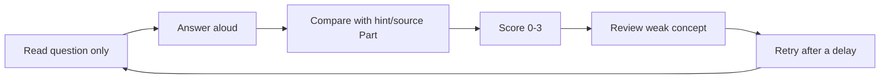
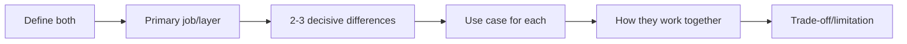
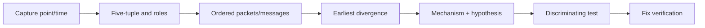
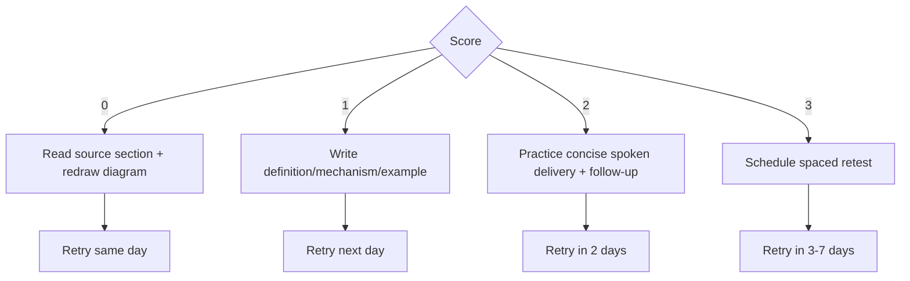
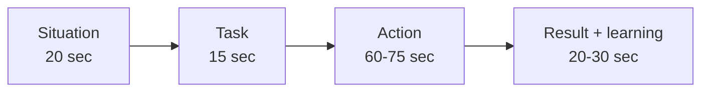

# Part P - Interview Question Bank & Behavioral Closing

> **Section goal:** convert the guide into interview performance through 115 graded technical questions, scenario practice, honest self-assessment, adaptable STAR stories, closing answers, and a night-before review sheet.

Covers index items **114-120**.

[Back to the master guide](../Networking%20Security%20and%20Azure%20Identity%20-%20Study%20Guide.md) | [Previous: Part O](Part-O-miscellaneous-deeper-topics.md)

---

## Start Here: Retrieval, Not Recognition

Reading an answer and thinking "that makes sense" is recognition. An interview requires **retrieval**: producing a clear answer without seeing the notes.

Use this loop:



### Scoring rubric

| Score | Meaning | Action |
|------:|---------|--------|
| 0 | Blank or materially wrong | Relearn the source Part, then retry today |
| 1 | Partial; major prompts needed | Write a 3-line answer and retry tomorrow |
| 2 | Correct but unclear, slow, or missing trade-offs | Practice a 30-60 second spoken answer |
| 3 | Correct, structured, concise, and handles follow-up | Retest in 2-3 days |

Do not memorize the hints word for word. Build answers from definition, mechanism, example, and limitation.

---

## 114. Technical Question Bank: 115 Questions

### Distribution

| Level | Count | Share | Target skill |
|-------|------:|------:|--------------|
| Basic | 23 | 20% | Define and distinguish fundamentals |
| Intermediate | 23 | 20% | Explain mechanisms and common diagnoses |
| Advanced | 69 | 60% | Integrate layers, reason from evidence, discuss trade-offs |
| **Total** | **115** | **100%** | Beginner-to-advanced interview coverage |

### Part map

| Part | Review area |
|------|-------------|
| A | [Networks from Zero](Part-A-networks-from-zero.md) |
| B | [OSI, TCP/IP & Encapsulation](Part-B-osi-tcpip-encapsulation.md) |
| C | [Addressing, Local Delivery & Routing](Part-C-addressing-local-delivery-routing.md) |
| D | [Core Services & Protocol Map](Part-D-core-services-protocol-map.md) |
| E | [TCP, UDP & Sockets](Part-E-tcp-udp-sockets.md) |
| F | [HTTP, HTTPS & APIs](Part-F-http-https-apis.md) |
| G | [TLS, Certificates & PKI](Part-G-tls-certificates-pki.md) |
| H | [Direct, Forward & Reverse Proxies](Part-H-direct-forward-reverse-proxies.md) |
| I | [Firewalls, NGFW & WAF](Part-I-firewalls-ngfw-waf.md) |
| J | [SWG, CASB, DLP, SASE & Connectors](Part-J-swg-casb-dlp-connectors.md) |
| K | [VPNs & IPsec](Part-K-vpn-ipsec.md) |
| L | [Azure Identity & Authentication Protocols](Part-L-azure-identity-auth-protocols.md) |
| M | [Wireshark & Systematic Troubleshooting](Part-M-wireshark-troubleshooting.md) |
| N | [Applied Architecture & Scenarios](Part-N-applied-scenarios.md) |
| O | [Miscellaneous & Deeper Topics](Part-O-miscellaneous-deeper-topics.md) |

### Basic: B01-B23

| ID | Question | Concise answer/hint | Review |
|----|----------|---------------------|--------|
| B01 | What is a computer network? | Endpoints and intermediate devices exchange data over links using shared protocols. | A |
| B02 | Compare LAN, WAN, internet, and intranet. | LAN is local scope; WAN connects distant networks; internet is global interconnection; intranet is private organizational service/network. | A |
| B03 | Compare a switch and a router. | Switch forwards local frames mainly by MAC; router forwards IP packets between networks by route. | A, C |
| B04 | Compare bandwidth, throughput, latency, jitter, and loss. | Capacity, achieved rate, delay, delay variation, and missing data are separate measurements. | A |
| B05 | What are a frame, packet, segment, and payload? | Link PDU, IP PDU, TCP PDU, and data carried inside a layer's wrapper. | A, B |
| B06 | Name the seven OSI layers and each job. | Application, Presentation, Session, Transport, Network, Data Link, Physical; explain responsibility, not only names. | B |
| B07 | Name the four TCP/IP layers. | Application, Transport, Internet, Link/Network Access. | B |
| B08 | What are encapsulation and decapsulation? | Sender adds per-layer control wrappers; receiver reads/removes them upward. | B |
| B09 | Compare IP address, MAC address, and port. | IP routes to interface/network, MAC reaches next local interface, port reaches application endpoint. | B, C, D |
| B10 | What does IPv4 `/24` mean? | First 24 bits are prefix; mask `255.255.255.0`; 256 addresses, traditionally 254 usable hosts. | C |
| B11 | What is a default gateway? | Router/next hop used when no more-specific on-link/route entry handles a remote destination. | C |
| B12 | What are ARP and IPv6 Neighbor Discovery? | ARP maps local IPv4 to MAC; IPv6 uses ICMPv6 ND for neighbors, routers, duplicate detection, and reachability. | C |
| B13 | What does DNS do? | Distributed typed name database; commonly resolves names to addresses through caches, recursive resolvers, and authoritative servers. | D |
| B14 | Explain DHCP DORA. | Discover, Offer, Request, Acknowledge supplies a leased IPv4 address and options. | D |
| B15 | Compare TCP and UDP. | TCP is reliable ordered byte stream with state; UDP is independent best-effort datagrams with app-owned reliability. | E |
| B16 | Explain the TCP three-way handshake. | SYN, SYN-ACK, ACK synchronizes sequence state and options in both directions. | E |
| B17 | Compare HTTP and HTTPS. | HTTPS is HTTP through TLS, or HTTP/3 over QUIC's integrated TLS; HTTP semantics remain. | F, G |
| B18 | What does TLS provide? | Confidentiality, integrity, server authentication, and optional client authentication; not business authorization. | G |
| B19 | Compare forward and reverse proxies. | Forward represents outbound clients; reverse represents inbound applications/backends. | H |
| B20 | Compare firewall and WAF. | Firewall controls network sessions/zones; WAF parses inbound HTTP for web-app policy and attacks. | I |
| B21 | What binary place values make one IPv4 octet? | `128, 64, 32, 16, 8, 4, 2, 1`; add values whose bits are one. | C |
| B22 | What problem do STP and RSTP solve? | They create a loop-free logical Layer 2 topology while retaining redundant physical links. | C |
| B23 | Compare IaaS, PaaS, and SaaS responsibility. | You manage most OS/app layers in IaaS, mainly app/data/config in PaaS, and users/data/tenant settings in SaaS. | O |

### Intermediate: I01-I23

| ID | Question | Concise answer/hint | Review |
|----|----------|---------------------|--------|
| I01 | What happens after entering an HTTPS URL? | Parse/cache/proxy, DNS, route, TCP/QUIC, TLS, HTTP, redirects/cookies/resources, render; some stages reuse/parallelize. | A, F |
| I02 | Find network, broadcast, and usable range for `192.168.10.130/26`. | Block size 64; network `.128`, broadcast `.191`, traditional hosts `.129-.190`. | C |
| I03 | Explain longest-prefix match. | Among matching routes, choose the most-specific/highest prefix length; metric resolves otherwise equivalent choices. | C |
| I04 | Compare routing, NAT, and PAT. | Routing chooses next hop; NAT rewrites addresses; PAT uses ports so flows share an address. | C |
| I05 | Compare recursive resolver and authoritative DNS server. | Recursive resolver obtains/caches final answer for client; authoritative server owns official zone data/referrals. | D |
| I06 | Why are ports clues rather than proof? | Apps can use nonstandard/shared ports, tunnel, and encrypt; behavior/signature and endpoint evidence identify service. | D, I |
| I07 | Compare TCP flow control and congestion control. | Receive window protects receiver; congestion window/algorithm protects path. | E |
| I08 | Compare TCP FIN, RST, and timeout. | FIN gracefully closes a direction; RST aborts; timeout only says an expected event missed a deadline. | E |
| I09 | Compare HTTP 401/403 and 502/504. | 401 authentication, 403 authorization/policy; 502 bad upstream response, 504 upstream timeout. | F |
| I10 | Compare `no-cache` and `no-store`. | `no-cache` allows storage but requires revalidation; `no-store` prohibits cache storage. | F |
| I11 | Why is OAuth 2.0 not authentication, and what does OIDC add? | OAuth authorizes API access; OIDC adds sign-in, ID token, discovery, claims, session semantics. | L |
| I12 | Compare ID, access, and refresh tokens. | Client sign-in identity, API authorization, and token renewal capability are distinct. | L |
| I13 | Compare an Entra app registration and service principal. | Global home-tenant blueprint vs tenant-local enterprise application instance/permissions. | L |
| I14 | What is a managed identity? | Azure-managed workload identity obtains Entra access tokens without developer-managed credentials; target authorization still required. | L |
| I15 | Compare SWG, CASB, and DLP. | SWG governs web path, CASB governs cloud-app use/data, DLP classifies and controls sensitive content/actions. | J |
| I16 | Compare full and split VPN tunnels. | Full routes most traffic through VPN; split routes selected traffic and needs deliberate DNS/security/endpoint policy. | K |
| I17 | What roles do IKEv2 and ESP play? | IKE negotiates/authenticates SAs and keys; ESP protects data with confidentiality/integrity/anti-replay. | K |
| I18 | Compare Wireshark capture and display filters. | BPF capture filter limits recorded data; display filter selects retained packets with protocol fields. | M |
| I19 | Direct access works but proxy access fails. What changes? | Two legs, DNS location, proxy auth/policy, TLS inspection, protocol, timeout, source identity; test each. | H, N |
| I20 | How should you tune a WAF false positive? | Verify legitimacy/rule, scope exclusion narrowly by rule/path/method/field, test, approve, monitor, expire. | I |
| I21 | How does WPA3 improve on WPA2? | WPA3-Personal uses SAE to resist passive offline guessing and add forward secrecy; PMF is required; Enterprise profiles strengthen cryptography. Transition mode retains WPA2 risk. | C |
| I22 | Compare OSPF and BGP. | OSPF is a link-state IGP for shortest paths inside a domain; BGP exchanges policy-rich prefix paths within/between autonomous systems. | C |
| I23 | How does NTP estimate clock error? | It exchanges four timestamps to estimate round-trip delay and offset, samples sources, rejects poor outliers, and disciplines the clock. | D |

### Advanced: A01-A69

| ID | Question | Concise answer/hint | Review |
|----|----------|---------------------|--------|
| A01 | Client capture shows repeated SYN and no reply. What is proven and what next? | Only no reply observed there; compare path/server captures and listener, route, policy, NAT, return path. | E, M |
| A02 | Why can asymmetric routing break a stateful firewall? | Each device sees half the flow and lacks matching state; fix routing/state synchronization rather than allow invalid broadly. | I |
| A03 | How do you correlate a NATed flow across logs? | Normalize time; map original/translated five-tuples and translation state; add process/request/session IDs. | C, M |
| A04 | A site is intermittently slow only when AAAA exists. Diagnose. | Force IPv4/IPv6 separately; inspect address selection, IPv6 DNS/route/firewall/ND/MTU and fallback timing. | O |
| A05 | What is a PMTU black hole and its signature? | Oversized packets drop without usable size feedback; handshake/small data works, large traffic stalls/retransmits. | O |
| A06 | Explain RA, SLAAC, and DHCPv6 responsibilities. | RA supplies prefix/router flags/default-router relationship; SLAAC forms address; DHCPv6 can supply address/options, not default gateway. | O |
| A07 | Why is blocking all ICMP/ICMPv6 harmful? | Breaks errors, traceroute, PMTUD; ICMPv6 also powers ND and essential IPv6 operations. | C, O |
| A08 | Compare DNS `NOERROR` with no answer, `NXDOMAIN`, and `SERVFAIL`. | Name exists/no requested data; proven nonexistent name; resolver could not complete processing. | D, M |
| A09 | Client and proxy resolve one name differently. What can happen? | Split DNS sends proxy upstream to wrong/public/private target; capture client query and proxy resolver/CONNECT behavior. | H, N |
| A10 | Compare DNSSEC, DoH, and DoT. | DNSSEC signs DNS data authenticity/integrity; DoH/DoT encrypt client-resolver transport; neither alone guarantees destination safety. | D, O |
| A11 | Is Wireshark `tcp.analysis.retransmission` proof of network loss? | No; inspect sequence/ACK/SACK plus capture drops, offload, asymmetry, reordering, and second point. | M |
| A12 | Receiver advertises Zero Window. Where do you look? | Receiver application/buffer consumption, CPU, downstream blocking, memory, scaling; sender/path bandwidth is not first cause. | E, M |
| A13 | How can QUIC be reliable over UDP? | QUIC builds ACK, loss recovery, congestion control, TLS, and streams above UDP datagrams. | D, E |
| A14 | Compare packet-loss impact in HTTP/2 and HTTP/3. | HTTP/2 streams share TCP ordering; QUIC recovers per stream so unrelated streams need not wait on one loss. | F, O |
| A15 | A payment POST times out. Why is blind retry dangerous? | Server may have committed before response loss; use idempotency key/status query/deduplication. | F |
| A16 | TLS terminator redirects HTTPS requests endlessly. Likely mechanism? | Backend thinks original scheme is HTTP or host differs; trusted forwarded proto/host and redirect config conflict. | F, H |
| A17 | How can a cache leak personalized data? | Cache key/directives omit identity-varying context; mark private/no-store where needed and validate `Vary`/authorization. | F, N |
| A18 | What causes HTTP request smuggling? | Front/back parsers disagree on message boundaries/length; normalize and reject ambiguity, patch and align components. | H, I |
| A19 | Summarize a TLS 1.3 full handshake. | ClientHello/key share; ServerHello; derived handshake keys; encrypted cert/proof/Finished; client Finished; application keys. | G |
| A20 | Certificate chain is trusted but browser reports mismatch. Why? | Requested hostname/SNI does not match SAN under hostname rules; trust and name validation are separate. | G |
| A21 | TLS fails only on some backends after certificate rotation. Diagnose. | Compare leaf/intermediate/private-key/listener/SNI across nodes; inconsistent chain or key is likely. | G, N |
| A22 | Inspection proxy presents an enterprise Certificate Authority (CA) chain and client sends unknown-CA. Fix? | Validate authorized trust deployment and proxy chain/rotation; narrowly bypass only when approved; never disable validation. | G, N |
| A23 | Why can mTLS fail through a TLS-inspecting proxy? | Proxy terminates TLS and may not pass client-certificate proof end-to-end; use supported pass-through/bypass or designed identity translation. | G, H |
| A24 | Compare SNI, ALPN, and HTTP Host/authority. | TLS name selection, application-protocol negotiation, then HTTP virtual origin/routing; different handshake stages. | G |
| A25 | Compare CRL, OCSP, stapling, and short-lived certificates. | List, online per-cert status, server-carried status, and reduced exposure through frequent renewal; policies/failure modes vary. | G |
| A26 | What source does an origin see through a forward proxy? | Usually proxy's upstream source, not original client; identity/log correlation comes from controlled proxy metadata. | H |
| A27 | How do you trust `X-Forwarded-For` safely? | Block direct backend access, trust named proxies, strip spoofed values at edge, append consistently, parse known hops only. | H |
| A28 | CONNECT returns 200, then HTTPS fails. What did 200 prove? | Client-proxy tunnel accepted only; next inspect TLS name/trust/protocol/inspection and proxy-upstream path. | H |
| A29 | Why can deep load-balancer health probes worsen an outage? | Shared dependency failure marks every app node unhealthy; distinguish liveness, readiness, dependency, and capacity. | N, O |
| A30 | A reverse proxy returns 502 from one backend only. Method? | Pin/correlate backend; compare connect/TLS/protocol/response and node config/logs; remove unhealthy node after evidence. | H, N |
| A31 | Access rule permits flow but NGFW logs a block. Why? | Later decryption, IPS, URL, malware, app, file, or DLP profile can deny after access stage. | I |
| A32 | How does encryption affect application signatures? | Payload features vanish without authorized decryption; use handshake/DNS/reputation/behavior with reduced confidence or endpoint/app telemetry. | I |
| A33 | Place WAF and NGFW in one public-app design. | NGFW governs network/application zone sessions; reverse-proxy WAF inspects HTTP; app still authenticates/authorizes securely. | I, N |
| A34 | How do you reduce DLP false positives without losing control? | Add validation/context/confidence/counts, pilot audit, narrow action/destination, use labels/EDM, review overrides. | J |
| A35 | Compare inline and API CASB controls in an incident. | Inline can block live transfer; API finds/remediates stored data but is delayed/scope/rate dependent; combine evidence. | J |
| A36 | Why do private app connectors use outbound channels? | Avoid public inbound exposure/NAT; broker authorized app flows, but harden connector and restrict its internal reach. | J |
| A37 | What is the risk of `PROXY ...; DIRECT` PAC fallback? | Proxy outage can become fail-open security bypass; choose/document availability vs enforcement and compensating controls. | H, J |
| A38 | Choose VPN or ZTNA for a contractor needing one app. | Prefer identity/device-aware ZTNA for named app; VPN only if required protocols/routes demand it, with segmentation. | J, K |
| A39 | IKE SA is up but site traffic fails. What next? | Child SA/selectors, route, NAT exemption, encrypt/decrypt counters, return route, post-decrypt firewall, MTU/DNS. | K |
| A40 | Why does IPsec NAT-T use UDP 4500? | Encapsulates ESP for NAT/firewall state and carries IKE after NAT detection; native ESP is protocol 50. | K |
| A41 | VPN drops at a regular lifetime interval. Hypothesis? | Rekey/lifetime mismatch, blocked IKE, expired credential, NAT state, or clock; correlate both-peer SA logs/counters. | K |
| A42 | Home and corporate networks both use `192.168.1.0/24`. Symptom/fix? | On-link route may beat VPN; redesign addressing, specific routes/NAT, or app proxy/ZTNA. | K |
| A43 | API rejects a validly signed access token. Why check audience? | Signature proves issuer, not intended resource; API must accept only tokens addressed to its audience. | L |
| A44 | Entra sign-in succeeds, API returns 403. Boundary? | Authentication/token issuance succeeded; inspect API scope/role, assignment, tenant, object/action authorization. | L |
| A45 | Compare delegated and application permissions. | On-behalf-of user with `scp` vs workload-as-itself with app roles/`roles`; admin consent commonly needed for application. | L |
| A46 | How do you avoid Conditional Access tenant lockout? | Report-only/pilot, emergency accounts excluded and monitored, simulations/logs, staged rollout, rollback and dependencies. | L |
| A47 | Rank workload credential choices. | Managed/federated identity where supported, then certificate, then tightly managed secret; least privilege and separate environments. | L |
| A48 | What do `state`, `nonce`, and PKCE protect? | Cross-Site Request Forgery (CSRF)/request binding, ID-token replay binding, and authorization-code interception/client-instance binding. | L |
| A49 | What must a SAML SP validate? | Signature/trusted issuer, audience, recipient/ACS, time, subject conditions, request correlation, replay and key rollover. | L |
| A50 | Kerberos fails by hostname but IP access behaves differently. Why? | SPN and DNS/name drive service ticket; inspect SPN uniqueness, ticket, time, trust, fallback; IP may not map expected SPN. | D, L |
| A51 | Compare External ID B2B and customer CIAM. | Partners access workforce resources under resource tenant; customers use external tenant/customer-facing app lifecycle. | L |
| A52 | Why can host capture show bad TCP checksum on successful flow? | Capture occurs before NIC checksum offload; remote ACK and offload/capture location distinguish wire corruption. | M |
| A53 | How should you report "no server reply" from one capture? | Say no reply was observed at that capture point/time; move observation point and inspect server/policy logs. | M |
| A54 | Correlate client, SWG, Entra, and SaaS events. | UTC time, user/device, pre/post-proxy tuple, SWG transaction ID, Entra correlation ID, SaaS request/session ID. | M, N |
| A55 | Design a secure public web path. | DNS -> CDN/DDoS -> TLS/WAF/reverse proxy -> load balancer -> segmented app/dependencies; identity, authz, HA, logs. | N |
| A56 | Design managed user access to SaaS. | Agent/steering -> SWG/CASB -> Entra Conditional Access/MFA -> SaaS authorization; DLP actions, tenant restriction, correlated logs. | J, N |
| A57 | Azure service should be private to a VNet. What else besides private endpoint? | Private DNS to private IP, routes/NSG, public-access restriction, workload managed identity/RBAC, logs and HA. | L, O |
| A58 | How do retries amplify outages? | Multiplication across client/proxy/service/dependency; use deadlines, budgets, jittered backoff, circuit breaking, idempotency. | O |
| A59 | Why is DNS failover not instantaneous? | Resolver/client caches and TTL, negative caching, connection reuse, health-detection and propagation; test actual clients. | D, O |
| A60 | How do TLS 1.3, ECH, DoH, and QUIC change security controls? | Reduce passive visibility; shift controls to managed endpoints/resolvers, identity-aware edges, app authz/DLP, and terminator telemetry. | O |
| A61 | Allocate 100, 50, 20, and 10-host LANs from one `/24`. | Use VLSM largest-first: `/25`, `/26`, `/27`, `/28`; preserve the remaining aligned block. | C |
| A62 | OSPF neighbors do not become adjacent. What do you compare? | Area, timers, authentication, network type, MTU, duplicate router ID, protocol reachability, and interface state. | C |
| A63 | Why can BGP choose a path that is not lowest latency? | BGP best path is policy/attribute driven: local preference, AS path, origin/MED and platform rules, not a latency probe. | C |
| A64 | Voice degrades only when backup saturates a WAN. Design QoS. | Classify/mark at a trust boundary, bound a priority voice queue, guarantee app share, shape backup, police abuse, and measure the bottleneck. | O |
| A65 | Choose among Traffic Manager, Front Door, Application Gateway, and Load Balancer. | DNS global selection; global inline HTTP edge; regional Layer 7 HTTP/WAF; regional Layer 4 TCP/UDP. | O |
| A66 | How do PIM and access reviews reduce privilege risk? | PIM makes roles eligible/time-bound with controlled activation; reviews remove access no longer justified. | L |
| A67 | What should a beginner prove in the DNS-to-HTTPS Wireshark lab? | DNS answer, TCP handshake, TLS negotiation, protected app records, capture limits, and whether a proxy changed the endpoint. | M |
| A68 | Strong Wi-Fi RSSI but poor throughput: what next? | Inspect SNR, interference, channel use/width, retries, client density, roaming, upstream path, and band compatibility. | C |
| A69 | How do you prove HA rather than merely configure redundancy? | Run approved failure tests across fault domains under load; verify detection, draining, capacity, state, RTO/SLO, recovery, and logs. | O |

---

## 115. Answer Hints, Cross-References, and Delivery Frameworks

Every bank row contains a concise hint and a Part letter. Use the Part map in Section 114 to open the full explanation.

### Definition question: 30 seconds

Use **D-M-E-L**:

1. **Define** it in one sentence.
2. Explain the **mechanism** or primary job.
3. Give one **example**.
4. State one **limitation** or comparison.

Example: "What is a WAF?"

> A WAF is an HTTP-aware security control placed in front of web apps or APIs. It parses requests and applies attack, bot, rate, and application rules, for example blocking a known SQL injection pattern. It cannot replace parameterized queries, application authorization, or secure development.

### Comparison question: 45 seconds



### Troubleshooting question: 2-5 minutes

Use **S-P-E-H-T-V**:

1. **Scope:** exact user/device/time/error and working comparison.
2. **Path:** draw expected DNS, route, proxy, transport, TLS, identity, app sequence.
3. **Evidence:** locate earliest missing or wrong event.
4. **Hypothesis:** name one falsifiable mechanism.
5. **Test:** run cheapest discriminating check or move observation point.
6. **Verify:** prove fix and preserved security; explain prevention.

### Architecture question: 5-10 minutes

Use **A-F-B-C-R-O**:

- **Actors/assets:** users, devices, workloads, apps, data.
- **Flows:** normal, identity, DNS, management, return.
- **Boundaries:** trust, network, tenant, TLS, data.
- **Controls:** primary enforcement and defense in depth.
- **Resilience:** failure domains, timeout/retry, failover, recovery.
- **Observability/ownership:** IDs, logs, Service Level Objective (SLO), policy owner, lifecycle.

### How to use the hint

1. Hide the answer/hint column.
2. Answer aloud from memory.
3. Reveal only after completing the answer.
4. Add what you missed to the tracker.
5. Re-answer without looking.

---

## 116. Packet, Architecture, Comparison, and Troubleshooting Drills

### Drill 1: repeated SYN

**Prompt:** Client capture shows SYN at 0, 1, 3, and 7 seconds with no response. Server team says the app is healthy.

**Strong path:** State what client capture proves; ask for server-side capture and firewall/NAT session logs; verify destination/route/listener/return path; avoid declaring server or firewall root cause from one point.

### Drill 2: TCP works, TLS fails

**Prompt:** SYN/SYN-ACK/ACK completes. ClientHello has SNI `api.example.com`. Server sends certificate for `www.example.com`; client sends alert.

**Conclusion:** Transport works; hostname identity mismatches SAN. Correct SNI/certificate virtual-host mapping rather than opening ports.

### Drill 3: proxy-only failure

**Prompt:** Direct HTTPS works. Through SWG, CONNECT returns 200, enterprise inspection certificate appears, then `unknown_ca`.

**Conclusion:** Client-to-proxy and CONNECT work. Validate managed enterprise CA deployment and served chain; consider narrowly approved bypass for non-inspectable app.

### Drill 4: API 403

**Prompt:** Entra sign-in succeeds. Access token audience is correct and signature/time validate. API returns 403 for delete only.

**Conclusion:** Authentication succeeded. Check required delegated scope/app role and object/action authorization for delete; do not reset password/MFA.

### Drill 5: VPN up, subnet down

**Prompt:** Existing `10.20.0.0/16` works. New `10.30.0.0/16` does not; IKE is established.

**Strong path:** Check local/remote routes, Child SA traffic selectors, crypto policy, NAT exemption, post-decrypt firewall, and encrypt/decrypt counters for the new tuple.

### Drill 6: small works, large stalls

**Prompt:** VPN ping and small API response work; 5 MB upload retransmits indefinitely.

**Hypothesis:** PMTU/MSS issue. Check tunnel overhead, MSS, ICMP Packet Too Big/fragmentation-needed, packet sizes, both directions, and UDP behavior.

### Drill 7: intermittent 502

**Prompt:** Reverse proxy returns 502 for roughly one third of requests.

**Strong path:** Correlate upstream/backend selection, compare node TLS/protocol/config/logs, validate health probes, then remove/fix affected node with post-fix distribution evidence.

### Drill 8: IPv6 delay

**Prompt:** First visit takes six seconds; later visit is fast. Removing AAAA eliminates delay.

**Strong path:** Test IPv6 directly, inspect route/firewall/ND/PMTU and address-racing timing; repair IPv6 or DNS advertisement instead of permanently hiding it without ownership.

### Drill 9: DLP false positive

**Prompt:** A harmless order number matches a payment-card pattern and blocks uploads.

**Strong path:** Add checksum/context/confidence/field scope, pilot in audit, tune exact rule/parameter/app/action, preserve real card detection, monitor override/incident rate.

### Drill 10: secure contractor access

**Prompt:** Contractors on unmanaged devices need one internal ticketing web app for 60 days.

**Design:** External/B2B identity, phishing-resistant MFA and Conditional Access, browser/session controls as required, ZTNA to named app through HA connectors, app role/time-bound lifecycle, DLP/download restrictions, logs and expiry.

### Drill 11: packet trace narration

Use this order:



### Drill 12: whiteboard secure SaaS

Draw:

1. Managed device and steering
2. DNS location
3. SWG/CASB edge and TLS decision
4. SaaS and Entra OIDC/SAML flow
5. DLP action control
6. Correlated telemetry
7. Redundancy/fail-open or fail-closed behavior

### Drill scorecard

| Criterion | 0 | 1 | 2 |
|-----------|---|---|---|
| Scope | Vague | Some context | Exact actor/time/error/comparison |
| Path | Missing | Partial | End-to-end with legs/boundaries |
| Evidence | Guesses | One source | Multi-source and precise wording |
| Hypothesis | None/many | Plausible but vague | One falsifiable mechanism |
| Test | Random reset | Useful but broad | Cheapest discriminating check |
| Fix | Disables control | Symptom workaround | Root mechanism + narrow rollout |
| Verification | "Retest" | Success only | Success + security + regression evidence |

Target at least **11/14** before calling a scenario interview-ready.

---

## 117. Self-Quiz Tracker and Weak-Topic Loop

### Master tracker

| ID/range | First score | Retry 1/date | Retry 2/date | Target score | Weak concept / source Part |
|----------|------------:|--------------|--------------|-------------:|----------------------------|
| B01-B23 |  |  |  | 3 |  |
| I01-I23 |  |  |  | 3 |  |
| A01-A10 |  |  |  | 2+ |  |
| A11-A20 |  |  |  | 2+ |  |
| A21-A30 |  |  |  | 2+ |  |
| A31-A40 |  |  |  | 2+ |  |
| A41-A50 |  |  |  | 2+ |  |
| A51-A60 |  |  |  | 2+ |  |
| A61-A69 |  |  |  | 2+ |  |
| Scenarios 1-12 |  |  |  | 11/14 |  |

### Per-question tracker template

| ID | Date | Score 0-3 | Missing point | Correct 3-line answer | Next review |
|----|------|-----------|---------------|-----------------------|-------------|
|  |  |  |  |  |  |
|  |  |  |  |  |  |
|  |  |  |  |  |  |
|  |  |  |  |  |  |
|  |  |  |  |  |  |

### Weak-topic loop



### Readiness gates

| Gate | Minimum evidence |
|------|------------------|
| Fundamentals | At least 21/23 Basic questions score 3 |
| Mechanisms | At least 19/23 Intermediate score 2+ |
| Advanced reasoning | At least 48/69 Advanced score 2+; none of target-role core topics score 0 |
| Troubleshooting | Three unseen scenarios score 11/14 or higher |
| Whiteboard | Draw SaaS, public app, VPN/ZTNA, and TLS flows from memory |
| Behavioral | Four true stories delivered in under two minutes each |
| Closing | Why role/company/you answers sound specific and evidence-based |

Reading all Parts does not by itself satisfy these gates.

### Three-pass schedule

| Pass | Questions | Method |
|------|-----------|--------|
| 1 | B01-B23 + I01-I23 | Answer all, relearn zeros/ones |
| 2 | A01-A69 in six blocks | About 11-12 per block, then one scenario |
| 3 | Mixed random set | 5 basic, 5 intermediate, 15 advanced, 2 scenarios |

---

## 118. STAR Method and Behavioral Question Bank

**STAR** means Situation, Task, Action, Result.

| Part | What to include | Keep out |
|------|-----------------|----------|
| Situation | Brief context, stakes, constraints | Five minutes of history |
| Task | Your responsibility and success target | Vague "we had to" language |
| Action | Specific steps, reasoning, communication, trade-offs | Credit only to the team or unsupported heroics |
| Result | Measured outcome, learning, prevention | Invented metrics or claiming perfection |

### Two-minute shape



### Behavioral question bank

| ID | Question | What interviewer tests |
|----|----------|------------------------|
| BH01 | Tell me about a difficult technical problem you solved. | Structure, evidence, depth, persistence |
| BH02 | Tell me about a time you did not know the answer. | Honesty, learning, escalation judgment |
| BH03 | Describe an incident you handled under pressure. | Prioritization, calm, communication |
| BH04 | Tell me about a disagreement with another team. | Influence, listening, decision quality |
| BH05 | Describe a mistake you made. | Ownership, correction, prevention |
| BH06 | Tell me about an ambiguous problem. | Scoping, assumptions, experimentation |
| BH07 | Describe improving a repetitive process. | Automation, measurement, adoption |
| BH08 | Tell me about explaining a technical issue to a nontechnical person. | Clarity, audience empathy, accuracy |
| BH09 | Describe balancing security and business availability. | Risk trade-off and governance |
| BH10 | Tell me about prioritizing several urgent requests. | Impact/severity reasoning and communication |
| BH11 | Describe receiving difficult feedback. | Growth and behavior change |
| BH12 | Tell me about preventing recurrence after a failure. | Root cause, systems thinking, verification |

### Competency translation for any background

| Experience you may already have | Interview competency |
|---------------------------------|------------------------|
| Compared working and failing cases | Differential diagnosis |
| Coordinated people to unblock work | Incident/cross-team ownership |
| Wrote a checklist or template | Operational consistency |
| Explained an issue to a customer/manager | Technical communication |
| Challenged an unsafe shortcut | Security/risk judgment |
| Learned a new tool quickly | Technical adaptability |
| Measured before/after outcome | Evidence-based improvement |
| Admitted and corrected an error | Accountability |

### Ready-to-adapt STAR story 1: troubleshooting

Use only true details.

- **Situation:** A user/customer/team could not complete a time-sensitive task; the symptom was broad.
- **Task:** You owned narrowing the failure and restoring service within defined constraints.
- **Action:** Defined exact scope/time/error, drew expected flow, compared working/failing case, tested one hypothesis, correlated evidence, involved the owning team with a precise handoff.
- **Result:** State verified restoration, time/impact reduction, and a concrete prevention such as monitoring/runbook/test.
- **Technical follow-up:** Be prepared to explain why your test discriminated among causes.

### Ready-to-adapt STAR story 2: security vs availability

- **Situation:** A security control blocked legitimate work or a requested bypass created risk.
- **Task:** Preserve required protection while restoring the narrow business path.
- **Action:** Identified exact user/app/data/action, reviewed logs/rule, proposed time-bound least-privilege change, added compensating control, obtained approval, monitored rollout.
- **Result:** Legitimate flow worked, unrelated protection remained, exception gained owner/expiry, and policy was tuned from evidence.

### Ready-to-adapt STAR story 3: learning quickly

- **Situation:** You had to solve a task involving an unfamiliar protocol/tool/system.
- **Task:** Become effective quickly without pretending expertise.
- **Action:** Built a mental model, used primary docs, reproduced safely, asked focused questions, validated with observable results, documented what you learned.
- **Result:** Delivered the task and created reusable notes/checklist; explain one assumption that changed.

### Ready-to-adapt STAR story 4: mistake and prevention

- **Situation:** A decision/configuration/communication from you caused or prolonged an issue.
- **Task:** Limit impact, communicate honestly, and prevent recurrence.
- **Action:** Stopped further change, preserved evidence, disclosed impact, rolled back/corrected, found process/system contributors, added review/test/guardrail.
- **Result:** Quantify only real outcomes; show changed behavior and later proof the guardrail worked.

### Behavioral answer checks

- Is the story true and specific?
- Is your personal contribution clear without erasing the team?
- Did you explain a decision and trade-off?
- Is the result verified and honestly measured?
- Did behavior/system improve afterward?
- Can you deliver it in under two minutes?

---

## 119. Why This Move, Why This Company, Why You, and Questions to Ask

### "Why networking/security?"

Adapt this structure:

> "I am drawn to networking and security because they combine systems thinking with visible evidence. A user symptom can involve DNS, routing, TLS, identity, policy, and application behavior, and I enjoy narrowing that complexity into a testable explanation. I have been building the fundamentals and practicing packet/log-based scenarios so I can contribute with disciplined troubleshooting rather than guesses."

Replace generic claims with one true example from your work or learning.

### "Why this role?"

Use three links:

1. Role problems you want to solve
2. Evidence from your experience/learning
3. Growth and contribution you expect

> "This role sits at the intersection of customer impact, network/security controls, and technical investigation. My strength is structuring ambiguous issues, communicating clearly, and following evidence across teams. I want to apply that while deepening hands-on expertise in the specific platform and operational environment."

### "Why this company?"

Research and name:

- Product/customer problem
- Technical/security architecture or market position
- Recent strategy/release/challenge
- Team/role mandate
- One honest reason it matches your values or strengths

Avoid answers that work unchanged for every company.

### "Why should we hire you?"

Use **requirement -> evidence -> outcome**:

> "You need someone who can learn complex systems, diagnose across boundaries, and communicate under pressure. In [true example], I [specific action] and achieved [verified result]. My networking/security preparation adds a structured protocol model and hands-on troubleshooting framework, so I can contribute immediately while continuing to deepen product-specific knowledge."

### Honest gap answer

> "I have not yet operated that specific product in production. I do understand the underlying control and traffic flow, and I would close the product gap by reproducing in a lab, using your runbooks and vendor documentation, shadowing real cases, and validating my first changes with an experienced reviewer."

Do not turn a gap into a false claim.

### Questions to ask the interviewer

Choose 4-6 that were not already answered:

1. What are the most common technical failure patterns this person investigates?
2. What does a strong first 90 days look like in measurable terms?
3. Which traffic, identity, and security platforms are central to the environment?
4. How do teams correlate packet, proxy/firewall, identity, and application evidence today?
5. Where are current observability gaps or manual handoffs?
6. How are security exceptions approved, monitored, and retired?
7. What is the balance among incident response, proactive engineering, and customer communication?
8. Which skills distinguish good performers from exceptional ones after a year?
9. How are architecture decisions and post-incident actions reviewed?
10. What upcoming migration or protocol change will most affect this team?
11. How does the team practice or test failover and recovery?
12. What support exists for labs, certifications, mentoring, and product depth?

### Closing statement

> "The conversation reinforced my interest because the role requires structured troubleshooting across network, security, and identity boundaries. My strongest fit is turning ambiguous symptoms into clear evidence and coordinated action. I would be excited to bring that approach while learning your platform and contributing to the priorities we discussed."

Keep it specific to the actual conversation.

---

## 120. One-Page Night-Before Cheat Sheet

### Packet journey

```text
Name -> DNS answer -> route/next hop -> local MAC -> transport -> TLS -> HTTP/app -> identity/authz -> dependency
```

### Layer recall

| Layer idea | Recall |
|------------|--------|
| Switch / frame / MAC | Local Layer 2 delivery |
| Router / packet / IP | Between networks; longest prefix |
| TCP/UDP / port | Process transport behavior |
| TLS | Channel confidentiality, integrity, authentication |
| HTTP | Request/response application semantics |
| Identity | Authenticate principal; resource authorizes action |

### Must-not-confuse pairs

| X | Y |
|---|---|
| Bandwidth: capacity | Throughput: achieved rate |
| Latency: delay | Jitter: delay variation |
| Routing: choose next hop | NAT: rewrite tuple |
| ARP: IPv4 neighbor mapping | ND: IPv6 ICMPv6 neighbor/router functions |
| TCP: ordered byte stream | UDP: independent datagrams |
| Flow control: receiver | Congestion control: path |
| FIN: graceful direction close | RST: abort |
| 401: authenticate | 403: forbidden/authorize |
| 502: bad upstream response | 504: upstream timeout |
| Forward proxy: clients | Reverse proxy: servers |
| NGFW: broader session/app control | WAF: inbound HTTP app protection |
| SWG: web egress | CASB: cloud-app governance |
| DLP: sensitive data/action | Encryption: confidentiality |
| VPN: routed tunnel | ZTNA: brokered app access |
| OAuth: API authorization | OIDC: authentication layer |
| ID token: client sign-in | Access token: API audience |
| App object: blueprint | Service principal: tenant instance |
| Capture filter: record less | Display filter: show less |

### Core flows

- **TCP open:** SYN -> SYN-ACK -> ACK.
- **DNS:** stub -> recursive cache -> root/TLD/authoritative as needed.
- **DHCP:** Discover -> Offer -> Request -> Acknowledge.
- **TLS 1.3:** ClientHello/key share -> ServerHello -> protected cert/proof/Finished -> client Finished -> app data.
- **OIDC code + PKCE:** authorize -> sign-in/Conditional Access -> code -> token redemption with verifier -> ID/access tokens.
- **IKEv2:** IKE_SA_INIT -> IKE_AUTH/Child SA -> ESP data.

### Troubleshooting spine

```text
Scope -> draw path -> earliest failed event -> one hypothesis -> cheapest discriminating test -> narrow fix -> verify behavior + security
```

### Error cues

| Cue | First boundary |
|-----|----------------|
| `NXDOMAIN` | Name proven nonexistent in DNS response context |
| SYN retries | TCP path/listener/policy/return path |
| RST | Active abort/reject; identify generator |
| Unknown Certificate Authority (CA)/name mismatch | TLS certificate validation |
| 407 | Forward proxy authentication |
| WAF rule ID / 403 | HTTP policy/authorization; identify generator |
| Wrong token audience | API token validation/configuration |
| VPN up, no traffic | Child SA/selectors/routes/counters/firewall |
| Small works, large stalls | PMTU/MSS/fragmentation signal |
| Zero Window | Receiver/app not draining buffer |

### Senior phrases

- "At this capture point, we observed..."
- "The earliest failed expected event is..."
- "My current falsifiable hypothesis is..."
- "The cheapest test that separates these causes is..."
- "That status proves this layer responded; it does not prove..."
- "The primary enforcement point must see the user, action, application, and data."
- "I would make a narrow, time-bound change with rollback and verify the control remains effective."

### Interview-day rules

1. Clarify before solving.
2. State assumptions.
3. Draw the path.
4. Separate facts from hypotheses.
5. Explain trade-offs.
6. Admit unknowns and name how you would learn/test.
7. Never propose disabling a major security control globally.
8. End with verification and prevention.

### Final readiness check

- Can you draw TCP, DNS, TLS, proxy, VPN, Entra/OIDC, SaaS, and public-app flows from memory?
- Can you answer 25 random bank questions without notes?
- Can you solve two unseen scenarios using evidence rather than product guesses?
- Do you have four true STAR stories?
- Are company/role answers specific?
- Do you have 4-6 thoughtful questions for the interviewer?

If not, review only the weak tracker entries rather than rereading everything.

> 💡 **Tie-in for any background:** You do not need to pretend you have seen every protocol failure. Strong candidates define the problem, use fundamentals, state uncertainty precisely, and identify the evidence that would decide the next step.

---

## ⭐ Likely Interview Questions for This Section

**Q1. Walk me through your troubleshooting approach.**

> *Model answer:* I define the exact actor, time, error, scope, and working comparison; draw the expected DNS-to-application path; locate the earliest missing event with logs/captures; form one falsifiable hypothesis; run the cheapest discriminating test; then apply a narrow fix and verify service plus security.

**Q2. How do you answer when you do not know a protocol or product detail?**

> *Model answer:* I state what I know from underlying layers, identify the unknown without bluffing, explain the evidence or primary documentation needed, and propose a safe test. I separate product syntax from protocol behavior and ask a focused clarifying question.

**Q3. Design secure employee access to SaaS and private apps.**

> *Model answer:* Use Entra identity with strong authentication and Conditional Access; steer web/SaaS through SWG/CASB with DLP; broker private apps through ZTNA and outbound HA connectors; use endpoint posture, least privilege, correlated logs, resilient DNS/edges, and explicit failure policy.

**Q4. How do you balance security and availability?**

> *Model answer:* Start with asset/data risk and the Service Level Objective (SLO), choose primary enforcement and failure behavior explicitly, use redundancy and narrow exceptions with owner/expiry, stage changes, monitor both block and bypass risk, and test recovery. I avoid permanent broad bypasses disguised as availability fixes.

**Q5. Explain a strong packet-capture conclusion.**

> *Model answer:* State capture location/time/quality, exact tuple, ordered observed messages, earliest divergence, mechanism and alternatives, then the next discriminating test. Say "not observed here" rather than making global absence claims.

**Q6. What are your current development priorities?**

> *Model answer:* I would name two honest gaps tied to the role, such as deeper hands-on product operation and faster packet interpretation, then describe my lab, question-retrieval, documentation, and mentored-case plan with measurable checkpoints.

**Q7. Why should we hire you for a networking/security role?**

> *Model answer:* Connect the role's needs to true evidence: structured ambiguity reduction, cross-team communication, careful risk judgment, and rapid technical learning. Give one verified example and explain how this guide's protocol and scenario practice prepares you to contribute while learning the environment.

**Q8. What would you do in your first 30 days?**

> *Model answer:* Learn architecture, products, escalation paths, logs, and change controls; shadow incidents; reproduce common flows in a lab; validate access and recovery; document top failure patterns; own small cases with review; and agree on measurable 30/60/90 outcomes with the manager.

---

## 🧠 30-Second Memory Hooks

- **Recognition feels easy; retrieval wins interviews.**
- **115 technical: 23 basic, 23 intermediate, 69 advanced.**
- **Definition: define, mechanism, example, limitation.**
- **Troubleshoot: scope, path, evidence, hypothesis, test, verify.**
- **Architecture: actors, flows, boundaries, controls, resilience, observability.**
- **STAR: brief context, your task, specific actions, verified result.**
- **Never invent metrics, experience, or certainty.**
- **A gap plus a credible learning/test plan is stronger than bluffing.**
- **Ask questions that reveal problems, evidence, ownership, and success.**
- **End every answer with trade-off, evidence, or verification.**

---

*Guide complete. Return to the [master study guide](../Networking%20Security%20and%20Azure%20Identity%20-%20Study%20Guide.md), use the six-day plan for the first pass, then use this Part for spaced retrieval and mock interviews.*