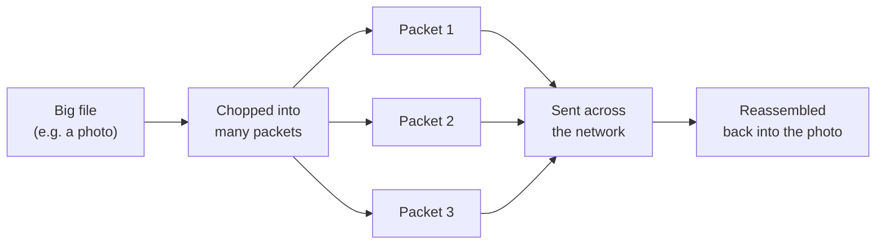
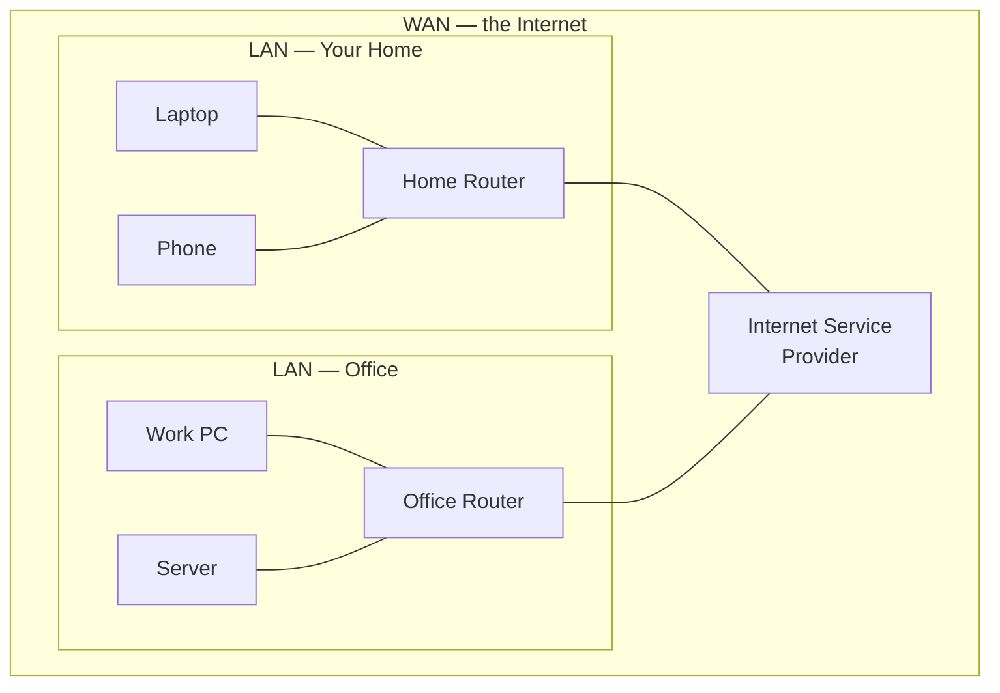
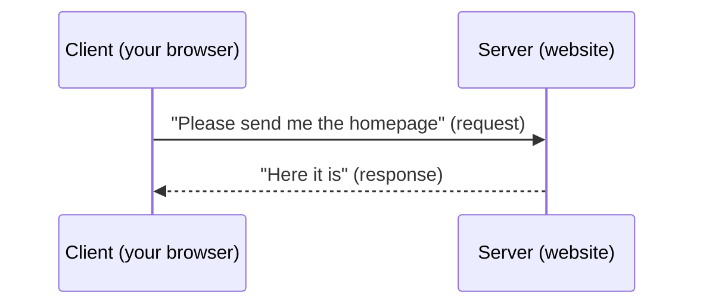
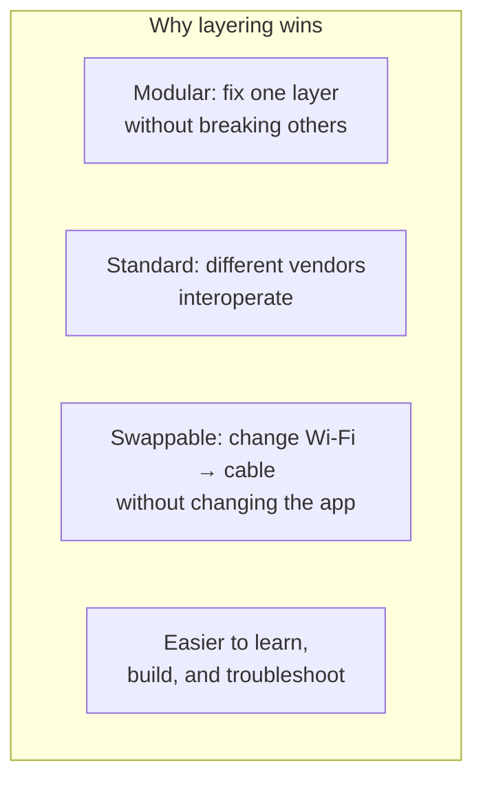

# Part A — Networking from Zero: What Is a Network?

> **Goal of this Part:** Start from absolutely nothing and build the vocabulary and mental models you need for everything else. By the end you'll know what a network *is*, the pieces it's made of, and the single biggest idea in all of networking: **layering**.

---

## A.0 The one-sentence definition

> **A network is two or more devices connected so they can share data.**

That's it. Your phone talking to Wi-Fi, two laptops sharing a file, Google's servers answering your search — all networks.

🔍 **Plain-English deep-dive:** Think of a network like a **postal system for a city**. People (devices) write letters (data), drop them in mailboxes, and the postal service (the network) figures out how to carry each letter to the right house. Everything we learn — addresses, routing, protocols — is just the postal system getting smarter and faster.

---

## A.1 The core vocabulary (learn these 8 words)

| Term | Plain meaning | Analogy | Memory hook |
|------|---------------|---------|-------------|
| **Host** | Any device that uses the network (PC, phone, server) | A person sending/receiving mail | "Host = the one who *hosts* or uses data" |
| **Node** | Any device *on* the network, including the in-between gear | Any building mail passes through | "Node = a dot on the map" |
| **Link** | The connection between two nodes (cable or wireless) | A road between buildings | "Link = the road" |
| **Packet** | A small chunk of data with an address on it | A single addressed envelope | "Big message → many envelopes" |
| **Protocol** | Agreed rules for how to communicate | A shared language + etiquette | "Proto-col = the *rulebook*" |
| **Bandwidth** | How much data a link can carry per second | Width of the road (lanes) | "Band-WIDTH = how WIDE the pipe" |
| **Latency** | The delay before data arrives | How long the drive takes | "Latency = *late*-ncy = delay" |
| **Throughput** | The data you *actually* get through | Real traffic flow after jams | "Throughput = what really got *through*" |

> **Bandwidth vs latency (classic interview trip-up):** Bandwidth is *capacity*; latency is *delay*. A truck full of hard drives has huge bandwidth but terrible latency. A text message has tiny bandwidth needs but you want low latency.

---

## A.2 What gets sent: bits, bytes, and packets

- A **bit** is a single `0` or `1` — the smallest unit of data.
- 8 bits = 1 **byte**.
- Data is too big to send all at once, so it's chopped into **packets** — small pieces, each wrapped with addressing info.

🔍 **Why chop data into packets?** If you mailed a whole book in one giant box and it got lost, you'd lose everything. Mail it as numbered pages and (a) they can take different roads, (b) a lost page can be resent alone, and (c) many people can share the same roads. This is called **packet switching** and it's the foundation of the Internet.

---

## A.3 Network sizes: LAN, WAN, MAN

| Type | Stands for | Size | Example | Analogy |
|------|-----------|------|---------|---------|
| **LAN** | Local Area Network | One building/home | Your home Wi-Fi | A single house's rooms |
| **WAN** | Wide Area Network | City → globe | The Internet itself | The national highway system |
| **MAN** | Metropolitan Area Network | A city | A city's fiber network | One city's road grid |
| **PAN** | Personal Area Network | Around you | Bluetooth earbuds | Things in your pockets |
| **WLAN** | Wireless LAN | A LAN over Wi-Fi | Home/office Wi-Fi | A house with no wires |

> **The Internet** (capital I) = the one global network everyone shares. An **internet** (lowercase) = any set of connected networks. *Internet = "inter-network."*

---

## A.4 Who talks to whom: clients, servers, peers

- **Client** — asks for something (your browser requesting a webpage). *Client = customer.*
- **Server** — provides something (the machine holding the webpage). *Server = waiter who serves.*
- **Peer-to-peer (P2P)** — devices act as both client and server (file-sharing apps, video calls). *Peers = equals.*

---

## A.5 Circuit switching vs packet switching

| | Circuit switching | Packet switching |
|--|-------------------|------------------|
| **Idea** | Reserve a dedicated path the whole time | Share roads; send independent packets |
| **Classic example** | Old telephone calls | The Internet |
| **Pros** | Steady, predictable | Efficient, resilient, scalable |
| **Cons** | Wastes capacity when idle | Packets can arrive out of order/late |
| **Analogy** | Renting an entire private road | Using public roads with everyone else |

> The Internet uses **packet switching** — it's why one cut cable doesn't kill everything; packets just reroute.

---

## A.6 The BIG idea: why networking uses "layers"

This is the most important concept in the whole guide.

Networking is **hard**: signals on wires, finding addresses, recovering lost data, displaying a webpage. Doing all of that in one giant blob of rules would be impossible to build or fix.

So engineers split the job into **layers** — each layer does ONE job and talks only to the layers directly above and below it.

🔍 **Plain-English deep-dive — the shipping company analogy:**
Imagine shipping a gift overseas:
- **You** wrap the gift and write the address (you don't care *how* planes fly).
- The **post office** sorts and labels it (doesn't care what's inside).
- The **airline** flies the box (doesn't care about the address details).
- The **truck driver** does the final delivery.

Each layer trusts the others to do their job. You can swap the airline for a ship without changing how you wrapped the gift. **That swappability is the whole point of layering.**

The two famous layer models are:
- **OSI model** — 7 layers, the teaching/reference standard → **Part B**
- **TCP/IP model** — 4–5 layers, what the real Internet runs → **Part C**

Everything else in this guide hangs off these layers. Nail this idea and the rest clicks into place.

---

## ⭐ Likely Interview Questions

1. **What is a network?**
   *Two or more devices connected to share data and resources, using agreed rules called protocols.*

2. **Difference between bandwidth and latency?**
   *Bandwidth is the maximum data capacity of a link (lanes on a road); latency is the delay before data arrives (travel time). High bandwidth ≠ low latency.*

3. **What is a packet and why do we break data into packets?**
   *A packet is a small chunk of data with addressing info. Breaking data up enables sharing links, rerouting around failures, and resending only lost pieces — this is packet switching.*

4. **LAN vs WAN?**
   *A LAN covers a small area like a home/office; a WAN spans large distances (cities to the globe). The Internet is the largest WAN.*

5. **Client vs server vs peer-to-peer?**
   *A client requests services, a server provides them; in P2P every device is both client and server.*

6. **Circuit switching vs packet switching?**
   *Circuit switching reserves a dedicated path (old phone calls); packet switching shares paths with independent packets (the Internet) — more efficient and resilient.*

7. **Why do networks use a layered model?**
   *To split a hard problem into independent, swappable jobs — making networks modular, standardized, interoperable, and easier to troubleshoot.*

8. **What's the difference between throughput and bandwidth?**
   *Bandwidth is theoretical max capacity; throughput is the actual data delivered after real-world losses and congestion.*

---

## 🧠 30-Second Memory Hooks

- **Network = devices + links + rules (protocols).**
- **Bandwidth = how wide the pipe; latency = how long the wait.**
- **Packet = one addressed envelope; big data = many envelopes.**
- **LAN = local, WAN = wide (Internet = biggest WAN).**
- **Client asks, server serves, peers are equals.**
- **Layering = split the hard job into swappable parts** — the #1 idea in networking.

---

➡️ **Next up:** [Part B — The OSI Model](Part-B-OSI-Model.md) — the 7-layer map that every networking conversation is built on.
