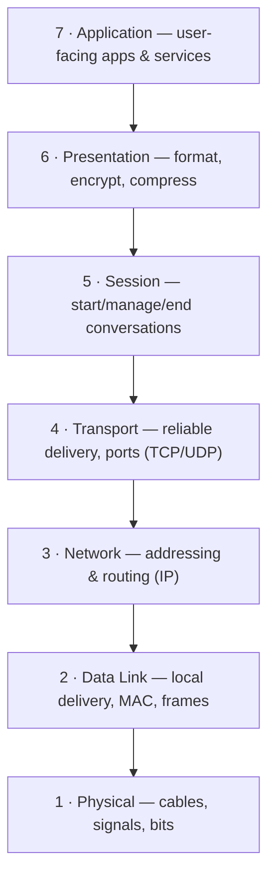
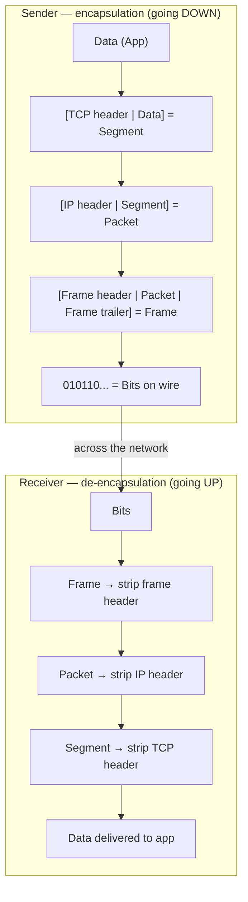
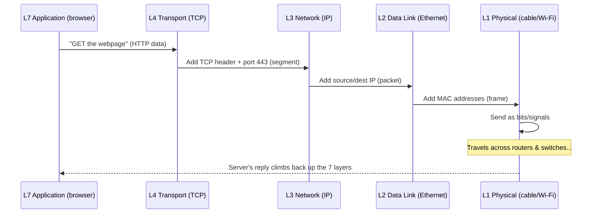

# Part B — The OSI Model (the 7-Layer Mental Map)

> **Goal of this Part:** Learn the single most-asked networking framework. The OSI model is a 7-layer map that explains *where* every protocol, device, and problem lives. Interviewers love it because if you know the layers, you can reason about almost anything.

---

## B.0 What "OSI" means and why it exists

**OSI = Open Systems Interconnection.** It's a **reference model** (a teaching/standard map, not actual software) created by the ISO standards body in 1984.

> It splits network communication into **7 layers**, each with one job. Data flows **down** the layers on the sending device and **up** the layers on the receiving device.

🔍 **Plain-English deep-dive:** OSI is like the **org chart of a delivery company**. Each department (layer) handles one task and hands off to the next. The CEO doesn't drive the truck; the driver doesn't design the product. By knowing the chart, when something breaks you instantly know *which department* to call.

---

## B.1 The 7 layers (top to bottom)

The classic memory phrase, **top → bottom**:

> **All People Seem To Need Data Processing**
> (Application, Presentation, Session, Transport, Network, Data Link, Physical)

Or **bottom → top** (the way data is built):

> **Please Do Not Throw Sausage Pizza Away**
> (Physical, Data Link, Network, Transport, Session, Presentation, Application)

---

## B.2 Each layer explained (with analogy + what lives there)

### Layer 7 — Application
- **Job:** The layer *closest to you* — provides network services to apps. (Note: it's the browser's networking *interface*, not the browser itself.)
- **Analogy:** The **front desk** where you actually make your request.
- **Examples:** HTTP/HTTPS (web), DNS, SMTP (email), FTP, DHCP.
- **Memory hook:** "Layer 7 = what you *see and use*."

### Layer 6 — Presentation
- **Job:** Translate data into a usable format — **encryption, compression, encoding** (e.g., turning data into JPEG, or TLS encryption).
- **Analogy:** A **translator + gift-wrapper** — makes sure both sides understand the format and it's secured.
- **Examples:** TLS/SSL, JPEG, ASCII, Unicode, encryption.
- **Memory hook:** "Presentation = *format & encrypt*."

### Layer 5 — Session
- **Job:** Set up, manage, and tear down **conversations (sessions)** between two devices; handles re-syncing if a connection drops.
- **Analogy:** The **phone operator** who opens the call, keeps it organized, and hangs up at the end.
- **Examples:** Session establishment, NetBIOS, RPC.
- **Memory hook:** "Session = the *conversation* manager."

### Layer 4 — Transport ⭐ (very important)
- **Job:** End-to-end delivery between programs. Chops data into **segments**, adds **port numbers**, and chooses **reliable (TCP)** or **fast (UDP)** delivery. Handles flow control and error recovery.
- **Analogy:** The **shipping manager** deciding "guaranteed signed delivery (TCP)" vs "cheap fast postcard (UDP)," and labeling which department it's for (ports).
- **Examples:** **TCP, UDP**, port numbers.
- **Memory hook:** "Transport = TCP/UDP + ports." (Full detail in **Part E**.)

### Layer 3 — Network ⭐ (very important)
- **Job:** **Logical addressing (IP)** and **routing** — finding the best path across many networks.
- **Analogy:** The **GPS + street addresses** that get a letter across cities.
- **Examples:** **IP (IPv4/IPv6)**, ICMP (ping), routers, OSPF/BGP/EIGRP.
- **Memory hook:** "Network layer = IP + routers." (Detail in **Parts D, G–J**.)

### Layer 2 — Data Link ⭐ (very important)
- **Job:** Reliable delivery on the **local** link using **MAC addresses**; packages data into **frames**; switches live here.
- **Analogy:** The **local mail carrier** who knows every house on *this* street by name.
- **Examples:** **MAC addresses, Ethernet, switches, VLANs, ARP, STP**.
- **Sub-layers:** **LLC** (Logical Link Control) + **MAC** (Media Access Control).
- **Memory hook:** "Data Link = MAC + frames + switches." (Detail in **Part F**.)

### Layer 1 — Physical
- **Job:** Move raw **bits** as electrical, light, or radio signals over the medium.
- **Analogy:** The **actual roads, cables, and trucks**.
- **Examples:** Cables (copper/fiber), Wi-Fi radio, hubs, voltages, connectors (RJ-45).
- **Memory hook:** "Physical = cables, signals, bits."

---

## B.3 Quick-reference table (memorize this)

| # | Layer | Job (one line) | Data unit (PDU) | Examples | Devices |
|---|-------|----------------|-----------------|----------|---------|
| 7 | Application | User-facing network services | Data | HTTP, DNS, SMTP, FTP | — |
| 6 | Presentation | Format, encrypt, compress | Data | TLS, JPEG, ASCII | — |
| 5 | Session | Start/manage/end sessions | Data | RPC, NetBIOS | — |
| 4 | Transport | Reliable/fast delivery + ports | **Segment** | TCP, UDP | — |
| 3 | Network | Logical addressing + routing | **Packet** | IP, ICMP | **Router** |
| 2 | Data Link | Local delivery via MAC | **Frame** | Ethernet, ARP, STP | **Switch** |
| 1 | Physical | Raw bits on the wire | **Bits** | Cables, Wi-Fi | **Hub** |

> **PDU = Protocol Data Unit** = the name for the data chunk at each layer. Remember the journey: **Data → Segment → Packet → Frame → Bits.**
> Memory hook: **"Some People Fear Birthdays"** (Segment, Packet, Frame, Bits — layers 4→1).

---

## B.4 Encapsulation & de-encapsulation (the envelope idea)

As data goes **down** the layers on the sender, each layer wraps it in its own **header** (like nested envelopes). This is **encapsulation**. On the receiver, each layer **opens** its envelope going **up** — **de-encapsulation**.

🔍 **Plain-English deep-dive:** Picture mailing a letter. You put the **letter** (data) in an **envelope with the person's name** (Transport/port), inside a **bigger envelope with the city address** (Network/IP), handed to a **local courier who knows the street** (Data Link/MAC). Each handler reads only *their* envelope. The receiver opens them in reverse order. **Each layer adds its own envelope on the way out and removes it on the way in.**

---

## B.5 A real example: loading a web page through OSI

---

## B.6 OSI vs reality (a key honest note)

The OSI model is a **teaching/reference tool**. The actual Internet runs on the **TCP/IP model** (Part C), which merges some OSI layers. But OSI is still *the* language interviewers and engineers use to *describe* and *troubleshoot* networks — e.g., "that's a Layer 2 problem" or "a Layer 7 firewall."

---

## ⭐ Likely Interview Questions

1. **Name the 7 OSI layers in order.**
   *Application, Presentation, Session, Transport, Network, Data Link, Physical (top→bottom). Mnemonic: "All People Seem To Need Data Processing."*

2. **What happens at the Transport layer?**
   *End-to-end delivery between programs using ports; chooses TCP (reliable) or UDP (fast), and handles segmentation, flow control, and error recovery.*

3. **What's the difference between Layer 2 and Layer 3 addressing?**
   *Layer 2 uses MAC addresses for local delivery within a network (switches); Layer 3 uses IP addresses for routing across networks (routers).*

4. **What is encapsulation?**
   *The process of each layer adding its own header (and sometimes trailer) as data moves down the stack: Data → Segment → Packet → Frame → Bits. The receiver de-encapsulates going up.*

5. **What PDU exists at each layer?**
   *Transport = segment, Network = packet, Data Link = frame, Physical = bits; upper layers (5–7) = data.*

6. **Which devices operate at which layers?**
   *Hubs at Layer 1, switches at Layer 2, routers at Layer 3. (Firewalls can span Layers 3–7.)*

7. **Why does the OSI model matter if the Internet uses TCP/IP?**
   *OSI is the universal reference language for describing and troubleshooting networks; it pinpoints exactly where a function or problem lives.*

8. **At which layer does encryption like TLS happen?**
   *Conceptually the Presentation layer (6) in OSI; in practice TLS sits between Transport and Application.*

---

## 🧠 30-Second Memory Hooks

- **"All People Seem To Need Data Processing"** = layers 7→1.
- **"Please Do Not Throw Sausage Pizza Away"** = layers 1→7.
- **PDUs: Data → Segment → Packet → Frame → Bits.**
- **Switch = L2 (MAC), Router = L3 (IP), Hub = L1.**
- **Encapsulation = nested envelopes; each layer adds its own header.**
- **Transport (4) = TCP/UDP + ports; Network (3) = IP + routing; Data Link (2) = MAC + switches.**

---

➡️ **Next up:** [Part C — The TCP/IP Model](Part-C-TCPIP-Model.md) — the streamlined model the real Internet actually runs on, and how it maps to OSI.
