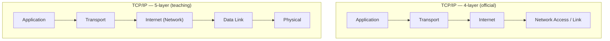
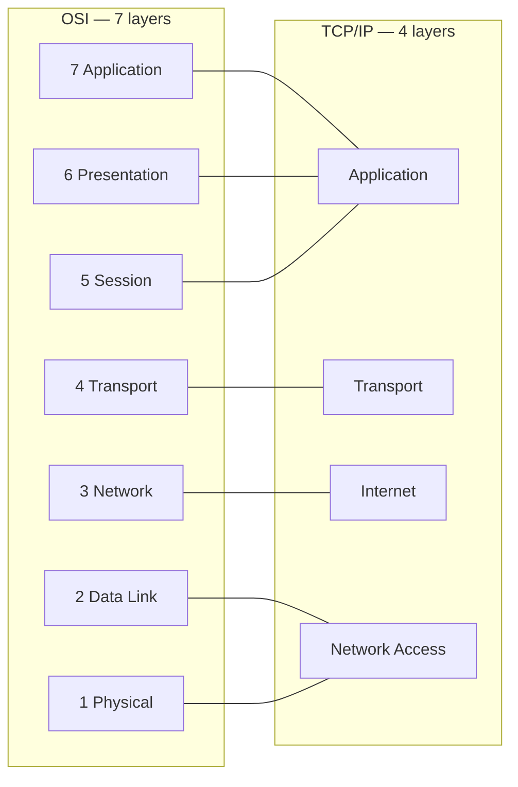
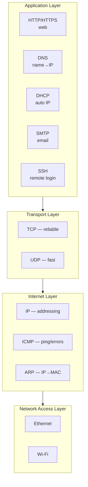
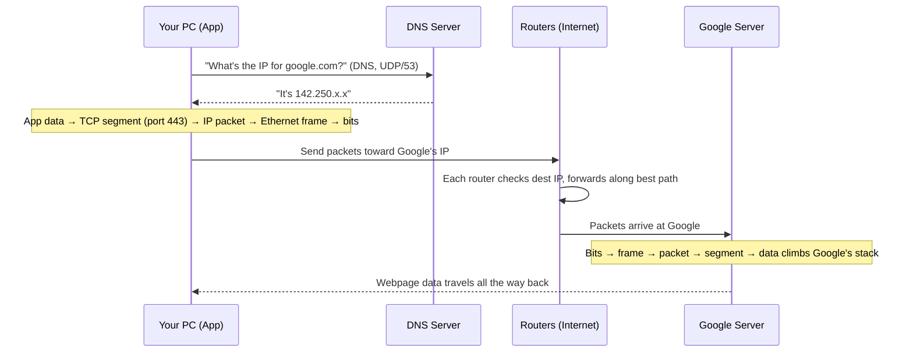

# Part C — The TCP/IP Model (What the Real Internet Uses)

> **Goal of this Part:** OSI is the *map*; TCP/IP is the *actual machine* the Internet runs on. Learn its layers, how they map to OSI, why it won, and trace a real packet end-to-end.

---

## C.0 What "TCP/IP" means

**TCP/IP = Transmission Control Protocol / Internet Protocol** — named after its two most important protocols, but it's really a whole **suite** (family) of protocols. It's also called the **Internet Protocol Suite** or the **DoD model** (the US Department of Defense funded its origin in the 1970s).

> Unlike OSI (a theoretical reference), **TCP/IP is what your computer actually implements** to get on the Internet right now.

🔍 **Plain-English deep-dive:** If OSI is the *textbook diagram* of how a car *should* be organized, TCP/IP is the *actual car you drive*. It does the same job with fewer, more practical parts.

---

## C.1 The 4 layers (and the 5-layer variant)

TCP/IP is usually drawn with **4 layers**. Many textbooks split the bottom one to make **5 layers** (so it lines up more cleanly with OSI). Know both — interviewers ask either.

| TCP/IP layer | Job | Key protocols |
|--------------|-----|---------------|
| **Application** | Everything user-facing + formatting + sessions | HTTP, HTTPS, DNS, DHCP, FTP, SMTP, SSH |
| **Transport** | End-to-end delivery + ports | **TCP, UDP** |
| **Internet** | Logical addressing + routing across networks | **IP**, ICMP, ARP, routing protocols |
| **Network Access (Link)** | Put data on the physical medium locally | Ethernet, Wi-Fi, MAC, cables |

---

## C.2 How TCP/IP maps to OSI (the must-know table)

| OSI layers | Merge into TCP/IP layer |
|------------|-------------------------|
| 7 Application + 6 Presentation + 5 Session | **Application** |
| 4 Transport | **Transport** |
| 3 Network | **Internet** |
| 2 Data Link + 1 Physical | **Network Access** |

> **One-liner to memorize:** *"TCP/IP squishes OSI's top 3 into one and bottom 2 into one — leaving Transport and Internet in the middle."*

---

## C.3 Why TCP/IP won over OSI

| Reason | Explanation |
|--------|-------------|
| **It shipped first & worked** | TCP/IP was running real networks (ARPANET) while OSI was still a committee document. |
| **Free & open** | No licensing; anyone could implement it. |
| **Simpler** | 4 practical layers vs 7 theoretical ones. |
| **Government + university backing** | US DoD and universities adopted it early. |
| **"Good enough" beats "perfect"** | Classic engineering lesson — working code beat a perfect spec. |

> Interview gold: *"OSI is the model we **describe** networks with; TCP/IP is the model we **run** networks on."*

---

## C.4 The protocols you'll meet at each layer

- **DNS** — turns `google.com` into an IP address. *Like a phone book.*
- **DHCP** — hands your device an IP automatically when you join a network. *Like a hotel assigning you a room.*
- **ARP** — finds the MAC address for a known IP on the local network. *Like asking "who has this address?" in the room.* (More in Part D.)
- **ICMP** — the messenger for errors and `ping`. *Like a "delivery failed" postcard.*

---

## C.5 End-to-end journey: typing `google.com` and hitting Enter

This ties Parts A–C together. Follow the data down your stack, across the Internet, and up Google's stack.

**Step-by-step in words:**
1. **DNS lookup** (Application) — your PC asks a DNS server to translate `google.com` to an IP.
2. **TCP handshake** (Transport) — your PC and Google agree to talk reliably (Part E covers the 3-way handshake).
3. **Encapsulation** (down the stack) — HTTP data → TCP segment → IP packet → Ethernet frame → bits.
4. **Routing** (Internet) — routers forward the packet hop-by-hop toward Google's IP using routing tables (Parts G–J).
5. **Local delivery** (Network Access) — switches and MAC addresses move frames within each local network (Part F).
6. **De-encapsulation** (up Google's stack) — bits rebuild into the request; Google's web server responds.
7. **Reply** — the whole process runs in reverse, and your browser renders the page.

---

## C.6 OSI vs TCP/IP — side-by-side summary

| | OSI | TCP/IP |
|--|-----|--------|
| **Layers** | 7 | 4 (or 5) |
| **Type** | Reference/theoretical | Practical/implemented |
| **Created by** | ISO | US DoD / DARPA |
| **Use today** | Teaching & troubleshooting language | Runs the actual Internet |
| **Transport options** | Defined generally | TCP & UDP specifically |
| **Flexibility** | Strict layer separation | More pragmatic/blended |

---

## ⭐ Likely Interview Questions

1. **What are the layers of the TCP/IP model?**
   *Application, Transport, Internet, Network Access (4-layer). The 5-layer version splits Network Access into Data Link and Physical.*

2. **How does TCP/IP map to OSI?**
   *TCP/IP's Application = OSI layers 5–7; Transport = OSI 4; Internet = OSI 3; Network Access = OSI 1–2.*

3. **Why did TCP/IP become dominant instead of OSI?**
   *It was implemented and working first, was free and open, simpler (4 layers), and backed by the US government and universities — practical "good enough" beat the perfect spec.*

4. **What's the difference between the OSI and TCP/IP models?**
   *OSI is a 7-layer theoretical reference for describing networks; TCP/IP is the 4-layer practical suite the Internet actually runs on.*

5. **Walk me through what happens when you type a URL and press Enter.**
   *DNS resolves the name to an IP, a TCP connection is established, the HTTP request is encapsulated down the stack, routers forward packets to the server, the server processes and replies, and the response is rendered.*

6. **Which protocols live at the Internet layer?**
   *IP (addressing/routing), ICMP (errors/ping), and ARP (IP-to-MAC resolution).*

7. **Is HTTP at the same layer in both models?**
   *Yes — it's in OSI's Application layer (7) and TCP/IP's Application layer; TCP/IP just merges OSI's session/presentation/application into one.*

8. **What does DNS do and why is it needed?**
   *DNS translates human-friendly names (google.com) into IP addresses that machines route on — like a phone book for the Internet.*

---

## 🧠 30-Second Memory Hooks

- **TCP/IP layers (top→down): Application, Transport, Internet, Network Access** — "A TIN."
- **TCP/IP = what runs the Internet; OSI = how we describe it.**
- **Top 3 OSI → Application; bottom 2 OSI → Network Access.**
- **DNS = phone book, DHCP = hotel room assignment, ARP = "who has this IP?", ICMP = ping/error postcard.**
- **TCP/IP won because it shipped, was free, and was simpler.**

---

➡️ **Next up:** [Part D — IP Addressing & Subnetting](Part-D-IP-Addressing-Subnetting.md) — how every device gets a unique address, and the subnetting math interviewers love to test.
