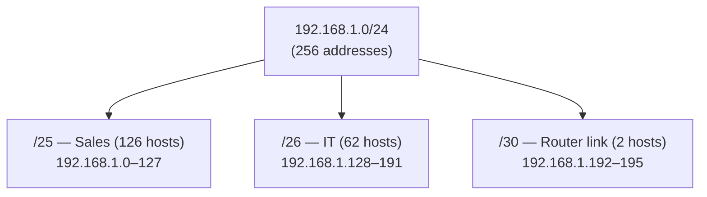
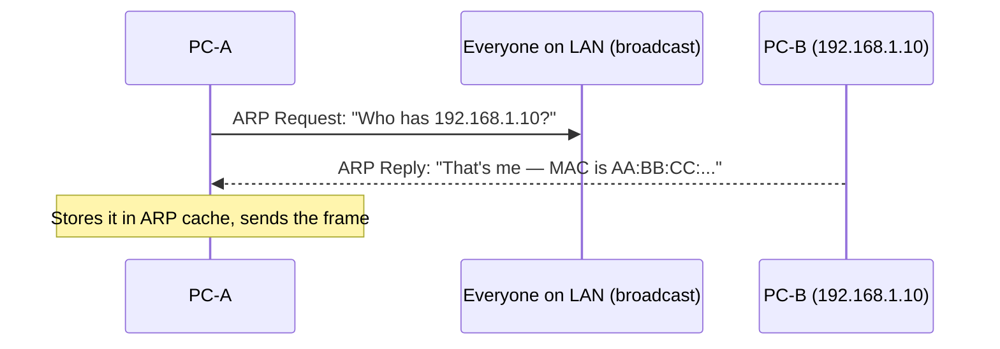
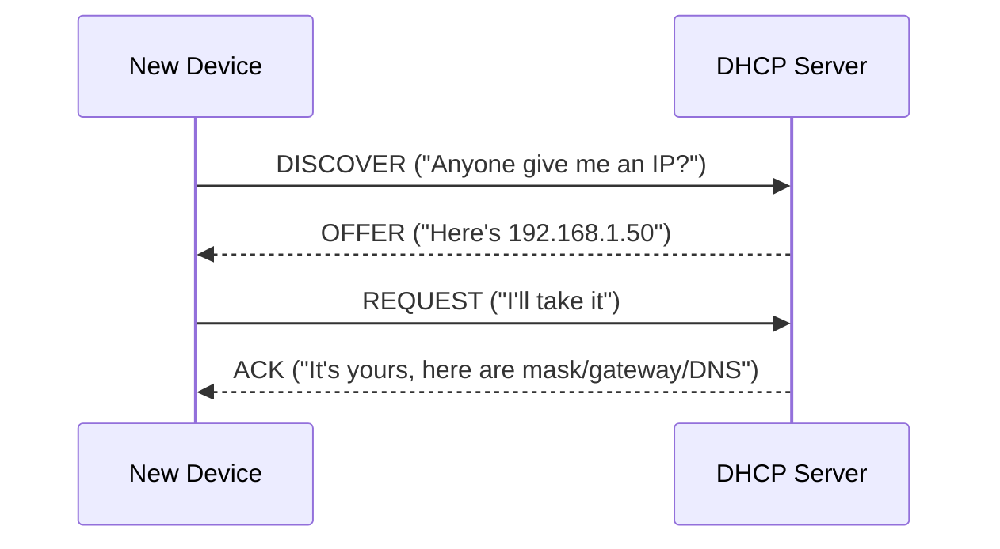
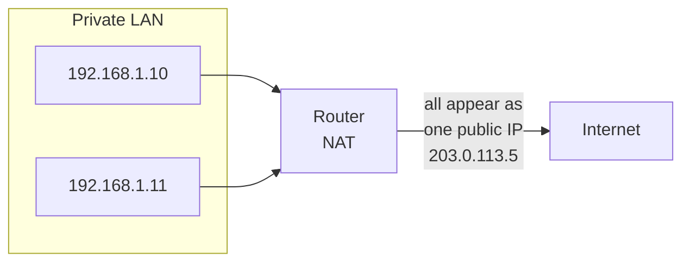

# Part D — IP Addressing & Subnetting

> **Goal of this Part:** Master how every device gets a unique address, how subnetting carves networks into pieces (the #1 tested math in networking interviews), and the helper protocols (ARP, DHCP, NAT) that make it all work. We go slow and show the math.

---

## D.0 Why addressing exists

For a packet to reach the right device, every device needs a unique **address** — like a home needs a street address for mail. At Layer 3 that address is the **IP address**.

> Two address types you must never confuse:
> - **IP address (Layer 3)** — *logical*, changeable, used to route *across* networks. Like your mailing address.
> - **MAC address (Layer 2)** — *physical*, burned into the network card, used *locally*. Like your fingerprint. (Covered in Part F.)

---

## D.1 IPv4 anatomy

An **IPv4 address** is **32 bits**, written as 4 numbers (**octets**) 0–255, separated by dots:

```
192 . 168 . 1 . 10
└─┬─┘ └─┬─┘ └┬┘ └┬┘
 8 bits each  =  32 bits total
```

- Each octet = 8 bits → max value `11111111` = 255.
- Total addresses ≈ 4.3 billion (2³²). *We ran out — hence NAT and IPv6.*

🔍 **Plain-English deep-dive:** An IP address has **two parts**: a **network part** (which neighborhood) and a **host part** (which house in it). The **subnet mask** is what tells you where the split is. Everything in subnetting is just "where do we draw the line between network and host?"

```
IP:    192.168.1.10
Mask:  255.255.255.0   →  /24
       └── network ──┘ └host┘
       192.168.1   .   10
```

---

## D.2 The subnet mask & CIDR notation

The **subnet mask** marks which bits are "network" (1s) and which are "host" (0s).

| Mask (decimal) | CIDR | Network bits | Host bits | Usable hosts |
|----------------|------|--------------|-----------|--------------|
| 255.0.0.0 | /8 | 8 | 24 | 16,777,214 |
| 255.255.0.0 | /16 | 16 | 16 | 65,534 |
| 255.255.255.0 | /24 | 24 | 8 | 254 |
| 255.255.255.128 | /25 | 25 | 7 | 126 |
| 255.255.255.192 | /26 | 26 | 6 | 62 |
| 255.255.255.224 | /27 | 27 | 5 | 30 |
| 255.255.255.240 | /28 | 28 | 4 | 14 |
| 255.255.255.252 | /30 | 30 | 2 | 2 |

- **CIDR (Classless Inter-Domain Routing)** = the `/number` shorthand for "how many network bits." `/24` means 24 network bits.
- **Usable hosts = 2^(host bits) − 2.** Why minus 2? Two addresses are reserved (see D.4).

> Memory hook: **"/24 = 254 hosts"** is your anchor. Every step *up* in CIDR (smaller subnet) roughly halves the hosts.

---

## D.3 IP address classes (legacy, but still asked)

Before CIDR, addresses came in fixed **classes**:

| Class | First octet range | Default mask | Use |
|-------|-------------------|--------------|-----|
| **A** | 1–126 | /8 | Huge networks |
| **B** | 128–191 | /16 | Medium networks |
| **C** | 192–223 | /24 | Small networks |
| **D** | 224–239 | — | Multicast |
| **E** | 240–255 | — | Experimental |

> `127.x.x.x` is reserved for **loopback** (`127.0.0.1` = "myself" / localhost).

---

## D.4 Special & private addresses

**Reserved in every subnet (why we subtract 2):**
- **Network address** — all host bits `0` (e.g., `192.168.1.0`) = "the network itself." Can't assign to a device.
- **Broadcast address** — all host bits `1` (e.g., `192.168.1.255`) = "everyone on this network."

**Private ranges (RFC 1918)** — free to use inside your network; not routable on the public Internet (NAT translates them):

| Range | CIDR | Common use |
|-------|------|------------|
| 10.0.0.0 – 10.255.255.255 | /8 | Large enterprises |
| 172.16.0.0 – 172.31.255.255 | /12 | Medium networks |
| 192.168.0.0 – 192.168.255.255 | /16 | Home/small office |

> Memory hook: **"10, 172.16-31, 192.168"** = the three private ranges. Your home router uses `192.168.x.x`.

---

## D.5 Subnetting — step by step (the interview skill)

**Subnetting = borrowing host bits to create more, smaller networks.**

🔍 **Plain-English deep-dive:** You're given one big plot of land (a network) and need to fence it into smaller lots (subnets) so different departments don't trample each other. Borrowing bits = adding fences. More fences = more lots, but each lot holds fewer houses.

### Worked example: subnet `192.168.1.0/24` into 4 subnets

1. **Need 4 subnets** → need 2 borrowed bits (2² = 4). New mask = /24 + 2 = **/26**.
2. **/26 mask** = 255.255.255.**192**.
3. **Block size** = 256 − 192 = **64**. (Block size = how far apart each subnet starts.)
4. **Subnets count up by 64:**

| Subnet | Network address | Usable range | Broadcast |
|--------|-----------------|--------------|-----------|
| 1 | 192.168.1.0 | .1 – .62 | 192.168.1.63 |
| 2 | 192.168.1.64 | .65 – .126 | 192.168.1.127 |
| 3 | 192.168.1.128 | .129 – .190 | 192.168.1.191 |
| 4 | 192.168.1.192 | .193 – .254 | 192.168.1.255 |

Each subnet: 2⁶ = 64 addresses, **62 usable** (minus network + broadcast).

> **The 4-step method to memorize:**
> 1. How many subnets/hosts do I need? → decide CIDR.
> 2. Mask value of the interesting octet → **256 − mask octet = block size**.
> 3. Count network addresses by block size.
> 4. Usable range = network+1 to broadcast−1.

### VLSM (Variable Length Subnet Masking)
Real networks need subnets of **different sizes** (e.g., 100 hosts here, 2 hosts on a router link there). **VLSM** = subnet a subnet, allocating just enough per need — start with the *largest* requirement first.



---

## D.6 IPv6 essentials (why it exists)

IPv4's 4.3 billion addresses ran out. **IPv6 = 128 bits** → ~340 **undecillion** addresses (effectively unlimited).

- Written as 8 groups of 4 hex digits: `2001:0db8:85a3:0000:0000:8a2e:0370:7334`.
- **Shortening rules:** drop leading zeros; replace one run of all-zero groups with `::`.
  `2001:db8:85a3::8a2e:370:7334`
- **No broadcast** in IPv6 (uses multicast instead); **no NAT needed** (enough addresses for everything).
- **Loopback** = `::1`.

| | IPv4 | IPv6 |
|--|------|------|
| Size | 32-bit | 128-bit |
| Format | Decimal, dotted | Hex, colons |
| Addresses | ~4.3 billion | ~340 undecillion |
| NAT | Common (needed) | Rarely needed |
| Broadcast | Yes | No (multicast) |

---

## D.7 The helper protocols: ARP, DHCP, NAT

### ARP — Address Resolution Protocol (IP → MAC)
To deliver a frame locally, a device needs the **MAC** for a known **IP**. ARP shouts on the LAN: *"Who has 192.168.1.10? Tell me your MAC."*



### DHCP — Dynamic Host Configuration Protocol (auto IP)
When you join Wi-Fi, **DHCP** auto-assigns your IP, subnet mask, gateway, and DNS. The handshake is **DORA**:


> Memory hook: **DORA** = Discover, Offer, Request, Acknowledge.

### NAT — Network Address Translation (private ↔ public)
Many private devices share **one public IP** by translating addresses at the router. This is why IPv4 didn't collapse.


- **PAT (Port Address Translation)** = NAT "overload" — many devices share one public IP, distinguished by **port numbers**. This is what home routers do.

---

## ⭐ Likely Interview Questions

1. **What's the difference between an IP address and a MAC address?**
   *IP is a logical Layer-3 address used to route across networks and can change; MAC is a physical Layer-2 address burned into the NIC used for local delivery.*

2. **How many usable hosts in a /26?**
   *2⁶ − 2 = 62. (6 host bits, minus network and broadcast.)*

3. **What are the private IP ranges?**
   *10.0.0.0/8, 172.16.0.0/12, and 192.168.0.0/16 (RFC 1918) — not routable on the public Internet.*

4. **Subnet 192.168.1.0/24 into 4 equal subnets — give the ranges.**
   */26, block size 64: .0, .64, .128, .192 networks, each with 62 usable hosts.*

5. **What is the subnet mask for?**
   *It marks which bits are the network portion vs the host portion, defining the boundary between "which network" and "which device."*

6. **What does ARP do?**
   *Resolves a known IP address to its MAC address on the local network via a broadcast request and unicast reply.*

7. **Explain DHCP and its steps.**
   *DHCP automatically assigns IP config to devices using DORA: Discover, Offer, Request, Acknowledge.*

8. **Why do we need NAT?**
   *To let many private devices share a limited number of public IPv4 addresses by translating private addresses to public ones — conserving the IPv4 space.*

9. **Why was IPv6 created and how is it different?**
   *IPv4 ran out of addresses; IPv6 uses 128-bit addresses (~340 undecillion), written in hex, with no broadcast and no need for NAT.*

10. **What are the network and broadcast addresses in a subnet?**
    *The network address has all host bits 0 (the subnet's ID); the broadcast has all host bits 1 (reaches all hosts). Neither is assignable to a device.*

---

## 🧠 30-Second Memory Hooks

- **IPv4 = 32 bits, 4 octets, 0–255 each.**
- **Usable hosts = 2^(host bits) − 2** (minus network + broadcast).
- **/24 = 254 hosts** — your anchor number.
- **Block size = 256 − mask octet.**
- **Private ranges: 10 / 172.16–31 / 192.168.**
- **DORA = DHCP** (Discover, Offer, Request, Ack).
- **ARP = "who has this IP? → MAC."**
- **NAT/PAT = many private IPs share one public IP via ports.**
- **IPv6 = 128 bits, hex, no broadcast, no NAT.**

---

➡️ **Next up:** [Part E — TCP vs UDP](Part-E-TCP-vs-UDP.md) — the transport layer in depth: ports, the 3-way handshake, and reliable vs fast delivery.
