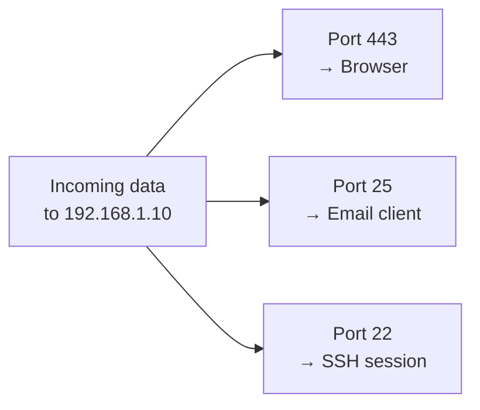
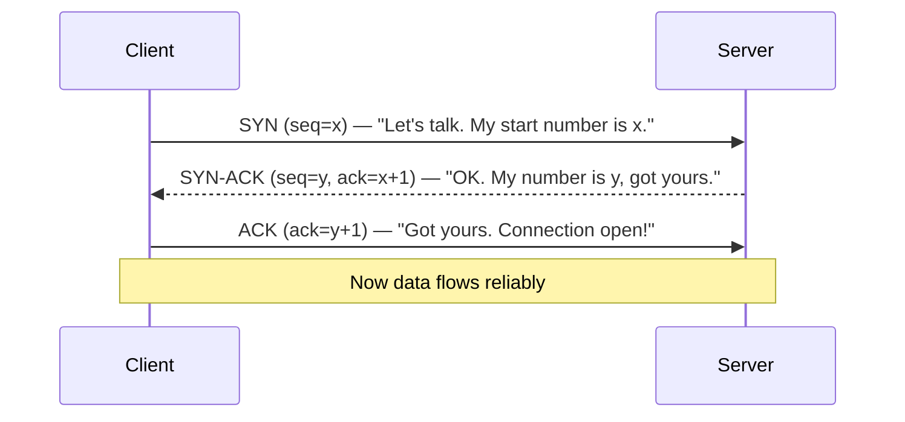
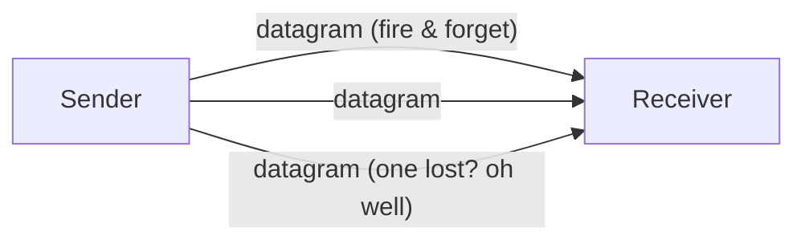
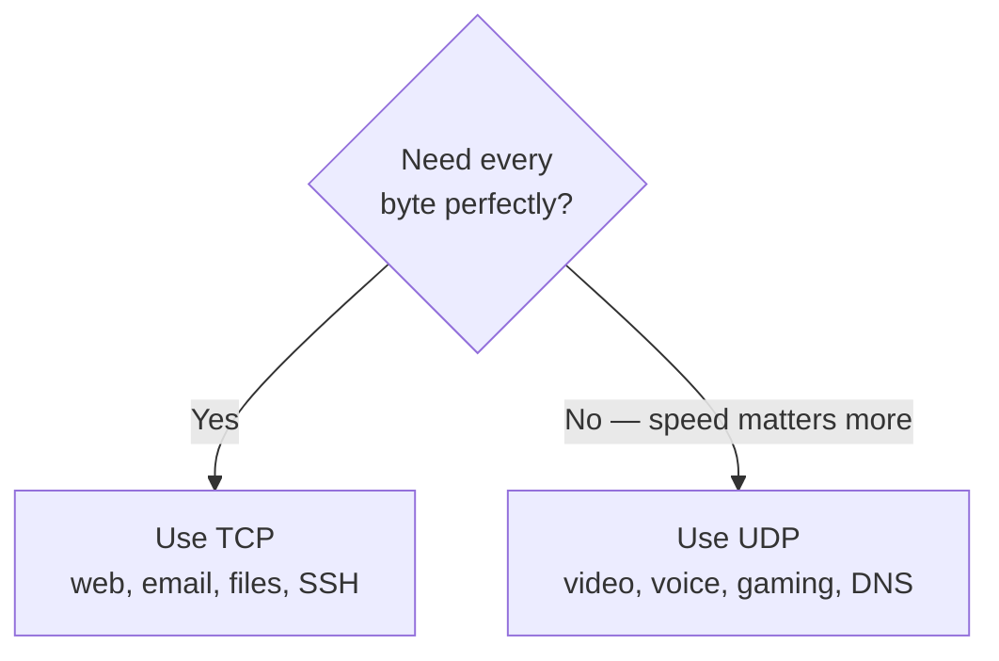

# Part E — TCP vs UDP (The Transport Layer in Depth)

> **Goal of this Part:** The Transport layer (OSI 4) is where "reliable vs fast" is decided. This is one of the **most-asked interview topics**. You'll master ports, the TCP 3-way handshake, flow/congestion control, and exactly when to choose UDP.

---

## E.0 The job of the Transport layer

The Network layer (IP) gets a packet to the right *machine*. But a machine runs many programs at once — browser, email, video call. The **Transport layer** gets data to the right *program*, and decides **how reliably** to deliver it.

Two protocols do this:
- **TCP** — reliable, ordered, connection-based. *Like a phone call with confirmations.*
- **UDP** — fast, connectionless, no guarantees. *Like shouting across a room.*

🔍 **Plain-English deep-dive:** Imagine the IP layer drops a package at your apartment *building*. The Transport layer is the **doorman with apartment numbers (ports)** who delivers to the exact unit, and decides whether to get a **signature** (TCP) or just **leave it at the door** (UDP).

---

## E.1 Ports & sockets — how data finds the right program

A **port** is a 16-bit number (0–65535) identifying a specific program/service on a device.

- **Source port** — random high number your device picks for this conversation.
- **Destination port** — the well-known number of the service you're reaching (e.g., 443 for HTTPS).

A **socket** = IP address + port together (e.g., `192.168.1.10:443`). It uniquely identifies one end of a connection.

| Port range | Name | Examples |
|------------|------|----------|
| 0–1023 | **Well-known** | 80 HTTP, 443 HTTPS, 22 SSH, 53 DNS |
| 1024–49151 | **Registered** | App-specific (e.g., 3306 MySQL) |
| 49152–65535 | **Dynamic/ephemeral** | Temporary client ports |

**Multiplexing:** ports let one device run many simultaneous conversations — your browser tab, email, and a download all share the same IP but use different ports.

---

## E.2 TCP — reliable delivery

**TCP = Transmission Control Protocol.** Connection-oriented and reliable: it guarantees data arrives **complete, in order, and error-checked**, resending anything lost.

### The 3-way handshake (SYN, SYN-ACK, ACK) ⭐
Before any data, TCP sets up a connection in 3 steps:

> Memory hook: **SYN → SYN-ACK → ACK** = "knock, knock-back, confirmed." Like saying "Can you hear me?" / "Yes, can you hear me?" / "Yes!"

### Closing: the 4-way teardown
TCP closes gracefully with **FIN → ACK → FIN → ACK** (each side independently says "I'm done").

### How TCP guarantees reliability
| Mechanism | What it does | Analogy |
|-----------|--------------|---------|
| **Sequence numbers** | Number every byte so the receiver can reorder | Page numbers on a book |
| **Acknowledgments (ACK)** | Receiver confirms what it got | "Got pages 1–10" |
| **Retransmission** | Resend if no ACK (timeout) | Re-mail a lost page |
| **Checksums** | Detect corrupted data | A tamper seal |
| **Flow control** | Don't overwhelm a slow receiver | Slow down if mailbox is full |
| **Congestion control** | Don't overwhelm the *network* | Ease off in traffic jams |

### Flow control — the sliding window
The receiver advertises a **window size** = how much it can accept before needing an ACK. The sender can have that much "in flight" unacknowledged. The window slides forward as ACKs arrive.

🔍 **Deep-dive:** It's like a **conveyor belt with a limited tray**. The receiver says "I have room for 5 items." The sender ships 5, waits for the tray to clear, then ships more. If the receiver gets swamped, it shrinks the window.

### Congestion control
TCP probes the network: start slow (**slow start**), ramp up, and **back off** when packets drop (a sign of congestion). This is why downloads speed up gradually.

---

## E.3 UDP — fast, connectionless delivery

**UDP = User Datagram Protocol.** No handshake, no ACKs, no reordering, no retransmission. Just "wrap it and fire it off."

- **Pros:** very low overhead, low latency, no setup delay.
- **Cons:** packets may be lost, duplicated, or arrive out of order — the *application* must handle that if it cares.
- **Why use it:** when **speed matters more than perfection** — a dropped frame in a video call is better than a frozen, "buffering" call.

---

## E.4 TCP vs UDP — the comparison table (memorize) ⭐

| Feature | **TCP** | **UDP** |
|---------|---------|---------|
| Connection | Connection-oriented (handshake) | Connectionless |
| Reliability | Guaranteed delivery | Best-effort (no guarantee) |
| Ordering | In-order | No ordering |
| Speed | Slower (overhead) | Faster (minimal overhead) |
| Error recovery | Yes (retransmit) | No (app handles it) |
| Flow/congestion control | Yes | No |
| Header size | 20+ bytes | 8 bytes |
| Use cases | Web, email, file transfer | Video/voice, gaming, DNS |

> One-liner: **"TCP = reliable but heavier; UDP = fast but no guarantees."**

---

## E.5 Common ports & protocols (high-value flashcards)

| Port | Protocol | Transport | What it does |
|------|----------|-----------|--------------|
| 20/21 | FTP | TCP | File transfer |
| 22 | SSH | TCP | Secure remote login |
| 23 | Telnet | TCP | Remote login (insecure) |
| 25 | SMTP | TCP | Sending email |
| 53 | DNS | **UDP** (TCP for big) | Name → IP lookup |
| 67/68 | DHCP | **UDP** | Auto IP assignment |
| 80 | HTTP | TCP | Web (unencrypted) |
| 110 | POP3 | TCP | Receiving email |
| 143 | IMAP | TCP | Receiving email (sync) |
| 161 | SNMP | **UDP** | Network monitoring |
| 443 | HTTPS | TCP | Web (encrypted/TLS) |
| 3389 | RDP | TCP | Remote desktop |

> Memory hook for the **UDP crowd**: **"DNS, DHCP, SNMP, and streaming"** ride UDP for speed. Almost everything else is TCP.

---

## E.6 Where this fits with the rest

- Ports/sockets ride on top of **IP addresses** (Part D).
- TCP/UDP segments get wrapped in IP **packets**, then Ethernet **frames** (Parts B, F).
- DNS (Part C) mostly uses **UDP**; web (HTTP/HTTPS) uses **TCP**.

---

## ⭐ Likely Interview Questions

1. **What's the difference between TCP and UDP?**
   *TCP is connection-oriented and reliable (handshake, ACKs, ordering, retransmission); UDP is connectionless and best-effort (no guarantees) but faster with less overhead.*

2. **Explain the TCP 3-way handshake.**
   *SYN (client proposes, sends seq number) → SYN-ACK (server acknowledges and sends its own) → ACK (client confirms). The connection is then established.*

3. **When would you choose UDP over TCP?**
   *When speed/low latency matters more than perfect delivery — video/voice calls, live streaming, online gaming, DNS — where a lost packet is better than waiting for a resend.*

4. **What is a port and why do we need them?**
   *A 16-bit number identifying a specific service/program on a host, enabling many simultaneous connections (multiplexing) on one IP address.*

5. **What is a socket?**
   *The combination of an IP address and a port number, uniquely identifying one endpoint of a connection.*

6. **How does TCP ensure reliable delivery?**
   *Via sequence numbers (ordering), acknowledgments, retransmission on loss, checksums (error detection), and flow/congestion control.*

7. **What is flow control vs congestion control?**
   *Flow control prevents overwhelming the receiver (sliding window); congestion control prevents overwhelming the network (slow start, back off on loss).*

8. **Why does DNS mostly use UDP?**
   *Lookups are small and fast, and the speed of connectionless UDP outweighs the overhead of a TCP handshake; TCP is used for larger responses (e.g., zone transfers).*

9. **What ports do HTTP and HTTPS use?**
   *HTTP = 80, HTTPS = 443 (both over TCP).*

10. **What's the TCP header size vs UDP?**
    *TCP is 20+ bytes (more fields for reliability); UDP is just 8 bytes (minimal overhead).*

---

## 🧠 30-Second Memory Hooks

- **TCP = reliable, ordered, handshake; UDP = fast, fire-and-forget.**
- **Handshake = SYN → SYN-ACK → ACK** ("knock, knock-back, confirmed").
- **Port = apartment number; Socket = IP + port.**
- **Well-known ports < 1024:** 80 HTTP, 443 HTTPS, 22 SSH, 53 DNS.
- **UDP crowd: DNS, DHCP, SNMP, streaming/voice/gaming.**
- **Flow control = don't flood the receiver; congestion control = don't flood the network.**

---

➡️ **Next up:** [Part F — Switching Concepts](Part-F-Switching-Concepts.md) — Layer 2: MAC addresses, VLANs, trunking, and Spanning Tree, with configs.
