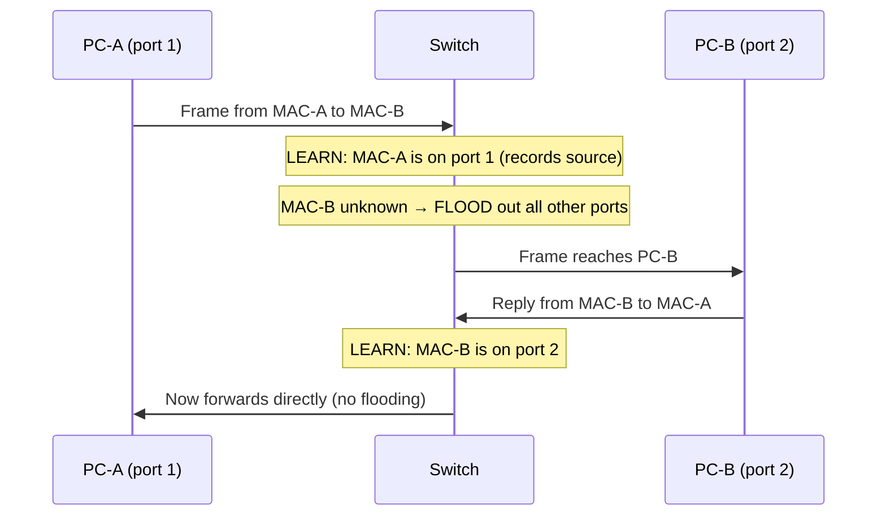
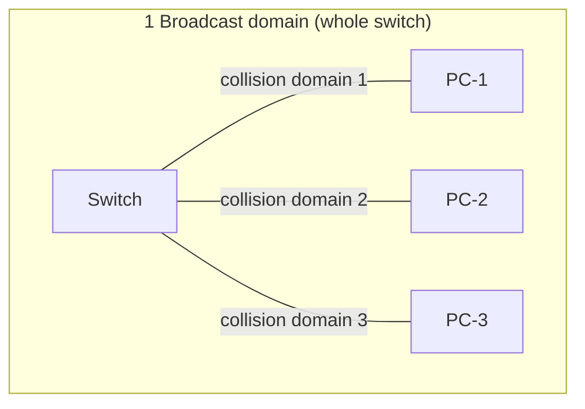
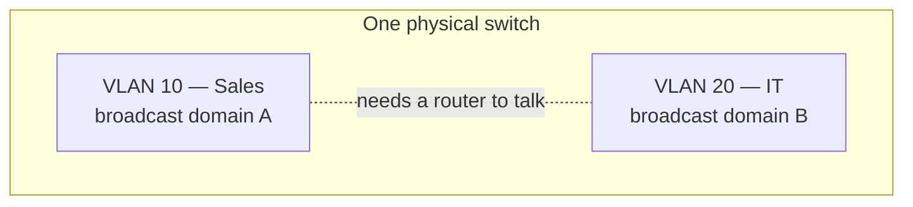
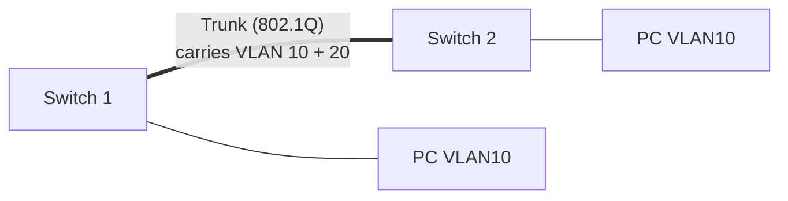
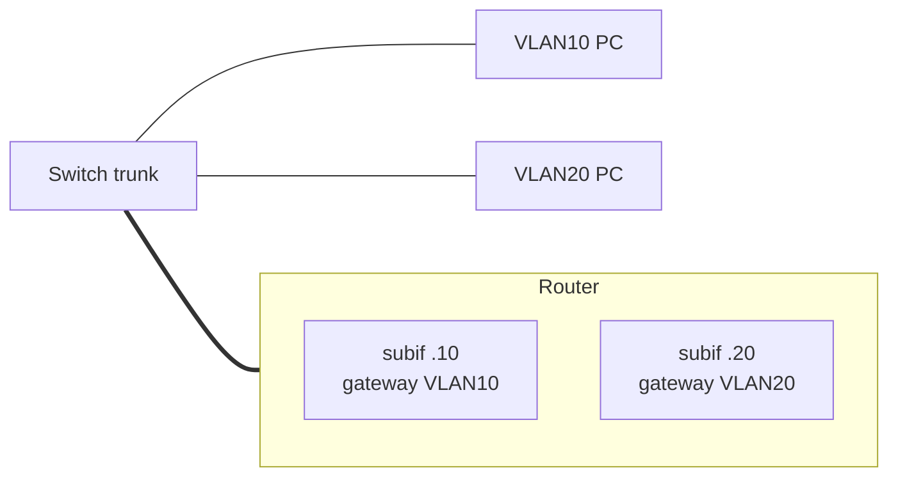
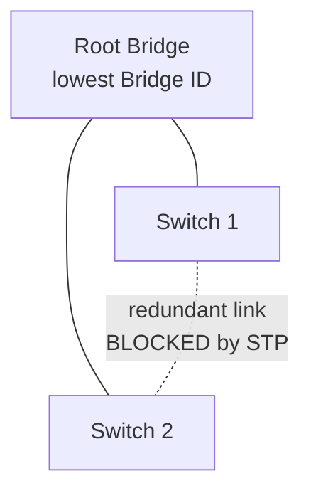

# Part F — Switching Concepts (Layer 2: The Local Neighborhood)

> **Goal of this Part:** Switches run the local network (Layer 2). Master MAC addresses, how switches learn and forward frames, VLANs, trunking, and Spanning Tree — with real Cisco-style configs. This is core to any networking interview.

---

## F.0 What a switch does (in one breath)

> **A switch connects devices within a LAN and forwards frames to the correct device using MAC addresses.**

A switch is smart: it *learns* which device is on which port and sends each frame only where it needs to go — unlike a dumb **hub**, which blasts everything everywhere.

🔍 **Plain-English deep-dive:** A switch is a **smart mail-sorting room for one building**. It keeps a directory of "which desk is behind which door" (the MAC table) and walks each letter straight to the right desk — instead of photocopying it and shoving one under every door (what a hub does).

---

## F.1 MAC addresses & frames

### MAC address (Layer 2 physical address)
- **MAC = Media Access Control** address: **48 bits**, written as 6 hex pairs: `00:1A:2B:3C:4D:5E`.
- **Burned into the network card** (NIC) at manufacture — globally unique.
- First half = **OUI** (manufacturer ID); second half = device serial.
- Used for **local** delivery only (doesn't cross routers).

| | MAC address | IP address |
|--|-------------|------------|
| Layer | 2 (Data Link) | 3 (Network) |
| Format | 48-bit hex | 32-bit (IPv4) |
| Scope | Local network | End-to-end |
| Changeable | No (physical) | Yes (logical) |
| Analogy | Fingerprint | Mailing address |

### Frame
A **frame** is the Layer-2 PDU: `[Dest MAC | Source MAC | Type | ...Data... | FCS]`. The **FCS** (Frame Check Sequence) detects corruption.

---

## F.2 How a switch learns & forwards (the MAC address table)

A switch builds a **MAC address table** (aka CAM table) mapping `MAC → port`:



**Three switch behaviors:**
1. **Learn** — record the *source* MAC + incoming port.
2. **Forward** — if *destination* MAC is known, send out only that port.
3. **Flood** — if destination is *unknown* (or it's a broadcast), send out all ports except the one it came in on.

```
Switch MAC Table
PORT   MAC ADDRESS
1      00:1A:..:A   (PC-A)
2      00:1B:..:B   (PC-B)
```

---

## F.3 Collision domains vs broadcast domains ⭐

Two concepts interviewers love to compare:

| | Collision domain | Broadcast domain |
|--|------------------|------------------|
| **What** | Where two frames can *collide* | Where a broadcast reaches everyone |
| **Hub** | One big shared collision domain (bad) | One broadcast domain |
| **Switch** | **Each port = its own collision domain** (good) | One broadcast domain (whole switch) |
| **Router / VLAN** | — | **Each interface/VLAN = separate broadcast domain** |

> Key takeaways:
> - **Switches eliminate collisions** (each port isolated) but **don't break up broadcast domains**.
> - **Routers (and VLANs) break up broadcast domains.**



---

## F.4 Hubs vs Switches vs Bridges vs Routers

| Device | Layer | Smartness | Collision domains | Broadcast domains |
|--------|-------|-----------|-------------------|-------------------|
| **Hub** | 1 | Dumb (repeats all) | 1 (shared) | 1 |
| **Bridge** | 2 | Few-port switch | Per port | 1 |
| **Switch** | 2 | Smart (MAC table) | Per port | 1 (per VLAN) |
| **Router** | 3 | Routes by IP | Per port | Per port |

---

## F.5 VLANs — Virtual LANs ⭐

A **VLAN** logically splits one physical switch into multiple separate networks. Devices in different VLANs **can't talk** without a router — even on the same switch.

🔍 **Plain-English deep-dive:** A VLAN is like putting **invisible walls inside one office**. The HR desks and Engineering desks share the same building (switch) but are in separate, soundproof rooms — they can't overhear each other. To pass a note between rooms you need a doorway (a **router**).

**Why VLANs?**
- **Security** — isolate sensitive groups (Finance from Guests).
- **Performance** — smaller broadcast domains = less broadcast noise.
- **Flexibility** — group by role, not physical location.



### VLAN config (Cisco IOS)
```cisco
! Create VLANs
Switch(config)# vlan 10
Switch(config-vlan)# name SALES
Switch(config)# vlan 20
Switch(config-vlan)# name IT

! Assign an access port to VLAN 10
Switch(config)# interface fastEthernet 0/1
Switch(config-if)# switchport mode access
Switch(config-if)# switchport access vlan 10

! Verify
Switch# show vlan brief
```

---

## F.6 Trunking (802.1Q) — carrying many VLANs on one link

An **access port** carries ONE VLAN (to a PC). A **trunk port** carries MANY VLANs between switches (or switch↔router). **802.1Q** is the standard that **tags** each frame with its VLAN ID so the other side knows which VLAN it belongs to.



> The **native VLAN** = the one untagged VLAN on a trunk (default VLAN 1). A common security tip is to change it.

### Trunk config
```cisco
Switch(config)# interface gigabitEthernet 0/1
Switch(config-if)# switchport mode trunk
Switch(config-if)# switchport trunk allowed vlan 10,20
Switch(config-if)# switchport trunk native vlan 99
```

---

## F.7 Inter-VLAN routing ("Router-on-a-stick")

VLANs need a **router** (or Layer-3 switch) to talk to each other. A popular method is **router-on-a-stick**: one physical link split into **subinterfaces**, one per VLAN.



```cisco
Router(config)# interface gig0/0.10
Router(config-subif)# encapsulation dot1Q 10
Router(config-subif)# ip address 192.168.10.1 255.255.255.0
Router(config)# interface gig0/0.20
Router(config-subif)# encapsulation dot1Q 20
Router(config-subif)# ip address 192.168.20.1 255.255.255.0
```

---

## F.8 Spanning Tree Protocol (STP / RSTP) ⭐

**The problem:** For redundancy we connect switches with multiple links. But Layer 2 has **no TTL**, so a broadcast can loop forever — a **broadcast storm** that melts the network.

**The fix — STP (802.1D):** automatically **blocks** redundant paths to create one loop-free tree, and **unblocks** a backup link if the main one fails.

🔍 **Plain-English deep-dive:** Imagine roundabouts with no exit signs — cars circle forever. STP is the traffic authority that temporarily **closes** the extra loops, leaving exactly one path through. If the open road closes, it instantly opens a backup.



**How STP picks the tree:**
1. **Elect a Root Bridge** — switch with the lowest **Bridge ID** (priority + MAC).
2. Each other switch finds its **lowest-cost path** to the root (**root port**).
3. Each segment picks a **designated port**; remaining redundant ports are **blocked**.

**STP port states:** Blocking → Listening → Learning → Forwarding (and Disabled).

**RSTP (802.1w)** = Rapid STP — same idea, converges in seconds instead of ~30–50s. Preferred today.

### STP config
```cisco
! Make this switch the root for VLAN 10
Switch(config)# spanning-tree vlan 10 root primary
! Use rapid STP
Switch(config)# spanning-tree mode rapid-pvst
! Speed up an access port to an end device
Switch(config-if)# spanning-tree portfast
Switch# show spanning-tree
```

---

## F.9 EtherChannel (link aggregation)

**EtherChannel** bundles multiple physical links into **one logical link** for more bandwidth and redundancy — and STP treats the bundle as a single link (no blocking). Protocols: **LACP** (open standard, 802.3ad) or **PAgP** (Cisco).

```cisco
Switch(config)# interface range gig0/1 - 2
Switch(config-if-range)# channel-group 1 mode active   ! LACP
Switch(config)# interface port-channel 1
Switch(config-if)# switchport mode trunk
```

---

## ⭐ Likely Interview Questions

1. **What is a switch and how does it work?**
   *A Layer-2 device that connects LAN devices and forwards frames using a MAC address table, which it builds by learning source MACs. It forwards known destinations and floods unknown ones.*

2. **Difference between a switch and a hub?**
   *A hub blindly repeats every frame to all ports (one collision domain); a switch learns MACs and forwards intelligently, giving each port its own collision domain.*

3. **Collision domain vs broadcast domain?**
   *A collision domain is where frames can collide (each switch port is its own); a broadcast domain is where a broadcast reaches all devices. Switches break up collision domains; routers (and VLANs) break up broadcast domains.*

4. **What is a VLAN and why use it?**
   *A logical segmentation of a switch into separate networks for security, performance (smaller broadcast domains), and flexible grouping. Different VLANs need a router to communicate.*

5. **What is a trunk port and what is 802.1Q?**
   *A trunk carries multiple VLANs between switches; 802.1Q tags each frame with its VLAN ID so the receiving device knows which VLAN it belongs to.*

6. **What is inter-VLAN routing / router-on-a-stick?**
   *Using a router (or Layer-3 switch) with subinterfaces — one per VLAN — to route traffic between VLANs over a single trunk link.*

7. **What problem does STP solve and how?**
   *It prevents Layer-2 loops and broadcast storms by electing a root bridge and blocking redundant paths, leaving one loop-free path while keeping backups ready.*

8. **How is the STP root bridge elected?**
   *The switch with the lowest Bridge ID (priority value, then lowest MAC) becomes the root.*

9. **Difference between STP and RSTP?**
   *RSTP (802.1w) is a faster version that converges in seconds vs STP's ~30–50 seconds, using additional port roles and states.*

10. **What is EtherChannel?**
    *Bundling several physical links into one logical link for higher bandwidth and redundancy; STP treats it as a single link. Negotiated via LACP or PAgP.*

---

## 🧠 30-Second Memory Hooks

- **Switch = Layer 2, forwards by MAC; learns source, floods unknown.**
- **MAC = 48-bit, burned-in, local-only; IP = logical, routable.**
- **Switch breaks collision domains; router/VLAN breaks broadcast domains.**
- **VLAN = invisible walls in one switch; need a router to cross.**
- **Access port = 1 VLAN; trunk (802.1Q) = many VLANs, tagged.**
- **STP = kills Layer-2 loops; lowest Bridge ID = Root.**
- **RSTP = rapid STP (seconds). EtherChannel = bundle links.**

---

➡️ **Next up:** [Part G — Routing Fundamentals](Part-G-Routing-Fundamentals.md) — how routers connect different networks and choose the best path.
