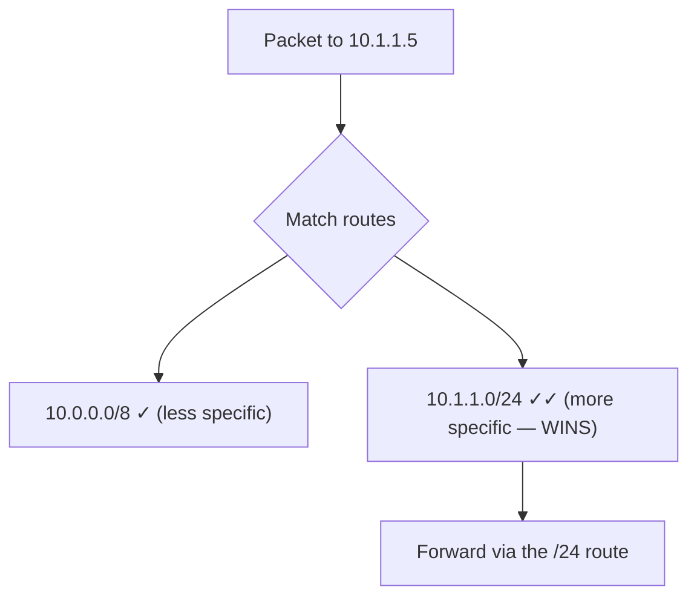
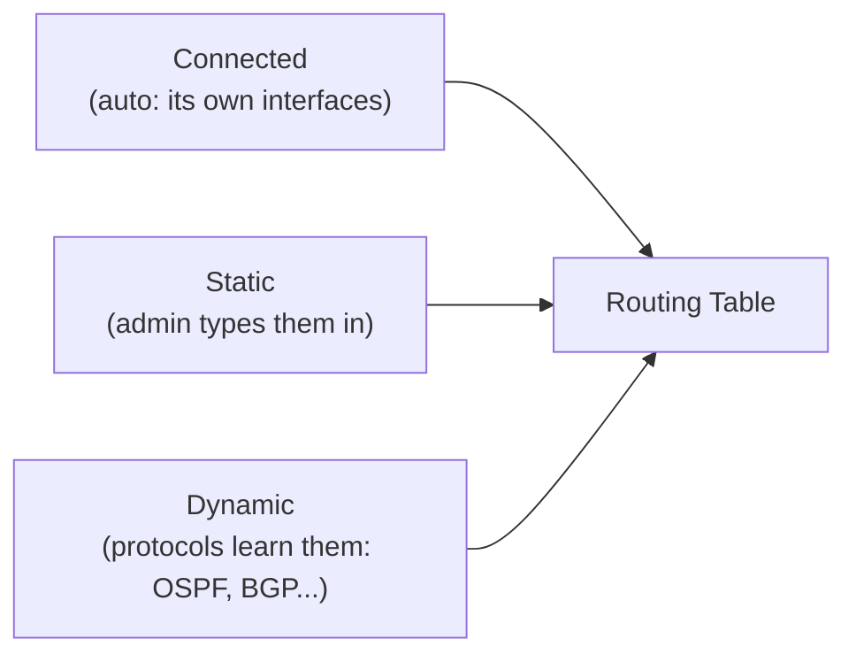
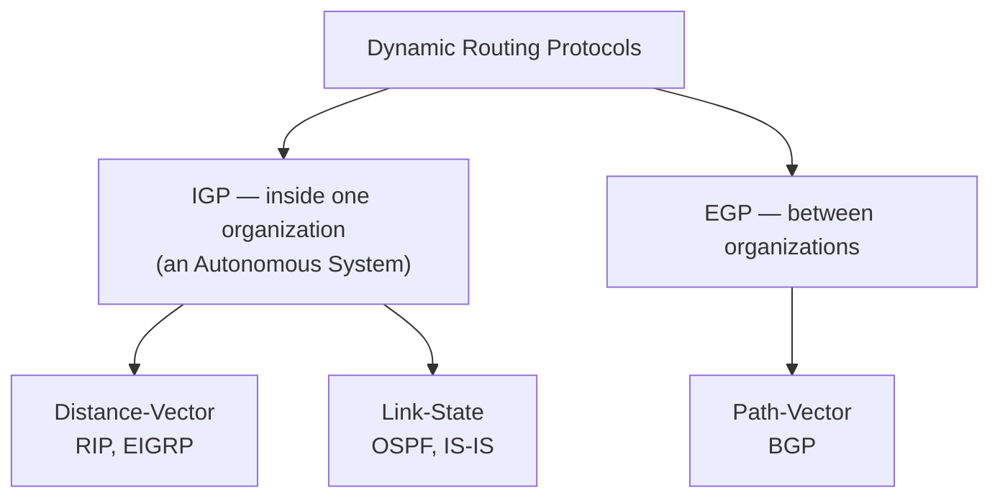
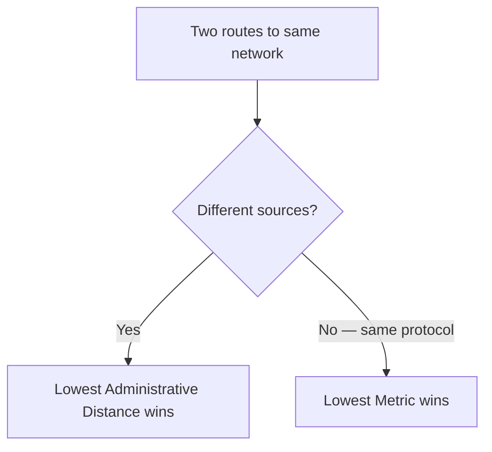
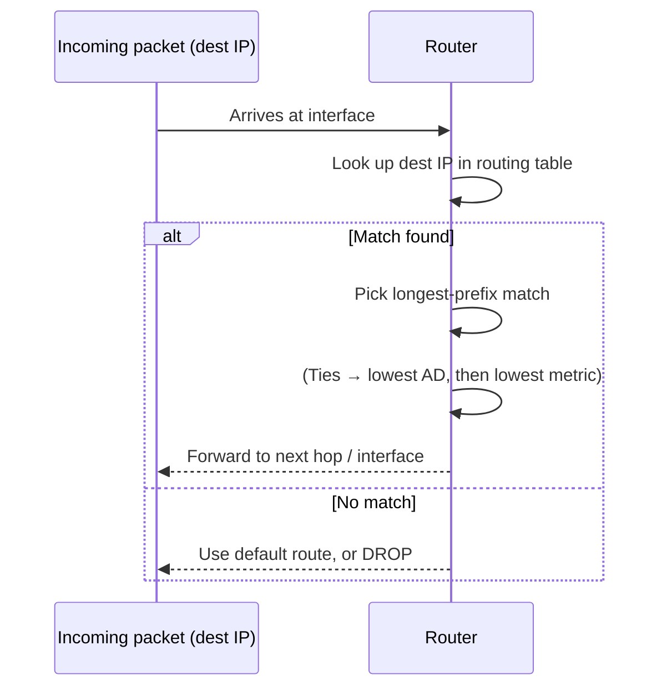

# Part G — Routing Fundamentals (Layer 3: Connecting Neighborhoods)

> **Goal of this Part:** Switches handle the local street (Part F). **Routers** connect *different* networks and pick the best path across them. This Part builds the foundation for all the routing protocols (Parts H–J): the routing table, static vs dynamic routing, administrative distance, and metrics.

---

## G.0 What a router does (one breath)

> **A router connects different networks (different IP subnets) and forwards packets between them using the best path in its routing table.**

A switch asks *"which port is this MAC on?"* A router asks *"which network is this IP in, and what's the best next hop toward it?"*

🔍 **Plain-English deep-dive:** If a switch is the mail sorter *inside one building*, a router is the **regional post office** that decides which city a letter goes to next. It doesn't know every house in the world — it just knows the *next* post office to hand the letter to, trusting that one to know the rest. This hop-by-hop idea is the heart of routing.

---

## G.1 The routing table — a router's brain

Every router keeps a **routing table**: a list of known **destination networks** and **how to reach each** (next hop / exit interface).

```
Destination Network   Next Hop / Interface      Source
192.168.1.0/24        directly connected, G0/0  Connected
10.0.0.0/8            via 203.0.113.1           Static
172.16.0.0/16         via 203.0.113.2 (OSPF)    Dynamic
0.0.0.0/0             via 203.0.113.1           Default route
```

When a packet arrives, the router:
1. Reads the **destination IP**.
2. Finds the **best matching** network in its table.
3. Forwards out the matching interface / to the next hop.
4. If **no match** and no default route → **drops** the packet.

### Longest-prefix match ⭐
If multiple routes match, the router picks the **most specific** (longest prefix / biggest CIDR number).

🔍 **Deep-dive:** A letter to "123 Oak St, Springfield" — a rule for "Springfield" (`/16`) and one for "Oak Street, Springfield" (`/24`) both match. The router uses the **more specific** one (`/24`), because it gets the letter closer. **More specific always wins, regardless of metric or protocol.**



---

## G.2 Directly connected, static, and dynamic routes

A router learns routes three ways:



| Type | How learned | Pros | Cons |
|------|-------------|------|------|
| **Connected** | Automatic, for its own interfaces | Free, instant | Only local networks |
| **Static** | Manually configured | Precise, secure, no overhead | Doesn't adapt; tedious at scale |
| **Dynamic** | Protocols share routes | Auto-adapts to failures, scales | Uses CPU/bandwidth, complexity |

---

## G.3 Static routing (with config)

You manually tell the router where a network is.

```cisco
! "To reach 10.0.0.0/8, send to next hop 203.0.113.1"
Router(config)# ip route 10.0.0.0 255.0.0.0 203.0.113.1

! Or specify the exit interface
Router(config)# ip route 10.0.0.0 255.0.0.0 GigabitEthernet0/1
```

### Default route — "when in doubt, send it here"
A **default route** `0.0.0.0/0` matches *any* destination not otherwise listed — usually pointing to your ISP/gateway. Also called the **gateway of last resort**.

```cisco
Router(config)# ip route 0.0.0.0 0.0.0.0 203.0.113.1
```

🔍 **Deep-dive:** A default route is the **"all other mail → main post office"** rule. A home router has basically one rule: "anything not local → send to the ISP."

---

## G.4 Dynamic routing — the big picture

Dynamic routing protocols let routers **automatically discover** networks and **adapt** when links fail — by talking to each other. They split into families:



- **IGP (Interior Gateway Protocol)** — routes *within* one organization/AS. (RIP, EIGRP, OSPF) → Parts H, I.
- **EGP (Exterior Gateway Protocol)** — routes *between* organizations. (BGP) → Part J.
- **Distance-vector** = "routing by rumor" (trust your neighbor's summary). → Part H.
- **Link-state** = "everyone builds a full map." → Part I.
- **Path-vector** = "track the whole path of networks." → Part J.

---

## G.5 Administrative Distance (AD) — "which source do I trust?" ⭐

A router may learn the *same* destination from multiple sources (static AND OSPF, say). **Administrative Distance** is the **trustworthiness rank** — **lower = more trusted**. The router installs the route from the lowest-AD source.

| Route source | Default AD |
|--------------|------------|
| Connected | **0** |
| Static | **1** |
| eBGP (external) | 20 |
| EIGRP (internal) | 90 |
| OSPF | 110 |
| RIP | 120 |
| iBGP (internal) | 200 |
| Unknown / unusable | 255 |

> Memory hook: **"Connected(0) < Static(1) < EIGRP(90) < OSPF(110) < RIP(120)."** Lower AD = "I trust this source more."

🔍 **Deep-dive:** AD is like ranking who gives you directions: your own eyes (connected, 0) > a written note you wrote (static, 1) > a sharp friend (EIGRP, 90) > an acquaintance (OSPF, 110) > a random rumor (RIP, 120).

---

## G.6 Metric — "which path within one protocol is best?"

If routes come from the **same** protocol, the **metric** breaks the tie — **lower metric = better path**. Each protocol measures differently:

| Protocol | Metric based on |
|----------|-----------------|
| **RIP** | **Hop count** (number of routers) |
| **OSPF** | **Cost** (based on bandwidth) |
| **EIGRP** | **Composite** (bandwidth + delay) |
| **BGP** | **Path attributes** (policy, AS-path, etc.) |

> **AD vs Metric (classic interview gotcha):**
> - **AD** chooses between *different protocols/sources*.
> - **Metric** chooses between *paths within the same protocol*.



---

## G.7 Routed vs Routing protocols (quick terminology)

- **Routed protocol** = the protocol that carries user data and *gets routed* (e.g., **IP**).
- **Routing protocol** = the protocol routers use to *share route info* (e.g., **OSPF, BGP, RIP**).

> One-liner: *"IP is the car (routed); OSPF is the GPS service that shares maps (routing)."*

---

## G.8 The packet-forwarding decision (putting it together)



---

## ⭐ Likely Interview Questions

1. **What is the difference between a router and a switch?**
   *A switch forwards frames within one network using MAC addresses (Layer 2); a router forwards packets between different networks using IP addresses and a routing table (Layer 3).*

2. **What is a routing table?**
   *A list of known destination networks and how to reach each (next hop or exit interface), used to forward packets. No match + no default = packet dropped.*

3. **What is longest-prefix match?**
   *When multiple routes match a destination, the router chooses the most specific one (longest subnet prefix), regardless of protocol or metric.*

4. **Static vs dynamic routing?**
   *Static is manually configured — precise and low-overhead but doesn't adapt; dynamic uses protocols to auto-discover routes and adapt to failures, at the cost of CPU/bandwidth.*

5. **What is a default route?**
   *0.0.0.0/0 — the "gateway of last resort" that matches any destination not otherwise in the table, typically pointing to the ISP.*

6. **What is administrative distance?**
   *A trustworthiness rank for route sources; lower is preferred. Used to choose between routes learned from different protocols (e.g., static 1 beats OSPF 110).*

7. **AD vs metric — what's the difference?**
   *AD selects between different route sources/protocols; metric selects the best path within the same protocol. AD is checked first.*

8. **What metric does each protocol use?**
   *RIP = hop count, OSPF = cost (bandwidth), EIGRP = composite (bandwidth + delay), BGP = path attributes.*

9. **IGP vs EGP?**
   *IGP routes within a single organization/autonomous system (RIP, EIGRP, OSPF); EGP routes between organizations (BGP).*

10. **Routed vs routing protocol?**
    *A routed protocol (IP) carries user data and gets forwarded; a routing protocol (OSPF, BGP) is how routers exchange path information.*

---

## 🧠 30-Second Memory Hooks

- **Router = Layer 3, forwards by IP, picks best path.**
- **Longest-prefix match = most specific route wins** (always).
- **Routes come from: Connected, Static, Dynamic.**
- **Default route = 0.0.0.0/0 = gateway of last resort.**
- **AD = trust between protocols (lower wins): C0 < S1 < EIGRP90 < OSPF110 < RIP120.**
- **Metric = best path within one protocol (lower wins).**
- **IGP = inside; EGP (BGP) = between organizations.**

---

➡️ **Next up:** [Part H — Distance-Vector Protocols: RIP & EIGRP](Part-H-Distance-Vector-RIP-EIGRP.md) — "routing by rumor," with configs and loop prevention.
