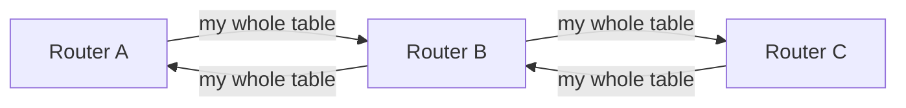
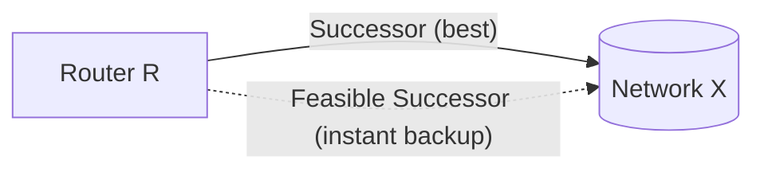
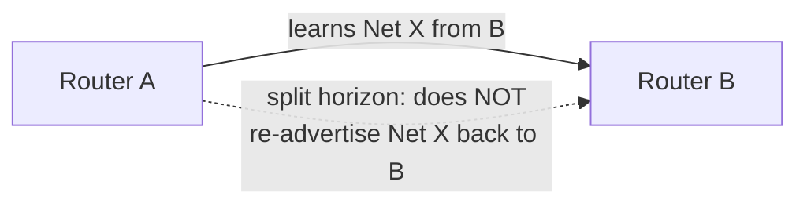

# Part H — Distance-Vector Protocols: RIP & EIGRP

> **Goal of this Part:** Learn the first family of dynamic routing — **distance-vector** ("routing by rumor"). We cover how it thinks, **RIP** (the simple classic) and **EIGRP** (Cisco's advanced hybrid), loop-prevention tricks, and real configs.

---

## H.0 The distance-vector idea ("routing by rumor")

A **distance-vector** protocol shares its **whole routing table** with its **direct neighbors** periodically. Each router trusts what neighbors tell it — it never sees the full network map, only "distance" (how far) and "vector" (which direction).

🔍 **Plain-English deep-dive:** Imagine asking the person next to you, *"How far is the airport and which way?"* They answer *"10 miles, that way"* — based on what **their** neighbor told **them**. You don't see a map; you trust the chain of rumors. That's distance-vector: fast and simple, but a wrong rumor can spread (loops), so it needs safety rules.



- **Distance** = the metric (e.g., hop count).
- **Vector** = the direction (which neighbor/interface).

---

## H.1 RIP — Routing Information Protocol

The original, simplest distance-vector protocol. Great for learning; rarely used in big modern networks.

### Key facts
| Attribute | Value |
|-----------|-------|
| Metric | **Hop count** (routers crossed) |
| Max hops | **15** (16 = "unreachable" → limits network size) |
| Updates | Full table every **30 seconds** (broadcast/multicast) |
| AD | **120** |
| Versions | RIPv1 (classful, no masks), **RIPv2** (classless, sends masks, supports VLSM) |

🔍 **Why max 15 hops?** It's a built-in **loop safety valve** — at 16 hops a route is declared unreachable, stopping rumors from circling forever. The trade-off: RIP can't be used on networks wider than 15 routers.

### RIP timers
- **Update** (30s): how often it sends its table.
- **Invalid** (180s): no update → route marked bad.
- **Hold-down** (180s): ignore worse info while things settle.
- **Flush** (240s): remove the route entirely.

### RIPv2 config
```cisco
Router(config)# router rip
Router(config-router)# version 2
Router(config-router)# no auto-summary          ! allow VLSM/CIDR
Router(config-router)# network 192.168.1.0      ! advertise this network
Router(config-router)# network 10.0.0.0

! Verify
Router# show ip route rip
Router# show ip protocols
```

---

## H.2 EIGRP — Enhanced Interior Gateway Routing Protocol

Cisco's **advanced distance-vector** protocol (often called a **hybrid** because it borrows link-state-like features). Fast, scalable, and loop-free by design.

### Key facts
| Attribute | Value |
|-----------|-------|
| Type | Advanced distance-vector ("hybrid") |
| Metric | **Composite**: bandwidth + delay (by default) |
| Algorithm | **DUAL** (Diffusing Update Algorithm) |
| AD | **90** (internal), 170 (external) |
| Updates | **Triggered** (only on change) — not periodic |
| Speed | Very fast convergence |
| Origin | Cisco (now an open standard) |

### EIGRP's smart pieces
- **Neighbors:** EIGRP first forms **neighbor relationships** using **Hello** packets, then exchanges routes — only updating when something **changes** (efficient).
- **Successor:** the **best** (lowest-metric) route to a destination — installed in the routing table.
- **Feasible Successor (FS):** a **pre-computed backup** route that's guaranteed loop-free. If the successor fails, EIGRP **instantly** swaps to the FS — no recalculation needed. This is EIGRP's superpower.
- **DUAL:** the algorithm that guarantees a loop-free path and manages successor/FS.

🔍 **Plain-English deep-dive — feasible successor:** It's like always knowing your **main route home AND a pre-checked backup route**. The moment the highway closes, you take the backup instantly because you already verified it's safe — no stopping to re-plan.



### EIGRP tables
EIGRP keeps **three** tables:
1. **Neighbor table** — directly connected EIGRP routers.
2. **Topology table** — all learned routes (successors + feasible successors).
3. **Routing table** — the chosen best routes (successors).

### EIGRP config
```cisco
! Classic syntax (AS number 100 must match on all routers)
Router(config)# router eigrp 100
Router(config-router)# no auto-summary
Router(config-router)# network 192.168.1.0 0.0.0.255    ! wildcard mask
Router(config-router)# network 10.0.0.0

! Verify
Router# show ip eigrp neighbors
Router# show ip eigrp topology
Router# show ip route eigrp
```
> Note the **wildcard mask** (`0.0.0.255` = inverse of `255.255.255.0`) — EIGRP and OSPF use wildcards, not subnet masks.

---

## H.3 Loop prevention in distance-vector ⭐

Because routers trust rumors, loops can form (A thinks B has the route, B thinks A does — "count to infinity"). Distance-vector uses several safeguards:

| Technique | What it does | Analogy |
|-----------|--------------|---------|
| **Split horizon** | Don't advertise a route back out the interface you learned it from | Don't tell someone news they just told you |
| **Route poisoning** | Mark a dead route with infinite metric (RIP: 16) | "This road is officially closed" |
| **Poison reverse** | Send the poisoned route *back* to the source to override split horizon | Loudly confirm "that road is dead" |
| **Hold-down timer** | Ignore worse updates for a while after a route fails | Wait for the dust to settle before believing new gossip |
| **Triggered updates** | Send an update immediately on change (don't wait) | Call right away instead of waiting for the weekly meeting |
| **Max hop count** | Cap distance (RIP=15) so loops self-terminate | A rumor that dies after 15 retellings |



---

## H.4 RIP vs EIGRP — comparison

| Feature | RIP | EIGRP |
|---------|-----|-------|
| Type | Basic distance-vector | Advanced/hybrid distance-vector |
| Metric | Hop count | Bandwidth + delay (composite) |
| Max size | 15 hops | Very large |
| Updates | Every 30s (full table) | Triggered (on change only) |
| Convergence | Slow | Very fast (feasible successors) |
| Algorithm | Bellman-Ford | DUAL |
| AD | 120 | 90 |
| Vendor | Open | Cisco (now open) |
| Use today | Labs/legacy | Cisco enterprise networks |

---

## ⭐ Likely Interview Questions

1. **What is a distance-vector routing protocol?**
   *One where each router shares its entire routing table with directly connected neighbors periodically, and chooses routes based on distance (metric) and vector (direction) — "routing by rumor."*

2. **What metric does RIP use and what's its limit?**
   *Hop count, with a maximum of 15 hops (16 = unreachable). This caps network size but prevents endless loops.*

3. **RIPv1 vs RIPv2?**
   *RIPv1 is classful and sends no subnet masks (no VLSM); RIPv2 is classless, includes masks (supports VLSM/CIDR), and uses multicast.*

4. **What is EIGRP and why is it called hybrid?**
   *An advanced distance-vector protocol that borrows link-state features (neighbor discovery, triggered updates, fast convergence). It uses the DUAL algorithm and a composite metric (bandwidth + delay).*

5. **What is a feasible successor in EIGRP?**
   *A pre-computed, loop-free backup route. If the primary (successor) fails, EIGRP switches to it instantly without recalculating — enabling very fast convergence.*

6. **What three tables does EIGRP maintain?**
   *Neighbor table, topology table, and routing table.*

7. **How does distance-vector prevent loops?**
   *Split horizon, route poisoning, poison reverse, hold-down timers, triggered updates, and a maximum hop count.*

8. **What is split horizon?**
   *A rule that a router won't advertise a route back out the same interface it learned it on, preventing a neighbor from creating a loop.*

9. **What is the administrative distance of RIP and EIGRP?**
   *RIP = 120, EIGRP = 90 (internal). The router prefers EIGRP when both offer the same route.*

10. **Why does EIGRP converge faster than RIP?**
    *EIGRP sends triggered (event-driven) updates and keeps feasible successors ready, while RIP relies on periodic 30-second updates and timers.*

---

## 🧠 30-Second Memory Hooks

- **Distance-vector = "routing by rumor"; share whole table with neighbors.**
- **RIP = hop count, max 15, updates every 30s, AD 120.**
- **EIGRP = hybrid, DUAL algorithm, bandwidth+delay, AD 90, triggered updates.**
- **Successor = best route; Feasible Successor = instant loop-free backup.**
- **EIGRP keeps 3 tables: neighbor, topology, routing.**
- **Loop prevention: split horizon, poison reverse, hold-down, max-hop.**
- **EIGRP/OSPF use wildcard masks (0.0.0.255), not subnet masks.**

---

➡️ **Next up:** [Part I — Link-State Protocols: OSPF](Part-I-Link-State-OSPF.md) — where every router builds a full map of the network.
