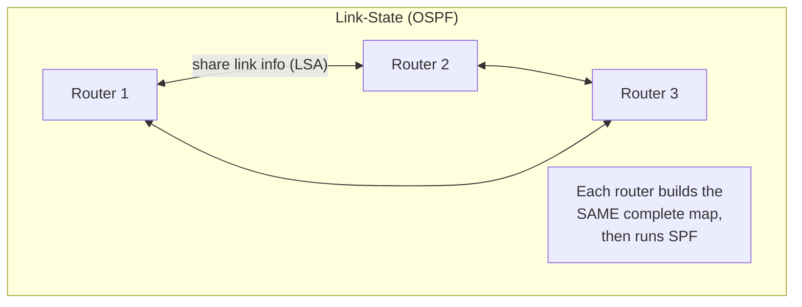
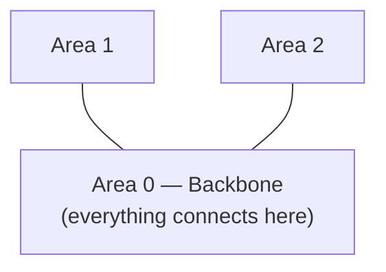
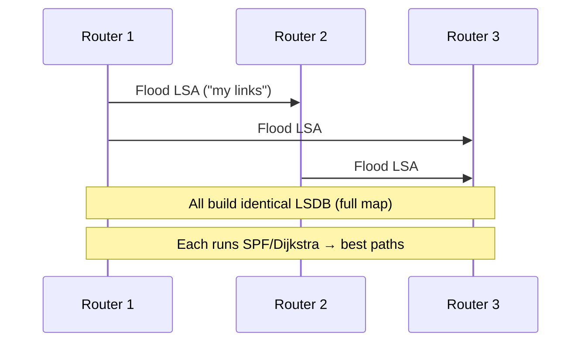
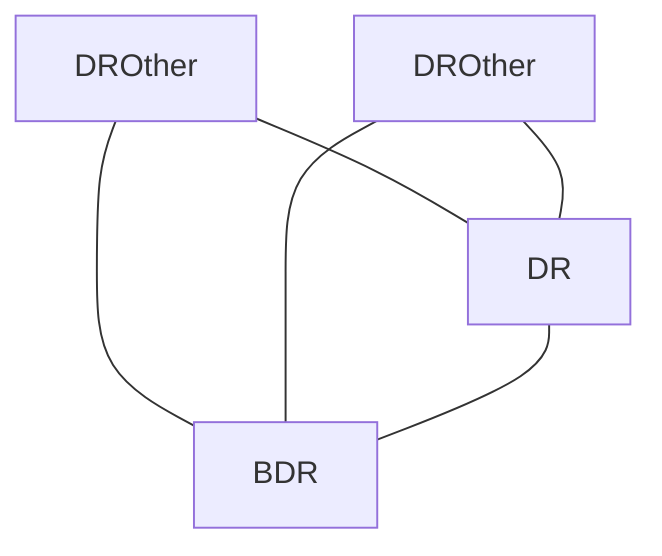
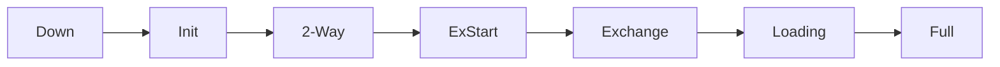

# Part I — Link-State Protocols: OSPF

> **Goal of this Part:** Master the most important enterprise IGP — **OSPF**. Unlike distance-vector "rumors," link-state protocols give **every router a full map** of the network. We cover areas, LSAs, DR/BDR, neighbor states, the SPF algorithm, and configs (single + multi-area).

---

## I.0 Link-state vs distance-vector (the core difference) ⭐

| | Distance-Vector (RIP/EIGRP) | Link-State (OSPF) |
|--|-----------------------------|-------------------|
| What's shared | Whole routing table, to neighbors | Link info (LSAs), flooded to all |
| What each router knows | Only neighbor summaries ("rumor") | A full map of the area |
| Path calculation | Trust neighbors' distances | Run **SPF/Dijkstra** on the map |
| Convergence | Slower | Fast |
| Resource use | Less CPU/memory | More CPU/memory |

🔍 **Plain-English deep-dive:** Distance-vector is asking strangers *"how far to the airport?"* and trusting them. Link-state is everyone **sharing their piece of the map**, so each router **assembles the complete map** and calculates the best route **itself** with math (Dijkstra's algorithm). More work, but far more accurate and loop-resistant.



---

## I.1 OSPF basics

**OSPF = Open Shortest Path First** — an open-standard link-state IGP, the workhorse of enterprise networks.

| Attribute | Value |
|-----------|-------|
| Type | Link-state IGP |
| Metric | **Cost** (based on bandwidth: lower cost = better) |
| Algorithm | **SPF / Dijkstra** |
| AD | **110** |
| Updates | Triggered + periodic LSA refresh (every 30 min) |
| Hello interval | 10s (broadcast networks) |
| Structure | Hierarchical (**areas**) |
| Transport | Directly over IP (protocol 89), uses multicast 224.0.0.5/.6 |

**Cost formula (classic):** `cost = reference bandwidth (100 Mbps) ÷ link bandwidth`. Faster link → lower cost → preferred.

---

## I.2 OSPF areas — the hierarchy ⭐

OSPF divides large networks into **areas** to keep things scalable. All areas must connect to **Area 0** (the **backbone**).

🔍 **Plain-English deep-dive:** Imagine a country split into states. Detailed local maps stay *within* each state (area); only **summaries** cross state lines. This keeps any one router from having to memorize the entire country — it knows its own area in detail and summaries of the rest. Less CPU, faster convergence, smaller tables.



**OSPF router roles:**
| Role | Meaning |
|------|---------|
| **Internal router** | All interfaces in one area |
| **ABR** (Area Border Router) | Connects an area to Area 0 |
| **ASBR** (Autonomous System Boundary Router) | Connects OSPF to an external network/protocol |
| **Backbone router** | Has an interface in Area 0 |

---

## I.3 LSAs and the LSDB

- **LSA (Link-State Advertisement):** a small message describing a router's links/state. Routers **flood** LSAs so everyone hears them.
- **LSDB (Link-State Database):** the collection of all LSAs = the **complete map**. Every router in an area has an **identical** LSDB.
- Each router then runs **SPF (Dijkstra)** on the LSDB to compute the shortest path to every network.



---

## I.4 DR and BDR — taming broadcast networks ⭐

On a shared (multi-access) network with many routers, having **everyone** flood LSAs to **everyone** = chaos (n² adjacencies). OSPF elects:
- **DR (Designated Router):** the central point all others report to and receive updates from.
- **BDR (Backup DR):** takes over instantly if the DR fails.

All other routers (**DROthers**) form full adjacency only with the DR/BDR — drastically reducing traffic.

🔍 **Deep-dive:** Instead of every employee emailing every other employee about every change (chaos), everyone reports to **one coordinator (DR)** who broadcasts the summary. The **deputy (BDR)** is ready to step in. Far fewer conversations.



**DR/BDR election:** highest **OSPF priority** wins (default 1; `0` = never DR); tie broken by highest **Router ID**.

> **Router ID (RID):** a 32-bit ID per router — highest loopback IP, else highest active interface IP, else manually set.

---

## I.5 OSPF neighbor states (the adjacency journey)

OSPF routers progress through states to become fully adjacent:



| State | What's happening |
|-------|------------------|
| **Down** | No Hellos heard yet |
| **Init** | Received a Hello (one-way) |
| **2-Way** | Both see each other; DR/BDR elected here |
| **ExStart** | Decide who starts the database exchange |
| **Exchange** | Swap database descriptions (DBD) |
| **Loading** | Request missing LSAs |
| **Full** | Databases synced — fully adjacent ✅ |

> Memory hook: **"Down, Init, 2-Way, ExStart, Exchange, Loading, Full."** Many neighbors stop at 2-Way on purpose (DROthers with each other).

---

## I.6 OSPF configuration

### Single-area OSPF
```cisco
Router(config)# router ospf 1                        ! process ID (locally significant)
Router(config-router)# router-id 1.1.1.1             ! optional but recommended
Router(config-router)# network 192.168.1.0 0.0.0.255 area 0
Router(config-router)# network 10.0.0.0 0.255.255.255 area 0

! Verify
Router# show ip ospf neighbor
Router# show ip route ospf
Router# show ip ospf database
```
> The `0.0.0.255` is a **wildcard mask** (inverse of the subnet mask). `area 0` ties the network to the backbone.

### Multi-area OSPF (an ABR)
```cisco
Router(config)# router ospf 1
Router(config-router)# network 10.1.1.0 0.0.0.255 area 0      ! backbone side
Router(config-router)# network 10.2.2.0 0.0.0.255 area 1      ! area 1 side
```

### Tuning cost
```cisco
Router(config-if)# ip ospf cost 10                   ! manual cost
Router(config)# auto-cost reference-bandwidth 10000  ! adjust for Gbps links
```

---

## I.7 OSPF vs EIGRP (frequent comparison)

| Feature | OSPF | EIGRP |
|---------|------|-------|
| Type | Link-state | Advanced distance-vector |
| Standard | Open (multi-vendor) | Cisco-origin (now open) |
| Metric | Cost (bandwidth) | Bandwidth + delay |
| Algorithm | SPF/Dijkstra | DUAL |
| AD | 110 | 90 |
| Structure | Hierarchical (areas) | Flat |
| Knows | Full map of area | Neighbor info + backups |
| Convergence | Fast | Very fast |

---

## ⭐ Likely Interview Questions

1. **How is link-state different from distance-vector?**
   *Link-state floods link info so every router builds an identical full map and computes its own best paths with SPF/Dijkstra; distance-vector just trusts neighbors' route summaries ("rumor").*

2. **What algorithm and metric does OSPF use?**
   *Dijkstra's Shortest Path First (SPF) algorithm, with cost (derived from bandwidth) as the metric — lower cost is preferred.*

3. **Why does OSPF use areas?**
   *To scale: areas localize detailed routing info and exchange only summaries across borders, reducing CPU, memory, table size, and speeding convergence. All areas connect to Area 0 (backbone).*

4. **What are an ABR and an ASBR?**
   *An ABR (Area Border Router) connects an area to the backbone (Area 0); an ASBR (Autonomous System Boundary Router) connects OSPF to an external network or another protocol.*

5. **What is an LSA and an LSDB?**
   *An LSA describes a router's links; the LSDB is the collection of all LSAs forming the complete network map, identical across all routers in an area.*

6. **Why does OSPF elect a DR and BDR?**
   *On multi-access networks, to avoid every router forming an adjacency with every other (n² flooding). The DR is the central update point; the BDR is the standby.*

7. **How is the DR elected?**
   *Highest OSPF priority wins (default 1; 0 = never); ties broken by highest Router ID.*

8. **What is the OSPF Router ID and how is it chosen?**
   *A 32-bit router identifier: highest loopback IP, else highest active interface IP, or manually configured.*

9. **Name the OSPF neighbor states in order.**
   *Down, Init, 2-Way, ExStart, Exchange, Loading, Full.*

10. **OSPF vs EIGRP — when would you pick OSPF?**
    *In multi-vendor environments (OSPF is an open standard), when you need a structured hierarchical design with areas; EIGRP is Cisco-centric with even faster convergence via feasible successors.*

---

## 🧠 30-Second Memory Hooks

- **OSPF = link-state, full map, SPF/Dijkstra, cost = bandwidth, AD 110.**
- **Link-state = everyone shares the map and computes their own path.**
- **Areas keep it scalable; all areas touch Area 0 (backbone).**
- **ABR = area↔backbone; ASBR = OSPF↔external.**
- **LSA = a map piece; LSDB = the full map (identical per area).**
- **DR/BDR reduce flooding on shared networks; highest priority/RID wins.**
- **Neighbor states: Down, Init, 2-Way, ExStart, Exchange, Loading, Full.**
- **Config uses wildcard masks + `area` number.**

---

➡️ **Next up:** [Part J — Path-Vector & The Internet's Glue: BGP](Part-J-Path-Vector-BGP.md) — the protocol that connects the entire Internet.
