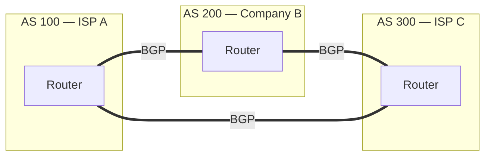
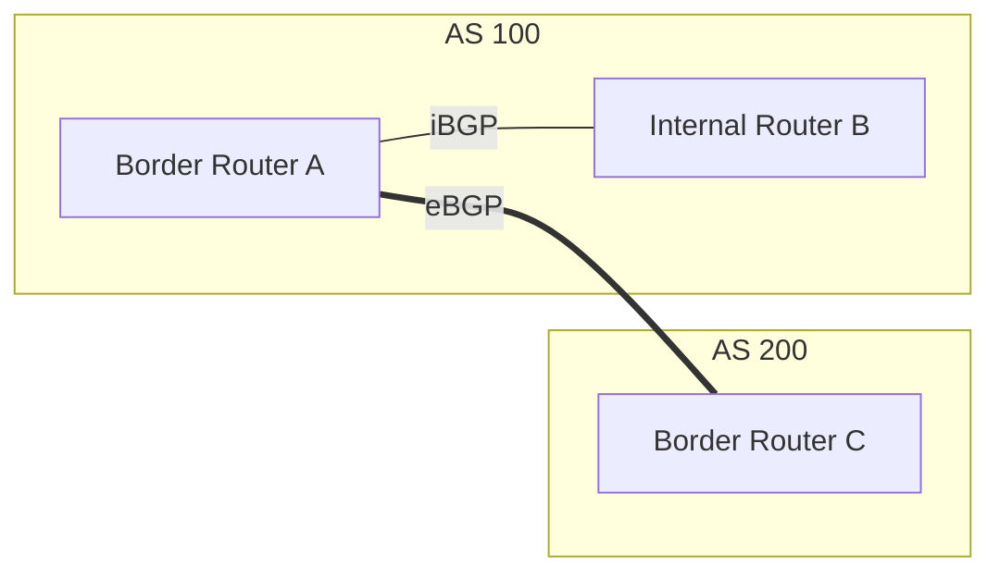
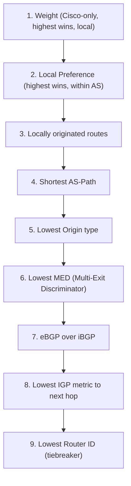
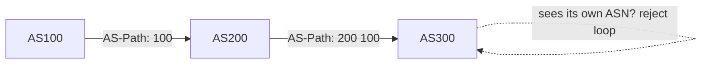
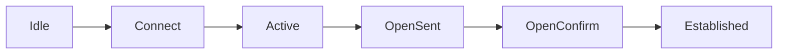
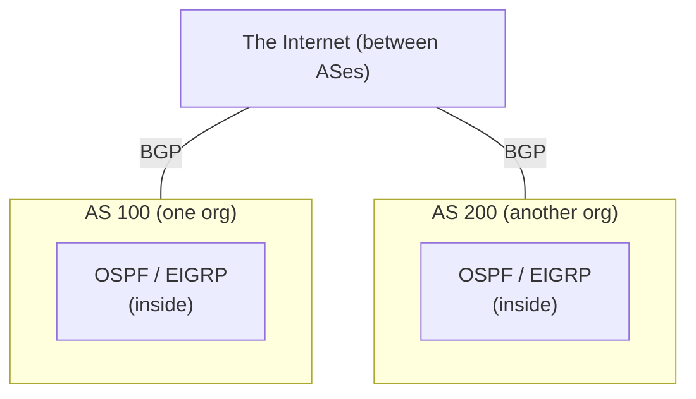

# Part J — Path-Vector & The Internet's Glue: BGP

> **Goal of this Part:** Understand the protocol that literally **runs the Internet** — BGP. We cover Autonomous Systems, IGP vs EGP, eBGP vs iBGP, path attributes & best-path selection, neighbor states, and basic config. BGP is policy-driven and different from everything before it.

---

## J.0 The big picture — why BGP exists

OSPF/EIGRP/RIP route *within* one organization. But the Internet is **70,000+ separate organizations** (ISPs, companies, clouds) that must interconnect. **BGP** is the protocol that stitches them together.

> **BGP = Border Gateway Protocol** — the **routing protocol of the Internet**. It exchanges routes **between** organizations (Autonomous Systems) based on **policy**, not just speed.

🔍 **Plain-English deep-dive:** IGPs (OSPF/EIGRP) are like the **roads inside a single city** — optimized for shortest travel time. BGP is the **treaties between countries** deciding which border crossings to use. The choice isn't always "fastest" — it's about **policy**: cost, business agreements, and trust. That's why BGP is called a **path-vector** protocol: it tracks the **entire path of networks (AS path)** a route travels, not just a hop count.

---

## J.1 Autonomous Systems (AS)

An **Autonomous System** is a network under one administrative control (e.g., an ISP or large company), identified by an **AS Number (ASN)** — a globally unique number assigned by IANA.



- **IGP (Interior Gateway Protocol):** routes *inside* an AS (OSPF, EIGRP).
- **EGP (Exterior Gateway Protocol):** routes *between* ASes — **BGP** is the only one used today.

---

## J.2 eBGP vs iBGP ⭐

| | **eBGP (external)** | **iBGP (internal)** |
|--|---------------------|---------------------|
| Between | Routers in **different** ASes | Routers in the **same** AS |
| Purpose | Exchange routes across orgs | Carry external routes across your AS |
| AD | **20** | **200** |
| TTL | Usually 1 (directly connected) | Can be multi-hop |

🔍 **Deep-dive:** **eBGP** is the conversation at the **border** between two companies. **iBGP** is how that border router tells the **rest of its own company** about the external routes it learned — so internal routers know how to reach the outside world.



---

## J.3 BGP characteristics

| Attribute | Value |
|-----------|-------|
| Type | Path-vector EGP |
| Transport | Runs over **TCP port 179** (reliable!) |
| Metric | **Path attributes** (policy), not hop count |
| AD | eBGP 20 / iBGP 200 |
| Updates | Incremental + keepalives (not periodic full dumps) |
| Scale | The whole Internet (~1M routes) |
| Neighbors | **Manually configured** ("peers" — not auto-discovered) |

> BGP uses **TCP** for reliability — unlike OSPF/EIGRP which run directly over IP. BGP peers are **explicitly configured**, not discovered.

---

## J.4 BGP path attributes & best-path selection ⭐

BGP doesn't pick "shortest" — it applies a **priority list of attributes** (policy knobs). The well-known order (Cisco), simplified:



The **most-tested** ones:
| Attribute | Meaning | Higher or lower wins? |
|-----------|---------|----------------------|
| **Weight** | Cisco-only, router-local preference | **Higher** |
| **Local Preference** | Preferred exit out of *your* AS | **Higher** |
| **AS-Path** | List of ASes the route crossed | **Shorter** |
| **MED** | Hint to neighbor AS which entry to use | **Lower** |

> Memory hook for best-path order: **"We Love Oranges AS Oranges Mean Pure Refreshment"** → **W**eight, **L**ocal-pref, **O**riginate, **AS**-path, **O**rigin, **M**ED, **P**aths(e/iBGP), **R**outer-id.

### AS-Path & loop prevention
The **AS-Path** lists every AS a route has crossed (e.g., `200 300 400`). If a router sees **its own ASN** already in the path, it **rejects** the route — that's how BGP prevents loops (path-vector logic).



---

## J.5 BGP neighbor (peer) states

Like OSPF, BGP peers move through states to establish a session:



| State | Meaning |
|-------|---------|
| **Idle** | Starting / waiting |
| **Connect** | Trying TCP connection |
| **Active** | Retrying TCP |
| **OpenSent** | Sent Open message |
| **OpenConfirm** | Waiting for keepalive |
| **Established** | Peering up — routes exchanged ✅ |

> Memory hook: **"Idle Cats Are Often Outright Established."** The goal state is **Established**.

---

## J.6 BGP configuration (basic)

```cisco
! Router in AS 100 peering with a neighbor in AS 200
Router(config)# router bgp 100
Router(config-router)# neighbor 203.0.113.2 remote-as 200    ! eBGP peer
Router(config-router)# network 192.168.1.0 mask 255.255.255.0  ! advertise

! An iBGP peer (same AS 100)
Router(config-router)# neighbor 10.0.0.2 remote-as 100

! Verify
Router# show ip bgp summary
Router# show ip bgp neighbors
Router# show ip bgp
```

> Key difference from IGPs: in BGP, `network` **advertises** a route you already have — it doesn't enable the protocol on an interface like OSPF's `network` does.

---

## J.7 Why BGP runs the Internet

- **Scales** to ~1 million routes across the globe.
- **Policy-driven** — organizations enforce business/peering agreements, not just speed.
- **Stable** — incremental updates + TCP reliability avoid constant churn.
- **Loop-free** via AS-Path.
- **Vendor-neutral** open standard.

> Real-world note: BGP misconfigurations have caused major Internet outages (e.g., accidental "route leaks" where one AS wrongly advertises others' routes). Its power and trust-based nature make correct config critical.

---

## J.8 Where every protocol fits (the whole routing picture)



| Scope | Protocols |
|-------|-----------|
| **Inside an org (IGP)** | OSPF, EIGRP, RIP, IS-IS |
| **Between orgs (EGP)** | **BGP** |

---

## ⭐ Likely Interview Questions

1. **What is BGP and what is it used for?**
   *Border Gateway Protocol — the path-vector EGP that exchanges routes between Autonomous Systems and runs the Internet, making policy-based path decisions.*

2. **What is an Autonomous System?**
   *A network under a single administrative control, identified by a globally unique AS Number (ASN).*

3. **eBGP vs iBGP?**
   *eBGP peers routers in different ASes (AD 20); iBGP peers routers within the same AS (AD 200) to propagate external routes internally.*

4. **Why does BGP use TCP?**
   *BGP runs over TCP port 179 for reliable, ordered delivery of routing updates — it doesn't need to build its own reliability like OSPF does.*

5. **How does BGP prevent routing loops?**
   *Via the AS-Path attribute: if a router sees its own ASN already in the path, it rejects the route.*

6. **Name some key BGP path attributes and how they're used.**
   *Weight (Cisco-local, higher wins), Local Preference (preferred exit from the AS, higher wins), AS-Path (shorter wins), and MED (lower wins) — applied in a defined priority order to select the best path.*

7. **Is BGP a distance-vector protocol?**
   *It's a path-vector protocol — a distance-vector variant that tracks the entire AS-Path rather than just a hop count, enabling policy and loop prevention.*

8. **What is the difference between IGP and EGP?**
   *IGPs (OSPF, EIGRP) route within one AS; EGPs (BGP) route between ASes.*

9. **What are BGP neighbor states?**
   *Idle, Connect, Active, OpenSent, OpenConfirm, Established — "Established" means the peering is up.*

10. **Why doesn't BGP just choose the fastest path like OSPF?**
    *Because Internet routing is about policy and business relationships (cost, peering agreements, security), not just speed — so BGP uses configurable path attributes.*

---

## 🧠 30-Second Memory Hooks

- **BGP = the Internet's protocol; path-vector EGP; TCP port 179.**
- **AS = one organization with a unique ASN.**
- **eBGP (AD 20) = between ASes; iBGP (AD 200) = within one AS.**
- **Best path order: Weight → Local-Pref → AS-Path → MED…** ("We Love Oranges...").
- **AS-Path = loop prevention** (reject if own ASN seen).
- **Peer states end at "Established."**
- **IGP = inside (OSPF/EIGRP); EGP = between (BGP).**

---

➡️ **Next up:** [Part K — Miscellaneous & Deeper Topics](Part-K-Misc-Deeper-Topics.md) — security, QoS, SDN, automation, troubleshooting, and current trends for the extra edge.
