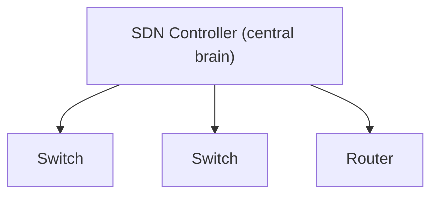
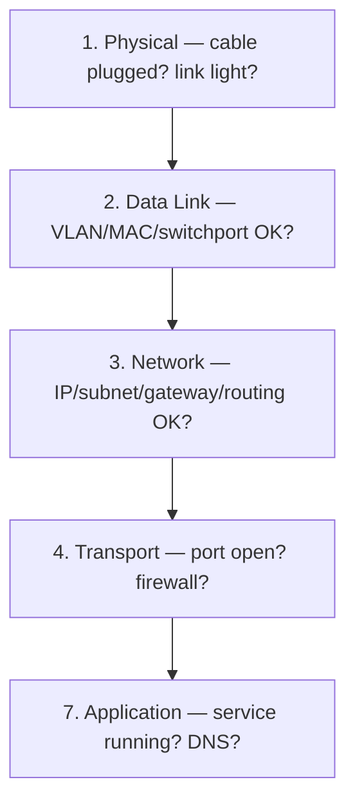

# Part K — Miscellaneous & Deeper Topics (The Extra Edge)

> **Goal of this Part:** Cover the adjacent and modern topics that separate a good candidate from a great one — security basics, QoS, IPv6 routing, multicast, SDN/automation/cloud trends, and a practical troubleshooting toolkit. These are the "bonus" questions that show breadth.

---

## K.1 Network Security Basics

### ACLs — Access Control Lists
An **ACL** is a list of permit/deny rules filtering traffic by IP, port, or protocol. *Like a bouncer with a guest list.*

- **Standard ACL** — filters by **source IP** only (numbered 1–99).
- **Extended ACL** — filters by source, destination, protocol, and port (numbered 100–199).

```cisco
! Extended ACL: allow web to a server, deny the rest
Router(config)# access-list 101 permit tcp any host 192.168.1.10 eq 443
Router(config)# access-list 101 deny ip any any
Router(config)# interface gig0/0
Router(config-if)# ip access-group 101 in
```
> ACLs have an **implicit "deny all"** at the end. Order matters — rules are read top-down.

### Firewalls
A **firewall** controls traffic between trusted and untrusted networks based on rules.
- **Stateless** — checks each packet alone (like an ACL).
- **Stateful** — tracks whole **connections** (remembers what you started — smarter).
- **Next-Gen (NGFW)** — adds app awareness, IPS, deep inspection (Layer 7).

🔍 **Deep-dive:** A stateless firewall is a guard checking each person's ID independently. A stateful firewall *remembers* "this person already entered for a meeting," so it lets the reply back in automatically.

### VPNs — Virtual Private Networks
A **VPN** creates an **encrypted tunnel** over the public Internet, so remote users/sites connect securely. *Like a private armored tube through a public city.*
- **IPsec** — site-to-site / secure tunnels (encryption + authentication).
- **SSL/TLS VPN** — remote-user access via browser.

### Other key concepts
| Term | Meaning | Hook |
|------|---------|------|
| **IDS/IPS** | Detect (IDS) / detect + block (IPS) attacks | "S = Stop" in IPS |
| **NAT as security** | Hides internal IPs | Side-benefit of NAT |
| **Zero Trust** | "Never trust, always verify" — auth every request | No implicit trust inside |
| **DMZ** | Semi-trusted zone for public servers | Buffer between in/out |
| **AAA** | Authentication, Authorization, Accounting | Who/what/track |
| **Port security** | Limit MACs per switch port | Stops rogue devices (L2) |

---

## K.2 QoS — Quality of Service

**QoS** prioritizes important traffic when the network is congested — so a video call doesn't stutter behind a file download.

🔍 **Deep-dive:** QoS is the **carpool/ambulance lane**. Voice and video are "ambulances" (latency-sensitive) and get priority; bulk downloads wait. Without QoS, everything shares one jammed lane equally.

| Mechanism | What it does |
|-----------|--------------|
| **Classification/Marking** | Tag traffic (DSCP/CoS) by importance |
| **Queuing** | Separate lines per priority |
| **Policing** | Drop traffic over a limit |
| **Shaping** | Buffer/smooth traffic to a rate |

- **Voice/video** need low **latency + jitter** (variation in delay) → highest priority.
- **Email/downloads** tolerate delay → best-effort.

---

## K.3 IPv6 routing & multicast (deeper)

- **IPv6 routing** uses the same protocols, upgraded: **OSPFv3**, **EIGRP for IPv6**, **MP-BGP**. Concepts (areas, AS-path, DUAL) are identical.
- **Multicast** = send **one** stream to **many** interested receivers (IPTV, stock tickers) — more efficient than unicast (one-to-one) copies or broadcast (to everyone).
  - **IGMP** = how hosts join multicast groups.
  - **PIM** = how routers build multicast distribution trees.

| Delivery | One-to… | Example |
|----------|---------|---------|
| **Unicast** | one | Normal web browsing |
| **Broadcast** | all (local) | ARP |
| **Multicast** | a group | Live video stream |
| **Anycast** | nearest of many | DNS root servers, CDNs |

---

## K.4 SDN, Automation & Cloud (modern trends) ⭐

### SDN — Software-Defined Networking
Traditionally each device has its own brain (**control plane**) and muscles (**data plane**). **SDN separates them**: a central **controller** programs all devices, so the network becomes software-programmable.

🔍 **Deep-dive:** Old way = every traffic cop decides independently. SDN = a **central traffic command center** that directs every intersection from one screen. Faster changes, consistent policy.


- **Control plane** = decides where traffic goes (the brain).
- **Data plane** = actually forwards packets (the muscle).
- **OpenFlow** = a protocol controllers use to program devices.

### Network Automation
Scripting/config tools replace manual CLI: **Ansible, Python (Netmiko/NAPALM), Terraform**, and APIs (**REST, NETCONF/YANG**). Benefits: speed, consistency, fewer human errors. ("Infrastructure as Code.")

### Cloud networking
- **VPC (Virtual Private Cloud)** — your private network inside AWS/Azure/GCP.
- **Security groups / NACLs** — cloud firewalls.
- **Load balancers, VPN/Direct Connect** — connect on-prem to cloud.
- Same fundamentals (subnets, routing, ACLs) — just virtualized.

### Other current trends
| Trend | One-liner |
|-------|-----------|
| **SD-WAN** | SDN applied to WAN links — smart, policy-based ISP selection |
| **Intent-Based Networking** | You declare *what* you want; system configures *how* |
| **Network as Code / GitOps** | Network configs versioned like software |
| **Zero Trust Network Access** | Identity-based access, no implicit trust |
| **AI/ML in networking** | Anomaly detection, predictive troubleshooting |
| **IPv6 adoption** | Slowly replacing IPv4 |
| **400G/800G Ethernet** | Ever-faster data-center links |

---

## K.5 Troubleshooting methodology & tools ⭐

### A structured approach (top-down or bottom-up the OSI stack)

> Tip: "Ping your way up the stack" — start local, expand outward: loopback → own IP → gateway → DNS → remote host.

### Essential CLI tools (know what each proves)
| Command | What it does | Proves |
|---------|--------------|--------|
| **ping** | ICMP echo to a host | Basic reachability + latency |
| **traceroute / tracert** | Shows each hop to a destination | Where the path breaks |
| **ipconfig / ifconfig / ip** | Show local IP config | Your address/gateway/DNS |
| **nslookup / dig** | Query DNS | Name resolution working? |
| **arp -a** | Show IP↔MAC cache | Layer-2 mapping |
| **netstat / ss** | Show connections & ports | What's listening/connected |
| **show ip route** | Router's routing table | Routing decisions |
| **show ip interface brief** | Interface status (Cisco) | Up/down + IPs |
| **show mac address-table** | Switch MAC table | L2 learning |
| **Wireshark / tcpdump** | Capture & inspect packets | Deep packet analysis |

### Classic "no Internet" walkthrough
1. **`ping 127.0.0.1`** — is my TCP/IP stack alive? (loopback)
2. **`ping <my IP>`** — is my NIC configured?
3. **`ping <gateway>`** — can I reach my router? (local network OK)
4. **`ping 8.8.8.8`** — can I reach the Internet by IP? (routing OK)
5. **`ping google.com`** — does DNS work? (if step 4 works but this fails → **DNS issue**)

🔍 **Deep-dive:** The magic test: if `ping 8.8.8.8` **works** but `ping google.com` **fails**, the network is fine — **DNS is broken**. This single distinction solves a huge share of real-world "Internet is down" tickets.

---

## ⭐ Likely Interview Questions

1. **What is an ACL and the difference between standard and extended?**
   *An Access Control List filters traffic by rules. Standard ACLs filter by source IP only; extended ACLs filter by source, destination, protocol, and port.*

2. **Stateless vs stateful firewall?**
   *Stateless inspects each packet independently (like an ACL); stateful tracks entire connections and automatically allows return traffic for sessions it permitted.*

3. **What is a VPN and how does it secure traffic?**
   *A Virtual Private Network creates an encrypted tunnel over a public network (e.g., IPsec or SSL/TLS), keeping data confidential and authenticated between endpoints.*

4. **What is QoS and why is it needed?**
   *Quality of Service prioritizes latency-sensitive traffic (voice/video) during congestion via classification, queuing, policing, and shaping.*

5. **Unicast vs broadcast vs multicast?**
   *Unicast is one-to-one, broadcast is one-to-all on a segment, multicast is one-to-a-group of interested receivers (efficient for streaming).*

6. **What is SDN and the control vs data plane?**
   *Software-Defined Networking centralizes the control plane (decision-making) in a controller, separating it from the data plane (forwarding), making the network programmable.*

7. **What is Zero Trust?**
   *A security model that trusts nothing by default — every request is authenticated and authorized regardless of network location ("never trust, always verify").*

8. **How would you troubleshoot "no Internet access"?**
   *Work up the stack: ping loopback, own IP, gateway, then 8.8.8.8, then a domain name. If IP pings work but names fail, it's a DNS issue; if the gateway fails, it's local; methodically isolate the layer.*

9. **What does traceroute show?**
   *Each router hop along the path to a destination with latency per hop — useful to locate where connectivity breaks or slows.*

10. **What is the difference between IDS and IPS?**
    *An IDS detects and alerts on suspicious traffic; an IPS sits inline and can actively block it.*

---

## 🧠 30-Second Memory Hooks

- **ACL = traffic guest list (implicit deny all at the end).**
- **Stateful firewall remembers connections; stateless doesn't.**
- **VPN = encrypted tunnel over public Internet.**
- **QoS = ambulance lane for voice/video.**
- **Unicast=one, Broadcast=all, Multicast=a group, Anycast=nearest.**
- **SDN = central brain (control plane) programs the muscles (data plane).**
- **Zero Trust = never trust, always verify.**
- **Troubleshoot up the stack; if 8.8.8.8 works but names don't → DNS.**

---

➡️ **Next up:** [Part L — Interview Question Bank](Part-L-Interview-Question-Bank.md) — 100+ questions across all topics with model answers and a self-quiz tracker.
