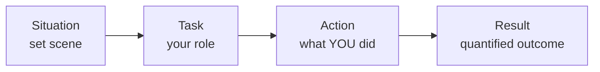

# Part M — Behavioral & Closing Prep

> **Goal of this Part:** Technical knowledge gets you in the door; the human side gets you the offer. This Part gives you the **STAR method**, a map from your background to networking competencies, ready-to-adapt stories, "why" answers, smart questions to ask, and a one-page night-before cheat sheet.

---

## M.1 The STAR method ⭐

Behavioral questions ("Tell me about a time…") are best answered with **STAR** — a 4-part structure that keeps you concise and complete.

| Letter | Meaning | What to say | Time |
|--------|---------|-------------|------|
| **S — Situation** | Set the scene | "At my last role, our network kept dropping at peak hours…" | ~15% |
| **T — Task** | Your responsibility | "I was responsible for finding the root cause…" | ~15% |
| **A — Action** | What **you** did (the meat) | "I captured traffic, traced it to a loop, and enabled STP…" | ~50% |
| **R — Result** | The outcome (quantify!) | "Outages dropped to zero; uptime hit 99.9%." | ~20% |

🔍 **Plain-English deep-dive:** STAR is a **mini-story with a point**. Without it, people ramble. With it, you sound organized and results-driven. **Spend most of your time on "Action" (what YOU did)** — interviewers want *your* contribution, not the team's. Always **end on a Result, ideally a number** ("reduced tickets 40%", "saved 5 hours/week").

> **Pro tip:** Prepare **5–6 flexible stories** that each can answer multiple questions (a problem-solving story doubles as a "pressure" story). You don't need 20 stories — you need 6 great ones you can angle different ways.

---

## M.2 Your background → networking competencies

> *(As a complete beginner / career-changer, your job is to translate non-networking experience into transferable strengths. Fill the right column with YOUR real examples.)*

| Networking competency | Transferable skill it maps to | Your example (fill in) |
|-----------------------|-------------------------------|------------------------|
| **Troubleshooting** | Any time you methodically debugged a problem | _______ |
| **Attention to detail** | Precise/careful work (configs are unforgiving) | _______ |
| **Learning fast** | Picking up a new tool/system quickly | _______ |
| **Communication** | Explaining technical things simply | _______ |
| **Working under pressure** | Hitting a deadline / handling an outage | _______ |
| **Documentation** | Writing clear notes/procedures | _______ |
| **Customer focus** | Helping users/clients | _______ |
| **Teamwork** | Collaborating across roles | _______ |

> **Career-changer framing:** *"I'm new to networking formally, but I've spent years [doing X], which is fundamentally about [troubleshooting / precision / learning fast]. I've now built that foundation by studying OSI, TCP/IP, switching, and routing protocols, and I [labbed in Packet Tracer / built configs] to make it hands-on."* Confidence + evidence of self-study beats apologizing for inexperience.

---

## M.3 Ready-to-adapt STAR stories (templates)

Fill each with your real details. Keep each answer ~60–90 seconds spoken.

### Story 1 — Problem-solving / troubleshooting
- **S:** A recurring problem at work/study (what was failing, who it affected).
- **T:** Your goal — find and fix the root cause.
- **A:** Your **methodical steps** — gathered data, formed a hypothesis, tested, isolated the cause, applied a fix. *(Mirror the "ping up the stack" logic — interviewers love structured thinking.)*
- **R:** Quantified result — "issue resolved, X% improvement, no recurrence."

### Story 2 — Learning something new fast
- **S:** You were handed an unfamiliar tool/topic with a deadline.
- **T:** Become productive quickly.
- **A:** Your learning system — docs, practice, small experiments, asking the right people.
- **R:** Delivered on time; now a go-to person for it. *(Doubles as "How do you handle the unknown?")*

### Story 3 — Teamwork / conflict
- **S:** A disagreement or a team under stress.
- **T:** Reach a good outcome while keeping the relationship healthy.
- **A:** Listened, found common ground, proposed a data-backed compromise.
- **R:** Resolved; project succeeded; relationship intact.

### Story 4 — Mistake / ownership
- **S:** Something you got wrong.
- **T:** Fix it and prevent recurrence.
- **A:** Owned it immediately, communicated, corrected it, added a safeguard.
- **R:** Recovered trust; the safeguard prevented repeats. *(Honesty + growth = strong signal.)*

### Story 5 — Communication / explaining tech simply
- **S:** You had to explain something technical to a non-expert.
- **T:** Make them understand and act.
- **A:** Used an analogy, checked understanding, avoided jargon.
- **R:** They got it and made a good decision. *(This guide itself — explaining via analogies — is proof you can do this.)*

---

## M.4 "Why" answers (adapt to you)

| Question | Framework for a strong answer |
|----------|-------------------------------|
| **Why networking?** | A genuine hook ("I love understanding how things connect end-to-end") + evidence (self-study, labs) + future ("I want to grow into [network engineering / security]"). |
| **Why this company?** | Specific research — a product, value, or project that excites you, tied to what you offer. *(Never generic — name something real.)* |
| **Why you / why should we hire you?** | 2–3 differentiators mapped to their needs: "strong fundamentals + proven fast learner + [your unique background]." |
| **Where in 3–5 years?** | Growth aligned with the team: "Deepen into [OSPF/BGP/security], earn [CCNA], take on more ownership." |
| **Biggest weakness?** | A real one + active fix: "I was light on [X]; I've been studying it deliberately and labbing it." *(Avoid fake humblebrags.)* |

---

## M.5 Smart questions to ask THEM ⭐

Always have 3–5 ready — it signals genuine interest. Pick a mix:

**About the role/team**
- "What does a typical day or week look like for this role?"
- "What are the biggest networking challenges the team is tackling right now?"
- "What does success look like in the first 90 days?"

**About growth**
- "How does the team support learning and certifications like CCNA?"
- "What career paths have people in this role grown into?"

**About tech/process**
- "What does your network stack look like — primarily Cisco, multi-vendor, cloud?"
- "How much automation (Ansible/Python) is part of the workflow?"
- "How does the team handle changes and incidents?"

**Smart closer**
- "Is there anything about my background that gives you hesitation? I'd love to address it." *(Bold — lets you handle objections live.)*

> **Avoid** asking only about salary/time-off in the first round, or anything answered on their website (shows you didn't research).

---

## M.6 Night-before cheat sheet (one page)

> Glance at this the morning of. Don't cram new material — reinforce anchors.

**🧠 Top anchor facts**
- OSI: **All People Seem To Need Data Processing** (7→1).
- PDUs: **Data → Segment → Packet → Frame → Bits**.
- TCP handshake: **SYN → SYN-ACK → ACK**.
- TCP = reliable; **UDP = fast** (DNS, DHCP, SNMP, voice/video).
- Private IPs: **10 / 172.16–31 / 192.168**.
- Usable hosts = **2^host − 2**; **/24 = 254**.
- AD (lower wins): **C0 < S1 < EIGRP90 < OSPF110 < RIP120**; eBGP20/iBGP200.
- Metrics: RIP=hops, OSPF=cost, EIGRP=bw+delay, BGP=attributes.
- Switch=L2/MAC, Router=L3/IP; **STP kills loops**.
- **DNS test:** ping 8.8.8.8 works but name fails → DNS.

**🎤 Behavioral**
- Have **5–6 STAR stories** ready; lead with Action, end on a **number**.
- Career-changer line: *fundamentals + fast learner + my background.*

**🗣️ Logistics**
- 3–5 **questions to ask** prepared.
- Say answers **aloud** beforehand — don't just read.
- Breathe, slow down, think out loud (interviewers want your reasoning).
- It's OK to say *"Let me think for a second"* — structured beats fast.

---

## M.7 Am I ready? (an honest word)

Reading this guide builds **knowledge** — a huge step. But real **readiness** also needs:
1. **Saying answers aloud** (knowing ≠ articulating).
2. **Writing YOUR real STAR stories** (the templates are scaffolding — fill them with truth).
3. **Hands-on practice** — lab the configs in **Cisco Packet Tracer** or **GNS3** (free). Seeing OSPF neighbors come up cements it.
4. **Mock interviews** — practice under mild pressure.

> Offer stands: I can **run a mock interview** (technical or behavioral), **co-write your STAR stories** from your real experience, or **quiz you** from Part L. Just ask.

---

## 🧠 30-Second Memory Hooks

- **STAR = Situation, Task, Action (most time), Result (quantify).**
- **6 flexible stories > 20 rigid ones.**
- **Career-changer = fundamentals + fast learner + unique background.**
- **Always end results with a number.**
- **Always have 3–5 questions to ask them.**
- **Readiness = say it aloud + real stories + labs + mocks.**

---

🎉 **You've reached the end of the guide.** Work the Parts in order, drill [Part L](Part-L-Interview-Question-Bank.md) aloud, lab the configs, and you'll walk in prepared. Back to the [master index](../Networking%20Fundamentals%20&%20Routing%20-%20Study%20Guide.md).
