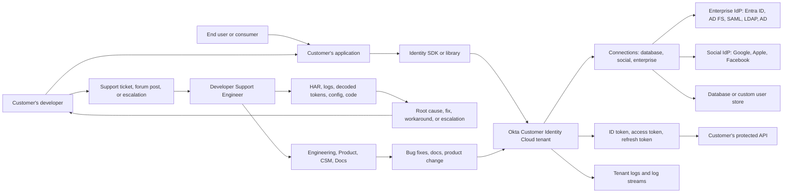
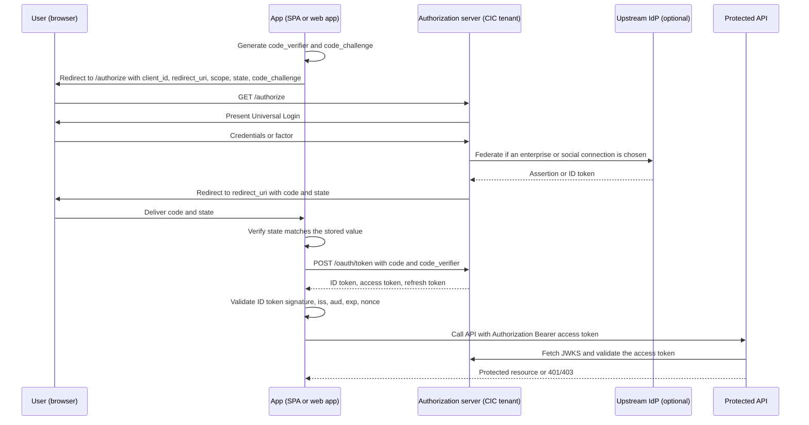
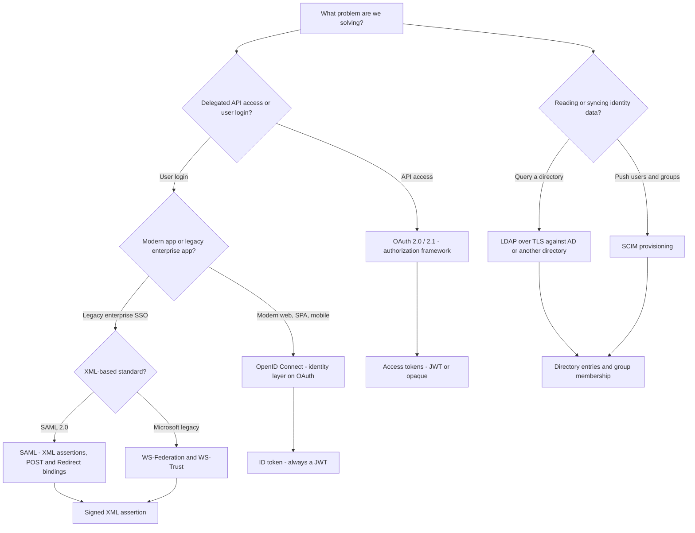
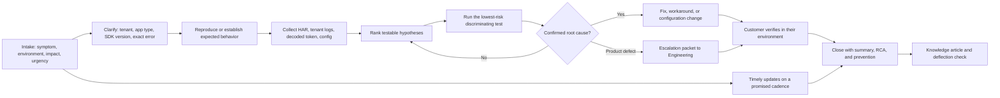
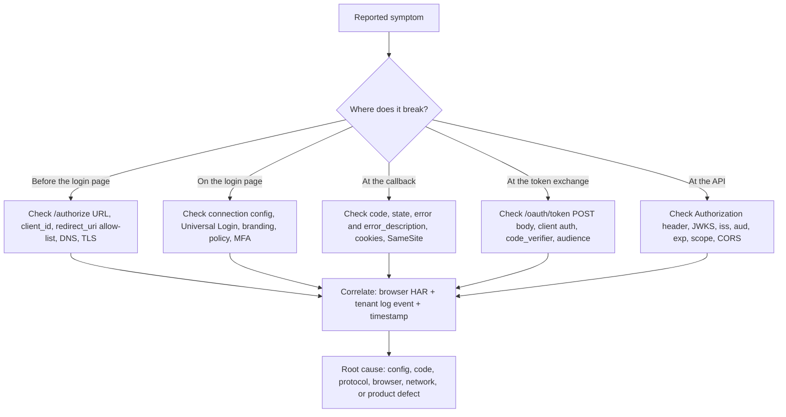

# Okta Developer Support Engineer - Complete Study Guide

> **Role:** Developer Support Engineer, Okta - Bengaluru, India (Onsite) - Req `P19357_3403190`
> **Product scope:** Okta **Customer Identity** SaaS (Customer Identity Cloud / Auth0), with Workforce Identity as adjacent cross-coverage
> **Mode:** Interview preparation
> **Teaching approach:** Beginner-first, zero assumed knowledge, no page or size limit, diagram-rich, lab-driven
> **Currency date:** August 25, 2026
> **Generation state:** COMPLETE. All Groups A-M generated (Parts 001-130) and all Appendices A-L generated. Nothing outstanding.

This guide is built for **your transition from enterprise escalation support for SaaS products into an Okta Developer Support Engineer role** supporting a **Customer Identity SaaS platform**. The goal is practical interview readiness: for any likely question, do not go blank. Explain the fundamentals first, connect them to evidence, troubleshoot methodically, communicate clearly, and stay honest about what was done in production versus what was learned or simulated.

> **How to use this guide:** It is written for **any** candidate preparing for this role. The candidate map below describes a *typical* starting profile, not one person's CV, and every model answer is a template. Replace the bracketed details, metrics, employers, products, and examples with evidence from your own CV before you use them, and never claim experience you cannot defend.

No Part may imply production use of Okta, Auth0, or any platform that is only a learning target. All hands-on work uses free tiers, localhost, public standards, synthetic data, or local simulations, and produces inspectable artifacts.

---

## How to Use This Confirmation Index

1. Review the candidate map, mastery outcomes, orientation diagrams, learning paths, JD coverage matrix, and all 130 Part titles.
2. **Confirm the curriculum or request changes** before any lesson is generated.
3. After confirmation, request one Part at a time ("next", or "Part 059"). Each Part is created at its linked path under `prep/`, and its tracker status is updated to Done.
4. Appendices are generated only when explicitly requested.
5. Treat reading as the knowledge layer. Labs, spoken answers, and adapted STAR stories are what create interview readiness.

---

## Candidate Background and Honest-Gap Map

### What the CV Actually Supports

| Evidence area | Candidate evidence from the CV | Natural advantage for this role | Boundary to preserve |
|---|---|---|---|
| Enterprise support tenure | Several years of progressive enterprise support experience, from intern through senior escalation engineer | Directly satisfies the "5 years+ technical support" requirement; ownership, urgency, and enterprise expectations are proven | Microsoft scope is SaaS collaboration support, not identity-vendor developer support |
| End-to-end ownership | Owns business-critical escalations and critical situations from investigation to resolution | Exact match for "end-to-end ownership of customer issues, including initial troubleshooting, root cause and resolution" | Do not imply ownership of Okta or Auth0 tenants |
| Root cause analysis | Structured troubleshooting and RCA across application, client, network, and configuration layers | Exact match for "instinctive ability to subdivide problems into basic components" | Identity-protocol RCA is a new application of the same method |
| HTTP and TLS | HTTP/HTTPS, TLS/SSL, TCP/IP, OSI, DNS/DHCP, proxies, firewalls, ports, routing | Direct match for the "Knowledge of HTTP, encryption, basic security concepts" requirement | Framed as applied support knowledge, not network engineering ownership |
| Evidence tooling | Wireshark, Netsh, Network Monitor, Procmon, browser DevTools, HAR logs, Fiddler | HAR and DevTools are the daily bread of developer support for browser-based auth | Depth must be demonstrable with a repeatable walkthrough |
| Identity and directory | Active Directory, LDAP, Group Policy, user/group administration, authentication and authorization, Azure Identity / Microsoft Entra ID | Direct match for the JD's named "LDAP, Azure AD" and "authentication and authorization concepts" | Directory administration is not federation-protocol engineering; state the depth precisely |
| Programming | Python, JavaScript, SQL/PostgreSQL, Power Automate, Power Apps, Copilot Studio | Satisfies "proficient in at least one programming language"; JavaScript is the JD's stated ideal | JavaScript depth must be demonstrated with real code, not listed |
| Software fundamentals | SDLC, API and web service fundamentals, client-server architecture, cloud SaaS fundamentals | Direct match for "knowledge of software development fundamentals and common architectures" and "knowledge of the Development lifecycle" | Support-side lifecycle exposure, not shipping product code |
| Customer obsession | a strong customer-satisfaction record, repeated peer and customer recognition, an internal excellence award, internal recognition awards | Strong, quantified proof for "customer-obsessed attitude" and "highest level of customer satisfaction" | Use the real numbers; never inflate them |
| Cross-functional work | Partners with Engineering, Product, Delivery Partners, Customer IT, and Vendors | Direct match for "collaborate with other departments" and "internal and external point of contact" | Describe the influence honestly; you inform fixes, you do not author them |
| Knowledge sharing | KB articles, troubleshooting guides, best-practice docs, triages, case bashes, mentoring, technical interviews | Direct match for "contribute to and maintain repository of product-area knowledge" | Microsoft-internal KB systems, not Okta's |
| Operational analytics | CSAT, backlog health, case quality, escalation trend analysis; a postgraduate business-analytics qualification | Direct match for "business and technical analysis skills" and "continuous growth" | Analysis informed process; it was not a standalone analyst role |
| Leadership and initiative | SME accreditation, technical-advisor programme, a leadership-development council, onboarding new engineers | Direct match for "proactivity", "self-starter", and "team player" | Individual-contributor leadership, not people management |
| AI exposure | Copilot support, Copilot Studio agents, AI certifications | Useful bridge to Okta's "secure every identity, from AI to human" thesis and to agent identity topics | Copilot support is not agentic-identity engineering |

### Named Gaps to Close Honestly

| Gap | Why it matters for this JD | How this guide closes it | Interview framing |
|---|---|---|---|
| **Okta / Auth0 product** | The entire role is supporting a Customer Identity SaaS platform | Parts 096-110 plus free-tier tenant labs | "I have not operated an Okta tenant in production. In a free-tier tenant I built and broke the following flows..." |
| **OAuth 2.0 / OIDC depth** | Explicitly named; developer tickets are mostly these | Parts 056-078 with hands-on token labs | "I understood these as a consumer of Microsoft identity; I have now built the flows end to end in a lab." |
| **SAML and WS-Federation** | Explicitly named | Parts 079-086 with decoded assertion labs | "I can decode an assertion, verify the signature chain, and name the top ten failure modes." |
| **JavaScript proficiency** | JD says "ideally JavaScript" | Parts 024-033 with a real SPA + Node lab | "Python is my strongest language; here is a JavaScript SPA and Express API I wrote to learn the auth flows." |
| **Developer-facing support** | Audience shifts from IT admins to developers | Parts 004, 030-033, 111-118 | "My prior customers were IT admins; the method is identical, the artifacts change from tenant configs to code and HAR." |
| **Consumer-scale CIAM patterns** | B2C signup, progressive profiling, social login, bot abuse | Parts 099-105, 108 | Learned architecture plus lab, clearly labelled |

### Claim-Safety Language

| Evidence tier | Meaning in this guide | Safe interview phrasing | Examples in scope |
|---|---|---|---|
| **Production experience** | Explicitly supported by the CV | "In my prior enterprise escalation role, I owned..." then situation, action, result | SharePoint Online, OneDrive, Sync Client, Copilot, critical situations, RCA, escalation to Engineering, KB authoring, mentoring, CSAT and backlog analysis, HAR/Fiddler/Wireshark/Procmon investigation, AD/LDAP/Group Policy and Entra ID case work |
| **Lab experience** | A repeatable simulation completed during preparation, with saved evidence | "I have not run that in production. In a free-tier lab I demonstrated..." | Auth0/Okta free-tier tenants, Authorization Code + PKCE, SAML assertion decoding, JWKS validation, LDAP queries against a local directory, Express API guard, HAR capture of a login |
| **Learned architecture** | Understood from official documentation without hands-on ownership | "My current understanding from the official documentation is..." then explain and state how you would verify | Okta Identity Engine internals, Auth0 Organizations at scale, FGA, Auth0 for AI Agents, enterprise migration programmes |
| **No direct experience** | A named gap never disguised | "I have not done that yet. The closest transferable experience is..., and my ramp plan is..." | Okta/Auth0 production tenants, Zendesk/Salesforce at Okta, Okta-internal escalation paths |

> **Honesty rule:** Architecture knowledge is not operations experience. A lab is not production ownership. A transferable skill is not tool equivalence. Every answer should signal its evidence tier when the distinction matters.

---

## Mastery Outcomes

After completing the curriculum, labs, spoken practice, and portfolio artifacts, you should be able to:

1. Explain what Okta does, how Customer Identity differs from Workforce Identity, and where a Developer Support Engineer sits in the customer journey.
2. Describe the Developer Support Engineer role honestly against several years of enterprise escalation experience.
3. Explain software development fundamentals, common application architectures, and the development lifecycle in the terms a customer's developer uses.
4. Trace a complete web request through DNS, TCP, TLS, HTTP, proxy, and browser layers and name the evidence available at each hop.
5. Read and reason about HTTP methods, status codes, headers, redirects, caching, and content negotiation without guessing.
6. Explain cookies, `SameSite`, domain and path scoping, partitioning, and the browser storage model, and predict how each breaks single sign-on.
7. Explain the same-origin policy, CORS, preflight, and why CORS errors dominate developer identity tickets.
8. Explain third-party cookie deprecation and its concrete impact on silent authentication and iframe-based session checks.
9. Read, write, and debug JavaScript including asynchronous control flow, the event loop, promises, `fetch`, and module tooling.
10. Build and debug a Single Page Application, a regular web application, a native application, and a machine-to-machine client.
11. Distinguish encoding, hashing, encryption, and signing, and explain symmetric versus asymmetric cryptography from zero.
12. Explain certificates, PKI, chains of trust, the TLS handshake, mutual TLS, and the certificate failures that appear in support cases.
13. Decode a JWT by hand, explain JWS/JWE/JWK/JWKS, and list every validation step a correct verifier performs.
14. Distinguish ID tokens, access tokens, refresh tokens, and opaque tokens, and reason about lifetime, rotation, revocation, and introspection.
15. Explain authentication versus authorization, sessions versus stateless tokens, and federation trust establishment.
16. Explain MFA factors, assurance, step-up, passwordless, WebAuthn/FIDO2, and passkeys in plain language.
17. Compare RBAC, ABAC, and relationship-based authorization, and explain scopes, claims, consent, and least privilege.
18. Walk through every OAuth 2.0 grant type step by step, including PKCE, refresh-token rotation, device flow, and token exchange.
19. Explain why implicit and resource-owner-password grants were deprecated, and articulate OAuth 2.1 and Security BCP guidance.
20. Explain sender-constrained tokens (DPoP, mTLS binding) and current best practice for public and confidential clients.
21. Diagnose any OAuth or OIDC error response from the error code, the redirect URI, and the authorization server logs.
22. Explain OIDC end to end: ID tokens, flows, `response_mode`, UserInfo, discovery, session management, and logout channels.
23. Explain silent authentication, `prompt=none`, and why it fails under modern browser cookie policy.
24. Read a SAML request and response, verify signatures, map attributes, and troubleshoot the standard SAML failure catalog.
25. Explain WS-Federation and WS-Trust, where they are still used, and how to bridge them to modern protocols.
26. Explain directory services, LDAP operations and filters, Active Directory structure, Kerberos and NTLM, and Group Policy.
27. Explain Microsoft Entra ID architecture, app registrations, service principals, v1 versus v2 endpoints, MSAL, and Conditional Access.
28. Explain hybrid identity: Entra Connect, password hash sync, pass-through authentication, federation with AD FS, and seamless SSO.
29. Configure and troubleshoot Entra ID as an external enterprise identity provider for a Customer Identity platform.
30. Explain SCIM provisioning, just-in-time provisioning, and directory synchronisation failure modes.
31. Navigate the Customer Identity Cloud object model: tenants, domains, applications, APIs, connections, users, and grants.
32. Explain database, social, and enterprise connections, custom database scripts, and password migration strategies.
33. Explain Universal Login, branding, extensibility with Actions and Flows, and Organizations for B2B multi-tenancy.
34. Use the Management API and Authentication API correctly, including their different tokens, scopes, and rate limits.
35. Read tenant logs and event codes, design log streaming, and correlate tenant events with client-side HAR evidence.
36. Explain attack protection, bot detection, adaptive MFA, fine-grained authorization, and identity for AI agents.
37. Apply a repeatable identity troubleshooting method: symptom, hypothesis, discriminating test, observation, next action.
38. Assemble a clean evidence kit (HAR, tenant logs, decoded token, exact timestamps, correlation IDs) and redact it safely.
39. Produce RCA write-ups, escalation packets, minimal reproducible examples, bug reports, and postmortems that engineers can act on.
40. Own a ticket end to end with timely, audience-appropriate updates for developers, IT admins, and executives.
41. Handle difficult conversations, outages, and de-escalation while preserving trust.
42. Write internal and external knowledge-base content that deflects repeat cases, and measure whether it worked.
43. Use CSAT, first-contact resolution, MTTR, backlog, reopen, and escalation metrics to drive operational improvement.
44. Use AI assistance in support safely, with privacy controls, verification, and human approval.
45. Answer recruiter, hiring-manager, technical-panel, live-troubleshooting, behavioral, and closing questions with honest, evidence-backed structure.

---

## Five Orientation Diagrams

### 1. The Customer Identity Ecosystem and Where This Role Sits

### 2. Authorization Code Flow with PKCE, End to End

### 3. The Protocol Family Map

### 4. Developer Support Ticket Lifecycle

### 5. Identity Troubleshooting Evidence Path

---

## Learning Paths

Part ranges are inclusive. In every compressed route, Part 001's honesty framework and Part 007's lab-safety rules remain mandatory.

| Path | Recommended sequence | Best for | Exit proof |
|---|---|---|---|
| **Full linear** | 001-130, then Appendices A-L | Complete beginner-first mastery | Every completion checklist, all labs, spoken answers, portfolio review |
| **Interview crunch** | 001-005, 011-016, 024-025, 034, 041-046, 056-061, 065, 070-072, 079-080, 087-090, 096-098, 102-107, 111-113, 127-130 | A near-term interview needing broad coverage | Role map, protocol comparison, token walkthrough, live troubleshooting drill, timed mock |
| **Protocol-first** | 034-045, 046-055, 056-069, 070-078, 079-086, 111-113, 127 | Closing the largest stated gap: OAuth, OIDC, SAML, WS-Fed | Decoded JWT, decoded SAML assertion, PKCE lab, protocol decision matrix |
| **JavaScript bridge** | 024-033, 011-023, 096-103, 111-118 | Turning listed JavaScript into demonstrable JavaScript | Working SPA + Express API with a real login, published as a lab repo |
| **Microsoft-strength bridge** | 087-095, 101, 079-086, 070-078, 111-118 | Converting AD, LDAP, Group Policy and Entra ID experience into an Okta advantage | Entra-as-enterprise-connection lab, LDAP query transcript, hybrid identity map |
| **Support-operations** | 001-010, 111-126, 127-130 | Leaning on several years of enterprise escalation strength | Case plan, escalation packet, RCA, KB article, metrics story, STAR set |
| **Lab-first** | 007, 024-033, 056-061, 096-110, 111-118, then theory gaps | Learning by producing evidence before deeper theory | Reproducible lab repository with configs, HAR, redacted logs, and conclusions |
| **Platform-first** | 096-110, 056-078, 111-118, 127-130 | Fast product fluency for a product-heavy panel | Tenant map, connection matrix, Actions pipeline, log-event decoder |

---

## Supplied JD Coverage Matrix

Every responsibility, requirement, technical focus item, and culture signal from the supplied job description is accounted for below. "Proof artifact" means a tangible output to create later, not a claim that it exists today.

| JD signal | Parts | Tangible proof artifact |
|---|---:|---|
| Support and maintain customers who implemented the Customer Identity SaaS solution | 001, 003, 096-110 | Customer Identity platform map and support-surface inventory |
| Resolve technical and non-technical customer issues in a timely fashion | 004-005, 111-121 | Response-time playbook with technical and non-technical templates |
| Operational management of support tickets | 005, 119, 124 | Ticket hygiene rubric, queue triage plan, and prioritisation model |
| Build and maintain excellent client relationships; highest customer satisfaction | 002, 120-122, 129-130 | Trust-building update sequence and CSAT-grounded STAR story |
| End-to-end ownership from troubleshooting to root cause to resolution | 005, 111-118 | End-to-end case capstone with hypothesis ledger and RCA |
| Exceed expectations on response quality, timeliness, and overall experience | 119-123 | Quality rubric, cadence commitments, and self-audited sample case |
| Serve as internal and external point of contact | 005, 120-122 | Stakeholder map and escalation communication matrix |
| Startup atmosphere; extended support team; whatever it takes | 001, 124, 130 | Ownership narrative and "beyond scope" STAR story |
| Business and technical analysis skills plus development-lifecycle knowledge | 009-010, 030-033, 123-124 | Requirements-to-defect analysis and SDLC-aware escalation write-up |
| Promote best practices | 010, 054-055, 066-068, 104, 122 | Customer-facing identity best-practice checklist |
| Collaborate with other departments | 118, 122 | Engineering, Product, CSM and Docs collaboration workflow |
| Contribute to and maintain a product-area knowledge repository | 121, 126 | Internal runbook plus external KB article pair |
| Promote team knowledge sharing and collaboration | 121-122, 126 | Case-bash and triage facilitation plan |
| 5 years+ technical support or software development | 001, 129-130 | CV-grounded competency matrix and evidence inventory |
| Strong analytical and problem-solving skills | 111-118 | Decision trees and discriminating-test ledger |
| Self-starter on complex concepts with minimal assistance | 001, 007, 128-130 | Gap ledger, self-study log, and lab portfolio |
| Quickly context-switch across multiple complex work streams | 119, 124 | Personal operating system: queue, notes, and context-recovery method |
| Subdivide problems into basic components to pinpoint root cause | 111-114 | Layered isolation matrix from browser to API to tenant |
| Customer-obsessed attitude and customer advocacy | 002, 120-122, 130 | Advocacy STAR story and voice-of-customer brief |
| Team player with communication and presentation skills | 120-122, 126, 128 | Technical presentation and case-review walkthrough |
| Proactivity and preemptive action | 122-124 | Trend-detection and proactive-notification proposal |
| Continuous growth | 001, 128, 130 | Deliberate-practice tracker and 30/60/90 ramp plan |
| Software development fundamentals and common architectures | 009-010, 018, 029-030 | Architecture sketch set: SPA, web app, native, M2M, microservice |
| Knowledge of HTTP | 011-023 | Annotated HAR of a complete login and API call |
| Knowledge of encryption | 034-045 | Cryptography primitives worksheet and TLS handshake walkthrough |
| Basic security concepts | 006, 046-055 | Threat model of a login flow with mitigations |
| Understanding of authentication and authorization concepts | 046-055 | AuthN versus AuthZ decision matrix and RBAC/ABAC/ReBAC comparison |
| **OAuth 2.0** | 056-069 | Grant-by-grant walkthrough plus PKCE and refresh-rotation lab |
| **OIDC** | 070-078 | ID-token validation checklist and discovery-document annotation |
| **SAML** | 079-084, 086 | Decoded assertion, signature verification, and failure catalog |
| **WS-Federation** | 085-086 | WS-Fed versus SAML versus OIDC bridging map |
| **LDAP** | 087-088, 091, 095 | LDAP filter cookbook and query transcript against a local directory |
| **Azure AD / Microsoft Entra ID** | 090-093, 101 | Entra app-registration walkthrough and Entra-as-enterprise-connection lab |
| Proficient in at least one programming language, ideally JavaScript | 024-033 | Working SPA and Express API with tests and a README |
| Okta mission: secure every identity, from AI to human | 002, 109, 127 | Identity-for-AI briefing note with honest boundaries |
| Speed, urgency, and execution excellence | 005, 119, 124, 130 | Severity-aligned response model and urgency STAR story |
| Onsite Bengaluru and immersive onboarding | 001, 130 | Location, onboarding, and ramp expectations answer |

---

## Curriculum Tracker: 130 Parts

Statuses: **Not started** / **In progress** / **Done**.

### Group A - Role, Company, and Support Foundations

| # | Part | What it covers and why it matters | Primary practice or proof | Status |
|---:|---|---|---|---|
| 001 | [Part 001 - Role Compass, Interview Map, and Honest Candidate Story](prep/Part-001-role-compass-interview-map-and-honest-candidate-story.md) | Maps the Developer Support Engineer role, the likely interview stages, candidate strengths, evidence tiers, named gaps, and a truthful support-to-Okta transition narrative that every later answer can lean on. | Role-fit matrix, 90-second introduction, claim-safety ledger | Done |
| 002 | [Part 002 - Okta: Mission, Market, and the Identity-for-AI Thesis](prep/Part-002-okta-mission-market-and-the-identity-for-ai-thesis.md) | Explains what Okta sells, who buys it, the neutral-identity-fabric positioning, the Auth0 acquisition, and the "secure every identity, from AI to human" thesis quoted in the JD, using current official sources only. | Mission-to-customer-outcome one-pager with dated sources | Done |
| 003 | [Part 003 - Customer Identity versus Workforce Identity](prep/Part-003-customer-identity-versus-workforce-identity.md) | Separates CIAM from workforce IAM: audiences, scale, signup versus provisioning, branding, consent, privacy, and why this role is scoped to Customer Identity. | CIAM versus workforce comparison matrix | Done |
| 004 | [Part 004 - What Developer Support Engineering Actually Is](prep/Part-004-what-developer-support-engineering-actually-is.md) | Contrasts developer support with IT/admin support: the customer is a developer, the evidence is code and HTTP, and the answer is often a corrected implementation rather than a setting. | Developer-versus-admin support contrast table | Done |
| 005 | [Part 005 - Ownership, Severity, SLAs, and Escalation Discipline](prep/Part-005-ownership-severity-slas-and-escalation-discipline.md) | Defines end-to-end ownership, severity and priority models, response and update commitments, escalation triggers, and handoffs, mapped onto real enterprise critical-situation experience. | Severity matrix and ownership commitment card | Done |
| 006 | [Part 006 - Security, Privacy, and Safe Evidence Handling in Identity Support](prep/Part-006-security-privacy-and-safe-evidence-handling-in-identity-support.md) | Covers why identity evidence is unusually sensitive, what must never be requested, how to redact tokens, cookies, and PII, and how to handle a suspected credential exposure. | Redaction checklist and evidence-handling protocol | Done |
| 007 | [Part 007 - Building a Safe, Free Identity Lab](prep/Part-007-building-a-safe-free-identity-lab.md) | Sets up the lab used by every later Part: free-tier tenants, localhost apps, synthetic users, a local directory, and rules that prevent implying production platform use. | Lab charter, folder structure, and safety checklist | Done |
| 008 | [Part 008 - Identity Vocabulary, Personas, and System Context Maps](prep/Part-008-identity-vocabulary-personas-and-system-context-maps.md) | Establishes the shared vocabulary and maps the people involved: application developers, architects, IT admins, security teams, CSMs, Engineering, and end users, and what evidence each can supply. | Persona-to-evidence map and starter glossary | Done |
| 009 | [Part 009 - Software Development Fundamentals for Support Engineers](prep/Part-009-software-development-fundamentals-for-support-engineers.md) | Explains the development lifecycle, environments, source control, versioning, semantic versioning, dependencies, build and release, feature flags, and testing, so escalation write-ups land correctly. | SDLC map and environment-parity checklist | Done |
| 010 | [Part 010 - Common Application Architectures and Where Identity Sits](prep/Part-010-common-application-architectures-and-where-identity-sits.md) | Walks through monolith, client-server, three-tier, microservices, serverless, mobile, and API gateway patterns, marking exactly where authentication and authorization are enforced in each. | Architecture sketch set with identity enforcement points | Done |

### Group B - Web, HTTP, Browser, and API Foundations

| # | Part | What it covers and why it matters | Primary practice or proof | Status |
|---:|---|---|---|---|
| 011 | [Part 011 - How a Web Request Really Works](prep/Part-011-how-a-web-request-really-works.md) | Traces a single request through DNS resolution, TCP connection, TLS negotiation, HTTP exchange, and rendering, and names the evidence available at each hop. | Layered request trace with tool-per-layer table | Done |
| 012 | [Part 012 - HTTP Deep Dive: Methods, Status Codes, Headers, Redirects](prep/Part-012-http-deep-dive-methods-status-codes-headers-redirects.md) | Builds HTTP from zero: request and response anatomy, idempotency, all status families, the headers that matter for identity, redirect semantics, and caching behavior. | HTTP status and header quick-reference sheet | Done |
| 013 | [Part 013 - URLs, Encoding, Query versus Fragment, and Redirect URI Matching](prep/Part-013-urls-encoding-query-versus-fragment-and-redirect-uri-matching.md) | Explains URL structure, percent-encoding, why the fragment never reaches the server, and the exact-match rules that make redirect URI mismatches the single most common identity ticket. | Redirect-URI matching test matrix | Done |
| 014 | [Part 014 - Cookies From Zero: Attributes, SameSite, Scoping, Partitioning](prep/Part-014-cookies-from-zero-attributes-samesite-scoping-partitioning.md) | Explains cookie mechanics, `Secure`, `HttpOnly`, `SameSite` values, domain and path scoping, prefixes, partitioned cookies, and how each attribute breaks or protects a session. | Cookie-attribute behavior matrix | Done |
| 015 | [Part 015 - Same-Origin Policy, CORS, and Preflight](prep/Part-015-same-origin-policy-cors-and-preflight.md) | Explains origins, the same-origin policy, simple versus preflighted requests, every CORS response header, credentialed requests, and how to read a CORS failure correctly. | CORS decision tree and preflight walkthrough | Done |
| 016 | [Part 016 - The Browser Security Model: Storage, Iframes, CSP, Isolation](prep/Part-016-the-browser-security-model-storage-iframes-csp-isolation.md) | Covers localStorage, sessionStorage, IndexedDB, iframes, `postMessage`, Content Security Policy, frame-ancestors, and why token storage choices are a security decision. | Token-storage risk comparison table | Done |
| 017 | [Part 017 - Third-Party Cookie Deprecation and Its Impact on SSO](prep/Part-017-third-party-cookie-deprecation-and-its-impact-on-sso.md) | Explains browser tracking-prevention behavior, why hidden-iframe session checks fail, and the supported alternatives such as refresh-token rotation and custom domains. | Before-and-after silent-auth failure map | Done |
| 018 | [Part 018 - REST APIs, JSON, and Contract Thinking](prep/Part-018-rest-apis-json-and-contract-thinking.md) | Builds REST from zero: resources, verbs, status semantics, JSON structure, schemas, versioning, and how to read an API reference like a support engineer. | Annotated API contract and JSON parsing exercise | Done |
| 019 | [Part 019 - API Authentication, Rate Limits, Pagination, Retries, Idempotency](prep/Part-019-api-authentication-rate-limits-pagination-retries-idempotency.md) | Covers API keys versus bearer tokens versus mTLS, rate-limit headers, backoff and jitter, pagination styles, idempotency keys, and resilient client design. | Resilient-client design checklist | Done |
| 020 | [Part 020 - Webhooks, Events, and Log Streaming](prep/Part-020-webhooks-events-and-log-streaming.md) | Explains asynchronous delivery, signatures and replay defense, at-least-once semantics, duplicates, ordering, retries, and how log streams differ from webhooks. | Local signed-webhook receiver and delivery timeline | Done |
| 021 | [Part 021 - Browser DevTools and HAR Capture for Auth Flows](prep/Part-021-browser-devtools-and-har-capture-for-auth-flows.md) | Turns existing HAR and DevTools experience into identity-specific technique: preserve log, capture redirects, read the Application tab, and produce a clean, redacted HAR. | Annotated, redacted HAR of a full login | Done |
| 022 | [Part 022 - curl, Postman, and Reproducible Request Evidence](prep/Part-022-curl-postman-and-reproducible-request-evidence.md) | Builds command-line and Postman fluency: replaying a token request, inspecting headers, saving collections, and turning a customer report into a runnable reproduction. | Versioned Postman collection and curl transcript | Done |
| 023 | [Part 023 - Networking Realities: Proxies, Firewalls, TLS Inspection, VPN](prep/Part-023-networking-realities-proxies-firewalls-tls-inspection-vpn.md) | Explains corporate proxies, split tunnelling, TLS inspection, allow-lists, and DNS overrides, and how each produces a misleading identity symptom. | Network-interference symptom-to-cause table | Done |

### Group C - JavaScript and Application Development

| # | Part | What it covers and why it matters | Primary practice or proof | Status |
|---:|---|---|---|---|
| 024 | [Part 024 - JavaScript From Zero: Syntax, Types, Scope, Objects](prep/Part-024-javascript-from-zero-syntax-types-scope-objects.md) | Builds JavaScript from nothing: values, types, coercion, `var`/`let`/`const`, closures, `this`, objects, arrays, destructuring, and modern syntax, pitched for a Python-first engineer. | Python-to-JavaScript translation sheet and exercises | Done |
| 025 | [Part 025 - Asynchronous JavaScript: Event Loop, Promises, async/await](prep/Part-025-asynchronous-javascript-event-loop-promises-async-await.md) | Explains the event loop, the call stack, microtasks and macrotasks, callbacks, promises, `async`/`await`, and error handling, because almost every auth SDK call is asynchronous. | Event-loop trace exercise and async bug hunt | Done |
| 026 | [Part 026 - DOM, Events, fetch, and Browser Errors](prep/Part-026-dom-events-fetch-and-browser-errors.md) | Covers the DOM, event handling, `fetch` versus `XMLHttpRequest`, `credentials` modes, reading console errors, and mapping a console message to a network cause. | Console-error-to-root-cause lookup table | Done |
| 027 | [Part 027 - npm, Modules, Bundlers, and Front-End Toolchains](prep/Part-027-npm-modules-bundlers-and-front-end-toolchains.md) | Explains npm, `package.json`, lockfiles, semantic versioning, CommonJS versus ES modules, bundlers, transpilation, and how a version mismatch becomes an auth bug. | Dependency-diagnosis checklist | Done |
| 028 | [Part 028 - Node.js and Express for Support Engineers](prep/Part-028-nodejs-and-express-for-support-engineers.md) | Builds a minimal Express server: routing, middleware, environment variables, sessions, and a protected route, so backend auth tickets can be reproduced locally. | Working Express API with a protected route | Done |
| 029 | [Part 029 - Application Types: SPA, Web App, Native, and Machine-to-Machine](prep/Part-029-application-types-spa-web-app-native-and-machine-to-machine.md) | Classifies application types by whether they can keep a secret, and derives the correct flow, token storage, and client authentication for each. | App-type to flow-and-storage decision matrix | Done |
| 030 | [Part 030 - Reading, Reviewing, and Debugging Customer Code](prep/Part-030-reading-reviewing-and-debugging-customer-code.md) | Teaches how to read unfamiliar code quickly, spot the auth-relevant lines, ask for the right snippet, and debug without access to the customer's machine. | Code-review checklist for auth integrations | Done |
| 031 | [Part 031 - Identity SDKs: What They Do Under the Hood](prep/Part-031-identity-sdks-what-they-do-under-the-hood.md) | Opens the black box: what an SDK does for PKCE, state, nonce, token caching, silent renewal, and validation, and what breaks when a developer hand-rolls it instead. | SDK-versus-manual flow comparison | Done |
| 032 | [Part 032 - Writing Minimal Reproducible Examples](prep/Part-032-writing-minimal-reproducible-examples.md) | Teaches the single highest-leverage developer-support skill: reducing a customer report to the smallest runnable case that still fails. | Reduction method and a worked minimal repro | Done |
| 033 | [Part 033 - Catalog of Common Application-Side Auth Bugs](prep/Part-033-catalog-of-common-application-side-auth-bugs.md) | Collects the recurring implementation mistakes: wrong audience, missing PKCE, stale cached tokens, race conditions on renewal, clock skew, and misused SDK options. | Bug catalog with symptom, cause, and fix | Done |

### Group D - Cryptography, Certificates, and Tokens

| # | Part | What it covers and why it matters | Primary practice or proof | Status |
|---:|---|---|---|---|
| 034 | [Part 034 - Encoding versus Hashing versus Encryption versus Signing](prep/Part-034-encoding-versus-hashing-versus-encryption-versus-signing.md) | Fixes the most common conceptual confusion in identity, with a clear rule for what each operation guarantees and what it does not. | Four-way comparison table and self-test | Done |
| 035 | [Part 035 - Symmetric and Asymmetric Cryptography From Zero](prep/Part-035-symmetric-and-asymmetric-cryptography-from-zero.md) | Explains shared-secret versus key-pair cryptography, key exchange, and why asymmetric signing is what makes federation possible between untrusting parties. | Key-type selection guide | Done |
| 036 | [Part 036 - Hashing, HMAC, Salt, and Password Storage](prep/Part-036-hashing-hmac-salt-and-password-storage.md) | Covers hash properties, collisions, HMAC, salting, peppering, bcrypt/scrypt/Argon2, work factors, and what a safe password migration looks like. | Password-storage evaluation checklist | Done |
| 037 | [Part 037 - Digital Signatures, Certificates, and PKI Trust Chains](prep/Part-037-digital-signatures-certificates-and-pki-trust-chains.md) | Builds PKI from zero: signing, certificates, certificate authorities, chains, roots, intermediates, revocation, and what "trusted" actually means. | Certificate chain walkthrough with openssl | Done |
| 038 | [Part 038 - TLS Handshake, Versions, Ciphers, and Mutual TLS](prep/Part-038-tls-handshake-versions-ciphers-and-mutual-tls.md) | Walks the TLS 1.2 and 1.3 handshakes, cipher suites, SNI, ALPN, session resumption, and mutual TLS, connecting to existing Wireshark experience. | Annotated handshake diagram and capture reading | Done |
| 039 | [Part 039 - Certificate Failures in Real Support Cases](prep/Part-039-certificate-failures-in-real-support-cases.md) | Catalogs expiry, name mismatch, missing intermediates, untrusted roots, pinning, clock skew, and inspection proxies, each with its exact error text. | Certificate-error-to-cause lookup table | Done |
| 040 | [Part 040 - Base64, Base64url, PEM, DER, and Safe Decoding](prep/Part-040-base64-base64url-pem-der-and-safe-decoding.md) | Explains the encodings identity depends on, the difference between Base64 and Base64url, PEM versus DER, and how to decode safely without pasting secrets into public tools. | Local decoding cookbook | Done |
| 041 | [Part 041 - JWT Anatomy From Zero](prep/Part-041-jwt-anatomy-from-zero.md) | Dissects a JSON Web Token: header, payload, signature, registered claims, and why a JWT is signed but usually not secret. | Hand-decoded JWT with claim-by-claim annotation | Done |
| 042 | [Part 042 - JWS, JWE, JWK, JWKS, and Key Rotation](prep/Part-042-jws-jwe-jwk-jwks-and-key-rotation.md) | Explains the JOSE family, signed versus encrypted tokens, key representation, the JWKS endpoint, `kid` selection, caching, and rotation without downtime. | JWKS fetch-and-verify lab | Done |
| 043 | [Part 043 - JWT Validation Rules and Classic Validation Bugs](prep/Part-043-jwt-validation-rules-and-classic-validation-bugs.md) | Lists every step a correct verifier performs, in order, and the notorious failures: unverified signatures, algorithm confusion, missing audience checks, and clock skew. | Validation checklist and a deliberately broken-token exercise | Done |
| 044 | [Part 044 - Token Families: ID, Access, Refresh, and Opaque](prep/Part-044-token-families-id-access-refresh-and-opaque.md) | Separates the four token types by purpose, audience, consumer, and lifetime, and fixes the widespread misuse of ID tokens as API credentials. | Token-purpose matrix and misuse examples | Done |
| 045 | [Part 045 - Token Lifetime, Revocation, Introspection, and Caching](prep/Part-045-token-lifetime-revocation-introspection-and-caching.md) | Covers expiry strategy, revocation limits for stateless tokens, the introspection endpoint, caching, clock skew tolerance, and logout versus token invalidation. | Lifetime and revocation design worksheet | Done |

### Group E - Authentication and Authorization Concepts

| # | Part | What it covers and why it matters | Primary practice or proof | Status |
|---:|---|---|---|---|
| 046 | [Part 046 - Authentication versus Authorization and the Trust Model](prep/Part-046-authentication-versus-authorization-and-the-trust-model.md) | Establishes the core distinction, identification versus authentication versus authorization versus accounting, and the trust relationships that make identity work. | AuthN/AuthZ decision matrix | Done |
| 047 | [Part 047 - Sessions, Cookies, and Stateless Tokens Compared](prep/Part-047-sessions-cookies-and-stateless-tokens-compared.md) | Compares server-side sessions with stateless tokens across scalability, revocation, logout, and failure modes, and explains hybrid designs. | Session-versus-token trade-off table | Done |
| 048 | [Part 048 - Federation, SSO, IdP, SP, and Establishing Trust](prep/Part-048-federation-sso-idp-sp-and-establishing-trust.md) | Explains identity providers, service providers and relying parties, trust establishment through metadata and keys, and what single sign-on actually guarantees. | Federation trust-establishment diagram | Done |
| 049 | [Part 049 - MFA, Factors, Assurance Levels, and Step-Up](prep/Part-049-mfa-factors-assurance-levels-and-step-up.md) | Covers knowledge, possession, and inherence factors, OTP, push, SMS weaknesses, assurance levels, `acr`/`amr` claims, and step-up authentication. | Factor-strength comparison and step-up design | Done |
| 050 | [Part 050 - Passwordless, WebAuthn, FIDO2, and Passkeys](prep/Part-050-passwordless-webauthn-fido2-and-passkeys.md) | Explains public-key authentication in the browser, authenticators, attestation, resident credentials, passkey syncing, and why this is phishing-resistant. | WebAuthn registration and assertion walkthrough | Done |
| 051 | [Part 051 - Authorization Models: RBAC, ABAC, ReBAC, and Policy Engines](prep/Part-051-authorization-models-rbac-abac-rebac-and-policy-engines.md) | Compares role-based, attribute-based, and relationship-based authorization, plus policy engines and externalised authorization decisions. | Model-selection guide with worked scenarios | Done |
| 052 | [Part 052 - Scopes, Claims, Consent, and Least Privilege](prep/Part-052-scopes-claims-consent-and-least-privilege.md) | Distinguishes scopes from permissions from claims, explains consent screens and skipping consent for first-party apps, and applies least privilege to API design. | Scope-design worksheet | Done |
| 053 | [Part 053 - Identity Lifecycle: Signup, Verification, Provisioning, Deprovisioning](prep/Part-053-identity-lifecycle-signup-verification-provisioning-deprovisioning.md) | Follows a user from registration through verification, profile enrichment, role assignment, suspension, and deletion, including privacy and data-retention duties. | Lifecycle state diagram with support touchpoints | Done |
| 054 | [Part 054 - Account Protection: Credential Stuffing, Bots, Breached Passwords](prep/Part-054-account-protection-credential-stuffing-bots-breached-passwords.md) | Explains the automated attacks CIAM platforms absorb daily and the controls that stop them without wrecking legitimate signup conversion. | Attack-to-control mapping table | Done |
| 055 | [Part 055 - Identity Attacks: Phishing, Token Theft, Session Hijacking, MFA Fatigue](prep/Part-055-identity-attacks-phishing-token-theft-session-hijacking-mfa-fatigue.md) | Covers the attack techniques a support engineer must recognise in evidence, plus consent phishing, open redirects, and replay. | Threat model of a login flow with mitigations | Done |

### Group F - OAuth 2.0

| # | Part | What it covers and why it matters | Primary practice or proof | Status |
|---:|---|---|---|---|
| 056 | [Part 056 - The Problem OAuth Solves, Its Roles, and Its Vocabulary](prep/Part-056-the-problem-oauth-solves-its-roles-and-its-vocabulary.md) | Starts before OAuth existed: the password anti-pattern, then introduces resource owner, client, authorization server, and resource server with a plain-English analogy. | Role map and vocabulary card | Done |
| 057 | [Part 057 - Authorization Server Metadata, Discovery, and Endpoints](prep/Part-057-authorization-server-metadata-discovery-and-endpoints.md) | Walks the well-known discovery document field by field and explains every endpoint: authorize, token, JWKS, revocation, introspection, UserInfo, and logout. | Annotated discovery document | Done |
| 058 | [Part 058 - Authorization Code Flow Step by Step](prep/Part-058-authorization-code-flow-step-by-step.md) | Walks the canonical flow parameter by parameter and response by response, including what each party knows and trusts at every step. | Full flow walkthrough with captured requests | Done |
| 059 | [Part 059 - PKCE From Zero](prep/Part-059-pkce-from-zero.md) | Explains the authorization-code interception attack, then `code_verifier`, `code_challenge`, `S256`, and why PKCE is now recommended for confidential clients too. | PKCE lab with a deliberate mismatch failure | Done |
| 060 | [Part 060 - Client Credentials and Machine-to-Machine Access](prep/Part-060-client-credentials-and-machine-to-machine-access.md) | Covers the no-user grant: client authentication methods, secrets versus private key JWT, audience selection, scopes, and secret-rotation practice. | M2M token lab and secret-rotation plan | Done |
| 061 | [Part 061 - Refresh Tokens, Rotation, and Reuse Detection](prep/Part-061-refresh-tokens-rotation-and-reuse-detection.md) | Explains refresh tokens, absolute versus inactivity lifetimes, rotation, reuse detection and automatic revocation, and offline access. | Rotation timeline and reuse-detection experiment | Done |
| 062 | [Part 062 - Device Authorization Grant, CIBA, and Constrained Devices](prep/Part-062-device-authorization-grant-ciba-and-constrained-devices.md) | Covers input-constrained devices: user codes, verification URIs, polling and `slow_down`, plus backchannel-initiated authentication. | Device-flow sequence and polling behavior notes | Done |
| 063 | [Part 063 - Deprecated Grants: Implicit, Password, and Migration Paths](prep/Part-063-deprecated-grants-implicit-password-and-migration-paths.md) | Explains why implicit and resource-owner-password grants were deprecated, what replaced them, and how to advise a customer through migration. | Migration advisory template | Done |
| 064 | [Part 064 - Audiences, Resource Indicators, and API Authorization](prep/Part-064-audiences-resource-indicators-and-api-authorization.md) | Explains why an access token must name its API, how audience selection works, resource indicators, and the "invalid audience" family of failures. | Audience configuration and failure walkthrough | Done |
| 065 | [Part 065 - Redirect URIs, state, nonce, and CSRF Defenses](prep/Part-065-redirect-uris-state-nonce-and-csrf-defenses.md) | Covers exact-match redirect rules, open-redirect risk, the `state` parameter against CSRF, `nonce` against replay, and mix-up attacks. | Parameter-purpose table and attack walkthrough | Done |
| 066 | [Part 066 - OAuth 2.1 and Security Best Current Practice](prep/Part-066-oauth-21-and-security-best-current-practice.md) | Summarises the consolidation of OAuth 2.1 and the Security BCP guidance, and turns it into concrete advice a support engineer can give. | Best-practice advisory checklist | Done |
| 067 | [Part 067 - Token Exchange, Delegation, and Impersonation](prep/Part-067-token-exchange-delegation-and-impersonation.md) | Explains exchanging one token for another across services, `actor` and `subject` semantics, and where delegation differs from impersonation. | Delegation-chain diagram | Done |
| 068 | [Part 068 - Sender-Constrained Tokens: DPoP and mTLS Binding](prep/Part-068-sender-constrained-tokens-dpop-and-mtls-binding.md) | Explains why bearer tokens are stealable and how proof-of-possession binds a token to a client key or certificate. | Bearer-versus-bound token comparison | Done |
| 069 | [Part 069 - The OAuth Error Catalog and Systematic Debugging](prep/Part-069-the-oauth-error-catalog-and-systematic-debugging.md) | Turns every standard error code into a diagnosis: `invalid_request`, `invalid_client`, `invalid_grant`, `unauthorized_client`, `access_denied`, `invalid_scope`, and their real causes. | Error-code-to-root-cause decision tree | Done |

### Group G - OpenID Connect

| # | Part | What it covers and why it matters | Primary practice or proof | Status |
|---:|---|---|---|---|
| 070 | [Part 070 - OpenID Connect From Zero: The Identity Layer](prep/Part-070-openid-connect-from-zero-the-identity-layer.md) | Explains what OAuth alone cannot answer, why OIDC exists, and precisely what it adds on top of OAuth 2.0. | OAuth-versus-OIDC delta table | Done |
| 071 | [Part 071 - ID Tokens, Standard Claims, and Validation](prep/Part-071-id-tokens-standard-claims-and-validation.md) | Covers every standard claim, the difference between `sub` and email, and the complete ID-token validation procedure including `nonce` and `azp`. | Claim-by-claim validation checklist | Done |
| 072 | [Part 072 - OIDC Flows, response_type, and response_mode](prep/Part-072-oidc-flows-response-type-and-response-mode.md) | Explains authorization code, hybrid, and the retired implicit flow, plus `query`, `fragment`, `form_post`, and `web_message` response modes. | Flow and response-mode selection matrix | Done |
| 073 | [Part 073 - UserInfo, Scopes, and Claim Mapping](prep/Part-073-userinfo-scopes-and-claim-mapping.md) | Covers standard scopes, the UserInfo endpoint, custom and namespaced claims, claim size limits, and mapping upstream attributes into tokens. | Claim-mapping worksheet | Done |
| 074 | [Part 074 - Discovery, Dynamic Client Registration, and Conformance](prep/Part-074-discovery-dynamic-client-registration-and-conformance.md) | Explains automated configuration, dynamic registration, certification programmes, and how conformance reduces integration disputes. | Discovery-driven integration checklist | Done |
| 075 | [Part 075 - Session Management and Logout: RP-Initiated, Front-Channel, Back-Channel](prep/Part-075-session-management-and-logout-rp-initiated-front-channel-back-channel.md) | Separates the three sessions in every SSO system, then explains each logout mechanism, its limits, and why "logout did not work" is usually correct behavior. | Three-session model and logout comparison | Done |
| 076 | [Part 076 - Silent Authentication, prompt=none, and Cookie Constraints](prep/Part-076-silent-authentication-prompt-none-and-cookie-constraints.md) | Explains how silent renewal works, why `login_required` appears, and the modern alternatives when third-party cookies are unavailable. | Silent-auth failure decision tree | Done |
| 077 | [Part 077 - Social and Enterprise Federation via OIDC](prep/Part-077-social-and-enterprise-federation-via-oidc.md) | Covers upstream OIDC providers, provider quirks, account linking, email-verification trust, and the identity-provider access-token pass-through question. | Upstream-provider integration matrix | Done |
| 078 | [Part 078 - Choosing Between OAuth, OIDC, and SAML](prep/Part-078-choosing-between-oauth-oidc-and-saml.md) | A decision guide with a side-by-side comparison of message format, transport, session model, tooling, and typical failure modes. | Protocol decision matrix | Done |

### Group H - SAML and WS-Federation

| # | Part | What it covers and why it matters | Primary practice or proof | Status |
|---:|---|---|---|---|
| 079 | [Part 079 - SAML 2.0 From Zero: Assertions, Bindings, Profiles](prep/Part-079-saml-20-from-zero-assertions-bindings-profiles.md) | Builds SAML from nothing: XML assertions, statements, conditions, HTTP-Redirect versus HTTP-POST bindings, and the Web Browser SSO profile. | Annotated SAML message anatomy | Done |
| 080 | [Part 080 - SP-Initiated and IdP-Initiated SSO Walkthroughs](prep/Part-080-sp-initiated-and-idp-initiated-sso-walkthroughs.md) | Walks both directions step by step, explains `RelayState`, deep linking, and why IdP-initiated flows carry extra risk. | Two sequence diagrams with parameter notes | Done |
| 081 | [Part 081 - SAML Metadata, Signing, and Encryption](prep/Part-081-saml-metadata-signing-and-encryption.md) | Explains metadata exchange, entity IDs, ACS URLs, signing versus encryption certificates, canonicalisation, and certificate rollover without an outage. | Metadata field map and rollover plan | Done |
| 082 | [Part 082 - Decoding and Validating SAML Messages](prep/Part-082-decoding-and-validating-saml-messages.md) | Teaches deflate plus Base64 decoding, reading the XML, verifying signature scope, and checking conditions, audience, and timestamps. | Decoded assertion with a validation walkthrough | Done |
| 083 | [Part 083 - NameID, Attribute Mapping, and Just-in-Time Provisioning](prep/Part-083-nameid-attribute-mapping-and-just-in-time-provisioning.md) | Covers NameID formats, persistent versus transient identifiers, attribute statements, group mapping, and JIT user creation and update rules. | Attribute-mapping specification template | Done |
| 084 | [Part 084 - The SAML Troubleshooting Catalog](prep/Part-084-the-saml-troubleshooting-catalog.md) | Collects the standard failures: audience mismatch, clock skew, invalid signature, wrong ACS URL, missing attributes, replay, and encoding problems. | Symptom-to-cause SAML lookup table | Done |
| 085 | [Part 085 - WS-Federation, WS-Trust, and SAML Single Logout](prep/Part-085-ws-federation-ws-trust-and-saml-single-logout.md) | Explains the WS-* family, `wa`/`wtrealm`/`wctx` parameters, security token services, SAML tokens inside WS-Fed, and where AD FS fits. | WS-Fed parameter and flow map | Done |
| 086 | [Part 086 - Protocol Bridging and Multi-Protocol Architectures](prep/Part-086-protocol-bridging-and-multi-protocol-architectures.md) | Explains an identity broker translating between SAML, WS-Fed, and OIDC, what is lost in translation, and how to debug across a protocol boundary. | Bridging architecture diagram and caveat list | Done |

### Group I - Directories, LDAP, Active Directory, and Microsoft Entra ID

| # | Part | What it covers and why it matters | Primary practice or proof | Status |
|---:|---|---|---|---|
| 087 | [Part 087 - Directory Services From Zero: Trees, DNs, and Schemas](prep/Part-087-directory-services-from-zero-trees-dns-and-schemas.md) | Explains hierarchical directories, distinguished names, relative DNs, object classes, attributes, and schema, using existing AD familiarity as the anchor. | Directory information tree sketch | Done |
| 088 | [Part 088 - The LDAP Protocol: Bind, Search, Filters, and Controls](prep/Part-088-the-ldap-protocol-bind-search-filters-and-controls.md) | Covers LDAP operations, simple versus SASL bind, search scopes, filter syntax, paging and referrals, LDAPS versus StartTLS, and result codes. | LDAP filter cookbook and query transcript | Done |
| 089 | [Part 089 - Active Directory: Domains, Forests, Kerberos, NTLM, Group Policy](prep/Part-089-active-directory-domains-forests-kerberos-ntlm-group-policy.md) | Turns existing AD and Group Policy experience into interview-grade explanation: domain structure, trusts, SPNs, Kerberos ticketing, NTLM fallback, and GPO processing. | AD structure diagram and Kerberos sequence | Done |
| 090 | [Part 090 - Microsoft Entra ID Architecture From Zero](prep/Part-090-microsoft-entra-id-architecture-from-zero.md) | Explains tenants, directories, users, groups, app registrations, enterprise applications, service principals, managed identities, and the consent framework. | Entra object-model map | Done |
| 091 | [Part 091 - Entra ID Protocol Endpoints, Tokens, MSAL, and Conditional Access](prep/Part-091-entra-id-protocol-endpoints-tokens-msal-and-conditional-access.md) | Covers v1.0 versus v2.0 endpoints, the Microsoft identity platform token formats, delegated versus application permissions, admin consent, MSAL behavior, and Conditional Access effects on federated logins. | Entra token and permission decoder | Done |
| 092 | [Part 092 - Hybrid Identity: Entra Connect, PHS, PTA, AD FS, Seamless SSO](prep/Part-092-hybrid-identity-entra-connect-phs-pta-ad-fs-seamless-sso.md) | Explains synchronising on-premises AD to the cloud, the three authentication methods, federation with AD FS, seamless SSO, and where each one fails. | Hybrid identity decision and failure map | Done |
| 093 | [Part 093 - Using Entra ID as an Enterprise Identity Provider for CIAM](prep/Part-093-using-entra-id-as-an-enterprise-identity-provider-for-ciam.md) | The direct JD intersection: configuring Entra ID as an upstream SAML or OIDC connection for a Customer Identity tenant, including claims, home-realm discovery, and multi-tenant apps. | End-to-end Entra-as-connection lab plan | Done |
| 094 | [Part 094 - SCIM Provisioning and Lifecycle Synchronisation](prep/Part-094-scim-provisioning-and-lifecycle-synchronisation.md) | Explains the SCIM schema, endpoints, filtering, PATCH semantics, group membership, deprovisioning, and reconciliation drift. | SCIM request and response walkthrough | Done |
| 095 | [Part 095 - Directory and Enterprise Connection Troubleshooting](prep/Part-095-directory-and-enterprise-connection-troubleshooting.md) | Covers connector agents, delegated authentication, firewall and port requirements, certificate trust, mapping failures, and sync loops. | Connection-failure decision tree | Done |

### Group J - Okta Customer Identity Cloud (Auth0) Platform

| # | Part | What it covers and why it matters | Primary practice or proof | Status |
|---:|---|---|---|---|
| 096 | [Part 096 - Okta Portfolio Map: Customer Identity Cloud, Workforce Identity, Identity Engine](prep/Part-096-okta-portfolio-map-customer-identity-cloud-workforce-identity-identity-engine.md) | Places every Okta product on one map, explains Identity Engine, redirect versus embedded authentication, and where support boundaries lie, using current official documentation. | Portfolio map with verified-versus-assumed ledger | Done |
| 097 | [Part 097 - Tenants, Domains, Custom Domains, and Environments](prep/Part-097-tenants-domains-custom-domains-and-environments.md) | Explains tenant isolation, regions, the canonical domain, custom domains and why they matter for cookies, and dev/staging/production separation. | Tenant and domain topology diagram | Done |
| 098 | [Part 098 - Applications, APIs, and Connections: The Core Object Model](prep/Part-098-applications-apis-and-connections-the-core-object-model.md) | The mental model everything else depends on: application types, API/resource-server registration, connections, and how they relate to grants and tokens. | Object-model entity diagram | Done |
| 099 | [Part 099 - Database Connections, Custom Scripts, and Password Migration](prep/Part-099-database-connections-custom-scripts-and-password-migration.md) | Covers built-in user stores, custom database scripts against a legacy store, lazy migration, bulk import, and password-hash import considerations. | Migration strategy comparison and rollback plan | Done |
| 100 | [Part 100 - Social Connections and Consumer Federation](prep/Part-100-social-connections-and-consumer-federation.md) | Covers consumer identity providers, developer keys versus production credentials, scopes and consent, account linking, and provider-specific quirks. | Social connection setup and linking lab | Done |
| 101 | [Part 101 - Enterprise Connections: SAML, OIDC, WS-Fed, Entra ID, AD FS, AD/LDAP](prep/Part-101-enterprise-connections-saml-oidc-ws-fed-entra-id-ad-fs-ad-ldap.md) | The B2B core: every enterprise connection type, home-realm discovery, domain-based routing, connector agents, and the trade-offs between them. | Enterprise connection selection and troubleshooting matrix | Done |
| 102 | [Part 102 - Universal Login, Branding, and Customization](prep/Part-102-universal-login-branding-and-customization.md) | Explains centralised hosted login, why it beats embedded login for security and session behavior, branding, localisation, and customisation limits. | Universal Login customisation and constraint map | Done |
| 103 | [Part 103 - Extensibility: Actions, Triggers, Flows, and Forms](prep/Part-103-extensibility-actions-triggers-flows-and-forms.md) | Covers the extensibility pipeline: trigger points, the event and API objects, adding custom claims, denying access, secrets, dependencies, and debugging failures. | Custom-claim Action with a tested failure path | Done |
| 104 | [Part 104 - Organizations, B2B Multi-Tenancy, and Customer-Managed SSO](prep/Part-104-organizations-b2b-multi-tenancy-and-customer-managed-sso.md) | Explains modelling business customers, organisation-scoped logins, invitations, member roles, and letting each customer bring its own identity provider. | B2B tenancy model comparison | Done |
| 105 | [Part 105 - User Profiles, Metadata, Account Linking, and Migration](prep/Part-105-user-profiles-metadata-account-linking-and-migration.md) | Covers the user profile schema, app versus user metadata, size limits, identity arrays, linking and unlinking, import/export, and cutover planning. | Profile and linking design worksheet | Done |
| 106 | [Part 106 - Management API versus Authentication API](prep/Part-106-management-api-versus-authentication-api.md) | Separates the two APIs by purpose, audience, token, scopes, and rate limits, and shows the correct way to obtain and cache a management token. | Side-by-side API usage guide | Done |
| 107 | [Part 107 - Tenant Logs, Event Codes, and Log Streams](prep/Part-107-tenant-logs-event-codes-and-log-streams.md) | The single most important support skill on the platform: finding the right log event, decoding event types, and correlating tenant logs with client-side HAR. | Log-event decoder and correlation exercise | Done |
| 108 | [Part 108 - Attack Protection, Bot Detection, and Adaptive MFA](prep/Part-108-attack-protection-bot-detection-and-adaptive-mfa.md) | Covers brute-force protection, suspicious IP throttling, breached-password detection, bot detection, and risk-based step-up, plus their false-positive support cases. | Protection-versus-friction tuning worksheet | Done |
| 109 | [Part 109 - Fine-Grained Authorization and Identity for AI Agents](prep/Part-109-fine-grained-authorization-and-identity-for-ai-agents.md) | Covers relationship-based fine-grained authorization and the emerging agent-identity space referenced by Okta's AI positioning, with honest boundaries on what is verified. | FGA model sketch and agent-identity briefing note | Done |
| 110 | [Part 110 - Rate Limits, Quotas, Deployment Automation, and Production Readiness](prep/Part-110-rate-limits-quotas-deployment-automation-and-production-readiness.md) | Covers rate-limit headers and handling, quotas, tenant-to-tenant promotion, infrastructure-as-code, CI/CD, and a go-live readiness checklist. | Production-readiness review checklist | Done |

### Group K - Troubleshooting and Root Cause Analysis

| # | Part | What it covers and why it matters | Primary practice or proof | Status |
|---:|---|---|---|---|
| 111 | [Part 111 - The Identity Troubleshooting Method](prep/Part-111-the-identity-troubleshooting-method.md) | Formalises the method the JD asks for: subdivide into components, form competing hypotheses, choose the most discriminating test, and record the observation before acting. | Hypothesis ledger template | Done |
| 112 | [Part 112 - The Evidence Kit: HAR, Logs, Tokens, and Timelines](prep/Part-112-the-evidence-kit-har-logs-tokens-and-timelines.md) | Defines exactly what to request on first response, how to normalise timestamps and time zones, and how to build a single correlated timeline. | Evidence request template and correlated timeline | Done |
| 113 | [Part 113 - Login and Callback Failure Decision Trees](prep/Part-113-login-and-callback-failure-decision-trees.md) | Covers everything from "the login page will not load" to "the callback returns an error", with a branch for each observable symptom. | Two printable decision trees | Done |
| 114 | [Part 114 - Token, API, and Authorization Failure Decision Trees](prep/Part-114-token-api-and-authorization-failure-decision-trees.md) | Covers token exchange failures, 401 versus 403 reasoning, audience and scope problems, JWKS and signature failures, and CORS on API calls. | Two printable decision trees | Done |
| 115 | [Part 115 - Root Cause Analysis Techniques and Write-Ups](prep/Part-115-root-cause-analysis-techniques-and-write-ups.md) | Applies 5 Whys, fishbone, causal chains, and contributing-versus-root distinctions to identity incidents, and produces a customer-safe RCA document. | RCA document from a synthetic incident | Done |
| 116 | [Part 116 - Reproduction Strategy and Sandbox Design](prep/Part-116-reproduction-strategy-and-sandbox-design.md) | Explains how to reproduce without customer access: environment parity, version pinning, isolating variables, and knowing when a repro is not worth the time. | Reproduction plan and sandbox template | Done |
| 117 | [Part 117 - Escalation Packets, Bug Reports, and Engineering Collaboration](prep/Part-117-escalation-packets-bug-reports-and-engineering-collaboration.md) | Defines what Engineering actually needs: minimal repro, exact versions, expected versus actual, correlation IDs, impact, and one explicit ask. | Escalation packet and bug-report templates | Done |
| 118 | [Part 118 - End-to-End Case Capstone](prep/Part-118-end-to-end-case-capstone.md) | A full synthetic case from intake to closure that exercises every skill in Groups B through K and produces the portfolio's centrepiece artifact. | Complete case file with evidence, RCA, and closure summary | Done |

### Group L - Support Operations, Communication, and Growth

| # | Part | What it covers and why it matters | Primary practice or proof | Status |
|---:|---|---|---|---|
| 119 | [Part 119 - Ticket Lifecycle, Prioritisation, and Context-Switching](prep/Part-119-ticket-lifecycle-prioritisation-and-context-switching.md) | Covers queue management, triage, prioritisation under conflicting urgency, note discipline, and a personal system for recovering context quickly. | Personal operating system and triage rubric | Done |
| 120 | [Part 120 - Technical and Non-Technical Communication](prep/Part-120-technical-and-non-technical-communication.md) | Teaches audience adaptation: precise for developers, plain for admins, impact-first for executives, plus written structure and update cadence. | Three-audience message set for one incident | Done |
| 121 | [Part 121 - Difficult Conversations, De-escalation, and Incident Communication](prep/Part-121-difficult-conversations-de-escalation-and-incident-communication.md) | Covers angry customers, wrong expectations, "no" answers, outage updates, and rebuilding trust after a mistake. | De-escalation scripts and incident update cadence | Done |
| 122 | [Part 122 - Knowledge Base, Deflection, and Community Contribution](prep/Part-122-knowledge-base-deflection-and-community-contribution.md) | Covers internal runbooks versus external articles, writing for search, measuring deflection, and contributing to a public developer forum professionally. | Internal runbook plus external KB article pair | Done |
| 123 | [Part 123 - Support Metrics and Operational Improvement](prep/Part-123-support-metrics-and-operational-improvement.md) | Explains CSAT, CES, first-contact resolution, MTTA/MTTR, SLA attainment, reopen and escalation rates, and backlog aging, and how to run an improvement experiment. | Metrics dashboard specification and improvement proposal | Done |
| 124 | [Part 124 - Cross-Functional Collaboration and Product Feedback](prep/Part-124-cross-functional-collaboration-and-product-feedback.md) | Covers working with Engineering, Product, CSM, Docs, and Sales, plus building a voice-of-customer case for a product change from case evidence. | Stakeholder map and product-feedback brief | Done |
| 125 | [Part 125 - AI-Assisted Support: Safe Workflows and Guardrails](prep/Part-125-ai-assisted-support-safe-workflows-and-guardrails.md) | Covers safe prompting, retrieval over internal knowledge, privacy limits on customer evidence, hallucination checks, and human approval gates. | AI-assisted workflow card with approval gates | Done |
| 126 | [Part 126 - Proactivity, Continuous Growth, and Culture Fit](prep/Part-126-proactivity-continuous-growth-and-culture-fit.md) | Turns the JD's culture signals into evidence: spotting problems before they escalate, self-directed learning, mentoring, and operating with speed and ownership. | Proactivity examples and learning-plan artifact | Done |

### Group M - Deeper Topics, Mocks, Question Bank, and Closing

| # | Part | What it covers and why it matters | Primary practice or proof | Status |
|---:|---|---|---|---|
| 127 | [Part 127 - Miscellaneous and Deeper Topics: Landscape, Standards, and Trends](prep/Part-127-miscellaneous-and-deeper-topics-landscape-standards-and-trends.md) | The extra edge: the competitive landscape, the standards bodies and key RFCs, verifiable credentials and decentralised identity, privacy regulation, passkey adoption, and agentic identity. | Landscape map and standards index | Done |
| 128 | [Part 128 - Mock Interviews and Live Troubleshooting Drills](prep/Part-128-mock-interviews-and-live-troubleshooting-drills.md) | Simulates each round: recruiter screen, hiring-manager conversation, technical panel, live debugging exercise, and a written-response exercise, with scoring rubrics. | Timed mock transcripts and scorecards | Done |
| 129 | [Part 129 - Interview Question Bank: 250+ Questions](prep/Part-129-interview-question-bank-250-plus-questions.md) | At least 250 questions at roughly 20 percent basic, 20 percent intermediate, and 60 percent advanced or scenario-based, each with a concise model answer or hint, a difficulty tag, and a backlink to its Part, plus behavioral and closing sets. | Scored question tracker and gap heatmap | Done |
| 130 | [Part 130 - Behavioral, STAR, Closing, and Interview Readiness](prep/Part-130-behavioral-star-closing-and-interview-readiness.md) | Builds truthful STAR stories from the real Microsoft record, maps background to competencies, answers "why this move / why Okta / why you", supplies questions to ask, and provides the night-before review. | STAR story bank, closing scripts, readiness checklist | Done |
---

## Appendices A-L

Generated only on explicit request.

| Appendix | Linked future file | Coverage | Status |
|---|---|---|---|
| A | [Appendix A - Identity Glossary and Acronyms](prep/Appendix-A-identity-glossary-and-acronyms.md) | Beginner-first expansions, plain meanings, why each term matters, and recall hooks | Done |
| B | [Appendix B - HTTP, OAuth, OIDC, and SAML Error Cheat Sheets](prep/Appendix-B-http-oauth-oidc-and-saml-error-cheat-sheets.md) | Status codes, standard error codes, common platform event codes, and their real causes | Done |
| C | [Appendix C - JWT, JWKS, and Claim Reference](prep/Appendix-C-jwt-jwks-and-claim-reference.md) | Registered claims, algorithms, validation order, and a decoding worksheet | Done |
| D | [Appendix D - Command and Tool Cookbook](prep/Appendix-D-command-and-tool-cookbook.md) | Safe recipes for curl, openssl, dig/nslookup, ldapsearch, jq, Postman, and HAR capture | Done |
| E | [Appendix E - SAML and XML Cheat Sheet](prep/Appendix-E-saml-and-xml-cheat-sheet.md) | Message anatomy, binding differences, decoding steps, and validation checkpoints | Done |
| F | [Appendix F - Customer Communication Templates](prep/Appendix-F-customer-communication-templates.md) | First response, evidence request, update cadence, workaround, RCA, closure, executive summary | Done |
| G | [Appendix G - Escalation, RCA, and Postmortem Templates](prep/Appendix-G-escalation-rca-and-postmortem-templates.md) | Engineering escalation, minimal repro, 5 Whys, fishbone, action tracking, blameless postmortem | Done |
| H | [Appendix H - Standards and RFC Index](prep/Appendix-H-standards-and-rfc-index.md) | The OAuth, OIDC, JOSE, SAML, WS-Fed, LDAP, and SCIM specification map with what each one governs | Done |
| I | [Appendix I - Lab Safety, Redaction, and Evidence Handling](prep/Appendix-I-lab-safety-redaction-and-evidence-handling.md) | Authorised scope, synthetic data, secret redaction, artifact manifests, retention, cleanup | Done |
| J | [Appendix J - Source Bibliography and Currency Ledger](prep/Appendix-J-source-bibliography-and-currency-ledger.md) | Dated official-source log, claim-verification ledger, and revalidation triggers | Done |
| K | [Appendix K - 30/60/90 Day Ramp Plan](prep/Appendix-K-30-60-90-day-ramp-plan.md) | Learn, shadow, own, measure, and contribute milestones with manager checkpoints | Done |
| L | [Appendix L - Night-Before One-Page Cheat Sheet](prep/Appendix-L-night-before-one-page-cheat-sheet.md) | Role story, protocol cues, top failure catalog, STAR prompts, questions to ask, interview-day checklist | Done |
---

## Future-Part Quality Contract

Every generated Part must satisfy **all** of the following. Prose alone does not make a Part complete.

| Requirement | Non-negotiable implementation rule |
|---|---|
| Explain from zero knowledge | Assume no prior experience; establish the problem and the mental model before any detail |
| Define terms before use | Expand and explain every new term or acronym before relying on it |
| Analogies | Include concrete real-world analogies, and state where each analogy stops being accurate |
| Mermaid diagrams | At least **4** valid, fenced, genuinely useful diagrams; more when the concept benefits |
| Plain-English deep dives | At least **3** callouts headed `🔍 Plain-English deep-dive` for the densest concepts |
| Tables | Comparison and quick-reference tables that support decisions rather than repeat prose |
| Worked examples | Step through input, reasoning, evidence, result, and caveats |
| Troubleshooting decision tree | A symptom to hypothesis to test to observation to next-action tree |
| Failure modes | Common failures, misleading signals, edge cases, unsafe shortcuts, and escalation triggers |
| Safe lab | Free, local, public, or synthetic only; state prerequisites, steps, expected evidence, cleanup, and the saved artifact |
| JD mapping | Name which supplied responsibilities, requirements, or technical-focus items the Part supports |
| Candidate honesty note | Label production transfer, lab evidence, learned architecture, and no-direct-experience boundaries |
| Official source anchors | Prefer official sources, name the source family, record an access date, separate sourced fact from inference, and never fabricate a URL |
| Interview Q&A | End with **exactly 8** likely questions, each with a concise, credible model answer |
| Memory hooks | End with short recall cues suitable for a 30-second review |
| Completion checklist | Knowledge, lab artifact, spoken explanation, honesty check, and source check |
| Next link | One clear relative link to the next Part |
| Encoding | UTF-8 content, ASCII filenames, and the exact linked path from this tracker |

---

## Safe Lab and Artifact Rules

- Use free developer tiers, localhost applications, synthetic users, self-signed test certificates, public standards documents, and local directory servers.
- Never test against a production tenant you do not own, never scan third-party infrastructure, never use real customer data, and never paste live tokens, secrets, or cookies into public decoders or AI services.
- Decode tokens locally. Use defanged indicators such as `hxxps` and reserved example domains in written exercises.
- Record prerequisites, commands, timestamps, expected results, actual results, interpretation, cleanup, and limitations for every lab.
- Redact bearer tokens, authorization headers, cookies, client secrets, private keys, tenant identifiers, personal data, and internal hostnames.
- Label every artifact with exactly one evidence tier: **production-transfer example**, **free-tier or local lab**, **learned architecture**, or **template only**.
- A lab proves method and learning. It never establishes production experience with Okta, Auth0, or any other named platform.

---

## Artifact Portfolio Plan

| Portfolio artifact | Built primarily in | What it proves | Honest label |
|---|---:|---|---|
| Role-fit and claim-safety ledger | 001 | Self-awareness, truthful positioning, focused ramp planning | Production transfer plus gap map |
| Annotated HAR of a complete login | 021, 112 | HTTP fluency and evidence discipline | Local lab |
| Python-to-JavaScript translation sheet | 024-025 | Genuine JavaScript capability, honestly framed | Local lab |
| Working SPA plus Express API with real login | 028-029, 031 | The JD's "ideally JavaScript" requirement, demonstrated | Free-tier plus local lab |
| Hand-decoded JWT with validation checklist | 041-043 | Token literacy and correct verification order | Local lab |
| TLS handshake and certificate chain walkthrough | 037-039 | The JD's "encryption" requirement | Local lab |
| PKCE and refresh-rotation experiment | 059, 061 | OAuth depth beyond definitions | Free-tier lab |
| OAuth error-code decision tree | 069 | Systematic debugging under pressure | Local artifact |
| Decoded SAML assertion with signature verification | 082, 084 | SAML capability from zero | Local lab |
| WS-Fed to OIDC bridging map | 085-086 | Legacy-protocol competence | Learned architecture |
| LDAP filter cookbook and query transcript | 088 | The JD's named LDAP requirement | Local lab |
| Entra ID object model and token decoder | 090-091 | The JD's named Azure AD requirement, from real experience | Production transfer plus lab |
| Entra-as-enterprise-connection lab plan | 093, 101 | The exact intersection of your strength and this product | Free-tier lab |
| Tenant log-event decoder and correlation exercise | 107, 112 | Platform-specific investigation skill | Free-tier lab |
| Custom-claim Action with a tested failure path | 103 | Extensibility understanding and debugging | Free-tier lab |
| End-to-end case file with RCA | 115, 118 | The complete role, demonstrated once | Synthetic case plus production-transfer method |
| Escalation packet and bug report | 117 | Engineering-ready communication | Template plus synthetic case |
| Internal runbook and external KB article | 122 | Knowledge contribution the JD explicitly asks for | Production transfer plus new artifact |
| Metrics dashboard and improvement proposal | 123 | Business and technical analysis skills | Production transfer plus synthetic data |
| STAR story bank and mock scorecards | 128-130 | Behavioral readiness and honest evidence | Practice artifact |

---

## Source Strategy and Currency

Parts anchor claims in this priority order:

1. **Official Okta and Auth0 sources** — Okta developer documentation (Concepts, Guides, API Docs, References, SDKs, Release Notes), Auth0 documentation (Get Started, API references, SDKs, Quickstarts), the Auth0 changelog, the Okta and Auth0 community forums, support and trust sites, and official company and role pages.
2. **Standards bodies** — IETF RFCs for OAuth 2.0, PKCE, JOSE/JWT, token revocation and introspection, DPoP, and SCIM; the OpenID Foundation specifications; OASIS SAML 2.0 specifications; and WS-Federation specifications.
3. **Official Microsoft sources** — Microsoft Learn for Microsoft Entra ID, the Microsoft identity platform, MSAL, Conditional Access, Active Directory, LDAP, Group Policy, and AD FS.
4. **Official browser and web platform sources** — MDN and browser-vendor documentation for cookies, `SameSite`, CORS, storage, and tracking prevention.
5. **Official tooling documentation** — Node.js, npm, Express, Postman, curl, OpenSSL, and Wireshark.
6. **Secondary sources** — reputable technical writing may clarify a concept but must never override a primary specification or establish a vendor-specific fact.

Each Part records the source family and an **access date**, distinguishes stable standards from changing product behavior, and flags anything needing revalidation after **August 25, 2026**. At this index stage, source families are listed deliberately without deep URLs so that nothing is fabricated.

---

## Completion and Readiness Standard

This guide is complete only when the requested Parts have content, every quality-contract check passes, the required artifacts exist and have been reviewed, the question-bank tracker shows repeated recall, STAR stories are truthful and have been spoken aloud, and at least one realistic timed mock interview has been completed. Reading alone builds familiarity; it does not prove fluency.

---

## Confirmation Checkpoint

**Current state:** Curriculum drafted. Nothing under `prep/` has been generated yet.

Before generation begins, please confirm or adjust:

1. **Scope** — 130 Parts plus 12 Appendices, or a trimmed set (for example, drop Groups L and M if you only want the technical material).
2. **Depth per Part** — the quality contract above targets long, thorough Parts. Say if you want them shorter and punchier.
3. **Ordering** — the sequence is foundations, then core protocols, then platform, then applied practice, then behavioral. Say if you want to start elsewhere (for example, jump straight to Group F for OAuth).
4. **Interview timeline** — if the interview is soon, the **Interview crunch** path above reorders everything around it.
5. **Anything missing** — any topic the recruiter mentioned that is not covered.

Reply **"confirmed"** to start at Part 001, or name a Part to start there.
