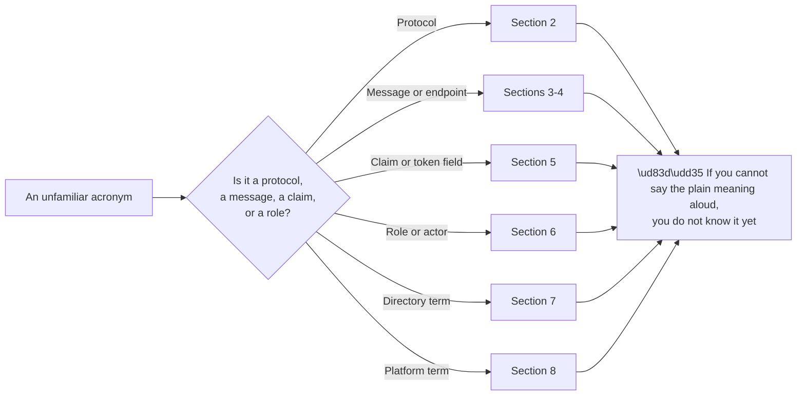
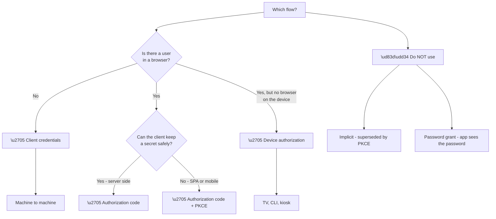

# Appendix A - Identity Glossary and Acronyms

> Purpose: Every term in this guide, expanded, explained in plain English, with why it matters and a recall hook. Use it as a lookup, not a read-through.

*Part of the* **[Okta Developer Support Engineer - Complete Study Guide](../Okta%20Developer%20Support%20Engineer%20-%20Complete%20Study%20Guide.md)**

---

## How to Use This Appendix

**Three columns matter differently.** *Plain meaning* is what you would say to a customer. *Why it matters* is what makes it worth knowing. *Hook* is the compressed form for recall under pressure.

**The test in node I is the honest one.** Recognising a term is not knowing it (Part 129). **If the plain-meaning column is not something you could produce yourself, that term belongs on your marked list.**

---

## 1. The Ten Terms Everything Else Depends On

**If only ten terms are learned properly, these are the ten.**

| Term | Plain meaning | Why it matters | Hook |
|---|---|---|---|
| **Authentication (AuthN)** | Proving who you are | Half of every identity failure | **"Who are you?"** |
| **Authorisation (AuthZ)** | Deciding what you may do | The other half; 403 lives here | **"What may you do?"** |
| **Identity Provider (IdP)** | The system that authenticates | Where the login actually happens | **"The one that asks for the password"** |
| **Service Provider (SP) / Relying Party (RP)** | The app that trusts the IdP | Where the failure is usually *reported* | **"The one that trusts"** |
| **Token** | A time-limited, signed statement | Expiry is failure pattern #1 | **"A signed note with a deadline"** |
| **Claim** | One fact inside a token | Missing claims cause silent failures | **"One fact"** |
| **Scope** | A request for permission | Missing scope is failure pattern #7 | **"What the app asked for"** |
| **Audience (`aud`)** | Who a token is *for* | Wrong audience = valid token, rejected | **"Addressed to"** |
| **Issuer (`iss`)** | Who created the token | Verification starts here | **"Signed by"** |
| **Federation** | Trusting another system's authentication | The whole point of SSO | **"Your login, their app"** |

> 💡 **Recall drill:** cover the middle two columns and say each plain meaning aloud. Anything you hesitate on goes on the marked list.

---

## 2. Protocols and Frameworks

| Term | Expansion | Plain meaning | Why it matters | Hook |
|---|---|---|---|---|
| **OAuth 2.0** | — | A framework for delegated **authorisation** | Not a login protocol; this confusion causes real bugs | **"Delegated access, not login"** |
| **OIDC** | OpenID Connect | An identity layer **on top of** OAuth 2.0 | Adds the ID token; this is how you log in | **"OAuth + who"** |
| **SAML** | Security Assertion Markup Language | XML-based federation via browser POST | Dominant in enterprise workforce SSO | **"XML SSO"** |
| **WS-Fed** | WS-Federation | Older XML federation, Microsoft lineage | Still found in legacy estates | **"SAML's older cousin"** |
| **SCIM** | System for Cross-domain Identity Management | Standard for **provisioning** users | Federation logs you in; SCIM creates the account | **"Account lifecycle, not login"** |
| **LDAP** | Lightweight Directory Access Protocol | Query protocol for directories | Where "who is this user" is answered on-premises | **"Directory query"** |
| **Kerberos** | — | Ticket-based network authentication | The default in AD; silent NTLM fallback hides faults | **"Tickets"** |
| **NTLM** | NT LAN Manager | Older challenge-response authentication | The fallback when Kerberos fails silently | **"The fallback"** |
| **JOSE** | JSON Object Signing and Encryption | The family covering JWS, JWE, JWK, JWA | The umbrella term for JWT machinery | **"The JSON crypto family"** |
| **FIDO2 / WebAuthn** | — | Phishing-resistant public-key authentication | Where strong authentication is heading | **"Keys, not secrets"** |
| **FAPI** | Financial-grade API | A hardened OAuth/OIDC profile | Regulated customers may be required to meet it | **"OAuth, tightened"** |
| **PKCE** | Proof Key for Code Exchange | Binds an auth code to the app that started the flow | Mandatory for public clients | **"Code theft protection"** |
| **DPoP** | Demonstrating Proof of Possession | Binds a token to a key the client holds | Makes a stolen token useless | **"Sender-bound token"** |
| **mTLS** | Mutual TLS | Both sides present certificates | Strong client authentication for APIs | **"Both show ID"** |

---

## 3. OAuth and OIDC Messages, Endpoints, and Parameters

| Term | Plain meaning | Why it matters | Hook |
|---|---|---|---|
| **Authorization endpoint** | Where the browser is sent to log in | User-facing; front channel | **"The browser goes here"** |
| **Token endpoint** | Where the app exchanges a code for tokens | Server-to-server; back channel | **"The app calls here"** |
| **Userinfo endpoint** | Returns claims about the user | Often unnecessary if the ID token has them | **"More claims, if needed"** |
| **JWKS endpoint** | Publishes the public keys | Key rotation works because of this | **"The public keys"** |
| **Discovery document** | `/.well-known/openid-configuration` | Every endpoint in one request | **"The map"** |
| **Authorization code** | A short-lived one-time exchange voucher | Single use; reuse = `invalid_grant` | **"A one-use voucher"** |
| **Access token** | Presented to an API to gain access | The API's decision input | **"For the API"** |
| **ID token** | Proves who logged in, to the **app** | Never send it to an API | **"For the app"** |
| **Refresh token** | Obtains new access tokens without re-login | Long-lived; the highest-value theft target | **"The renewal"** |
| **`state`** | Round-trips app context; CSRF defence | Missing it is a real vulnerability | **"Where was I?"** |
| **`nonce`** | Binds an ID token to one authentication | Replay defence for OIDC | **"Once only"** |
| **`redirect_uri`** | Where the IdP returns the browser | Must match exactly; open-redirect risk | **"Exactly this address"** |
| **`prompt`** | Controls whether the user is asked again | `prompt=login` forces re-authentication | **"Ask again?"** |
| **`max_age`** | Maximum acceptable authentication age | Step-up and freshness | **"How recent?"** |
| **`acr` / `amr`** | Authentication context / methods used | How you tell *how* someone authenticated | **"How strongly, and by what"** |
| **Grant type** | Which flow is being used | Wrong grant = wrong failure mode | **"Which route"** |
| **Introspection** | Asking the IdP whether a token is valid | Accurate; costs a network call | **"Ask the issuer"** |
| **Token exchange** | Trading one token for another | Service-to-service delegation | **"Swap"** |

---

## 4. OAuth Flows (Grant Types)

| Flow | Use when | Avoid because | Hook |
|---|---|---|---|
| **Authorization code** | Server-side web app | — | **"The default"** |
| **+ PKCE** | SPA, mobile, any public client | — | **"The default, for public clients"** |
| **Client credentials** | No user; service to service | — | **"No human"** |
| **Device authorization** | Input-constrained device | — | **"Enter this code"** |
| **Refresh token** | Renewing without re-login | — | **"Renew"** |
| ❌ **Implicit** | — | Tokens in the URL; superseded | **"Historical"** |
| ❌ **Password (ROPC)** | — | The app handles the password; no MFA path | **"Never"** |

---

## 5. Token Claims and Fields

| Claim | Expansion | Plain meaning | Why it matters |
|---|---|---|---|
| `iss` | Issuer | Who made this token | Verification starts here |
| `sub` | Subject | The stable user identifier | **Use this, not email** |
| `aud` | Audience | Who it is for | Wrong `aud` = valid but rejected |
| `exp` | Expiration | When it stops being valid | **Failure pattern #1** |
| `iat` | Issued at | When it was created | Freshness checks |
| `nbf` | Not before | Not valid until this time | Clock skew failures |
| `jti` | JWT ID | Unique token identifier | Replay detection |
| `azp` | Authorized party | Which client it was issued to | Multi-client scenarios |
| `scope` / `scp` | — | Granted permissions | **Failure pattern #7** |
| `nonce` | — | Ties the ID token to one login | Replay defence |
| `acr` / `amr` | — | Authentication strength and methods | Step-up decisions |
| `email_verified` | — | The IdP checked the address | **Only trust it from an IdP that actually verifies** |
| `alg` | Algorithm | Signing algorithm in the header | Never trust `alg: none` |
| `kid` | Key ID | Which key signed this | How rotation works |
| `typ` | Type | Usually `JWT` | Sanity check |

**Header vs payload vs signature:**

| Part | Contains | Encoded how |
|---|---|---|
| Header | `alg`, `kid`, `typ` | base64url |
| Payload | The claims | base64url — **not encrypted** |
| Signature | Proof of integrity | base64url |

> 🔴 **Base64url is encoding, not encryption.** Anyone holding the token can read the payload. **Nothing secret goes in a JWT.**

---

## 6. Roles and Actors

| Role | Plain meaning | In OAuth terms | Real example |
|---|---|---|---|
| **Resource owner** | The user | The person granting access | The employee logging in |
| **Client** | The application requesting access | Public or confidential | The SPA, the mobile app |
| **Authorization server** | Issues tokens | The IdP's token machinery | Okta / Auth0 tenant |
| **Resource server** | The protected API | Validates tokens | The customer's API |
| **Identity Provider (IdP)** | Authenticates the user | — | Okta, Entra ID, Google |
| **Service Provider (SP)** | Trusts the IdP (SAML term) | — | Salesforce, Workday |
| **Relying Party (RP)** | Trusts the IdP (OIDC/WS-Fed term) | Same idea, different word | Any OIDC app |
| **Upstream IdP** | An IdP *behind* your IdP | Enterprise connection | Customer's Entra ID |

**SP, RP, and client are three words for broadly the same position** — the thing that trusts. **Which word is used tells you which protocol you are in.**

---

## 7. Directory and Enterprise Terms

| Term | Expansion | Plain meaning | Why it matters |
|---|---|---|---|
| **DN** | Distinguished Name | Full path to a directory object | **Changes when a user moves — do not use as an ID** |
| **RDN** | Relative Distinguished Name | One component of a DN | Reading DNs |
| **OU** | Organizational Unit | A container in the directory | Where GPOs attach |
| **CN** | Common Name | Usually the display name | The most common RDN |
| **UPN** | User Principal Name | `user@domain` login form | The usual modern identifier |
| **sAMAccountName** | — | Legacy `DOMAIN\user` form | Still required in places |
| **objectGUID / objectSid** | — | Immutable identifiers | **The stable ones** |
| **Base DN** | — | Where a search starts | Wrong base = empty results |
| **Scope (LDAP)** | — | base / one / subtree | Wrong scope = empty results |
| **Filter** | — | The search condition | Where injection risk lives |
| **Bind** | — | Authenticating to the directory | Anonymous / simple / SASL |
| **LDAPS vs StartTLS** | — | TLS from the start vs upgrade on 389 | Different ports, different failures |
| **GC** | Global Catalog | Partial forest-wide index (3268/3269) | Cross-domain lookups |
| **SPN** | Service Principal Name | Identifies a service for Kerberos | **Missing or duplicate = silent NTLM fallback** |
| **TGT / TGS** | Ticket Granting Ticket / Service | Kerberos tickets | The three exchanges |
| **KDC** | Key Distribution Center | Issues Kerberos tickets | The DC, in practice |
| **GPO** | Group Policy Object | Configuration applied by scope | LSDOU precedence |
| **Forest / Domain** | — | **Forest is the security boundary** | Common misconception |
| **PHS / PTA / Federation** | Password Hash Sync / Pass-through Auth | The three hybrid methods | **Where the password is checked differs** |
| **Token bloat / group overage** | — | Too many groups to fit | Silent, size-driven failure |

---

## 8. Okta and Auth0 Platform Terms

| Term | Plain meaning | Why it matters |
|---|---|---|
| **Tenant** | Your isolated instance | Some settings are immutable after creation |
| **Custom domain** | Your own hostname for login | **Not cosmetic** — affects cookies and third-party context |
| **Application** | A registered client | Type determines allowed flows |
| **API** | A registered resource server | Defines audience and scopes |
| **Connection** | A source of users | Database, social, enterprise, passwordless |
| **Universal Login** | Centrally hosted login page | **Hosted centrally so SSO cookies work** |
| **Action** | Custom code at a lifecycle point | Post Login runs on **every** login |
| **Rule / Hook** | Older extensibility surfaces | Legacy tenants |
| **Organization** | A tenant-within-a-tenant for B2B | Cross-org data leakage is the top bug class |
| **`app_metadata`** | Server-controlled user data | **User cannot change it** |
| **`user_metadata`** | User-editable data | **Never authorise from it** |
| **Account linking** | Merging identities for one person | Only link on **verified** email |
| **Management API** | Administrative operations | **Never expose its token to a browser** |
| **Authentication API** | Login and token operations | The runtime path |
| **Tenant log** | Per-event record | The single most useful troubleshooting artefact |
| **Development keys** | Shared credentials for social connections | ❌ Never in production; rate-limited and shared |
| **Import mode** | Migrate users on first login | Zero-downtime migration |
| **Attack Protection** | Bot detection, breach detection, throttling | The four attacks a login faces |
| **FGA** | Fine-Grained Authorization | Relationship-based, when roles stop being enough |

---

## 9. Web, Browser, and Network Terms

| Term | Plain meaning | Why it matters in identity |
|---|---|---|
| **CORS** | Rules for cross-origin browser requests | Blocks the *response*, not the request |
| **Preflight** | An `OPTIONS` check before the real request | Its absence in a HAR is diagnostic |
| **Same-origin policy** | Scripts cannot read across origins | The foundation everything else patches |
| **`SameSite`** | When cookies are sent cross-site | **`Lax` breaks IdP-initiated SAML POST** |
| **`HttpOnly`** | JavaScript cannot read the cookie | XSS mitigation |
| **`Secure`** | HTTPS only | Mandatory for session cookies |
| **Third-party cookie** | A cookie for a different site | Being restricted; silent-logout source |
| **HAR** | HTTP Archive — a recorded session | **Contains live tokens; must be redacted** |
| **Front channel** | Via the browser, visible in a HAR | Redirects and POSTs |
| **Back channel** | Server to server, invisible to the browser | Token endpoint calls |
| **TLS / SNI** | Encryption / which hostname was requested | Certificate selection failures |
| **Certificate chain** | Leaf → intermediate → root | **A missing intermediate breaks non-browser clients first** |
| **CNAME / CAA** | Alias record / certificate authorisation | Custom domain and issuance failures |
| **XSS / CSRF** | Script injection / forged cross-site request | Why `HttpOnly` and `state` exist |

---

## 10. Support and Process Terms

| Term | Plain meaning | Why it matters |
|---|---|---|
| **RCA** | Root cause analysis — why, not just what | A fix is not a cause |
| **Repro** | A minimal reproduction | The strongest escalation evidence |
| **Escalation packet** | Everything engineering needs, once | **Include what you eliminated** |
| **Deflection** | A question answered before it is asked | Where support scales |
| **CSAT** | Customer satisfaction score | Measures the interaction, not the outcome |
| **Time to first response / resolution** | The two headline metrics | Both gameable |
| **STAR** | Situation, Task, Action, Result | Behavioural answer structure |
| **Blameless postmortem** | Analysis without attribution of fault | Produces honest information |

---

## 11. The Seven Recurring Failure Patterns

**These recur across every protocol in this guide (Part 111).** Memorise them; they are the fastest diagnostic prior available.

| # | Pattern | Typical symptom | Where it shows up |
|---|---|---|---|
| 1 | **Expiry** | Worked, then stopped, at an interval | Tokens, certificates, sessions, codes |
| 2 | **Unstable identifier** | Duplicate accounts; lost permissions | DN, email, NameID as an ID |
| 3 | **Size** | Fails for *some* users only | Token bloat, group overage, header limits |
| 4 | **Silent absence** | Nobody noticed for weeks | Provisioning stopped; a claim missing |
| 5 | **State across requests** | Intermittent; load-balancer dependent | `state`, `nonce`, session affinity |
| 6 | **Cookie context** | Browser-specific; works in one, not another | `SameSite`, third-party cookies |
| 7 | **Missing scope or context** | 403 with a valid token | Scope, audience, organisation, tenant |

> 🧠 **Hook:** **expiry · identifier · size · silence · state · cookie · scope.** Say it as a list. **Most identity failures are one of these seven.**

---

## 12. Terms People Confuse

| Often confused | Actually |
|---|---|
| Authentication ↔ Authorisation | Who you are ↔ what you may do |
| ID token ↔ access token | For the app ↔ for the API |
| Encoding ↔ encryption | Reversible by anyone ↔ requires a key |
| Hashing ↔ encryption | One-way ↔ two-way |
| Signing ↔ encrypting | Proves origin ↔ hides content |
| SSO ↔ provisioning | Logging in ↔ having an account |
| 401 ↔ 403 | Not authenticated ↔ authenticated but not permitted |
| Scope ↔ permission | What was asked for ↔ what is actually granted |
| Domain ↔ forest | Administrative unit ↔ **security boundary** |
| `app_metadata` ↔ `user_metadata` | Server-controlled ↔ user-editable |
| Decoding a JWT ↔ verifying it | Reading it ↔ trusting it |
| Fix ↔ root cause | Restored service ↔ why it happened |

---

## 13. Official Source Anchors

| Source | Covers | Accessed |
|---|---|---|
| IETF RFC index (`rfc-editor.org`) | OAuth, JOSE, PKCE, DPoP definitions | **26 August 2026** |
| OpenID Foundation (`openid.net/developers/specs/`) | OIDC Core, Discovery, Session Management | **26 August 2026** |
| OASIS SAML 2.0 specifications | SAML terminology | **26 August 2026** |
| Auth0 Docs (`auth0.com/docs`) | Platform terminology | **26 August 2026** |
| Okta Developer (`developer.okta.com`) | Platform terminology | **26 August 2026** |
| Microsoft Learn — Entra ID and AD | Directory and hybrid terminology | **26 August 2026** |

> **Revalidate:** protocol terminology is stable; **platform terminology changes.** Re-check sections 8 and 11 against current product documentation before interview.

---

*Return to:* **[Okta Developer Support Engineer - Complete Study Guide](../Okta%20Developer%20Support%20Engineer%20-%20Complete%20Study%20Guide.md)** · *Next:* **[Appendix B - HTTP, OAuth, OIDC, and SAML Error Cheat Sheets](Appendix-B-http-oauth-oidc-and-saml-error-cheat-sheets.md)**
