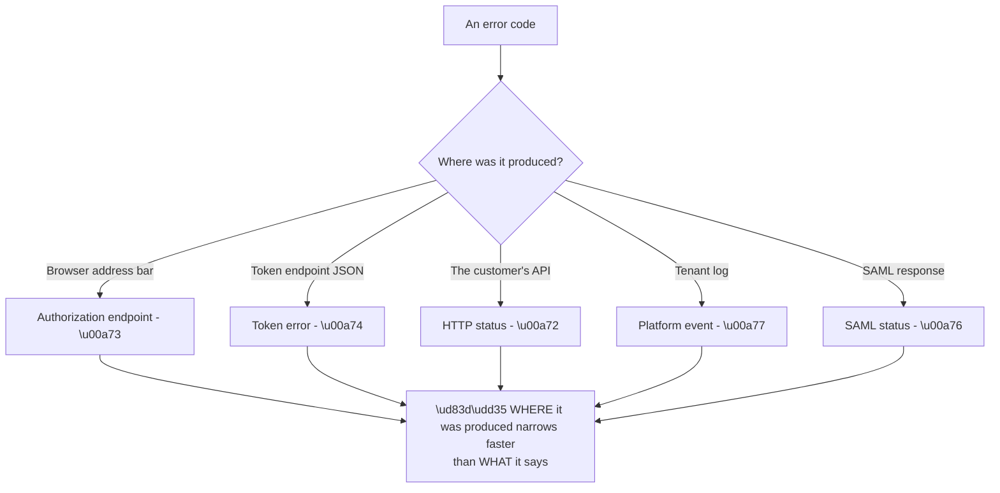
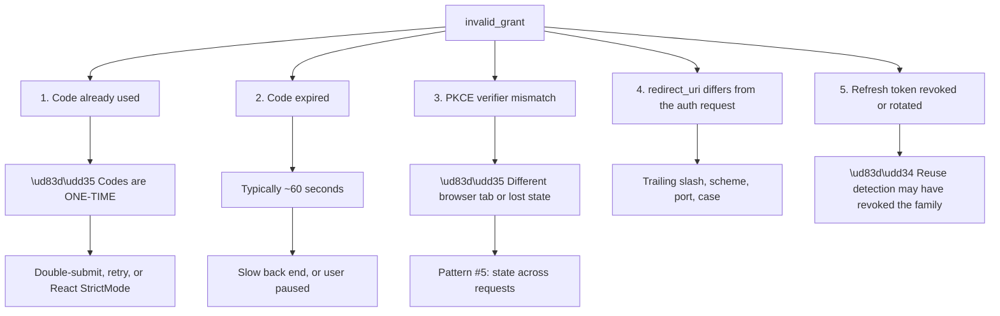

# Appendix B - HTTP, OAuth, OIDC, and SAML Error Cheat Sheets

> Purpose: Given an error code, get to the likely cause fast. Status codes, standard protocol error codes, platform event codes, and what each one actually means in practice.

*Part of the* **[Okta Developer Support Engineer - Complete Study Guide](../Okta%20Developer%20Support%20Engineer%20-%20Complete%20Study%20Guide.md)**

---

## How to Use This Appendix

**An error code narrows; it rarely diagnoses.** The value is in what it *rules out*.

**Node R is the operating principle** (Part 111). **The same words mean different things at different stages** — an `invalid_client` from the authorization endpoint and one from the token endpoint have different causes.

> 🔴 **Never paste a real token or a full HAR into a lookup tool.** Redact first (Appendix I).

---

## 2. HTTP Status Codes That Matter in Identity

| Code | Name | In identity, usually means | First check |
|---|---|---|---|
| **200** | OK | ⚠️ **Can still be a failure** — check the body | Read the JSON |
| **204** | No content | Success with nothing to return | — |
| **301 / 302** | Redirect | Normal in a login flow | Follow the chain in the HAR |
| **303** | See other | POST → GET after form submit | Normal |
| **307 / 308** | Temporary/permanent, method preserved | POST stays a POST | Occasionally surprising |
| **400** | Bad request | Malformed parameters | Compare against a working request |
| **401** | Unauthorized | **Not authenticated** — no/invalid/expired token | Check `exp` first |
| **403** | Forbidden | **Authenticated but not permitted** | Check scope, audience, org |
| **404** | Not found | Wrong URL — or **deliberate hiding of a 403** | Verify the endpoint |
| **405** | Method not allowed | POST vs GET mismatch | Check binding |
| **429** | Too many requests | Rate limited | Read `Retry-After` |
| **431** | Headers too large | **Token bloat** — failure pattern #3 | Count groups |
| **500** | Server error | Something broke server-side | Correlate with tenant logs |
| **502 / 504** | Bad gateway / timeout | Proxy or upstream problem | Is a proxy in the path? |
| **503** | Unavailable | Service down or shedding load | Check status page |

**The 401 vs 403 distinction is asked in almost every interview** (Part 129):

| | 401 | 403 |
|---|---|---|
| Means | I do not know who you are | I know who you are, and no |
| Retry with a new token? | ✅ Might work | ❌ Will not help |
| Usual cause | Expiry, missing header, bad signature | Missing scope, wrong audience, wrong org |
| Pattern | #1 expiry | #7 missing scope/context |

> ⚠️ **Many APIs return 401 where they mean 403.** **The distinction is only reliable if the API implemented it correctly** — say so when advising.

---

## 3. Authorization Endpoint Errors (RFC 6749 §4.1.2.1)

**These arrive in the browser, in the query string or fragment of the redirect back to the app.**

| Error | Spec meaning | In practice |
|---|---|---|
| `invalid_request` | Missing or malformed parameter | Missing `response_type`, duplicate parameter, bad encoding |
| `unauthorized_client` | Client not allowed this grant | **Grant type not enabled on the application** |
| `access_denied` | Resource owner or server refused | **User clicked Deny** — or a policy/Action blocked it |
| `unsupported_response_type` | Server will not issue this way | Asking for `token` where implicit is disabled |
| `invalid_scope` | Scope invalid or unknown | Typo, or the scope is not defined on the API |
| `server_error` | 500 equivalent, expressed as a redirect | **Often an Action throwing** — check tenant logs |
| `temporarily_unavailable` | 503 equivalent | Load shedding |
| `login_required` | `prompt=none` and no session | **Expected** in silent-renew; not a bug |
| `consent_required` | `prompt=none` and consent needed | Same |
| `interaction_required` | `prompt=none` and interaction needed | Same |

> 🔵 **The `*_required` trio are normal** when `prompt=none` is used for silent renewal. **A customer reporting them as errors usually needs the fallback path explained**, not a fix.

**A redirect-URI mismatch is different.** **It does not redirect** — because the server will not send an error to an unverified address. **The user sees an error page on the IdP.** That is by design and is the correct behaviour.

---

## 4. Token Endpoint Errors (RFC 6749 §5.2)

**These arrive as JSON with an HTTP 400.**

| Error | Spec meaning | The real causes |
|---|---|---|
| `invalid_request` | Malformed | Missing `grant_type`, wrong content type |
| `invalid_client` | Client authentication failed | Wrong secret; wrong auth method; client disabled |
| **`invalid_grant`** | **The grant is bad** | **See the table below — four distinct causes** |
| `unauthorized_client` | Client cannot use this grant | Grant type not enabled |
| `unsupported_grant_type` | Server does not support it | Typo, or disabled feature |
| `invalid_scope` | Scope invalid or excessive | Requesting more than originally granted |

### The four causes of `invalid_grant`

**This is the single most common OAuth error and it is genuinely ambiguous** (Part 117).

| Cause | Distinguishing evidence |
|---|---|
| **Code reuse** | **Two token requests with the same code** in the HAR |
| **Code expired** | Long gap between the redirect and the token call |
| **PKCE mismatch** | `code_verifier` present but the flow started elsewhere |
| **`redirect_uri` differs** | Byte-compare the two values |
| **Refresh revoked** | Tenant log shows a rotation or reuse-detection event |

> 🔵 **The fastest discriminator is the HAR.** **Count token-endpoint requests carrying the same code.** Two means reuse, and reuse is by far the most common cause.

---

## 5. Token Validation and Bearer Errors (RFC 6750)

**Returned by a resource server in `WWW-Authenticate`.**

| Error | Meaning | Cause |
|---|---|---|
| `invalid_request` | Malformed request | Header format wrong |
| `invalid_token` | Expired, revoked, malformed, or wrong audience | **Start with `exp`, then `aud`** |
| `insufficient_scope` | Valid token, wrong permissions | Scope not requested or not granted |

**Common validation failures and what each means:**

| Symptom | Cause |
|---|---|
| Signature verification fails | Wrong key; `kid` not in JWKS; **key rotated and JWKS cached too long** |
| `aud` mismatch | **`audience` parameter not sent** → opaque token issued instead of a JWT |
| `iss` mismatch | Custom domain configured on one side only |
| `exp` in the past | Expiry — but check clock skew before concluding |
| `nbf` in the future | **Clock skew** — check NTP on the validating server |
| Token is opaque, not a JWT | No `audience` requested (Auth0) |
| `alg` unexpected | ❌ **Never accept `none`;** pin the expected algorithm |

---

## 6. SAML Status Codes and Failures

**SAML top-level status codes** (in `<samlp:StatusCode>`):

| Status | Meaning |
|---|---|
| `Success` | Authentication succeeded |
| `Requester` | **The SP's request was faulty** |
| `Responder` | **The IdP could not process it** |
| `VersionMismatch` | Protocol version problem |

**Second-level codes carry the detail:**

| Second-level | Usually means |
|---|---|
| `AuthnFailed` | Credentials failed at the IdP |
| `InvalidNameIDPolicy` | SP requested a NameID format the IdP will not issue |
| `NoPassive` | Passive requested; interaction required |
| `RequestDenied` | Policy blocked it |
| `NoAuthnContext` | Requested authentication strength unavailable |
| `UnknownPrincipal` | **User not found at the IdP** |
| `RequestUnsupported` | Feature not supported |

**The failures that produce no status code at all** are the common ones:

| Symptom | Cause | Check |
|---|---|---|
| "Invalid audience" | `Audience` ≠ SP entity ID | Byte-compare both |
| "Signature validation failed" | **Certificate rotated at the IdP** | Compare thumbprints; is metadata auto-refreshed? |
| "Assertion expired" | `NotOnOrAfter` passed | **Clock skew** |
| "Replay detected" | Same assertion ID seen twice | Retry, or a genuine replay |
| Lands on the SP home page, not the deep link | **`RelayState` lost** | Present in the POST? |
| Works in one browser only | **`SameSite`** — pattern #6 | Cookie attributes |
| `InResponseTo` missing | **IdP-initiated flow** | Is the SP configured to allow it? |
| User authenticated but "unknown user" at the SP | **NameID format or value changed** | Transient vs persistent |
| Worked for months, then everyone fails at once | **Certificate expiry — pattern #1** | Check `notAfter` |

> 🔵 **The single most common SAML production outage is certificate rotation** where the SP had the certificate configured manually instead of consuming metadata (Part 084).

---

## 7. Reading Platform Event Codes

**Okta and Auth0 tenant logs use short event codes.** **The prefix pattern is learnable**, which is faster than looking each one up (Part 108).

| Prefix pattern | Family |
|---|---|
| `s` | **Success** |
| `f` | **Failure** |
| `seacft` / `feacft` | Success/failure **exchanging an auth code for a token** |
| `sepft` / `fepft` | Success/failure exchanging a **password** for a token |
| `sercft` / `fercft` | Success/failure exchanging a **refresh token** |
| `ssa` / `fsa` | Success/failure **signup** |
| `slo` / `flo` | Success/failure **logout** |
| `f` + `u` | Failed login (**invalid username or password**) |
| `limit_*` | **Rate limiting** |
| `w` | **Warning** |
| `sce` / `fce` | Success/failure **change email** |
| `scp` / `fcp` | Success/failure **change password** |

**Decoding rule:** **first letter = outcome, remainder = operation.** `fercft` = **f**ailed **e**xchange of **r**efresh token. **Knowing the pattern beats memorising the list.**

**The most important field in a log entry is the correlation identifier**, because it links front-channel and back-channel events into one flow.

> 🔵 **The absence of a log entry is itself evidence** (Part 108). **If a failing login produced no entry, the request never reached the tenant** — which relocates the whole investigation to DNS, proxy, or client configuration.

---

## 8. TLS and Certificate Errors

| Error | Meaning | Cause |
|---|---|---|
| `UNABLE_TO_VERIFY_LEAF_SIGNATURE` | Chain incomplete | **Missing intermediate** |
| `SELF_SIGNED_CERT_IN_CHAIN` | Untrusted root | Corporate TLS interception, or a genuinely self-signed certificate |
| `CERT_HAS_EXPIRED` | Past `notAfter` | Pattern #1 |
| `ERR_CERT_COMMON_NAME_INVALID` | Hostname mismatch | SNI / SAN missing the hostname |
| `HOSTNAME_MISMATCH` | Same | Same |
| `SSL_ERROR_NO_CYPHER_OVERLAP` | No common cipher | Old client, or hardened server |
| `unknown ca` | Client does not trust the issuer | Trust store missing the root |

> 🔴 **Never advise `-k`, `--insecure`, `rejectUnauthorized: false`, or disabling certificate validation** — not even temporarily. **Fix the chain or install the trust anchor** (Part 044).

**A useful discriminator:** **if browsers work and a server-side client fails**, suspect a **missing intermediate**. Browsers can often fetch it; most libraries cannot.

---

## 9. LDAP Result Codes

| Code | Name | Means |
|---|---|---|
| 0 | `success` | ✅ — **including zero results** |
| 1 | `operationsError` | Often a bind-order problem |
| 4 | `sizeLimitExceeded` | **Truncated results — pattern #3** |
| 3 | `timeLimitExceeded` | Query too broad |
| 8 | `strongerAuthRequired` | Signing/sealing required |
| 32 | `noSuchObject` | **Base DN wrong** |
| 34 | `invalidDNSyntax` | Malformed DN |
| 48 | `inappropriateAuthentication` | Anonymous where credentials required |
| 49 | `invalidCredentials` | **Bad bind — check sub-codes** |
| 50 | `insufficientAccessRights` | Bind account lacks read permission |
| 53 | `unwillingToPerform` | Policy refusal |

**AD sub-codes inside a 49** (the `data` field) are the useful part:

| Sub-code | Means |
|---|---|
| `525` | User not found |
| `52e` | **Bad password** (user exists) |
| `530` | Not permitted at this time |
| `531` | Not permitted from this workstation |
| `532` | **Password expired** |
| `533` | **Account disabled** |
| `701` | Account expired |
| `773` | **Must change password** |
| `775` | **Account locked out** |

> 🔵 **`52e` vs `525` is the fastest way to separate "wrong password" from "wrong username or wrong base DN"** — and customers routinely report both as "invalid credentials".

**And remember:** **a successful search returning zero entries is result code 0, not an error** (Part 090). **A "no results" complaint is usually a base-DN or scope problem, not a permission problem** — and the result code tells you which.

---

## 10. Fast Triage Table

**Given only the symptom, the highest-probability starting point:**

| Symptom | Start with | Pattern |
|---|---|---|
| Worked yesterday, all users, no deploy | **Certificate or secret expiry** | #1 |
| Some users only, seemingly random | **Group/token size** | #3 |
| One office only | Network, proxy, or IP restriction | — |
| One browser only | **Cookie attributes** | #6 |
| New users only | Provisioning, not authentication | #4 |
| Intermittent, load-balanced | **State not shared across nodes** | #5 |
| Valid token, 403 | Scope, audience, or organisation | #7 |
| Duplicate accounts appearing | **Unstable identifier** | #2 |
| Nobody noticed for weeks | **Silent failure** | #4 |
| Works in the IdP test, not in the app | Redirect URI, or client configuration | — |
| No tenant log entry at all | **Never reached the tenant** — DNS/proxy | — |

---

## 11. Official Source Anchors

| Source | Covers | Accessed |
|---|---|---|
| RFC 6749 §4.1.2.1, §5.2 | OAuth authorization and token errors | **26 August 2026** |
| RFC 6750 §3.1 | Bearer token errors | **26 August 2026** |
| RFC 9110 | HTTP semantics and status codes | **26 August 2026** |
| OIDC Core §3.1.2.6 | OIDC authentication errors | **26 August 2026** |
| OASIS SAML 2.0 Core §3.2.2.2 | SAML status codes | **26 August 2026** |
| RFC 4511 §4.1.9 | LDAP result codes | **26 August 2026** |
| Auth0 Docs — log event type codes | Platform event codes | **26 August 2026** |
| Microsoft Learn — AD bind error codes | The `data` sub-codes | **26 August 2026** |

> **Revalidate:** RFC-defined codes are stable. **Platform event codes change** — re-check §7 against current documentation.

---

*Return to:* **[Okta Developer Support Engineer - Complete Study Guide](../Okta%20Developer%20Support%20Engineer%20-%20Complete%20Study%20Guide.md)** · *Next:* **[Appendix C - JWT, JWKS, and Claim Reference](Appendix-C-jwt-jwks-and-claim-reference.md)**
