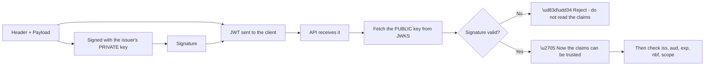
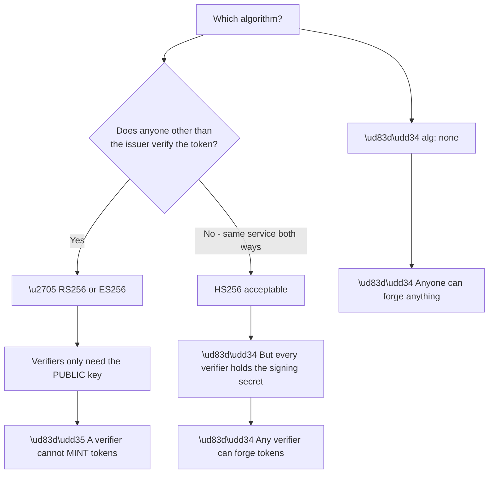
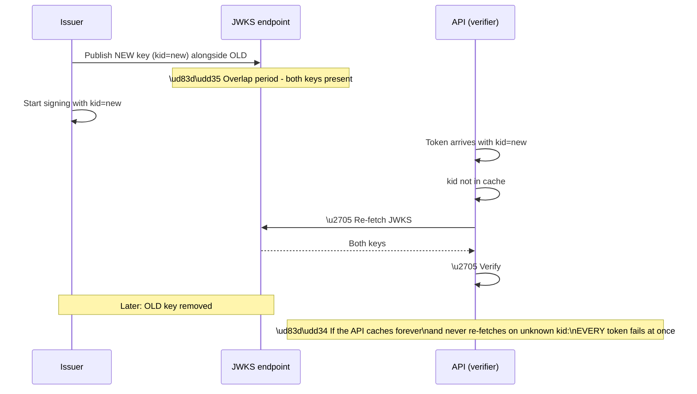
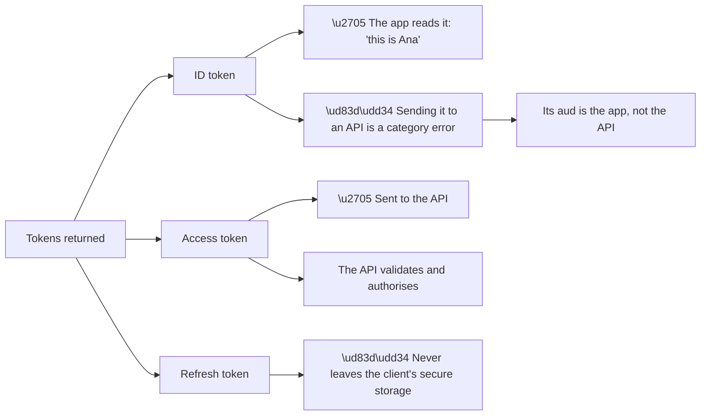

# Appendix C - JWT, JWKS, and Claim Reference

> Purpose: Everything needed to read, validate, and reason about a JSON Web Token — structure, claims, algorithms, the correct validation order, key rotation, and a decoding worksheet.

*Part of the* **[Okta Developer Support Engineer - Complete Study Guide](../Okta%20Developer%20Support%20Engineer%20-%20Complete%20Study%20Guide.md)**

---

## 1. Structure

A JWT is **three base64url segments separated by dots**.

```
eyJhbGciOiJSUzI1NiIsImtpZCI6ImFiYzEyMyJ9  .  eyJpc3MiOiJodHRwczovL3RlbmFudC8iLCJzdWIiOiJ1c2VyfDEyMyJ9  .  <signature>
└──────────── header ────────────┘     └───────────────── payload ─────────────────┘     └─── signature ───┘
```

| Segment | Contains | Encoded | Secret? |
|---|---|---|---|
| **Header** | `alg`, `kid`, `typ` | base64url | ❌ Public |
| **Payload** | The claims | base64url | ❌ **Public — readable by anyone** |
| **Signature** | Integrity proof | base64url | ❌ Public, but unforgeable |

> 🔴 **Base64url is encoding, not encryption.** **Never put anything confidential in a JWT payload.** Anyone holding the token can read every claim.



**The order in the diagram is not optional.** **Claims are meaningless until the signature verifies** — reading them first is the mistake that makes `alg: none` attacks possible.

---

## 2. Registered Claims

| Claim | Name | Type | Meaning | Failure when wrong |
|---|---|---|---|---|
| `iss` | Issuer | string (URL) | Who created the token | Custom domain configured on one side only |
| `sub` | Subject | string | **The stable user identifier** | Using email instead → pattern #2 |
| `aud` | Audience | string or array | Who the token is for | **Valid token, rejected** |
| `exp` | Expiration | NumericDate | Not valid at or after | **Pattern #1** |
| `nbf` | Not before | NumericDate | Not valid before | **Clock skew** |
| `iat` | Issued at | NumericDate | Creation time | Freshness / `max_age` |
| `jti` | JWT ID | string | Unique ID | Replay detection |

**OIDC-specific claims:**

| Claim | Meaning | Notes |
|---|---|---|
| `nonce` | Ties the ID token to one authentication | **Must match what the client sent** |
| `auth_time` | When the user actually authenticated | Not the same as `iat` |
| `acr` | Authentication context class | Step-up decisions |
| `amr` | Authentication methods (array) | e.g. `pwd`, `mfa`, `otp` |
| `azp` | Authorized party | Which client this was issued for |
| `at_hash` / `c_hash` | Hashes binding access token / code | Hybrid flow integrity |

**Standard profile claims (from the `profile` and `email` scopes):**

| Claim | Scope needed |
|---|---|
| `name`, `given_name`, `family_name`, `nickname`, `picture`, `locale`, `updated_at`, `preferred_username` | `profile` |
| `email`, `email_verified` | `email` |
| `phone_number`, `phone_number_verified` | `phone` |
| `address` | `address` |

**Authorisation claims (vary by provider):**

| Claim | Typical provider |
|---|---|
| `scope` (space-separated string) | Auth0, Okta, most |
| `scp` (string or array) | Microsoft Entra ID |
| `permissions` (array) | Auth0, when RBAC is enabled |
| `roles` / `groups` | Entra ID, custom mappings |

> ⚠️ **`scope` and `scp` are not interchangeable.** Code that reads one and receives the other **fails silently with an empty permission set** — a very common integration bug.

---

## 3. Custom Claims and Namespacing

**OIDC reserves the non-namespaced claim space.** Custom claims must be namespaced with a URI, or they will be silently dropped.

| ❌ Wrong | ✅ Right |
|---|---|
| `department` | `https://myapp.example.com/department` |
| `tenant_id` | `https://myapp.example.com/tenant_id` |
| `roles` | `https://myapp.example.com/roles` |

**Rules that matter in practice** (Part 104):

- **The namespace does not need to resolve.** It is an identifier, not a URL to fetch.
- **Do not use an `auth0.com` or `okta.com` namespace** — those are reserved and will be rejected.
- **Namespacing applies to ID tokens and access tokens**, not to metadata stored on the user.
- **Adding a claim does not add it retroactively** to tokens already issued.

> 🔵 **"The claim isn't there" is most often a namespacing problem, not an Action problem.** **Check the namespace before debugging the code.**

---

## 4. Algorithms

| Algorithm | Family | Key | Use |
|---|---|---|---|
| **RS256** | RSA + SHA-256 | Asymmetric | ✅ **The default for anything multi-party** |
| RS384 / RS512 | RSA | Asymmetric | Same, stronger hash |
| **PS256** | RSA-PSS | Asymmetric | Preferred where supported |
| **ES256** | ECDSA P-256 | Asymmetric | ✅ Smaller, faster, increasingly common |
| **HS256** | HMAC + SHA-256 | **Symmetric** | Only when one party issues *and* verifies |
| **`none`** | — | — | 🔴 **Never accept. Ever.** |

**Why asymmetric is the right default:**



**Node A2 is the whole argument.** **With HS256, sharing the key to allow verification also grants the ability to issue** — which is why it is unsuitable the moment more than one party is involved.

> 🔴 **Two attacks to know:** **`alg: none`** (accept an unsigned token) and **algorithm confusion** (send an HS256 token signed with the issuer's *public* RSA key to a library that trusts the header's `alg`). **The defence for both is the same: pin the expected algorithm; never read it from the token.**

---

## 5. JWKS and Key Rotation

**JWKS** — JSON Web Key Set — is the issuer's published set of public keys, at `/.well-known/jwks.json`.

```json
{
  "keys": [
    {
      "kty": "RSA",
      "use": "sig",
      "kid": "abc123",
      "alg": "RS256",
      "n": "<modulus, base64url>",
      "e": "AQAB",
      "x5c": ["<certificate chain>"],
      "x5t": "<thumbprint>"
    }
  ]
}
```

| Field | Meaning |
|---|---|
| `kty` | Key type (`RSA`, `EC`) |
| `use` | `sig` (signature) or `enc` (encryption) |
| **`kid`** | **Key ID — matched against the token header** |
| `alg` | Intended algorithm |
| `n` / `e` | RSA modulus and exponent |
| `crv` / `x` / `y` | EC curve and coordinates |
| `x5c` | Certificate chain, if present |

**How rotation works, and how it breaks:**



| Correct behaviour | Broken behaviour |
|---|---|
| Cache JWKS **with a TTL** | ❌ Cache forever |
| **Re-fetch on an unknown `kid`** | ❌ Fail immediately |
| **Rate-limit the re-fetch** | ❌ Fetch on every request |
| Support multiple keys | ❌ Assume exactly one |

> 🔵 **"Everything worked for months, then every token failed at once, with no deployment"** is the signature of a **rotation plus an over-cached JWKS** (Part 040). It is pattern #1 in a form people rarely recognise.

**And the opposite failure:** **fetching JWKS on every single request** works in testing and becomes a rate-limit incident at production volume.

---

## 6. The Correct Validation Order

**Order matters.** Each step is cheap relative to the next, and a failure at any step must stop processing.

| # | Check | Why here | Failure meaning |
|---|---|---|---|
| 1 | **Structure** — three segments, decodable | Cheapest | Malformed |
| 2 | **`alg` is one you expect** | **Before touching keys** | 🔴 Possible attack |
| 3 | **Find the key by `kid`** | Re-fetch JWKS if unknown | Rotation |
| 4 | **Verify the signature** | 🔵 **Nothing below is trustworthy until this passes** | Wrong key or forged |
| 5 | **`iss` matches exactly** | Cheap string compare | Domain mismatch |
| 6 | **`aud` contains your identifier** | Prevents token reuse across APIs | Wrong audience |
| 7 | **`exp` in the future** (with small skew) | Pattern #1 | Expired |
| 8 | **`nbf` in the past** (with small skew) | Clock skew | Server clock wrong |
| 9 | **`nonce` matches** (ID tokens only) | Replay defence | Replay or lost state |
| 10 | **Scope / permissions sufficient** | The authorisation decision | 403 |

> 🔴 **Steps 2 and 4 are the security-critical ones.** Everything above step 4 in a debugging session is guesswork; **claims read before signature verification cannot be trusted at all.**

**Clock skew:** allow **60 seconds** or less. **More than 300 seconds is not tolerance, it is a hole.** If skew is genuinely needed beyond that, **the real fix is NTP on the validating server.**

---

## 7. ID Token vs Access Token

**The most commonly confused pair in the entire field.**

| | ID token | Access token |
|---|---|---|
| **Audience** | The **client application** | The **API** |
| **Answers** | Who logged in | What may be done |
| **Format** | Always a JWT | JWT **or opaque** |
| **Send to an API?** | 🔴 **Never** | ✅ Yes |
| **Validated by** | The client | The resource server |
| **Contains** | Identity claims | Scopes and permissions |
| **Lifetime** | Short | Short |



> 🔵 **A developer sending an ID token to an API usually gets a confusing error**, because a correctly implemented API rejects it on `aud` — which looks like an audience bug rather than a token-type bug. **Asking "which token are you sending?" resolves it in one question** (Part 117).

**Why access tokens are sometimes opaque:** with Auth0, **if no `audience` parameter is requested, the access token is opaque** — usable only against the userinfo endpoint. **Developers reporting "my access token isn't a JWT" almost always forgot the audience.**

---

## 8. Decoding Worksheet

**Use this to work through a token safely.** ⚠️ **Never paste a real token into a web-based decoder** (Appendix I).

**Decode locally:**

```bash
# Payload only, no verification - safe for reading
echo "$JWT" | cut -d. -f2 | tr '_-' '/+' | base64 -d 2>/dev/null | jq .

# Header
echo "$JWT" | cut -d. -f1 | tr '_-' '/+' | base64 -d 2>/dev/null | jq .
```

```powershell
# PowerShell equivalent
$p = ($jwt -split '\.')[1].Replace('-','+').Replace('_','/')
$p = $p.PadRight($p.Length + (4 - $p.Length % 4) % 4, '=')
[Text.Encoding]::UTF8.GetString([Convert]::FromBase64String($p)) | ConvertFrom-Json
```

**Worksheet:**

| Field | Value | Expected | ✓ |
|---|---|---|---|
| `alg` | | RS256 (pinned) | |
| `kid` | | Present in JWKS | |
| `iss` | | Exact match, including trailing slash | |
| `aud` | | Contains the API identifier | |
| `sub` | | Stable, not an email | |
| `exp` | | In the future | |
| `iat` | | Recent | |
| `nbf` | | In the past | |
| `scope` / `scp` | | Contains what the API requires | |
| Custom claims | | **Namespaced** | |
| `nonce` (ID token) | | Matches the request | |

**Converting `exp` to a readable time:**

```bash
date -d @1787000000          # GNU
```
```powershell
[DateTimeOffset]::FromUnixTimeSeconds(1787000000).ToLocalTime()
```

> 🔵 **The first two things to check on any token failure are `exp` and `aud`.** Between them they account for the large majority of real cases.

---

## 9. Storage and Handling

| Storage | Access token | Refresh token | Risk |
|---|---|---|---|
| **In-memory (SPA)** | ✅ Best available | — | Lost on refresh — acceptable |
| `localStorage` | ⚠️ Common, XSS-readable | 🔴 No | **Any XSS steals it** |
| `sessionStorage` | ⚠️ Same risk, shorter | 🔴 No | Same |
| **`HttpOnly` `Secure` cookie** | ✅ With CSRF defence | ✅ | JS cannot read it |
| **Backend-for-frontend** | ✅ **Best** | ✅ | Tokens never reach the browser |
| Mobile secure storage | ✅ | ✅ | Keychain / Keystore |
| 🔴 URL / query string | ❌ | ❌ | **Logs, referrers, history** |
| 🔴 Source control | ❌ | ❌ | Permanent |

> 🔴 **A token in a URL is a token in every proxy log, browser history, and `Referer` header on the path.** This is one of the reasons the implicit flow was retired.

**Lifetimes as a starting point:**

| Token | Typical | Reasoning |
|---|---|---|
| Authorization code | **~60 seconds**, one use | Only needs to survive one redirect |
| Access token | 5–60 minutes | Short enough that revocation lag is bounded |
| ID token | Same as access | Consumed immediately |
| Refresh token (confidential) | Days to months | Server-side storage |
| **Refresh token (browser)** | **Short, rotating** | 🔵 **Rotation + reuse detection is mandatory** |

**Refresh token rotation with reuse detection:** each use issues a new refresh token and invalidates the old one. **If an old one is presented again, the entire family is revoked** — because that means either the token was stolen or the client mishandled it, and both warrant terminating the session.

> ⚠️ **Reuse detection produces a real support pattern:** a client that retries a failed refresh **triggers family revocation and logs the user out**. The symptom — "users randomly logged out" — is caused by the client's retry logic, not by the platform.

---

## 10. Quick Reference Card

| Question | Answer |
|---|---|
| Is a JWT encrypted? | ❌ **Encoded.** Anyone can read the payload |
| Which claim identifies the user? | **`sub`** — not email |
| Which claim causes "valid but rejected"? | **`aud`** |
| Which algorithm for a multi-party system? | **RS256** or **ES256** |
| Which algorithm must never be accepted? | **`none`** |
| What is `kid` for? | Selecting the key — **this is how rotation works** |
| Why did every token suddenly fail? | **Rotation + over-cached JWKS** |
| Where do custom claims go? | **Namespaced** with a URI |
| Can an ID token be sent to an API? | 🔴 **No** |
| Why is my access token opaque? | **No `audience` requested** |
| First two checks on a failure? | **`exp`, then `aud`** |
| Acceptable clock skew? | **≤ 60 seconds** |
| Where should a refresh token live in a browser? | **Nowhere it can — use a BFF, or rotate short** |

---

## 11. Official Source Anchors

| Source | Covers | Accessed |
|---|---|---|
| RFC 7519 | JWT structure and registered claims | **26 August 2026** |
| RFC 7515 / 7516 / 7517 / 7518 | JWS / JWE / JWK / JWA | **26 August 2026** |
| RFC 8725 | **JWT best current practice** — read this one | **26 August 2026** |
| OIDC Core §2, §3.1.3.7 | ID token claims and validation | **26 August 2026** |
| RFC 9700 | OAuth 2.0 security best current practice | **26 August 2026** |
| RFC 9449 | DPoP | **26 August 2026** |
| Auth0 Docs — tokens, custom claims, refresh rotation | Platform specifics | **26 August 2026** |

> **Revalidate:** RFCs are stable. **Default lifetimes and rotation behaviour are product settings** — re-check §9 against current documentation.

---

*Return to:* **[Okta Developer Support Engineer - Complete Study Guide](../Okta%20Developer%20Support%20Engineer%20-%20Complete%20Study%20Guide.md)** · *Next:* **[Appendix D - Command and Tool Cookbook](Appendix-D-command-and-tool-cookbook.md)**
