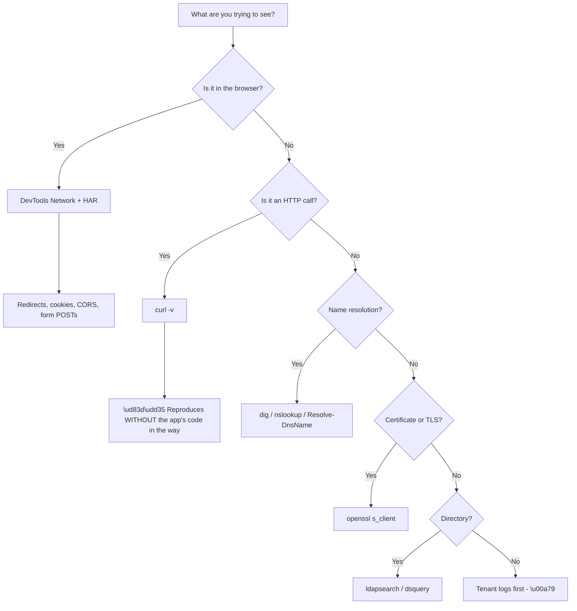

# Appendix D - Command and Tool Cookbook

> Purpose: Safe, copy-ready recipes for the tools you will actually reach for — curl, openssl, dig, ldapsearch, jq, Postman, browser DevTools, and HAR capture. Every recipe is safe to run against systems you are authorised to test.

*Part of the* **[Okta Developer Support Engineer - Complete Study Guide](../Okta%20Developer%20Support%20Engineer%20-%20Complete%20Study%20Guide.md)**

---

## 0. Rules Before Any Command

> 🔴 **Never run any of these against a system you are not authorised to test.** Your own free-tier tenant, your own localhost, and synthetic data only (Appendix I).

| Rule | Why |
|---|---|
| 🔴 **Never use `-k` / `--insecure` / `rejectUnauthorized:false`** | It hides the exact fault you are diagnosing |
| 🔴 **Never paste a real token into a web decoder** | It is a live credential |
| 🔴 **Never put a secret on a command line** | It lands in shell history and process listings |
| ✅ **Use environment variables for secrets** | And clear them afterwards |
| ✅ **Redact before sharing any output** | HAR files contain live tokens |
| ✅ **Delete artefacts when finished** | Tokens outlive the ticket |

```bash
# Reading a secret without echoing it or storing it in history
read -rs CLIENT_SECRET && export CLIENT_SECRET
# ... work ...
unset CLIENT_SECRET
```

```powershell
$sec = Read-Host -AsSecureString "Client secret"
$env:CLIENT_SECRET = [Runtime.InteropServices.Marshal]::PtrToStringAuto(
  [Runtime.InteropServices.Marshal]::SecureStringToBSTR($sec))
# ... work ...
Remove-Item Env:\CLIENT_SECRET
```

---

## 1. Choosing the Right Tool



**Node D1 is why curl matters.** **Reproducing a failure with curl removes the application framework from the picture** — which either confirms the platform is at fault or proves the problem is in the client code. **That is the single most valuable narrowing step available** (Part 113).

---

## 2. curl — HTTP and OAuth

**Verbose, with timing, following redirects:**

```bash
curl -v -L -o /dev/null -w '\nhttp=%{http_code} redirects=%{num_redirects} time=%{time_total}s\n' \
  'https://tenant.example.com/authorize?client_id=abc&response_type=code&redirect_uri=https%3A%2F%2Fapp.example.com%2Fcb&scope=openid%20profile&state=xyz'
```

**Show only the response headers:**

```bash
curl -sSI 'https://api.example.com/health'
```

**Follow a redirect chain and print each hop:**

```bash
curl -sSL -o /dev/null -w '%{url_effective}\n' --write-out '%{redirect_url}\n' 'https://app.example.com/login'
# Better: -v shows every hop with its Location header
curl -v -L 'https://app.example.com/login' 2>&1 | grep -Ei '^(< HTTP|< location|> GET|> POST)'
```

**Client credentials grant:**

```bash
curl -sS -X POST "https://$TENANT/oauth/token" \
  -H 'Content-Type: application/json' \
  -d "{\"grant_type\":\"client_credentials\",\"client_id\":\"$CLIENT_ID\",\"client_secret\":\"$CLIENT_SECRET\",\"audience\":\"https://api.example.com\"}" | jq .
```

**Form-encoded variant (the RFC-standard form):**

```bash
curl -sS -X POST "https://$TENANT/oauth/token" \
  -H 'Content-Type: application/x-www-form-urlencoded' \
  --data-urlencode 'grant_type=client_credentials' \
  --data-urlencode "client_id=$CLIENT_ID" \
  --data-urlencode "client_secret=$CLIENT_SECRET" \
  --data-urlencode 'audience=https://api.example.com' | jq .
```

**Authorization code exchange (with PKCE):**

```bash
curl -sS -X POST "https://$TENANT/oauth/token" \
  -H 'Content-Type: application/x-www-form-urlencoded' \
  --data-urlencode 'grant_type=authorization_code' \
  --data-urlencode "client_id=$CLIENT_ID" \
  --data-urlencode "code=$CODE" \
  --data-urlencode "code_verifier=$VERIFIER" \
  --data-urlencode 'redirect_uri=https://app.example.com/cb' | jq .
```

> ⚠️ **The code is one-time.** A failed attempt consumes it. **Capture a fresh one for each try**, or you will diagnose `invalid_grant` caused by your own retry.

**Refresh token exchange:**

```bash
curl -sS -X POST "https://$TENANT/oauth/token" \
  -H 'Content-Type: application/x-www-form-urlencoded' \
  --data-urlencode 'grant_type=refresh_token' \
  --data-urlencode "client_id=$CLIENT_ID" \
  --data-urlencode "refresh_token=$REFRESH" | jq .
```

**Call a protected API:**

```bash
curl -sS -H "Authorization: Bearer $ACCESS_TOKEN" 'https://api.example.com/me' -i | head -30
```

**Test CORS behaviour (simulate a preflight):**

```bash
curl -sS -X OPTIONS 'https://api.example.com/data' \
  -H 'Origin: https://app.example.com' \
  -H 'Access-Control-Request-Method: POST' \
  -H 'Access-Control-Request-Headers: authorization,content-type' -i | grep -i '^access-control'
```

| Response header | Meaning |
|---|---|
| `Access-Control-Allow-Origin` | Must match the origin **exactly**, or be `*` |
| `Access-Control-Allow-Headers` | **Must include `authorization`** if you send a bearer token |
| `Access-Control-Allow-Credentials: true` | Required for cookies — **and incompatible with `*`** |
| Missing entirely | The browser will block the response |

**Useful `-w` variables:**

```bash
curl -sS -o /dev/null -w 'dns=%{time_namelookup} connect=%{time_connect} tls=%{time_appconnect} ttfb=%{time_starttransfer} total=%{time_total}\n' https://example.com
```

**Which segment is slow tells you where to look** — DNS, TCP, TLS handshake, or the application.

**Force a specific IP (bypass DNS, keeping SNI correct):**

```bash
curl -v --resolve 'login.example.com:443:203.0.113.10' https://login.example.com/health
```

> 🔵 **`--resolve` is the clean way to test a specific node** behind a load balancer **without editing hosts files or disabling verification.**

**Fetch the discovery document — always the first request in an OIDC investigation:**

```bash
curl -sS "https://$TENANT/.well-known/openid-configuration" | jq '{issuer, authorization_endpoint, token_endpoint, jwks_uri, userinfo_endpoint, end_session_endpoint}'
```

---

## 3. openssl — TLS and Certificates

**Inspect the served chain:**

```bash
openssl s_client -connect login.example.com:443 -servername login.example.com -showcerts </dev/null 2>/dev/null \
  | openssl x509 -noout -subject -issuer -dates -ext subjectAltName
```

**Count the certificates the server actually sends:**

```bash
openssl s_client -connect login.example.com:443 -servername login.example.com -showcerts </dev/null 2>/dev/null \
  | grep -c 'BEGIN CERTIFICATE'
```

| Count | Meaning |
|---|---|
| 1 | 🔴 **Leaf only — the intermediate is missing.** Browsers may cope; libraries will not |
| 2–3 | ✅ Normal (leaf + intermediate[s]) |

> 🔵 **"Works in the browser, fails from the server"** is the classic missing-intermediate signature (Appendix B §8).

**Check expiry quickly:**

```bash
echo | openssl s_client -connect login.example.com:443 -servername login.example.com 2>/dev/null \
  | openssl x509 -noout -enddate
```

**Verify a chain explicitly:**

```bash
openssl verify -CAfile root.pem -untrusted intermediate.pem leaf.pem
```

**Read a certificate file:**

```bash
openssl x509 -in cert.pem -noout -text | head -40
openssl x509 -in cert.pem -noout -fingerprint -sha256
```

**Convert formats:**

```bash
openssl x509 -inform DER -in cert.cer -out cert.pem            # DER -> PEM
openssl pkcs12 -in bundle.pfx -nokeys -out chain.pem           # PFX -> PEM (public parts)
openssl x509 -in cert.pem -outform DER -out cert.der           # PEM -> DER
```

**Match a certificate to a private key** (the fingerprints must be identical):

```bash
openssl x509 -noout -modulus -in cert.pem | openssl sha256
openssl rsa  -noout -modulus -in key.pem  | openssl sha256
```

**Test a specific TLS version:**

```bash
openssl s_client -connect host:443 -servername host -tls1_2 </dev/null
openssl s_client -connect host:443 -servername host -tls1_3 </dev/null
```

**PowerShell equivalent for expiry:**

```powershell
$c = [Net.HttpWebRequest]::Create('https://login.example.com'); $c.GetResponse() | Out-Null
$c.ServicePoint.Certificate | Format-List Subject, Issuer, NotBefore, NotAfter
```

---

## 4. DNS

```bash
dig +short login.example.com
dig +short login.example.com CNAME
dig login.example.com A +noall +answer
dig example.com CAA +short                 # certificate issuance authorisation
dig @8.8.8.8 login.example.com +short      # bypass the local resolver
dig +trace login.example.com               # full delegation path
```

```powershell
Resolve-DnsName login.example.com
Resolve-DnsName login.example.com -Type CNAME
Resolve-DnsName example.com -Type CAA
Resolve-DnsName login.example.com -Server 8.8.8.8
```

| Symptom | Check |
|---|---|
| Custom domain not working | **CNAME present and pointing where expected?** |
| Certificate will not issue | **CAA record blocking the CA?** |
| Works for some users only | **Split-horizon DNS** — compare internal vs external resolution |
| Intermittent | Compare `dig @internal` against `dig @8.8.8.8` |

> 🔵 **Comparing an internal resolver against a public one separates "the record is wrong" from "this network resolves it differently"** in a single pair of commands.

---

## 5. ldapsearch and Directory Queries

> ⚠️ **Read-only queries only.** Never modify a directory you do not own.

**Basic search over StartTLS:**

```bash
ldapsearch -x -ZZ -H ldap://dc.example.com:389 \
  -D 'CN=svc-read,OU=Service,DC=example,DC=com' -W \
  -b 'OU=Users,DC=example,DC=com' \
  '(sAMAccountName=asmith)' dn sAMAccountName mail memberOf
```

**Over LDAPS:**

```bash
ldapsearch -x -H ldaps://dc.example.com:636 -D "$BIND_DN" -W -b "$BASE_DN" '(objectClass=user)' dn
```

| Flag | Meaning |
|---|---|
| `-x` | Simple bind (not SASL) |
| `-ZZ` | **Require** StartTLS — fail rather than fall back |
| `-H` | URI (`ldap://` 389, `ldaps://` 636) |
| `-D` | Bind DN |
| `-W` | Prompt for password — **never `-w` on the command line** |
| `-b` | Base DN |
| `-s` | Scope: `base`, `one`, `sub` |
| `-LLL` | Cleaner output |

**The four parameters of any LDAP search** (Part 089):

| Parameter | Wrong value causes |
|---|---|
| **Base DN** | `noSuchObject` (32), or empty results |
| **Scope** | Empty results (searching `base` instead of `sub`) |
| **Filter** | Empty results |
| **Attributes** | Missing data in an otherwise successful result |

**Useful AD filters:**

```
(sAMAccountName=asmith)
(userPrincipalName=asmith@example.com)
(&(objectClass=user)(objectCategory=person))
(&(objectClass=user)(memberOf=CN=Sales,OU=Groups,DC=example,DC=com))
(&(objectClass=user)(!(userAccountControl:1.2.840.113556.1.4.803:=2)))   # enabled users only
(memberOf:1.2.840.113556.1.4.1941:=CN=Sales,OU=Groups,DC=example,DC=com) # nested, recursive
```

> 🔵 **`1.2.840.113556.1.4.1941` is the AD "match in chain" rule** — it resolves **nested** group membership. **It answers "why is this user in the group but the app cannot see it?"** in one query.

**Test a bind without searching** (does this account's password work?):

```bash
ldapwhoami -x -ZZ -H ldap://dc.example.com -D "$BIND_DN" -W
```

**Windows equivalents:**

```powershell
Get-ADUser asmith -Properties MemberOf, UserPrincipalName, Enabled, LockedOut
Get-ADUser -LDAPFilter '(sAMAccountName=asmith)' -SearchBase 'OU=Users,DC=example,DC=com'
Get-ADPrincipalGroupMembership asmith | Select-Object Name       # includes nesting
dsquery user -samid asmith
nltest /dsgetdc:example.com
klist                                                            # current Kerberos tickets
setspn -Q HTTP/app.example.com                                   # find duplicate SPNs
```

> 🔵 **`setspn -Q` finding two matches is a diagnosis, not a data point** — a duplicate SPN causes Kerberos to fail and silently fall back to NTLM (Part 092).

---

## 6. jq — Working With JSON

```bash
jq .                                    # pretty-print
jq -r '.access_token'                   # raw string, no quotes
jq '{sub, aud, exp, scope}'             # pick fields
jq '.keys[] | {kid, alg, use}'          # JWKS summary
jq 'select(.type=="feacft")'            # filter log entries
jq -r '.[] | [.date, .type, .description] | @tsv'   # tabular output
jq 'length'                             # array size
jq '.exp | todate'                      # unix time -> ISO 8601
```

**Decode a JWT payload with jq available:**

```bash
jwt() { echo "$1" | cut -d. -f2 | tr '_-' '/+' | base64 -d 2>/dev/null | jq .; }
jwt "$ACCESS_TOKEN"
```

**Summarise a HAR** — the fastest way to read one:

```bash
jq -r '.log.entries[] | [.startedDateTime, .response.status, .request.method, (.request.url|split("?")[0])] | @tsv' capture.har
```

**Find the token-endpoint calls in a HAR** (to count code reuse):

```bash
jq -r '.log.entries[] | select(.request.url | test("/oauth/token")) | .startedDateTime' capture.har
```

> 🔵 **More than one token-endpoint call in a single login is the `invalid_grant` diagnosis** (Appendix B §4), and this one line finds it.

**List every redirect in a HAR:**

```bash
jq -r '.log.entries[] | select(.response.status>=300 and .response.status<400)
  | [.response.status, (.request.url|split("?")[0]),
     (.response.headers[]|select(.name|ascii_downcase=="location")|.value|split("?")[0])] | @tsv' capture.har
```

---

## 7. Browser DevTools

**Network tab settings that matter:**

| Setting | Why |
|---|---|
| ✅ **Preserve log** | **Redirects wipe the log without it — the single most common capture mistake** |
| ✅ **Disable cache** | Removes a confounder |
| ✅ Show all request types | Do not filter to XHR |
| ✅ Record before reproducing | Not after |

**What to look at, in order:**

1. **The redirect chain** — every `3xx` and its `Location`
2. **The authorization request** — `client_id`, `redirect_uri`, `scope`, `state`, `code_challenge`
3. **The callback** — `code` and `state` present? `error` present?
4. **The token request** — how many? (More than one = code reuse)
5. **Set-Cookie headers** — `SameSite`, `Secure`, `HttpOnly`, `Domain`
6. **CORS headers** — on the *response*, not the request

**Application tab:** cookies (with attributes), local/session storage — **useful for finding tokens stored where they should not be.**

**Console filters worth knowing:**

| Console message | Means |
|---|---|
| `blocked by CORS policy` | The **response** was blocked; the server still received the request |
| `Refused to set cookie ... SameSite` | **Pattern #6** |
| `Refused to frame` | `X-Frame-Options` / CSP — an embedded login attempt |
| `Mixed Content` | HTTP asset on an HTTPS page |

> ⚠️ **A CORS error does not mean the request failed.** **The server may have processed it fully** — the browser simply refused to hand the response to the script. Customers routinely misread this as "the API rejected me."

---

## 8. HAR Capture and Redaction

**Capture procedure:**

1. Open DevTools **before** navigating
2. Network tab → ✅ **Preserve log**, ✅ **Disable cache**
3. Clear the log
4. Reproduce **only** the failing action
5. **Note the wall-clock time** and any error text shown
6. Right-click → **Save all as HAR with content**
7. **Redact before sharing**

**Redaction script** (removes tokens, cookies, and auth headers):

```bash
jq '
  .log.entries[].request.headers  |= map(if (.name|ascii_downcase)|test("authorization|cookie|x-api-key") then .value="[REDACTED]" else . end)
| .log.entries[].response.headers |= map(if (.name|ascii_downcase)|test("set-cookie") then .value="[REDACTED]" else . end)
| .log.entries[].request.cookies  |= map(.value="[REDACTED]")
| .log.entries[].response.cookies |= map(.value="[REDACTED]")
| (.log.entries[].response.content.text? ) |= (if . then "[REDACTED]" else . end)
| .log.entries[].request.postData.text? |= (if . then "[REDACTED]" else . end)
' capture.har > capture-redacted.har
```

**Then verify:**

```bash
grep -Eic 'eyJ[A-Za-z0-9_-]{10,}' capture-redacted.har     # any JWT left?
grep -Eic 'client_secret|password|refresh_token' capture-redacted.har
```

> 🔴 **Both counts must be zero before the file leaves your machine.** **A HAR of a login flow contains live credentials** — treat it exactly as you would treat the password itself (Appendix I).

**What survives redaction and is still diagnostic:** URLs, status codes, timings, redirect chains, cookie *attributes*, CORS headers, and the order of requests. **That is almost everything you actually need.**

---

## 9. Tenant Logs — Look Here First

**Before any of the above**, check the tenant log (Part 108).

| Question | What the log tells you |
|---|---|
| Did the request arrive? | **If there is no entry, it never reached the tenant** |
| Which stage failed? | The event code (Appendix B §7) |
| Which client? | `client_id` / application name |
| Which connection? | Database, social, or enterprise |
| Which user? | `user_id` — stable, unlike email |
| What correlates? | The correlation ID links front and back channel |

**Filtering by event type:**

```
type:feacft                      # failed code exchange
type:f                           # all failures
type:limit_wc                    # rate-limit blocks
```

> 🔵 **The absence of an entry is the single most under-used piece of evidence.** It converts an identity investigation into a network investigation instantly.

---

## 10. Postman and Similar Clients

| Practice | Why |
|---|---|
| ✅ Use environment variables for secrets | Keeps them out of shared collections |
| ✅ **Choose the correct environment before running** | The classic mistake is running a "test" call against production |
| 🔴 **Never commit a collection containing secrets** | They are permanent once pushed |
| 🔴 **Never disable SSL verification** | Same rule as `-k` |
| ✅ Use the built-in OAuth 2.0 helper for interactive flows | Handles PKCE correctly |
| ✅ Export as curl to share a repro | **A curl line is reproducible; a screenshot is not** |

> 🔵 **"Export as curl" is the most useful button in Postman** for support work — it turns a GUI state into something you can paste into a ticket, an escalation, or an article (Appendix G).

---

## 11. Network and Connectivity

```bash
# Is the port reachable at all?
nc -vz login.example.com 443
# Path and where it stops
traceroute login.example.com
# Confirm which proxy, if any, is in the path
env | grep -i proxy
```

```powershell
Test-NetConnection login.example.com -Port 443
Test-NetConnection login.example.com -TraceRoute
netsh winhttp show proxy
Get-NetTCPConnection -State Established | Select-Object -First 20
```

**Wireshark filters** (when a capture is genuinely warranted):

```
tls.handshake.type == 1        # Client Hello - shows SNI
tls.handshake.type == 2        # Server Hello
tcp.flags.reset == 1           # resets
dns.qry.name contains "example"
http.request or tls.handshake
```

> ⚠️ **A packet capture is rarely the right first tool for an identity problem** — the payloads are encrypted. **It is the right tool for "did the connection even establish", SNI questions, and resets.**

---

## 12. Time and Clock Skew

```bash
date -u
timedatectl status                        # Linux, incl. NTP sync state
chronyc tracking                          # Linux, offset detail
```

```powershell
w32tm /query /status
w32tm /stripchart /computer:time.windows.com /samples:5 /dataonly
```

**Skew relevance:**

| Skew | Effect |
|---|---|
| < 60s | Normally tolerated |
| 60–300s | **`nbf` and `exp` failures begin** |
| > 300s | **Kerberos fails outright** (5-minute default) |

> 🔵 **"Authentication works from most machines but not this one"** with an otherwise-correct configuration is very often **clock skew** — and it is a ten-second check.

---

## 13. Quick Reference Card

| Need | Command |
|---|---|
| Full HTTP detail | `curl -v -L` |
| Timing breakdown | `curl -w 'dns=%{time_namelookup} tls=%{time_appconnect} ttfb=%{time_starttransfer}'` |
| Test one node | `curl --resolve host:443:IP` |
| Discovery document | `curl .../.well-known/openid-configuration \| jq` |
| Certificate expiry | `openssl s_client ... \| openssl x509 -noout -enddate` |
| Chain complete? | `openssl s_client -showcerts \| grep -c 'BEGIN CERT'` |
| DNS from a public resolver | `dig @8.8.8.8 host +short` |
| CAA blocking issuance? | `dig example.com CAA +short` |
| Nested group membership | LDAP filter with `1.2.840.113556.1.4.1941` |
| Duplicate SPN | `setspn -Q HTTP/host` |
| Decode a JWT locally | `cut -d. -f2 \| base64 -d \| jq` |
| Summarise a HAR | `jq -r '.log.entries[] \| [...] \| @tsv'` |
| Count token calls in a HAR | `jq 'select(.request.url\|test("/oauth/token"))'` |
| Clock skew | `w32tm /query /status` |

---

## 14. Official Source Anchors

| Source | Covers | Accessed |
|---|---|---|
| curl documentation (`curl.se/docs`) | Flags and `-w` variables | **26 August 2026** |
| OpenSSL documentation | `s_client`, `x509`, `verify` | **26 August 2026** |
| OpenLDAP man pages | `ldapsearch`, `ldapwhoami` | **26 August 2026** |
| jq manual | Filters and output formats | **26 August 2026** |
| Chrome / Edge DevTools documentation | Network panel and HAR export | **26 August 2026** |
| HAR 1.2 specification | HAR field structure | **26 August 2026** |
| Microsoft Learn — `w32tm`, `setspn`, AD cmdlets | Windows tooling | **26 August 2026** |

> **Revalidate:** command syntax is stable; **DevTools UI changes** and platform log filters change. Re-check §7 and §9.

---

*Return to:* **[Okta Developer Support Engineer - Complete Study Guide](../Okta%20Developer%20Support%20Engineer%20-%20Complete%20Study%20Guide.md)** · *Next:* **[Appendix E - SAML and XML Cheat Sheet](Appendix-E-saml-and-xml-cheat-sheet.md)**
