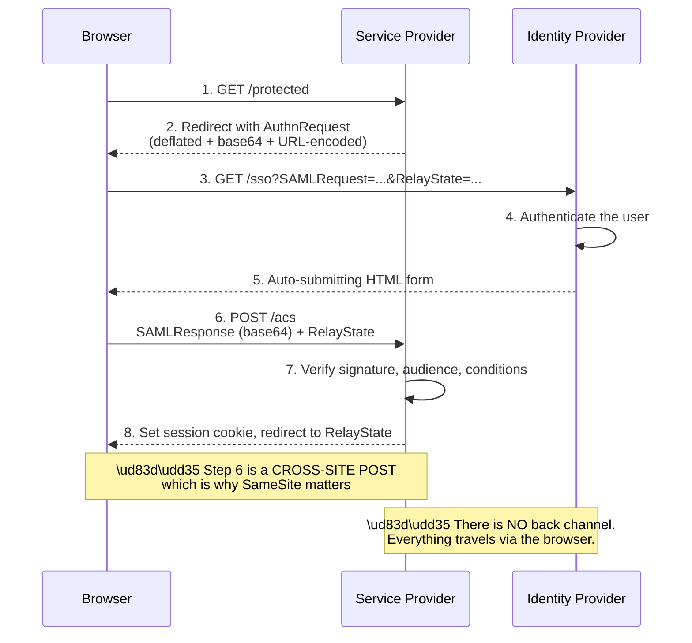
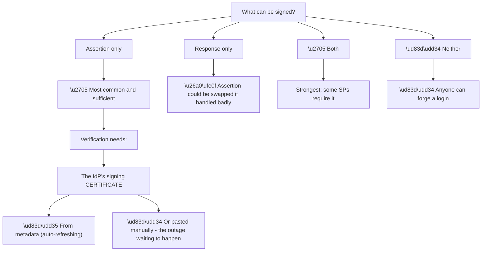

# Appendix E - SAML and XML Cheat Sheet

> Purpose: Read a SAML message without hesitating. Anatomy, bindings, decoding steps, the fields that actually cause failures, and a validation checklist.

*Part of the* **[Okta Developer Support Engineer - Complete Study Guide](../Okta%20Developer%20Support%20Engineer%20-%20Complete%20Study%20Guide.md)**

---

## 1. The Flow in One Picture



**Two facts drive most SAML troubleshooting:**

| Fact | Consequence |
|---|---|
| **Everything goes through the browser** | A HAR captures the whole exchange (Appendix D §8) |
| **Step 6 is a cross-site POST** | **`SameSite=Lax` drops the cookie — pattern #6** |

**And a third:** the SP and the IdP **never talk to each other** in SP-initiated SSO. **Trust is established entirely by signature and metadata**, which is why certificate rotation is the dominant outage cause.

---

## 2. Encoding: Redirect vs POST

**The two bindings encode differently, and confusing them wastes time.**

| Binding | Used for | Encoding | Where |
|---|---|---|---|
| **HTTP-Redirect** | `AuthnRequest` | **DEFLATE → base64 → URL-encode** | Query string |
| **HTTP-POST** | `Response` (usually) | **base64 only** (no deflate) | Form field |
| HTTP-Artifact | Rare | Reference fetched over a back channel | — |

> 🔴 **The single most common decoding mistake:** trying to base64-decode a redirect-binding `SAMLRequest` **without inflating it first** — producing binary rubbish and the wrong conclusion that the message is corrupt.

**Decode a POST-binding `SAMLResponse`:**

```bash
echo "$SAMLRESPONSE" | base64 -d | xmllint --format -
```

**Decode a Redirect-binding `SAMLRequest`:**

```bash
python3 - <<'PY'
import base64, zlib, urllib.parse, sys
raw = urllib.parse.unquote(input("SAMLRequest: ").strip())
print(zlib.decompress(base64.b64decode(raw), -15).decode())
PY
```

```powershell
# POST binding (base64 only)
[Text.Encoding]::UTF8.GetString([Convert]::FromBase64String($saml)) 

# Redirect binding (inflate after decoding)
$b   = [Convert]::FromBase64String([Uri]::UnescapeDataString($saml))
$ms  = New-Object IO.MemoryStream(,$b)
$ds  = New-Object IO.Compression.DeflateStream($ms,[IO.Compression.CompressionMode]::Decompress)
(New-Object IO.StreamReader($ds)).ReadToEnd()
```

> ⚠️ **Never paste a real `SAMLResponse` into a web-based SAML decoder.** It contains a valid assertion — **anyone holding it can potentially replay it** within its validity window (Appendix I).

---

## 3. AuthnRequest Anatomy

```xml
<samlp:AuthnRequest
    xmlns:samlp="urn:oasis:names:tc:SAML:2.0:protocol"
    xmlns:saml="urn:oasis:names:tc:SAML:2.0:assertion"
    ID="_a1b2c3"
    Version="2.0"
    IssueInstant="2026-08-26T09:15:00Z"
    Destination="https://idp.example.com/sso"
    AssertionConsumerServiceURL="https://app.example.com/acs"
    ProtocolBinding="urn:oasis:names:tc:SAML:2.0:bindings:HTTP-POST"
    ForceAuthn="false"
    IsPassive="false">
  <saml:Issuer>https://app.example.com/sp</saml:Issuer>
  <samlp:NameIDPolicy
      Format="urn:oasis:names:tc:SAML:2.0:nameid-format:persistent"
      AllowCreate="true"/>
  <samlp:RequestedAuthnContext Comparison="exact">
    <saml:AuthnContextClassRef>urn:oasis:names:tc:SAML:2.0:ac:classes:PasswordProtectedTransport</saml:AuthnContextClassRef>
  </samlp:RequestedAuthnContext>
</samlp:AuthnRequest>
```

| Element / attribute | Meaning | Failure when wrong |
|---|---|---|
| `ID` | Correlates the response (`InResponseTo`) | Mismatch → rejected |
| `Destination` | Where it is being sent | Must match the IdP's SSO URL |
| `AssertionConsumerServiceURL` | Where to POST the response | **Must be registered at the IdP** |
| `<saml:Issuer>` | **The SP entity ID** | 🔴 **Must match the IdP's config exactly** |
| `NameIDPolicy/@Format` | Requested identifier format | `InvalidNameIDPolicy` |
| `ForceAuthn="true"` | Re-authenticate regardless of session | Breaks SSO by design |
| `IsPassive="true"` | No user interaction permitted | `NoPassive` if login is needed |
| `RequestedAuthnContext` | Requested authentication strength | `NoAuthnContext` |

---

## 4. Response and Assertion Anatomy

```xml
<samlp:Response ID="_r1" InResponseTo="_a1b2c3" Version="2.0"
                IssueInstant="2026-08-26T09:15:04Z"
                Destination="https://app.example.com/acs">
  <saml:Issuer>https://idp.example.com/entity</saml:Issuer>
  <samlp:Status>
    <samlp:StatusCode Value="urn:oasis:names:tc:SAML:2.0:status:Success"/>
  </samlp:Status>

  <saml:Assertion ID="_as1" IssueInstant="2026-08-26T09:15:04Z">
    <saml:Issuer>https://idp.example.com/entity</saml:Issuer>
    <ds:Signature>…</ds:Signature>

    <saml:Subject>
      <saml:NameID Format="urn:oasis:names:tc:SAML:2.0:nameid-format:persistent">
        a1b2c3d4-stable-identifier
      </saml:NameID>
      <saml:SubjectConfirmation Method="urn:oasis:names:tc:SAML:2.0:cm:bearer">
        <saml:SubjectConfirmationData
            NotOnOrAfter="2026-08-26T09:20:04Z"
            Recipient="https://app.example.com/acs"
            InResponseTo="_a1b2c3"/>
      </saml:SubjectConfirmation>
    </saml:Subject>

    <saml:Conditions NotBefore="2026-08-26T09:14:34Z"
                     NotOnOrAfter="2026-08-26T09:20:04Z">
      <saml:AudienceRestriction>
        <saml:Audience>https://app.example.com/sp</saml:Audience>
      </saml:AudienceRestriction>
    </saml:Conditions>

    <saml:AuthnStatement AuthnInstant="2026-08-26T09:15:02Z"
                         SessionIndex="_sess1">
      <saml:AuthnContext>
        <saml:AuthnContextClassRef>…PasswordProtectedTransport</saml:AuthnContextClassRef>
      </saml:AuthnContext>
    </saml:AuthnStatement>

    <saml:AttributeStatement>
      <saml:Attribute Name="http://schemas.xmlsoap.org/ws/2005/05/identity/claims/emailaddress">
        <saml:AttributeValue>ana@example.com</saml:AttributeValue>
      </saml:Attribute>
    </saml:AttributeStatement>
  </saml:Assertion>
</samlp:Response>
```

**The fields that matter, ranked by how often they cause failures:**

| Rank | Field | Failure |
|---|---|---|
| 1 | **`<ds:Signature>` certificate** | **Rotation — the top outage cause** |
| 2 | **`<saml:Audience>`** | Must equal the SP entity ID **exactly** |
| 3 | **`Conditions/@NotOnOrAfter`** | Expiry + **clock skew** |
| 4 | **`<saml:NameID>`** | Format or value changed → duplicate/lost accounts |
| 5 | **`Recipient`** | Must equal the ACS URL |
| 6 | **`InResponseTo`** | Absent in IdP-initiated; mismatched otherwise |
| 7 | **Attribute `Name`** | **Provider-specific — the #1 mapping problem** |
| 8 | `SessionIndex` | Needed for single logout |

---

## 5. NameID Formats

| Format (suffix after `…nameid-format:`) | Meaning | Use |
|---|---|---|
| `persistent` | ✅ **Stable, opaque, per-SP** | **The right default** |
| `transient` | 🔴 **Different every login** | Anonymous scenarios only |
| `emailAddress` | The user's email | ⚠️ **Changes when people marry, rebrand, or move** |
| `unspecified` | Whatever the IdP decides | Ambiguous — avoid |
| `persistent` (Entra: `ObjectID`) | Immutable directory GUID | ✅ Best in Entra |

> 🔴 **`transient` produces a new account on every single login.** A customer reporting "we have thousands of duplicate users" almost always has a transient NameID — **pattern #2, unstable identifier.**

> ⚠️ **`emailAddress` looks convenient and is a slow-acting fault.** When someone's email changes, **they become a different person to the SP** and lose everything associated with the old identity.

---

## 6. Attribute Names Are Provider-Specific

**The same logical attribute has a different `Name` at every provider.** This is the most common SAML integration friction.

| Attribute | Common `Name` values |
|---|---|
| Email | `http://schemas.xmlsoap.org/ws/2005/05/identity/claims/emailaddress` · `email` · `mail` · `urn:oid:0.9.2342.19200300.100.1.3` |
| First name | `…/claims/givenname` · `given_name` · `firstName` · `urn:oid:2.5.4.42` |
| Surname | `…/claims/surname` · `family_name` · `lastName` · `urn:oid:2.5.4.4` |
| Groups | `http://schemas.microsoft.com/ws/2008/06/identity/claims/groups` · `groups` · `memberOf` |
| UPN | `…/claims/upn` |
| Name ID | `…/claims/nameidentifier` |

> 🔵 **"The attributes are missing" is almost always a name mismatch, not a missing attribute.** **Ask for the decoded `<AttributeStatement>`** and compare the `Name` values byte for byte against what the SP expects. It resolves in one exchange (Part 085).

---

## 7. What Is Signed, and Why It Matters



**Node V3 is the mechanism behind most SAML production outages** (Part 084):

| Configuration | On rotation |
|---|---|
| **Metadata URL, auto-refreshed** | ✅ Picks up the new certificate automatically |
| **Certificate pasted manually** | 🔴 **Every login fails at the moment the IdP switches** |

**Signature elements to check:**

| Element | Expected |
|---|---|
| `SignatureMethod/@Algorithm` | **RSA-SHA256** or stronger — ⚠️ SHA-1 is deprecated |
| `DigestMethod/@Algorithm` | SHA-256 |
| `<ds:X509Certificate>` | Compare thumbprint against configuration |
| `<ds:Reference URI="#_as1">` | Must reference the assertion `ID` |
| Canonicalisation method | Usually `xml-exc-c14n#` |

> 🔴 **XML Signature Wrapping** is a real attack class: an attacker adds a second, unsigned assertion that a careless parser reads instead of the signed one. **The defence is to validate the signature and then read claims only from the element the signature actually covers** — never from a fresh XPath search.

---

## 8. Federation Metadata

**Metadata is the exchange format for everything above.** Both sides publish it; both sides should consume it.

| Element | Contains |
|---|---|
| `<EntityDescriptor entityID="…">` | **The entity ID** — the identifier both sides must agree on |
| `<IDPSSODescriptor>` | IdP endpoints and signing certificates |
| `<SPSSODescriptor>` | SP endpoints and certificates |
| `<KeyDescriptor use="signing">` | **The signing certificate(s)** |
| `<SingleSignOnService Binding=… Location=…>` | Where to send the `AuthnRequest` |
| `<AssertionConsumerService index=…>` | Where to POST the `Response` |
| `<SingleLogoutService>` | Logout endpoints |
| `validUntil` | **Metadata expiry — an overlooked pattern #1** |

**Fetch and inspect:**

```bash
curl -sS https://idp.example.com/metadata | xmllint --format - | head -60

# Extract signing certificates and show their expiry
curl -sS https://idp.example.com/metadata \
 | xmllint --xpath '//*[local-name()="KeyDescriptor"][@use="signing"]//*[local-name()="X509Certificate"]/text()' - \
 | while read -r c; do printf -- '-----BEGIN CERTIFICATE-----\n%s\n-----END CERTIFICATE-----\n' "$c" \
     | openssl x509 -noout -subject -enddate -fingerprint -sha256; done
```

> 🔵 **Metadata containing two signing certificates means a rotation is in progress.** **That is a healthy sign** — the overlap is exactly what allows the change to happen without an outage.

---

## 9. Validation Checklist

**Work top to bottom. Stop at the first failure.**

| # | Check | Failure means |
|---|---|---|
| 1 | Message decodes as XML | Wrong binding assumed (§2) |
| 2 | `<StatusCode>` is `Success` | Read the second-level code (Appendix B §6) |
| 3 | **Signature verifies** | 🔴 **Certificate rotation** — check thumbprints |
| 4 | Signature covers the assertion you are reading | 🔴 Possible wrapping attack |
| 5 | `<Issuer>` matches the configured IdP entity ID | Wrong IdP, or a config typo |
| 6 | `<Audience>` matches the SP entity ID **exactly** | Trailing slash, scheme, or case |
| 7 | `Conditions/@NotBefore` ≤ now ≤ `@NotOnOrAfter` | Expiry or **clock skew** |
| 8 | `Recipient` equals the ACS URL | Misrouted |
| 9 | `InResponseTo` matches the request `ID` | Replay, lost state, or IdP-initiated |
| 10 | Assertion `ID` not seen before | Replay |
| 11 | `<NameID>` format and value as expected | Pattern #2 |
| 12 | Required attributes present with the expected `Name` | Mapping mismatch (§6) |
| 13 | `RelayState` returned | Deep link lost |
| 14 | Session cookie set after the POST | **`SameSite` — pattern #6** |

---

## 10. Symptom → Cause Table

| Symptom | Most likely cause | Check |
|---|---|---|
| Everyone fails, suddenly, no deploy | **IdP certificate rotated** | Thumbprint vs configuration |
| "Invalid audience" | Entity ID mismatch | Byte-compare both |
| "Assertion expired" | Clock skew | `w32tm /query /status` |
| Lands on the home page, not the deep link | **`RelayState` lost** | Present in the POST? |
| Works in Chrome, fails in Safari | **`SameSite` / third-party cookies** | Cookie attributes |
| Thousands of duplicate users | **Transient NameID** | `NameID/@Format` |
| Users lose access after a name change | **`emailAddress` NameID** | Format |
| Attributes missing | **`Name` mismatch** | Decoded `<AttributeStatement>` |
| `InResponseTo` missing | IdP-initiated flow | Is it permitted at the SP? |
| "Replay detected" on retry | User pressed back / refreshed | Normal; explain it |
| Loops between SP and IdP endlessly | Session cookie not persisting | Cookie attributes, then clock |
| Works from the IdP test button only | ACS URL or entity ID wrong in the real app | Compare configurations |
| Fails only for some users | **Assertion size** (many groups) — pattern #3 | Group count |

---

## 11. SAML vs OIDC at a Glance

| | SAML 2.0 | OIDC |
|---|---|---|
| Format | XML | JSON |
| Token | Assertion | ID token (JWT) |
| Transport | Browser redirect + **form POST** | Redirect + **back-channel** token call |
| Signature | XML Signature | JWS |
| Metadata | XML metadata document | `/.well-known/openid-configuration` |
| Key rotation | Certificate in metadata | **JWKS with `kid`** |
| Mobile / SPA | ❌ Awkward | ✅ Designed for it |
| Enterprise workforce | ✅ Dominant | Growing |
| Logout | `SessionIndex`, unreliable | Also unreliable |
| Debugging | Decode XML from a HAR | Decode JWT; read tenant logs |

> 🔵 **When asked "SAML or OIDC?"**: they solve the same problem; **SAML dominates enterprise workforce federation and is not going away**; **OIDC is the choice for anything new**, particularly mobile and single-page apps. **Naming the trade-off is the answer** (Part 129 §14).

---

## 12. Official Source Anchors

| Source | Covers | Accessed |
|---|---|---|
| OASIS SAML 2.0 Core | Assertion and protocol structure | **26 August 2026** |
| OASIS SAML 2.0 Bindings | Redirect, POST, Artifact encodings | **26 August 2026** |
| OASIS SAML 2.0 Metadata | `EntityDescriptor` structure | **26 August 2026** |
| W3C XML Signature Syntax and Processing | Signature elements and canonicalisation | **26 August 2026** |
| Auth0 Docs — SAML configuration | Platform specifics | **26 August 2026** |
| Microsoft Learn — Entra ID SAML claims | Claim `Name` values | **26 August 2026** |

> **Revalidate:** the SAML specifications are frozen. **Provider claim names and metadata URLs change** — re-check §6 and §8.

---

*Return to:* **[Okta Developer Support Engineer - Complete Study Guide](../Okta%20Developer%20Support%20Engineer%20-%20Complete%20Study%20Guide.md)** · *Next:* **[Appendix F - Customer Communication Templates](Appendix-F-customer-communication-templates.md)**
