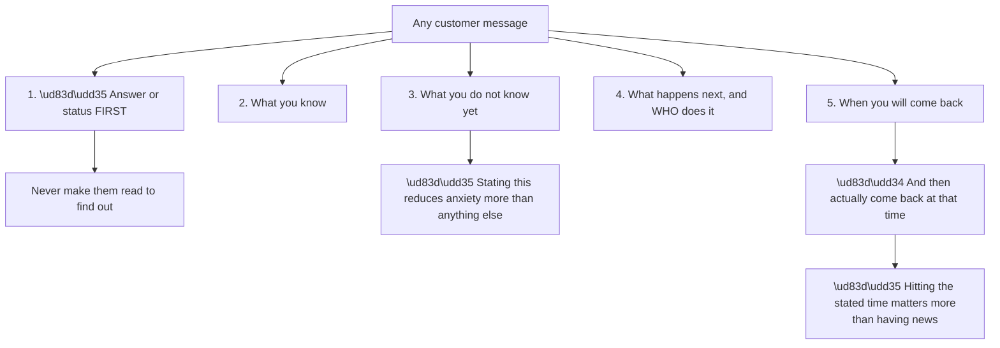
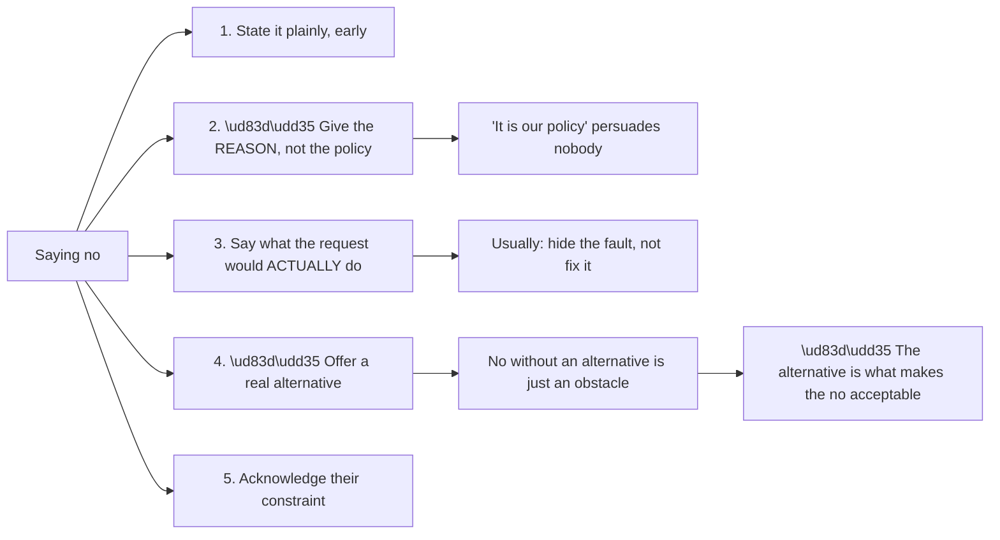

# Appendix F - Customer Communication Templates

> Purpose: Copy-ready templates for every routine support communication, with the reasoning behind each so they can be adapted rather than pasted blindly.

*Part of the* **[Okta Developer Support Engineer - Complete Study Guide](../Okta%20Developer%20Support%20Engineer%20-%20Complete%20Study%20Guide.md)**

---

## 0. How to Use These

> ⚠️ **A template used verbatim reads as a template.** These are structures, not scripts. **The structure is what is reusable; the words should be yours.**



**Node R is the most transferable finding in support communication** (Part 121). **An update that says "no change yet" delivered on time** builds more confidence than a substantive update delivered late.

**Three audience registers** (Part 120):

| Audience | Wants | Avoid |
|---|---|---|
| **Developer** | The mechanism, the exact parameter, a reproducible example | Vague reassurance |
| **IT admin** | What to change, where, and the blast radius | Protocol internals |
| **Executive** | Impact, ETA, and what is being done | Detail of any kind |

---

## 1. First Response

**Goal: acknowledge, establish scope, and request evidence in one message** so the next reply can be substantive.

> **Subject:** \[Ticket #\] Login failures — investigating, first evidence request
>
> Hello \[Name\],
>
> Thanks for reporting this — I have picked it up and I am investigating now.
>
> **What I understand so far:** users are receiving \[error\] when \[action\], starting around \[time\] \[timezone\]. Please correct me if I have any of that wrong.
>
> **To narrow this quickly, could you send:**
> 1. A **HAR file** of one failing attempt, with *Preserve log* enabled before you start — \[link to the capture instructions\]
> 2. The **exact error text** the user sees, and the **wall-clock time** of that attempt including timezone
> 3. Whether **any** user succeeds right now, and if so, what is different about them
> 4. The **application** and **connection** involved
>
> ⚠️ Please **redact tokens and cookies** from the HAR before sending — the instructions above cover this.
>
> **In the meantime** I am reviewing the tenant logs around the time you gave.
>
> **I will come back to you by \[time\]** with what I have found, even if the answer is that I need more.
>
> \[Your name\]

| Element | Why it is there |
|---|---|
| "I have picked it up" | Removes the "is anyone looking at this?" anxiety |
| Restating the understanding | **Catches misunderstandings before hours are spent** |
| Numbered evidence request | Easier to answer completely than a paragraph |
| "Whether any user succeeds" | **A working comparison case is the most valuable single artefact** |
| Redaction reminder | Protects them and you |
| "In the meantime" | Shows work is already happening |
| A committed time | The commitment that matters most |

> 🔵 **Question 3 is the highest-value question in support.** "Does it work for anyone?" separates a total outage from a partial one, **and a partial one always has a discriminating variable** (Part 112).

---

## 2. Evidence Request (Follow-Up)

**When the first artefacts arrive incomplete.**

> Hello \[Name\],
>
> Thanks — the HAR helped. It shows the browser reaching the token endpoint, **which rules out DNS and network reachability**.
>
> **Two things would let me finish narrowing this:**
>
> 1. **The decoded claims** from one failing access token — not the token itself. You can decode it locally with:
>    ```bash
>    echo "$TOKEN" | cut -d. -f2 | tr '_-' '/+' | base64 -d | jq .
>    ```
>    I specifically need `iss`, `aud`, `exp`, and `scope`.
>
> 2. **One user who is currently working**, and their equivalent claims — so I can compare rather than guess.
>
> 🔴 Please **do not** send the token itself. It is a live credential.
>
> \[Your name\]

| Element | Why |
|---|---|
| Naming what the last artefact ruled out | **Shows progress; makes the next request feel purposeful** |
| Asking for **decoded claims**, not the token | Safe, and it is what you actually need |
| Supplying the exact command | Removes friction; they will actually do it |
| Naming the specific fields | Avoids a screenshot of the wrong half |
| Asking for a working comparison | Converts guessing into diffing |

---

## 3. Status Update (No Answer Yet)

**The hardest message to write and the most important to send.**

> Hello \[Name\],
>
> **Update as promised — no root cause yet, and here is exactly where I am.**
>
> **Ruled out:**
> - Network and DNS — the requests reach the tenant, confirmed in the logs
> - Credentials — the authentication stage succeeds
> - Certificate expiry — the current signing certificate is valid until \[date\]
>
> **Current hypothesis:** the failure is at token validation rather than at login, because \[specific evidence\].
>
> **What I am doing next:** \[specific action\], which will confirm or eliminate that.
>
> **Next update from me by \[time\]**, with or without an answer.
>
> \[Your name\]

> 🔵 **"Ruled out" is the section that makes a no-news update valuable.** It converts "nothing has happened" into "the search space has shrunk", which is true and is what the customer needs to hear (Part 121).

**Cadence guidance:**

| Severity | Update interval |
|---|---|
| Production outage | **Hourly**, even with nothing new |
| Major degradation | Every 2–4 hours |
| Significant, not blocking | Daily |
| Routine | On progress, or every 2–3 days |

---

## 4. Workaround Offer

> Hello \[Name\],
>
> I have not yet finished the root cause, but **there is a workaround that should restore service now.**
>
> **Workaround:** \[specific steps\]
>
> **What it does:** \[mechanism, in one sentence\]
>
> **What it does not do:** it does not fix the underlying cause, so \[what remains at risk\].
>
> **Trade-off you should know about:** \[performance / security / operational cost\].
>
> **To reverse it:** \[exact steps\].
>
> I would suggest applying it if \[condition\], and I am continuing on the root cause either way. **Next update by \[time\].**
>
> \[Your name\]

| Element | Why |
|---|---|
| "What it does not do" | 🔴 **Prevents the workaround being mistaken for a fix** |
| The named trade-off | Lets them make an informed decision |
| **Reversal steps** | A workaround with no exit is a new problem |
| "I am continuing either way" | Removes the fear of being dropped once service is restored |

> 🔴 **A workaround that is never reversed becomes permanent, undocumented configuration.** Always supply the reversal steps in the same message.

---

## 5. Declining a Request

**When what is asked for would harm them.**

> Hello \[Name\],
>
> **I am not able to recommend disabling certificate validation** — I want to explain why, and give you a path that meets your deadline.
>
> **Why:** that check is what confirms you are talking to the real \[service\] and not something that has intercepted the connection. Disabling it would make the current error disappear **and would not fix what is causing it** — it would hide it.
>
> **What is actually happening:** \[the real cause, in one or two sentences\].
>
> **What will resolve it, in order of speed:**
> 1. \[fastest legitimate option\] — approximately \[time\]
> 2. \[alternative\] — \[time\]
>
> **If the deadline is the pressing constraint**, option 1 is achievable today and I can walk through it with you now.
>
> \[Your name\]



> 🔵 **Node R is the whole technique** (Part 121). **A no with a path is help. A no without one is an obstacle**, and the customer will simply find someone who says yes.

---

## 6. Correcting Yourself

**You gave a wrong diagnosis. Send this immediately.**

> Hello \[Name\],
>
> **I need to correct something I told you yesterday.** I said the cause was \[X\]. **That was wrong.**
>
> **What actually appears to be happening:** \[Y\], based on \[evidence\].
>
> **What I got wrong and why:** \[the specific misreading\] — I should have \[what would have caught it\].
>
> **What this changes for you:** \[practical impact — including "if you applied the change I suggested, please revert it"\].
>
> **Where that leaves us:** \[current position and next step\], **next update by \[time\]**.
>
> \[Your name\]

| Element | Why |
|---|---|
| Correction **in the first line** | Do not bury it |
| "That was wrong" | 🔵 **Plain words. No hedging** |
| What you got wrong and why | Demonstrates the method improved |
| **Revert instructions** | The most practically urgent part |
| No excessive apology | One acknowledgement; then move forward |

> 🔵 **Correcting yourself quickly is a strength signal, not a weakness one** (Part 130). **The interval between being wrong and saying so is what is actually being judged** — by customers and by interviewers.

---

## 7. Resolution and Closure

> Hello \[Name\],
>
> **This is resolved.** \[Confirmation of restored behaviour.\]
>
> **Root cause:** \[one or two sentences, in plain language\].
>
> **What fixed it:** \[the change, and who made it\].
>
> **Why it happened when it did:** \[the trigger — usually the more useful half\].
>
> **To prevent recurrence, I would suggest:**
> - \[Specific, actionable, with an owner\]
> - \[Second, if warranted\]
>
> **A note on detection:** this had been failing for \[duration\] before it was reported. \[Suggested monitoring\] would surface it in minutes rather than \[duration\].
>
> Full RCA attached. Please let me know if anything is unclear — **I would rather explain it twice than have it half-understood.**
>
> \[Your name\]

> 🔵 **"Why it happened when it did" is usually more useful than "what the cause was."** A configuration that was wrong for two years and only failed on Tuesday **had a trigger**, and the trigger is what prevention has to address (Part 115).

**The detection note is worth including whenever a failure was silent** — pattern #4. **Customers frequently do not realise a fault went unnoticed**, and it is often the most valuable thing in the message.

---

## 8. Executive Summary

**Different discipline. Impact and time. No mechanism.**

> **Subject:** \[Service\] login failures — resolved, \[duration\] impact
>
> **Status:** Resolved as of \[time\].
>
> **Impact:** approximately \[N\] users could not sign in to \[service\] between \[start\] and \[end\]. \[Other services were unaffected.\]
>
> **Cause:** an expired signing certificate that had not been rotated.
>
> **Resolution:** the certificate was replaced and service was restored.
>
> **Prevention:** automated expiry alerting is being enabled; a full RCA with detail is attached.
>
> **Further questions:** \[contact\].

| Rule | Why |
|---|---|
| **Six lines maximum** | It will be forwarded, not read closely |
| Impact **in users and minutes** | The only universally understood units |
| Cause in **one plain sentence** | No protocol vocabulary |
| No jargon at all | Including "SAML", "token", "assertion" |
| Detail available, not included | The RCA is the attachment |

> 🔵 **The one thing executives always want and rarely get is a time**: when it started, when it ended, or when it will. **Lead with it.**

---

## 9. Incident Communication (Ongoing, Multi-Customer)

**Initial:**

> **\[Investigating\]** We are aware of \[symptom\] affecting \[scope\], beginning at \[time UTC\]. We are investigating and will update by \[time\].

**Progress:**

> **\[Identified\]** We have identified the cause as \[plain description\]. A fix is being applied. Next update by \[time\].

**Resolution:**

> **\[Resolved\]** \[Symptom\] was resolved at \[time UTC\]. Total impact was \[duration\], affecting \[scope\]. A post-incident review will be published by \[date\].

| Rule | Why |
|---|---|
| **Always UTC**, always with the offset stated | Multi-region audiences |
| **Impact scope in the first sentence** | Everyone reads to find out "is it me?" |
| **State a next-update time every single time** | Silence is read as escalation |
| Never speculate on cause | A retraction is worse than a delay |
| Never say "a small number of users" | 🔴 **If it is you, it is 100%** |

---

## 10. Escalating to Engineering (Customer-Facing Note)

> Hello \[Name\],
>
> **I am escalating this to our engineering team.** Here is what that means practically.
>
> **Why:** the evidence points to behaviour I cannot resolve from the support side — specifically \[what\].
>
> **What I have sent them:** a minimal reproduction, the tenant logs for \[window\], the correlation IDs, and the list of causes I have already eliminated.
>
> **What I still own:** I remain your point of contact. **You do not need to repeat anything to anyone.**
>
> **What to expect:** \[realistic timeframe\]. **I will update you \[cadence\] regardless of whether there is news.**
>
> **In the interim:** \[workaround, or "there is no workaround, and I will say so plainly if that changes"\].
>
> \[Your name\]

> 🔵 **"You do not need to repeat anything to anyone" is the sentence customers most want to hear at escalation.** The common fear is having to start over with a new person (Part 116).

---

## 11. Phrases to Use and Avoid

| ❌ Avoid | ✅ Instead | Why |
|---|---|---|
| "As per my previous email" | "To recap" | Reads as reprimand |
| "You need to…" | "The step here is…" | Removes blame |
| "Obviously" / "simply" / "just" | *(delete it)* | 🔴 **Makes the reader feel stupid** |
| "It's working fine on our end" | "I am not able to reproduce it — let us find the difference" | Adversarial vs collaborative |
| "That's expected behaviour" | "That is by design — here is why, and here is the alternative" | Explains rather than dismisses |
| "A small number of users" | "\[N\] users, approximately \[%\]" | Specific, honest |
| "Should be fixed now" | "I have confirmed it works for \[case\] — can you verify?" | Verified vs hoped |
| "Unfortunately, our policy is…" | "I am not able to do that because \[reason\]" | **A reason persuades; a policy does not** |
| "I think it might be…" | "My current hypothesis is X; \[test\] will confirm it" | Same uncertainty, more credible |
| "Sorry for the delay" *(repeatedly)* | *(deliver on time instead)* | Repeated apology loses meaning |
| "Let me know if you have questions" | "Which part would be most useful to go deeper on?" | Invites a real reply |

> 🔵 **"Just" and "simply" are the two most damaging words in support writing.** "Just update the redirect URI" implies the customer should have known. **Deleting them costs nothing and changes the tone entirely** (Part 120).

---

## 12. Pre-Send Checklist

- [ ] The **answer or status is in the first two lines**
- [ ] Register matches the audience — developer, admin, or executive
- [ ] No "just", "simply", or "obviously"
- [ ] Every claim is something I have **verified**, not assumed
- [ ] Uncertainty is stated as uncertainty
- [ ] There is a **specific next step with an owner**
- [ ] There is a **committed time**, and I can meet it
- [ ] Requests are numbered and unambiguous
- [ ] Any command or link has been tested
- [ ] **No token, secret, HAR, or customer data pasted inline**
- [ ] A workaround, if offered, includes **reversal steps**
- [ ] If I was previously wrong, **the correction is at the top**
- [ ] It reads as though a person wrote it

---

## 13. Official Source Anchors

| Source | Covers | Accessed |
|---|---|---|
| Okta — company values (`okta.com/company/`) | "Love our customers" as an operating standard | **26 August 2026** |
| Okta Trust / status communications | Incident-message register and cadence | **26 August 2026** |
| Auth0 Docs — support and troubleshooting guidance | Expected evidence and escalation norms | **26 August 2026** |
| This guide, Parts 119–126 | The reasoning behind every template here | — |

> **Revalidate:** templates do not expire, but **support process, severity definitions, and update cadences are organisation-specific.** Confirm local norms on joining (Appendix K).

---

*Return to:* **[Okta Developer Support Engineer - Complete Study Guide](../Okta%20Developer%20Support%20Engineer%20-%20Complete%20Study%20Guide.md)** · *Next:* **[Appendix G - Escalation, RCA, and Postmortem Templates](Appendix-G-escalation-rca-and-postmortem-templates.md)**
