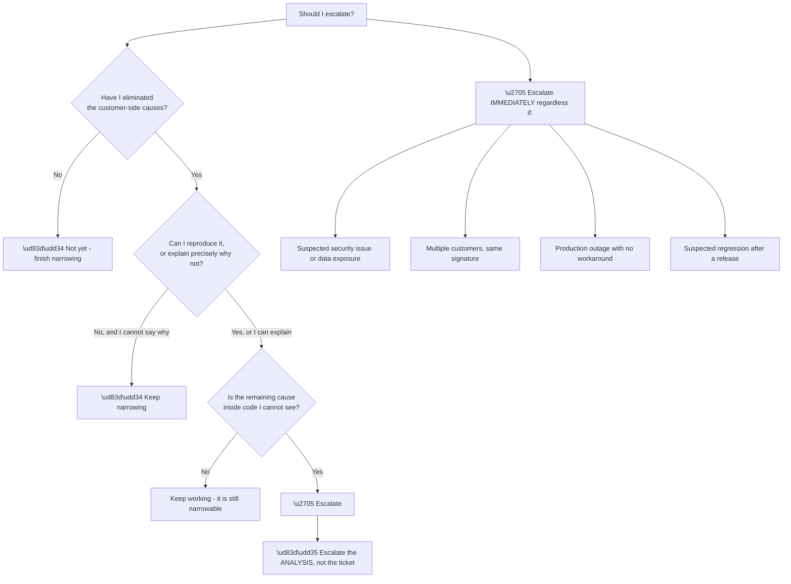
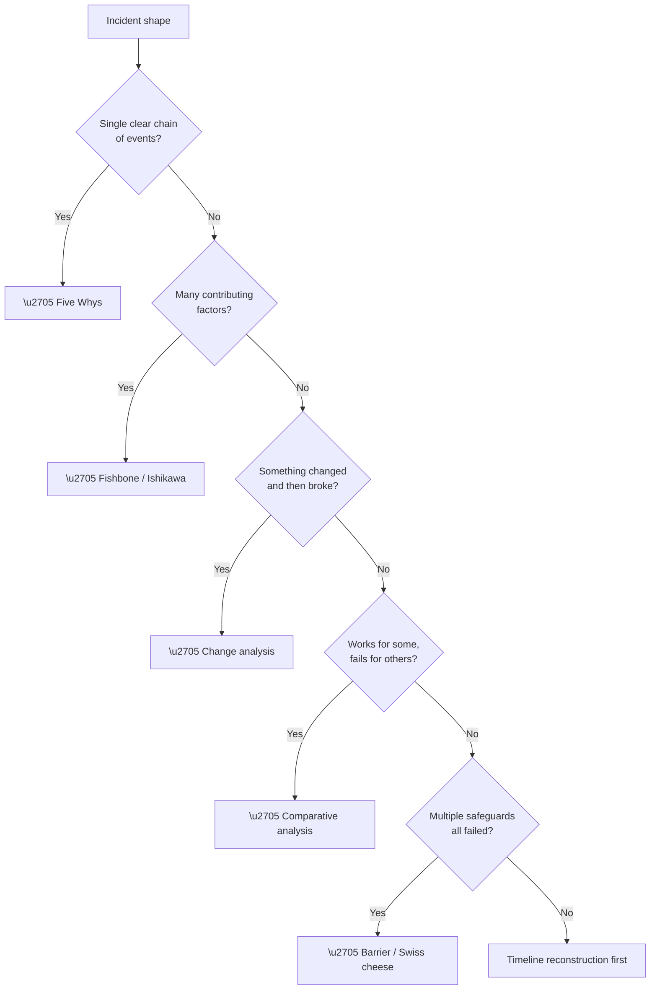
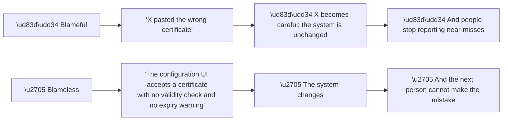

# Appendix G - Escalation, RCA, and Postmortem Templates

> Purpose: The internal-facing counterparts to Appendix F — engineering escalation packets, minimal reproductions, root-cause techniques, action tracking, and blameless postmortems.

*Part of the* **[Okta Developer Support Engineer - Complete Study Guide](../Okta%20Developer%20Support%20Engineer%20-%20Complete%20Study%20Guide.md)**

---

## 1. When to Escalate

**Escalating too early wastes engineering time. Escalating too late wastes the customer's.**



**Node R is the distinction that matters** (Part 116). **Forwarding a ticket transfers the problem. Sending an analysis transfers a narrowed problem** — and the difference determines how quickly it gets picked up.

**Node H is the override.** **Four categories escalate immediately**, before narrowing is complete, because the cost of delay exceeds the cost of an imperfect packet.

---

## 2. Engineering Escalation Packet

> **Title:** \[Component\] — \[observable symptom\] — \[scope\]
> *e.g. "Token endpoint — `invalid_grant` on first exchange — 1 customer, ~40% of logins"*
>
> ---
>
> **Severity / business impact**
> \[N\] users at \[customer type\], \[what they cannot do\], since \[time UTC\]. Workaround: \[yes, with cost / none\].
>
> **Summary (three sentences maximum)**
> \[What is happening, where it fails, and what I believe is happening.\]
>
> **Reproduction**
> - Reproducible: **yes / no / intermittently (\[N\] of \[M\] attempts)**
> - Minimal repro: \[curl command or numbered steps\]
> - Environment: \[tenant type, region, SDK and version, browser\]
>
> **Timeline (UTC)**
> | Time | Event | Source |
> |---|---|---|
> | | | |
>
> **Evidence attached**
> | Artefact | What it shows | Redacted |
> |---|---|---|
> | HAR | Two token calls with the same code | ✅ |
> | Tenant log extract | `feacft` at \[time\], correlation `abc123` | ✅ |
> | Decoded claims | `aud` present, `scope` empty | ✅ |
>
> **Correlation IDs:** \[list\]
>
> **🔵 Ruled out, with evidence**
> | Hypothesis | Eliminated because |
> |---|---|
> | Network / DNS | Requests appear in tenant logs |
> | Credentials | Authentication stage succeeds |
> | Certificate expiry | Valid until \[date\] |
> | Client-side code reuse | Single token call in the HAR |
>
> **Current hypothesis and what would disprove it**
> \[Hypothesis\]. **If \[specific observation\] were true, this hypothesis would be wrong.**
>
> **What I need**
> \[The specific question — not "please investigate".\]
>
> **Customer communication state**
> Last update \[time\]; next committed \[time\]; they know this is escalated.

| Section | Why it earns fast pickup |
|---|---|
| Symptom in the title | Searchable; someone may recognise it instantly |
| Impact first | Determines priority honestly |
| **Minimal repro** | 🔵 **The single highest-value item in the packet** |
| **Ruled out** | **Prevents the first three hours being spent re-checking your work** |
| Falsifiable hypothesis | Shows the reasoning; invites correction |
| A specific ask | "Investigate" gets queued; a question gets answered |
| Comms state | Engineering knows the clock |

> 🔵 **The "ruled out" table is the section most often omitted and most often valuable** (Part 116). **Without it, the receiving engineer starts from zero** — and will usually re-check exactly what you already checked.

---

## 3. Building a Minimal Reproduction

**A repro is minimal when removing anything else makes it stop reproducing.**

| Step | Action |
|---|---|
| 1 | Reproduce it at all, however messily |
| 2 | **Replace the application with `curl`** — does it still fail? |
| 3 | Remove optional parameters one at a time |
| 4 | Reduce to the smallest scope / claim set that still fails |
| 5 | **Substitute synthetic data** for anything customer-specific |
| 6 | Run it three times — record the failure fraction |
| 7 | Run the **working** variant and note the single difference |

```bash
# Minimal repro template - fails
curl -sS -X POST "https://$TENANT/oauth/token" \
  -H 'Content-Type: application/x-www-form-urlencoded' \
  --data-urlencode 'grant_type=client_credentials' \
  --data-urlencode "client_id=$CLIENT_ID" \
  --data-urlencode "client_secret=$CLIENT_SECRET" \
  --data-urlencode 'audience=https://api.example.com/v2'
# => 403 {"error":"access_denied"}

# Same call, working - ONLY the audience differs
#   --data-urlencode 'audience=https://api.example.com/v1'
# => 200
```

> 🔵 **A failing case and a working case differing in exactly one variable is the strongest evidence in support.** It converts "investigate this" into "explain this one difference" (Part 114).

**If you cannot reproduce it, say so precisely:**

| ❌ Weak | ✅ Strong |
|---|---|
| "Cannot reproduce" | "Not reproducible in a clean tenant with an equivalent configuration; **reproduces on the customer tenant in 4 of 10 attempts.** The difference I have not yet eliminated is \[X\]." |

**A precise non-reproduction is itself a finding** — it localises the cause to something tenant-specific.

---

## 4. Choosing an RCA Technique



| Technique | Best for | Weakness |
|---|---|---|
| **Five Whys** | Linear causal chains | 🔴 Collapses genuinely multi-causal incidents into one line |
| **Fishbone** | Multiple contributing factors | Can sprawl without discipline |
| **Change analysis** | "It worked yesterday" | Useless when nothing changed |
| **Comparative** | Partial failures | Needs a working case |
| **Barrier analysis** | Defence-in-depth failures | Better for prevention than for cause |
| **Timeline** | Anything unclear | Not a cause on its own — a prerequisite |

> ⚠️ **Five Whys is over-applied.** **It assumes a single chain.** Most real incidents have a trigger *and* a latent condition *and* a detection gap — and forcing them into one line loses two of the three (Part 115).

---

## 5. Five Whys — Worked

> **Problem:** All users failed to log in to \[app\] between 09:14 and 11:02 UTC.
>
> **1. Why?** The SP rejected every SAML assertion with a signature validation failure.
> **2. Why?** The certificate used to sign assertions was not the one the SP had configured.
> **3. Why?** The IdP rotated its signing certificate at 09:14 as scheduled.
> **4. Why did that break the SP?** The SP had the certificate **pasted manually** rather than consuming federation metadata.
> **5. Why was it configured that way?** The integration was set up years ago by a method that did not support metadata, and it was never revisited.
>
> **Root cause:** a static certificate configuration that could not survive a routine, expected rotation.
>
> **🔵 Contributing factor (does not fit the chain):** the rotation was scheduled and communicated, but **no process existed to identify which integrations were statically configured** — so nobody knew this one was at risk.
>
> **🔵 Detection gap:** the failure was detected by user reports at 09:31, seventeen minutes after it began.

> 🔵 **The two items after "root cause" are the ones that prevent recurrence.** The Five Whys chain explains this incident; **the contributing factor and detection gap explain the next one.**

---

## 6. Full RCA Document

> **1. Summary**
> One paragraph. What happened, impact, duration, and cause. **Written so an executive can stop here.**
>
> **2. Impact**
> | Dimension | Detail |
> |---|---|
> | Users affected | \[N\] (\[%\] of active) |
> | Duration | \[start\] – \[end\] UTC (\[minutes\]) |
> | Services | \[list\] |
> | Not affected | \[list — this matters\] |
> | Data loss | \[none / detail\] |
>
> **3. Timeline (UTC)**
> | Time | Event | How we know |
> |---|---|---|
> | 09:14 | Signing certificate rotated | IdP change log |
> | 09:14 | First assertion rejection | SP logs |
> | 09:31 | First user report | Ticket #### |
> | 09:47 | Cause identified | — |
> | 10:58 | New certificate installed | Change record |
> | 11:02 | Service confirmed restored | Synthetic check |
>
> **4. Root cause**
> \[Plain-language explanation.\] **Include the trigger — why now and not before.**
>
> **5. Contributing factors**
> - \[Factors that made it worse or slower to detect\]
>
> **6. What went well**
> - \[Genuine items only — this is not filler\]
>
> **7. Actions**
> | # | Action | Owner | Due | Prevents |
> |---|---|---|---|---|
> | 1 | Switch to metadata-based configuration | \[name\] | \[date\] | Recurrence |
> | 2 | Alert on certificate expiry ≤ 30 days | \[name\] | \[date\] | Silent expiry |
> | 3 | Inventory statically configured integrations | \[name\] | \[date\] | Unknown exposure |
> | 4 | Synthetic login check every 5 minutes | \[name\] | \[date\] | **Detection gap** |

| Rule | Why |
|---|---|
| **Timeline before analysis** | The sequence usually contains the answer |
| **"How we know" column** | 🔵 Separates evidence from reconstruction |
| **"Not affected"** | Bounds the incident; prevents rumour |
| **The trigger, not just the cause** | A latent fault needs a trigger to become an incident |
| **Every action has an owner and a date** | 🔴 Ownerless actions are decoration |
| **At least one detection action** | If it was silent, that is a finding in itself |

> 🔵 **An RCA with no detection action after a silent failure is incomplete** (Part 115). **Pattern #4 — silent absence — is prevented by monitoring, not by fixing the individual fault.**

---

## 7. Writing About a Customer-Side Cause

**Frequently the cause is in the customer's configuration. This must be written carefully and honestly** — not softened into inaccuracy, and not delivered as blame.

| ❌ Avoid | ✅ Instead |
|---|---|
| "Customer misconfiguration" | "The SP was configured with a static certificate" |
| "The customer failed to…" | "The configuration did not include…" |
| "User error" | "The documented step was not applied" |
| Silence about our contribution | "Our documentation did not flag this as a rotation risk" |

**A fair customer-side RCA includes what *we* could have done better** — clearer documentation, a validation warning, a better default, or earlier notice of the rotation.

> 🔵 **Every customer-side cause has a supplier-side question:** *could the product have made this mistake harder to make?* **Usually yes** — and that answer is the highest-leverage product feedback support ever generates (Part 124).

---

## 8. Blameless Postmortem

**Blameless does not mean causeless. It means the analysis addresses systems rather than individuals.**

| Principle | In practice |
|---|---|
| Assume everyone acted reasonably | With the information they had **at the time** |
| Ask "how was this possible" | Not "who did this" |
| 🔴 **No names attached to mistakes** | Names on **actions** only |
| **Hindsight is excluded** | "Obvious in retrospect" is not evidence it was obvious then |
| Focus on the system | A system where one mistake causes an outage is the finding |

> **Prompts:**
> - What did the person doing this reasonably believe at the time?
> - What information was **not available** to them?
> - What made the wrong action easy and the right action hard?
> - What would have made this **impossible** rather than merely discouraged?
> - How would we have found out if nobody had reported it?



**Node A3 is the strongest practical argument for blamelessness**, independent of fairness: **blame suppresses reporting**, and suppressed reporting means the next incident is discovered later.

---

## 9. Action Tracking

| Field | Rule |
|---|---|
| **Owner** | 🔴 **A person, never a team** |
| **Due date** | An actual date |
| **Prevents** | Which specific recurrence |
| **Type** | Fix / detect / document / process |
| Status | Open · In progress · Done · **Won't do (with reason)** |

**Balance check:**

| If all actions are… | The RCA is incomplete |
|---|---|
| Fixes | ❌ No detection improvement — it will be silent again |
| Documentation | ❌ Nothing structurally changed |
| Process | ❌ Nothing technically changed |
| **Mixed, with ≥1 detection item** | ✅ |

> ⚠️ **"Won't do" is a legitimate outcome and should be recorded with its reason.** **An action list quietly abandoned is worse than one honestly closed** — it destroys confidence in the next RCA.

---

## 10. Escalation Quality Checklist

- [ ] Title contains the **observable symptom**
- [ ] Impact stated in **users and minutes**
- [ ] Summary is **three sentences or fewer**
- [ ] **Minimal repro** included, or non-reproduction explained precisely
- [ ] Timeline in **UTC**
- [ ] Every artefact **redacted and verified** (Appendix I)
- [ ] Correlation IDs listed
- [ ] 🔵 **"Ruled out" table present with evidence**
- [ ] Hypothesis stated **with what would disprove it**
- [ ] The ask is a **specific question**
- [ ] Customer communication state included
- [ ] No customer PII beyond what is necessary
- [ ] I would be able to act on this packet myself

---

## 11. Official Source Anchors

| Source | Covers | Accessed |
|---|---|---|
| This guide, Parts 111–118 | Troubleshooting method and RCA reasoning | — |
| Appendix F | The customer-facing counterparts | — |
| Appendix I | Redaction and evidence handling | — |
| Okta Trust — post-incident reports | Published RCA structure and register | **26 August 2026** |

> **Revalidate:** RCA technique is stable. **Escalation format, severity definitions, and required fields are organisation-specific** — confirm on joining (Appendix K).

---

*Return to:* **[Okta Developer Support Engineer - Complete Study Guide](../Okta%20Developer%20Support%20Engineer%20-%20Complete%20Study%20Guide.md)** · *Next:* **[Appendix H - Standards and RFC Index](Appendix-H-standards-and-rfc-index.md)**
