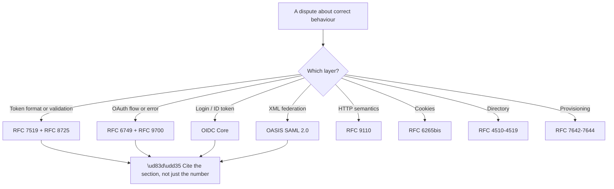

# Appendix H - Standards and RFC Index

> Purpose: The specification map. What each document governs, which ones actually matter in support work, and which are historical.

*Part of the* **[Okta Developer Support Engineer - Complete Study Guide](../Okta%20Developer%20Support%20Engineer%20-%20Complete%20Study%20Guide.md)**

---

## 0. How to Use This

**You are not expected to have read these.** **You are expected to know which one governs a given behaviour**, so that a disagreement about "is this correct?" can be settled by evidence rather than opinion.

**Node R matters.** **"RFC 6749 §4.1.2.1 lists the permitted authorization endpoint errors" is a settled argument.** "The RFC says so" is not.

> 🔵 **Three documents earn re-reading if only three are read: RFC 8725** (JWT best practice), **RFC 9700** (OAuth security best practice), and **OIDC Core §3.1.3.7** (ID token validation). **Between them they cover the majority of real-world mistakes.**

---

## 1. Priority Tiers

| Tier | Documents | Why |
|---|---|---|
| 🔵 **Read properly** | RFC 8725 · RFC 9700 · OIDC Core §3.1.3.7 · RFC 7636 | Directly prevent the most common failures |
| ✅ **Know what they cover** | RFC 6749 · RFC 6750 · RFC 7519 · OIDC Discovery · SAML Core | Cited constantly |
| 📖 **Know they exist** | RFC 7662 · 7009 · 8628 · 8693 · 9449 · SCIM · LDAP | Reached for occasionally |
| 🗄️ **Historical** | RFC 6749 implicit flow · RFC 6819 · WS-Fed · SAML 1.1 | Encountered in legacy estates only |

---

## 2. OAuth 2.0 Core and Extensions

| Document | Title | Governs | Tier |
|---|---|---|---|
| **RFC 6749** | The OAuth 2.0 Authorization Framework | Roles, grant types, endpoints, **error codes** | ✅ |
| **RFC 6750** | Bearer Token Usage | `Authorization: Bearer`, `WWW-Authenticate` errors | ✅ |
| **RFC 7636** | **PKCE** | `code_challenge`, `code_verifier`, S256 | 🔵 |
| RFC 7009 | Token Revocation | The revocation endpoint | 📖 |
| RFC 7662 | Token Introspection | Validating opaque tokens | 📖 |
| RFC 8628 | Device Authorization Grant | TV, CLI, kiosk flows | 📖 |
| RFC 8693 | Token Exchange | Delegation between services | 📖 |
| RFC 8707 | Resource Indicators | The `resource` parameter | 📖 |
| RFC 9068 | JWT Profile for Access Tokens | **Standardised access-token claims** | 📖 |
| RFC 9126 | Pushed Authorization Requests (PAR) | Request sent back-channel first | 📖 |
| RFC 9207 | Authorization Server Issuer Identification | `iss` in the authorization response | 📖 |
| RFC 9449 | **DPoP** | Sender-constrained tokens | 📖 |
| **RFC 9700** | **OAuth 2.0 Security Best Current Practice** | 🔵 **What modern OAuth actually looks like** | 🔵 |
| RFC 6819 | OAuth 2.0 Threat Model | Superseded in practice by 9700 | 🗄️ |
| RFC 8252 | OAuth for Native Apps | System browser, custom URI schemes | 📖 |
| RFC 8414 | Authorization Server Metadata | `/.well-known/oauth-authorization-server` | 📖 |

**Sections worth knowing by number:**

| Reference | Contains |
|---|---|
| RFC 6749 **§4.1** | The authorization code flow, step by step |
| RFC 6749 **§4.1.2.1** | **Authorization endpoint error codes** (Appendix B §3) |
| RFC 6749 **§5.2** | **Token endpoint error codes** — including `invalid_grant` |
| RFC 6749 **§10** | Security considerations |
| RFC 6750 **§3.1** | `invalid_token`, `insufficient_scope` |
| RFC 7636 **§4** | How the challenge and verifier are computed |

> 🔵 **RFC 9700 is the document to cite when a customer proposes an outdated pattern.** It supersedes scattered advice and states plainly that **PKCE is required for all clients** and **the implicit and password grants must not be used** (Part 127).

---

## 3. OpenID Connect

| Document | Governs | Tier |
|---|---|---|
| **OIDC Core 1.0** | ID token, flows, claims, **validation rules** | ✅ |
| **OIDC Discovery 1.0** | `/.well-known/openid-configuration` | ✅ |
| OIDC Dynamic Registration 1.0 | Programmatic client registration | 📖 |
| OIDC Session Management 1.0 | Session state in the browser | 📖 |
| OIDC Front-Channel Logout 1.0 | Logout via iframes | 📖 |
| OIDC Back-Channel Logout 1.0 | Server-to-server logout tokens | 📖 |
| OIDC RP-Initiated Logout 1.0 | `end_session_endpoint` | 📖 |
| **FAPI 2.0** | Hardened profile for regulated sectors | 📖 |
| CIBA | Decoupled authentication | 📖 |

**Sections worth knowing:**

| Reference | Contains |
|---|---|
| OIDC Core **§2** | ID token claims |
| OIDC Core **§3.1.2.1** | Authentication request parameters |
| OIDC Core **§3.1.3.7** | 🔵 **ID token validation — the definitive list** |
| OIDC Core **§5.1** | Standard claims (`profile`, `email`, …) |
| OIDC Core **§5.4** | Which scopes return which claims |
| OIDC Core **§15.1** | Mandatory-to-implement features |

> 🔵 **OIDC Core §3.1.3.7 is the answer to "am I validating this correctly?"** It enumerates every required check in order (Appendix C §6). **A library that skips any of them is non-conformant, and saying which step is skipped ends the discussion.**

> ⚠️ **Single logout is specified across three separate documents and remains unreliable in practice** — because it depends on every relying party being reachable and cooperative at the moment of logout. **This is a specification-versus-reality gap worth being able to explain.**

---

## 4. JOSE — Tokens and Crypto

| Document | Title | Governs | Tier |
|---|---|---|---|
| **RFC 7519** | JSON Web Token | Structure, registered claims | ✅ |
| RFC 7515 | JSON Web Signature | Signing and serialisation | 📖 |
| RFC 7516 | JSON Web Encryption | Encrypted tokens | 📖 |
| **RFC 7517** | JSON Web Key | **JWKS format, `kid`** | ✅ |
| RFC 7518 | JSON Web Algorithms | RS256, ES256, HS256, `none` | 📖 |
| RFC 7638 | JWK Thumbprint | Deriving a stable `kid` | 📖 |
| **RFC 8725** | **JWT Best Current Practices** | 🔵 **Every mistake, and how to avoid it** | 🔵 |
| RFC 9101 | JWT-Secured Authorization Request | Signed request objects | 📖 |

**RFC 8725 in one table** — the practices it mandates:

| Practice | Prevents |
|---|---|
| **Always verify the signature before reading claims** | Forged tokens |
| **Pin the expected algorithm; never trust the header `alg`** | 🔴 `alg: none` and algorithm confusion |
| **Validate `iss` and `aud`** | Token reuse across services |
| Validate `exp` and `nbf` | Expiry and skew issues |
| Use distinct keys for distinct purposes | Cross-protocol attacks |
| **Do not put secrets in the payload** | Payload is public |
| Prefer asymmetric for multi-party | Verifiers cannot mint |

> 🔴 **`alg: none` and algorithm confusion are both defeated by the same single rule:** the *verifier* decides the algorithm, not the *token*.

---

## 5. SAML and WS-Federation

| Document | Governs | Tier |
|---|---|---|
| **SAML 2.0 Core** | Assertions, statements, protocol messages | ✅ |
| **SAML 2.0 Bindings** | Redirect, POST, Artifact — **encoding differences** | ✅ |
| SAML 2.0 Profiles | Web Browser SSO, SLO, ECP | 📖 |
| **SAML 2.0 Metadata** | `EntityDescriptor`, `KeyDescriptor` | ✅ |
| SAML 2.0 Conformance | Required feature sets | 🗄️ |
| SAML 2.0 Security and Privacy Considerations | Threats, including wrapping | 📖 |
| **W3C XML Signature** | `<ds:Signature>`, canonicalisation | 📖 |
| W3C XML Encryption | Encrypted assertions | 📖 |
| WS-Federation 1.2 | Legacy Microsoft federation | 🗄️ |
| SAML 1.1 | Predecessor; still in old estates | 🗄️ |

**Sections worth knowing:**

| Reference | Contains |
|---|---|
| SAML Core **§2.3** | Assertion structure |
| SAML Core **§2.5** | `Conditions`, `AudienceRestriction` |
| SAML Core **§3.2.2.2** | **Status codes** (Appendix B §6) |
| SAML Bindings **§3.4** | 🔵 **HTTP-Redirect — deflate then base64** |
| SAML Bindings **§3.5** | 🔵 **HTTP-POST — base64 only** |
| SAML Metadata **§2.4** | `KeyDescriptor` and certificates |

> 🔵 **Bindings §3.4 versus §3.5 is the citation that resolves the most common SAML decoding confusion** (Appendix E §2) — **redirect binding deflates, POST binding does not.**

**Note:** the SAML specifications are **frozen**. They were finalised in 2005 and will not change. **Everything that changes about SAML is provider behaviour**, not the standard.

---

## 6. Directories, Provisioning, and Enterprise

| Document | Governs | Tier |
|---|---|---|
| **RFC 4511** | LDAP protocol — operations and **result codes** | 📖 |
| RFC 4512 | LDAP directory information models | 📖 |
| RFC 4513 | LDAP authentication and TLS (incl. StartTLS) | 📖 |
| RFC 4514 | **DN string representation** | 📖 |
| RFC 4515 | **Search filter string representation** | 📖 |
| RFC 4516 | LDAP URLs | 📖 |
| RFC 4120 | **Kerberos v5** | 📖 |
| RFC 4178 | SPNEGO | 📖 |
| **RFC 7642** | SCIM — definitions and use cases | 📖 |
| **RFC 7643** | **SCIM core schema** (`User`, `Group`) | 📖 |
| **RFC 7644** | **SCIM protocol** — endpoints, filtering, PATCH | 📖 |

| Reference | Contains |
|---|---|
| RFC 4511 **§4.1.9** | LDAP result codes (Appendix B §9) |
| RFC 4515 **§3** | Filter syntax — **and why escaping matters** |
| RFC 7644 **§3.4.2** | SCIM filtering |
| RFC 7644 **§3.5.2** | **SCIM PATCH — the operation people get wrong** |

> 🔵 **SCIM answers the question federation does not:** federation logs a user in; **SCIM creates, updates, and — critically — deactivates the account.** A leaver who can still log in is a SCIM failure, not a SSO failure (Part 094).

---

## 7. Web Platform

| Document | Governs | Tier |
|---|---|---|
| **RFC 9110** | HTTP semantics — **status codes, methods** | ✅ |
| RFC 9111 | HTTP caching | 📖 |
| RFC 9112 / 9113 / 9114 | HTTP/1.1, HTTP/2, HTTP/3 | 📖 |
| **RFC 6265bis** | **Cookies — including `SameSite`** | ✅ |
| **RFC 8446** | **TLS 1.3** | 📖 |
| RFC 5246 | TLS 1.2 | 📖 |
| RFC 5280 | X.509 certificates and CRLs | 📖 |
| RFC 6960 | OCSP | 📖 |
| RFC 6797 | HSTS | 📖 |
| WHATWG Fetch | **CORS**, preflight, credentials mode | ✅ |
| W3C CSP Level 3 | Content Security Policy | 📖 |
| W3C WebAuthn Level 3 | **Passkeys, FIDO2** | 📖 |
| RFC 8615 | `/.well-known/` URI registry | 📖 |

> 🔵 **CORS is specified in the WHATWG Fetch standard, not an RFC.** People look for an RFC and do not find one. **Fetch is also where "the request was sent; the response was withheld" is stated normatively** — which is the sentence that resolves most CORS misunderstandings (Appendix D §7).

**`SameSite` values, as defined in 6265bis:**

| Value | Sent on |
|---|---|
| `Strict` | Same-site requests only |
| **`Lax`** | Same-site, **plus top-level GET navigations** — 🔴 **not cross-site POST** |
| `None` | All contexts — **requires `Secure`** |

> 🔴 **`Lax` excludes cross-site POST**, which is exactly how a SAML response arrives (Appendix E §1). **This one line explains a large share of "works in one browser only" reports.**

---

## 8. Where to Find Them

| Body | Location | Covers |
|---|---|---|
| IETF | `rfc-editor.org` · `datatracker.ietf.org` | All RFCs |
| OpenID Foundation | `openid.net/developers/specs/` | OIDC, FAPI, CIBA |
| OASIS | `oasis-open.org/standards` | SAML 2.0 |
| W3C | `w3.org/TR/` | XML Signature, WebAuthn, CSP |
| WHATWG | `fetch.spec.whatwg.org` | CORS, Fetch |
| FIDO Alliance | `fidoalliance.org/specifications/` | CTAP, FIDO2 |
| NIST | `pages.nist.gov/800-63-3/` | Digital identity guidelines |

**Reading an RFC efficiently:**

| Step | Why |
|---|---|
| Check the header for **Obsoletes / Updated by** | Avoid reading a superseded document |
| Read the **Abstract** and **Introduction** | Scope, in two minutes |
| Jump to the relevant **numbered section** | Never read linearly |
| Read **Security Considerations** | 🔵 **Often the most useful section in the document** |

> 🔵 **The Security Considerations section is where the practical failure modes live**, and it is the section almost nobody reads. **It is frequently the fastest route to understanding why a design constraint exists.**

**Requirement keywords (RFC 2119 / 8174)** — these have precise meaning:

| Keyword | Means |
|---|---|
| **MUST / MUST NOT** | Absolute requirement |
| **SHOULD / SHOULD NOT** | Valid reasons may exist to deviate — **understand them fully first** |
| **MAY** | Genuinely optional |

**A conformance argument turns on these words.** "The specification says SHOULD, not MUST" is a real and often decisive distinction.

---

## 9. Historical — Recognise, Do Not Recommend

| Item | Status | What to say |
|---|---|---|
| **OAuth 2.0 implicit flow** | 🗄️ Superseded | "It existed because browsers could not do cross-origin POST. CORS removed that constraint; **use code + PKCE**" |
| **Resource owner password grant** | 🗄️ Discouraged | "The app handles the password and there is no path to MFA" |
| OAuth 1.0a | 🗄️ Obsolete | Signature-based; predates TLS ubiquity |
| SAML 1.1 | 🗄️ Legacy | Encountered, not chosen |
| WS-Federation | 🗄️ Legacy | Still present in old Microsoft estates |
| WS-Trust | 🗄️ Legacy | SOAP-era token issuance |
| SHA-1 signatures | 🔴 Deprecated | Collision-practical |
| **`alg: none`** | 🔴 Never | Not a legacy option — an attack |
| Forced password rotation | 🗄️ Superseded | **NIST 800-63B** — rotation drives weaker passwords |
| SMS as a primary factor | ⚠️ Weakened | SIM swap made it practical to defeat |

> 🔵 **When correcting outdated guidance, say what changed** (Part 127). *"That was standard guidance and the constraint that justified it has gone"* **corrects without implying carelessness — and it is true.**

---

## 10. Quick Lookup

| Question | Document |
|---|---|
| What does this OAuth error mean? | RFC 6749 §4.1.2.1 / §5.2 |
| How do I validate an ID token? | **OIDC Core §3.1.3.7** |
| Is my JWT handling safe? | **RFC 8725** |
| Is this OAuth pattern still current? | **RFC 9700** |
| How does PKCE work? | RFC 7636 §4 |
| What does this LDAP code mean? | RFC 4511 §4.1.9 |
| Why is my SAML decode failing? | **SAML Bindings §3.4 vs §3.5** |
| What does this SAML status mean? | SAML Core §3.2.2.2 |
| Why is the cookie not sent? | **RFC 6265bis** (`SameSite`) |
| Why is CORS blocking me? | **WHATWG Fetch** |
| What claims does this scope return? | OIDC Core §5.4 |
| How should SCIM PATCH work? | RFC 7644 §3.5.2 |
| Should we force password rotation? | **NIST 800-63B** (no) |

---

## 11. Official Source Anchors

| Source | Accessed |
|---|---|
| IETF RFC Editor (`rfc-editor.org`) | **26 August 2026** |
| OpenID Foundation specifications | **26 August 2026** |
| OASIS SAML 2.0 standard set | **26 August 2026** |
| W3C Technical Reports | **26 August 2026** |
| WHATWG Fetch Standard | **26 August 2026** |
| NIST SP 800-63 series | **26 August 2026** |

> **Revalidate:** RFC numbers are permanent, **but documents get obsoleted.** Before citing, **check the header for "Obsoleted by"** — that is a one-second check that prevents citing superseded guidance.

---

*Return to:* **[Okta Developer Support Engineer - Complete Study Guide](../Okta%20Developer%20Support%20Engineer%20-%20Complete%20Study%20Guide.md)** · *Next:* **[Appendix I - Lab Safety, Redaction, and Evidence Handling](Appendix-I-lab-safety-redaction-and-evidence-handling.md)**
