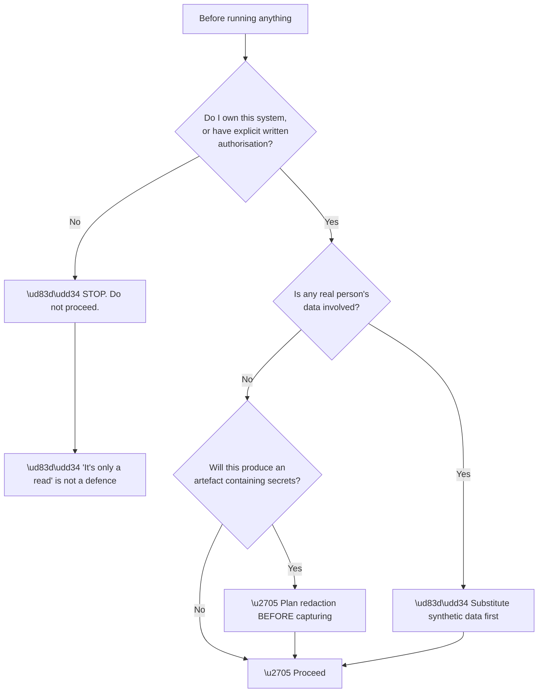
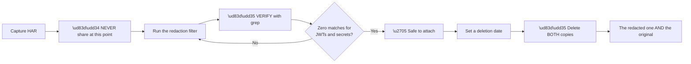
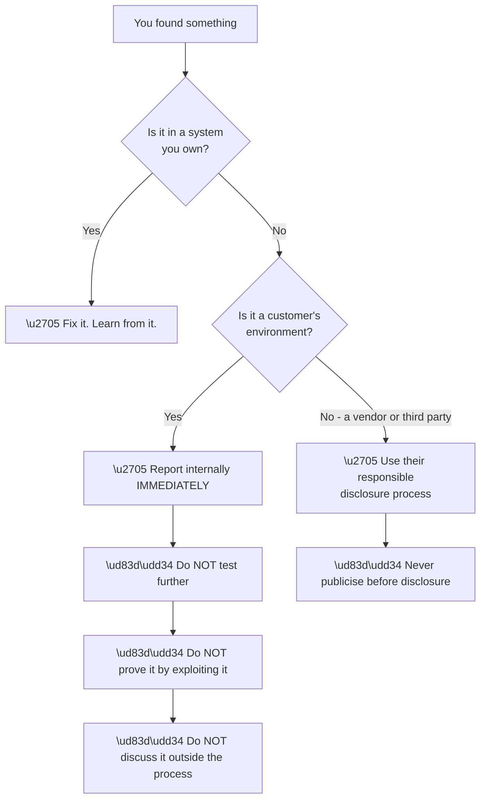

# Appendix I - Lab Safety, Redaction, and Evidence Handling

> Purpose: The rules that keep every lab in this guide safe and every artefact shareable. Authorised scope, synthetic data, redaction procedure, retention, and cleanup.

*Part of the* **[Okta Developer Support Engineer - Complete Study Guide](../Okta%20Developer%20Support%20Engineer%20-%20Complete%20Study%20Guide.md)**

---

## 1. The Non-Negotiables

> 🔴 **These are not guidelines. Violating any of them is a career-level mistake in an identity role.**

| # | Rule |
|---|---|
| 1 | **Only test systems you own or are explicitly authorised to test** |
| 2 | **Never use employer, customer, or any third-party data in a lab** |
| 3 | **Never share a token, secret, or unredacted HAR** |
| 4 | **Never disable TLS or certificate verification** — not even temporarily |
| 5 | **Never use production credentials in a lab** |
| 6 | **Delete artefacts when the investigation ends** |
| 7 | **Assume anything you paste anywhere is permanent** |



**Node C1 is worth stating explicitly.** **A read-only query against a system you are not authorised to touch is still unauthorised access.** The absence of modification is not the test; **authorisation is.**

---

## 2. Authorised Scope for Every Lab in This Guide

| ✅ Permitted | ❌ Not permitted |
|---|---|
| Your own free-tier Okta / Auth0 tenant | Your employer's tenant |
| `localhost` and `127.0.0.1` applications | Any customer's environment |
| A personal domain you control | Any domain you do not own |
| Your own test AD / LDAP in a VM | A production or corporate directory |
| Public documentation and developer forums | Anything requiring credentials you were given for work |
| Synthetic users you created | Any real person's account, **including your own work account** |
| Public test endpoints explicitly offered for testing | Someone else's endpoint that merely happens to respond |

> ⚠️ **"I have the credentials" is not authorisation.** Being issued work credentials authorises you to do your job with them — **not to use them for personal learning, capture artefacts, or run experiments.**

**Free-tier accounts to use instead:**

| Purpose | Source |
|---|---|
| Auth0 tenant | Auth0 free tier |
| Okta Workforce tenant | Okta Developer Edition |
| Test directory | A local VM running OpenLDAP or Samba AD |
| Test SP for SAML | A locally hosted SP library |

---

## 3. Synthetic Data

**Every user, email, name, and organisation in a lab must be invented.**

| Type | ✅ Use | ❌ Never |
|---|---|---|
| Email | `ana.test@example.com` | A real address, including your own |
| Domain | `example.com`, `example.org`, `example.net` | A domain you do not own |
| Names | Invented | A colleague, customer, or family member |
| Company | `Contoso`, `Fabrikam`, `Northwind` | A real customer name |
| IP addresses | `192.0.2.0/24`, `198.51.100.0/24`, `203.0.113.0/24` | A real routable address |
| Phone | `+1-555-0100` – `+1-555-0199` | A real number |

> 🔵 **`example.com` / `example.org` / `example.net` (RFC 2606) and the three documentation IP ranges (RFC 5737) are reserved specifically so they can never resolve to a real system.** **Using them is not a convention; it is a safety guarantee.**

**Also reserved and safe:** `.test`, `.example`, `.invalid`, and `.localhost` as top-level domains.

---

## 4. What Counts as a Secret

**Broader than most people assume.**

| 🔴 Secret | Why |
|---|---|
| Access, ID, and refresh tokens | **Live credentials** until expiry |
| Authorization codes | Usable within their window |
| Client secrets | Permanent until rotated |
| Session cookies | Equivalent to being logged in |
| API keys, Management API tokens | Full administrative access |
| SAML assertions | **Replayable within `NotOnOrAfter`** |
| Private keys, `.pfx` files | Obvious, and still leaked routinely |
| **HAR files of a login flow** | 🔴 **Contain all of the above** |
| Passwords, including "test" ones | People reuse them |
| Connection strings | Often contain credentials |

| ⚠️ Sensitive but not secret | Handle with care |
|---|---|
| Tenant and org identifiers | Reveals customer identity |
| User IDs, emails, names | Personal data |
| Internal hostnames and IPs | Reconnaissance value |
| Correlation IDs | Safe to share; useful in escalations |
| Public keys, JWKS | Public by design |
| Certificate thumbprints | Public |
| Status codes, timings, URLs (query-stripped) | ✅ Safe and diagnostic |

> 🔵 **The last row is important:** after redaction, **URLs, status codes, timings, redirect chains, and cookie attributes all survive** — and those account for most of the diagnostic value of a HAR (Appendix D §8).

---

## 5. HAR Redaction Procedure

**A HAR of a login flow is a live credential bundle. Treat it as such.**



**Step 1 — redact:**

```bash
jq '
  .log.entries[].request.headers  |= map(if (.name|ascii_downcase)|test("authorization|cookie|x-api-key|proxy-authorization") then .value="[REDACTED]" else . end)
| .log.entries[].response.headers |= map(if (.name|ascii_downcase)|test("set-cookie") then .value="[REDACTED]" else . end)
| .log.entries[].request.cookies  |= map(.value="[REDACTED]")
| .log.entries[].response.cookies |= map(.value="[REDACTED]")
| (.log.entries[].response.content.text?) |= (if . then "[REDACTED]" else . end)
| (.log.entries[].request.postData.text?) |= (if . then "[REDACTED]" else . end)
| .log.entries[].request.queryString |= map(if (.name|ascii_downcase)|test("code|token|state|id_token|access_token|client_secret|saml") then .value="[REDACTED]" else . end)
' capture.har > capture-redacted.har
```

**Step 2 — verify (this step is not optional):**

```bash
grep -Eic 'eyJ[A-Za-z0-9_-]{10,}'                        capture-redacted.har   # JWTs
grep -Eic 'client_secret|refresh_token|password'         capture-redacted.har
grep -Eic 'SAMLResponse|SAMLRequest'                     capture-redacted.har
grep -Eic 'Bearer [A-Za-z0-9._-]{20,}'                   capture-redacted.har
```

```powershell
Select-String -Path capture-redacted.har -Pattern 'eyJ[A-Za-z0-9_-]{10,}','client_secret','refresh_token' |
  Measure-Object | Select-Object -ExpandProperty Count
```

> 🔴 **Every count must be zero.** **The redaction step without the verification step is not redaction — it is hope.**

**Step 3 — what to keep:**

| Keep | Because |
|---|---|
| URLs with query strings stripped | Shows the flow |
| Status codes | Shows where it failed |
| Timings | Shows what was slow |
| Redirect chains | The core of the diagnosis |
| **Cookie names and attributes** (not values) | Diagnoses `SameSite` |
| Response header **names** | Diagnoses CORS |
| Request order and count | **Diagnoses code reuse** |

---

## 6. Redacting Tokens and Logs

**Never share a token. Share the decoded, redacted claims.**

```bash
# Decode locally, then blank the identifying values
echo "$TOKEN" | cut -d. -f2 | tr '_-' '/+' | base64 -d 2>/dev/null \
  | jq '.sub="[REDACTED]" | .email="[REDACTED]" | .name="[REDACTED]"'
```

**What is safe to share from a token:**

| ✅ Safe | ❌ Redact |
|---|---|
| `alg`, `kid` | The token itself |
| `iss` (if the tenant is already known) | `sub` |
| `aud` | `email`, `name`, `phone_number` |
| `exp`, `iat`, `nbf` | Custom claims containing personal data |
| `scope` / `permissions` | Anything organisation-identifying |
| Claim **names** without values | — |

**Log extracts:**

| Redact | Keep |
|---|---|
| User IDs, emails, IPs | Event codes |
| Tenant / org names | Timestamps (UTC) |
| Device fingerprints | **Correlation IDs** |
| Custom metadata | Connection type |

> 🔵 **Correlation IDs are the exception worth knowing.** They are opaque, non-identifying, and **the single most useful field to include in an escalation** (Appendix G §2).

---

## 7. SAML Artefacts

> 🔴 **A `SAMLResponse` is a replayable credential** until `NotOnOrAfter` passes — typically five minutes, sometimes longer. **Never paste one into a web-based decoder.**

**Decode locally** (Appendix E §2), then share the structure with values removed:

```
<Issuer>https://idp.example.com/entity</Issuer>          ✅ keep
<Audience>https://app.example.com/sp</Audience>          ✅ keep
<NameID Format="...:persistent">[REDACTED]</NameID>      ✅ keep FORMAT, redact value
<Conditions NotBefore="..." NotOnOrAfter="..."/>         ✅ keep
<Attribute Name="...emailaddress">[REDACTED]</Attribute> ✅ keep NAME, redact value
<ds:X509Certificate>[REDACTED - thumbprint: AB:CD:...]</ds:X509Certificate>
```

**The formats, names, timestamps, and thumbprints are what diagnose the problem** (Appendix E §10). **The values almost never are.**

---

## 8. Interview and Public Contexts

**Different rules again, and stricter.**

| ✅ Say | ❌ Never say |
|---|---|
| "A large enterprise customer" | The customer's name |
| "A business-critical service" | The specific product or system |
| "A certificate rotation broke a federation" | Internal architecture detail |
| "Roughly two thousand users" | Exact figures tied to a named customer |
| "An internal escalation process" | Internal tool names, dashboards, or metrics |
| Your own role and what you personally did | Anything under NDA |
| **Method and shape** | **Specifics and identities** |

> 🔵 **Being visibly careful about this in an interview is itself a strong positive signal** for an identity company (Part 130). **A candidate who reflexively anonymises is demonstrating exactly the judgement the role requires.**

**And it applies to lab artefacts you may want to show:** a portfolio repository is public. **Scan it before publishing:**

```bash
grep -REic 'eyJ[A-Za-z0-9_-]{10,}|client_secret|-----BEGIN [A-Z ]*PRIVATE KEY' . | grep -v ':0$'
```

> 🔴 **A secret committed to git is permanent**, even after deletion, even after a force push — because clones and forks retain it. **Rotate anything that has ever been committed; do not merely remove it.**

---

## 9. Retention and Cleanup

| Artefact | Keep for | Then |
|---|---|---|
| HAR (redacted) | The life of the ticket | **Delete** |
| HAR (original) | 🔴 **Do not retain at all** | Delete immediately after redacting |
| Decoded claims | The life of the ticket | Delete |
| Log extracts (redacted) | Through the RCA | Delete |
| **The RCA itself** | Indefinitely | ✅ It is the durable value |
| Knowledge-base article | Indefinitely | ✅ Review for accuracy |
| Lab tenants | Duration of study | **Delete the tenant** |
| Lab credentials | Duration of study | Rotate and delete |
| Interview recordings | Until the interview | **Delete** |

**Lab cleanup checklist** — run at the end of every lab in this guide:

- [ ] Test users deleted
- [ ] Test applications and APIs deleted
- [ ] Client secrets rotated or the client deleted
- [ ] **Any captured HAR deleted — original *and* redacted**
- [ ] Tokens removed from the shell history and environment
- [ ] Local storage / cookies cleared for the test origin
- [ ] Nothing containing a secret committed to version control
- [ ] Environment variables unset

```bash
history -c                                # clear shell history for the session
unset CLIENT_SECRET ACCESS_TOKEN REFRESH  # clear the environment
```

```powershell
Remove-Item Env:\CLIENT_SECRET, Env:\ACCESS_TOKEN -ErrorAction SilentlyContinue
Clear-History
```

---

## 10. When You Find a Real Security Problem

**In a lab, in a customer environment, or by accident.**



**Node D1 is the discipline that people get wrong.** **Confirming a suspected vulnerability by exploiting it further** — even with good intent, even to strengthen the report — **converts a finding into unauthorised access.** **Report what you observed; stop there.**

**If you observe a possible data exposure** (a customer seeing another organisation's data, for example):

| Step | Action |
|---|---|
| 1 | **Stop.** Do not reproduce it again |
| 2 | Record exactly what you observed, with times |
| 3 | **Escalate immediately** — this is a Node H category (Appendix G §1) |
| 4 | Do not communicate externally until instructed |
| 5 | Preserve evidence; do not delete anything |

> 🔴 **Cross-tenant data exposure is the highest-severity class of bug in multi-tenant identity** (Part 105). **Speed of reporting matters more than completeness of the report.**

---

## 11. Quick Reference

| Question | Answer |
|---|---|
| Can I test this? | **Only if you own it or have explicit authorisation** |
| Can I use a real email? | ❌ Use `example.com` |
| Can I use a real IP? | ❌ Use `192.0.2.0/24` |
| Is a HAR safe to share? | 🔴 **Not until redacted *and* verified** |
| Can I paste a token into a decoder website? | 🔴 **Never** — decode locally |
| Can I paste a `SAMLResponse` into a decoder? | 🔴 **Never** — it is replayable |
| Can I disable certificate validation to test? | 🔴 **Never** |
| Can I name a customer in an interview? | ❌ Shape, not identity |
| I committed a secret and removed it — safe? | 🔴 **No. Rotate it.** |
| What is safe to send in an escalation? | Correlation IDs, event codes, timings, redacted artefacts |
| When do I delete lab artefacts? | **At the end of the lab** |

---

## 12. Official Source Anchors

| Source | Covers | Accessed |
|---|---|---|
| RFC 2606 | Reserved domain names (`example.com`, `.test`) | **26 August 2026** |
| RFC 5737 | Documentation IPv4 ranges | **26 August 2026** |
| RFC 6890 | Special-purpose address registry | **26 August 2026** |
| OWASP Top 10 and cheat sheets | Sensitive data handling, logging | **26 August 2026** |
| Okta Secure Identity Commitment | Vendor security posture and expectations | **26 August 2026** |
| Auth0 Docs — security best practices | Platform-specific handling guidance | **26 August 2026** |

> **Revalidate:** the reserved ranges are permanent. **Organisational data-handling policy overrides everything here** — confirm local policy on joining (Appendix K), and where they differ, **follow the stricter one.**

---

*Return to:* **[Okta Developer Support Engineer - Complete Study Guide](../Okta%20Developer%20Support%20Engineer%20-%20Complete%20Study%20Guide.md)** · *Next:* **[Appendix J - Source Bibliography and Currency Ledger](Appendix-J-source-bibliography-and-currency-ledger.md)**
