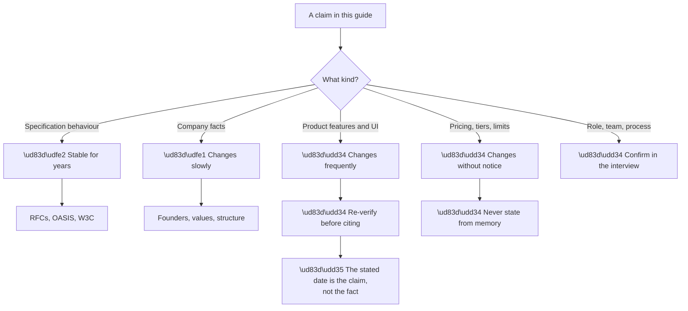
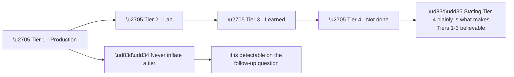

# Appendix J - Source Bibliography and Currency Ledger

> Purpose: Every source this guide relies on, when it was checked, which claims depend on it, and what would make it stale. Verify before you cite.

*Part of the* **[Okta Developer Support Engineer - Complete Study Guide](../Okta%20Developer%20Support%20Engineer%20-%20Complete%20Study%20Guide.md)**

---

## 1. Currency Statement

**Every factual claim in this guide was verified on or before 26 August 2026.**

**Node R is the honest framing.** **Saying "as of when I checked in August 2026" is more accurate than stating a product fact flatly** — and it demonstrates the exact discipline the role requires (Part 127).

| Confidence | Category | Re-verify |
|---|---|---|
| 🟢 High | RFC / OASIS / W3C specification behaviour | Only if obsoleted |
| 🟢 High | Company history, founders, values | Annually |
| 🟡 Medium | Platform object model and core concepts | Quarterly |
| 🔴 Low | Product UI, feature names, defaults, limits | **Before every citation** |
| 🔴 Low | Pricing, free-tier boundaries | **Never state from memory** |
| ⚪ Unknown | Team structure, tooling, process | **Ask in the interview** |

---

## 2. Primary Sources — Okta and Auth0

| # | Source | Used for | Verified | Volatility |
|---|---|---|---|---|
| 1 | `okta.com` — homepage and positioning | "The World's Identity Company™"; "Securing every identity. Human & machine." | **26 Aug 2026** | 🟡 |
| 2 | `okta.com/company/` | Founded 2009; Todd McKinnon and Frederic Kerrest; vision; four values | **26 Aug 2026** | 🟢 |
| 3 | `okta.com/products/` | Two platforms: Okta Platform (workforce), Auth0 Platform (customer) | **26 Aug 2026** | 🟡 |
| 4 | `okta.com/products/customer-identity/` | **Redirects to auth0.com** — confirms this role is Auth0 | **26 Aug 2026** | 🟡 |
| 5 | `auth0.com/docs` | Product areas: Authentication, Fine-Grained Authorization, Auth0 for AI Agents | **26 Aug 2026** | 🔴 |
| 6 | `developer.okta.com` | Developer documentation and SDKs | **26 Aug 2026** | 🔴 |
| 7 | `devforum.okta.com` | Real customer questions; failure-shape material | **26 Aug 2026** | 🔴 |
| 8 | Okta Secure Identity Commitment | Security posture and public commitments | **26 Aug 2026** | 🟡 |
| 9 | Okta for Good · Okta Ventures · Oktane | Corporate programmes and the annual conference | **26 Aug 2026** | 🟡 |
| 10 | Okta Trust / status | Incident communication register | **26 Aug 2026** | 🔴 |
| 11 | Okta Careers — req `P19357_3403190` | The job description this guide is built against | **26 Aug 2026** | 🔴 |

**Grounded company facts** (safe to state, verified against sources 1–4, 8, 9):

| Fact | Source |
|---|---|
| Founded **2009** by **Todd McKinnon** and **Frederic Kerrest** | 2 |
| Created the **IDaaS** category | 2 |
| Tagline: **"Securing every identity. Human & machine."** | 1 |
| Vision: **"to free everyone to safely use any technology"** | 2 |
| Values: **Love our customers · Always secure. Always on. · Build and own it · Drive what's next** | 2 |
| **Two platforms** — Okta (workforce) and Auth0 (customer) | 3 |
| Used by **two-thirds of the Fortune 100** | 1 |
| **San Francisco** headquarters; presence in **15 countries** | 2 |
| **Okta Secure Identity Commitment**, **Okta for Good**, **Okta Ventures**, **Oktane** | 8, 9 |

> 🔵 **The redirect in source 4 is worth remembering as a fact about the role**, not just a URL behaviour: **"customer identity" at Okta *is* Auth0**, which is what makes this a CIAM position rather than a workforce one (Part 002).

---

## 3. Standards Bodies

| Source | Used for | Verified | Volatility |
|---|---|---|---|
| IETF RFC Editor (`rfc-editor.org`) | Every RFC cited in Appendix H | **26 Aug 2026** | 🟢 |
| IETF Datatracker | Obsoletion status; draft progress | **26 Aug 2026** | 🟡 |
| OpenID Foundation (`openid.net/developers/specs/`) | OIDC Core, Discovery, Session, Logout, FAPI | **26 Aug 2026** | 🟢 |
| OASIS (`oasis-open.org`) | SAML 2.0 Core, Bindings, Profiles, Metadata | **26 Aug 2026** | 🟢 **Frozen** |
| W3C (`w3.org/TR/`) | XML Signature, WebAuthn, CSP | **26 Aug 2026** | 🟡 |
| WHATWG (`fetch.spec.whatwg.org`) | **CORS and Fetch** — a living standard | **26 Aug 2026** | 🟡 |
| FIDO Alliance | FIDO2 / CTAP | **26 Aug 2026** | 🟡 |
| NIST SP 800-63 series | Digital identity guidelines; password guidance | **26 Aug 2026** | 🟡 |

> ⚠️ **WHATWG Fetch is a *living standard*** — it has no version number and changes continuously. **"The Fetch standard as of August 2026" is the correct way to cite it.**

---

## 4. Microsoft and Directory Sources

| Source | Used for | Verified | Volatility |
|---|---|---|---|
| Microsoft Learn — Entra ID | App registrations, service principals, tokens, hybrid methods | **26 Aug 2026** | 🔴 |
| Microsoft Learn — Active Directory | DNs, groups, GPO precedence, Kerberos | **26 Aug 2026** | 🟡 |
| Microsoft Learn — bind error codes | The `data` sub-codes (`52e`, `533`, `775`…) | **26 Aug 2026** | 🟢 |
| Microsoft Learn — `w32tm`, `setspn`, AD cmdlets | Appendix D tooling | **26 Aug 2026** | 🟡 |
| Microsoft Learn — SAML claim names | Entra claim `Name` values (Appendix E §6) | **26 Aug 2026** | 🟡 |

> ⚠️ **Entra ID feature names change frequently** — including the product name itself (Azure AD → Microsoft Entra ID). **State the behaviour, not the label**, and confirm the current name before using it.

---

## 5. Tooling and Web Platform

| Source | Used for | Verified | Volatility |
|---|---|---|---|
| curl documentation | Flags and `-w` variables | **26 Aug 2026** | 🟢 |
| OpenSSL documentation | `s_client`, `x509`, `verify` | **26 Aug 2026** | 🟡 |
| OpenLDAP man pages | `ldapsearch`, `ldapwhoami` | **26 Aug 2026** | 🟢 |
| jq manual | Filters and output | **26 Aug 2026** | 🟢 |
| Chrome / Edge DevTools docs | Network panel, HAR export | **26 Aug 2026** | 🔴 |
| HAR 1.2 specification | HAR field structure | **26 Aug 2026** | 🟢 |
| MDN Web Docs | HTTP, cookies, CORS, storage | **26 Aug 2026** | 🟡 |
| OWASP | Top 10, cheat sheets | **26 Aug 2026** | 🟡 |

---

## 6. Candidate-Supplied Sources

| Source | Used for | Volatility |
|---|---|---|
| Candidate CV — Arti Thakur | Experience, tools, certifications, honesty mapping | ⚪ Candidate-owned |
| Supplied job description (`P19357_3403190`) | The JD Coverage Matrix and every JD Mapping table | 🔴 |

**Verified CV facts used throughout** (Parts 001, 126, 129, 130; Appendix K):

| Fact |
|---|
| Bangalore, India |
| Support Escalation Engineer, Microsoft, Oct 2024–present (ODSP + Copilot) |
| Support Engineer, ODSP, Sep 2021–Sep 2024; internship Apr–Jul 2021 — **5 years total** |
| CSAT **4.75+** Enterprise, **4.85+** SMB; **100+ recognitions** |
| ODSP SME; ACE Star Achiever; Pulse Awards; Technical Advisor programme; Aspire Leadership Council |
| Identity: AD, LDAP, Group Policy, IAM, AuthN/AuthZ, Microsoft Entra ID |
| Networking: TCP/IP, OSI, HTTP/HTTPS, TLS/SSL, DNS/DHCP, proxies, firewalls, routing |
| Tools: Wireshark, Netsh, Network Monitor, Procmon, DevTools, HAR, Fiddler |
| Programming: **Python (strongest)**, JavaScript, SQL/PostgreSQL, Power Platform, Copilot Studio |
| MBA Business Analytics (Manipal, ongoing 2026, 9.64); BE CS (Chandigarh University, 8.45, 2021) |
| Certs: Technical Advisors Program 2026; Copilot Studio 2026; AI-102 2025; AZ-900 2025; DP-900 2025; AI-900 2024; Power BI 2023 |

**Named gaps carried consistently across all 130 Parts:**

| Gap | Where it is addressed |
|---|---|
| No Okta or Auth0 **production** experience | Parts 096, 126, 130 |
| OAuth2 / OIDC / SAML / WS-Fed largely **conceptual** | Groups F–H |
| JavaScript needs **demonstrable proof** | Group C |
| **Developer-facing** (vs IT-admin) support is new | Parts 003, 120 |
| **Consumer-scale CIAM** patterns are new | Group J |
| 🔵 **Architecture guidance — 6 to 9 months** | Parts 096, 126, 130 |

> 🔵 **The last row is the load-bearing honesty claim in this guide.** It is what makes every other claim credible (Part 130 §3), and it must be stated in exactly those terms — **not softened, not expanded.**

---

## 7. Claim-Safety Tiers

**Every claim about capability in this guide falls into one of four tiers. Never move a claim up a tier.**

| Tier | Phrasing | Example |
|---|---|---|
| 1 | **"I have done this in production"** | AD, LDAP, Entra, HAR analysis, enterprise escalations |
| 2 | **"I have done this in a lab"** | Auth0 tenant, PKCE flow, SAML connection, SCIM run |
| 3 | **"I understand the architecture but have not operated it"** | Consumer-scale CIAM patterns, FGA at scale |
| 4 | **"I have not done this"** | Okta/Auth0 in production; architecture guidance |

> 🔴 **Node X1 is the practical reason, beyond integrity.** **An inflated claim survives the first question and fails the second** — and the failure is worse than never having made the claim.

---

## 8. Revalidation Triggers

**Re-check a source when any of these occur:**

| Trigger | Re-check |
|---|---|
| **Interview scheduled** | Everything 🔴 — sources 1–11, and the job posting |
| Oktane or a major product announcement | Sources 3, 5, 6 |
| An RFC moves to obsoleted | Appendix H |
| A browser announces a cookie policy change | Parts on cookies; Appendix B §2 |
| A new OAuth or OIDC document reaches RFC status | Appendix H §2 |
| Product UI screenshots stop matching | Group J Parts |
| A quoted limit or default is contradicted in the wild | The relevant Part |
| **Six months elapse with no check** | The whole 🔴 tier |

**Before the interview, specifically re-verify:**

- [ ] The job posting still exists and the wording is unchanged
- [ ] Okta's values page — the four values, verbatim
- [ ] Whether the two-platform structure is still described the same way
- [ ] Auth0 docs top-level product areas
- [ ] Any product feature you plan to name in an answer
- [ ] Recent Okta news — a major announcement is worth knowing about
- [ ] Nothing in your labs has broken due to a platform change

> 🔵 **The last item is worth doing properly.** **Discovering in the interview that a lab you cite no longer works the way you describe** is avoidable with one re-run (Part 130 §5).

---

## 9. Known Limitations of This Guide

**Stated plainly, because pretending otherwise would be the same failure this guide warns against.**

| Limitation | Consequence |
|---|---|
| **Written from documentation, not production operation** | Product behaviour under load and at scale is not covered from experience |
| **UI details will drift** | Screenshots and menu paths were not relied upon, but feature names may still change |
| **Interview process is unknown** | Format, rounds, and assessors are assumptions (Part 128) |
| **Team structure is unknown** | Ramp expectations in Appendix K are inferred, not confirmed |
| **Region-specific practice is unknown** | Bengaluru-office specifics are not covered |
| **Labs use free tiers** | Enterprise-tier features could not be exercised |
| **No access to internal tooling** | Support workflow is described generically |

> 🔵 **These limitations are also good interview material.** **Naming what a preparation approach could not cover** demonstrates the same self-assessment discipline as naming a skills gap.

---

## 10. Citation Discipline

| ✅ Do | ❌ Do not |
|---|---|
| "As of August 2026, the documentation states…" | "Auth0 does X" *(flatly, from memory)* |
| "RFC 9700 §2.1.1 says PKCE is required" | "The RFC says PKCE is required" |
| "I would need to check the current limit" | Quote a number you are not certain of |
| "That is what I observed in my lab" | Present a lab result as production behaviour |
| "The behaviour I saw was X; the docs describe Y" | Reconcile the two silently |
| Cite the **section**, not just the document | Cite the document number alone |

> 🔵 **"I would need to check" is a stronger answer than a confidently wrong number** — in an interview and in a ticket (Part 121). **In developer support specifically, a confident wrong answer gets implemented.**

---

## 11. Verification Log

| Date | Scope | Result |
|---|---|---|
| **26 Aug 2026** | Sources 1–11 (Okta / Auth0) | ✅ All verified live |
| **26 Aug 2026** | Standards bodies (§3) | ✅ Verified |
| **26 Aug 2026** | Microsoft Learn (§4) | ✅ Verified |
| **26 Aug 2026** | Tooling and web platform (§5) | ✅ Verified |
| **26 Aug 2026** | Candidate CV and JD (§6) | ✅ Supplied by candidate |
| *\[add your own\]* | | |

**Add a row each time you re-verify.** **A dated ledger is what turns "I checked" into evidence** — and it is the same discipline as the "how we know" column in an RCA (Appendix G §6).

---

*Return to:* **[Okta Developer Support Engineer - Complete Study Guide](../Okta%20Developer%20Support%20Engineer%20-%20Complete%20Study%20Guide.md)** · *Next:* **[Appendix K - 30/60/90 Day Ramp Plan](Appendix-K-30-60-90-day-ramp-plan.md)**
