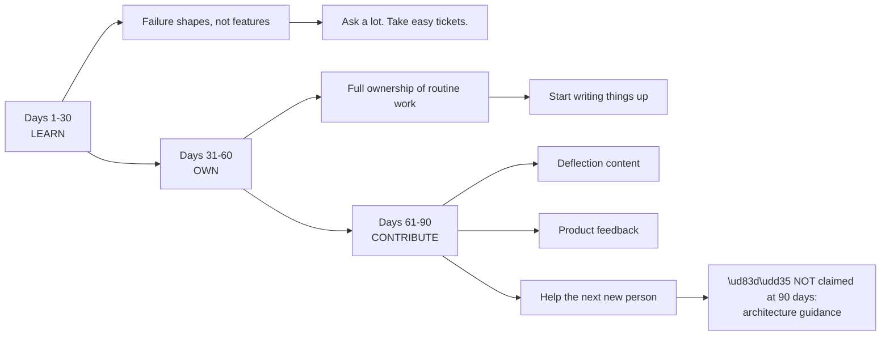
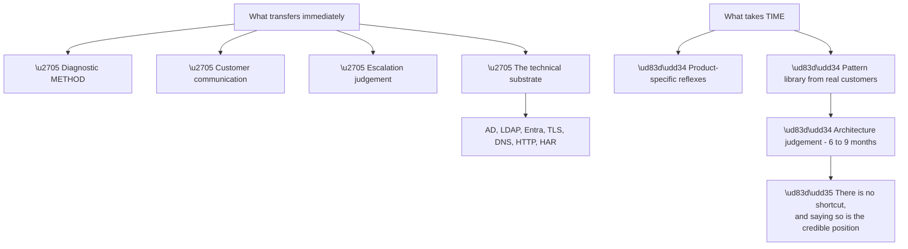

# Appendix K - 30/60/90 Day Ramp Plan

> Purpose: A concrete, defensible plan for the first ninety days — what to learn, what to own, what to contribute, and what *not* to claim. Usable as an interview answer and as an actual plan.

*Part of the* **[Okta Developer Support Engineer - Complete Study Guide](../Okta%20Developer%20Support%20Engineer%20-%20Complete%20Study%20Guide.md)**

---

## 1. The Shape of the Plan

**Node R is the deliberate omission.** **Naming what will not be ready at ninety days is what makes the rest of the plan credible** (Part 130 §3). **Architecture judgement needs real customer patterns over six to nine months** — and claiming it at ninety days is the fastest way to lose the interviewer.

| Phase | Theme | Measurable by |
|---|---|---|
| **1–30** | Learn the failure shapes | Can distinguish failure classes from a log alone |
| **31–60** | Own routine work end to end | Handling tickets unaided; writing up findings |
| **61–90** | Contribute beyond the queue | Published content; product feedback filed |

---

## 2. Days 1–30 — Learn

**Goal: know the shape of the failures, not the whole product.**

| Week | Focus | Concrete output |
|---|---|---|
| **1** | Onboarding; environment; who does what | A map of the team and escalation paths |
| **2** | Tenant logs; read them daily | Can name the top ten event codes without looking |
| **3** | Run every flow in a lab tenant | Working code + PKCE, SAML, SCIM, Actions |
| **4** | Take first tickets with support | 5–10 tickets handled, all reviewed |

**What to do:**

- ✅ **Read tenant logs every single day**, even for tickets that are not yours — **pattern recognition comes from volume, not from study** (Part 108)
- ✅ **Build the flows yourself** in a lab tenant, so the first time you debug one is not the first time you have seen it
- ✅ **Shadow escalations** and read closed tickets in the areas you will own
- ✅ **Ask the questions that feel too basic** — this window closes
- ✅ **Keep a personal note of every thing you had to work out** — this becomes your week-9 article backlog
- ✅ Find out the **local answers**: severity definitions, escalation format, on-call, update cadence, who owns what

**Questions to get answered in the first two weeks:**

| Question | Why it matters |
|---|---|
| What are the severity definitions here? | Every organisation defines them differently |
| What does an escalation packet need? | Appendix G is generic; local format wins |
| Who decides when to escalate? | Avoids both over- and under-escalating |
| What is the expected update cadence? | Appendix F §3 is a default, not a rule |
| Which tools are actually used day to day? | Learn those first |
| What is the data-handling policy? | **Overrides Appendix I where stricter** |
| What does good look like here? | Ask directly; the answer is usually specific |

**What NOT to do:**

| ❌ | Why |
|---|---|
| Try to learn the entire product | Breadth without depth produces neither |
| Stay quiet to avoid looking new | The tolerance for basic questions is highest now |
| Propose process changes | You do not yet know why things are as they are |
| Take on complex escalations alone | The cost of getting one wrong is high |
| Skip the boring onboarding material | Some of it is the local convention you will need |

> 🔵 **The single highest-value habit in month one is reading tenant logs daily.** **It is the fastest route to recognising failure classes**, and recognition is the thing that separates a slow diagnosis from a fast one (Part 111).

**Manager checkpoint — day 30:**

> *"Here is what I can now do unaided, here is what I still need support on, and here are three things I found confusing that a new person would also find confusing."*

**The third clause is the valuable one** — it is genuine contribution available from day 30, and it is the only window in which you can see the onboarding gaps clearly.

---

## 3. Days 31–60 — Own

**Goal: routine work handled end to end, and findings written down.**

| Week | Focus | Concrete output |
|---|---|---|
| **5** | Full ownership of routine tickets | Handling unaided; escalating appropriately |
| **6** | First independent RCA | A written RCA reviewed by a colleague |
| **7** | Depth in one area | Chosen specialism started |
| **8** | First written contributions | 2–3 internal notes or articles |

**What to do:**

- ✅ **Own tickets end to end** — including the closure message and the prevention recommendation (Appendix F §7)
- ✅ **Write an RCA properly** for at least one incident and have it critiqued
- ✅ **Choose one area to go deep on** — SAML enterprise connections, Actions, or migrations — **depth in one area is more useful to a team than breadth in all**
- ✅ **Start writing up** everything from the month-one note backlog
- ✅ **Ask for feedback on your written communication specifically** — not just on technical accuracy
- ✅ **Start noticing repeats.** The same question three times is an article (Part 122)

**The transition that defines month two:**

| Month one | Month two |
|---|---|
| "How do I approach this?" | "Here is my approach — does it look right?" |
| Answering the ticket | Answering **and** preventing the next one |
| Learning the tools | Using them without thinking |
| Escalating when unsure | **Escalating with a narrowed analysis** (Appendix G §2) |

> 🔵 **The escalation quality shift is the most visible sign of ramp progress.** **An escalation with a "ruled out" table** demonstrates that the narrowing happened — and it is noticed.

**Manager checkpoint — day 60:**

> *"I am handling \[category\] unaided. My escalation quality has improved in \[specific way\]. I have chosen \[area\] to go deep on. Here is what I have written up. Where would you like me to focus next?"*

---

## 4. Days 61–90 — Contribute

**Goal: value beyond your own queue.**

| Week | Focus | Concrete output |
|---|---|---|
| **9** | Deflection content | 2–3 published articles |
| **10** | Product feedback | At least one well-evidenced piece filed |
| **11** | Help others | Reviewing a newer colleague's work |
| **12** | Consolidate and plan | A 90-day review and a next-quarter plan |

**What to do:**

- ✅ **Publish the articles**, titled with **the symptom, not the cause** — customers search for what they see (Part 122)
- ✅ **File product feedback with evidence**: how often, how many customers, how long undetected, what it costs support. **Volume plus cost is what gets acted on** (Part 124)
- ✅ **Prioritise anything that fails silently** — pattern #4 is the highest-leverage feedback category
- ✅ **Review a colleague's escalation or reply** and give useful feedback
- ✅ **Contribute to onboarding** using the confusions you noted in month one
- ✅ **Answer forum questions** if that is part of the role

**Product feedback that gets acted on:**

| Include | Because |
|---|---|
| **How many customers** hit it | Frequency drives prioritisation |
| **How long it goes undetected** | Silent failures are under-weighted |
| **Support cost per occurrence** | Converts it into a number |
| **What the customer expected** | Points at the fix |
| **A one-line suggested change** | Reduces the effort to act |

> 🔵 **"This error message does not say which of the four possible causes it is"** is better feedback than "this is confusing" — **because it names the change** (Appendix G §7).

**Manager checkpoint — day 90:**

> *"Here is what I own, what I have published, what I have fed back to product, and what I want to work on next. The thing I am still building is architecture judgement — I would like exposure to \[specific\] to accelerate that."*

---

## 5. Measurable Milestones

| Day | Milestone | Evidence |
|---|---|---|
| 7 | Local process understood | The §2 question list answered |
| 14 | Reading tenant logs fluently | Top ten event codes from memory |
| 21 | Every flow built in a lab | Working artefacts |
| 30 | Routine tickets with light support | 5–10 handled |
| 45 | Routine tickets unaided | Volume comparable to peers |
| 60 | An RCA written and reviewed | The document |
| 60 | A specialism chosen | Named area |
| 75 | Articles published | 2–3 live |
| 90 | Product feedback filed | With evidence |
| 90 | Helping others | A review given |

---

## 6. Honest Boundaries

**State these plainly. They are what make the plan credible.**

| At 90 days | Status |
|---|---|
| Routine tickets, unaided | ✅ Expected |
| Diagnosis method applied to new problems | ✅ Expected — it transfers |
| Clear customer communication | ✅ Expected — it transfers |
| Escalating well | ✅ Expected |
| Reading platform logs fluently | ✅ Expected |
| Depth in one chosen area | ✅ Expected |
| Recognising common failure classes instantly | 🟡 Developing |
| Complex multi-party enterprise federation | 🟡 Developing |
| **Architecture guidance to customers** | 🔴 **Not yet — 6 to 9 months** |
| Consumer-scale CIAM pattern judgement | 🔴 Not yet |

**Node T4a is the argument for hiring you** (Part 130 §3). **A large share of identity failures live in the substrate**, not in the identity product — and that substrate is several years of production experience, not a gap.

---

## 7. As an Interview Answer

**Compressed to ninety seconds** (Part 129 §1):

> *"First thirty, learn the shape of the failures rather than the whole product — read tenant logs daily until I can tell the failure classes apart, build every flow in a lab so the first time I debug one isn't the first time I've seen it, and take tickets where I can be genuinely useful while asking a lot of questions, because that window closes.*
>
> *Second thirty, take full ownership of routine work, write a proper RCA and have it critiqued, and pick one area to go deep on — depth in one area is more useful to a team than shallow breadth everywhere. And start writing up anything I had to work out from scratch, because by then I'll have a backlog of exactly that.*
>
> *Third thirty, contribute beyond my own queue — publish the deflection content, file product feedback with actual evidence on anything that fails silently, and help the next new person using the confusions I noted in month one.*
>
> *What I wouldn't claim is that I'll be giving architecture guidance at ninety days. That needs real customer patterns over six to nine months and I don't think there's a shortcut."*

| Why this answer works | |
|---|---|
| Specific rather than generic | Named activities, not "learn the product" |
| Shows understanding of support ramp | Method transfers; product reflexes do not |
| Includes contribution, not just absorption | Signals ownership |
| **Ends with an honest boundary** | 🔵 **Makes everything before it believable** |

---

## 8. Personal Learning Plan Alongside

| Month | Study focus | Proof |
|---|---|---|
| 1 | Product depth: Actions, connections, Organizations | A working lab of each |
| 2 | The chosen specialism, to genuine depth | An internal write-up |
| 3 | Adjacent: FGA, AI-agent authorisation, migrations | Notes and a lab |
| Ongoing | Developer forum, weekly | Recognised failure shapes |
| Ongoing | One RFC section per week | Appendix H, top tier first |

> 🔵 **Reading the developer forum weekly is the highest-return ongoing habit** (Part 128). **It supplies real failure shapes in customer language** — which is the vocabulary you will actually receive them in.

---

## 9. Warning Signs to Watch For

| Sign | What it means | Action |
|---|---|---|
| Still asking the same question at day 60 | Not consolidating | Write it down; build it |
| No written output by day 60 | Absorbing, not contributing | Start the backlog now |
| Escalating without narrowing | Method not applied | Re-read Appendix G §1 |
| Never escalating | Holding on too long | Time-box and check in |
| Ticket volume far below peers at day 60 | Going too deep on each | **Time-box with a checkpoint** |
| Volume high, repeats high | Fixing without preventing | Prevention in every closure |
| Not reading logs daily | Losing the fastest learning route | Reinstate the habit |

> 🔵 **"Going deeper than the situation warranted" is a genuine and common failure mode** — and it is one worth naming honestly in an interview, with the fix: **a time-box with an explicit checkpoint** (Part 130, Q7).

---

## 10. Ninety-Day Self-Review

- [ ] I handle routine tickets unaided
- [ ] I read tenant logs fluently and recognise the common event codes
- [ ] I have written and had reviewed at least one full RCA
- [ ] My escalations include a "ruled out" section with evidence
- [ ] I have published at least two articles, titled by symptom
- [ ] I have filed at least one well-evidenced piece of product feedback
- [ ] I have depth in one named area
- [ ] I have helped at least one colleague
- [ ] I know the local severity, escalation, and data-handling rules
- [ ] I can state honestly what I still cannot do
- [ ] I have a plan for the next quarter

---

## 11. Official Source Anchors

| Source | Covers | Accessed |
|---|---|---|
| Okta Careers — the role posting | Stated responsibilities and expectations | **26 August 2026** |
| Okta — company values | "Build and own it", "Drive what's next" as ramp themes | **26 August 2026** |
| `devforum.okta.com` | The ongoing learning habit in §8 | **26 August 2026** |
| This guide, Parts 119–126 and Appendices F, G, I | Everything referenced here | — |

> **Revalidate:** 🔴 **This plan is inferred, not confirmed.** Team structure, ramp expectations, tooling, and process are unknown (Appendix J §9). **Confirm them in the first two weeks and adjust** — and say so when giving this as an interview answer.

---

*Return to:* **[Okta Developer Support Engineer - Complete Study Guide](../Okta%20Developer%20Support%20Engineer%20-%20Complete%20Study%20Guide.md)** · *Next:* **[Appendix L - Night-Before One-Page Cheat Sheet](Appendix-L-night-before-one-page-cheat-sheet.md)**
