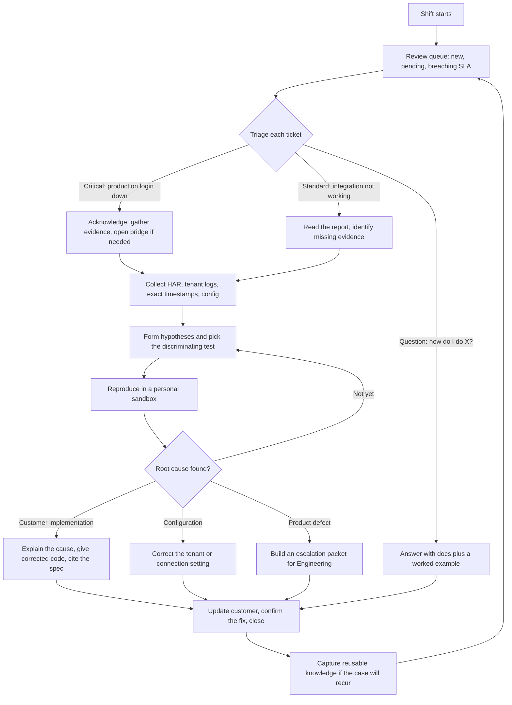
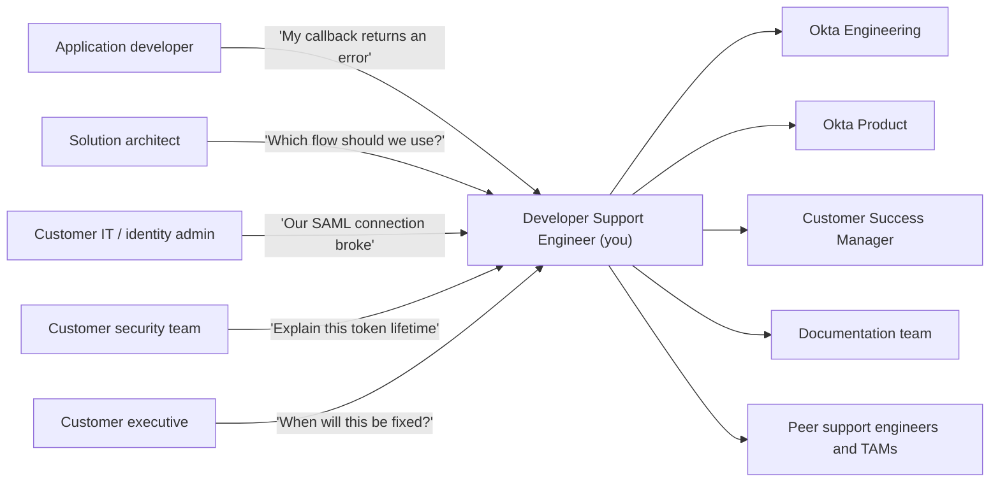
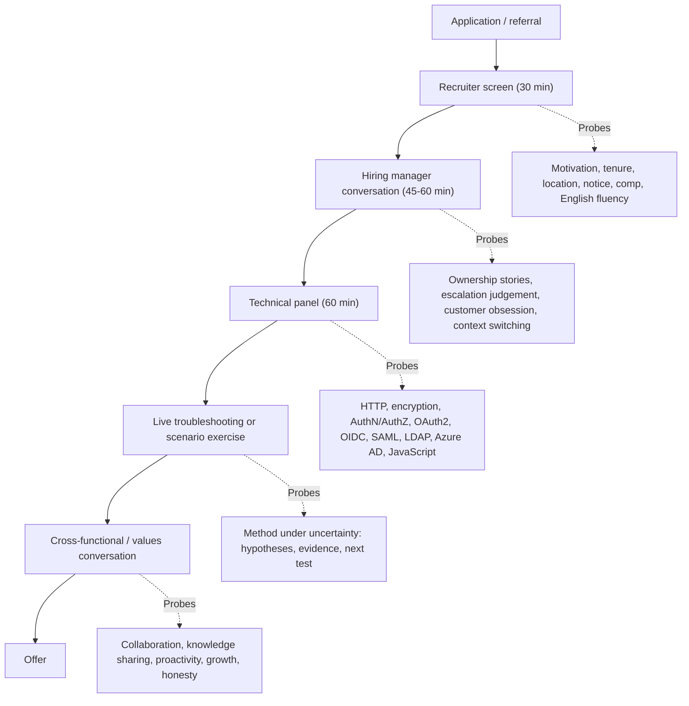
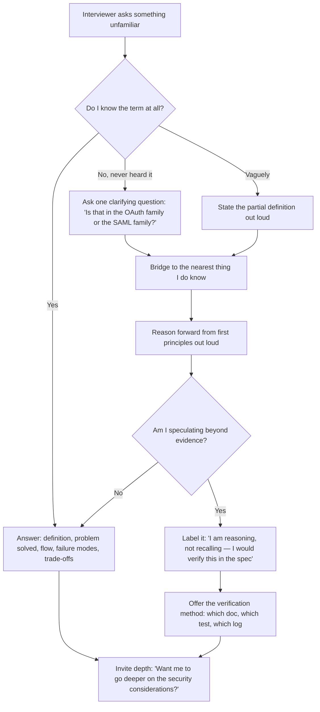
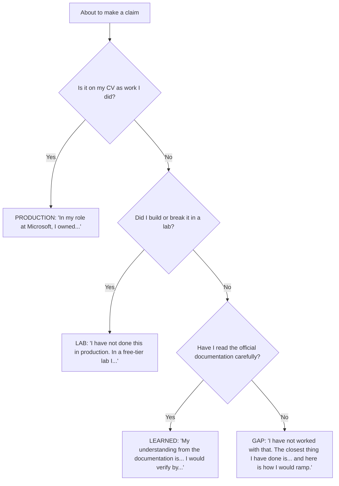

# Part 001 - Role Compass, Interview Map, and Honest Candidate Story

> Section goal: Build a stable foundation for every later answer — know exactly what an Okta Developer Support Engineer does all day, what the interview will probe, which parts of five years at Microsoft transfer honestly, where the real gaps are, and how to tell that story in 90 seconds without exaggerating a single word.

Covers index item **001**. Maps to JD responsibilities: *end-to-end ownership*, *internal and external point of contact*, *5 years+ technical support*, *self-starter*, *continuous growth*, *customer-obsessed attitude*, and the onsite Bengaluru expectation.

---

## 1. Start From Zero: What Is a "Developer Support Engineer"?

Before any protocol or product, get the job itself clear.

A **support engineer** helps customers who are already using a product and have hit a problem. A **developer support engineer** does the same thing, but the customer is a *software developer* who is *building something* with the product, and the product is an *API and SDK platform* rather than an application with buttons.

That single difference changes almost everything about the work.

| | Traditional / IT support | Developer support |
|---|---|---|
| Who reports the issue | IT administrator, helpdesk, end user | Software developer, architect, DevOps engineer |
| What they were doing | Using or administering an app | Writing code against an API |
| What "the environment" means | Tenant settings, device, network | Codebase, framework version, SDK version, runtime |
| Primary evidence | Screenshots, admin config, client logs | HTTP traces, code snippets, stack traces, tokens, API responses |
| A good answer looks like | "Change this setting" | "Your code is doing X; the spec requires Y; here is a corrected snippet" |
| Failure mode of a bad answer | Customer stays broken | Customer *ships* broken code to production |
| Escalation artifact | Repro steps + logs | **Minimal reproducible example** + exact versions |

> **Analogy.** Traditional support is being a mechanic: the customer brings you a car that will not start, and you diagnose the car. Developer support is being a *technical adviser to someone building their own car from your parts*. They have your engine, but they wired it themselves. Your job is to work out whether the engine is faulty, the wiring is wrong, or the manual was unclear — and often to redraw the wiring diagram for them.
>
> **Where the analogy stops:** unlike a mechanic, you usually cannot touch the car. You must diagnose entirely through what the customer sends you. That constraint is the whole craft.

### 🔍 Plain-English deep-dive: the words in the job title

- **Developer** — *the customer is a programmer.* **Analogy:** you are staffing the help desk at a hardware store where every customer is a professional builder, not a homeowner. **Why it matters:** you can use precise technical vocabulary immediately, but you will also be *judged* on precision. Vagueness reads as incompetence to this audience.
- **Support** — *reactive problem resolution with an ownership duty.* **Analogy:** an air traffic controller who owns a flight until it lands, not just until the next radio call. **Why it matters:** the JD says "take end-to-end ownership" — the case is yours until it is resolved, even when the fix belongs to another team.
- **Engineer** — *you are expected to reason from first principles, not just look things up.* **Analogy:** a doctor who understands physiology, not a receptionist reading from a symptom chart. **Why it matters:** the interview will test whether you can derive an answer you have never memorised. That is exactly what this guide trains.
- **Customer Identity SaaS** — *a hosted service that handles login and access for someone else's application's end users.* **Analogy:** an outsourced security desk in the lobby of a building the customer owns. **Why it matters:** when identity breaks, the customer's users cannot log in at all. There is no partial degradation. Every ticket is urgent to somebody.

---

## 2. A Day in the Life

A realistic day mixes:

- **2–5 active tickets** at different stages, requiring constant context switching (the JD calls this out explicitly).
- **One deep investigation** that needs a sandbox reproduction.
- **Several short answers** that are really documentation questions with a code example attached.
- **One collaboration touchpoint** — Engineering, Product, a Customer Success Manager, or a colleague's escalation.
- **Some knowledge work** — a runbook, a forum answer, a KB update.

> 💡 **Tie-in to your background:** this shape is *identical* to your Microsoft escalation day: queue triage, a deep CRITSIT investigation, roadblock calls for frontline engineers, a Product/Engineering sync, and KB authoring. You are not learning a new *rhythm*. You are learning a new *domain and a new evidence set*. Say exactly that in the interview — it is true, it is specific, and it is reassuring to a hiring manager.

---

## 3. The Job Description, Decoded Line by Line

The JD has four blocks. Here is what each line is really asking, and where this guide answers it.

### Responsibilities

| JD line | What it really means | Where it is covered |
|---|---|---|
| "Support and maintain customers who have implemented the Customer Identity SaaS solution" | You support **live production integrations**, not new sales or implementation projects | Parts 096–110 |
| "Resolving technical and non-technical customer issues" | Non-technical = billing, entitlements, process, expectation-setting, "is this supported?" | Parts 004, 120 |
| "Operational management of Support tickets" | Queue hygiene, correct fields, timely status, no silent tickets | Part 119 |
| "Build and maintain excellent relationships… highest level of customer satisfaction" | CSAT is measured and it matters | Parts 120–123 |
| "Take end-to-end ownership… initial troubleshooting, identification of root cause and issue resolution" | You do not hand off and forget; you drive to closure | Parts 005, 111–118 |
| "Exceed customer expectations on response quality, timeliness… overall experience" | Speed **and** quality, both tracked | Parts 119–120 |
| "Serve as internal and external point of contact" | You are the interface between the customer and every internal team | Parts 005, 124 |
| "Startup atmosphere… doing whatever it takes" | Scope is fluid; initiative is expected; no "not my job" | Parts 001, 126 |
| "Business and technical analysis skills and knowledge of the Development lifecycle" | Understand *why* the customer built it that way, and where in their lifecycle the fix lands | Parts 009–010 |
| "Promote best practices" | Do not just fix it; steer them to the secure, supported pattern | Parts 066, 102 |
| "Collaborate with other departments" | Engineering, Product, CSM, Docs, Sales | Part 124 |
| "Contribute to and maintain repository of product area specific knowledge" | KB authoring is part of the role, not a bonus | Part 122 |

### Requirements

| JD line | Your position today | Action |
|---|---|---|
| "5 years+ of technical support and/or software development" | **Met.** Apr 2021 internship → Sep 2021 Support Engineer → Oct 2024 Support Escalation Engineer | State the progression, not just the total |
| "Strong analytical and problem-solving skills" | **Met.** RCA and CRITSIT ownership | Bring a concrete example, not an adjective |
| "Self-starter — come up to speed on complex, difficult concepts with minimal assistance" | **Met and demonstrable.** Your CV literally says you *upskilled* into networking and identity on the job | This is your strongest cultural card — see §7 |
| "Quickly context-switch between multiple complex work streams" | **Met.** Escalation queues force this | Have a system to describe (Part 119) |
| "Instinctive ability to subdivide problems into basic components" | **Met.** This is exactly what layered troubleshooting is | Demo it live in the panel (Part 111) |
| "Customer-obsessed attitude" | **Met with numbers.** 4.75+ Enterprise CSAT, 4.85+ SMB, 100+ recognitions | Numbers beat adjectives every time |
| "Team player with solid communication and presentation skills" | **Met.** Triages, case bashes, mentoring, technical interviews, Aspire Leadership Council | Pick one story, not a list |
| "Proactivity" | **Met.** Backlog/CSAT trend analysis leading to recommendations | Part 126 |
| "Continuous growth" | **Met.** MBA in progress, 8 certifications, Technical Advisor programme | Part 126 |

### Technical Domain Focus

| JD line | Honest status | Guide response |
|---|---|---|
| "Software development fundamentals and common architectures" | Working knowledge from the support side | Parts 009–010 make it interview-grade |
| "HTTP, encryption, basic security concepts" | **Strong.** Real HAR/Fiddler/Wireshark/TLS experience | Parts 011–023, 034–045 sharpen it |
| "Authentication and authorization concepts" | **Moderate.** Real AD/Entra/LDAP case work | Parts 046–055 formalise it |
| "OAuth2, OIDC, SAML, WS-FED, LDAP, Azure AD" | **Mixed.** LDAP and Azure AD real; OAuth2/OIDC/SAML/WS-Fed largely conceptual | Parts 056–095 — the largest investment in this guide |
| "Proficient in at least one programming language; ideally JavaScript" | Python strongest; JavaScript listed but needs proof | Parts 024–033 produce real, showable JavaScript |

> **The single most important sentence in the JD for you:** *"Knowledge of one or more auth protocols/specifications: Oauth2, OIDC, SAML, WS-FED, LDAP, Azure AD, etc."* — note **"one or more"**. You already have two of the six (LDAP, Azure AD) from genuine production work. The guide takes you from two to six. Never let yourself believe you are starting from zero here.

---

## 4. Who You Will Actually Talk To

Each persona needs a different register of the *same* truth:

| Persona | They care about | Give them | Never give them |
|---|---|---|---|
| Application developer | Exactly which line is wrong | Spec citation + corrected code + why | Vague "check your configuration" |
| Solution architect | Trade-offs and future-proofing | Comparison of options with consequences | A single answer with no rationale |
| IT / identity admin | The setting and the blast radius | Precise config change + rollback plan | Untested speculation |
| Security team | Risk and standards conformance | The relevant standard and the control | Hand-waving about "it's secure" |
| Executive | Impact, ETA, and confidence level | Impact statement, next update time, honest confidence | Deep protocol detail |

> 💡 **Tie-in to your background:** you already do this five-way translation at Microsoft — you speak differently to a frontline engineer, a Customer IT team, a Delivery Partner, a Product Group, and an executive on a CRITSIT bridge. That is a *transferable, provable* skill. Part 120 makes it explicit.

---

## 5. The Interview Map

Okta does not publish a fixed loop, so treat this as a **planning model** based on how enterprise SaaS support roles are typically structured — not as an insider claim.

### What each round is really testing

| Round | Surface question | Underlying test | Your preparation |
|---|---|---|---|
| Recruiter | "Tell me about yourself" | Can you be concise, relevant, and non-defensive about the switch? | §7 below, the 90-second story |
| Hiring manager | "Tell me about a difficult customer issue" | Do you own outcomes, or narrate events? | Part 130 STAR bank |
| Technical panel | "What is OAuth?" | Can you explain from first principles and go three layers deeper? | Parts 034–095 |
| Live exercise | "A user cannot log in. Go." | Do you gather evidence before guessing? | Parts 111–114 |
| Values | "Tell me about a time you disagreed" | Are you honest, coachable, and safe to put in front of customers? | Part 126 |

### 🔍 Plain-English deep-dive: what "never go blank" actually requires

Going blank is not a memory failure. It is a *structure* failure. The fix is to always have a fallback ladder:

1. **Define the term.** Even a partial definition restarts your thinking. *"OIDC is an identity layer on top of OAuth 2.0."*
2. **State the problem it solves.** *"OAuth alone tells an API you have permission, but not who you are."*
3. **Draw the actors.** Four boxes: user, app, authorization server, API. Almost every identity question lives in that picture.
4. **Walk one concrete flow.** Even slowly. Concreteness beats fluency.
5. **Name your boundary honestly.** *"I have not implemented back-channel logout myself; here is what I understand and how I would verify it."*

Rung 5 is not a loss. In a support interview, **calibrated honesty is a scored competency** — it is the difference between an engineer who says "I don't know, here's how I'd find out" and one who confidently tells a customer something wrong.

---

## 6. Troubleshooting Decision Tree: Answering a Question You Do Not Know

**Worked example.** Interviewer: *"How would you handle a DPoP-bound token that fails validation?"*

- Rung 1: *"DPoP stands for Demonstrating Proof of Possession. It is a way of binding an access token to a specific client key so a stolen token cannot be replayed by someone else."*
- Rung 2: *"It exists because a plain bearer token is like cash — whoever holds it can spend it."*
- Rung 3: *"So there is a proof JWT sent alongside the access token, signed by a key the client holds."*
- Rung 4: *"If validation fails, I would check the proof's `htm` and `htu` claims match the actual method and URL, the `jti` for replay, the timestamp for clock skew, and whether the token's key thumbprint matches the proof's key."*
- Rung 5: *"I have not debugged this in production. I would confirm the exact claim names against the RFC before advising a customer."*

That answer scores well even though the candidate has never touched DPoP — because the *method* is visible.

---

## 7. Your Honest Candidate Story

### The transition narrative in one paragraph

> "I have spent five years at Microsoft in enterprise support, the last two as a Support Escalation Engineer owning business-critical escalations for SharePoint Online, OneDrive, and Copilot. My work is fundamentally about taking an ambiguous, high-pressure production problem, subdividing it across the application, client, network, and identity layers, finding the true root cause, and driving it to resolution with the customer, Engineering, and Product. Identity kept turning up as the layer that mattered — Active Directory, LDAP, Group Policy, and Entra ID authentication issues — and it is the part I found most interesting. I want to move from supporting a collaboration product that happens to involve identity, to supporting identity itself, for developers. I have not run an Okta or Auth0 tenant in production, and I will not pretend otherwise. What I have done is build the protocol depth deliberately: I can decode a JWT and a SAML assertion by hand, walk an authorization code flow with PKCE end to end, and I have built a small SPA and API to prove the JavaScript side rather than just listing it."

### Why this works

| Element | Effect |
|---|---|
| Leads with tenure and level | Satisfies the 5-year bar immediately |
| Names the method, not the product | Makes the transfer obvious |
| Names identity as an *existing* thread | The move looks like a progression, not a pivot |
| Volunteers the gap before being asked | Converts a weakness into a credibility signal |
| Ends with evidence, not intention | "I built X" beats "I am learning X" |

### 🔍 Plain-English deep-dive: why volunteering the gap is *stronger*, not weaker

Interviewers for support roles are hiring someone who will speak to their customers unsupervised. The scariest candidate is not the one with gaps; it is the one who *hides* gaps, because that person will confidently misinform a customer in production and destroy trust.

- **Hidden gap:** discovered in round three, retroactively poisons everything you said earlier.
- **Volunteered gap + evidence of closing it:** demonstrates self-awareness, honesty, *and* the "self-starter, continuous growth" traits the JD names twice.

**Analogy:** a surgeon who says "I have not performed this procedure, I have assisted on twelve and studied it" is far more trustworthy than one who says nothing and hopes. **Where the analogy stops:** in an interview you also get credit for the *learning plan*, which surgery does not offer.

### The claim-safety ledger

Keep this in your head as a live filter on every sentence you say.

| Tier | Trigger phrase | Examples in your case |
|---|---|---|
| **Production** | "In my role at Microsoft, I owned…" | CRITSITs, RCA, HAR/Fiddler/Wireshark/Procmon analysis, AD/LDAP/Group Policy, Entra ID authentication cases, KB authoring, mentoring, CSAT and backlog analysis, Engineering/Product escalation |
| **Lab** | "I have not done this in production; in a free-tier lab I…" | Auth0 tenant setup, authorization code + PKCE, SAML assertion decoding, JWKS verification, Express API guard, SPA login |
| **Learned** | "My understanding from the official documentation is…" | Okta Identity Engine internals, Organizations at scale, fine-grained authorization, agent identity |
| **Gap** | "I have not worked with that yet. The closest transferable experience is…" | Okta/Auth0 production operations, Okta-internal tooling and escalation paths |

---

## 8. The Gap Ledger

Track these. Update the status column as you complete Parts.

| # | Gap | Severity for this JD | Closed by | Evidence that closes it | Status |
|---|---|---|---|---|---|
| 1 | OAuth 2.0 depth | **Critical** — named in JD, dominates the ticket queue | Parts 056–069 | PKCE lab, refresh-rotation experiment, error decision tree | Open |
| 2 | OIDC depth | **Critical** — named in JD | Parts 070–078 | ID token validation checklist, discovery annotation | Open |
| 3 | SAML | **High** — named in JD | Parts 079–084 | Hand-decoded assertion + signature verification | Open |
| 4 | WS-Federation | **Medium** — named but less common | Parts 085–086 | Bridging map | Open |
| 5 | JavaScript proof | **High** — JD says "ideally JavaScript" | Parts 024–033 | Working SPA + Express API repo | Open |
| 6 | Okta/Auth0 product | **High** — the whole product surface | Parts 096–110 | Free-tier tenant with configured connections and Actions | Open |
| 7 | Developer-audience register | **Medium** | Parts 004, 030–032, 120 | Minimal repro + a code-level answer sample | Open |
| 8 | CIAM-specific patterns | **Medium** | Parts 099–105, 108 | Social login + account linking lab | Open |

> **Reframe:** a gap ledger is not a list of reasons to be nervous. It is a *project plan*. You have run harder projects than this under CRITSIT pressure.

---

## 9. Common Failure Modes in This Interview

| Failure mode | What it looks like | Why it costs you | Correction |
|---|---|---|---|
| **Overclaiming** | "Yes, I've worked with OAuth" (meaning: you saw it in a log) | One follow-up question exposes it and taints everything | Use the tier language from §7 |
| **Underclaiming** | "I don't really have identity experience" | False — you have AD, LDAP, GPO, Entra ID | Say what you *did*, precisely |
| **Narrating instead of owning** | "The team escalated it and eventually it got fixed" | Hiring manager cannot find *your* decisions | STAR with first-person actions (Part 130) |
| **Jumping to a cause** | "That's definitely a redirect URI issue" before evidence | Signals guessing, the opposite of the JD's "subdivide problems" | Always: symptom → hypotheses → discriminating test |
| **Protocol name-dropping** | Reciting acronyms without mechanism | Panels probe one level deeper and you stall | Learn one flow *end to end* before learning ten names |
| **Ignoring the customer** | Technically right, humanly cold | This is a *customer-obsessed* role | Every technical answer ends with the customer impact |
| **No questions at the end** | "No, I think you covered everything" | Reads as low interest | Part 130 supplies a bank of them |
| **Apologising for the transition** | "I know I'm not from an identity company…" | Invites doubt you created | Frame as progression: identity was always the interesting layer |

---

## 10. Lab: Build Your Role Compass Artifact

**Purpose.** Produce the three documents you will reread before every interview round.

**Prerequisites.** A text editor. No accounts, no installs, no network access required. Nothing sensitive is involved.

**Steps.**

1. Create a folder `okta-prep/` alongside this guide's `prep/` folder. Inside it create `artifacts/`.
2. **Artifact 1 — `role-fit-matrix.md`.** Copy the JD's Requirements and Technical Domain Focus bullets into a two-column table. For each, write one column entry: your evidence (with tier label) and one column: the single sentence you will say. Anything with no evidence goes to the Gap Ledger.
3. **Artifact 2 — `claim-safety-ledger.md`.** Copy the four-tier table from §7 and populate each tier with *your own* specific examples. Add to it every time you finish a lab.
4. **Artifact 3 — `90-second-story.md`.** Write the transition narrative in your own words. Then read it aloud with a timer three times. If it runs past 100 seconds, cut the least specific sentence and repeat.
5. **Artifact 4 — `gap-ledger.md`.** Copy §8 and add a target date column.

**Expected evidence.** Four Markdown files. `90-second-story.md` should be roughly 180–220 words — that is the 90-second range at a calm speaking pace.

**Validation rubric.**

| Check | Pass condition |
|---|---|
| Every JD requirement has a row | No blank cells in the role-fit matrix |
| Every claim carries a tier | No untagged statements |
| The story is timed | Three recorded reads, all under 100 seconds |
| The gap ledger has dates | Every open gap has a target Part and a date |
| No exaggeration | Someone reading your CV alongside it would agree with every line |

**Cleanup and privacy.** These files contain only your own career information. Do not include employer-confidential case details, customer names, ticket numbers, or internal system names. Describe Microsoft cases generically ("a business-critical escalation for a large enterprise customer"), never identifiably.

---

## 11. JD Mapping

| Supplied JD signal | How this Part supports it |
|---|---|
| End-to-end ownership of customer issues | §2 and §3 establish what ownership means in this role before any technique is taught |
| Internal and external point of contact | §4 maps every stakeholder and the register each one needs |
| 5 years+ technical support | §3 converts CV tenure into a stated, verifiable progression |
| Self-starter with minimal assistance | §8's gap ledger *is* the self-directed plan, and §7 makes it a strength |
| Continuous growth | The ledger's target-date column creates a measurable growth artifact |
| Customer-obsessed attitude | §4 and §9 keep customer impact attached to every technical answer |
| Quickly context-switch | §2 sets the expectation early; Part 119 supplies the system |
| Startup atmosphere, whatever it takes | §3 frames fluid scope as an expectation rather than a surprise |
| Onsite Bengaluru, immersive onboarding | §5 flags location, notice period, and onboarding as recruiter-screen topics to answer crisply |

---

## 12. Candidate Honesty Note

- **Production transfer (safe to claim):** five years of enterprise support with escalation ownership; RCA under production pressure; multi-stakeholder communication; mentoring and KB authoring; measured CSAT; AD, LDAP, Group Policy and Entra ID case exposure; HTTP/TLS troubleshooting with HAR, Fiddler, Wireshark, and Procmon.
- **Lab (safe once completed):** everything produced in this guide's labs, always labelled as lab work.
- **Learned architecture:** Okta and Auth0 product internals until a free-tier tenant has actually been built.
- **No direct experience (say plainly):** operating an Okta or Auth0 production tenant; Okta's internal tooling, ticketing system, and escalation paths.
- **The interview map in §5 is a planning model,** inferred from how enterprise SaaS support hiring generally works. Do not state it to an interviewer as knowledge of Okta's actual process.

---

## 13. Official Source Anchors

Accessed **August 25–26, 2026**. Deep URLs are deliberately omitted at this stage so that nothing is fabricated; navigate from the named entry points.

| Source family | What to use it for | Notes |
|---|---|---|
| The supplied job description (req `P19357_3403190`) | The authoritative statement of responsibilities and requirements | Primary source for every mapping in §3 |
| Okta developer documentation — Concepts, Guides, API Docs, References, SDKs, Release Notes | Product and protocol grounding for later Parts | Confirmed current sections include Okta Identity Engine, OAuth 2.0 and OpenID Connect, redirect versus embedded authentication, IAM overview, policies, and multi-tenancy |
| Auth0 documentation — Get Started, API references, SDKs, Quickstarts | Customer Identity Cloud product grounding | Product areas listed on the docs home: Authentication, Fine-Grained Authorization, Auth0 for AI Agents |
| Okta company site and careers pages | Mission, positioning, and role framing | `okta.com/products/customer-identity` currently redirects to `auth0.com`, confirming the Customer Identity Cloud / Auth0 branding relationship |
| Okta and Auth0 community forums, support site, and status page | How customers actually ask questions, and what real tickets look like | Excellent free source of authentic developer-support language |
| Your own CV | The boundary of every production claim | Never say anything the CV cannot support |

**Revalidate after August 25, 2026:** Okta product naming, portfolio structure, and any statement about interview process.

---

## ⭐ Likely Interview Questions for This Section

### Q1. "Tell me about yourself."
> *Model answer:* Deliver the 90-second story from §7 — five years at Microsoft, progression to Support Escalation Engineer, ownership of business-critical escalations across SharePoint Online, OneDrive and Copilot, the method (subdivide across application, client, network and identity layers, find root cause, drive to resolution with Engineering and Product), the identity thread that kept recurring through AD, LDAP, Group Policy and Entra ID work, the deliberate protocol upskilling, and the honest statement that you have not run an Okta or Auth0 tenant in production. End on evidence: what you built in a lab, not what you intend to learn.

### Q2. "Why are you leaving Microsoft, and why Okta?"
> *Model answer:* Frame it as progression, never as escape. "I am not leaving because of a problem — I have had a strong run there, with SME accreditation, the Technical Advisor programme, and consistent CSAT above 4.75. I am moving because the layer I found most interesting was always identity. At Microsoft I supported a collaboration product where identity was one component. Okta is a company where identity *is* the product, and this role is specifically developer-facing, which is where I want my technical depth to go. The Customer Identity space also has a scale and consumer dimension that my enterprise-only background hasn't touched, and that is precisely the growth I want."

### Q3. "You have no Okta or Auth0 experience. Why should we hire you?"
> *Model answer:* "That is correct, and I would not claim otherwise. What I bring is the part that is hardest to teach: five years of owning ambiguous, high-pressure production escalations end to end, and a disciplined method for isolating root cause across layers. What you would be teaching me is one product surface. I have already de-risked that: I have built free-tier tenants, run authorization code with PKCE end to end, decoded SAML assertions and JWTs by hand, and written a SPA and an API to prove the JavaScript side. And two of the six protocols the JD names — LDAP and Azure AD — are things I have genuinely worked with in production."

### Q4. "How do you handle working on several complex issues at once?"
> *Model answer:* "Three habits. First, I triage by *blast radius and reversibility*, not by arrival order — a production login outage outranks a configuration question every time. Second, I write the state down before I switch: current hypothesis, last test, next test, and what I promised the customer. That means switching back costs me thirty seconds instead of ten minutes. Third, I protect the promise separately from the work — even if I have made no progress, the update goes out when I said it would. Silence is what destroys trust, not slow progress."

### Q5. "Walk me through how you'd approach a problem you have never seen before."
> *Model answer:* "I subdivide before I guess. First I establish what *is* working, because that bounds the problem — if the login page renders, DNS, TLS, and the tenant are alive. Then I list the layers between the user and the outcome and identify which layer the evidence points to. Then I form two or three competing hypotheses and pick the test that eliminates the most possibilities at once, rather than the test that confirms my favourite theory. I record the observation before acting on it. If I reach the edge of what I know, I say so and name how I would find out — the specification, the tenant log, or a reproduction in a sandbox."

### Q6. "What does 'end-to-end ownership' mean to you?"
> *Model answer:* "It means the case is mine until the customer confirms it is resolved, regardless of who does the work. If it turns out to be a product defect, I do not hand it to Engineering and close my part — I build the escalation packet, chase progress, translate updates back to the customer on cadence, validate the fix when it lands, and confirm with the customer in their environment. In my current role that includes CRITSITs where I coordinate the customer, their IT team, delivery partners, Engineering, and Product. Ownership is about who feels responsible when it goes quiet."

### Q7. "How do you decide when to escalate?"
> *Model answer:* "Three triggers. One: I have evidence the product itself is behaving contrary to its documented contract — that is a defect and belongs with Engineering immediately, with a minimal reproduction. Two: I have exhausted my hypotheses and the next test needs access or knowledge I do not have. Three: the customer impact or the clock has crossed a threshold where the risk of continuing solo outweighs the cost of pulling someone in. The mistake I avoid is escalating *early with a thin packet* — that just moves the investigation. A good escalation includes the reproduction, exact versions, expected versus actual, correlation IDs, impact, and one explicit ask."

### Q8. "You are onsite in Bengaluru. How do you feel about that, and about a startup-style environment?"
> *Model answer:* "Onsite is fine and I am based in Bangalore already. On the startup framing — I read that as fluid scope and high ownership, and that matches how I already work. In my current role I do the escalation work, but I also mentor and onboard engineers, run triages and case bashes, author knowledge-base content, and contribute to a global leadership council outside my job description. I do not wait for scope to be assigned. What I would want to understand is how the team defines priorities when everything is urgent, because that is the failure mode of a fast environment and I would rather align on it early."

---

## 🧠 30-Second Memory Hooks

- **Developer support** = the customer is a builder, not a driver. Evidence is code and HTTP, not screenshots.
- **The JD says "one or more" protocols.** You already have **LDAP** and **Azure AD**. You are at two of six, not zero.
- **Four claim tiers:** Production → Lab → Learned → Gap. Every sentence carries one.
- **Never go blank** = climb the ladder: define → problem solved → draw the actors → walk one flow → name the boundary.
- **Volunteering a gap is a credibility move**, because you will be trusted alone with customers.
- **Ownership** = the case is yours until the customer confirms, no matter who does the fixing.
- **Triage by blast radius and reversibility**, not arrival order.
- **Escalate with a packet, not a plea:** repro, versions, expected vs actual, IDs, impact, one ask.
- **Your differentiator is method under pressure.** Their product is the only thing you have to learn.

---

## ✅ Completion Checklist

- [ ] **Knowledge:** I can explain how developer support differs from IT support, and name all five interview rounds and what each tests.
- [ ] **Lab artifact:** `role-fit-matrix.md`, `claim-safety-ledger.md`, `90-second-story.md`, and `gap-ledger.md` all exist.
- [ ] **Spoken:** I have read the 90-second story aloud three times, timed, all under 100 seconds.
- [ ] **Honesty check:** every claim in my artifacts carries a tier label, and someone reading my CV alongside would agree with every line.
- [ ] **Source check:** I have opened the Okta developer documentation and Auth0 documentation home pages myself and seen their structure.

---

*Next suggested section:* **[Part 002 - Okta: Mission, Market, and the Identity-for-AI Thesis](Part-002-okta-mission-market-and-the-identity-for-ai-thesis.md)** — now that you know the role, learn the company well enough to answer "why Okta" with specifics rather than flattery.
