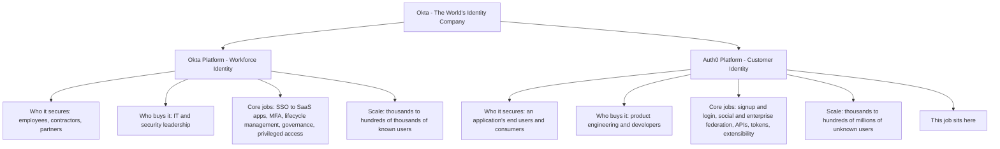
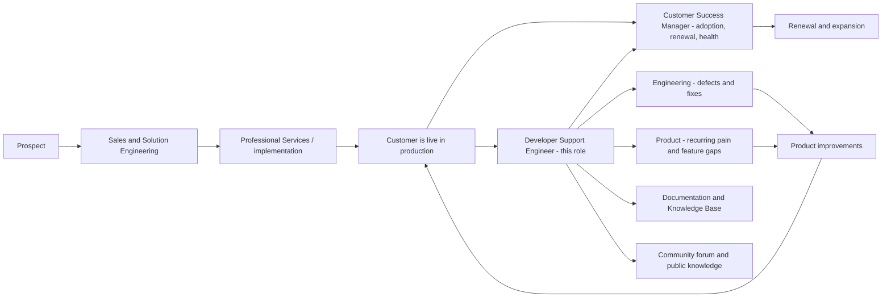
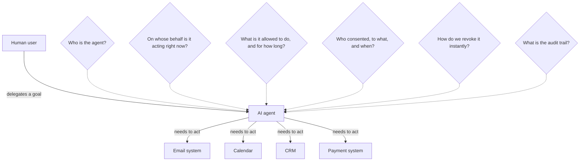
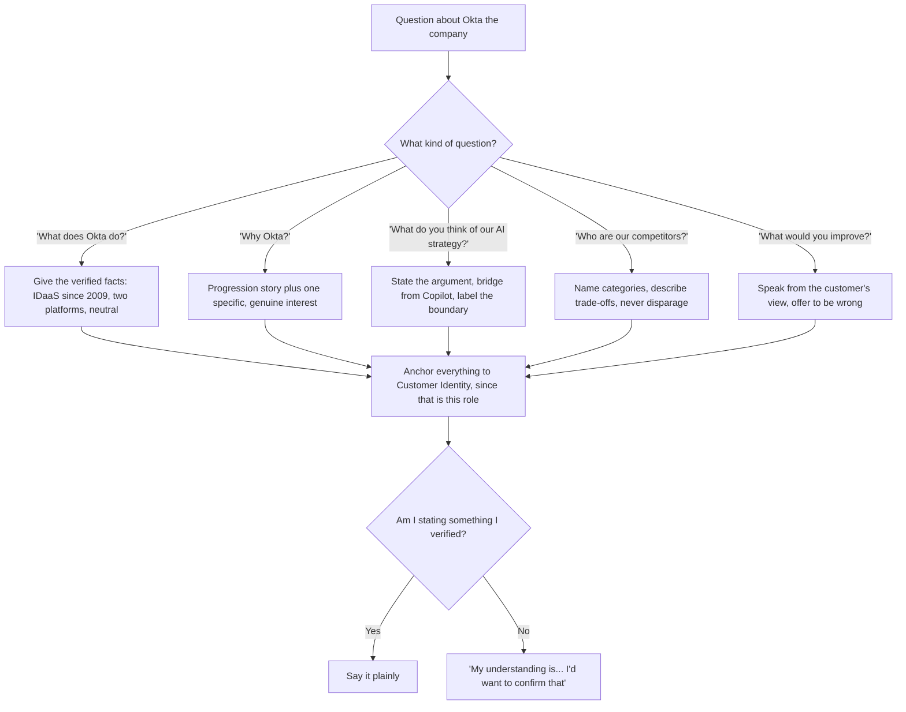

# Part 002 - Okta: Mission, Market, and the Identity-for-AI Thesis

> Section goal: Be able to answer "why Okta?" with specifics rather than flattery — know what the company sells, how it is organised, who its customers are, what its four stated values are, and how the AI language in the job description connects to a real product strategy. This is the difference between sounding interested and sounding informed.

Covers index item **002**. Maps to JD signals: *"Secure Every Identity, from AI to Human"*, *"Identity is the key to unlocking the potential of AI"*, *"builders and owners who operate with speed and urgency"*, *"career-defining work"*, *customer-obsessed attitude*, and *team player / cross-functional collaboration*.

---

## 1. Start From Zero: What Problem Does Okta Exist to Solve?

Imagine you are building an application. You need to answer two questions every single time someone uses it:

1. **Who is this?** (authentication)
2. **What are they allowed to do?** (authorization)

You *could* build that yourself: a users table, password hashing, a password reset email, multi-factor authentication, "sign in with Google", session management, breach detection, bot protection, audit logging, compliance evidence, and so on. Thousands of companies did exactly that, badly, and it became the single most common source of security breaches.

**Okta's business is that you should not build it yourself.** Okta runs identity as a service, so that an application delegates "who is this and what may they do" to a specialist.

> **Analogy.** Every office building needs a security desk: check IDs, issue badges, control which floors a badge opens, keep a log. You *could* hire and train your own guards for your one building. Or you could contract a specialist firm that does nothing but building security, has done it for thousands of buildings, and updates its practices the moment a new attack appears.
>
> **Where the analogy stops:** a security desk sees people physically. Okta sits in the middle of a *protocol conversation* between an application and a user's browser — which is why understanding those protocols (Parts 056–095) is the actual job.

### 🔍 Plain-English deep-dive: "Identity-as-a-Service" (IDaaS)

- **Identity** — *the set of facts a system believes about a person or machine, and the proof it accepts for those facts.* **Analogy:** a passport is not you; it is a trusted assertion about you that other parties agree to honour. **Why it matters:** everything in this job is about who issues assertions, who trusts them, and how that trust can break.
- **as-a-Service** — *someone else runs the software; you consume it over the network via APIs and standard protocols.* **Analogy:** you do not run a power station; you plug into a socket and pay for what you use. **Why it matters:** because it is a service, the failure surface includes networking, TLS, browser behavior, rate limits, and multi-tenancy — all of which land in your ticket queue.
- **IDaaS as a category** — Okta's founders are credited with creating this category in 2009. **Why it matters:** in an interview, saying "Okta pioneered IDaaS in 2009" is a specific, checkable fact. Saying "Okta is a leader in identity" is a slogan.

---

## 2. The Company in Verified Facts

Everything in this table was read from Okta's own site on **26 August 2026**. Keep it to facts you have personally seen, and refresh before an interview.

| Fact | Detail |
|---|---|
| Self-description | "The World's Identity Company™" |
| Stated vision | "To free everyone to safely use any technology" |
| Current positioning line | "Securing every identity. Human & machine." |
| Founded | 2009, by Todd McKinnon and Frederic Kerrest |
| Category created | Identity-as-a-Service (IDaaS) |
| Headquarters | San Francisco, with offices in 15 countries |
| Customer base claim | Two-thirds of the Fortune 100, major government agencies, and thousands of organisations |
| Two product platforms | **Okta Platform** (Workforce Identity) and **Auth0 Platform** (Customer Identity) |
| Company values | Love our customers · Always secure. Always on. · Build and own it · Drive what's next |
| Security programme | The **Okta Secure Identity Commitment** |
| Community / social arms | Okta for Good, Okta Ventures, sustainability commitments |
| Annual conference | Oktane |
| Separate status pages | Okta Platform status and Auth0 Platform status are published separately |

> **A detail worth noticing.** The URL `okta.com/products/customer-identity/` now resolves to the **Auth0 Platform**. That is not trivia — it tells you the Customer Identity product this JD refers to *is* Auth0, and that your product study (Parts 096–110) should be centred on Auth0 documentation, not Okta Workforce documentation. Being able to say that shows you actually looked.

---

## 3. The Two Platforms

This is the single most important structural fact about Okta, and the most common thing candidates get muddled.

| Dimension | Okta Platform (Workforce) | Auth0 Platform (Customer Identity) |
|---|---|---|
| The user is | Someone you employ or contract | Someone who signs up to your product |
| Relationship | Pre-existing, HR-driven | Self-service, anonymous until they register |
| Provisioning | Central admin creates the account | The user creates their own account |
| Primary interface | Admin console, policy configuration | **APIs, SDKs, and code** |
| Typical buyer conversation | Compliance, governance, joiner-mover-leaver | Conversion rate, developer velocity, user experience |
| Branding expectations | Corporate, standardised | Fully customised to the customer's brand |
| Consent and privacy | Employment context | Consumer regulation: GDPR, DPDP, CCPA |
| Peak load pattern | Predictable, business hours | Spiky — marketing campaigns, product launches |
| Abuse pressure | Insider risk, phishing | Credential stuffing, bot signup, fake accounts at massive scale |
| **Who you support** | IT administrators | **Developers** |

### 🔍 Plain-English deep-dive: why "customer identity" is genuinely harder in some ways

Workforce identity has a comforting property: **you know your users in advance**. HR creates them. There is an authoritative directory.

Customer identity has none of that. A stranger arrives at 3 a.m., may be a real customer, a bot, a credential-stuffing script, or a fraudster. You must let the real ones in with as little friction as possible (because friction destroys signup conversion, which is revenue) while blocking the rest.

**Analogy:** workforce identity is a members-only club with a guest list. Customer identity is a busy shop on a public street — you want everyone to walk in easily, but you also need to spot the shoplifters without frisking every customer.

**Why it matters for you:** it explains why Customer Identity products invest so heavily in bot detection, breached-password detection, adaptive MFA, and rate limiting (Part 108) — and why "legitimate user blocked by attack protection" is a recurring support case with a real business cost attached.

> 💡 **Tie-in to your background:** your Microsoft experience is almost entirely **workforce-shaped** — enterprise tenants, AD, Group Policy, Entra ID, admin-provisioned users. That is a genuine advantage for the *enterprise connection* half of Customer Identity (Part 101), because B2B customers federate to exactly the directories you already know. Be explicit about this in the interview: *"My background is workforce-shaped, which maps directly onto the enterprise-connection side. The consumer-scale side — social login, progressive signup, bot pressure — is new to me, and that's where I've focused my lab work."*

---

## 4. Where This Role Sits in the Company

**Read the JD against this diagram.** It says: *"Support and maintain customers who have implemented the Customer Identity SaaS solution."* The word **"implemented"** places you firmly *after* onboarding. You are not doing greenfield implementation; you are keeping live integrations working and helping developers extend them.

It also says you *"serve as internal and external point of contact"* and *"collaborate with other departments"* — which is every arrow leaving the Support box in that diagram.

---

## 5. The Four Company Values, and How to Use Them

Okta publishes four values. In a values-based interview round, these are very likely to be the scoring rubric. Prepare one true story for each.

| Okta value | What it is asking for | Your honest evidence |
|---|---|---|
| **Love our customers** | Customer outcomes over internal convenience | Sustained 4.75+ Enterprise and 4.85+ SMB CSAT; 100+ recognitions for business-critical escalation handling; customer advocacy during CRITSITs |
| **Always secure. Always on.** | Treating reliability and security as mission-critical, not optional | Owning high-priority production incidents where the service was down for an enterprise customer; disciplined evidence handling |
| **Build and own it** | Ownership without waiting for permission | End-to-end escalation ownership; authoring KB articles and troubleshooting guides nobody assigned; mentoring and onboarding engineers; Aspire Leadership Council contribution |
| **Drive what's next** | Improving the system, not just closing tickets | Using CSAT, backlog health, case quality and escalation trends to identify operational gaps and recommend improvements; MBA in Business Analytics; the Technical Advisor programme |

Notice how closely the JD's own language echoes these: *"We are looking for builders and owners"* is **Build and own it**. *"Customer-obsessed attitude — a customer advocate, always going the extra mile"* is **Love our customers**. *"Continuous growth — permanently look for areas of improvement"* is **Drive what's next**. That is not a coincidence, and pointing it out in an interview shows you read carefully.

### 🔍 Plain-English deep-dive: using values without sounding like a parrot

The wrong way: *"I really align with your value of Build and Own It."* This is worthless — anyone can say it.

The right way: **tell the story first, name the value last, and only if it fits naturally.**

> *"Nobody asked me to do this, but I noticed the same class of sync-client escalation kept reaching my queue with the frontline having already spent two days on it. So I wrote a troubleshooting guide and ran a case-bash session on it. The escalation volume for that pattern dropped, and more importantly the frontline engineers stopped feeling stuck. I gather that maps to what you call 'build and own it', but honestly I did it because the repetition was frustrating for everyone."*

The last clause — *"honestly I did it because…"* — is what makes it credible. Real motivation beats performed alignment.

---

## 6. The Identity-for-AI Thesis

The JD opens with strong AI language:

> *"Identity is the key to unlocking the potential of AI. Okta secures AI by building the trusted, neutral infrastructure that enables organizations to safely embrace this new era."*

You must be able to engage with this seriously. Here is the argument, built from zero.

### The problem in plain English

Traditional identity assumes a **human** at a keyboard, present in real time, who can be shown a consent screen and asked to approve something.

An **AI agent** breaks all three assumptions. It is software that acts *on behalf of* a user, often *without the user present*, potentially across *many different systems*, and possibly for a long time.

That creates hard questions that ordinary login does not answer:

| Question | Why classic login does not answer it | Which identity concept does |
|---|---|---|
| Who is the agent itself? | Agents are not people and have no password | Machine identity, client credentials (Part 060) |
| On whose behalf is it acting? | A bearer token names a subject, but not a *chain* | Delegation and token exchange (Part 067) |
| What may it do? | Coarse scopes are too blunt for "read this one document" | Fine-grained authorization (Parts 051, 109) |
| For how long? | Long-lived tokens are exactly what you do not want here | Lifetime, rotation, revocation (Part 045) |
| Who consented? | Consent screens assume a human is present | Consent and asynchronous approval (Parts 052, 062) |
| Can we revoke instantly? | Stateless tokens are hard to revoke mid-life | Introspection and sender-constrained tokens (Parts 045, 068) |
| What happened? | Needs a per-action audit trail, not a login record | Audit logs and log streams (Part 107) |

**So the thesis is:** as software starts acting autonomously on people's behalf, the *identity layer* is the only place you can consistently answer "who, on whose behalf, allowed to do what, for how long, and revocable how". That is a genuine architectural argument, not marketing.

Auth0's own documentation lists **Auth0 for AI Agents** as one of three product areas alongside Authentication and Fine-Grained Authorization — so this is a shipped product direction, not a slide.

### How to talk about it honestly

You have real, relevant AI exposure — Copilot support, Copilot Studio agent work, AI-102 and AI-900 certifications. That is a genuine bridge. But be careful about the boundary.

| Safe to say | Not safe to say |
|---|---|
| "I've supported Copilot in production and built agents in Copilot Studio, so I've seen first-hand that the hard questions are permissions and data boundaries, not the model." | "I have experience with agent identity architectures." |
| "Reading Okta's positioning, the argument I find compelling is that delegation chains and revocation are identity problems, and there isn't another layer that can answer them consistently." | Asserting specific Okta AI product capabilities you have not verified. |
| "I'd want to understand how much of the current ticket volume is agent-related versus classic web and mobile integrations." | Pretending to know the answer to that. |

> 💡 **Tie-in to your background:** the single best sentence you have here is *"the hard part of Copilot support was never the model — it was permissions, tenant boundaries, and what the agent could see."* That is a real observation from real production work, and it lands exactly on Okta's thesis. It is worth rehearsing.

---

## 7. The Competitive and Market Landscape

You do not need to be a market analyst, but "who else does this?" is a fair interview question and blanking on it looks incurious.

| Category | Representative players | How to describe the difference honestly |
|---|---|---|
| Independent identity specialists | Okta / Auth0, Ping Identity, CyberArk (privileged access), SailPoint (governance) | Vendor-neutral; integrate with everything rather than favouring one cloud |
| Cloud-platform identity | Microsoft Entra ID, Google Cloud Identity, AWS Cognito / IAM Identity Center | Deeply integrated with their own ecosystem; strongest when you are already all-in on that cloud |
| Developer-first CIAM | Auth0, plus a range of newer developer-focused providers | Optimised for time-to-first-login and SDK experience |
| Open-source / self-hosted | Keycloak, Ory, and similar | No licence cost, but you operate it, scale it, patch it, and carry the security burden |

**The word to remember from Okta's own material is "neutral."** The JD says Okta builds *"the trusted, neutral infrastructure."* That is a deliberate contrast with cloud-platform identity: Okta's pitch is that it does not care whose cloud, whose apps, or whose AI models you use.

### 🔍 Plain-English deep-dive: why "neutral" is a real technical property, not just marketing

If your identity provider is owned by the same company as your productivity suite, your cloud, and your AI models, then the *easy* integrations are all inside that family and the *hard* ones are outside it. Neutrality means the vendor's incentive is to make **every** integration good.

Practically, for you as a support engineer, neutrality shows up as: a very large catalogue of pre-built integrations, first-class support for open standards rather than proprietary extensions, and customers who are deliberately multi-cloud. **Analogy:** an independent financial adviser versus one employed by a single bank — both can be competent, but only one has no product to push. **Where it stops:** neutrality does not make integrations automatically work; it just means nobody is being deliberately disadvantaged.

---

## 8. Failure Modes When Discussing the Company

| Failure mode | Example | Why it hurts | Correction |
|---|---|---|---|
| Confusing the two platforms | Describing admin-console SSO configuration when asked about Customer Identity | Signals you did not read which product the role supports | Anchor on: this role = Customer Identity = Auth0 Platform |
| Reciting the values as a list | "I align with all four of your values" | Empty; unscoreable | One story per value, value named last |
| Overclaiming AI knowledge | "I've worked on agent identity" | Instantly probed and exposed | Bridge from Copilot support, label the boundary |
| Repeating marketing verbatim | "Okta is the trusted, neutral infrastructure for the age of AI" | Sounds like you read a homepage, which you did | Explain *why* neutrality matters technically (§7) |
| Stale facts | Quoting a product name that has been renamed | Identity vendors rename things often | Re-verify names within 48 hours of the interview |
| Trashing competitors | "Entra ID is a mess" | You will support customers federating *to* Entra ID daily | Describe trade-offs, never disparage |
| No opinion at all | "I'm sure it's a great company" | Reads as low interest | Have one specific thing you find genuinely interesting |

---

## 9. Troubleshooting Decision Tree: Handling a Company Question On the Spot

**Worked example.** *"What would you improve about our product?"* — a trap if you bluff, an opportunity if you are honest:

> *"I've only used the free tier, so I'd be careful about generalising. But one thing I noticed while learning: the gap between the quickstart working in five minutes and understanding *why* it worked is quite wide. When I hand-rolled the flow instead of using the SDK, I hit things the quickstart had quietly handled for me — PKCE, state, token caching. From a support perspective I'd guess a chunk of ticket volume comes from developers who succeeded with the quickstart, then diverged from it and lost the invisible parts. If that's true, it's a documentation and diagnostics opportunity rather than a product flaw."*

That answer is honest about its limits, grounded in real hands-on experience, and demonstrates support instinct.

---

## 10. Lab: The Company Brief

**Purpose.** Produce a one-page, dated, verified company brief you re-read the night before each round.

**Prerequisites.** A browser and a text editor. Public web pages only. No accounts required.

**Steps.**

1. Open Okta's company page, the Okta Platform product page, and the Auth0 Platform site. Read the top of each.
2. Open the Auth0 documentation home and note the listed product areas.
3. Open both status pages and read the most recent entries. This tells you what real incidents look like and what the customer sees during one.
4. Open the Auth0 community forum and skim the ten most recent unanswered questions. Write down the three most common *categories* of problem.
5. Create `okta-prep/artifacts/company-brief.md` with these sections:
   - **Verified facts** (each with the date you read it)
   - **Two platforms** — a three-line description of each
   - **Four values** — with your one true story per value, in one line each
   - **AI thesis** — the argument in three sentences, plus your honest boundary statement
   - **Landscape** — four categories and one differentiator each
   - **My genuine interest** — two sentences on what actually interests you, in your own words
   - **Questions I want to ask** — three questions for the interviewer
   - **Revalidate by** — a date 48 hours before your interview
6. Read the "genuine interest" section aloud. If it sounds like marketing copy, rewrite it until it sounds like you.

**Expected evidence.** One Markdown file, roughly one page, where every factual claim carries the date you personally verified it.

**Validation rubric.**

| Check | Pass condition |
|---|---|
| Facts are dated | Every fact line has an access date |
| Platforms are distinguished | You can state which platform this role supports without hesitating |
| Values have stories | Four one-line true stories, no invented ones |
| AI is bounded | The boundary sentence is written down verbatim |
| Forum reading done | Three real problem categories recorded from the community forum |
| Interest is authentic | Reading it aloud does not make you cringe |

**Cleanup and privacy.** Public information only. Do not copy long passages verbatim into your notes — paraphrase, so that you can speak it naturally rather than recite it. Do not include anything confidential from your current employer.

---

## 11. JD Mapping

| Supplied JD signal | How this Part supports it |
|---|---|
| "Secure Every Identity, from AI to Human" | §6 turns the tagline into an argument you can defend and extend |
| "Identity is the key to unlocking the potential of AI" | §6's table shows exactly which identity concept answers each agent question |
| "trusted, neutral infrastructure" | §7 explains why neutrality is a technical property, not a slogan |
| "builders and owners who operate with speed and urgency" | §5 maps this directly to the published value **Build and own it** |
| "This is an opportunity to do career-defining work" | §4 shows where the role sits and how much surface area it touches |
| Customer-obsessed attitude | §5 maps this to **Love our customers** with quantified CSAT evidence |
| Support the Customer Identity SaaS solution | §3 makes the platform boundary unambiguous |
| Collaborate with other departments | §4 names every internal team you will interface with |
| Immersive in-person onboarding, global community | §2 records the 15-country footprint and Bengaluru's place in it |

---

## 12. Candidate Honesty Note

- **Production transfer:** Copilot support and Copilot Studio agent building give you a genuine, first-hand observation about AI permissions and data boundaries. Workforce-shaped enterprise identity experience maps honestly onto the enterprise-connection side of Customer Identity.
- **Learned architecture:** everything in §§2–7 is read from public material. Present it as "what I read and understood", never as insider knowledge.
- **No direct experience:** Okta's internal organisation, actual ticket volumes, team structure, escalation paths, tooling, and roadmap. If asked, say so and turn it into a question.
- **Currency risk:** product names and positioning in identity change frequently. Every fact here is dated 26 August 2026 and must be re-verified before an interview.
- **Do not disparage Microsoft.** You are interviewing at a company whose customers federate to Entra ID constantly, and gracelessness about a former employer is a red flag everywhere.

---

## 13. Official Source Anchors

Accessed **26 August 2026**.

| Source | What was verified |
|---|---|
| Okta company page (`okta.com/company/`) | "The World's Identity Company™"; vision "to free everyone to safely use any technology"; "Securing every identity. Human & machine."; founded 2009 by Todd McKinnon and Frederic Kerrest; IDaaS category creation; two-thirds of the Fortune 100; San Francisco HQ with offices in 15 countries; the four values; the Okta Secure Identity Commitment; Okta for Good, Okta Ventures, sustainability; Oktane |
| Okta product navigation | Two platforms: **Okta Platform** (Workforce Identity) and **Auth0 Platform** (Customer Identity) |
| `okta.com/products/customer-identity/` | Redirects to the Auth0 Platform, confirming Customer Identity = Auth0 |
| Auth0 documentation home (`auth0.com/docs`) | Sections: Documentation, API References, SDKs, Quickstarts. Product areas listed: **Authentication**, **Fine-Grained Authorization**, **Auth0 for AI Agents**. Support surfaces: community forum, support site, status page |
| Okta developer documentation (`developer.okta.com/docs/concepts/`) | Featured concepts include Okta Identity Engine, OAuth 2.0 and OpenID Connect, redirect versus embedded authentication, IAM overview, Interaction Code grant, policies, multi-tenancy |
| Status pages | Okta Platform and Auth0 Platform publish separate status pages |
| The supplied job description | All AI, values, and culture language quoted in this Part |

**Revalidate after 26 August 2026:** all product names, platform branding, the AI product line-up, and any customer-count figures.

---

## ⭐ Likely Interview Questions for This Section

### Q1. "What does Okta do?"
> *Model answer:* "Okta is an identity and access management company — it runs identity as a service so that organisations don't have to build authentication and authorization themselves. The founders created the Identity-as-a-Service category back in 2009. Today it's structured as two platforms: the Okta Platform for Workforce Identity, which secures employees, contractors and partners; and the Auth0 Platform for Customer Identity, which secures the end users of a company's own applications. This role sits on the Customer Identity side, which is developer-facing — the customers are engineers integrating APIs and SDKs, not IT admins configuring a console."

### Q2. "What's the difference between Workforce Identity and Customer Identity?"
> *Model answer:* "The fundamental difference is whether you know your users in advance. Workforce identity has an authoritative source — HR creates the user, IT provisions the account, and the whole model is joiner-mover-leaver with governance and compliance on top. Customer identity has strangers arriving self-service, at unpredictable scale, where you cannot tell a real customer from a bot until you look. That drives everything downstream: workforce optimises for control and governance, customer identity optimises for conversion and developer velocity while absorbing enormous abuse pressure. And the buyer differs — IT and security for workforce, product engineering for customer identity."

### Q3. "Why do you want to work at Okta specifically?"
> *Model answer:* "Two reasons, one about the domain and one about the company. On the domain: identity was consistently the layer I found most interesting in my escalation work — the Active Directory, LDAP, Group Policy and Entra ID cases were the ones I chased hardest. Moving to a company where identity *is* the product is a progression, not a pivot. On the company: the thing that actually interests me is the neutrality position. Okta doesn't own the cloud, the apps, or the models, so its incentive is to make every integration good rather than favouring one ecosystem. From a support perspective that means genuinely heterogeneous customer environments, which is the work I enjoy."

### Q4. "Our JD says identity is the key to unlocking AI. What do you make of that?"
> *Model answer:* "I think it's a real architectural argument rather than positioning. Traditional login assumes a human at a keyboard who can be shown a consent screen. An agent breaks all of that — it acts on someone's behalf, often when they're not present, across multiple systems, for an extended period. That raises questions classic authentication doesn't answer: who is the agent, on whose behalf is it acting right now, what precisely may it do, for how long, who consented, how do we revoke instantly, and what's the audit trail. Every one of those is an identity question — delegation, fine-grained authorization, token lifetime and revocation, consent, audit. There isn't another layer that can answer them consistently. I'd add that my own experience supporting Copilot backs this up: the hard problems were never the model, they were permissions and data boundaries."

### Q5. "Who do you see as Okta's competition?"
> *Model answer:* "I'd group them into four. Cloud-platform identity — Entra ID, Google, AWS Cognito — which is very strong if you're already committed to that cloud. Independent identity specialists like Ping, plus adjacent players in governance and privileged access. Developer-first CIAM providers competing on time-to-first-login and SDK quality. And open-source options like Keycloak, where there's no licence cost but you carry the operational and security burden yourself. Okta's stated differentiator is neutrality — not being tied to one cloud or app ecosystem — which matters most for customers who are deliberately multi-vendor. I'd rather describe those as trade-offs than rank them; I'll be supporting customers who federate to several of those every day."

### Q6. "Which of our values resonates with you, and why?"
> *Model answer:* Tell a story, then name the value. "There's one that maps to something I actually did. The same class of escalation kept reaching my queue after the frontline had already burned two days on it. Nobody asked me to fix that, but it was frustrating for everyone, so I wrote a troubleshooting guide and ran a case-bash on it. Volume for that pattern dropped and the frontline stopped feeling stuck. I gather that's close to what you call 'build and own it' — though honestly I did it because the repetition was annoying, not because it was in my objectives. That's usually why I do things."

### Q7. "What would you want to improve about our product or our support experience?"
> *Model answer:* "I'd be careful generalising from free-tier use. But one thing I noticed learning the platform: the distance between the quickstart working in five minutes and understanding *why* it worked is wide. When I hand-rolled the flow instead of using the SDK, I hit everything the quickstart had quietly handled — PKCE, `state`, token caching, renewal. My hypothesis is that a meaningful share of ticket volume comes from developers who succeeded with the quickstart, then diverged and lost the invisible parts. If that's true it's a documentation and diagnostics opportunity rather than a product flaw. I'd genuinely like to know whether the ticket data supports that, because I'd be wrong quite happily."

### Q8. "You're coming from Microsoft. Isn't Entra ID a competitor? How do you feel about that?"
> *Model answer:* "It's a competitor in some deals and an integration partner in most support cases, and both are fine. Practically, a large share of Customer Identity's B2B customers will federate to Entra ID or AD FS as an enterprise connection — so my Entra, Active Directory and LDAP background is directly useful rather than awkward. I've got no interest in disparaging Microsoft; I had a good five years there and I'll be troubleshooting against their identity stack regularly. If anything, knowing how the other side behaves — Conditional Access, hybrid sync, token quirks — makes me faster on exactly the tickets that are hardest to diagnose from one side only."

---

## 🧠 30-Second Memory Hooks

- **Okta = "The World's Identity Company"**, founded **2009**, created the **IDaaS** category.
- **Two platforms:** Okta Platform = **Workforce**; Auth0 Platform = **Customer Identity**. *This job is Auth0.*
- **Four values:** Love our customers · Always secure. Always on. · Build and own it · Drive what's next.
- **Workforce vs Customer** = *you know your users* vs *strangers arrive at 3 a.m.*
- **Customer Identity's buyer is a developer**, so the product surface is APIs and SDKs.
- **Neutral** = no cloud, app suite, or model of its own to favour. That is a real technical property.
- **AI thesis in one line:** agents act on your behalf when you are not there, so *who, for whom, allowed what, how long, revoke how, audit where* all become identity questions.
- **Your best AI sentence:** *"With Copilot, the hard part was never the model — it was permissions and data boundaries."*
- **Never disparage Entra ID.** You will troubleshoot it weekly.

---

## ✅ Completion Checklist

- [ ] **Knowledge:** I can state the two platforms, which one this role supports, the four values, and the AI thesis without notes.
- [ ] **Lab artifact:** `company-brief.md` exists, every fact is dated, and it includes three real problem categories from the community forum.
- [ ] **Spoken:** I have said my "why Okta" answer aloud and it contains at least one specific, non-marketing observation.
- [ ] **Honesty check:** my AI boundary sentence is written down, and nothing in my brief claims insider knowledge.
- [ ] **Source check:** I personally opened the Okta company page, both platform pages, the Auth0 docs home, both status pages, and the community forum.

---

*Next suggested section:* **[Part 003 - Customer Identity versus Workforce Identity](Part-003-customer-identity-versus-workforce-identity.md)** — the platform split introduced here deserves a full treatment, because almost every product decision you will explain to a customer follows from it.
