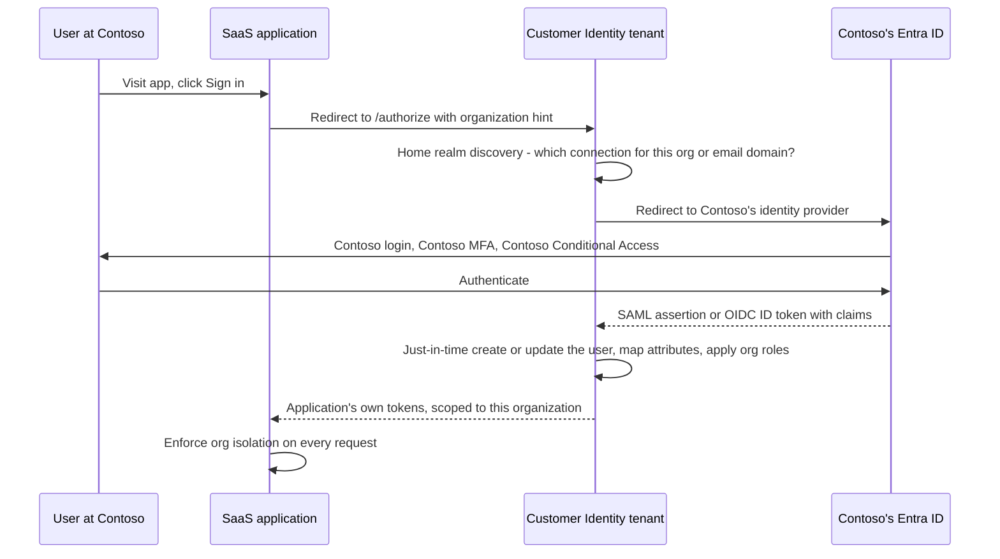
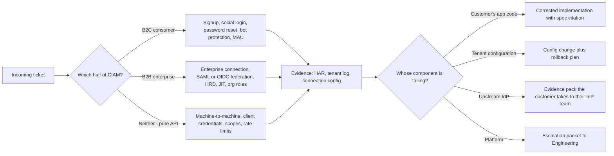
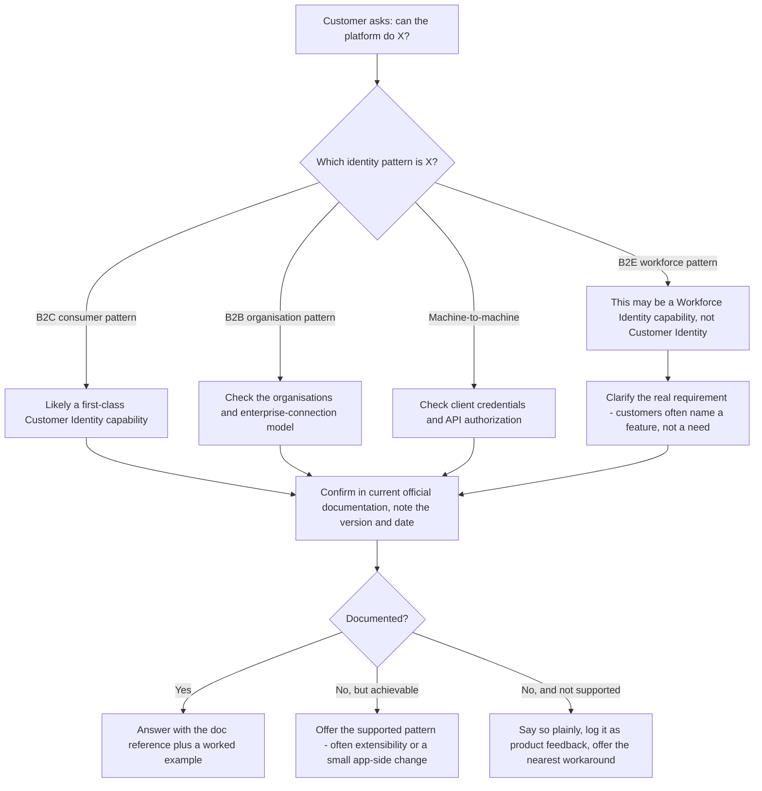

# Part 003 - Customer Identity versus Workforce Identity

> Section goal: Understand deeply — not just as a slogan — why customer identity and workforce identity are different engineering problems, so that when a customer asks "can I do X?", you can reason from the model rather than searching for a feature list. Almost every product decision, limit, and support case you will meet follows from this split.

Covers index item **003**. Maps to JD signals: *"Support and maintain customers who have implemented the Customer Identity SaaS solution"*, *knowledge of common architectures*, *authentication and authorization concepts*, and *business and technical analysis skills*.

---

## 1. Start From Zero: Three Kinds of "User"

The identity industry uses three shorthand letters. Learn them now; they appear constantly.

| Shorthand | Expands to | Who the end user is | Everyday example |
|---|---|---|---|
| **B2E** | Business-to-Employee | Your own staff and contractors | An employee signing into the company expense tool |
| **B2C** | Business-to-Consumer | Members of the public who sign up to your product | Someone creating an account on a retail app |
| **B2B** | Business-to-Business | Employees *of your customer companies* using your product | A partner's staff signing into your supplier portal |

**Workforce Identity** solves **B2E**.
**Customer Identity (CIAM)** solves **B2C and B2B** — and B2B is the half where your prior background is directly valuable.

> **Analogy.** Think of a hotel.
> - **B2E** is the staff entrance: badge-controlled, everyone pre-registered by HR, the list is authoritative and small.
> - **B2C** is the main lobby: anyone can walk in and ask for a room, you want the experience to be smooth and welcoming, and you need a way to spot the person casing the place.
> - **B2B** is the conference wing: another company has booked it, they bring their own delegate list, and you honour *their* badges rather than issuing your own.
>
> **Where the analogy stops:** in a hotel these are physically separate doors. In software, one identity platform must handle all three patterns simultaneously, often for the same application.

### 🔍 Plain-English deep-dive: CIAM

- **CIAM** — *Customer Identity and Access Management.* **Analogy:** the front-of-house identity system, versus IAM which is the back-of-house one. **Why it matters:** the acronym appears constantly in documentation and job descriptions; using it correctly signals fluency.
- **The defining constraint of CIAM is that identity is on the revenue path.** In workforce identity, a slow login annoys an employee who logs in anyway because it is their job. In CIAM, a slow or confusing login means the customer *leaves* and the company loses the sale. **Why it matters:** it explains why CIAM products fight so hard over signup friction, and why "attack protection blocked a legitimate user" is treated as a serious incident rather than an acceptable trade-off.

---

## 2. The Structural Comparison

```mermaid
flowchart TD
    subgraph WF["Workforce Identity - B2E"]
        HR["HR system is the source of truth"] --> Prov["Account provisioned centrally"]
        Prov --> Dir["Corporate directory"]
        Dir --> Pol["Central policy: MFA, device, location"]
        Pol --> Apps["SSO into SaaS applications"]
        Apps --> Gov["Access reviews, certification, governance"]
        Gov --> Deprov["Deprovision on exit"]
    end
    subgraph CI["Customer Identity - B2C and B2B"]
        Stranger["Anonymous visitor"] --> Signup["Self-service signup or social login"]
        Signup --> Verify["Email or phone verification"]
        Verify --> Profile["Progressive profile enrichment"]
        Profile --> Risk["Risk signals: bot, breached password, velocity"]
        Risk --> Session["Session and tokens issued to the app"]
        Session --> APIs["Customer's own APIs authorize on those tokens"]
        APIs --> Delete["Self-service deletion and privacy rights"]
    end
```

| Dimension | Workforce (B2E) | Customer Identity (B2C / B2B) |
|---|---|---|
| **Source of truth** | HR system → directory | The user themselves, or their employer's IdP (B2B) |
| **How accounts appear** | Provisioned by an admin | Self-registered, socially federated, or JIT-created from an enterprise IdP |
| **Population size** | Hundreds to hundreds of thousands | Thousands to hundreds of millions |
| **Growth pattern** | Slow, predictable, headcount-driven | Spiky — a campaign or launch can 10× signups in an hour |
| **Cost model** | Typically per user | Typically **monthly active users (MAU)** or similar activity-based measure |
| **Who configures it** | IT administrator in a console | **A developer, in code and configuration-as-code** |
| **Primary interface** | Admin UI + policy | **APIs, SDKs, hosted login pages, extensibility hooks** |
| **Branding** | Corporate, uniform | Fully white-labelled to the customer's brand |
| **Login UX tolerance** | Low friction preferred, high friction survivable | Friction is measured in lost revenue |
| **Authentication factors** | Enterprise MFA, device trust, certificates | Passwords, social, magic links, OTP, passkeys |
| **Privacy regime** | Employment contract | Consumer law: GDPR, India's DPDP Act, CCPA — consent, portability, erasure |
| **Threat profile** | Phishing, insider risk, privilege escalation | Credential stuffing, bot signup, fake accounts, account takeover, fraud, scraping |
| **Availability expectation** | Very high | **Extreme** — downtime means nobody can buy anything |
| **Governance features** | Access certification, SoD, privileged access | Consent records, data-subject requests, retention policies |
| **Typical support caller** | Identity admin | **Application developer** |

### 🔍 Plain-English deep-dive: why the pricing model changes the engineering

Workforce identity charges per user because the user population is stable and known. CIAM usually charges by **monthly active users** because a consumer product may have ten million registered accounts of whom only four hundred thousand log in each month.

**Why this matters for support:** MAU-based pricing means customers care intensely about *what counts as an activity*. Questions like "does a silent token refresh count as an active user?" or "does a machine-to-machine call count?" are commercial questions dressed as technical ones. You will get them. The correct move is to answer the *technical* mechanics precisely and route the *commercial* interpretation to the account team rather than improvising — a distinction the JD hints at when it mentions "technical and non-technical customer issues."

**Analogy:** a gym charging per member versus per visit. The second one makes members ask exactly what counts as a visit. **Where it stops:** unlike a gym, the customer cannot easily observe the count themselves, which is why they ask you.

---

## 3. The B2B Middle Ground — Where Your Background Pays Off

B2B customer identity is genuinely a hybrid, and it is the fastest-growing and most confusing part of CIAM.

Picture a company selling project-management software to other businesses. Each business customer wants:

- Their employees to sign in with **their own corporate credentials** (Entra ID, AD FS, Okta, Google Workspace, a SAML IdP).
- Their own **branding** on the login page.
- Their own **admin** to invite and remove users, without contacting the vendor.
- Their data **isolated** from every other customer.
- Their own **policy** — for example, MFA required for their users but not others.

> 💡 **Tie-in to your background:** every box on the right of that diagram is something you already know. Entra ID, Conditional Access, SAML assertions, attribute mapping, AD FS — these are the *upstream* side, and they are exactly where enterprise-connection tickets get stuck. Most CIAM support engineers come from a consumer-web background and find that half unfamiliar. **You have the opposite profile, and that is a differentiator worth naming explicitly in the interview.**

### 🔍 Plain-English deep-dive: "home realm discovery"

- **Realm** — *the domain of authority a user belongs to.* In practice: "which identity provider should authenticate this person?"
- **Home realm discovery (HRD)** — *the step where the system decides which upstream identity provider to send the user to.* **Analogy:** a receptionist at a shared office building asking "which company are you visiting?" before deciding which lift to send you to.
- **How it is decided in practice** — usually by (a) the email domain the user types, (b) an explicit organisation identifier in the URL or the authorization request, (c) a subdomain such as `contoso.app.example.com`, or (d) the user picking from a list.
- **Why it matters:** "the user got sent to the wrong identity provider" and "the user got sent to the generic login instead of their company's SSO" are extremely common B2B tickets, and both are HRD problems. Knowing the term lets you diagnose in one question instead of five.

---

## 4. What Changes for *You*, the Support Engineer

This is the practical payoff of the whole comparison.

| Because Customer Identity is… | Your support work looks like… |
|---|---|
| Developer-facing | Reading code, writing corrected snippets, citing specifications |
| API- and SDK-driven | Reproducing with curl and Postman, checking SDK versions and changelogs |
| Browser-hosted | HAR captures, cookie behavior, CORS, redirect chains |
| Multi-protocol | Decoding JWTs, SAML assertions, and discovery documents |
| Federated to enterprise IdPs | Debugging *someone else's* Entra ID, AD FS, or SAML provider through its output |
| Extensible with custom code | Debugging the *customer's* code running inside the identity pipeline (Part 103) |
| Under constant automated attack | Distinguishing "blocked by protection" from "genuinely broken" (Part 108) |
| Rate limited and multi-tenant | Explaining 429s, quotas, and noisy-neighbour perception (Part 110) |
| On the revenue path | Treating "login is slow" as a severity conversation, not a curiosity |
| Privacy regulated | Being careful what evidence you ask for and how you handle it (Part 006) |

**Fix3 deserves special attention.** In B2B federation, the broken component is frequently *not yours and not the customer's app* — it is the customer's own identity provider, run by a different team inside the customer's company. Your deliverable is then an **evidence pack**: the exact assertion received, the exact claim that was missing or malformed, and the specification reference showing what was expected. You are arming your customer to have a conversation with their own IT department.

> 💡 **Tie-in to your background:** this is precisely the "technical point of contact between customers, Customer IT teams, Delivery Partners, Engineering, Product Groups, and Vendors" role your CV already describes. Same skill, new protocol.

---

## 5. Data Model Differences That Cause Real Tickets

| Concept | Workforce assumption | Customer Identity reality | The ticket it causes |
|---|---|---|---|
| **Unique identifier** | Employee ID or UPN, stable forever | A user may have several identities (password + Google + Entra) that must be *linked* | "Why do I have two accounts?" → account linking (Part 105) |
| **Email address** | Assigned, verified, unique | User-supplied, may be unverified, may change, may be shared | "Two users have the same email" |
| **Username** | Corporate convention | Optional, may not exist at all | "Login by username isn't working" |
| **Profile attributes** | Defined by HR schema | Arbitrary, per-application, growing over time | Metadata size limits, token bloat |
| **Groups** | Central AD/Entra groups | Roles per application, or organisation membership | Role mapping and claim mapping questions |
| **Deletion** | Rare; usually disable | A legal right the user can exercise at any time | Data-subject request handling |
| **Consent** | Implicit in employment | Explicit, recorded, revocable | Consent screen and scope questions |
| **Password** | Corporate policy, may not even exist (certificate/Windows Hello) | Often the primary factor, plus breach exposure | Breached-password blocks, migration from a legacy store |

### 🔍 Plain-English deep-dive: why "one human, many identities" is the hardest CIAM data problem

A single person might sign up with a password in January, then click "Sign in with Google" in March using the same email address, then their employer buys an enterprise plan in June and they arrive through Entra ID.

Are those one user or three?

- If you treat them as **three**, the user loses their history and says "your app deleted my data".
- If you auto-merge them into **one** based on matching email, you have created a security hole: an attacker who can register an unverified account with a victim's email address could get merged into the victim's account.

The safe rule is: **only ever link identities on a *verified* email, and prefer explicit, authenticated user confirmation.** This is why account linking is deliberately not automatic by default, and why "why weren't my accounts merged?" is a recurring ticket with a *good* answer.

**Analogy:** two library cards with the same name. Merging them because the names match would let anyone claim someone else's borrowing history. You need proof they are the same person. **Where it stops:** libraries can ask for photo ID in person; you only have protocol evidence.

---

## 6. Failure Modes and Misconceptions

| Misconception | Why it is wrong | The correct framing |
|---|---|---|
| "CIAM is just workforce identity with a nicer login page" | The data model, threat profile, scale, cost model, and buyer are all different | Different problem, shared protocols |
| "B2B is just B2C with bigger customers" | B2B requires organisation modelling, per-org policy, per-org IdP, and isolation | B2B is a hybrid with its own object model (Part 104) |
| "Social login is less secure" | It offloads credential handling to a large provider; the risks are different (account takeover upstream, unverified email), not uniformly worse | Discuss specific risks, not vibes |
| "Just merge accounts with the same email" | Creates an account-takeover path via unverified email | Link only on verified identifiers, with user confirmation |
| "Attack protection blocking a user is a bug" | Often it is the product working as designed against a real signal | Investigate the *signal* first (Part 108) |
| "Rate limits mean the platform is slow" | They exist to protect all tenants; the fix is usually client-side design | Explain the shared-service model and correct retry behavior |
| "The customer's IdP is our problem to fix" | You cannot change someone else's Entra ID tenant | Produce an evidence pack the customer takes to their IT team |
| "MAU is a technical setting" | It is a commercial term with a technical definition | Answer mechanics; route commercial interpretation to the account team |

---

## 7. Troubleshooting Decision Tree: "Can I Do X?" Questions

A large share of developer-support tickets are not failures at all — they are capability questions. Reason from the model.

**Worked example.** *"Can we let each of our business customers enforce their own MFA policy?"*

1. **Which pattern?** B2B organisation pattern.
2. **What is the real requirement?** Not "MFA policy" as a feature — the real need is "our enterprise customers have different security postures and each wants their own rules."
3. **Reason from the model:** in B2B, the customer's own IdP is often *already* enforcing MFA and Conditional Access upstream. So the first question back is: are these organisations federating to their own identity provider? If yes, the policy may belong there, not here — which is both simpler and what the customer's security team probably wants.
4. **Then** check the platform's organisation-level policy capabilities for organisations that use the platform's own database connection.
5. **Answer:** two paths depending on connection type, each with its trade-off.

That answer demonstrates the JD's "business and technical analysis skills" — you interrogated the requirement rather than pattern-matching the feature name.

---

## 8. Lab: Build the Two-Model Comparison Artifact

**Purpose.** Internalise the split so you can reason from it live, and produce a reference sheet you will use for the rest of the guide.

**Prerequisites.** Text editor and browser. Public documentation only. No accounts required at this stage.

**Steps.**

1. Create `okta-prep/artifacts/identity-models.md`.
2. **Section 1 — the three letters.** Write B2E, B2C, B2B with a one-line definition and one real product you personally use as an example of each.
3. **Section 2 — the comparison table.** Reproduce §2's table *from memory first*, then correct it against this Part. The gaps you find are your real learning.
4. **Section 3 — the B2B sequence.** Redraw the §3 sequence diagram in your own words, and annotate each step with "who owns this component" — the app vendor, the platform, or the customer's IT team.
5. **Section 4 — evidence ownership map.** For each of the four owners in §4's decision tree, write what your deliverable is when the fault lies with them.
6. **Section 5 — data model traps.** Write the account-linking rule in your own words, plus the one-sentence reason it exists.
7. **Section 6 — reading exercise.** In the Auth0 community forum, find three questions that are clearly B2B/enterprise-connection questions and three that are clearly B2C/consumer questions. Record what distinguishes them at a glance. Do not post anything.
8. Read Section 3 aloud, explaining it as if to a non-technical manager. If you stumble, the model is not internalised yet.

**Expected evidence.** One Markdown file with six sections and six real forum examples categorised.

**Validation rubric.**

| Check | Pass condition |
|---|---|
| Table from memory | You attempted it before looking, and marked your gaps |
| Ownership annotated | Every step of the B2B sequence has an owner |
| Deliverables defined | Four owners, four distinct deliverables |
| Linking rule stated | You wrote *why* it exists, not just what it is |
| Forum categorisation | Six real questions, correctly sorted, with your distinguishing cue |
| Spoken | You explained the B2B flow aloud without reading |

**Cleanup and privacy.** Read the community forum; do not post, do not contact anyone, and do not copy personal details or tenant identifiers from other people's posts into your notes. Summarise the *pattern*, never the poster.

---

## 9. JD Mapping

| Supplied JD signal | How this Part supports it |
|---|---|
| Support customers who implemented the Customer Identity SaaS solution | §§1–4 define exactly what that product category is and what its support surface looks like |
| Knowledge of common architectures | §§2–3 give the B2C, B2B, and M2M architectural patterns you will meet daily |
| Understanding of authentication and authorization concepts | §5's data-model section grounds identity, linking, and consent before the protocol Parts |
| Business and technical analysis skills | §7's worked example is exactly the "interrogate the requirement" skill the JD asks for |
| Resolve technical and non-technical issues | §2's MAU discussion shows how to separate the technical mechanics from the commercial question |
| Internal and external point of contact | §4's evidence-pack pattern is the multi-party coordination role your CV already describes |
| Promote best practices | §5's account-linking rule is a best practice you can proactively teach customers |

---

## 10. Candidate Honesty Note

- **Production transfer:** your workforce/enterprise experience — AD, LDAP, Group Policy, Entra ID, enterprise tenant behavior — maps *directly* onto the B2B half of CIAM. Claim this confidently and specifically.
- **Named gap:** the B2C consumer half — self-service signup at scale, social login, progressive profiling, bot and credential-stuffing pressure, MAU economics — is genuinely new. Say so, then point at your lab work.
- **Learned architecture:** everything about how a specific platform implements organisations, linking, and org-level policy until you have configured it yourself in a free tier.
- **Avoid this trap:** do not say "identity is identity" to sound confident. An interviewer who works in CIAM will immediately probe the differences, and the honest answer — "the protocols are shared but the problem shape is different, and here's how" — scores far higher.

---

## 11. Official Source Anchors

Accessed **26 August 2026**. Deep URLs omitted deliberately; navigate from the named entry points.

| Source family | Use it for |
|---|---|
| Okta company and product navigation | Confirming the two-platform structure: Okta Platform (Workforce) and Auth0 Platform (Customer Identity) |
| Auth0 documentation — Get Started and product areas | The Customer Identity feature surface: Authentication, Fine-Grained Authorization, Auth0 for AI Agents |
| Okta developer documentation — Concepts, including IAM overview and multi-tenancy | Okta's own framing of customer versus workforce IAM, and multi-tenant configuration options |
| Auth0 community forum | Authentic, current examples of B2C versus B2B questions — the single best free source of real support language |
| Consumer privacy regulation primary texts (GDPR, India DPDP Act) | The legal drivers behind consent, portability, and erasure requirements |

**Revalidate after 26 August 2026:** platform naming, organisation/multi-tenancy feature naming, and anything about pricing or MAU definitions, which change and are commercially governed.

---

## ⭐ Likely Interview Questions for This Section

### Q1. "What is CIAM, and how is it different from IAM?"
> *Model answer:* "CIAM is Customer Identity and Access Management — identity for the end users of an application, rather than for the employees of the company that built it. The protocols are largely shared, but the problem shape is different in five ways. Scale: potentially hundreds of millions of users, arriving in spikes. Source of truth: the user registers themselves, so there's no authoritative HR feed. Friction: login sits on the revenue path, so friction costs money in a way it doesn't for an employee who has to log in anyway. Threat profile: constant automated attack — credential stuffing, bot signup, fake accounts. And privacy: consumer regulation gives the user rights over their own data. Workforce IAM optimises for control and governance; CIAM optimises for conversion and developer velocity while absorbing abuse."

### Q2. "Where does B2B fit — is it customer identity or workforce identity?"
> *Model answer:* "It's customer identity, but it's a genuine hybrid and it's the part people underestimate. The end users are employees of your *customer's* company, so they already have a corporate identity provider — Entra ID, AD FS, Okta, a SAML IdP. So the platform isn't authenticating them directly; it's federating to their employer and translating the result into tokens your application understands. On top of that you need organisation modelling: per-organisation branding, per-organisation roles, delegated administration so their admin can invite users without calling you, and hard data isolation. It's the fastest-growing part of CIAM and, personally, it's where my prior background is most directly useful — the upstream side of those federations is Entra ID and Active Directory, which I've worked with in production."

### Q3. "A customer says two users have the same email address. What's going on?"
> *Model answer:* "First I'd establish whether these are two separate user records or one record with two linked identities, because they look similar in a support conversation and have completely different causes. In customer identity a single human can arrive through several connections — a password signup, then 'sign in with Google', then their employer's SSO. Each of those is a separate identity, and they're only combined if account linking has been configured or performed. The reason it isn't automatic is security: if you auto-merged on email alone, someone could register an unverified account with a victim's email and get merged into the victim's account. So the rule is: link only on a *verified* identifier, ideally with authenticated user confirmation. I'd check the connection each identity came from, whether the email is verified on each, and what the customer actually wants the end-state to be."

### Q4. "Why do CIAM products charge by monthly active users?"
> *Model answer:* "Because the registered population and the active population diverge enormously in consumer products — you might have ten million accounts and four hundred thousand monthly logins, so per-user pricing would be unusable. The support consequence is that customers care intensely about what counts as an activity: does a silent token refresh count, does a machine-to-machine call count, does a failed login count. Those arrive as technical tickets but they're commercial questions. My approach is to answer the technical mechanics precisely — what event is emitted, what the logs show — and route the commercial interpretation to the account team rather than improvising, because guessing there can create a contractual expectation."

### Q5. "A B2B customer's users are being sent to the generic login page instead of their company SSO. Where do you start?"
> *Model answer:* "That's a home realm discovery problem — the step where the platform decides which upstream identity provider a user belongs to. I'd establish which discovery mechanism this customer is using: an organisation identifier passed in the authorization request, a subdomain, email-domain matching, or a picker. Then I'd check whether the specific users failing have email domains that are actually registered against that connection, because a second domain the customer acquired later is a classic cause. I'd want the exact `/authorize` URL from a failing attempt out of a HAR capture, plus the tenant log for that attempt, and I'd compare it against a working one. The difference between the working and failing authorize requests usually points straight at it."

### Q6. "Is social login less secure than a password?"
> *Model answer:* "It's differently secure rather than uniformly worse, and I'd resist a blanket answer. Advantages: you're not storing credentials at all, so you can't leak them; the large providers invest heavily in detection and typically enforce their own MFA; and the user has fewer passwords to reuse. Risks: your account security becomes dependent on the upstream provider, so an account takeover there propagates to you; you may receive an unverified email claim and must not trust it for linking; and you inherit whatever the provider's account recovery process is. In practice the important controls are: check the email-verified claim rather than assuming, don't auto-link on unverified identifiers, and be clear with the customer about what happens if the upstream account is lost."

### Q7. "How would you explain the difference between the two platforms to a non-technical stakeholder?"
> *Model answer:* "I'd use a building analogy. Workforce identity is the staff entrance — everyone's on a list HR maintains, badges are issued centrally, and the priority is control and audit. Customer identity is the public lobby — anyone can walk in, you want that to feel effortless because a difficult entrance loses you customers, and the hard part is telling genuine visitors from people casing the place. Then I'd land the business point: for workforce, a slow login annoys an employee who logs in anyway. For customer identity, a slow login means the customer leaves. That's why the two products make different trade-offs even though they speak the same protocols underneath."

### Q8. "A customer asks whether they can enforce per-organisation MFA policies. How do you answer?"
> *Model answer:* "I'd interrogate the requirement before answering the feature question, because customers usually name a feature rather than a need. The real need is that their enterprise customers have different security postures. So my first question is: do those organisations federate to their own identity provider? If they do, MFA and Conditional Access are very likely already being enforced upstream by the customer's own security team — which is simpler, is what that security team probably wants, and means the answer is 'this is already solved at a better layer'. For organisations that use the platform's own database connection instead, I'd then check the organisation-level policy capabilities in the current documentation and give them the concrete mechanism. So: two paths, with the trade-off explained, rather than a yes or a no."

---

## 🧠 30-Second Memory Hooks

- **B2E** = staff entrance (HR list). **B2C** = public lobby (strangers at 3 a.m.). **B2B** = conference wing (honour their badges).
- **The defining CIAM constraint:** login is on the **revenue path**. Friction costs money.
- **Workforce knows its users. CIAM does not** — everything else follows from that.
- **B2B is the hybrid**, and it is where **your Entra/AD/LDAP background is a differentiator**.
- **HRD = home realm discovery** = "which IdP does this person belong to?" Cause of most "wrong login page" tickets.
- **Link identities only on a *verified* identifier**, ideally with user confirmation. Auto-merge on email = account takeover.
- **MAU questions are commercial questions in technical clothing.** Answer mechanics, route interpretation.
- **Four fault owners:** customer's code · tenant config · upstream IdP · platform. Each gets a different deliverable.
- **When the upstream IdP is at fault, your deliverable is an evidence pack**, not a fix.

---

## ✅ Completion Checklist

- [ ] **Knowledge:** I can list five structural differences between workforce and customer identity and explain *why* each one exists.
- [ ] **Lab artifact:** `identity-models.md` exists with all six sections and six categorised forum examples.
- [ ] **Spoken:** I explained the B2B federation sequence aloud, naming the owner of each component, without reading.
- [ ] **Honesty check:** I have written down my one-sentence statement of the B2C gap and my one-sentence statement of the B2B advantage.
- [ ] **Source check:** I read Okta's IAM overview concept page and browsed the Auth0 community forum myself.

---

*Next suggested section:* **[Part 004 - What Developer Support Engineering Actually Is](Part-004-what-developer-support-engineering-actually-is.md)** — you now know the product category and the customer; next, the craft of supporting developers specifically, which is where your prior habits need their biggest adjustment.
