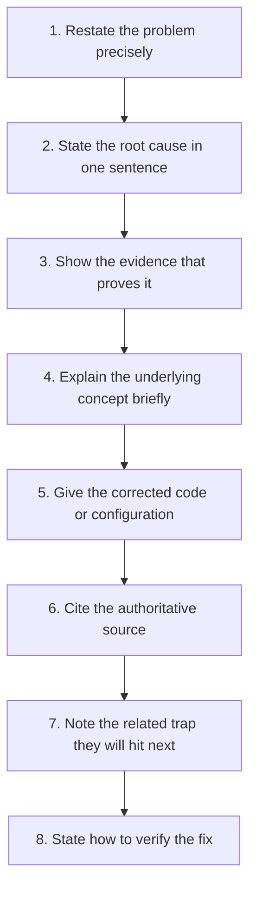
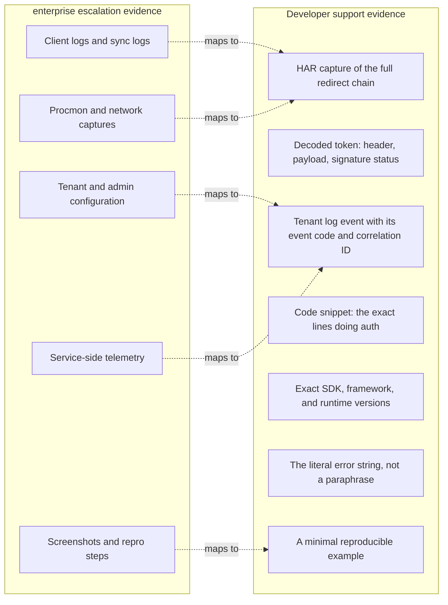
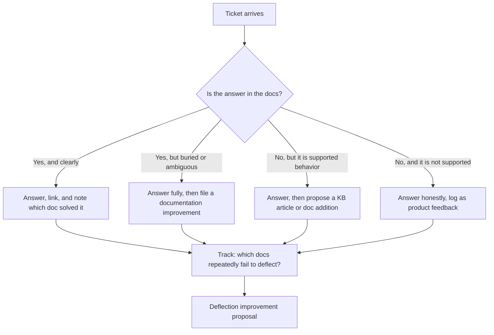
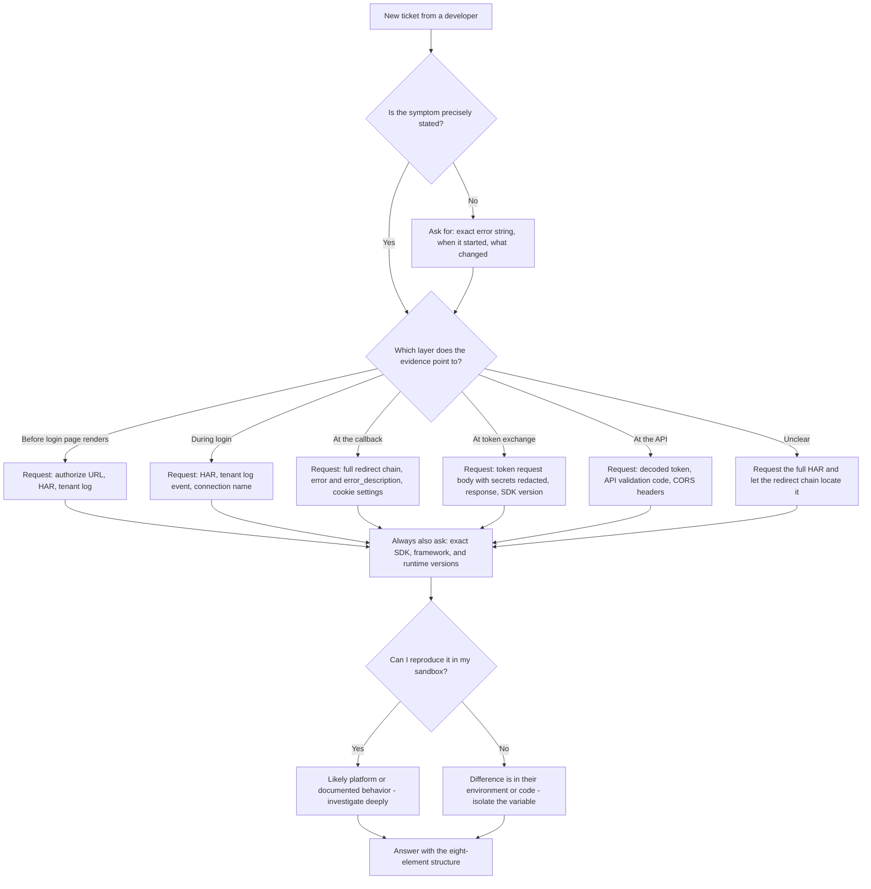

# Part 004 - What Developer Support Engineering Actually Is

> Section goal: Make the biggest behavioural adjustment of this transition — from supporting IT administrators who change settings, to supporting software engineers who write code. Learn what a developer audience expects, what a good developer-support answer contains, and where habits that served you well in a previous role need retuning.

Covers index item **004**. Maps to JD signals: *resolve technical and non-technical customer issues*, *exceed customer expectations on response quality*, *knowledge of software development fundamentals*, *business and technical analysis skills and knowledge of the Development lifecycle*, *promote best practices*, and *contribute to a repository of product-area knowledge*.

---

## 1. Start From Zero: The Customer Is a Builder

In IT support, the customer *operates* a system somebody else built. Their levers are settings, permissions, and deployment.

In developer support, the customer *is building* a system, using your product as a component. Their levers are lines of code.

That single shift changes what "resolved" means.

| | IT support: "resolved" means | Developer support: "resolved" means |
|---|---|---|
| Outcome | The setting is corrected and the symptom is gone | The developer **understands why** it failed and has working code |
| Durability | Holds until someone changes the setting | Holds only if the developer's mental model is now correct |
| Risk of a shallow fix | Recurrence | The developer ships the misunderstanding to production and it recurs at scale |
| Transferability | Applies to that tenant | A good answer teaches a pattern the developer applies forever |

> **Analogy.** IT support is a locksmith: the door will not open, you fix the lock, the door opens. Developer support is a driving instructor: the learner is going to drive alone tomorrow, so it is not enough to grab the wheel — they have to understand *why* the car went where it went.
>
> **Where the analogy stops:** a driving instructor sits in the car. You are describing the road over email, to someone in another country, using only what they choose to send you.

### 🔍 Plain-English deep-dive: why "understanding" is a hard requirement, not a nice-to-have

Suppose a developer's login is failing and the cause is that they are validating the wrong claim in a token. You could reply: *"Change `aud` to your API identifier."* The symptom disappears.

But identity code is copied. That same developer will paste that validation function into three more services. If they never understood *what* `aud` means and *why* the value must be their API's identifier, then the next service will have the same class of bug in a slightly different shape — and this time it may be a security hole rather than an outage.

**This is why the JD emphasises "promote best practices" alongside resolution.** In developer support, the teaching *is* the fix.

---

## 2. The Anatomy of a Good Developer-Support Answer



| Element | Why it is there | What it looks like |
|---|---|---|
| **1. Restate** | Proves you read it; catches misunderstandings before you waste a cycle | "To confirm: your React SPA gets a token successfully, but your Express API rejects it with 401." |
| **2. Root cause** | Developers want the answer first, not a narrative | "The API is validating the token against the wrong audience." |
| **3. Evidence** | Turns an assertion into a finding | "In the token you sent, `aud` is `https://tenant/userinfo`, but your API expects `https://api.example.com`." |
| **4. Concept** | This is the durable part | "`aud` names the intended recipient. When you request a token without an `audience` parameter, you get a token for the identity provider's own endpoints, not for your API." |
| **5. Corrected code** | Removes ambiguity entirely | A short, runnable snippet — not pseudocode |
| **6. Source** | Lets them verify independently and builds trust | Link to the specific documentation page or RFC section |
| **7. Next trap** | Prevents the follow-up ticket; this is where you exceed expectations | "Once that works, you'll want to check `iss` too — a token from a different tenant would otherwise pass." |
| **8. Verification** | Closes the loop and prevents "it's still broken" | "Decode the new token and confirm `aud` matches; then retry the API call." |

### Worked example: the same case, answered three ways

**Poor (IT-support reflex):**
> "This looks like an audience configuration issue. Please check your API settings and let us know."

Why it fails: no evidence, no concept, no code, and it puts the work back on the customer.

**Adequate:**
> "Your token's `aud` claim is `https://tenant/userinfo` instead of your API identifier. Add the `audience` parameter to your authorization request."

Why it is only adequate: correct, but the developer learns nothing and will hit the sibling bug next week.

**Good:**
> "To confirm: your SPA obtains a token, but your Express API rejects it with 401.
>
> **Root cause:** the token is not intended for your API. In the token you attached, `aud` is `https://your-tenant/userinfo` — that is the identity provider's own endpoint, not your API.
>
> **Why:** the `aud` claim names the *intended recipient* of an access token. When an authorization request omits the `audience` parameter, the authorization server issues a token scoped to its own endpoints. Your API is correctly rejecting a token that was never meant for it — this is the protection working.
>
> **Fix:** pass your API identifier when initiating login:
> ```js
> await auth0.loginWithRedirect({
>   authorizationParams: { audience: 'https://api.example.com', scope: 'read:orders' }
> });
> ```
> and validate on the API side with the matching audience.
>
> **Reference:** [audience and API authorization documentation], and RFC 7519 §4.1.3 for the `aud` claim.
>
> **You will hit this next:** also validate `iss` against your tenant's issuer. Without it, a correctly-signed token from *any* tenant of the same provider would pass your audience check.
>
> **Verify:** decode the new access token, confirm `aud` is `https://api.example.com`, then retry. If it still fails, send me the decoded header — a `kid` mismatch is the next most likely cause."

That answer resolves the case, prevents two future cases, teaches a concept, and demonstrates exactly the "response quality" the JD asks you to exceed on.

> 💡 **Tie-in to your background:** you already write structured technical communications for critical-situation bridges and Engineering escalations. The structure above is the same discipline with a different payload. What is *new* is that element 5 is code, and element 6 is a specification.

---

## 3. What Developers Want (and What Annoys Them)

Developers are a specific audience with strong preferences. Getting these right disproportionately affects CSAT.

| They want | Because | They dislike | Because |
|---|---|---|---|
| The answer first, detail after | They are scanning, not reading | A long preamble before the point | Wastes their time |
| Exact names — parameters, claims, headers | Precision is how their world works | "Check your settings" | Not actionable |
| Runnable code | Removes translation errors | Pseudocode or partial snippets | Ambiguity creates new bugs |
| A link to the source | They want to verify and read around it | "Trust me" | Unverifiable |
| Acknowledgement when they are right | They often have already diagnosed it | Being told to do what they already did | Feels unheard |
| A straight "no" when it is a no | They can design around a limit | Vague "that may be possible" | Blocks planning |
| Their version and environment respected | Behavior differs by version | Advice for a different SDK version | Wastes a whole cycle |
| To be told it is *their* bug, plainly | They would rather know | Being led around it politely | Delays the fix |

### 🔍 Plain-English deep-dive: how to say "this is your bug" without damaging the relationship

This conversation happens constantly in developer support and almost never in IT support. The technique has three moves:

1. **Lead with evidence, not verdict.** *"Here is the token your API received, and here is what your validation code is comparing it against."* Let the developer reach the conclusion. People accept conclusions they arrive at themselves.
2. **Make the mistake reasonable.** *"This one catches almost everyone, because the SDK's default behavior changed in v2 and most examples online are still v1."* You are not being kind for its own sake — you are keeping the developer's ego out of the debugging loop, which speeds things up.
3. **Separate blame from responsibility.** *"The change needed is in your API's validation, and here is exactly what it should be."* Say clearly where the fix goes, without an implied criticism.

**Analogy:** a good copy-editor does not write "this sentence is bad." They write "this reads ambiguously — did you mean X or Y?" The author fixes it themselves and keeps ownership. **Where it stops:** unlike editing, you sometimes must be blunt, because a security mistake cannot be left to tact.

---

## 4. The Evidence Set Changes Completely

This is the most concrete difference from your current role.



| Evidence item | Why it matters | What goes wrong without it |
|---|---|---|
| **HAR of the full flow** | Identity is a redirect chain; the failure is often three hops before the visible error | You debug the wrong request |
| **Decoded token** | Claims are the ground truth about what was issued | Endless speculation about configuration |
| **Tenant log + correlation ID** | The server's view, which the client cannot see | You only have half the story |
| **The auth code, verbatim** | 60% of developer tickets are implementation, not platform | You "fix" configuration that was never wrong |
| **Exact versions** | SDK defaults and behavior change between majors | You give advice for a different product |
| **The literal error string** | Paraphrases lose the discriminating detail | "Login failed" could be twenty causes |
| **Minimal repro** | Removes the customer's unrelated complexity | Engineering rejects the escalation |

> **The single highest-leverage habit:** ask for the *decoded token and the HAR* in your first response, together with the exact versions, rather than after two rounds of clarification. It converts a five-day case into a one-day case. Part 112 turns this into a reusable template.

---

## 5. The Documentation Relationship

In IT support, documentation is a reference you consult. In developer support, documentation is **part of the product**, and you have a direct relationship with it.



**Why this matters for the JD.** It says you will *"contribute to and maintain repository of product area specific knowledge"*. In developer support that is not an add-on chore — it is the mechanism by which ticket volume stays sane. Every ticket that could have been answered by documentation is a signal.

> 💡 **Tie-in to your background:** you already do this. Your CV says you *"authored knowledge-base articles, troubleshooting guides, and best-practice documentation to improve technical readiness"* and drove *"case deflection"*-shaped work through triages and case bashes. The instinct transfers exactly; only the audience changes from support engineers to external developers.

### 🔍 Plain-English deep-dive: public answers versus private answers

Developer support usually has a **public** surface — a community forum — alongside the private ticket queue. This is unusual and worth understanding.

- A **private ticket answer** helps one customer.
- A **public forum answer** is indexed by search engines and helps everyone who hits the same problem for years afterwards.

The consequences:
- Public answers must be **more careful**: no customer-specific detail, no tenant identifiers, no assumptions about their configuration.
- Public answers must be **more general**: written for the class of problem, not the instance.
- A well-written public answer is a **deflection asset** with compounding returns.
- A wrong public answer is a **liability** that misleads people for years and is hard to retract.

**Analogy:** a private ticket is a conversation; a forum post is a published article. The standard of care differs accordingly.

---

## 6. Where Your Existing Habits Need Retuning

Be honest with yourself about these. Naming them in an interview is a strength.

| Habit that serves you in traditional support | Why it needs adjusting here | The adjustment |
|---|---|---|
| Reaching for admin configuration first | Most developer tickets are implementation, not configuration | Ask for the code and the token before the config |
| Screenshots as primary evidence | A screenshot of a browser error contains almost no diagnostic information | Ask for a HAR and the decoded token instead |
| Describing steps in the UI | Developers work in code and config-as-code | Give a snippet or an API call, not a click path |
| Escalating with repro steps | Engineering here expects a runnable minimal example | Learn the reduction technique (Part 032) |
| "Please contact your administrator" | The developer often *is* the administrator, or there is no admin | Establish who has tenant access early |
| Careful, formal, hedged language | Developers read hedging as uncertainty | Be direct; hedge only where you genuinely are uncertain, and say why |
| Treating the product as a black box | Here you are expected to reason about protocol mechanics | Learn the specifications (Parts 056–095) so you can reason, not just look up |
| Long narrative case notes | Developers scan | Answer first, detail beneath |

> **How to say this in an interview, honestly:**
> *"The habit I've had to consciously retrain is reaching for configuration first. In my current role, the tenant config is usually where the answer lives. Studying developer-support conversations, most of the time it's the implementation — a missing parameter, a wrong claim check, an SDK default that changed. So I've retrained my first move to be: get the decoded token and the HAR, and read the customer's actual code, before touching configuration."*

That answer shows self-awareness and that you have studied the real work, not just the job title.

---

## 7. Failure Modes in Developer Support

| Failure mode | What it looks like | Consequence | Correction |
|---|---|---|---|
| **Answering the asked question, not the real one** | Developer asks "how do I extend token lifetime to 30 days?" and you tell them how | You helped them build a security problem | Ask *why*; the real need is usually persistent sessions → refresh tokens (Part 061) |
| **Guessing at the cause** | "This is probably a CORS issue" with no evidence | Sends the developer down a dead end; costs days | State hypotheses as hypotheses, with the test that would confirm |
| **Fixing without teaching** | Correct snippet, no explanation | Recurs in their next service | Always include the concept |
| **Version blindness** | Advice for SDK v1 given to a v2 user | Total waste of a cycle; damages credibility | Ask for versions up front, always |
| **Copy-pasting docs** | Reply is a documentation quote | The developer already read it, which is why they wrote in | Explain what the doc means *for their case* |
| **Over-hedging** | "It might possibly be related to…" | Reads as not knowing | Be definite about evidence, explicit about uncertainty |
| **Under-communicating on long cases** | Silence during investigation | Trust collapses faster than the technical problem | Update on cadence even with no progress |
| **Publishing a wrong forum answer** | Confident public post that is subtly incorrect | Misleads people for years | Higher bar for public; verify before posting |
| **Treating security shortcuts as help** | Suggesting a workaround that weakens validation | Real harm, and a professional failure | Never advise disabling signature validation, certificate checks, or `state`; explain why the control exists and find a supported path |

---

## 8. Troubleshooting Decision Tree: First Response to a Developer Ticket



**Note the design of this tree.** It front-loads *evidence acquisition* and delays *hypothesising*. That ordering is the single biggest predictor of case duration, and it is exactly what the JD means by *"instinctive ability to subdivide problems into basic components in order to efficiently pinpoint the root cause."*

---

## 9. Lab: Rewrite Three Real Support Answers

**Purpose.** Convert the theory in §2 into a habit, using authentic material.

**Prerequisites.** Browser and text editor. Read-only use of a public community forum. No account needed to read.

**Steps.**

1. Open the Auth0 community forum. Find **three** questions that have been answered — ideally one about a redirect or callback error, one about a token or API 401, and one about an enterprise connection.
2. For each, create a section in `okta-prep/artifacts/answer-rewrites.md` containing:
   - **The problem, in your own words** (two sentences maximum — do not copy the poster's text or any identifiers).
   - **The evidence I would request first**, and why each item discriminates between causes.
   - **My answer**, written using the full eight-element structure from §2.
   - **What the published answer did well, and what it omitted.**
3. For at least one of the three, write the answer **twice**: once as a private ticket reply and once as a public forum post. Note in one line what you changed and why.
4. Time yourself writing the third one. A structured answer should take 15–25 minutes once the evidence is in hand. If it takes an hour, your structure is not yet automatic.
5. Read one answer aloud. Developers read fast; if it sounds padded when spoken, it is padded when read.

**Expected evidence.** One Markdown file with three rewritten answers, one dual private/public version, and a timing note.

**Validation rubric.**

| Check | Pass condition |
|---|---|
| Eight elements present | Every answer has all eight, in order |
| Evidence justified | Each requested item has a stated discriminating purpose |
| Code is runnable | Snippets are complete enough to paste and run, not pseudocode |
| Concept explained | A reader who did not know the concept would after reading |
| Next trap named | Each answer prevents at least one follow-up ticket |
| Public version is safe | No customer specifics, no tenant identifiers, no assumed configuration |
| No unsafe advice | Nothing suggests weakening validation, certificate checking, or `state` |

**Cleanup and privacy.** Read-only: do not post, reply, or contact anyone. Do not copy anyone's tenant identifiers, domains, tokens, or personal details into your notes — paraphrase the *pattern* only. If a forum post contains a real token or secret, do not record it anywhere; it is not yours to keep.

---

## 10. JD Mapping

| Supplied JD signal | How this Part supports it |
|---|---|
| Exceed customer expectations on response quality | §2's eight-element structure is a concrete, repeatable quality standard |
| Resolve technical and non-technical issues | §3 covers the human side; §4 covers the technical evidence side |
| Knowledge of software development fundamentals | §§1–4 assume and reinforce a developer's working model |
| Knowledge of the Development lifecycle | §6's version-blindness point and §4's version requirement are lifecycle awareness in practice |
| Business and technical analysis skills | §7's "answering the asked question, not the real one" is requirement interrogation |
| Promote best practices | §1 establishes that in developer support, teaching *is* the fix |
| Contribute to and maintain a knowledge repository | §5 makes documentation a first-class part of the role with a feedback loop |
| Instinctive ability to subdivide problems | §8's tree front-loads evidence and delays hypothesising |
| Customer-obsessed attitude | §3's "how to say it's your bug" preserves the relationship while being accurate |

---

## 11. Candidate Honesty Note

- **Production transfer:** structured technical communication, escalation write-ups, KB authoring, mentoring, and multi-audience translation are all directly transferable and are on your CV.
- **Honest adjustment:** your reflex evidence set is admin configuration and client logs; developer support leads with HAR, decoded tokens, and the customer's code. Saying this out loud in an interview demonstrates self-awareness and that you researched the actual work.
- **Lab:** the answer-rewrite artifact from §9 is genuine, showable evidence that you have practised the register — bring it up if asked "have you done developer-facing support?"
- **No direct experience:** you have not held a developer-support queue. Say that plainly, then point at the structure you have built and the answers you have written.
- **Never claim** that you have written public forum answers for a vendor unless you actually have.

---

## 12. Official Source Anchors

Accessed **26 August 2026**.

| Source family | Use it for |
|---|---|
| Auth0 community forum | The single best free source of authentic developer-support language, question shapes, and answer quality benchmarks |
| Okta developer forum (`devforum.okta.com`) | The equivalent surface on the Workforce/developer side |
| Auth0 documentation — Quickstarts, SDK libraries, API references | What "the documentation says" actually means when you cite it, and what developers have already read before writing in |
| Okta developer documentation — Guides and Concepts | Structure of official guidance, and the Concepts pages you will cite when explaining mechanism |
| Auth0 changelog | Version-behavior changes — the root cause behind a large share of "it worked last week" tickets |
| IETF RFCs (OAuth, JWT) and OpenID Connect specifications | The authoritative sources you cite in element 6 of an answer |

**Revalidate after 26 August 2026:** documentation structure and SDK major versions, both of which change frequently.

---

## ⭐ Likely Interview Questions for This Section

### Q1. "How is supporting developers different from supporting IT administrators?"
> *Model answer:* "The customer's levers are different, so 'resolved' means something different. An admin's levers are settings — if I correct the setting, the symptom is gone and we're done. A developer's levers are lines of code, and they're going to copy that code into their next three services. So if I just tell them what to change without explaining why, I've fixed one symptom and shipped the misunderstanding into their whole estate. The evidence set changes too: instead of tenant config and screenshots, it's HAR captures, decoded tokens, the customer's actual auth code, and exact SDK versions. And the register changes — developers want the answer first, precise names, runnable code, and a link to the source they can verify."

### Q2. "Walk me through how you'd structure a technical answer to a developer."
> *Model answer:* "Eight elements, in order. Restate the problem so they know I read it. State the root cause in one sentence, because developers scan for the answer. Show the evidence that proves it — the actual claim value from their token, for instance. Explain the underlying concept briefly, because that's the part that transfers. Give corrected, runnable code, not pseudocode. Cite the authoritative source so they can verify independently. Name the related trap they'll hit next, which is where you go from resolving one ticket to preventing three. And state how to verify the fix, so we don't get an 'it's still broken' round trip. That last element and the 'next trap' element are what turn an adequate answer into a great one."

### Q3. "How do you tell a customer that the bug is in their code?"
> *Model answer:* "Lead with evidence rather than verdict, and let them reach the conclusion. So instead of 'your validation is wrong', it's 'here's the `aud` value in the token your API received, and here's what your validation is comparing it to.' Almost always they say 'ah, I see it' before I do. Second, I make the mistake reasonable if it genuinely is — 'this catches almost everyone because the SDK default changed in v2 and most examples online are still v1.' That isn't politeness for its own sake; keeping ego out of the loop makes debugging faster. Third, I separate blame from responsibility: I say clearly where the change goes, without an implied criticism. The one exception is security — if the mistake creates a vulnerability, I'm direct about it immediately, because tact is not worth a security hole."

### Q4. "A developer asks you to help them extend token lifetime to 30 days. What do you do?"
> *Model answer:* "I don't answer it directly, because it's an X-Y question — they've told me their proposed solution, not their problem. So I ask what they're trying to achieve. Almost always the real requirement is 'our users shouldn't have to log in every hour', and the correct answer is refresh tokens with rotation, not a 30-day access token. A long-lived access token is a bearer credential you can't easily revoke, so if it leaks you have a month-long exposure window with no good remediation. I'd explain that trade-off, give them the refresh-token pattern with rotation and reuse detection, and note the platform limits. If they still have a genuine constraint that rules that out, then we discuss it properly — but I'd never just make the change they asked for and let them ship a security problem."

### Q5. "What evidence would you ask for in your first response?"
> *Model answer:* "I ask for everything I'll need up front rather than in rounds, because each round trip with a customer in another timezone costs a day. So: the exact error string verbatim, not paraphrased. A HAR capture of the complete flow with 'preserve log' enabled, so I get the whole redirect chain and not just the failing request. The decoded token, or the token with the signature removed if they're cautious. The correlation ID or the timestamp so I can find the server-side log event. The specific lines of their auth code. And the exact SDK, framework, and runtime versions, because SDK defaults change between majors and advice for v1 is worse than useless to a v2 user. I'd also ask what changed, and when it last worked — 'nothing changed' is almost never true, and the answer is often a dependency update."

### Q6. "How is a public forum answer different from a private ticket answer?"
> *Model answer:* "Higher standard of care and broader scope. A private answer helps one customer and I can rely on the context we've built — I know their configuration, their versions, what we've already ruled out. A forum answer is effectively a published article: it'll be found by search for years, by people whose configuration I know nothing about. So it has to be written for the *class* of problem rather than the instance, it can't assume anything about the reader's setup, and it must contain no customer-specific detail or identifiers. The upside is compounding — a good public answer deflects tickets indefinitely. The downside is that a wrong one misleads people for years and is hard to retract, so I'd verify anything I wasn't certain of before posting."

### Q7. "You come from a background where the answer is usually in the configuration. Is that a problem here?"
> *Model answer:* "It's the specific habit I've had to consciously retrain, and I'd rather name it than have it discovered. In my current role the tenant configuration is usually where the answer lives, so my reflex is to go there first. Studying real developer-support conversations, the majority are implementation issues — a missing `audience` parameter, a claim being validated wrongly, an SDK default that changed between versions. So I've deliberately retrained my first move: get the decoded token and the HAR, read their actual auth code, and only then look at configuration. It's a sequencing change rather than a skills gap, but it's a real one and it took conscious practice."

### Q8. "How do you handle a case where you genuinely don't know the answer?"
> *Model answer:* "I say so, and then I make my uncertainty useful rather than just declaring it. Concretely: I state what I *do* know and what the evidence rules out, so the customer sees progress. I name my leading hypothesis and the specific test that would confirm or eliminate it. I say when I'll come back, and I keep that promise even if the answer is 'no progress yet' — silence damages trust much faster than slow progress. And I do the work: try to reproduce it in a sandbox, read the relevant specification section rather than guessing, and pull in a colleague or Engineering with a proper packet if I've exhausted my hypotheses. What I don't do is guess confidently. A wrong confident answer sends a developer down a dead end for days, and that costs far more than saying 'I don't know yet, here's my plan.'"

---

## 🧠 30-Second Memory Hooks

- **IT support fixes the lock. Developer support teaches the driver.** The developer drives alone tomorrow.
- **In developer support, the teaching *is* the fix** — because identity code gets copied.
- **Eight elements:** restate · root cause · evidence · concept · code · source · next trap · verify.
- **Answer first, detail beneath.** Developers scan.
- **New evidence set:** HAR · decoded token · tenant log + correlation ID · their code · **exact versions** · literal error string.
- **Ask for everything in the first response.** Each round trip costs a day.
- **"This is your bug" = lead with evidence, make the mistake reasonable, separate blame from responsibility.**
- **X-Y questions:** they tell you their solution, not their problem. Ask *why* before answering *how*.
- **Public answers have a higher bar** — no specifics, no assumptions, verified before posting.
- **Never advise weakening validation** to make something work. Explain the control and find a supported path.

---

## ✅ Completion Checklist

- [ ] **Knowledge:** I can recite the eight elements of a good answer and name the seven items in the developer evidence set.
- [ ] **Lab artifact:** `answer-rewrites.md` exists with three structured answers and one dual private/public version.
- [ ] **Spoken:** I read one answer aloud and it did not sound padded.
- [ ] **Honesty check:** I have written my one-sentence statement about retraining the configuration-first reflex.
- [ ] **Source check:** I have browsed both the Auth0 community forum and the Okta developer forum and seen what real questions look like.

---

*Next suggested section:* **[Part 005 - Ownership, Severity, SLAs, and Escalation Discipline](Part-005-ownership-severity-slas-and-escalation-discipline.md)** — you know the audience and the answer format; next, the operational frame that decides what you work on first and when you pull others in.
