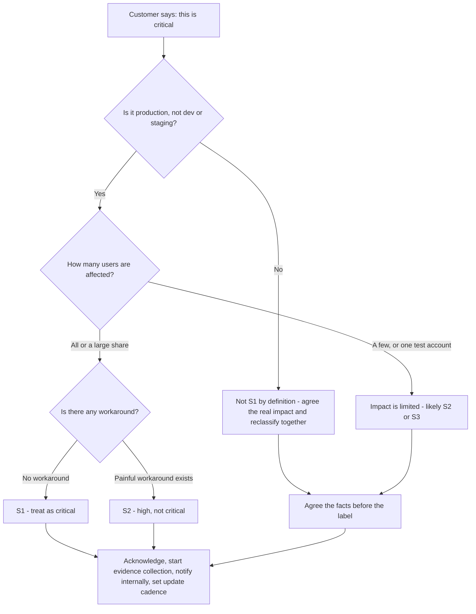
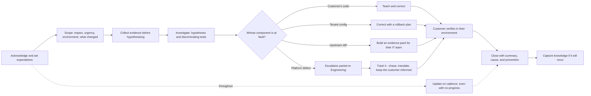
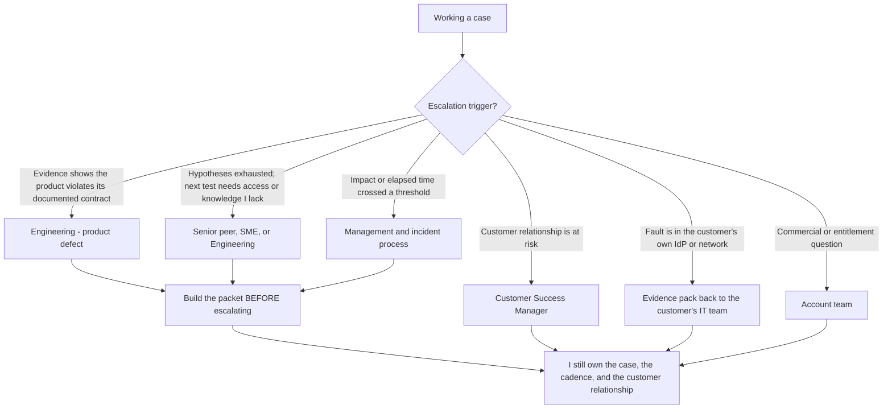
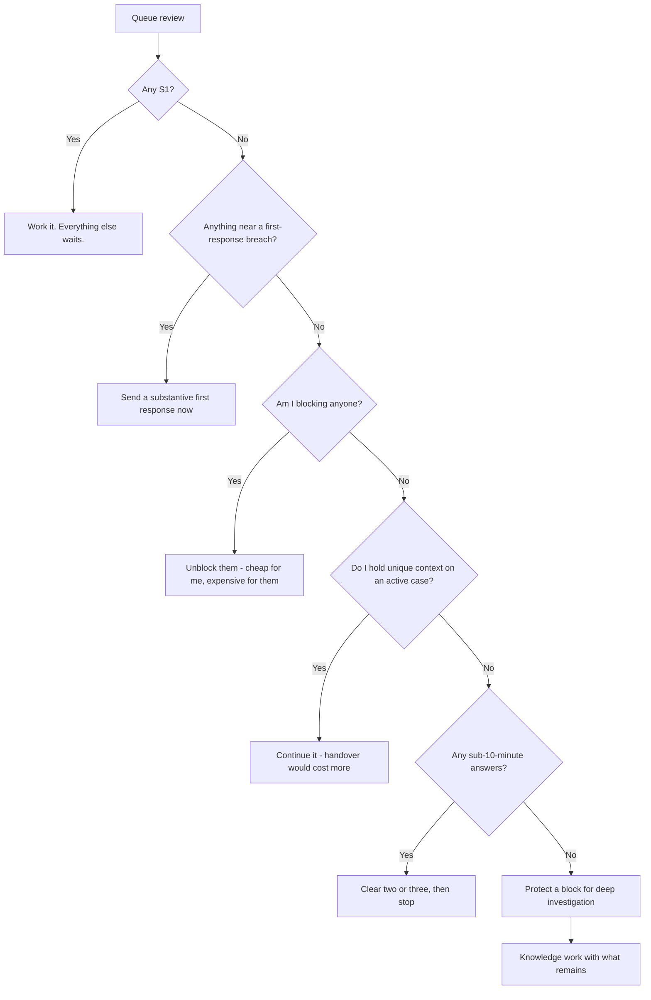
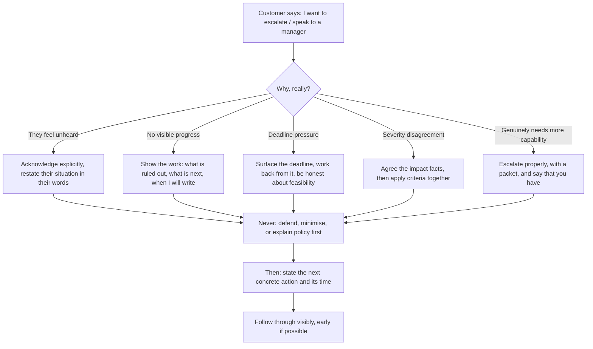

# Part 005 - Ownership, Severity, SLAs, and Escalation Discipline

> Section goal: Build the operational frame that decides what you work on first, how fast you must respond, when you pull others in, and what "end-to-end ownership" actually obliges you to do. This is the Part where several years of enterprise escalation experience converts almost one-for-one — but only if you can articulate it precisely.

Covers index item **005**. Maps to JD signals: *end-to-end ownership of customer issues*, *operational management of Support tickets*, *exceed customer expectations on timeliness*, *serve as internal and external point of contact*, *resolve issues in a timely fashion*, and *speed and urgency, execute with excellence*.

---

## 1. Start From Zero: What Is a Support "Ticket"?

A **ticket** (also called a case) is a durable record of one customer problem, with a lifecycle, an owner, and a clock attached.

Three things make it more than an email thread:

| Property | What it means | Why it exists |
|---|---|---|
| **Owner** | Exactly one named person is accountable at any moment | Shared ownership is no ownership |
| **State** | Where it is in its lifecycle (new, in progress, pending customer, escalated, resolved, closed) | Lets a queue be managed at scale |
| **Clock** | Measured time against a commitment | Makes timeliness objective instead of a feeling |

> **Analogy.** A ticket is a hospital patient chart. It travels with the patient, records everything done and why, names the responsible clinician, and makes the handover safe when the shift changes.
>
> **Where the analogy stops:** in hospitals the patient is physically present. In support the customer only sees what you write, so your notes *are* the relationship, not just a record of it.

### 🔍 Plain-English deep-dive: severity, priority, and impact are three different things

These are constantly used interchangeably and they are not the same. Getting them straight is genuinely useful in an interview.

- **Impact** — *how much damage is being done.* How many users, how much money, is there a workaround. **Analogy:** how badly the patient is bleeding.
- **Urgency** — *how fast it is getting worse, or how close a deadline is.* **Analogy:** whether the bleeding is accelerating.
- **Severity** — *a classification, usually set by agreed criteria, that combines impact and urgency into a label* (S1/S2/S3/S4, or P1–P4). **Analogy:** triage category at the door.
- **Priority** — *the order in which you actually work things*, which is severity **plus** other real factors: contractual commitments, how close a case is to breaching, whether the customer is already unhappy, and whether a quick win unblocks several people.

**Why it matters:** a customer arguing "this is a Sev 1" is usually arguing about *impact*. The productive response is to agree on the impact facts first, then apply the criteria together — rather than negotiating the label directly, which becomes a status fight.

---

## 2. A Severity Model for Customer Identity

Severity criteria are contractual and vendor-specific, so what follows is a **reasoning model**, not a claim about Okta's published matrix. Use it to think; verify the real matrix when you join.

| Level | Typical criteria | Customer Identity examples | Response instinct |
|---|---|---|---|
| **S1 — Critical** | Production is down or unusable; no workaround; revenue or safety impact | Nobody can log in to a production application; the login page returns errors for all users; all API calls rejected after a certificate rollover | Drop everything, acknowledge immediately, gather evidence in parallel with escalating, communicate on a tight cadence |
| **S2 — High** | Major function impaired; a significant subset affected; painful workaround exists | One enterprise connection is broken so one large customer's staff cannot sign in; MFA enrolment failing for new users; refresh tokens failing so users are logged out hourly | Same-day ownership, structured investigation, updates on an agreed cadence |
| **S3 — Medium** | Non-critical function impaired, or a clear workaround exists | A specific social connection fails intermittently; a claim is missing from tokens for a subset; a log stream is delayed | Normal queue handling with a firm commitment |
| **S4 — Low** | Questions, guidance, feature enquiries, cosmetic issues | "Which flow should we use for our mobile app?"; documentation clarification; how to structure metadata | Batch, but never ignore — these are where best-practice influence happens |

### The "is it really S1?" test

> **The most important habit in this diagram:** *agree the facts before the label.* "Help me understand the scope — is this every user, or users on a particular connection? Is there any path that still works?" You are not resisting the customer; you are gathering the exact information you need anyway. The severity conversation and the diagnostic conversation are the same conversation.

> 💡 **Tie-in to your background:** this is exactly the critical-situation qualification conversation you already run. Your CV says you own *"business-critical customer escalations and high-priority production incidents."* Do not undersell that in an interview — the ability to hold a calm severity conversation with a frightened customer is a senior skill, and many candidates for this role will not have it.

---

## 3. What End-to-End Ownership Actually Obliges You To Do

The JD says: *"Take end-to-end ownership of customer issues, including initial troubleshooting, identification of root cause and issue resolution."*

Unpack it into concrete duties:

| Duty | What it means concretely | What breaks if you skip it |
|---|---|---|
| **Acknowledge** | A human reply within the committed window, naming yourself | Customer escalates out of anxiety, not need |
| **Scope** | Establish impact, urgency, environment, and what changed | You investigate the wrong severity and the wrong thing |
| **Own through handoffs** | The case stays yours even when Engineering has the code | The customer discovers a gap and loses trust |
| **Translate** | Convert Engineering's language into customer language, and vice versa | Both sides talk past each other for a week |
| **Update on cadence** | Keep the promised rhythm even when there is nothing new | Silence is read as abandonment |
| **Verify** | Confirm the fix in *the customer's* environment, not yours | "Resolved" cases reopen and metrics lie |
| **Close properly** | Summary, root cause, prevention, and any follow-up | Nobody learns anything, including you |
| **Capture** | KB article or runbook if it will recur | The next engineer repeats your whole investigation |

### 🔍 Plain-English deep-dive: why "update on cadence with no progress" is the highest-value habit

It feels wrong. You have nothing to report, so you wait until you do.

But from the customer's side, silence and abandonment are indistinguishable. They cannot see you working. What they can see is that you said you would write on Tuesday and it is Wednesday.

The mechanics of trust here:

- **Progress you communicate** builds confidence.
- **Progress you do not communicate** builds nothing.
- **Silence** actively destroys confidence, at a rate that accelerates.

A "no progress" update is not an admission of failure if it contains three things: what you ruled out, what you are testing next, and when you will write again. That is *visible* work.

**Analogy:** a delayed flight where the airline announces every 20 minutes — even "still no information, next update at 14:40" — versus one where the board just says "Delayed" for three hours. Identical delay, completely different passenger experience. **Where it stops:** unlike an airline, you can also be *asked questions*, so your update should invite them.

---

## 4. Service Level Agreements and Objectives

| Term | Expands to | Means | Typical shape |
|---|---|---|---|
| **SLA** | Service Level Agreement | A contractual commitment, often with financial consequences | "S1 first response within 1 hour, 24×7" |
| **SLO** | Service Level Objective | An internal target, no contractual penalty | "90% of S3 cases resolved within 5 business days" |
| **SLI** | Service Level Indicator | The actual measurement | "Median time to first response, by severity" |
| **First response time** | — | Clock from ticket creation to a **human, substantive** reply | The most commonly contracted metric |
| **Time to resolution** | — | Clock to the customer-agreed resolution | Harder to contract because it depends on the customer too |
| **Update cadence** | — | Promised frequency of progress updates | Often tied to severity: hourly for S1, daily for S2 |
| **Pending customer** | — | A state that usually pauses your clock | Frequently misused; see below |

### 🔍 Plain-English deep-dive: the "pending customer" trap

When you ask a customer for information, the ticket typically moves to *pending customer* and your response clock pauses. This is reasonable — you cannot be held to a clock while waiting on someone else.

It is also the most commonly abused mechanic in support, in two directions:

- **The lazy pause.** Asking a vague question purely to stop the clock, when you could have made progress. Detectable: the request has no discriminating purpose (Part 004 §4).
- **The round-trip tax.** Asking for one item at a time. Each round trip with a customer in a different timezone costs a day. Three sequential requests turn a one-day case into a four-day case, even though your clock looks perfect.

**The professional standard:** ask for *everything you can foresee needing* in one message, explain *why each item matters*, and keep working on what you can in parallel rather than idling. Your SLA looks the same either way; the customer's experience does not.

> 💡 **Tie-in to your background:** your CV mentions using *"backlog health, case quality, and escalation trends to identify operational gaps."* The pending-customer trap is exactly the kind of thing that shows up in case-quality audits — a clean SLA record with terrible actual resolution times. Being able to name that pattern demonstrates real operational maturity.

---

## 5. Escalation Discipline

**Escalation** means bringing in a capability you do not have. It is not an admission of failure — refusing to escalate when you should is the failure.

### The escalation packet

Escalating without a packet just moves the investigation to someone else's queue. A packet contains:

| Element | Why | Failure without it |
|---|---|---|
| One-line summary | Lets a triager route it in seconds | Sits unrouted |
| Impact and severity, with numbers | Justifies the priority | Deprioritised |
| **Minimal reproducible example** | Lets Engineering run it | Bounced back for repro |
| Exact versions and environment | Behavior varies by version | Cannot reproduce |
| Expected versus actual, precisely | Defines "wrong" objectively | Debate about whether it is a bug |
| Correlation IDs and timestamps (with timezone) | Lets them find it in server logs | Hours lost searching |
| What you have already ruled out, and how | Prevents duplicated work | They repeat your first two days |
| **One explicit ask** | Ambiguous escalations stall | Nobody knows what "done" is |

**The "one explicit ask" is the element most often missing.** "Please investigate" is not an ask. "Please confirm whether the authorization server is expected to omit `at_hash` when `response_type=code` — the specification suggests it is optional, but our documentation implies it is always present" *is* an ask.

> 💡 **Tie-in to your background:** you already do this — *"Partner with Engineering and Product teams to investigate recurring customer-impacting issues, identify potential product defects, validate fixes."* In an interview, describe the *packet structure*, not just the fact that you escalate. Structure is what distinguishes a senior support engineer from a competent one.

---

## 6. Prioritising a Real Queue

You will never have a queue where everything is calm. Prioritisation is the daily skill the JD calls *"quickly context-switch between multiple complex work streams."*

**Order of consideration:**

1. **Anything at S1.** Nothing else matters while a production system is down.
2. **Anything about to breach a first-response commitment.** A first response is cheap and the breach is expensive.
3. **Anything blocking someone else** — a colleague waiting on your input, an Engineering question, a customer blocked on your answer before a release.
4. **Cases where you hold unique context** — you have been in it three days; a handover would cost more than finishing.
5. **Quick wins that clear queue noise** — three five-minute answers reduce cognitive load more than their clock time suggests.
6. **Deep work** — the long investigation that needs an uninterrupted block.
7. **Knowledge work** — the KB article, the runbook, the forum answer.

### The context-switch protocol

Switching costs are real. Reduce them mechanically:

**Before you switch away from a case, write four lines in the ticket:**
1. Current hypothesis.
2. Last test run, and its result.
3. Next test planned.
4. What I promised the customer, and by when.

Coming back then costs 30 seconds instead of 10 minutes. This also makes the case safely handover-able, which matters for an onsite role in a globally distributed team where someone in another timezone may pick it up.

---

## 7. Failure Modes

| Failure mode | What it looks like | Consequence | Correction |
|---|---|---|---|
| **Severity negotiation as a status fight** | Arguing about the label | Relationship damage, no information gained | Agree the impact facts first; the label follows |
| **Silent investigation** | Working hard, saying nothing | Customer escalates out of anxiety | Cadence updates regardless of progress |
| **Clock-stopping** | Vague questions to move to pending customer | Great SLA, terrible experience, visible in audits | One consolidated, justified evidence request |
| **Escalation as disposal** | "Sending this to Engineering" and disengaging | Case stalls, customer has no owner | Escalation transfers *work*, not *ownership* |
| **Thin escalation** | No repro, no versions, no explicit ask | Bounced, days lost | Build the packet first |
| **Hero mode** | Refusing to escalate to prove capability | Longest cases, worst outcomes | Escalation triggers are objective, not ego-based |
| **Resolving without verification** | Closing on your own test result | Reopens; metrics become fiction | Customer confirms in *their* environment |
| **No prevention step** | Fixed, closed, learned nothing | Same case next month, different customer | Capture knowledge when it will recur |
| **Promising a date you do not control** | "Engineering will fix it next sprint" | You will be held to it and you cannot deliver | Commit to *your* next update, never someone else's delivery |

### 🔍 Plain-English deep-dive: commit to your update, never someone else's delivery

This is the single most useful sentence to internalise for customer communication:

> **"I will update you by 16:00 tomorrow."** ✅ — entirely within your control.
> **"Engineering will have a fix next week."** ❌ — not within your control.

The first is a promise you can always keep, even if the news is "no change." The second is a promise you will break roughly half the time, and each break costs more trust than the delay itself.

**Analogy:** a builder who says "I'll call you Friday with the timeline" versus one who says "it'll be done Friday." The first can always deliver; the second is gambling with your trust. **Where it stops:** customers sometimes genuinely need a date to plan around. Then the honest move is to give the *known constraints* — "there is no committed date yet; what I can tell you is that it is triaged as X and I will have the next status on Thursday" — rather than inventing one.

---

## 8. Troubleshooting Decision Tree: "The Customer Is Escalating"

**Worked example.** A customer writes: *"This is unacceptable, we've been down for six hours and nobody is helping. Get me your manager."*

- **Wrong first move:** explaining the severity policy, or defending the timeline.
- **Right first move:** *"You've had a production outage for six hours — that's a serious situation and I understand the frustration. Here's exactly where we are: [what is ruled out], [what the evidence currently indicates], [what I'm testing right now]. I've also raised this internally as [X] and my manager is aware. My next update to you is at 15:00 regardless of progress, and sooner if I have something. I'd also like to get [specific item] from you now because it's the fastest thing that would narrow this down."*

That reply acknowledges, shows work, escalates genuinely, commits to a controllable promise, and asks for something useful. It does not defend, and it does not over-promise.

> 💡 **Tie-in to your background:** you have done this. Escalation calls and critical-situation bridges with unhappy enterprise customers are on your CV. Rehearse one real example (anonymised) as a STAR story — this is one of the highest-value stories you own for this role. Part 130 builds the bank.

---

## 9. Lab: Build Your Operations Kit

**Purpose.** Produce the reusable operational artifacts you will use in the job and reference in the interview.

**Prerequisites.** Text editor only. No accounts, no network, nothing sensitive.

**Steps.**

1. Create `okta-prep/artifacts/ops-kit/`.
2. **`severity-model.md`** — write out the four-level model from §2 in your own words, with **two Customer Identity examples per level** that you invent yourself. Add the "is it really S1?" questions as a script you would actually say aloud.
3. **`first-response-template.md`** — write a first-response template with: acknowledgement, your restatement of the problem, the consolidated evidence request with a reason per item, your working hypothesis if you have one, and your committed next update time. Keep it under 200 words.
4. **`cadence-plan.md`** — a table of severity versus update frequency, plus a two-line "no progress" update template that still contains ruled-out / next-test / next-update.
5. **`escalation-packet.md`** — the eight-element packet template from §5, with a worked example you invent for a Customer Identity defect. Make sure the "one explicit ask" is a genuine yes/no question.
6. **`context-switch-card.md`** — the four lines from §6, formatted so you can paste them into a ticket note in five seconds.
7. **`escalating-customer-script.md`** — write out the §8 worked example in your own words, then write two variants: one where you genuinely have no progress, and one where the fault turns out to be the customer's own change.
8. Read the escalating-customer script aloud twice. If it sounds defensive anywhere, rewrite that sentence.

**Expected evidence.** Six Markdown files in `ops-kit/`, all written in your own words, all usable without editing.

**Validation rubric.**

| Check | Pass condition |
|---|---|
| Severity examples are yours | Two invented Customer Identity examples per level |
| First response is consolidated | Every evidence item has a stated discriminating reason |
| Cadence template is honest | The "no progress" template still shows visible work |
| Packet has a real ask | The explicit ask is answerable yes or no |
| Context card is fast | Four lines, pasteable in five seconds |
| Script is non-defensive | Read aloud twice; no sentence defends or minimises |
| Nothing over-promises | No template contains a commitment about another team's delivery date |

**Cleanup and privacy.** Everything here is your own generic method. Do **not** include real Microsoft case details, customer names, ticket numbers, internal tool names, or internal severity matrices — those are your current employer's confidential information. Write the method generically; that is what transfers anyway.

---

## 10. JD Mapping

| Supplied JD signal | How this Part supports it |
|---|---|
| Take end-to-end ownership of customer issues | §3 converts the phrase into eight concrete, auditable duties |
| Operational management of Support tickets | §§1, 4, 6 cover state, clock, SLA mechanics, and queue prioritisation |
| Resolve issues in a timely fashion | §4's SLA/SLO/SLI distinction and §4's pending-customer trap |
| Exceed expectations on timeliness and overall experience | §3's cadence habit and §7's "commit to your update" rule |
| Serve as internal and external point of contact | §5's escalation map shows you remain the single interface across six directions |
| Quickly context-switch between complex work streams | §6's prioritisation order and four-line context-switch protocol |
| Speed and urgency, execute with excellence | §2's severity model and §8's escalating-customer response |
| Collaborate with other departments | §5 routes correctly to Engineering, CSM, account team, and the customer's own IT |
| Customer-obsessed attitude | §8's script leads with acknowledgement rather than policy |

---

## 11. Candidate Honesty Note

- **Production transfer (strong):** everything in this Part is genuinely yours. Business-critical escalations, critical situations, high-priority production incidents, technical roadblock calls, case reviews, backlog and case-quality analysis, and being the point of contact between customers, Customer IT, delivery partners, Engineering, Product, and vendors. This is the Part where you are *ahead* of a typical candidate, not behind.
- **How to claim it well:** describe the *structure*, not just the experience. Anyone can say "I owned escalations." Describing the eight-element escalation packet, the cadence rule, and the "agree facts before the label" technique is what demonstrates seniority.
- **Honest boundary:** severity matrices, SLAs, and escalation paths are vendor-specific and contractual. Never state Okta's as if you know it. Say: *"I'd want to learn the actual matrix and the entitlement tiers on day one — the reasoning transfers, the thresholds don't."*
- **Confidentiality:** do not disclose your current employer's internal severity definitions, tooling, or specific customer situations. Anonymise every story to the pattern level.

---

## 12. Official Source Anchors

Accessed **26 August 2026**.

| Source family | Use it for |
|---|---|
| Okta and Auth0 support sites | How support entitlements, plans, and contact channels are publicly described — read before an interview so you know the shape of the customer's experience |
| Okta Platform and Auth0 Platform status pages | What a real incident communication looks like from the vendor side, including cadence and language |
| The supplied job description | The authoritative statements about ownership, ticket management, timeliness, and point-of-contact duties |
| ITIL / general service-management literature | Vocabulary for incident, problem, severity, and priority — useful for precision, but always defer to the vendor's actual contractual definitions |

**Revalidate after 26 August 2026:** support plan structures and any published response commitments, which are commercial and change.

> **Deliberate omission:** this Part contains no claim about Okta's actual severity matrix, SLA figures, or escalation process, because those are contractual and were not verified. The model in §2 is a reasoning aid only.

---

## ⭐ Likely Interview Questions for This Section

### Q1. "What does end-to-end ownership mean to you in practice?"
> *Model answer:* "It means the case is mine until the customer confirms it's resolved, regardless of who does the work. Concretely that's eight things: acknowledge and set expectations; scope impact, urgency, environment and what changed; collect evidence before hypothesising; investigate with discriminating tests; route correctly once I know whose component is at fault; if it goes to Engineering, keep tracking it and translating in both directions rather than treating escalation as disposal; verify the fix in *their* environment rather than mine; and close with a summary and a prevention step. Running through all of it is the cadence promise — I update on the rhythm I committed to, even when there's no progress, because silence and abandonment look identical from the customer's side."

### Q2. "A customer insists their issue is critical and you don't think it is. What do you do?"
> *Model answer:* "I don't negotiate the label, because that becomes a status fight and I learn nothing. I agree the facts first. 'Help me understand the scope — is this every user or a subset? Is it production or a staging environment? Is there any path that still works for them?' Those are the exact questions I need for diagnosis anyway, so the severity conversation and the investigation are the same conversation. Once we have the facts, the criteria usually apply themselves and the customer is part of that. If we still disagree after the facts are agreed, I'd escalate the classification internally rather than dig in — and I'd tell the customer I've done that. What I'd never do is lead with the policy, because that reads as defending myself rather than helping them."

### Q3. "How do you handle a case where you're waiting on Engineering for days?"
> *Model answer:* "Two things run in parallel. Internally, I chase with purpose rather than just pinging — I make sure the packet is complete, that there's an explicit ask, and that impact is quantified so it's prioritised correctly against everything else in their queue. If the impact changes, I re-communicate it. Externally, I keep my cadence. A no-progress update still shows visible work if it contains what's been ruled out, what's being investigated, and when I'll write next. The critical discipline is that I commit to *my* update time, never to Engineering's delivery date — the moment I say 'they'll have a fix next week' I've made a promise I don't control, and breaking it costs more trust than the delay itself. I'd also be looking for a workaround in parallel, because 'waiting' is not a plan the customer can run their business on."

### Q4. "How do you prioritise when everything is urgent?"
> *Model answer:* "In order: anything genuinely S1, because nothing else matters while production is down. Then anything about to breach a first-response commitment, because a first response is cheap and the breach is expensive. Then anything where I'm blocking someone else — a colleague or an Engineering question — since that's cheap for me and expensive for them. Then cases where I hold unique context, because a handover costs more than finishing. Then a couple of quick wins to reduce queue noise, which lowers cognitive load more than the clock time suggests. Then protected deep-work time for the long investigation. Knowledge work gets what's left, though I try to protect some, because it's the only thing that reduces future volume."

### Q5. "What makes a good escalation to Engineering?"
> *Model answer:* "A packet, not a plea. Eight elements: one-line summary so a triager can route it in seconds; impact and severity with actual numbers; a minimal reproducible example they can run; exact versions and environment, because behavior varies by version; expected versus actual stated precisely, so 'wrong' is objective; correlation IDs and timestamps with timezones so they can find it in server logs; what I've already ruled out and how, so they don't repeat my first two days; and one explicit ask. That last one is the element most people miss. 'Please investigate' isn't an ask. 'Please confirm whether this claim is expected to be absent in this flow — the spec says optional, our docs imply always present' is an ask, and it's answerable."

### Q6. "Tell me about a time you owned a critical production issue."
> *Model answer:* Use a real, anonymised critical situation from your prior work in STAR form. **Situation:** a business-critical outage for a large enterprise customer affecting a core collaboration workflow. **Task:** you owned it end to end as the escalation engineer, coordinating the customer, their IT team, a delivery partner, and Engineering. **Action:** describe the *method* — establishing scope and impact first, collecting evidence across the application, client, network and identity layers, forming and testing hypotheses, running a communication cadence on the bridge, and building the escalation packet when it pointed at a product behavior. **Result:** the concrete outcome, the time to resolution, and what you changed afterwards — a KB article, a triage guide, or a process improvement. Keep customer and system names out of it entirely.

### Q7. "What's the difference between severity and priority?"
> *Model answer:* "Severity is a classification from agreed criteria, combining how much damage is being done with how fast it's getting worse. Priority is the order I actually work things, which is severity *plus* real-world factors — contractual entitlement, how close something is to breaching, whether a customer is already unhappy from a previous case, and whether a quick answer unblocks several people. So two S2s can have very different priorities. It matters in conversation because when a customer argues about severity they're usually arguing about *impact*, and when they argue about priority they're usually saying 'I don't feel like I'm being worked on'. Those need different responses — one is a facts conversation, the other is a communication problem."

### Q8. "A customer emails saying they want to speak to your manager. How do you respond?"
> *Model answer:* "First I work out what's actually driving it, because 'get me a manager' almost always means one of four things: they feel unheard, they can't see progress, they have a deadline I don't know about, or they genuinely need capability I don't have. My reply acknowledges the situation in their own terms first — no defending, no minimising, no leading with policy. Then I show the work: what's ruled out, what the evidence indicates, what I'm testing right now. Then I escalate genuinely, and tell them I have. Then I commit to a specific next update time that's entirely within my control, and ask for the one thing that would narrow it fastest. And then I follow through visibly, early if I can. The escalation request is usually a symptom of a communication gap, and the fix is showing the work — but if they do need more capability, I'd rather bring it in than defend my own handling."

---

## 🧠 30-Second Memory Hooks

- **Impact = how bad. Urgency = how fast worse. Severity = the label. Priority = what I actually do next.**
- **Agree the facts before the label.** The severity conversation *is* the diagnostic conversation.
- **Ownership survives escalation.** Escalation transfers **work**, never **ownership**.
- **Update on cadence even with no progress** — ruled out · testing next · next update time.
- **Silence and abandonment look identical from the customer's side.**
- **Commit to *your* update, never someone else's delivery date.**
- **Pending-customer trap:** one consolidated evidence request, each item justified. Round trips cost days.
- **Escalation packet, 8 elements** — and the one people forget is **one explicit ask**.
- **Before switching cases, write 4 lines:** hypothesis · last test · next test · what I promised and when.
- **"Get me a manager"** = unheard / no visible progress / hidden deadline / genuine capability gap. Diagnose before responding.

---

## ✅ Completion Checklist

- [ ] **Knowledge:** I can distinguish impact, urgency, severity and priority, and list the eight elements of an escalation packet.
- [ ] **Lab artifact:** all six files exist in `ops-kit/`, written in my own words and usable unedited.
- [ ] **Spoken:** I read the escalating-customer script aloud twice and removed every defensive sentence.
- [ ] **Honesty check:** my ops kit contains no employer-confidential severity definitions, tooling, or customer details, and I have a sentence ready about learning the real matrix on day one.
- [ ] **Source check:** I have read both status pages and the public support pages to see what the customer's experience actually looks like.

---

*Next suggested section:* **[Part 006 - Security, Privacy, and Safe Evidence Handling in Identity Support](Part-006-security-privacy-and-safe-evidence-handling-in-identity-support.md)** — you now know how to run a case; next, the rules about what evidence you may ask for and how to handle it, because in identity support the evidence itself is dangerous.
