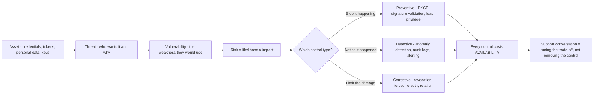
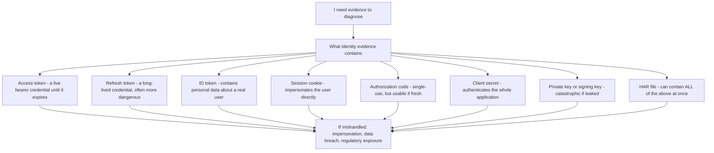
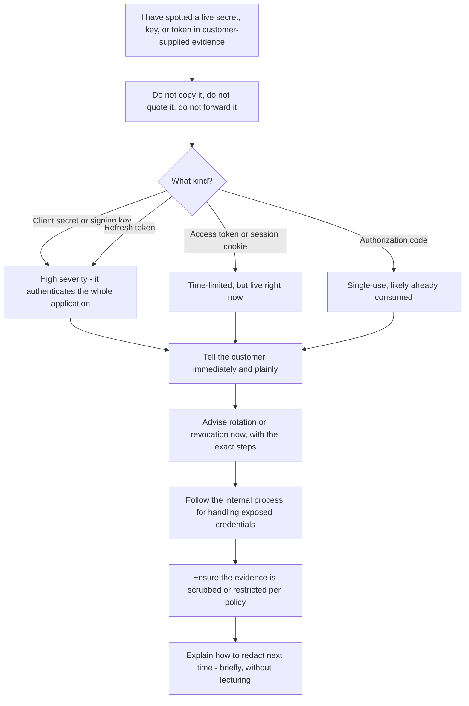
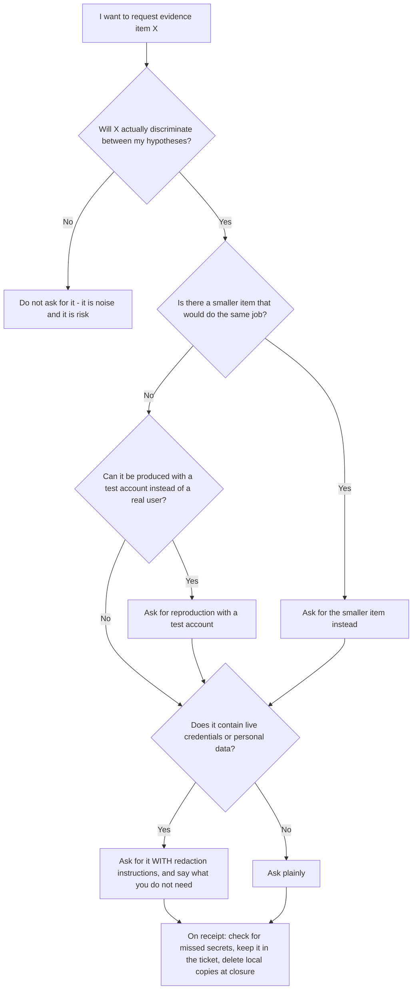

# Part 006 - Security, Privacy, and Safe Evidence Handling in Identity Support

> Section goal: Learn the rules that keep you, your customer, and their end users safe. In identity support the evidence itself is dangerous — a HAR file can contain live credentials, and a "helpful" workaround can create a breach. This Part gives you the basic security vocabulary, the redaction discipline, and the small set of things you must never do.

Covers index item **006**. Maps to JD signals: *knowledge of encryption and basic security concepts*, *understanding of authentication and authorization concepts*, *customer-obsessed attitude*, *promote best practices*, and *always secure, always on* as a stated company value.

---

## 1. Start From Zero: The Three Words Every Security Conversation Uses

Before any technique, learn the framework the whole industry reasons with. It is called the **CIA triad** — nothing to do with the agency.

| Letter | Property | Plain meaning | What breaks it | Identity example |
|---|---|---|---|---|
| **C** | Confidentiality | Only the right people can *see* it | Leak, eavesdropping, over-broad access | A token pasted into a public forum |
| **I** | Integrity | Nobody can *change* it undetected | Tampering, forgery, replay | An unsigned assertion an attacker edited |
| **A** | Availability | It works *when needed* | Outage, denial of service, lockout | Login down, or a legitimate user blocked by protection |

> **Analogy.** A sealed, tracked courier envelope. *Confidentiality* is the opaque envelope. *Integrity* is the tamper-evident seal. *Availability* is that it actually arrives on time.
>
> **Where the analogy stops:** with digital data, a confidentiality breach can be *silent and infinite* — copying a token leaves no gap where the original was, and the copy is perfect.

### 🔍 Plain-English deep-dive: why availability is a *security* property

Beginners assume security means "keep people out". But locking out every legitimate user is also a security failure — it means the system no longer performs its function.

This matters enormously in Customer Identity, where "we blocked a real customer" is a direct revenue loss. Every protective control is a **trade-off** between C/I and A:

| Control | Improves | Costs |
|---|---|---|
| Aggressive brute-force lockout | Confidentiality | Availability — real users locked out |
| Very short token lifetime | Confidentiality (smaller theft window) | Availability — more renewals, more failure points |
| Strict bot detection | Integrity (fewer fake accounts) | Availability — false positives at signup |
| Mandatory MFA for everyone | Confidentiality | Availability — enrolment friction, lost users |



**Why it matters for you:** when a customer says "your bot protection is blocking our users", they are not describing a bug. They are describing a trade-off that is currently mis-tuned for them. Framing it that way turns an argument into a design conversation (Part 108).

---

## 2. The Rest of the Core Vocabulary

Learn these now; every later Part uses them.

| Term | Plain meaning | Analogy | Why it matters here |
|---|---|---|---|
| **Asset** | Something worth protecting | The valuables in the house | In identity: credentials, tokens, personal data, keys |
| **Threat** | Something that could cause harm | A burglar | Credential stuffing, phishing, token theft |
| **Vulnerability** | A weakness a threat can use | An unlocked window | Missing signature validation, over-long token lifetime |
| **Risk** | Likelihood × impact | How likely, how bad | Guides how hard you push a customer to fix something |
| **Control** | Something that reduces risk | A lock, an alarm, a camera | MFA, rate limits, short lifetimes, audit logs |
| **Preventive control** | Stops it happening | A lock | Signature validation, PKCE |
| **Detective control** | Notices it happened | An alarm | Anomaly detection, log monitoring |
| **Corrective control** | Limits damage afterwards | Insurance, changing the locks | Token revocation, forced re-authentication |
| **Attack surface** | Everything an attacker can reach | Every door and window | Every endpoint, redirect URI, and connection |
| **Least privilege** | Give the minimum access needed | A cleaner's key opens the office, not the safe | Scope design, API permissions |
| **Defence in depth** | Multiple independent layers | Fence *and* lock *and* alarm | Never rely on one check |
| **Zero trust** | Verify explicitly every time; assume breach | Check the badge at every door, not just the lobby | Why tokens are validated on every request |
| **Blast radius** | How much is affected if this fails | How many rooms the fire reaches | Why tenant isolation and scoped tokens exist |

### 🔍 Plain-English deep-dive: "assume breach"

Older security thinking was **perimeter-based**: build a strong wall, and treat everything inside it as trusted. That model collapsed when applications moved to the cloud and users worked from anywhere — there is no longer a meaningful inside.

**Zero trust** replaces it with: *never trust because of location; verify explicitly every time; and design as though an attacker is already inside.*

Concretely, in the systems you will support:

- An API validates the token on **every** request, not once at login.
- A token names its **audience**, so a token for one API is useless at another.
- Tokens are **short-lived**, so a stolen one expires quickly.
- Sessions can be **revoked**, so a compromise can be contained.
- Everything is **logged**, so you can reconstruct what happened.

**Why it matters for you:** when a developer asks "why does my API need to validate the token — it came from your login page?", the answer is zero trust: the API cannot know where the token came from, only what the token says and whether the signature proves it. That is a concept question, not a configuration question, and answering it well is exactly the "promote best practices" duty in the JD.

---

## 3. Why Identity Evidence Is Uniquely Dangerous

Here is the thing that makes this job different from most support work:

**The evidence you need to diagnose an identity problem frequently *is* a working credential.**



### The HAR file problem

A **HAR** (HTTP Archive) is a JSON recording of everything the browser sent and received. It is the single most useful diagnostic artifact in this job — and the single most dangerous.

An unredacted HAR of a login flow typically contains:

- Every `Authorization: Bearer …` header, i.e. live access tokens.
- Every `Cookie:` and `Set-Cookie:` header, i.e. session credentials.
- The authorization code in the callback URL.
- The full token response body, including refresh tokens.
- Sometimes the client secret, if a confidential client's request was captured.
- The user's email, name, and profile claims.

**A HAR is not a log file. It is a bag of live keys.** Treat every HAR you receive as if it were a password, because functionally it contains several.

> **Analogy.** Asking for a HAR is like asking a customer to photocopy everything in their wallet to help you diagnose why their card was declined. Extremely useful. Also, now you are holding their cards.
>
> **Where the analogy stops:** a photocopy of a card cannot be used at a shop. A copied token *can* be used, immediately, by anyone.

---

## 4. The Redaction Discipline

You will receive sensitive evidence constantly. Handle it with a fixed routine rather than judgement in the moment.

### What to redact, always

| Item | How to recognise it | What to do |
|---|---|---|
| Access / refresh / ID tokens | Long strings, often three dot-separated Base64url segments | Replace the **signature** segment; keep header and payload if you need the claims |
| `Authorization` headers | `Bearer …`, `Basic …` | Replace the value entirely with `REDACTED` |
| Cookies | `Cookie:` / `Set-Cookie:` | Replace values; keep names and attributes — those are the diagnostic part |
| Client secrets | In a token request body, or config | `REDACTED` — never keep, never quote back |
| Private keys / PEM blocks | `-----BEGIN … PRIVATE KEY-----` | Remove entirely; treat as an incident if it was shared |
| Authorization codes | `code=` in a callback URL | Redact; note only its presence and length |
| Personal data | Email, name, phone, address, IP, user IDs | Replace with `user@example.com`, `USER_1`, etc. |
| Tenant / customer identifiers | Domains, tenant names, org IDs | Replace with `TENANT`, `example.com` when sharing outside the case |

### What to *keep* — because it is the actual diagnostic value

| Keep | Why |
|---|---|
| HTTP status codes | The primary signal |
| Header **names** (not values) | Presence/absence is often the bug |
| Cookie **names and attributes** (`SameSite`, `Secure`, `Domain`, `Path`) | The exact failure cause in many SSO cases |
| Redirect chain — the sequence of URLs, with sensitive parameters redacted | Shows where the flow diverged |
| Token **header and payload claims** (`alg`, `kid`, `iss`, `aud`, `exp`, `iat`, `sub`, `scope`) | The ground truth of what was issued |
| Error codes and `error_description` | Directly diagnostic |
| Timestamps with timezone | Correlation with server logs |
| Correlation / request IDs | The link to server-side evidence |
| SDK / framework / runtime versions | Behavior varies by version |

### 🔍 Plain-English deep-dive: redacting a JWT safely

A JWT has three dot-separated parts: `header.payload.signature`.

- The **header** and **payload** are only Base64url-*encoded*, not encrypted. Anyone can read them. They contain the diagnostic claims you actually need.
- The **signature** is what makes the token *usable*. Without a valid signature, the token is inert.

So the safe pattern is: **share `header.payload`, drop the signature.**

```
eyJhbGciOiJSUzI1NiIsImtpZCI6ImFiYzEyMyJ9.eyJpc3MiOiJodHRwczovL3RlbmFudCIsImF1ZCI6ImFwaSJ9.REDACTED
```

Two important caveats:

1. **The payload still contains personal data.** `email`, `name`, `sub` are all in there. Removing the signature makes it *unusable*, not *non-personal*. Redact personal claims too when sharing beyond the case.
2. **Decode locally.** Do not paste a customer's token into a public online decoder or an AI service, even with the signature removed. Part 040 covers local decoding tools.

**Analogy:** the signature is the hologram on a banknote. Without it, the note still shows the denomination and serial number, but no shop will take it. **Where it stops:** unlike a banknote, the "denomination and serial number" on a token can identify a real person.

---

## 5. Data Privacy: The Rules You Are Actually Bound By

Customer Identity handles personal data about members of the public, which brings it under consumer privacy law. You do not need to be a lawyer, but you must know the principles because they constrain what you may ask for.

| Principle | Plain meaning | What it means for a support engineer |
|---|---|---|
| **Data minimisation** | Collect only what you need | Ask for the *specific* failing request, not "send us all your logs" |
| **Purpose limitation** | Use it only for the stated purpose | Case evidence is for the case, not for anything else |
| **Storage limitation** | Do not keep it longer than needed | Delete local copies of customer evidence when the case closes |
| **Integrity and confidentiality** | Protect what you hold | Never store evidence outside approved systems |
| **Accountability** | Be able to show you complied | Attach evidence to the ticket; do not keep private copies |
| **Data-subject rights** | Individuals can access, correct, port, and erase their data | Customers will ask you *how* to fulfil these; that is a real ticket category |

**Named regimes you should be able to reference:** the EU/UK **GDPR**, India's **Digital Personal Data Protection Act (DPDP)** — directly relevant to a Bengaluru-based role — and California's **CCPA/CPRA**. You are not expected to advise on the law; you are expected to know that these constrain the design and to route legal questions to the right people.

### 🔍 Plain-English deep-dive: the "just send me everything" antipattern

It is tempting to say "please attach all your logs and a full HAR" because more data means more chances of finding the answer.

Three reasons not to:

1. **Legally**, it violates data minimisation. You have asked for personal data you did not need.
2. **Operationally**, it produces noise. A 40 MB HAR of an entire session is harder to read than a 200 KB HAR of the specific failing flow.
3. **Practically**, it increases the chance the customer sends something catastrophic — a private key, an admin session cookie, another user's data.

**The professional version:** *"Please reproduce the failure with a test account, capture a HAR with 'preserve log' enabled starting from the sign-in click, and redact the `Authorization` and `Cookie` header values before sending. I need the redirect chain and the status codes; I don't need the token signatures."*

That request is smaller, safer, more useful, *and* it teaches the customer good practice — which is the "promote best practices" duty again.

> 💡 **Tie-in to your background:** you already handle sensitive customer diagnostics — HAR logs, Fiddler traces, network captures, Procmon output from enterprise environments. The discipline transfers directly. What is *new* is that in identity, the sensitive item is not buried in the data — the sensitive item **is** the data you asked for.

---

## 6. Things You Must Never Do

This is a short, absolute list. Everything else is judgement; these are not.

| Never | Why | What to do instead |
|---|---|---|
| **Ask for a user's password** | You never need it, and asking normalises phishing | Ask for a test account, or reproduce with your own |
| **Advise disabling signature validation** | Turns a secure system into a forgeable one | Diagnose *why* validation fails — usually `kid`, `iss`, `aud`, or clock skew |
| **Advise disabling certificate verification** | Makes the connection interceptable | Fix the trust chain; find the missing intermediate or the inspecting proxy |
| **Advise removing the `state` parameter** | Removes CSRF protection | Fix why `state` is not round-tripping — usually cookie or session storage |
| **Advise a long-lived access token to "avoid renewals"** | Creates an unrevocable long-window credential | Refresh tokens with rotation (Part 061) |
| **Paste customer tokens or secrets into public tools or AI services** | Exfiltrates a live credential to a third party | Decode locally (Part 040) |
| **Store customer evidence outside approved systems** | Breaks accountability and retention control | Attach to the ticket; delete local copies at closure |
| **Quote a client secret back in a reply** | Puts it in another system, another inbox, another backup | Confirm only its length or first characters if identification is truly needed |
| **Keep a copy "in case it's useful later"** | Violates storage limitation, and grows your blast radius | Delete at closure |
| **Ignore an exposed secret because "it's their problem"** | It is your duty of care, and often your platform's exposure too | Tell them immediately, tell them to rotate, follow your internal disclosure process |

### 🔍 Plain-English deep-dive: what to do when a customer sends you a live secret

This *will* happen. A developer pastes a full unredacted config, or an unredacted HAR, into a ticket. Have a routine.



**How to say it without embarrassing them:**
> *"Quick heads-up before we continue: the config you attached includes your client secret in plain text. That happens constantly and it's an easy thing to miss, but I'd rotate it now to be safe — here's how. I've flagged the attachment internally so it's handled properly. For future captures, redacting the `Authorization` and `Cookie` values is enough; I don't need the signatures."*

Direct, unembarrassing, actionable, and it teaches the habit. Handling this well is a genuine trust-building moment.

---

## 7. Failure Modes

| Failure mode | What it looks like | Consequence | Correction |
|---|---|---|---|
| **"Send me everything"** | Broad, unbounded evidence request | Legal exposure, noise, risk of receiving a key | Specific, justified, minimal request |
| **Silent handling of an exposed secret** | You notice, you say nothing | Credential stays live; you now share the liability | Tell them immediately, advise rotation, follow process |
| **Convenience over security** | "Just turn off validation and see if it works" | Ships a vulnerability; sometimes permanently | Diagnose the validation failure properly |
| **Public tool for a private token** | Pasting into an online decoder | Live credential sent to a third party | Decode locally |
| **Personal copies** | Evidence saved to your own machine "just in case" | Retention violation, expanded blast radius | Ticket is the system of record; delete local copies |
| **Screenshot complacency** | Assuming an image is safe | Screenshots routinely contain tokens in URLs and DevTools panes | Review every image before it leaves the case |
| **Over-collecting personal data** | Asking for real users when a test account would do | Minimisation violation, and slower | Always ask for reproduction with a test account first |
| **Treating availability as non-security** | Dismissing "protection blocked real users" | Real revenue loss, and a mis-tuned control persists | Treat it as a trade-off conversation |
| **Lecturing** | A paragraph on security hygiene after a mistake | Damages the relationship, and they already feel bad | One sentence, then move on |

---

## 8. Troubleshooting Decision Tree: "Can I Ask For This Evidence?"



**Worked example.** You suspect a cookie `SameSite` problem breaking a silent authentication call.

- **Does it discriminate?** Yes — `SameSite` attributes will confirm or eliminate it immediately.
- **Smaller item?** Yes. You do not need a full HAR. You need the `Set-Cookie` headers from the login response and the request headers on the silent call.
- **Test account?** Yes — this reproduces with any account.
- **Sensitive?** Yes — cookie values are session credentials.
- **Therefore ask:** *"Could you reproduce with a test account, then send just the `Set-Cookie` response headers from the login and the request headers on the failing `/authorize` call? Please replace the cookie **values** with `REDACTED` — I need the cookie names and their `SameSite`, `Secure`, `Domain` and `Path` attributes, not the values themselves."*

Smaller, safer, faster, and it demonstrates competence. A customer who receives that request immediately understands they are dealing with someone who knows what they are doing.

---

## 9. Lab: Build and Test Your Redaction Routine

**Purpose.** Turn redaction from a judgement call into a mechanical routine, using entirely synthetic data.

**Prerequisites.** A text editor. **No customer data, no real tokens, no real accounts.** Everything in this lab is invented by you.

**Steps.**

1. Create `okta-prep/artifacts/security/`.
2. **`synthetic-har-excerpt.json`** — hand-write a *fake*, small HAR-shaped JSON excerpt containing: a `/authorize` request, a callback with `code=` and `state=`, a `/oauth/token` POST with a fake `client_secret`, a token response with fake `access_token`, `refresh_token`, `id_token`, and `Set-Cookie` headers with `SameSite=None; Secure`. Make every value obviously fake — `FAKE_SECRET_DO_NOT_USE`, `aaa.bbb.ccc`. This is deliberately synthetic so the artifact is safe to keep and show.
3. **`redacted-har-excerpt.json`** — produce the redacted version by hand, applying §4's rules. Keep everything in the "keep" column; redact everything in the "redact" column.
4. **`redaction-checklist.md`** — write the routine as a numbered checklist you could run in 60 seconds on any incoming evidence. Include a "scan for these strings" list: `Bearer `, `Cookie:`, `client_secret`, `refresh_token`, `BEGIN PRIVATE KEY`, `code=`, `password`.
5. **`evidence-request-templates.md`** — write four specific, minimal evidence requests, each with a justification per item and explicit redaction instructions: (a) login page fails to load, (b) callback error, (c) API returns 401, (d) enterprise SSO sends the user to the wrong provider.
6. **`exposed-secret-script.md`** — write the notification message from §6 in your own words, in three variants: client secret, private key, and refresh token. Each must be direct, unembarrassing, and actionable.
7. **`cia-tradeoffs.md`** — write four Customer Identity controls and state, for each, what it improves and what it costs in availability terms.
8. Test yourself: hand the synthetic HAR to your own checklist and time it. Under 60 seconds, and nothing from the redact list should survive.

**Expected evidence.** Seven files in `security/`, all synthetic, all safe to show an interviewer.

**Validation rubric.**

| Check | Pass condition |
|---|---|
| Everything is synthetic | No real token, secret, domain, email, or tenant appears anywhere |
| Redaction is complete | Running the checklist over the synthetic HAR leaves zero items from the redact list |
| Diagnostic value preserved | The redacted version still shows status codes, header names, cookie attributes, and claims |
| Requests are minimal | Each of the four requests asks for the smallest sufficient artifact |
| Each item is justified | Every requested item states what it would discriminate |
| Scripts are non-lecturing | Each exposed-secret variant is under 60 words and contains no reprimand |
| Timed | Checklist run completed in under 60 seconds |

**Cleanup and privacy.** This lab uses only data you invented. Do **not** substitute a real HAR from your current employer, a real token from any system, or any real customer's data — that would breach your current employer's confidentiality and defeat the purpose. If you ever practise on a real capture, it must be from your own free-tier lab tenant with your own test account, and it must be deleted afterwards.

---

## 10. JD Mapping

| Supplied JD signal | How this Part supports it |
|---|---|
| Knowledge of encryption and basic security concepts | §§1–2 build CIA, threat/vulnerability/risk/control, least privilege, defence in depth, and zero trust from zero |
| Understanding of authentication and authorization concepts | §2's zero-trust explanation is the conceptual reason tokens are validated on every request |
| Promote best practices | §§5–6 turn every evidence request into a teaching moment about redaction and safe patterns |
| Customer-obsessed attitude | §6's exposed-secret script protects the customer without embarrassing them |
| Resolve technical and non-technical issues | §5's privacy principles cover the data-subject-request ticket category, which is non-technical but real |
| Always secure. Always on. (company value) | §1's framing of availability as a security property is exactly this value's meaning |
| Business and technical analysis skills | §8's tree forces you to justify every request by its discriminating value |
| Operational management of tickets | §5's accountability principle: the ticket is the system of record, not your laptop |

---

## 11. Candidate Honesty Note

- **Production transfer:** you already handle sensitive enterprise diagnostics — HAR logs, Fiddler traces, network captures, Procmon — under a large employer's data-handling rules. That discipline is real and claimable.
- **Genuine shift to name:** in your current work, the sensitive material is usually *inside* the diagnostic data. In identity support, the diagnostic data *is* the credential. Saying this out loud shows you understand the difference rather than assuming the skills are identical.
- **Lab:** the redaction checklist and evidence-request templates are showable artifacts. If asked "how do you handle sensitive customer data?", describing a 60-second mechanical checklist is far stronger than describing good intentions.
- **Do not claim** security-specialist expertise. You are a support engineer with sound security hygiene and solid fundamentals — that is what the JD asks for ("basic security concepts"), and overclaiming here is easily exposed.
- **Confidentiality:** never use a real capture from your current employer in a portfolio artifact, even redacted.

---

## 12. Official Source Anchors

Accessed **26 August 2026**.

| Source family | Use it for |
|---|---|
| Okta trust and security pages, and the Okta Secure Identity Commitment | The vendor's own stated security posture and commitments |
| Auth0 documentation — security topics and attack protection | How the platform's protective controls are described and configured |
| IETF RFCs — OAuth 2.0 Security Best Current Practice, JWT (RFC 7519) | Authoritative statements on what must be validated and why |
| OWASP — Top Ten and cheat sheet series | Standard vocabulary for web and authentication vulnerabilities |
| NIST digital identity guidelines | Assurance levels and authenticator terminology (used in Part 049) |
| EU/UK GDPR, India's Digital Personal Data Protection Act, California CCPA/CPRA | The primary texts behind the privacy principles in §5 |
| HAR specification / browser DevTools documentation | What a HAR actually contains, which is the basis of §3 |

**Revalidate after 26 August 2026:** vendor security feature naming and any specific attack-protection capabilities.

---

## ⭐ Likely Interview Questions for This Section

### Q1. "What are the basic security concepts you'd expect to use in this role?"
> *Model answer:* "The CIA triad is the frame — confidentiality, integrity, availability. Then threat, vulnerability, risk and control, split into preventive, detective and corrective. And two principles that show up constantly in identity: least privilege, which is why scopes should be narrow and why an access token names its audience; and zero trust, which is why an API validates the token on every single request rather than trusting that it came from a login page. The one people underrate is availability being a *security* property — in customer identity, blocking a legitimate user is a real security failure, not a safe default, because it costs the customer revenue. Almost every protective control is a trade-off against availability, and part of the job is helping customers tune that."

### Q2. "A customer sends you a HAR file. What's your first move?"
> *Model answer:* "Before I analyse it, I scan it for live credentials, because a HAR of a login flow is not a log file — it's a bag of live keys. It'll typically contain `Authorization` bearer headers, `Set-Cookie` session credentials, the authorization code in the callback URL, the full token response including refresh tokens, and sometimes a client secret. I run a fixed 60-second checklist: search for `Bearer `, `Cookie:`, `client_secret`, `refresh_token`, `BEGIN PRIVATE KEY`, and `code=`. If I find something high-value like a client secret or a signing key, I tell the customer immediately and plainly, advise rotation with the exact steps, and follow the internal process for exposed credentials. Then I keep the file in the ticket as the system of record rather than on my own machine, and delete local copies when the case closes."

### Q3. "How do you decide what evidence to ask a customer for?"
> *Model answer:* "Three filters. First: will this actually discriminate between my hypotheses? If it won't change what I do next, it's noise and unnecessary risk. Second: is there a smaller artifact that does the same job? If I suspect a `SameSite` cookie problem, I don't need a full HAR — I need the `Set-Cookie` headers from the login response and the request headers on the failing call. Third: can it be produced with a test account rather than a real user's data? Then I ask for everything I foresee needing in one message, with a reason per item, and explicit redaction instructions that say what I *don't* need. That's smaller, safer, faster, and it teaches the customer good practice at the same time."

### Q4. "A developer asks you how to disable signature validation so they can test something. What do you say?"
> *Model answer:* "I'd say no, and then I'd solve their actual problem, because that request is always a symptom. Disabling signature validation turns a system where tokens are unforgeable into one where anyone can mint a token — and the thing about a testing shortcut is that it very often ships. So I'd redirect: validation is failing for a specific reason, and there are only a handful. Usually it's a `kid` mismatch because keys rotated and the JWKS cache is stale; or the wrong issuer because they're pointing at a different tenant or a custom domain; or the wrong audience; or clock skew on their server. I'd ask for the decoded token header and the exact validation error, and diagnose it properly. If they genuinely need to test without a live authorization server, the supported pattern is a local test key pair, not disabled validation."

### Q5. "What privacy considerations apply in customer identity support?"
> *Model answer:* "Customer identity handles personal data about members of the public, so consumer privacy regimes apply — GDPR in Europe and the UK, the DPDP Act in India which is directly relevant to a Bengaluru-based role, and CCPA in California. I'm not a lawyer, but the principles constrain my day-to-day. Data minimisation means I ask for the specific failing request, never 'send us all your logs'. Purpose limitation means case evidence is for the case only. Storage limitation means I delete local copies at closure and keep the ticket as the record. And data-subject rights — access, correction, portability, erasure — generate a real ticket category, where customers ask how to fulfil a request in the platform. Legal interpretation goes to legal; the mechanics are mine."

### Q6. "A customer's bot protection is blocking legitimate users. Is that a bug?"
> *Model answer:* "Usually not a bug — it's a mis-tuned trade-off, and framing it that way turns an argument into a design conversation. Every protective control trades confidentiality or integrity against availability. Aggressive bot detection reduces fake signups and increases false positives at signup, which in a consumer product is direct revenue loss. So I'd start with the evidence: what signal fired, on which requests, for which population. Often there's a pattern — a corporate NAT making many users share one IP, an automated health check, a mobile carrier gateway, or a legitimate load test. Then it becomes a conversation about tuning, allow-listing, or moving the check to a different point in the flow. It's only a bug if the control fired against something it's documented not to fire against."

### Q7. "What would you do if you found a client secret in a ticket attachment?"
> *Model answer:* "Treat it as live and act immediately. I don't copy it, quote it, or forward it. I tell the customer plainly and without embarrassing them — something like 'heads-up, the config you attached includes your client secret in plain text; that happens constantly and it's easy to miss, but I'd rotate it now to be safe, here's how.' Then I follow the internal process for handling exposed credentials so the attachment is scrubbed or restricted per policy. And I add one short sentence about redaction for next time — one sentence, not a lecture, because they already feel bad and lecturing damages the relationship without adding safety. A client secret authenticates the whole application, so this is high severity; a spent authorization code would be much lower."

### Q8. "Explain zero trust to a developer who asks why their API has to validate a token that came from your login page."
> *Model answer:* "The API can't know where the token came from. All it receives is bytes in an `Authorization` header — there's no channel that tells it 'this arrived from a legitimate login'. Anyone can send bytes to a public endpoint. So the only thing the API can rely on is what the token *proves about itself*: the signature proves it was issued by a key it trusts, `iss` proves which authorization server, `aud` proves it was meant for *this* API and not a different one, and `exp` proves it hasn't expired. That's zero trust in one sentence — verify explicitly every time, don't trust based on where something appears to have come from. And it's why validating only the signature isn't enough: a correctly-signed token issued for a completely different API would pass a signature-only check."

---

## 🧠 30-Second Memory Hooks

- **CIA = Confidentiality · Integrity · Availability.** Availability *is* a security property.
- **Every protective control trades against availability.** "Blocked real users" = mis-tuned trade-off, not a bug.
- **Zero trust:** verify explicitly, every request, assume breach. The API cannot know where the token came from.
- **A HAR is not a log file — it is a bag of live keys.**
- **Redact:** tokens' signatures · `Authorization` · cookie **values** · secrets · keys · `code=` · personal data.
- **Keep:** status codes · header **names** · cookie **attributes** · claims · errors · timestamps · correlation IDs · versions.
- **JWT = header.payload.signature.** Drop the signature; the payload is still personal data.
- **Decode locally.** Never paste a customer token into a public tool or an AI service.
- **Never:** ask for a password · disable signature or certificate validation · remove `state` · extend token lifetime as a fix.
- **Exposed secret script:** tell them now · advise rotation with steps · follow process · one sentence of teaching, no lecture.
- **Minimal request beats "send me everything"** — legally, operationally, and for your own safety.

---

## ✅ Completion Checklist

- [ ] **Knowledge:** I can define CIA, explain why availability is a security property, and state the zero-trust reason an API validates every request.
- [ ] **Lab artifact:** seven synthetic files exist in `security/`, and my checklist run on the synthetic HAR took under 60 seconds with nothing missed.
- [ ] **Spoken:** I read the exposed-secret script aloud and it contains no reprimand.
- [ ] **Honesty check:** every artifact is synthetic; no real employer, customer, or platform data is present anywhere.
- [ ] **Source check:** I have read Okta's trust/security page and skimmed the OWASP Top Ten myself.

---

*Next suggested section:* **[Part 007 - Building a Safe, Free Identity Lab](Part-007-building-a-safe-free-identity-lab.md)** — you now know the rules for handling evidence; next, build the sandbox where you will generate all of it yourself, safely and for free.
