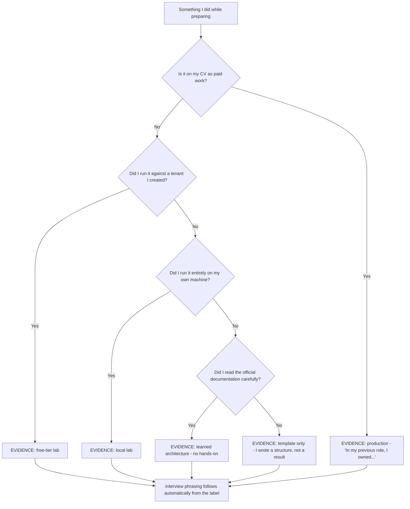
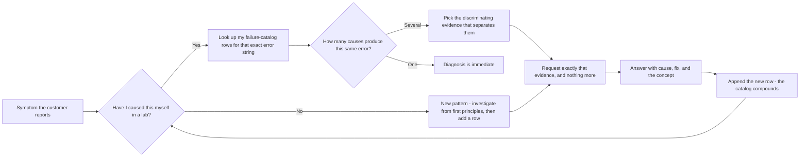
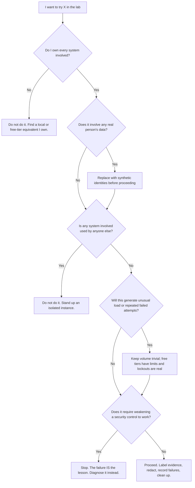

# Part 007 - Building a Safe, Free Identity Lab

> Section goal: Stand up the sandbox that every later Part depends on — free-tier tenants, local applications, local tooling, a synthetic directory, and a folder structure that turns each experiment into a labelled, showable artifact. Also fix the safety rules now, so no lab work can ever embarrass you in an interview or breach anyone's trust.

Covers index item **007**. Maps to JD signals: *self-starter — able to come up to speed on complex concepts with minimal assistance*, *continuous growth*, *proficient in at least one programming language*, *knowledge of software development fundamentals*, and *knowledge of HTTP, encryption, and basic security concepts*.

---

## 1. Start From Zero: Why a Lab At All?

You can read about the authorization code flow twenty times and still freeze when an interviewer says *"walk me through what happens when the `state` parameter doesn't come back."*

The reason is that reading builds **recognition** while doing builds **recall**. Recognition lets you nod along to a correct explanation. Recall lets you produce one under pressure.

A lab also gives you something a reading-only candidate can never have: **evidence**.

| Without a lab | With a lab |
|---|---|
| "I understand OAuth" | "I built it, then broke it — here's the HAR of the PKCE mismatch failure" |
| "I'm familiar with SAML" | "Here's an assertion I decoded by hand, with the signature scope annotated" |
| "I know JavaScript" | "Here's a SPA and an Express API with a working login, in a repo" |
| Claims that invite probing | Artifacts that end the probing |

> **Analogy.** Learning identity protocols without a lab is like learning to swim from a book. You will be able to describe the front crawl accurately, right up until you are in the water.
>
> **Where the analogy stops:** unlike swimming, you can genuinely learn most of this from a keyboard — you just have to actually type.

### 🔍 Plain-English deep-dive: the three kinds of lab exercise, and why "break it" matters most

- **Build it** — make the happy path work. *Analogy:* assembling flat-pack furniture by following the instructions. **Value:** you learn the vocabulary and the shape.
- **Read it** — capture and decode what actually went over the wire. *Analogy:* opening the back of the radio to see the components. **Value:** you learn where evidence lives, which is the core support skill.
- **Break it** — deliberately introduce one fault and observe the exact failure. *Analogy:* a fire drill. **Value:** this is the one that maps directly to the job, because **support work is entirely the study of failure**.

Most self-taught learners only do "build it" and wonder why they still cannot debug. **For every flow you build, break it in at least three ways and record the exact error each time.** That file — symptom to cause — is your future decision tree (Parts 113–114) and, honestly, your most valuable interview asset.

---

## 2. The Lab Safety Charter

Write this down and keep it at the top of your lab folder. It is short, absolute, and it protects you.

| Rule | Why |
|---|---|
| **Only my own accounts and my own tenants.** | Testing anything you do not own is unauthorised access, regardless of intent |
| **No scanning, probing, or load-testing anyone else's infrastructure.** | Same reason. This includes "just curling their endpoint a lot" |
| **No real customer, employer, or third-party data. Ever.** | Confidentiality, privacy law, and professional integrity |
| **Synthetic users only** — invented names, `example.com` addresses, mailbox aliases I control. | Nothing in the lab should identify a real person |
| **No production anything.** Not my employer's, not a friend's, not a side project with real users. | Blast radius |
| **Secrets never enter source control or notes.** Environment variables and a git-ignored file only. | One accidental commit is permanent |
| **Decode locally.** Never paste any token into a public decoder or an AI service — even a lab one, so the habit holds. | Habit is what saves you when it *is* a customer token |
| **Every artifact carries an evidence label.** | So a lab result is never mistaken for production experience |
| **Delete tenants and revoke keys when a Part is finished.** | Reduces standing exposure; also good practice |
| **Defang indicators in written notes** — `hxxps://`, `example.com`, `192.0.2.x`. | Prevents accidental clicks and accidental reuse |

### The four evidence labels

Every file you produce gets exactly one of these at the top. This is the mechanism that keeps your interview claims honest (Part 001).

```
EVIDENCE: free-tier lab
EVIDENCE: local lab
EVIDENCE: learned architecture (no hands-on)
EVIDENCE: template only
```

> **Why this is not bureaucracy.** In six weeks you will not remember whether you actually ran a thing or merely read about it. The label is a message to your future self, forty minutes before an interview.



### 🔍 Plain-English deep-dive: why free tiers are enough (and where they are not)

A recurring worry is that a free tier is "not the real thing", so lab work will not count.

For **protocol behavior**, a free tier is genuinely identical. The same authorization server issues the same tokens, signed the same way, with the same claims, over the same endpoints, and returns the same error codes. An `invalid_grant` you produce on a free tenant is the same `invalid_grant` a Fortune 100 customer produces. **This is the part you are trying to learn, and the free tier teaches it completely.**

What a free tier genuinely cannot teach you:

| Not learnable on a free tier | Why | Honest phrasing |
|---|---|---|
| Behavior at production scale | No load, no concurrency, no real user population | "I have not operated this under production load" |
| Rate-limit pressure in anger | You will never hit meaningful limits | "I understand the mechanics; I have not tuned for them at scale" |
| Enterprise support processes | No tickets, no SLAs, no escalation paths | "That is what I would learn in the first month" |
| Migration of a real user base | No legacy store, no cutover risk | "Learned architecture only" |
| Paid-tier features | Not enabled | Never claim a feature you could not switch on |

**Analogy:** a flight simulator teaches you the instruments, the procedures, and the failure drills perfectly. It does not teach you what it feels like to have two hundred passengers behind you. Both matter; only one of them is learnable on the ground. **Where it stops:** unlike a simulator, your lab uses the *actual production service*, so the protocol fidelity is not simulated at all — it is real.

---

## 3. What You Need

Everything here is free. Nothing requires a credit card for the level of use in this guide.

### Local tooling

| Tool | What it is | Why you need it | Note |
|---|---|---|---|
| **A modern browser** | Chrome, Edge, or Firefox | DevTools and HAR capture (Part 021) | You have this |
| **Node.js (LTS) + npm** | JavaScript runtime and package manager | SPA and Express labs (Parts 024–033) | Install from the official site |
| **Python 3** | Scripting | Your strongest language; useful for decoding and automation | You have this |
| **curl** | Command-line HTTP | Reproducing requests exactly (Part 022) | Built into modern Windows |
| **OpenSSL** | Cryptography toolkit | Certificates, keys, TLS inspection (Parts 037–039) | Ships with Git for Windows |
| **jq** | JSON processor | Reading discovery documents and API responses | Small download |
| **Git** | Version control | Your lab is a repo; also an SDLC skill (Part 009) | Install from the official site |
| **A code editor** | VS Code | Everything | You have this |
| **Postman** *(optional)* | API client | Collections and sharing (Part 022) | curl covers the same ground |
| **Wireshark** *(you already know it)* | Packet capture | TLS handshake observation (Part 038) | Only on your own traffic |

> 💡 **Tie-in to your background:** Wireshark, Fiddler, Netsh, browser DevTools and HAR are already on your CV. You are not starting a toolkit from scratch — you are adding `curl`, `openssl`, `jq`, and Node to a set you already use professionally. Say it that way in an interview.

### Free identity tenants

| Tenant | What it gives you | Used in |
|---|---|---|
| **Auth0 free plan** | A Customer Identity tenant: applications, APIs, database and social connections, Universal Login, Actions, tenant logs | Parts 056–110 — the core of the guide |
| **Okta Integrator Free Plan** | An Okta developer org: OAuth/OIDC apps, authorization servers, policies, system log | Parts 096, 108, and Workforce cross-coverage |
| **A free Microsoft Entra ID tenant** | App registrations, enterprise applications, SAML and OIDC federation, Conditional Access concepts | Parts 090–093 — your differentiator |
| **A social provider developer account** (e.g. Google Cloud console OAuth client) | An upstream OIDC provider to federate to | Parts 077, 100 |

**Rules for tenants:** use a personal email you control, never a work address. Give tenants obviously-lab names. Use synthetic users only. Delete them when you are done with the relevant Parts.

### Local supporting services

| Service | How | Used in |
|---|---|---|
| **A localhost web app** | `http://localhost:3000` — Express or a static SPA | Almost every flow lab |
| **A localhost API** | `http://localhost:4000` — Express with token validation | Parts 028, 043, 064 |
| **A local directory server** | A containerised or locally-installed LDAP server with a synthetic tree | Parts 087–088, 095 |
| **A local webhook receiver** | Small Express endpoint that logs and verifies signatures | Part 020 |
| **A self-signed certificate authority** | `openssl` — your own root, intermediate, and leaf | Parts 037–039 |

> **On localhost and HTTPS.** Browsers treat `http://localhost` as a secure context, so most flows work without TLS locally. Where a lab genuinely needs HTTPS, generate a certificate with your own local CA and trust it **in your own user store only**. Do **not** disable certificate validation, and do not add anything to a shared or machine-wide trust store you do not control.

---

## 4. The Folder Structure

A predictable structure is what turns scattered experiments into a portfolio.

```
okta-prep/
├── LAB-CHARTER.md              <- the rules from §2, read before every session
├── artifacts/                  <- outputs referenced by the master guide
│   ├── role-fit-matrix.md
│   ├── claim-safety-ledger.md
│   ├── 90-second-story.md
│   ├── gap-ledger.md
│   ├── company-brief.md
│   ├── identity-models.md
│   ├── answer-rewrites.md
│   ├── ops-kit/
│   └── security/
├── labs/
│   ├── 007-lab-setup/
│   ├── 021-har-capture/
│   ├── 028-express-api/
│   ├── 041-jwt-decode/
│   ├── 058-auth-code-flow/
│   ├── 059-pkce/
│   ├── 082-saml-decode/
│   ├── 088-ldap/
│   ├── 093-entra-connection/
│   └── ...one folder per lab, named for its Part
├── evidence/                   <- captures, redacted, never secrets
│   └── <part>-<what>-<date>/
├── failures/                   <- THE most valuable folder: symptom -> cause
│   └── failure-catalog.md
├── secrets/                    <- git-ignored, never committed
│   └── .env
└── .gitignore
```

### The lab manifest

Every lab folder gets a `MANIFEST.md`. It takes two minutes and makes the artifact usable months later.

```markdown
# Lab <part> - <name>
EVIDENCE: free-tier lab | local lab | learned architecture | template only
Date: YYYY-MM-DD
Goal: <one sentence - what question does this answer?>

## Prerequisites
- <tenant / tool / prior lab>

## Steps run
1. <command or action>  -> <what happened>

## Expected result
<what should happen if everything is correct>

## Actual result
<what did happen - including if it differed>

## Evidence produced
- <file>  (redacted: yes/no - what was removed)

## Interpretation
<what this proves, in one paragraph>

## Failure variants tried
| Fault injected | Exact error observed | Where it appeared |
|---|---|---|

## Limitations
<what this lab does NOT prove>

## Cleanup
- [ ] Secrets rotated or deleted
- [ ] Evidence redacted
- [ ] Tenant objects removed if no longer needed
```

The **"Failure variants tried"** table and the **"Limitations"** section are the two that matter most. The first becomes your troubleshooting knowledge. The second is what keeps you honest — "this lab does not prove I can operate this at production scale" is a sentence worth writing down while you still remember it is true.

```mermaid
flowchart LR
    Q["A question I cannot answer confidently"] --> Design["Design the smallest lab that answers it"]
    Design --> Build["Build the happy path"]
    Build --> Read["Capture and decode the wire evidence"]
    Read --> Break["Inject 3+ faults, one at a time"]
    Break --> Record["Record exact symptom for each fault"]
    Record --> Manifest["Write MANIFEST.md with limitations"]
    Manifest --> Catalog["Append to failures/failure-catalog.md"]
    Catalog --> Clean["Redact evidence, rotate secrets, clean up"]
    Clean --> Claim["Now claimable as LAB evidence, honestly"]
```



---

## 5. The Failure Catalog

This deserves its own section because it is the highest-value artifact in the whole guide.

`failures/failure-catalog.md` is a single growing table:

| Part | Fault injected | Exact symptom / error string | Where it appeared | Real-world cause this maps to |
|---|---|---|---|---|
| 059 | Sent the wrong `code_verifier` | `invalid_grant` — "Failed to verify code verifier" | Token endpoint response | SDK storing verifier in memory across a page reload |
| 065 | Removed `state` from the callback | SDK threw "Invalid state" | Client-side, before token exchange | Cookie blocked, or two tabs racing |
| 013 | Redirect URI differed by a trailing slash | `Callback URL mismatch` | Authorize endpoint, before login page | Environment promoted without updating the allow-list |
| 043 | Validated with the wrong `aud` | 401 from API, "jwt audience invalid" | Resource server | `audience` parameter omitted at login |
| 042 | Stale JWKS after key rotation | "Unable to find a signing key that matches `kid`" | Resource server | Cached JWKS with too long a TTL |



**Why this is so valuable:**

1. **It is exactly the job.** Support is symptom-to-cause mapping.
2. **It is interview gold.** "What does `invalid_grant` mean?" becomes "I've caused that four different ways in a lab — here's how to tell them apart."
3. **It compounds.** By Part 110 you will have 60+ rows, and it becomes the seed of Parts 113–114's decision trees.

> **Target: at least three fault injections per flow lab.** If a lab produced no failures, you learned half of what it had to teach.

---

## 6. Secrets Hygiene

| Practice | How |
|---|---|
| **Never commit secrets** | `.gitignore` includes `secrets/`, `.env`, `*.pem`, `*.key`, `*.p12` |
| **Environment variables, not literals** | Read `process.env.CLIENT_SECRET`, never paste it into code |
| **Rotate after a lab** | Regenerate client secrets when a lab folder is finished |
| **Never in notes or screenshots** | Redact before saving anything into `evidence/` |
| **Check before every commit** | `git diff --staged` and scan for `secret`, `token`, `key`, `password` |
| **If you do commit one** | Rotate it immediately. Do **not** rely on deleting the commit — assume it is public forever |

### 🔍 Plain-English deep-dive: why "just delete the commit" does not work

Git history is a chain of snapshots that has usually already been copied elsewhere — a remote, a fork, a CI cache, a colleague's clone, a code-scanning service. Removing a commit locally changes *your* copy of the chain. It does not un-copy the copies.

Therefore the only reliable response to a committed secret is: **treat it as public and rotate it.** Rewriting history afterwards is tidy-up, not remediation.

**Analogy:** posting your house key's photograph online and then deleting the post. The photograph may still exist in a dozen caches; the only actual fix is changing the lock. **Where it stops:** unlike a lock, rotating a client secret is free and takes thirty seconds — which is why there is no excuse not to.

---

## 7. Failure Modes in Lab Work

| Failure mode | What it looks like | Consequence | Correction |
|---|---|---|---|
| **Happy-path-only labs** | Everything worked; nothing recorded | You learned vocabulary, not diagnosis | Three fault injections per flow, minimum |
| **Tutorial-following without capture** | Followed a quickstart, never opened DevTools | You cannot explain what happened | Capture and decode every flow you build |
| **Unlabelled artifacts** | No evidence tier recorded | Six weeks later you cannot honestly say what you did | Manifest with `EVIDENCE:` on every lab |
| **Lab drift into production** | "I'll just test it against our real tenant" | Confidentiality breach; potentially a career problem | Charter rule one, no exceptions |
| **Secrets in the repo** | `.env` committed on day two | Permanent exposure | `.gitignore` first, before any code |
| **Using real personal data** | Your own real email, real phone for OTP | Ends up in a tenant you later abandon | Synthetic identities and controlled aliases |
| **Testing against someone else's endpoint** | "I'll just curl their `/authorize` a few hundred times" | Unauthorised activity | Only your own tenants; no load testing anything |
| **Disabling security to make it work** | Turning off certificate validation to get past a TLS error | Builds the wrong instinct, which you will then give to a customer | Fix the trust chain properly; that *is* the lesson |
| **Hoarding evidence** | Full unredacted captures kept indefinitely | Standing risk for no benefit | Redact at capture time, delete at Part completion |
| **Over-claiming afterwards** | "I have experience with Auth0" | Collapses under one interview question | "In a free-tier lab I built and broke…" |

---

## 8. Troubleshooting Decision Tree: "Is This Lab Activity Safe?"



**Worked example.** *"I want to see what happens when a token's signature is invalid."*

- **Own everything?** Yes — my tenant, my app, my API.
- **Real data?** No — synthetic user.
- **Used by others?** No — localhost.
- **Unusual load?** No — a handful of requests.
- **Weakening a control?** **Careful here.** The *wrong* version is "disable signature validation in my API and see if it accepts anything." The *right* version is "keep validation on, tamper with one character of the signature, and record the exact rejection error." Same learning objective; the second one builds the correct instinct and produces a failure-catalog row.

That distinction — *never disable the control, always break the input* — is the single most important habit in this whole Part.

---

## 9. Lab: Stand Up the Lab

**Purpose.** Complete the environment every later Part assumes, and produce your first manifest and first failure-catalog rows.

**Prerequisites.** A personal (non-work) email address you control. Administrator rights to install software on your own machine. Roughly two hours.

**Steps.**

1. **Charter first.** Create `okta-prep/LAB-CHARTER.md` and copy §2's rules in your own words. Read it before every session.
2. **Repo and ignores.** `git init` in `okta-prep/`. Create `.gitignore` containing at least:
   ```
   secrets/
   .env
   *.pem
   *.key
   *.p12
   node_modules/
   evidence/**/raw-*
   ```
   Commit the `.gitignore` **before** anything else exists.
3. **Folders.** Create the structure from §4, including empty `labs/`, `evidence/`, `failures/`, `secrets/`.
4. **Tooling.** Install Node.js LTS, Git, and jq. Verify each: `node -v`, `npm -v`, `git --version`, `jq --version`, `curl --version`, `openssl version`, `python --version`. Record the versions in your manifest — version awareness is a JD-relevant habit (Part 004).
5. **Synthetic identity set.** In `labs/007-lab-setup/synthetic-identities.md`, invent five test users: names, `@example.com` addresses, roles, and which connection each will use. Never a real person.
6. **Free-tier tenant.** Sign up for an Auth0 free-plan tenant using your personal email. Name it obviously (`demo-lab-<something>`). Create nothing else yet — later Parts will drive that.
7. **First capture.** Open the tenant's OIDC discovery document in a browser (`/.well-known/openid-configuration`), then fetch it with curl and pretty-print it with jq. Save the output to `evidence/007-discovery-<date>/discovery.json`. This is a public document — no redaction needed, and confirming that for yourself is part of the lesson.
8. **First fault injection.** Request a URL that does not exist on your tenant, and a discovery document with a deliberately wrong tenant name. Record both exact responses.
9. **Failure catalog.** Create `failures/failure-catalog.md` with the table header from §5 and your first two rows from step 8.
10. **Manifest.** Write `labs/007-lab-setup/MANIFEST.md` using the §4 template. Fill in **Limitations** honestly — for example, "proves the tenant exists and I can read public metadata; proves nothing about operating a tenant at scale."
11. **Commit.** `git add -A`, then run `git diff --staged` and scan for `secret`, `token`, `key`, `password` before committing. Make this scan a permanent reflex.

**Expected evidence.** A committed repository containing the charter, folder structure, tooling versions, five synthetic identities, one saved discovery document, two failure-catalog rows, and one complete manifest.

**Validation rubric.**

| Check | Pass condition |
|---|---|
| Charter exists and is in your words | Not a copy-paste; you can recite rule one |
| `.gitignore` committed first | Its commit precedes every other file |
| Tools verified | All eight version commands ran and are recorded |
| Identities are synthetic | No real name, real email, or real phone number anywhere |
| Tenant is obviously a lab | Name makes it unmistakable |
| Discovery captured | Valid JSON saved, pretty-printed |
| Failure catalog started | Two rows, with **exact** error text, not paraphrases |
| Manifest complete | Including a genuinely honest Limitations section |
| Staged diff scanned | You ran the scan and can describe what you looked for |

**Cleanup and privacy.** Nothing sensitive is produced by this lab — a discovery document is public metadata. Keep the tenant; later Parts use it. When you finish the guide (or if you stop), delete the tenant and revoke any credentials created. Never point any lab at a work system, a work account, or any system you do not personally own.

---

## 10. JD Mapping

| Supplied JD signal | How this Part supports it |
|---|---|
| Self-starter — come up to speed with minimal assistance | The whole Part *is* the self-directed ramp mechanism; the failure catalog is its measurable output |
| Continuous growth | §5's catalog and §4's manifests make growth visible and reviewable |
| Proficient in at least one programming language | §3 installs the Node and JavaScript toolchain used from Part 024 onward |
| Knowledge of software development fundamentals | §§4, 6 practise version control, environment configuration, secrets hygiene, and dependency versions |
| Knowledge of HTTP | Step 7's curl-and-decode of a discovery document is the first HTTP evidence exercise |
| Knowledge of encryption and basic security concepts | §6's secrets hygiene and §8's "never disable the control" rule |
| Instinctive ability to subdivide problems | §1's build/read/break split and §5's symptom-to-cause table are that ability, trained |
| Contribute to a knowledge repository | The failure catalog is a personal KB, built exactly as a team one would be |

---

## 11. Candidate Honesty Note

- **What the lab proves:** you can build, observe, and deliberately break identity flows, and you record evidence methodically. That is genuinely impressive for a candidate transitioning in.
- **What the lab does not prove:** operating a tenant at production scale, handling real customer volume, or working within Okta's actual processes and tooling. Write that in every manifest's Limitations section so you never blur it.
- **The exact phrase to use:** *"I have not operated this in production. In a free-tier lab I built the flow, captured the evidence, and injected these faults — here is what each one looked like."* That sentence is both honest and impressive.
- **Bring the failure catalog to the interview.** Not the file itself, but the content. "I've produced `invalid_grant` four different ways" is the kind of specific, verifiable statement that separates candidates.
- **Never** use your employer's tenant, accounts, tooling, or data for any lab exercise, and never include employer material in a portfolio artifact.

---

## 12. Official Source Anchors

Accessed **26 August 2026**.

| Source family | Use it for |
|---|---|
| Auth0 documentation — Get Started and Quickstarts | Free-plan signup, tenant creation, and the supported starting points |
| Okta developer site — Integrator Free Plan and its terms | The free developer org, and what its terms permit |
| Microsoft Learn — Microsoft Entra ID free tier and app registrations | Setting up the Entra tenant used in Parts 090–093 |
| Node.js and npm official sites | Current LTS version and installation |
| Git and Git for Windows documentation | Installation, `.gitignore` behavior, and the bundled OpenSSL |
| OpenSSL documentation | Local certificate authority and key generation used from Part 037 |
| jq manual | JSON filtering syntax used throughout |
| Browser DevTools / HAR documentation | What a HAR contains, used from Part 021 |

**Revalidate after 26 August 2026:** free-plan names, limits, and terms — these change, and the terms govern what you are permitted to do.

> **Read the free-tier terms before you start.** They define acceptable use. Following them is part of the professionalism you are demonstrating.

---

## ⭐ Likely Interview Questions for This Section

### Q1. "How have you prepared for a role in a product you haven't used?"
> *Model answer:* "I built a lab and worked through the protocols hands-on rather than only reading. Free-tier tenants, a localhost SPA and API, a local directory server, and my own certificate authority. But the part I'd emphasise is the method: for every flow I build, I also capture the wire evidence and then deliberately break it in at least three ways, recording the exact error each time. That gave me a symptom-to-cause catalog which is, functionally, what a support engineer's expertise actually is. So rather than 'I read about PKCE', I can say I've produced `invalid_grant` four different ways and can distinguish them from the error text alone."

### Q2. "How do you make sure your learning is honest — that you don't overstate it?"
> *Model answer:* "Every lab folder has a manifest with a mandatory evidence label — free-tier lab, local lab, learned architecture, or template only — and a Limitations section I write while it's fresh. So a manifest will literally say 'proves I can configure and debug this flow; proves nothing about operating it at production scale.' That's a note to my future self, because six weeks later you genuinely don't remember whether you ran something or just read it. It means when I'm asked in an interview I can say precisely 'I have not done this in production; in a free-tier lab I did X and here's what I observed', without having to guess at my own history."

### Q3. "What would you do if a lab exercise required disabling a security control?"
> *Model answer:* "I'd treat that as the signal that I've designed the exercise wrong. There's an important distinction: never disable the control, always break the *input*. If I want to understand what an invalid signature does, the wrong lab is 'turn off signature validation and see if it accepts anything' — that teaches nothing and builds a bad instinct I'd eventually offer to a customer. The right lab is 'keep validation on, tamper with one character of the signature, and record the exact rejection error.' Same learning objective, but now I have a real failure-catalog row and I've reinforced the correct habit. It matters because that instinct is exactly what I'd carry into a customer conversation."

### Q4. "How do you handle secrets in a personal project?"
> *Model answer:* "`.gitignore` committed before any code exists — `secrets/`, `.env`, `*.pem`, `*.key`. Secrets read from environment variables, never literals in source. A scan of `git diff --staged` for 'secret', 'token', 'key', 'password' before every commit, as a reflex. And rotation after a lab is finished, to reduce standing exposure. The important part is what happens if I do slip: deleting the commit is not remediation. Git history has usually already been copied — a remote, a fork, a CI cache, a scanning service — so the only reliable response is to treat it as public and rotate immediately. Rewriting history afterwards is tidy-up, not a fix."

### Q5. "What's the most valuable thing you produced while learning?"
> *Model answer:* "A failure catalog — a single table with the fault I injected, the exact error string, where it surfaced, and the real-world cause it maps to. It's the most valuable because it's the closest thing to the actual job. Support isn't knowledge of how things work, it's knowledge of how they *fail* and how to tell one failure from another that looks identical. For example, `invalid_grant` at the token endpoint can be an expired authorization code, a reused code, a PKCE verifier mismatch, or a revoked refresh token — four completely different causes with the same top-level error. Having caused all four deliberately means I diagnose from the surrounding evidence rather than guessing."

### Q6. "How do you keep lab work from touching anything real?"
> *Model answer:* "A written charter I read before each session, with the first rule being: only systems I personally own, no exceptions. Then synthetic identities only — invented names and `example.com` addresses, never a real person's data and never my employer's. Nothing production, including my own side projects if they have real users. And no scanning, probing, or load-testing anyone else's infrastructure, which includes 'just curling their endpoint repeatedly' — that's unauthorised activity regardless of intent. It sounds heavy for a personal lab, but the point is that habits formed in a lab are the habits you use on a customer's system, so I'd rather they be the right ones."

### Q7. "You listed JavaScript on your CV. How solid is it, really?"
> *Model answer:* "Honestly: Python is my strongest language and I'd say that first. JavaScript I'd been using at a working level rather than a deep one, so rather than just leave it as a line on a CV I built something. A single-page app and an Express API with a real login flow, token validation on the API side, and deliberate failure cases. That's not the same as being a professional front-end developer and I wouldn't claim it is. But it does mean when a developer sends me their auth code, I can read it, spot the problem, and write them a corrected snippet that actually runs — which is the level the job needs."

### Q8. "Two hours a day for a month — what would you focus on?"
> *Model answer:* "I'd front-load the two things with the widest blast radius: OAuth 2.0 with OIDC, because they're the majority of the ticket surface, and the browser layer — cookies, `SameSite`, CORS, redirects — because that's where the confusing failures live and it's what a HAR actually shows you. I'd do them as build-read-break cycles rather than reading, so each session ends with a capture and at least one failure-catalog row. Then SAML and enterprise connections, because that's where my Entra and Active Directory background gives me leverage. Product specifics I'd learn last, deliberately — a product surface is the fastest thing to learn on the job, and protocol depth is the slowest, so I'd rather arrive with the slow thing already done."

---

## 🧠 30-Second Memory Hooks

- **Reading builds recognition. Doing builds recall.** Interviews test recall.
- **Build it · Read it · Break it.** Support is the study of failure — so **break it** is the one that counts.
- **Three fault injections per flow, minimum.** No failures recorded = half the lesson missed.
- **Never disable the control — break the input.** Same lesson, right instinct.
- **Charter rule one: only systems I own.** No scanning, no probing, no load-testing anyone else.
- **Four evidence labels:** free-tier lab · local lab · learned architecture · template only.
- **Every manifest needs a Limitations section**, written while it is still fresh.
- **`.gitignore` before any code.** Scan the staged diff every time.
- **A committed secret is public. Rotate; do not rely on deleting the commit.**
- **The failure catalog is the portfolio's crown jewel** — symptom to cause is literally the job.

---

## ✅ Completion Checklist

- [ ] **Knowledge:** I can state the build/read/break cycle, the four evidence labels, and the "break the input, not the control" rule.
- [ ] **Lab artifact:** `okta-prep/` is a committed repo with charter, structure, verified tool versions, synthetic identities, a saved discovery document, two failure rows, and a complete manifest.
- [ ] **Spoken:** I can explain in 60 seconds what my lab is, what it proves, and what it explicitly does not prove.
- [ ] **Honesty check:** every artifact carries an evidence label, and my first manifest's Limitations section is genuinely honest.
- [ ] **Source check:** I have read the free-tier terms for every tenant I created.

---

*Next suggested section:* **[Part 008 - Identity Vocabulary, Personas, and System Context Maps](Part-008-identity-vocabulary-personas-and-system-context-maps.md)** — with the lab standing, establish the shared vocabulary and the mental map of who is who, so that every protocol Part from here has somewhere to attach.
