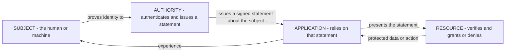
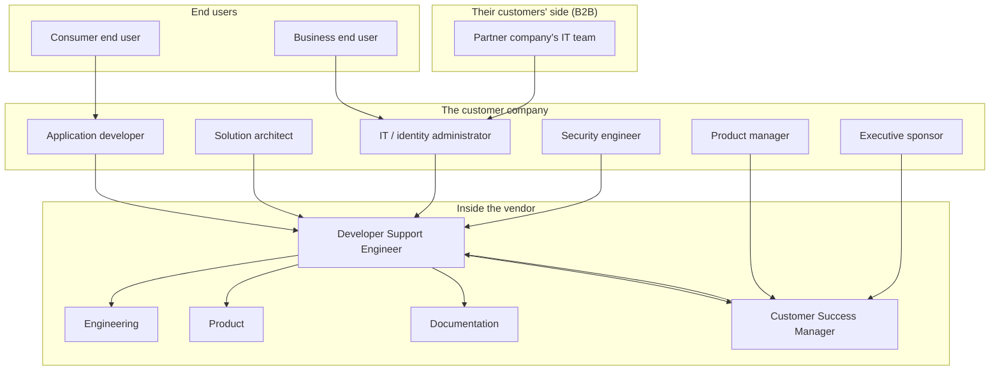
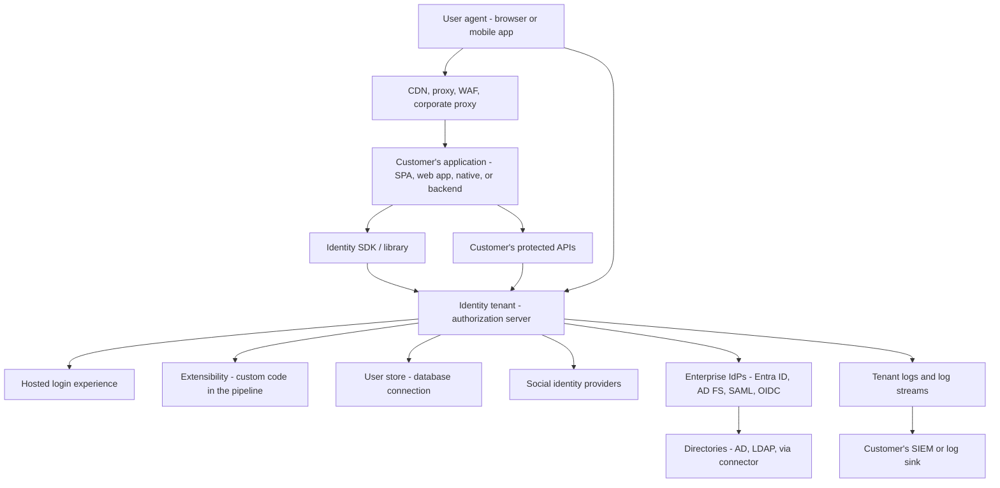
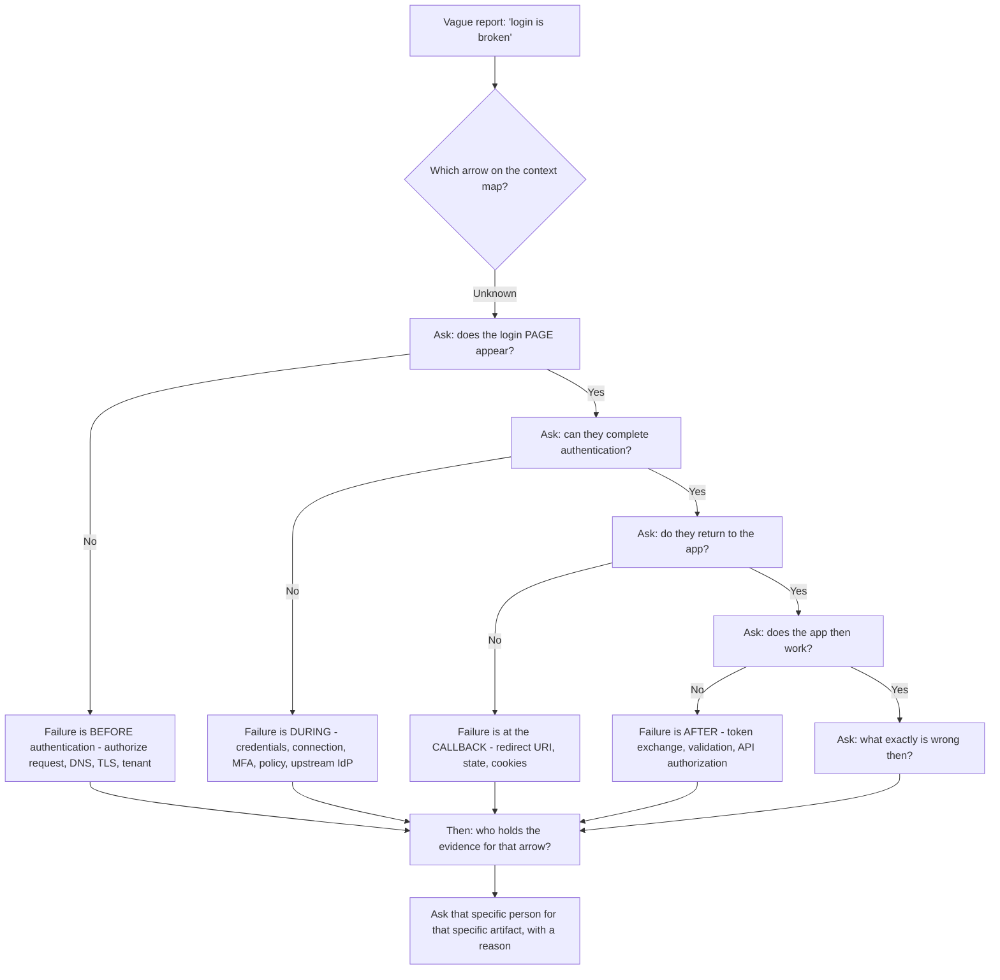

# Part 008 - Identity Vocabulary, Personas, and System Context Maps

> Section goal: Fix the vocabulary and the mental map once, so every protocol Part from here has somewhere to attach. The single biggest source of confusion in identity is that OAuth, OIDC, and SAML use *different words for the same actors* — this Part builds the translation table that makes all three readable.

Covers index item **008**. Maps to JD signals: *understanding of authentication and authorization concepts*, *knowledge of one or more auth protocols*, *knowledge of common architectures*, *self-starter on complex concepts*, and *team player with solid communication skills*.

---

## 1. Start From Zero: The Four Roles That Never Change

Underneath every identity protocol there are only four jobs. Every protocol renames them, but the jobs are constant.

| The job | What it does | Everyday equivalent |
|---|---|---|
| **The subject** | The person or machine whose identity is in question | You, at passport control |
| **The application** | The thing that wants to know who you are, or wants to act for you | The airline that needs to verify you |
| **The authority** | The thing that authenticates the subject and issues a trusted statement | The passport office |
| **The resource** | The thing being protected, which checks the statement before granting access | The gate agent who checks the boarding pass |

**Learn this diagram before any protocol.** Every flow you will ever debug is a variation on it, with different message formats and different words.

### 🔍 Plain-English deep-dive: why the same actor has five names

Historically, each protocol was designed by a different group solving a slightly different problem, and each invented its own vocabulary. Nobody harmonised them afterwards.

The result is that a single component — say, the thing that authenticates users and issues tokens — is called:

- **Identity Provider (IdP)** in SAML and in general conversation
- **OpenID Provider (OP)** in OIDC
- **Authorization Server (AS)** in OAuth
- **Security Token Service (STS)** in WS-Federation
- **Tenant** or **authorization server** in vendor documentation
- **"Okta"** or **"Auth0"** by the customer, who does not care about any of this

They are all describing the same box in the diagram. **Once you can translate, half of the apparent complexity disappears.**

**Analogy:** the same person is "Doctor" at work, "Mum" at home, "Ms Sharma" at the bank, and "you" to a friend. Four names, one person, and the name tells you which conversation you are in. **Where it stops:** unlike names for a person, protocol names carry technical implications — an OAuth authorization server is not obliged to authenticate anyone, whereas a SAML IdP always does.

---

## 2. The Translation Table

Print this. It is the single most useful page in the guide's early Parts.

| Role in plain English | OAuth 2.0 | OpenID Connect | SAML 2.0 | WS-Federation | Common vendor wording |
|---|---|---|---|---|---|
| The human or machine | Resource Owner | End-User | Principal / Subject | Requestor | User |
| The app the user is using | Client | Relying Party (RP) / Client | Service Provider (SP) | Relying Party (RP) | Application |
| The thing that authenticates | *(not defined)* | OpenID Provider (OP) | Identity Provider (IdP) | Identity Provider / STS | Authorization server, tenant, IdP |
| The thing that issues credentials | Authorization Server (AS) | OpenID Provider (OP) | Identity Provider (IdP) | Security Token Service (STS) | Authorization server |
| The protected API or data | Resource Server (RS) | *(uses OAuth's RS)* | *(implicit — the SP's own resources)* | Resource | API |
| The credential issued | Access token | ID token + access token | Assertion | Token (often a SAML assertion) | Token |
| Where the user is sent to log in | Authorization endpoint | Authorization endpoint | SSO service / SingleSignOnService | Sign-in endpoint | Login URL |
| Where the credential comes back | Redirect URI | Redirect URI | Assertion Consumer Service (ACS) | Reply URL / `wreply` | Callback URL |
| The app's identity | `client_id` | `client_id` | Entity ID / Issuer | Realm (`wtrealm`) | Client ID / App ID |
| Anti-CSRF value | `state` | `state` | `RelayState` *(also carries return context)* | `wctx` | State |
| Anti-replay value | *(n/a)* | `nonce` | `ID` + `NotOnOrAfter` conditions | Token lifetime conditions | Nonce |
| Config document | Authorization Server Metadata | Discovery document (`/.well-known/openid-configuration`) | Metadata XML | Metadata XML | Well-known / metadata |

### 🔍 Plain-English deep-dive: three traps in that table

1. **OAuth has no authentication role.** OAuth 2.0 is an *authorization* framework. It never defines how the user proves who they are — that is deliberately out of scope. This is exactly why OIDC exists, and it is the single most common conceptual error in interviews. (Full treatment in Part 070.)

2. **`state` and `RelayState` are not equivalents.** `state` in OAuth/OIDC exists primarily to bind the callback to the original request and defeat CSRF. `RelayState` in SAML is primarily a *return-context carrier* — "which page were they trying to reach?" — and is not itself a security control. Treating them as the same thing produces insecure SAML integrations.

3. **"Redirect URI" and "ACS URL" are the same idea, but validated differently.** OAuth/OIDC redirect URIs are typically matched with strict, exact comparison against an allow-list. SAML ACS URLs come from metadata and are matched against the registered SP configuration. Both are "where the credential is delivered", and in both, a mismatch is a top-three cause of tickets (Part 013).

---

## 3. The Full Working Vocabulary

Grouped so you can revise by area. Every term gets a plain meaning and a reason it matters.

### Identity and accounts

| Term | Plain meaning | Why it matters |
|---|---|---|
| **Identity** | A set of claims about a subject that a system believes | The thing being asserted, transported, and verified |
| **Account** | A record in a system representing a subject | One human may have several accounts |
| **Identifier** | A value that names a subject (`sub`, email, NameID) | Choosing a *stable* one is a design decision with support consequences |
| **Claim** | One statement about a subject ("email is x", "role is admin") | The atomic unit of what a token carries |
| **Attribute** | A property stored on a profile | Becomes a claim when it is put into a token |
| **Profile** | The stored collection of attributes | Where metadata size limits and token bloat originate |
| **Principal** | The acting entity (user or service) | Used heavily in SAML and Windows/Kerberos worlds |
| **Subject (`sub`)** | The token's canonical identifier for the principal | The one identifier you should key on; email is not stable |
| **Account linking** | Joining two identities that represent one human | Only ever on verified identifiers (Part 105) |

### Authentication

| Term | Plain meaning | Why it matters |
|---|---|---|
| **Authentication (AuthN)** | Proving who you are | Step one, always |
| **Credential** | The thing you present as proof | Password, key, certificate, biometric, token |
| **Factor** | A category of proof: know / have / are | MFA means factors from *different* categories |
| **MFA** | Two or more factors from different categories | Two passwords are not MFA |
| **Step-up** | Demanding more proof for a sensitive action | Common CIAM requirement |
| **Assurance level** | How confident we are in the identity | Drives policy decisions |
| **Session** | Server- or browser-held state that "you are still you" | *Three* different sessions exist (Part 075) |
| **SSO** | Sign in once, access several applications | The whole point of federation |
| **Silent authentication** | Renewing without user interaction | Breaks under third-party cookie restrictions (Part 076) |

### Authorization

| Term | Plain meaning | Why it matters |
|---|---|---|
| **Authorization (AuthZ)** | Deciding what you may do | Step two, always after AuthN |
| **Scope** | A requested *category* of access | Requested by the client, granted by the AS |
| **Permission** | A specific allowed operation | Often mapped from scopes and roles |
| **Role** | A named bundle of permissions | RBAC's unit |
| **Consent** | The user agreeing to grant access | Legally and technically significant in CIAM |
| **Audience (`aud`)** | Who a token is *for* | The most-missed validation check |
| **Least privilege** | Minimum access needed | Scope design principle |
| **Delegation** | Acting *on behalf of* someone, with the chain visible | Central to agent identity (Part 067) |
| **Impersonation** | Acting *as* someone, chain not preserved | Higher risk than delegation |

### Tokens and credentials

| Term | Plain meaning | Why it matters |
|---|---|---|
| **Token** | A string that carries or references authorisation | The currency of modern identity |
| **Bearer token** | Whoever holds it may use it | Like cash — hence short lifetimes |
| **ID token** | Proof of *authentication*, for the client | Never send it to an API as a credential |
| **Access token** | Proof of *authorization*, for an API | Must name its audience |
| **Refresh token** | Used to obtain new access tokens | Long-lived and therefore high value |
| **Authorization code** | A one-time voucher exchanged for tokens | Short-lived, single-use |
| **Opaque token** | A reference with no readable content | Validated by introspection |
| **JWT** | JSON Web Token — a self-describing, signed token | Readable by anyone; signed, not secret |
| **Assertion** | SAML's XML statement about a subject | Same job as a token, different format |
| **JWKS** | The public keys used to verify signatures | Cached; staleness is a classic bug |

### Federation and directories

| Term | Plain meaning | Why it matters |
|---|---|---|
| **Federation** | Trusting another system's identity assertions | The core of B2B and social login |
| **Trust** | The configured agreement to accept another party's statements | Established via metadata, keys, and configuration |
| **Connection** | A configured link to a source of users | Vendor term; database, social, or enterprise |
| **Home realm discovery** | Choosing which IdP a user belongs to | Cause of most "wrong login page" tickets |
| **JIT provisioning** | Creating the local user at first federated login | Where attribute mapping errors surface |
| **SCIM** | A standard API for provisioning users and groups | Push-based alternative to JIT |
| **Directory** | A hierarchical store of identities | AD, LDAP servers |
| **LDAP** | The protocol for querying a directory | Named explicitly in the JD |
| **Upstream / downstream** | Toward the IdP / toward the application | Precision that saves confusion in B2B cases |

### Infrastructure

| Term | Plain meaning | Why it matters |
|---|---|---|
| **Tenant** | An isolated instance of the service for one customer | Isolation boundary; also a rate-limit boundary |
| **Custom domain** | Serving login on the customer's own domain | Changes cookie behavior materially (Part 097) |
| **Endpoint** | A specific URL that does one job | Authorize, token, JWKS, UserInfo, revocation |
| **Discovery document** | Machine-readable configuration | Always check this first when debugging |
| **Correlation ID** | An identifier linking client and server records | The bridge between HAR and tenant logs |
| **Rate limit** | A cap on request volume | Shared-service protection, not slowness |
| **Webhook / log stream** | Push delivery of events | Async, at-least-once, needs signature verification |

---

## 4. The Personas: Who Actually Opens the Ticket

Vocabulary is half the map. The other half is *people*.

| Persona | What they can give you | What they cannot | How to open with them |
|---|---|---|---|
| **Application developer** | Code, HAR, SDK versions, exact errors, a reproduction | Tenant admin access, sometimes | "Can you send the failing request and the SDK version?" |
| **Solution architect** | Design intent, constraints, the *why* | Day-to-day operational detail | "What's the constraint driving this design?" |
| **IT / identity admin** | Tenant configuration, connection settings, tenant logs | Application source code | "Can you export the connection config and pull the log event for this timestamp?" |
| **Security engineer** | Policy requirements, threat concerns | Usually not the implementation | "What's the control you need to be able to evidence?" |
| **Partner company's IT** | The upstream IdP's behavior and its logs | Anything on the vendor side | Reached *through* your customer, with an evidence pack |
| **End user** | The symptom and the timestamp | Any technical detail | Almost never contacts you directly; reaches you via the customer |
| **Executive** | Business impact, urgency | Technical evidence | Impact, next update time, confidence level |

### 🔍 Plain-English deep-dive: the "who has which evidence" problem

The most common reason a B2B identity case stalls is that **no single person holds all the evidence**.

- The **developer** has the HAR and the code but no tenant admin rights.
- The **IT admin** has the tenant logs and connection config but has never seen the app's code.
- The **partner's IT team** has the upstream IdP logs but does not work for your customer at all.
- **You** have the platform's behavior but see none of the above unless someone sends it.

**The professional move is to name this explicitly and early:** *"To resolve this I need three things from three different places — the HAR from whoever can reproduce it, the tenant log event for that exact timestamp from whoever has admin access, and the assertion your IdP actually sent. Who on your side can get each one?"*

That single message often saves three days. It is also precisely the *"serve as internal and external point of contact"* duty from the JD.

> 💡 **Tie-in to your background:** this is exactly the coordination your CV already describes — *"technical point of contact between customers, Customer IT teams, Delivery Partners, Engineering, Product Groups, and Vendors."* Same choreography, new evidence types.

---

## 5. The System Context Map

Draw this once, and every ticket has a place to land.

**How to use it in a live ticket:** ask yourself *"which arrow failed?"* before you ask *"what is the cause?"*

| Symptom | Failing arrow | First evidence to pull |
|---|---|---|
| Login page will not load | Browser → Tenant | Authorize URL, DNS/TLS, tenant status |
| Wrong login experience shown | Tenant → UL, or HRD | Connection config, org/connection hint in the request |
| Login succeeds then callback errors | Tenant → App | Full redirect chain, `error_description`, cookies |
| Login works but API rejects | App → API → Tenant | Decoded token, JWKS, `aud`/`iss` |
| Enterprise users cannot sign in | Tenant → Ent → Dir | Assertion received, connection config, upstream IdP log |
| Custom logic breaks logins | Tenant → Ext | Extensibility execution logs and the code |
| Events missing downstream | Logs → SIEM | Stream configuration, delivery failures |

> **This table is the seed of Parts 113–114.** Every ticket you ever work reduces to "which arrow, and what does the evidence at that arrow say."

---

## 6. Words That Cause Real Confusion

| Word | Ambiguity | How to disambiguate in a ticket |
|---|---|---|
| **"Token"** | ID, access, refresh, or opaque? | "Which token — the one your API received, or the one the SDK stored?" |
| **"Login"** | Authentication, or the whole flow to a working session? | "Does the login page appear, and does the callback complete?" |
| **"It doesn't work"** | Anything | "What's the exact error string, and at which step does it appear?" |
| **"Session"** | Browser, IdP, or application session? | "Which session — the one at the IdP, or the one in your app?" (Part 075) |
| **"User"** | End user, admin, or a service account? | "Is this an end user, or an admin/API identity?" |
| **"Expired"** | Token, session, code, secret, or certificate? | "Which thing expired, and what was the `exp` value?" |
| **"Provider"** | Upstream IdP, or the platform itself? | "Do you mean the tenant, or the connection to Entra ID?" |
| **"Client"** | The registered application, or the browser? | Use `client_id` explicitly |
| **"Certificate"** | TLS server cert, signing cert, or encryption cert? | Name the purpose every time |
| **"Callback"** | Redirect URI, ACS URL, or a webhook? | Name the protocol context |
| **"Domain"** | Tenant domain, custom domain, or email domain? | These are three different things in one case |

> **A single clarifying question can save two days.** This is the cheapest high-value habit in support, and it is precisely the JD's *"subdivide problems into basic components."*

---

## 7. Failure Modes

| Failure mode | What it looks like | Consequence | Correction |
|---|---|---|---|
| **Vocabulary drift** | You and the customer use "token" to mean different things | Two days of talking past each other | Name the exact token every time |
| **Assuming OAuth authenticates** | Treating an access token as proof of identity | A real security vulnerability, and a wrong answer | OAuth = authorization; OIDC adds authentication |
| **Using an ID token at an API** | Developer sends the ID token in `Authorization` | API accepts a token never meant for it | Explain audience and purpose (Part 044) |
| **Equating `state` with `RelayState`** | Assuming SAML has CSRF covered | Insecure SAML integration | They serve different purposes |
| **Ignoring who holds the evidence** | Asking the developer for tenant logs they cannot access | Days of "I'll have to ask someone" | Map evidence to persona in the first message |
| **Persona mismatch** | Deep protocol detail to an executive | Escalation about "not being helped" | Match the register (Part 120) |
| **Using vendor words with a beginner** | "Check your connection's IdP-initiated setting" | Customer cannot follow | Define the term as you use it |
| **Using generic words with an expert** | "The login thing isn't working" | Loses credibility instantly | Precision with precise people |

---

## 8. Troubleshooting Decision Tree: Disambiguating a Vague Report

**Worked example.** A ticket says: *"Since yesterday our users can't log in. Nothing changed."*

Four questions, in order:

1. *"Does the login page itself appear, or does it fail before that?"* → **"It appears."** (Eliminates DNS, TLS, tenant availability, malformed authorize request.)
2. *"Can they enter credentials and get past authentication?"* → **"Yes, then they see an error."** (Eliminates connection, credentials, MFA, upstream IdP.)
3. *"What's the exact text of that error, and what's the URL in the address bar when it appears?"* → **`error=invalid_request&error_description=...` on the callback URL.** (Now localised to one arrow.)
4. *"Who on your side can pull the tenant log event for that timestamp, and who can send me a HAR of the failing attempt?"* → **Two named people.**

Four questions have converged from "login is broken" to a specific arrow, a specific error, and two named evidence owners. And on "nothing changed" — something always changed. Certificates expire, dependencies update, browsers ship new cookie defaults, and someone always deployed something. Ask *"what was deployed or updated in the last 72 hours, on your side or in your dependencies?"*

---

## 9. Lab: Build Your Vocabulary and Context Artifacts

**Purpose.** Convert this Part into three reference artifacts you will use for the rest of the guide and in the interview.

**Prerequisites.** Text editor. Your lab tenant from Part 007. Public documentation only.

**Steps.**

1. Create `okta-prep/artifacts/vocabulary/`.
2. **`translation-table.md`** — reproduce §2's table **from memory first**, then correct it against this Part. Mark every cell you got wrong; those are your revision targets. Add a fourth column of your own: "where I'd see this in a HAR or a log."
3. **`glossary.md`** — take §3's terms and write each definition **in your own words**, plus one line on where it shows up in evidence. Do not copy; rewriting is the exercise.
4. **`context-map.md`** — redraw §5's diagram, then annotate every arrow with (a) what evidence exists at that arrow and (b) who holds it. This becomes your first-response evidence router.
5. **`disambiguation-questions.md`** — turn §6's table into a list of ready clarifying questions you can paste into a first response.
6. **Grounding exercise.** Open your lab tenant's discovery document from Part 007. For **every** field in it, write which row of the translation table it corresponds to. Fields you cannot place go on a "look up later" list — those are genuine gaps and Parts 057 and 074 will close them.
7. **Cross-protocol exercise.** Find a public SAML metadata example (your Entra tenant's federation metadata is ideal, since you own it) and a public OIDC discovery document. Put them side by side and map five equivalent concepts across the two.
8. **Spoken check.** Explain the four universal roles from §1 aloud in under 60 seconds, without naming any protocol. If you cannot, the model is not yet internalised.

**Expected evidence.** Four Markdown files, one annotated discovery document mapping, and one side-by-side protocol comparison.

**Validation rubric.**

| Check | Pass condition |
|---|---|
| Table attempted from memory | You marked your wrong cells before correcting |
| Glossary is in your words | No copied sentences |
| Every arrow annotated | Evidence *and* owner for each arrow on the context map |
| Discovery fully mapped | Every field placed, or explicitly on the gap list |
| Cross-protocol mapping | Five concepts matched between SAML metadata and OIDC discovery |
| Spoken | Four roles explained in under 60 seconds with no protocol names |
| Questions are pasteable | Each disambiguation question is usable verbatim in a reply |

**Cleanup and privacy.** Use only your own tenants. A discovery document is public metadata and safe to keep. If you export Entra federation metadata, it is from your own free lab tenant — never your employer's. Do not include any real user, domain, or tenant identifier from any system you do not own.

---

## 10. JD Mapping

| Supplied JD signal | How this Part supports it |
|---|---|
| Understanding of authentication and authorization concepts | §§1, 3 build both, and §3 makes the AuthN/AuthZ split explicit before the protocol Parts |
| Knowledge of one or more auth protocols | §2's translation table is the prerequisite for reading OAuth, OIDC, SAML, and WS-Fed as one family |
| Knowledge of common architectures | §5's context map is the reference architecture every later ticket attaches to |
| Instinctive ability to subdivide problems | §8's four-question funnel is that ability, made mechanical |
| Serve as internal and external point of contact | §4's evidence-ownership problem and the "who can get each one?" message |
| Team player with solid communication skills | §6's disambiguation habit and §4's persona register table |
| Self-starter on complex concepts | §9's memory-first exercises build recall rather than recognition |
| Resolve issues in a timely fashion | §8's worked example converges from "login is broken" to a named artifact in four questions |

---

## 11. Candidate Honesty Note

- **Production transfer:** the persona coordination in §4 is genuinely yours — your CV describes exactly this multi-party point-of-contact role. The habit of clarifying an ambiguous report before investigating is also real escalation experience.
- **Genuinely new:** the cross-protocol vocabulary. You knew LDAP and Entra ID terminology; SAML's SP/ACS/RelayState and OAuth's client/AS/RS vocabulary are new. Say so, and note that you built a translation table rather than memorising four separate glossaries — that framing shows how you learn.
- **Interview use:** if asked "what's the difference between an IdP and an authorization server?", the strongest answer names the *underlying role* first and then the protocol-specific naming. That demonstrates a model rather than recall.
- **Avoid:** using vendor-specific vocabulary as if it were standard, or standard vocabulary as if it were vendor-specific. Both signal shallow understanding to a specialist.

---

## 12. Official Source Anchors

Accessed **26 August 2026**.

| Source family | What it defines |
|---|---|
| IETF RFC 6749 (OAuth 2.0 Authorization Framework) | Resource owner, client, authorization server, resource server — §2's OAuth column |
| OpenID Connect Core specification | End-User, Relying Party, OpenID Provider, ID token, `nonce` — §2's OIDC column |
| OASIS SAML 2.0 Core and Bindings specifications | Principal, IdP, SP, assertion, ACS, `RelayState` — §2's SAML column |
| WS-Federation specification | Requestor, Relying Party, STS, `wtrealm`, `wctx` — §2's WS-Fed column |
| IETF RFC 7519 (JSON Web Token) | `iss`, `sub`, `aud`, `exp`, `iat`, `jti` |
| IETF RFC 8414 (Authorization Server Metadata) | The discovery document fields used in §9 step 6 |
| Okta developer documentation — Concepts, IAM overview | Vendor framing of these roles, and Okta-specific naming |
| Auth0 documentation — Get Started and API references | Vendor naming for tenants, applications, APIs, and connections |
| Microsoft Learn — Microsoft Entra ID and federation metadata | The SAML metadata used in §9 step 7 |

**Revalidate after 26 August 2026:** vendor terminology only. The specification vocabulary in §2 is stable and has been for years — that stability is exactly why learning the standards pays better than learning a product.

---

## ⭐ Likely Interview Questions for This Section

### Q1. "What's the difference between an identity provider and an authorization server?"
> *Model answer:* "Underneath, they're often the same box doing two different jobs. An identity provider *authenticates* the user and asserts who they are. An authorization server *issues credentials* that grant access to resources. Strictly, OAuth 2.0 defines only an authorization server and doesn't define authentication at all — that's deliberately out of scope, which is exactly why OpenID Connect was layered on top. SAML defines only an identity provider. In practice a product like a Customer Identity tenant plays both roles simultaneously, which is why the terms get used interchangeably. I find it clearer to think about the four underlying roles — subject, application, authority, resource — and then map whatever vocabulary the protocol in front of me uses."

### Q2. "A customer says 'the token isn't working'. What do you ask?"
> *Model answer:* "Which token, first — ID, access, refresh, or an authorization code, because they fail for completely different reasons and 'token' covers all four. Then where it isn't working: is the client failing to obtain it, or is a resource rejecting it? Then the exact error string, verbatim rather than paraphrased. Then I'd want the token's header and payload decoded — signature removed — because `iss`, `aud`, `exp` and `kid` answer most of these immediately. And the timestamp with timezone so I can find the corresponding server-side log event. One or two clarifying questions here routinely save two days, because 'the token isn't working' genuinely maps to about fifteen distinct causes."

### Q3. "Explain OAuth, OIDC and SAML to someone non-technical."
> *Model answer:* "I'd use passports. SAML is like handing over a signed, sealed letter from the passport office that says who you are — it's XML, it's been around a long time, and it's what most enterprise systems speak. OpenID Connect does the same job with a modern, lighter format — a JSON token instead of an XML document — and it's designed for mobile apps and single-page apps where XML is painful. OAuth is a different thing entirely and this is the bit people conflate: OAuth doesn't tell you who someone is. It's about granting an application limited permission to act on your behalf — like giving a valet a key that starts the car but doesn't open the boot. OpenID Connect is literally OAuth with an identity layer added on top, because people kept misusing OAuth for login and getting it wrong."

### Q4. "Why can't you use an access token to identify a user?"
> *Model answer:* "Because an access token isn't addressed to the client — it's addressed to the API. Its audience is the resource server, its purpose is authorization, and the client is explicitly not supposed to interpret its contents; in many implementations it's opaque and there's nothing to read. Historically, applications did exactly this: 'I got an access token back, therefore someone logged in.' That's unsafe because an access token obtained for a completely different application could be replayed to yours, and your app would happily accept it — that's the confused deputy problem OIDC was created to solve. The ID token is the one addressed to the client, with a `nonce` binding it to that specific request and an audience naming the client. So: ID token for identity, access token for API calls, and never the other way round."

### Q5. "How do you handle a vague ticket like 'login is broken'?"
> *Model answer:* "Four questions in order, each eliminating a stage. Does the login page appear? If not, the failure is before authentication — the authorize request, DNS, TLS, or tenant availability. If yes, can they complete authentication? If not, it's the connection, credentials, MFA, policy, or an upstream IdP. If yes, do they return to the application? If not, it's the callback — redirect URI, `state`, or cookies. If yes, does the app then work? If not, it's token exchange or API validation. Four questions take me from 'login is broken' to one arrow on the system map. Then the fifth question is who holds the evidence at that arrow, because in B2B cases it's usually three different people. And I'd always ask what was deployed or updated in the last 72 hours, because 'nothing changed' is almost never literally true."

### Q6. "What's `state` for, and is it the same as SAML's `RelayState`?"
> *Model answer:* "No, and conflating them causes insecure integrations. `state` in OAuth and OIDC is primarily a CSRF defence: the client generates an unguessable value, sends it on the authorize request, and verifies it comes back unchanged. That binds the callback to a request this client actually initiated, so an attacker can't inject their own authorization code into someone's session. `RelayState` in SAML is a return-context carrier — 'which page were they trying to reach before we sent them to the IdP' — and it's explicitly not a security control; SAML gets its request binding from `InResponseTo` and the assertion's conditions instead. They occupy a similar slot in the message but they're solving different problems, so treating `RelayState` as if it gave you CSRF protection leaves you exposed."

### Q7. "In a B2B case, three different people hold the evidence you need. How do you handle that?"
> *Model answer:* "I name it explicitly in my first response rather than discovering it over three round trips. Typically the developer has the HAR and the code but no tenant admin rights; the IT admin has the tenant logs and connection config but has never seen the app's code; and the upstream assertion is produced by the partner company's IT team, who don't even work for my customer. So my first message says: 'to resolve this I need three things from three places — here's each one, here's why it discriminates, who on your side can get each?' That single message routinely saves days, because otherwise each request is serialised and each round trip costs a day across timezones. It's also just the point-of-contact role — coordinating the evidence is as much of the work as analysing it."

### Q8. "Which vocabulary do you use with which audience?"
> *Model answer:* "I match the audience's precision. With a developer I use exact protocol terms — `aud`, `kid`, `code_verifier` — because vagueness reads as incompetence to them and precision is how their world works. With an identity admin I use the vendor's console vocabulary, because that's what they can act on. With a security engineer I use standards vocabulary and name the RFC, because they want to evidence a control. With an executive I drop protocol language entirely and talk impact, next action, and confidence level. The mistake in both directions is real: vendor jargon at a beginner loses them, and vague language with an expert loses credibility. The safe default with anyone new is to define a term the first time I use it, in half a sentence, and then use it consistently."

---

## 🧠 30-Second Memory Hooks

- **Four universal roles:** subject · application · authority · resource. Every protocol renames them.
- **Same box, five names:** IdP (SAML) = OP (OIDC) = AS (OAuth) = STS (WS-Fed) = "the tenant".
- **OAuth does not authenticate.** That is why OIDC exists. Most-repeated interview error.
- **ID token → the client. Access token → the API.** Never swap them.
- **`state` ≠ `RelayState`.** CSRF defence vs return-context carrier.
- **Redirect URI = ACS URL** = "where the credential is delivered". Mismatch is a top-three ticket cause.
- **In B2B, three people hold the evidence.** Name all three in the first message.
- **Four-question funnel:** page appears? · authentication completes? · returns to app? · app then works?
- **"Nothing changed" is never true.** Ask what was deployed or updated in 72 hours.
- **Ambiguous words to always pin down:** token · login · session · expired · provider · client · certificate · domain.

---

## ✅ Completion Checklist

- [ ] **Knowledge:** I can reproduce the translation table's first six rows from memory and explain the four universal roles without naming a protocol.
- [ ] **Lab artifact:** four files in `vocabulary/`, plus a fully mapped discovery document and a SAML/OIDC side-by-side comparison.
- [ ] **Spoken:** I explained the four roles aloud in under 60 seconds with no protocol names.
- [ ] **Honesty check:** my glossary is written in my own words, and my gap list names the discovery fields I could not yet place.
- [ ] **Source check:** I have opened RFC 6749's terminology section and the OIDC Core terminology section myself.

---

*Next suggested section:* **[Part 009 - Software Development Fundamentals for Support Engineers](Part-009-software-development-fundamentals-for-support-engineers.md)** — with the identity vocabulary fixed, next comes the *developer's* vocabulary: environments, versioning, dependencies, releases, and the lifecycle your escalations have to fit into.
