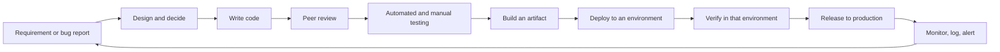
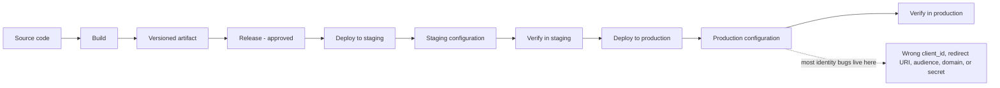
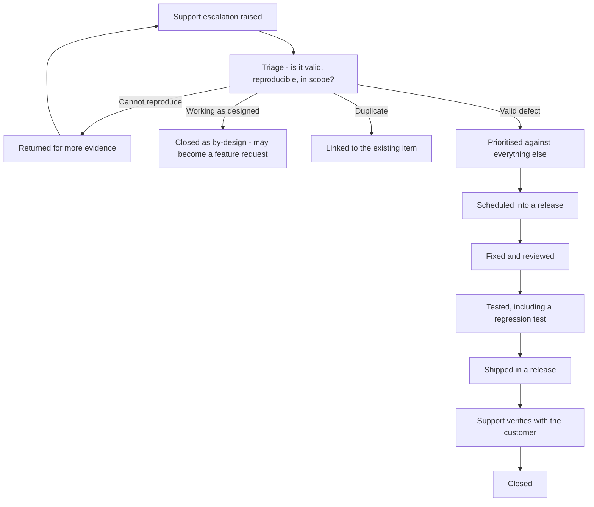
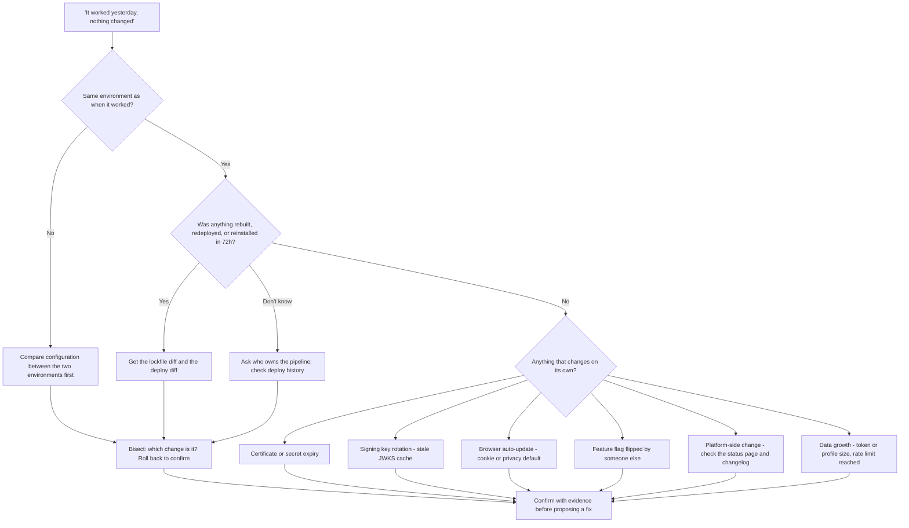

# Part 009 - Software Development Fundamentals for Support Engineers

> Section goal: Learn the developer's operating world — environments, version control, semantic versioning, dependencies, builds, releases, testing, and the bug lifecycle — so that your questions land, your escalations fit the process, and you can tell "the platform changed" from "their dependency changed" in one question.

Covers index item **009**. Maps to JD signals: *knowledge of software development fundamentals and common architectures*, *use your business and technical analysis skills and knowledge of the Development lifecycle to solve complex issues*, *promote best practices*, *collaborate with other departments*, and *proficient in at least one programming language*.

---

## 1. Start From Zero: What Is the "Software Development Lifecycle"?

The **SDLC** is the repeatable path an idea takes from "someone wants this" to "it is running for real users" and onward to "we fixed it again."

> **Analogy.** A restaurant kitchen. Someone orders (requirement). The chef plans the dish (design). It is cooked (code). Another chef tastes it (review). It goes under the pass lamp and gets checked (test). It is plated (build). It goes to the right table (deploy). The waiter confirms it is right (verify). The customer eats it (production). Complaints come back to the kitchen (observe).
>
> **Where the analogy stops:** in software, the same dish is served to a million people simultaneously, and a mistake in the recipe affects all of them at once. That is why the checks exist.

**Why a support engineer needs this:** the JD asks you to use *"knowledge of the Development lifecycle to solve complex issues."* Concretely, it means you can ask *"which environment?"*, *"which version?"*, *"what shipped in the last 72 hours?"*, and *"is this a breaking change or a regression?"* — four questions that resolve an enormous share of tickets on their own.

---

## 2. Environments

An **environment** is a complete running copy of a system. Companies run several so that changes can be tried without endangering real users.

| Environment | Purpose | Data | Who uses it | Identity implication |
|---|---|---|---|---|
| **Local / dev** | A developer's own machine | Fake | One developer | `http://localhost:3000` redirect URIs |
| **Development / integration** | Shared, where components meet | Fake | The dev team | Separate tenant or separate app registration |
| **Test / QA** | Where testing happens | Fake or masked | Testers, automation | Test users, sometimes automated logins |
| **Staging / pre-production** | A production-like rehearsal | Masked copy or synthetic | Release validation | Should mirror production identity config exactly |
| **Production** | Real users, real money | Real | Everyone | The one that generates the urgent tickets |
| **Disaster recovery** | Standby | Replicated | Rarely | Often the forgotten redirect URI |

### 🔍 Plain-English deep-dive: why environments cause identity tickets specifically

Identity configuration is **environment-specific by nature**, and it is very easy to promote code between environments while forgetting the configuration.

The classic sequence:

1. It works in staging.
2. The code is promoted to production unchanged.
3. Production has a different domain → the redirect URI is different → it is not on the production app's allow-list.
4. The user sees a callback mismatch error before they even reach a login page.
5. The developer says *"but nothing changed — it worked in staging."*

Everything *they* changed was code. What differs is **configuration**, which did not travel with it.

**The support instinct this creates:** when a customer says "it works in staging but not production", your first four questions are:

| Question | What it catches |
|---|---|
| "Are staging and production using the same tenant, or different tenants?" | Configuration drift between two tenants |
| "Are they the same application registration, or different ones?" | Different `client_id`, different allow-list |
| "What is the exact redirect URI in each?" | Trailing slash, `http` vs `https`, different host |
| "Is the audience/API identifier the same in both?" | Wrong `aud` → 401 at the API |

> 💡 **Tie-in to your background:** you already navigate multi-environment enterprise estates — tenants, pilot rings, and production. The instinct that "the difference between two environments is where the bug lives" transfers exactly. What changes is that here the difference is usually *identity configuration*, not device or policy state.

**Analogy:** a stage rehearsal in a different theatre. The actors know their lines perfectly; the set does not fit the new stage. **Where it stops:** a set mismatch is visible; a redirect-URI mismatch is invisible until a user tries to log in.

---

## 3. Version Control

**Version control** (in practice, **Git**) records every change to a codebase, who made it, when, and why.

| Term | Plain meaning | Why it matters in support |
|---|---|---|
| **Repository (repo)** | The project and its full history | "Which repo?" narrows a question fast |
| **Commit** | One saved change, with a message | The unit of "what changed" |
| **Branch** | A parallel line of development | "Which branch is deployed?" is a real question |
| **Merge** | Combining branches | Merges are where regressions sneak in |
| **Pull request (PR) / merge request** | A proposed change, reviewed before merging | Where code review happens |
| **Tag** | A named point in history, usually a release | `v2.3.1` — how a release maps to code |
| **Revert** | Undoing a change safely | The fastest remediation for a bad release |
| **Blame / annotate** | Which commit last touched each line | How you find *when* a behavior changed |
| **Diff** | The difference between two states | The most useful artifact in "it worked before" cases |

### The one question this unlocks

> **"Can you send me the diff between the last working version and the current one?"**

For a "it worked yesterday" ticket, this single request often ends the investigation. It also demonstrates that you understand their world — which materially changes how a developer treats you.

---

## 4. Semantic Versioning and Dependencies

### Semantic versioning (SemVer)

Version numbers take the form `MAJOR.MINOR.PATCH`, e.g. `4.7.2`.

| Part | Increments when | Promise |
|---|---|---|
| **MAJOR** | An incompatible change is made | **Your code may break.** Read the migration guide |
| **MINOR** | Functionality is added, backwards-compatibly | Safe to adopt; new things exist |
| **PATCH** | A backwards-compatible bug fix | Safe; should change nothing you rely on |

Pre-release suffixes such as `4.0.0-beta.1` mean "not yet stable — behavior may change."

> **Analogy.** MAJOR is moving house; MINOR is adding a room; PATCH is fixing a dripping tap. Only one of those requires you to update your address everywhere.
>
> **Where it stops:** SemVer is a *promise*, not a guarantee. Libraries occasionally break compatibility in a minor release by accident. That is itself a common root cause.

### Dependencies and lockfiles

| Term | Plain meaning | Why it matters |
|---|---|---|
| **Dependency** | A library your code uses | Your code is mostly other people's code |
| **Transitive dependency** | A dependency of a dependency | You have hundreds you never chose |
| **`package.json`** | Declares which versions are *acceptable* | Ranges like `^4.7.0` allow automatic upgrades |
| **Lockfile** (`package-lock.json`, `yarn.lock`) | Records which versions are *actually installed* | The ground truth of what is running |
| **`^4.7.0`** | "Any 4.x at or above 4.7.0" | A new minor can arrive without a code change |
| **`~4.7.0`** | "Any 4.7.x" | Patches only |
| **`4.7.0`** | Exactly that version | Pinned |

### 🔍 Plain-English deep-dive: how "nothing changed" is almost always false

A developer says nothing changed. They mean *they* did not edit any code. But:

- A caret range let a **minor version** of the SDK install on the next build.
- A **transitive** dependency updated three levels down.
- The **base container image** was rebuilt with a newer runtime.
- The **browser** auto-updated and changed a cookie default.
- A **certificate** expired on its own schedule.
- A **feature flag** was flipped by someone else.
- The **platform** deployed a change.

**Therefore the correct question is never "what did you change?" — it is "what was rebuilt, redeployed, or reinstalled in the last 72 hours, including dependencies?"** Then: *"can you compare your lockfile now against the last known-good deployment?"*

That question alone identifies a large share of "it worked yesterday" tickets, and it makes you look like you have done this before. **Analogy:** a car that starts failing after a service — the driver changed nothing, but three parts were replaced. **Where it stops:** software dependencies update *without anyone visiting the garage*.

---

## 5. Build, Release, and Deploy

These three are often used interchangeably and are not the same.

| Step | What happens | Failure looks like |
|---|---|---|
| **Build** | Source → runnable artifact (bundle, container, package) | Compile errors, missing dependency, wrong Node version |
| **Release** | An artifact is marked as ready and versioned | Wrong artifact promoted |
| **Deploy** | An artifact is placed into an environment | Old version still serving, partial rollout |
| **Configure** | Environment-specific values applied | **The identity failure category** — wrong client ID, wrong domain, missing secret |
| **Verify** | Confirm it works there | Skipped under time pressure |

### Deployment strategies you should recognise

| Strategy | How it works | Support consequence |
|---|---|---|
| **Big bang** | Everyone gets the new version at once | Failures are total and obvious |
| **Rolling** | Instances updated gradually | **Two versions run simultaneously** — intermittent, confusing symptoms |
| **Blue/green** | Two full environments; traffic switched | Fast rollback; config drift between the two is a classic bug |
| **Canary** | A small percentage first | "Only some users are affected" is expected, not mysterious |
| **Feature flag** | Code shipped but switched off, enabled per cohort | Behavior differs by user with **no deploy at all** |

### 🔍 Plain-English deep-dive: why "only some users are affected" is a clue, not a mystery

Beginners treat partial failure as baffling. It is usually the most informative signal available, because it tells you a *variable* differs between the affected and unaffected group.

Systematically, the variable is one of:

| Variable | Example |
|---|---|
| **Version** | Rolling deploy — some hit old instances, some new |
| **Cohort** | Feature flag enabled for 10% |
| **Connection** | Only users on the Entra connection fail; database users are fine |
| **Client** | Only the mobile app; the web app is fine |
| **Geography** | Only one region — a CDN, DNS, or data-residency difference |
| **Browser** | Only Safari — a cookie-policy difference (Parts 014, 017) |
| **Account age** | Only users created before a migration |
| **Session state** | Only users with an existing session, or only fresh ones |

**The professional question:** *"What do the affected users have in common that the unaffected ones do not?"* That is not small talk — it is a discriminating test, and it is the JD's *"subdivide problems into basic components"* in one sentence.

---

## 6. Testing, Code Review, and Quality Gates

| Concept | Plain meaning | Support relevance |
|---|---|---|
| **Unit test** | Tests one function in isolation | Fast; misses integration problems |
| **Integration test** | Tests components together | Where identity flows are usually first exercised |
| **End-to-end test** | Drives the real UI through a real flow | Where an actual login is tested |
| **Regression test** | Proves an old bug has not returned | What you ask for after a fix |
| **Smoke test** | Quick post-deploy sanity check | "Did anyone try logging in after the deploy?" |
| **Code review** | A peer reads the change before merge | Where a missing validation check should be caught |
| **Static analysis / linting** | Automated code inspection | Catches some classes of mistake |
| **Coverage** | Proportion of code exercised by tests | High coverage ≠ good tests |

**The support-relevant question:** *"Is there an automated test that exercises the full login flow against a real tenant?"* The answer is frequently "no", because end-to-end identity tests are awkward to write — which is precisely why identity regressions reach production undetected.

---

## 7. The Bug Lifecycle and How Your Escalation Fits It

Your escalation becomes a work item in someone else's process. Understanding that process makes your escalations succeed.

| Stage | What kills an escalation here | How to prevent it |
|---|---|---|
| **Triage** | No reproduction; unclear expected behavior | Minimal repro + explicit expected vs actual (Part 032) |
| **Prioritisation** | Impact not quantified | Numbers: how many users, what revenue, is there a workaround |
| **Scheduling** | No business justification | Tie it to customer commitments and recurrence |
| **Fix** | Ambiguity about correct behavior | Cite the specification, not an opinion |
| **Verification** | Nobody confirms with the customer | Own it through to customer confirmation (Part 005) |

### 🔍 Plain-English deep-dive: "working as designed" is not the end of the conversation

When Engineering returns *"working as designed"*, junior engineers relay it and close. That is a poor outcome, because the customer still has a problem.

The mature response has three moves:

1. **Verify the design claim.** Does the documentation actually say this? If the documentation says otherwise, you have found a documentation defect — which is a real, fixable bug.
2. **Translate for the customer.** Explain *why* the design is that way. Often it is a deliberate security decision, and once the customer understands the reasoning, they stop objecting.
3. **Capture it as product feedback** if the design genuinely does not serve a legitimate need. Recurrence across several customers is exactly the evidence Product needs, and gathering it is the JD's *"influence product improvements"* work.

**Analogy:** a building inspector saying the wall is where the plans specify. True, but the resident still cannot get their sofa in — the answer is either "here is why the wall is there" or "let's change the plans."

---

## 8. Failure Modes

| Failure mode | What it looks like | Consequence | Correction |
|---|---|---|---|
| **Not asking for the environment** | Investigating production; the report is from staging | Wasted investigation | Environment is question one, always |
| **Not asking for versions** | Advice for SDK v1 given to a v2 user | Whole cycle wasted, credibility damaged | Exact versions in first response |
| **Accepting "nothing changed"** | Believing it | Miss the dependency or platform change | Ask what was rebuilt/redeployed/reinstalled in 72 hours |
| **Ignoring partial failure** | Treating "some users" as noise | Discard the best clue you have | "What do affected users share that unaffected ones don't?" |
| **Escalating without a repro** | "Customer says it fails" | Bounced at triage; days lost | Minimal repro first |
| **Confusing deploy with release** | "It's released" but not deployed everywhere | Wrong mental model of the rollout | Ask which instances/regions have it |
| **Missing feature flags** | Behavior differs with no deploy | Unexplainable inconsistency | Ask explicitly whether flags are in play |
| **Relaying "working as designed"** | Closing on Engineering's verdict | Customer unserved; recurrence | Verify, translate, capture feedback |
| **Ignoring the lockfile** | Trusting `package.json` | The declared range is not what is installed | Ask for the lockfile diff |

---

## 9. Troubleshooting Decision Tree: "It Worked Yesterday"

**Worked example.** *"Our production login broke overnight. Nothing changed. Staging is fine."*

1. **Same environment?** No — staging works, production does not. So compare them.
2. **Is it configuration or code?** If both run the same artifact version, it is configuration or something environmental.
3. **What differs by environment and changes on its own?** Certificates. Signing keys. Secrets with expiry dates. Domain-scoped cookies.
4. **Ask:** *"When was the production client secret last rotated, and does it have an expiry? And has the signing certificate on your enterprise connection been renewed recently?"*
5. **Frequent answer:** a certificate on the enterprise connection expired, or a client secret with a one-year lifetime reached its date. Both are true "nothing changed" events, and both are entirely predictable once you know to look.

That is the *"instinctive ability to subdivide problems into basic components"* from the JD, applied to a lifecycle question rather than a protocol one.

---

## 10. Lab: Build a Real Repo and Break It Deliberately

**Purpose.** Experience the developer lifecycle first-hand so your questions are grounded, and produce SDLC-aware artifacts.

**Prerequisites.** Part 007's lab. Node.js, npm, and Git installed.

**Steps.**

1. `cd okta-prep/labs/` and create `009-sdlc/`. `npm init -y` inside it.
2. **Dependencies.** `npm install jsonwebtoken` (used again in Part 043). Open `package.json` — note the caret range. Open `package-lock.json` — note the exact resolved version. Record both in your manifest, and write one line on why they differ.
3. **Versioning experiment.** Install a deliberately older minor of the same package (`npm install jsonwebtoken@<older-minor>`), commit the lockfile, then update to latest and commit again. Run `git diff HEAD~1 -- package-lock.json`. **This diff is exactly what you will ask customers for.** Save it to `evidence/`.
4. **Environments.** Create `config/local.json`, `config/staging.json`, `config/production.json`, each with `clientId`, `domain`, `redirectUri`, `audience`. Deliberately make production's `redirectUri` differ by a trailing slash. Write a two-line script that loads config by `NODE_ENV` and prints it.
5. **Break it.** Write a tiny script that asserts the configured `redirectUri` matches an allow-list. Run it with `NODE_ENV=staging` (passes) and `NODE_ENV=production` (fails). Record the **exact** error text. This is the trailing-slash bug, reproduced in miniature.
6. **Branch and diff.** Create a branch, change one config value, commit, and produce the diff between branches. Save it.
7. **Bug report.** Write `bug-report.md` for the trailing-slash failure using the escalation-packet structure from Part 005: summary, impact, minimal repro, versions, expected vs actual, evidence, what you ruled out, one explicit ask.
8. **SDLC question set.** Write `sdlc-questions.md`: ten questions you will ask on any "it worked yesterday" ticket, each with the cause it discriminates.
9. **Failure catalog.** Add rows for the trailing-slash failure and the version-mismatch experiment to `failures/failure-catalog.md`.
10. **Manifest.** Complete `MANIFEST.md` with an honest Limitations section.

**Expected evidence.** A committed repo with two lockfile states, three environment configs, a reproducible configuration failure with its exact error, two saved diffs, a bug report, and a ten-question set.

**Validation rubric.**

| Check | Pass condition |
|---|---|
| Lockfile diff produced | Saved, and you can explain what it shows |
| Range vs resolved explained | One line on why `package.json` and the lockfile differ |
| Config failure reproduced | Exact error text captured verbatim, not paraphrased |
| Diffs saved | Both the lockfile diff and the branch diff |
| Bug report complete | All eight escalation-packet elements, with a genuine yes/no ask |
| Ten questions justified | Each names the cause it discriminates |
| Catalog updated | Two new rows with exact error strings |
| Nothing secret committed | Staged diff scanned before every commit |

**Cleanup and privacy.** Everything here is synthetic — invented domains and client IDs, `example.com` only. Do not use any real tenant value, any employer configuration, or any real client secret. Keep the repo; Parts 028 and 043 build on it.

---

## 11. JD Mapping

| Supplied JD signal | How this Part supports it |
|---|---|
| Knowledge of software development fundamentals | §§1–7 cover SDLC, environments, version control, SemVer, dependencies, build/release/deploy, and testing from zero |
| Knowledge of the Development lifecycle, applied to complex issues | §9's decision tree is lifecycle knowledge converted into a diagnostic instrument |
| Business and technical analysis skills | §7's "working as designed" response and §5's cohort analysis are requirement and evidence interrogation |
| Common architectures | §5's deployment strategies explain why partial and intermittent failures occur |
| Collaborate with other departments | §7 shows how an escalation survives Engineering triage |
| Promote best practices | §4's lockfile discipline and §6's end-to-end test question are best practices you can proactively raise |
| Proficient in at least one programming language | §10 is a real Node repo with dependency management and version control |
| Instinctive ability to subdivide problems | §5's "what do affected users share?" and §9's bisect approach |

---

## 12. Candidate Honesty Note

- **Production transfer:** you already work across environments, coordinate with Engineering on defects, validate fixes, and understand release impact — your CV explicitly says you *"validate fixes"* and *"identify potential product defects."* That is genuine lifecycle experience from the support side.
- **Honest boundary:** you have not worked as a developer shipping product code through this lifecycle. Say *"I've worked alongside it rather than inside it"* — that is accurate, it is enough for this role, and it is far better than implying engineering experience you do not have.
- **Lab evidence:** the §10 repo is showable. "I built a small repo specifically to experience lockfile drift and environment config divergence, because those are the two causes behind most 'nothing changed' tickets" is a strong, specific answer.
- **The best sentence you own here:** *"'Nothing changed' is almost never literally true — so I ask what was rebuilt, redeployed, or reinstalled in the last 72 hours, including transitive dependencies, and I ask for the lockfile diff."* It is short, technical, and immediately signals you have done this.

---

## 13. Official Source Anchors

Accessed **26 August 2026**.

| Source family | Use it for |
|---|---|
| Semantic Versioning specification (semver.org) | The exact MAJOR/MINOR/PATCH contract in §4 |
| Git documentation | Commits, branches, diffs, tags, revert, bisect |
| npm documentation — `package.json`, lockfiles, version ranges | Caret and tilde semantics, and why the lockfile is the ground truth |
| Node.js documentation — release schedule and LTS | Runtime versions and support windows |
| Auth0 changelog and Okta release notes | Platform-side change history — the first thing to check on "it worked yesterday" |
| Okta and Auth0 status pages | Whether a platform incident explains the timing |
| Okta developer documentation — SDK release notes and migration guides | What a MAJOR version bump actually requires of a customer |

**Revalidate after 26 August 2026:** SDK major versions and any migration guidance, which change on their own schedule.

---

## ⭐ Likely Interview Questions for This Section

### Q1. "A customer says it works in staging but not production. Where do you start?"
> *Model answer:* "With the differences, not the symptom — because if the artifact is identical, the bug is in what differs, and that's almost always configuration. Four questions: are they the same tenant or different tenants; the same application registration or different ones; what is the exact redirect URI in each, character for character including trailing slashes and `http` versus `https`; and is the API audience identifier the same. Identity configuration is environment-specific by nature and doesn't travel with a code promotion, so this pattern is extremely common. If configuration genuinely matches, then I'd look at what differs environmentally — a different domain changing cookie scope, a proxy in front of production, or an expiring certificate or secret that only exists on the production side."

### Q2. "A customer says nothing changed. Do you believe them?"
> *Model answer:* "I believe they didn't change anything, and I don't believe nothing changed — those are different statements. A caret range can pull in a new minor version of an SDK on the next build. A transitive dependency three levels down can update. A base container image can be rebuilt with a newer runtime. A browser auto-updates and changes a cookie default. A certificate or client secret expires on its own schedule. A signing key rotates and a cached JWKS goes stale. A feature flag gets flipped by someone else. Or the platform deployed something. So I never ask 'what did you change?' — I ask 'what was rebuilt, redeployed, or reinstalled in the last 72 hours, including dependencies?' and then 'can you diff your lockfile against the last known-good deployment?' That question alone closes a lot of tickets."

### Q3. "What is semantic versioning and why does it matter to you?"
> *Model answer:* "MAJOR.MINOR.PATCH. A MAJOR bump means an incompatible change — your code may break and there'll be a migration guide. MINOR adds functionality backwards-compatibly. PATCH is a backwards-compatible fix. It matters enormously in support because behavior differs between majors, so advice for v1 given to a v2 user is worse than useless — it wastes a full cycle and damages credibility. It's why I ask for exact versions in my first response rather than later. The caveat I'd add is that SemVer is a promise rather than a guarantee — libraries do occasionally break compatibility in a minor by accident, and that's itself a root cause worth checking when the lockfile shows a minor bump around the time symptoms started."

### Q4. "Only some users are affected. Is that harder to diagnose?"
> *Model answer:* "It's usually easier, because it hands me a variable. Partial failure means something differs between the affected and unaffected groups, and there's a finite list of candidates: version, if it's a rolling deploy with two versions live; cohort, if there's a feature flag; connection, so enterprise users fail and database users don't; client, so mobile fails and web doesn't; geography, pointing at CDN, DNS, or data residency; browser, which usually means a cookie policy difference; account age, pointing at a migration; or session state, so only fresh logins or only existing sessions. So my question is 'what do the affected users have in common that the unaffected ones don't?' That's a discriminating test rather than small talk, and it typically eliminates most of the list in one answer."

### Q5. "What makes an escalation likely to be accepted by Engineering?"
> *Model answer:* "It has to survive triage, and triage kills escalations for three reasons: can't reproduce, unclear what 'correct' would be, or duplicate. So: a minimal reproducible example they can actually run, exact versions and environment because behavior varies by version, and expected versus actual stated precisely with a citation — the specification or the documentation, not my opinion, so 'wrong' is objective rather than debatable. Then quantified impact so it prioritises correctly against everything else in their queue, correlation IDs and timestamps with timezones so they can find it server-side, what I've already ruled out so they don't repeat my first two days, and one explicit answerable ask. Understanding that my escalation becomes a work item in someone else's prioritised backlog is what changes how I write it."

### Q6. "Engineering comes back with 'working as designed'. What do you do?"
> *Model answer:* "I don't just relay it and close, because the customer still has a problem. Three moves. First, verify the design claim against the documentation — if the docs say something different, I've found a documentation defect, and that's a real, fixable bug worth raising. Second, translate: explain to the customer *why* it's designed that way, because it's very often a deliberate security decision, and once someone understands the reasoning they usually stop objecting. Third, if the design genuinely doesn't serve a legitimate need, capture it as product feedback with evidence — and the evidence that actually moves Product is recurrence across multiple customers, so I'd tag the case so the pattern is countable. Closing with 'that's by design' and nothing else is the outcome I'd consider a failure."

### Q7. "How much of the development lifecycle have you actually worked inside?"
> *Model answer:* "I'd say alongside it rather than inside it, and I'd rather be precise about that. I haven't shipped product code through a release pipeline. What I have done, for several years, is the support side of the same lifecycle: reproducing defects, working with Engineering to investigate, validating fixes before they reach customers, and understanding release impact on enterprise customers. To make sure my questions land rather than sounding second-hand, I built a small repo specifically to experience the parts I hadn't — lockfile drift between builds, environment configuration diverging from code, branch diffs. It's not the same as being a developer and I wouldn't claim it is, but it means when I ask for a lockfile diff I know exactly what I'm looking at."

### Q8. "What questions do you always ask about a customer's environment?"
> *Model answer:* "A fixed set, asked up front rather than in rounds, because each round trip costs a day. Which environment — local, staging, or production. Exact SDK, framework, and runtime versions from the lockfile, not from `package.json`, because the declared range isn't what's installed. Which deployment strategy, since a rolling deploy means two versions are live simultaneously and explains intermittent symptoms. Whether feature flags are in play, because that changes behavior with no deploy at all. What was rebuilt, redeployed, or reinstalled in the last 72 hours. Whether there's an automated end-to-end test that exercises the real login flow — often there isn't, which is exactly why identity regressions reach production. And whether staging and production use the same tenant and the same application registration."

---

## 🧠 30-Second Memory Hooks

- **SDLC:** requirement → design → code → review → test → build → release → deploy → **configure** → verify → observe.
- **Identity bugs live in the *configure* step**, which does not travel with a code promotion.
- **"Works in staging, not production"** → same tenant? same app registration? exact redirect URI? same audience?
- **SemVer:** MAJOR breaks · MINOR adds · PATCH fixes. A promise, not a guarantee.
- **`package.json` declares a range; the lockfile records reality.** Always ask for the **lockfile**.
- **Never ask "what did you change?"** Ask **"what was rebuilt, redeployed, or reinstalled in 72 hours?"**
- **Things that change on their own:** certificates · secrets · signing keys · browsers · feature flags · the platform · data volume.
- **Partial failure is a gift** — version · cohort · connection · client · geography · browser · account age · session state.
- **Rolling deploy = two versions live** = intermittent symptoms with a rational cause.
- **"Working as designed" is a starting point:** verify the docs · translate the why · capture the feedback.

---

## ✅ Completion Checklist

- [ ] **Knowledge:** I can explain SemVer, the difference between `package.json` and a lockfile, and five things that change without anyone changing anything.
- [ ] **Lab artifact:** `009-sdlc/` exists with two lockfile states, three environment configs, a reproduced trailing-slash failure with exact error text, two diffs, a bug report, and ten justified questions.
- [ ] **Spoken:** I can deliver the "nothing changed is never true" answer in under 45 seconds.
- [ ] **Honesty check:** I have written my one-sentence "alongside the lifecycle, not inside it" statement.
- [ ] **Source check:** I have read semver.org's summary and opened the Auth0 changelog and Okta release notes myself.

---

*Next suggested section:* **[Part 010 - Common Application Architectures and Where Identity Sits](Part-010-common-application-architectures-and-where-identity-sits.md)** — the last foundation Part: the architectural shapes your customers build, and exactly where authentication and authorization are enforced in each.
