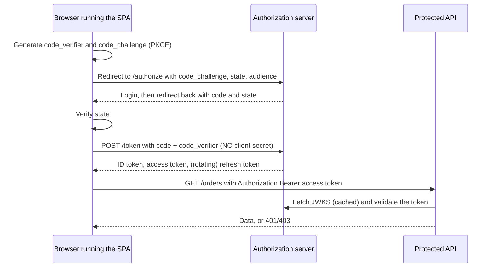
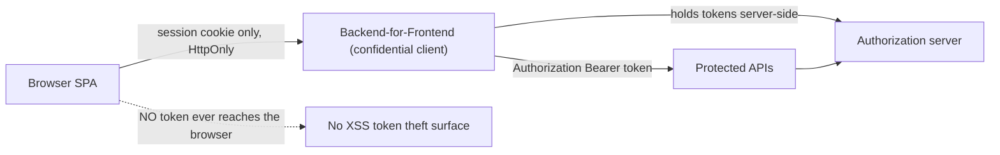
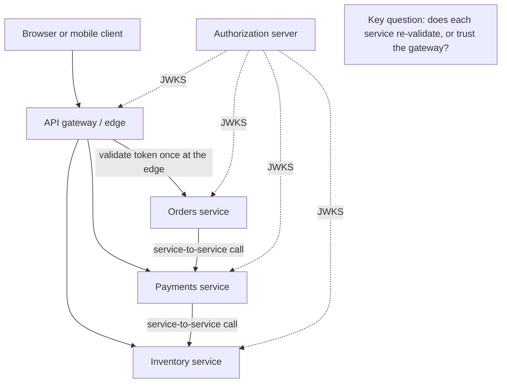
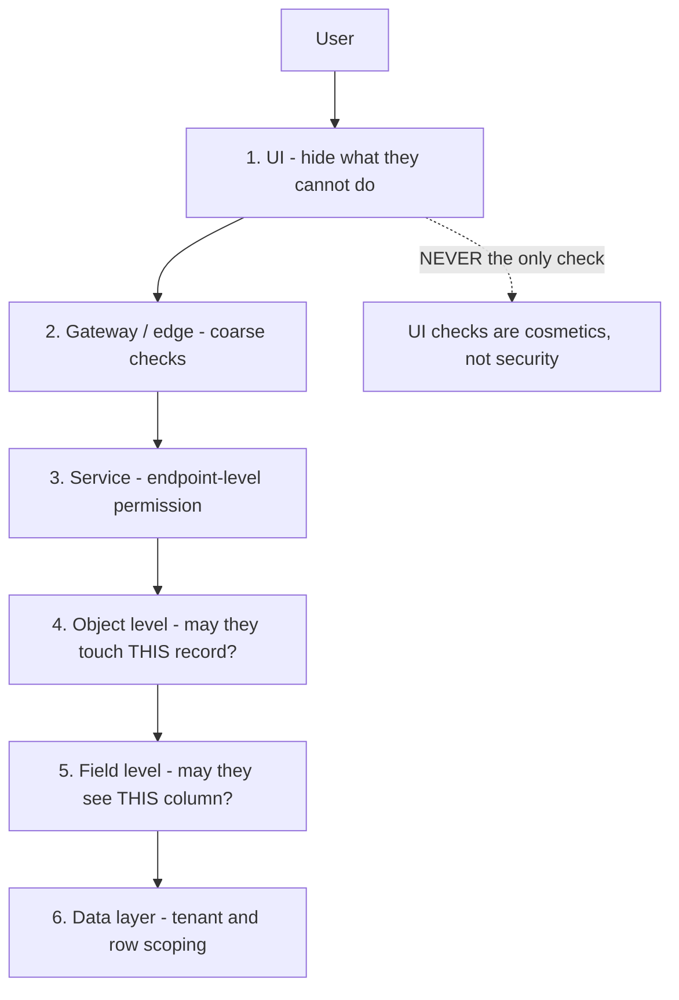
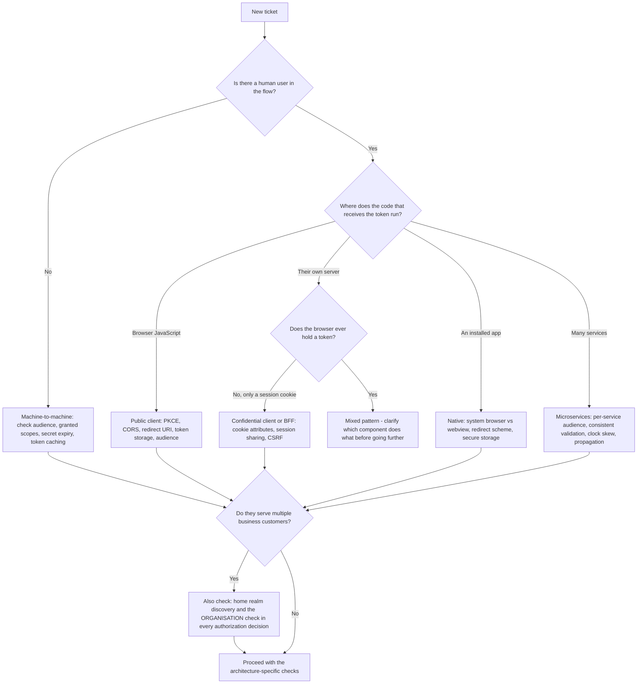

# Part 010 - Common Application Architectures and Where Identity Sits

> Section goal: Learn the handful of architectural shapes your customers actually build, and mark precisely where authentication and authorization are enforced in each. When a developer describes their system in one sentence, you should immediately know which flow they need, where their token lives, and which three things are most likely broken.

Covers index item **010**. Maps to JD signals: *knowledge of software development fundamentals and common architectures*, *understanding of authentication and authorization concepts*, *business and technical analysis skills*, *promote best practices*, and *knowledge of HTTP and basic security concepts*.

---

## 1. Start From Zero: What Is an "Architecture"?

An **architecture** is the shape of a system: which pieces exist, where each one runs, and how they talk to each other.

For identity purposes, only three questions about the shape actually matter:

| Question | Why it decides everything |
|---|---|
| **1. Can this component keep a secret?** | Determines whether it is a *confidential* or *public* client, which determines the flow |
| **2. Where does the user's browser sit relative to it?** | Determines whether redirects, cookies, and CORS apply |
| **3. Where is the protected resource, and who checks the token?** | Determines where authorization is enforced |

> **Analogy.** Architecture is the floor plan of a building. Identity is the question of *where you put the locks*. You cannot decide the locks sensibly without the floor plan, and a lock on the wrong door protects nothing.
>
> **Where it stops:** buildings have one obvious front door. Modern systems often have several, some of which nobody remembers creating.

### 🔍 Plain-English deep-dive: "can it keep a secret?"

This is the single most consequential question in applied OAuth, so learn it before any flow.

A **secret** here means a credential (a client secret or a private key) that proves *this application* is who it says it is.

- **Server-side code** *can* keep a secret. It runs on a machine the developer controls; users never see the files.
- **Browser JavaScript** *cannot*. Everything shipped to a browser is readable by anyone who opens DevTools. There is no such thing as a hidden value in a SPA.
- **Mobile apps** *cannot*, in practice. An installed binary can be decompiled and its strings extracted. A secret in a mobile app is a published secret.
- **Backend services and daemons** *can*, in a secrets manager or environment configuration.

This produces the fundamental split:

| | Confidential client | Public client |
|---|---|---|
| Can hold a secret? | Yes | No |
| Examples | Server-rendered web app, backend service, daemon | SPA, mobile app, desktop app, CLI |
| How it authenticates to the token endpoint | Client secret or private key JWT | It does not — it proves the request instead, with **PKCE** |
| Refresh tokens | Allowed, standard | Allowed only with **rotation** and extra care |
| Where tokens live | Server-side session or store | Browser or device memory/storage — always a compromise |

**Why it matters for you:** when a developer says *"our React app calls the token endpoint with the client secret"*, you now know instantly that (a) their secret is exposed to every visitor and (b) they should be using PKCE with no secret at all. That is a security finding in the first thirty seconds of a ticket. **Analogy:** giving every customer a copy of the shop key because they need to get in during opening hours. **Where it stops:** unlike a physical key, a leaked client secret can be used from anywhere in the world, silently, forever.

---

## 2. The Architectures, One by One

### 2.1 Server-rendered web application (the "regular web app")

The oldest and simplest shape. The server generates HTML; the browser displays it.

```mermaid
sequenceDiagram
    participant B as Browser
    participant S as Web server (confidential client)
    participant AS as Authorization server
    B->>S: GET /dashboard
    S-->>B: 302 redirect to /authorize
    B->>AS: GET /authorize (client_id, redirect_uri, state, scope)
    AS-->>B: Login experience, then 302 to redirect_uri with code
    B->>S: GET /callback?code=...&state=...
    S->>S: Verify state matches the stored value
    S->>AS: POST /token (code + client secret) - server to server
    AS-->>S: ID token, access token, refresh token
    S->>S: Create a server-side session; set an HttpOnly cookie
    S-->>B: 302 to /dashboard with Set-Cookie
    B->>S: GET /dashboard (cookie)
    S-->>B: Rendered page
```

| Property | Value |
|---|---|
| Client type | **Confidential** |
| Flow | Authorization Code (+ PKCE, now recommended even here) |
| Where tokens live | **Server side.** The browser only holds a session cookie |
| Session mechanism | `HttpOnly`, `Secure`, `SameSite` cookie |
| Common failures | Redirect URI mismatch · `state` lost across instances · cookie `SameSite` blocking the callback · load-balanced servers not sharing session state |

> **Security note:** this is still the *safest* shape, because no token ever reaches the browser. When a customer asks "what's the most secure option?", this — or its modern equivalent, the BFF in §2.4 — is the answer.

### 2.2 Single Page Application (SPA)

JavaScript runs in the browser and calls APIs directly.



| Property | Value |
|---|---|
| Client type | **Public** |
| Flow | Authorization Code **with PKCE** (never implicit — Part 063) |
| Where tokens live | Browser memory (safest), or storage (persists but is exposed to XSS) |
| Session renewal | Refresh token rotation, or silent auth (fragile — Part 076) |
| Common failures | **CORS** · redirect URI exact-match · token storage choice · silent auth blocked by third-party cookie policy · `audience` omitted so the API rejects the token |

> **This is where the largest share of developer-support tickets originate**, because a SPA sits at the intersection of browser security policy, CORS, cookie policy, and OAuth.

### 2.3 Native / mobile application

An installed app on a phone or desktop.

| Property | Value |
|---|---|
| Client type | **Public** (a shipped binary cannot hold a secret) |
| Flow | Authorization Code with PKCE, in the **system browser** — not an embedded webview |
| Redirect mechanism | Custom URI scheme, or a claimed HTTPS URL (App Links / Universal Links) |
| Where tokens live | Platform secure storage (Keychain, Keystore) |
| Common failures | Redirect scheme not registered · embedded webview breaking SSO and federation · deep link not claimed · refresh token handling across reinstalls |

### 🔍 Plain-English deep-dive: why embedded webviews are discouraged

An **embedded webview** is a browser control inside the app, so the login page appears without leaving the app. Developers like it because it looks seamless. It is discouraged for three concrete reasons:

1. **The app can read everything in it** — including the user's password as they type. Even if this app is honest, the *pattern* trains users to enter credentials in an app-controlled surface, which is exactly what a malicious app would build.
2. **No shared session.** The webview has its own cookie jar, so single sign-on with the system browser is lost. The user has to log in again, every app, every time.
3. **Federation frequently breaks.** Enterprise IdPs and social providers increasingly refuse to render in embedded webviews, or their device-trust and passkey mechanisms will not function there.

The supported pattern is the **system browser** via the platform's in-app browser tab (`SFSafariViewController` / `ASWebAuthenticationSession` on iOS, Custom Tabs on Android), which looks nearly as seamless but keeps the cookie jar shared and the credentials out of the app's reach.

**Analogy:** a shop that hands you its own "bank card reader" rather than letting you use the real terminal. Perhaps honest, unverifiable, and it teaches customers a dangerous habit. **Where it stops:** a card reader is a physical object you can inspect; a webview is invisible to the user.

### 2.4 Backend-for-Frontend (BFF)

A thin server that sits behind the SPA and holds tokens on its behalf. Increasingly the recommended pattern for browser applications.



| Property | Value |
|---|---|
| Client type | **Confidential** (the BFF is the client; the SPA is just a UI) |
| Flow | Authorization Code + PKCE, executed by the BFF |
| Where tokens live | **Server side.** Browser holds only an `HttpOnly` session cookie |
| Advantage | No token in the browser, so XSS cannot exfiltrate one; no reliance on third-party cookies |
| Cost | You now operate a server; every API call is proxied |
| Common failures | Cookie `SameSite` on cross-site setups · session store not shared across BFF instances · CSRF protection needed since you are cookie-based again |

> **Why this keeps coming up:** as browsers restrict third-party cookies (Part 017), silent renewal in a pure SPA becomes fragile. The BFF sidesteps the whole problem by making the session first-party. Expect to recommend it.

### 2.5 Machine-to-machine (M2M) / daemon

No user at all. A backend service calling an API.

| Property | Value |
|---|---|
| Client type | **Confidential** |
| Flow | **Client Credentials** (Part 060) |
| Identity | The *application's* own identity — there is no user, and no ID token |
| Where credentials live | Secrets manager or environment; rotated on a schedule |
| Common failures | Wrong `audience` · scopes not granted to the client · secret expired · token requested per call instead of cached, hitting rate limits |

> **The most common M2M ticket:** "we're getting 429 rate limited." The cause is almost always requesting a fresh token on every single API call instead of caching it until shortly before `exp`. Part 045 covers the caching rule.

### 2.6 Microservices

Many small services, each owning one capability, calling each other.



| Property | Value |
|---|---|
| Client type | The user-facing app is the client; services are resource servers |
| Token validation | At the gateway, at each service, or both |
| Service-to-service auth | Client credentials, token exchange (Part 067), or mTLS |
| Common failures | Token audience mismatch between services · inconsistent validation (one service checks `iss`, another does not) · token size growing past header limits · clock skew across hosts · a service trusting a header set by another service |

### 🔍 Plain-English deep-dive: the "gateway trust" trap

A very common microservice design: the gateway validates the token, extracts the user ID, and forwards it to internal services as a plain header such as `X-User-Id`. Internal services trust that header.

This is convenient and it is fine **only** if internal services are genuinely unreachable except through the gateway. In practice they often are not — a misconfigured network policy, a debug port, a service mesh change, or a compromised pod inside the cluster, and now anyone who can reach a service can set `X-User-Id` to whatever they like and become any user.

That is exactly the **zero trust** failure from Part 006: trusting based on *where a request appears to come from* rather than what it can *prove*.

**Safer designs:**
- Each service validates the token itself (cheap — JWKS is cached, signature checks are fast).
- Or the gateway mints a short-lived internal token the services *can* verify.
- Or service-to-service calls are authenticated with mTLS, so the caller's identity is cryptographically established.

**Analogy:** a hotel where the lobby checks your ID and then every internal door opens for anyone wearing a paper wristband. Fine until someone finds the wristbands. **Where it stops:** in a hotel you would notice a stranger; in a cluster, nobody sees the request.

### 2.7 Serverless functions

Small functions that run on demand with no long-lived server.

| Property | Value |
|---|---|
| Client type | Usually a resource server, sometimes an M2M client |
| Token validation | In the function, or by the platform's authorizer |
| Special constraint | **Cold starts** — no warm cache, so JWKS is fetched on first invocation |
| Common failures | JWKS fetched on every cold start causing latency and rate-limit pressure · no shared cache between instances · short execution timeouts during a slow key fetch · secrets configured per function and drifting |

### 2.8 Multi-tenant SaaS

One application serving many customer organisations, each isolated.

| Property | Value |
|---|---|
| Identity shape | B2B — organisations, per-org connections, per-org roles (Part 104) |
| Tenant routing | Subdomain, path, organisation parameter, or email domain (home realm discovery) |
| Authorization | Must check **both** "who are you" and "which organisation are you acting in" |
| Common failures | Cross-tenant data exposure from a missing org check · user belongs to two organisations and the wrong one is selected · org-scoped tokens used against another org's data · per-org connection configuration drift |

> **The most serious bug class in this shape** is a missing organisation check in an authorization decision. Authentication succeeds, the token is valid, and the user reads another company's data. Every authorization check in a multi-tenant system must be *"is this subject allowed to do this action on this resource **in this organisation**"* — three parts, not two.

---

## 3. The One-Page Decision Table

When a developer describes their system, this is what you reach for.

| They say… | Client type | Flow | Tokens live | First three things to check |
|---|---|---|---|---|
| "Django/Rails/ASP.NET app, server renders pages" | Confidential | Auth Code + PKCE | Server session | Redirect URI · cookie `SameSite` · session sharing across instances |
| "React/Angular/Vue SPA" | Public | Auth Code + **PKCE** | Browser memory | CORS · exact redirect URI · `audience` parameter present |
| "Next.js / Nuxt with a server side" | Confidential (if the server does the flow) | Auth Code + PKCE | Server session | Which half runs the flow · cookie config · env-var leakage to the client bundle |
| "Mobile app" | Public | Auth Code + PKCE, **system browser** | Secure storage | Redirect scheme registered · not an embedded webview · deep link claimed |
| "Backend job, no user" | Confidential | **Client Credentials** | Secrets manager | `audience` · granted scopes · **token caching** |
| "SPA plus a small server we control" | Confidential (BFF) | Auth Code + PKCE at the BFF | Server session | Cookie `SameSite` · CSRF protection · shared session store |
| "Lots of microservices" | Mixed | Auth Code for users, Client Credentials or exchange between services | Per-service | Consistent validation · audience per service · clock skew |
| "Lambda/Functions" | Resource server | n/a | n/a | JWKS caching across cold starts · timeout · per-function config drift |
| "We sell to businesses, each with their own SSO" | Confidential or public | Auth Code + PKCE with org context | Depends | Home realm discovery · per-org connection · **org check in every authorization decision** |
| "CLI tool" | Public | Auth Code + PKCE with a loopback redirect, or Device Flow | OS keychain | Loopback port handling · Device Flow polling |
| "Smart TV / kiosk / no keyboard" | Public | **Device Authorization Grant** (Part 062) | Device store | Polling interval and `slow_down` handling |

> 💡 **Tie-in to your background:** you already classify enterprise environments quickly — is this hybrid or cloud-only, federated or managed, which client version. This table is the same reflex applied to application shape. Practise until a one-sentence description produces an immediate classification; it is a visible competence in a technical panel.

---

## 4. Where Authorization Is Actually Enforced

Authentication happens once. **Authorization happens everywhere.** Beginners consistently under-estimate how many places a check belongs.



| Layer | What it does | Why it is not sufficient alone |
|---|---|---|
| **1. UI** | Hides buttons the user cannot use | Purely cosmetic — anyone can call the API directly |
| **2. Gateway** | Coarse checks: valid token, right audience, rough scope | Does not know about specific records |
| **3. Service endpoint** | "Does this token have `orders:write`?" | Does not know *which* order |
| **4. Object** | "Is *this* order owned by *this* user or org?" | The check most often missing |
| **5. Field** | "May they see the salary column?" | Rarely implemented; matters for privacy |
| **6. Data** | Row-level and tenant scoping in the query | The last line of defence |

### The single most common authorization bug

> **Checking that the token is valid, but not checking that the *subject* is allowed to touch the *specific object*.**

Example: `GET /api/orders/12345`. The service verifies the token's signature, issuer, audience and expiry, sees the `orders:read` scope, and returns order 12345 — without ever checking whether order 12345 belongs to the caller. Change the number in the URL and you can read anyone's order.

This is known as **insecure direct object reference** (IDOR), or broken object-level authorization, and it is consistently among the most common serious API vulnerabilities. When a developer asks *"is my API secure now that I'm validating the token?"*, this is the question to ask back.

---

## 5. Failure Modes by Architecture

| Architecture | Signature failure | What it looks like | Root cause |
|---|---|---|---|
| Server-rendered | "Login loops forever" | Redirect to login repeatedly | Session cookie not persisting, or not shared across load-balanced instances |
| SPA | "CORS error" | Console error on the token or API call | Origin not allowed, or a redirect being followed cross-origin |
| SPA | "401 from my API" | Token obtained but rejected | `audience` omitted, so the token is for the IdP not the API |
| SPA | "User logged out after a refresh" | Session lost on reload | Token in memory only, and silent renewal blocked |
| Mobile | "Works on Android, not iOS" | One platform only | Redirect scheme or Universal Link not correctly claimed |
| Mobile | "SSO doesn't work between our apps" | Users log in repeatedly | Embedded webview — separate cookie jar |
| M2M | "429 Too Many Requests" | Intermittent failures under load | Token requested per call instead of cached |
| BFF | "Works locally, fails deployed" | Cookie not sent | `SameSite`/`Secure` wrong for the deployed cross-site topology |
| Microservices | "Works via the gateway, fails service-to-service" | Internal 401s | Different audience expected, or no token propagated |
| Microservices | "Random 401s" | Intermittent, no pattern | Clock skew between hosts, or one instance with a stale JWKS |
| Serverless | "First request is slow, then fine" | Latency spikes | JWKS fetched on cold start with no shared cache |
| Multi-tenant | "Customer saw another customer's data" | **Severity 1, always** | Missing organisation check in an authorization decision |

---

## 6. Troubleshooting Decision Tree: Classify Before You Diagnose



**Worked example.** A ticket says: *"Our users get logged out every time they refresh the page. We're using React."*

1. **Human user?** Yes.
2. **Where does the token-receiving code run?** Browser JavaScript → public client, SPA.
3. **Immediate classification:** this is the SPA persistence problem.
4. **The mechanism:** tokens held in memory are lost on reload. To restore a session, the app must either silently renew (needs a session cookie at the authorization server, which modern browsers may block cross-site — Part 076) or use a rotating refresh token.
5. **First questions:** *"Which browser? Does it work in one browser and not another? Are you using silent authentication or refresh token rotation? Are you on a custom domain, or the default tenant domain?"*
6. **Why the custom-domain question matters:** on the default tenant domain the authorization server's cookie is *third-party* relative to the application, so tracking prevention blocks it. On a custom domain sharing the application's parent domain, it is first-party and works. That single question frequently resolves the entire ticket.

Notice that classification (steps 1–3) took seconds and eliminated most of the possibility space **before** any hypothesis was formed. That ordering is the whole point.

---

## 7. Lab: Map the Architectures

**Purpose.** Build the classification reflex and produce a reference artifact you will use for the rest of the guide.

**Prerequisites.** Part 007's lab and Part 009's repo. No new tenants required.

**Steps.**

1. Create `okta-prep/labs/010-architectures/`.
2. **`architecture-cards.md`** — one card per architecture in §2. Each card: a one-sentence description in your own words, client type, flow, where tokens live, the three most likely failures, and the first question you would ask. Write from memory first, then correct.
3. **`decision-table.md`** — reproduce §3's table from memory, then correct it. Mark every row you got wrong.
4. **`authorization-layers.md`** — redraw §4's diagram and, for each layer, write a concrete example check for a fictional orders API. Then write the IDOR example in your own words and the one question you would ask a developer to detect it.
5. **Secret-exposure demo (local, synthetic).** In `009-sdlc/`, create a tiny static HTML page with a JavaScript file containing `const CLIENT_SECRET = "FAKE_NOT_REAL"`. Serve it locally, open DevTools → Sources, and screenshot the visible constant. Save it to `evidence/`. This is a two-minute demonstration you can describe in an interview: *"a secret in browser code is a published secret, and here is the screenshot."* Use only an obviously fake value.
6. **Classification drill.** Write ten one-sentence system descriptions (invent them, or paraphrase patterns you saw on the community forum in Part 004). For each, write the classification and the first three checks — **timed, 30 seconds each**. Score yourself.
7. **Cross-reference.** For each architecture, note which later Part covers its flow in depth, so the card becomes a navigation index.
8. **Failure catalog.** Add rows for anything you discover, especially from step 5.
9. **Manifest.** Complete `MANIFEST.md` with an honest Limitations section.

**Expected evidence.** Four Markdown files, one DevTools screenshot of a synthetic exposed constant, and a scored ten-item classification drill.

**Validation rubric.**

| Check | Pass condition |
|---|---|
| Cards from memory first | You marked what you got wrong before correcting |
| Every card complete | Client type, flow, token location, three failures, first question |
| Authorization layers concrete | A real example check written for each of the six layers |
| IDOR explained | In your own words, plus the detecting question |
| Secret demo | Screenshot exists; the value is obviously fake |
| Drill timed | Ten descriptions, 30 seconds each, score recorded |
| Cross-referenced | Each card names the Part that covers it in depth |

**Cleanup and privacy.** Everything is synthetic. The "secret" in step 5 must be an obviously fake placeholder — never a real value from any tenant, including your own lab tenant. Delete the local page after screenshotting; keep only the screenshot.

---

## 8. JD Mapping

| Supplied JD signal | How this Part supports it |
|---|---|
| Knowledge of common architectures | §2 covers all eight shapes a Customer Identity engineer meets, with identity marked in each |
| Knowledge of software development fundamentals | §1's confidential/public split is the fundamental that governs every flow decision |
| Understanding of authentication and authorization concepts | §4's six enforcement layers and the IDOR bug class |
| Basic security concepts | §2.3's webview reasoning, §2.6's gateway-trust trap, §2.8's tenant-isolation risk |
| Business and technical analysis skills | §6's classify-before-diagnose ordering, and §3's translation from a customer's sentence to a technical model |
| Promote best practices | BFF over token-in-browser, system browser over webview, per-service validation over gateway trust |
| Knowledge of HTTP | The redirect, cookie, CORS, and header constraints that differ by architecture |
| Instinctive ability to subdivide problems | Classification eliminates most of the possibility space before hypothesising |

---

## 9. Candidate Honesty Note

- **Production transfer:** you have supported client-server and cloud SaaS architectures at enterprise scale, including sync clients, browser applications, and service-side components. The instinct to classify an environment before diagnosing is genuinely yours.
- **Honest boundary:** you have not architected or built these systems. Say *"I support them rather than build them"* — which is exactly what this role requires.
- **Lab evidence:** the DevTools screenshot of an exposed constant is a small but memorable artifact. "A secret in browser code is a published secret — I keep a screenshot to show developers why" is a concrete, teachable answer.
- **Where you are strong:** multi-tenant B2B (§2.8) overlaps directly with the enterprise tenancy models you already know from Microsoft 365. Say so.
- **Where to be careful:** do not opine on microservice design patterns beyond their identity implications. Your expertise is *where identity is enforced*, not distributed-systems architecture, and staying in that lane reads as confidence rather than limitation.

---

## 10. Official Source Anchors

Accessed **26 August 2026**.

| Source family | Use it for |
|---|---|
| IETF RFC 6749 §2.1 (Client Types) | The confidential/public definitions in §1 |
| IETF RFC 8252 (OAuth 2.0 for Native Apps) | The system-browser recommendation and the case against embedded webviews (§2.3) |
| IETF OAuth 2.0 Security Best Current Practice | Current guidance on browser-based apps, token storage, and PKCE |
| OAuth 2.0 for Browser-Based Applications (IETF draft series) | The BFF pattern and SPA token-handling guidance (§2.4) |
| Auth0 documentation — application types and Quickstarts | Vendor mapping from application type to configuration |
| Okta developer documentation — Concepts, including redirect versus embedded authentication | Okta's framing of the same choice |
| OWASP API Security Top 10 | Broken object-level authorization (IDOR) in §4 |
| MDN — CORS, cookies, and browser storage | The browser constraints that differ per architecture |

**Revalidate after 26 August 2026:** the browser-based-apps guidance is an actively evolving draft series; check its current status before quoting it as settled.

---

## ⭐ Likely Interview Questions for This Section

### Q1. "A customer says they have a React SPA. What do you immediately know?"
> *Model answer:* "That it's a public client, because anything shipped to a browser is readable by anyone with DevTools — there's no such thing as a hidden value in a SPA. So: Authorization Code with PKCE, never implicit, and no client secret. Tokens live in the browser, which is always a compromise between memory-only, which is safest but lost on reload, and storage, which persists but is exposed to XSS. And the three most likely causes of their ticket are CORS, an exact-match redirect URI problem, or a missing `audience` parameter so the token they got is for the identity provider's own endpoints rather than their API. If they mention using a client secret from the SPA, that's a security finding I'd raise in the first response."

### Q2. "What's the difference between a confidential and a public client?"
> *Model answer:* "Whether it can keep a secret. A confidential client runs somewhere the developer controls — a server, a backend service, a daemon — so it can hold a client secret or a private key and prove its own identity to the token endpoint. A public client can't: browser JavaScript is readable by any visitor, and a mobile binary can be decompiled, so any secret in it is a published secret. That's the whole reason PKCE exists — a public client can't prove *who it is*, so instead it proves that the entity redeeming the authorization code is the same one that started the flow, using a verifier it generated and never transmitted. It's the single most consequential classification in applied OAuth because it determines the flow, the client authentication method, and how refresh tokens must be handled."

### Q3. "Why shouldn't a mobile app use an embedded webview for login?"
> *Model answer:* "Three reasons, and they compound. First, the app can read everything in the webview, including the password as it's typed — even if this app is honest, the pattern trains users to enter credentials into an app-controlled surface, which is exactly what a malicious app would build. Second, the webview has its own cookie jar, so there's no shared session with the system browser and single sign-on is lost — the user logs in again in every app, every time. Third, federation increasingly breaks: enterprise IdPs and social providers refuse to render in embedded webviews, and device trust and passkeys often won't function there. The supported pattern is the platform's in-app browser tab — `ASWebAuthenticationSession` on iOS, Custom Tabs on Android — which looks nearly as seamless but keeps the cookie jar shared and credentials out of the app's reach."

### Q4. "What is a BFF and when would you recommend one?"
> *Model answer:* "Backend-for-Frontend — a thin server that sits behind the SPA, performs the OAuth flow itself as a confidential client, holds the tokens server-side, and gives the browser only an `HttpOnly` session cookie. The browser never sees a token, so XSS can't exfiltrate one, and you're not relying on third-party cookies for silent renewal. I'd recommend it when the customer has real security requirements, when they're already running a server so it's not new infrastructure, or when they're fighting third-party cookie restrictions and their silent auth keeps failing — which is increasingly common. The costs are honest ones: you now operate a server, every API call is proxied through it, and because you're back on cookies you need CSRF protection and a shared session store across instances."

### Q5. "A developer says their API is secure because it validates the token. Is it?"
> *Model answer:* "That's authentication of the request, not authorization of the action, and the gap between them is where the most common serious API vulnerability lives. Validating signature, issuer, audience and expiry tells you the token is genuine and meant for this API. It tells you nothing about whether *this* subject may touch *this specific object*. So `GET /api/orders/12345` with a valid token and an `orders:read` scope will happily return order 12345 even if it belongs to someone else — that's insecure direct object reference, broken object-level authorization. My question back would be: 'when you fetch an order by ID, where in the code do you check that the order belongs to the caller?' If they pause, that's the bug. And in a multi-tenant system the check has three parts, not two — subject, action, resource, *and* organisation."

### Q6. "A microservices customer gets random intermittent 401s. Where do you look?"
> *Model answer:* "Random and intermittent in a distributed system usually means the fleet isn't uniform, so I'd look for what differs between instances rather than for a logic error. Top candidates: clock skew, since JWT validation checks `exp` and `nbf` and a host drifting by a few minutes will reject valid tokens — and only that host, which produces exactly this pattern. Then a stale JWKS cache on some instances after a key rotation, where instances that fetched before the rotation reject tokens signed with the new key. Then a rolling deploy with two versions live expecting different audiences. I'd ask whether the 401s correlate with specific instances or pods, whether there was a recent key rotation or deploy, and what the JWKS cache TTL is. And I'd want the exact validation error, because 'signature verification failed' and 'jwt expired' point in completely different directions."

### Q7. "Where should authorization be enforced?"
> *Model answer:* "At every layer, and specifically not only in the UI. Six layers: the UI hides what a user can't do, but that's cosmetic — anyone can call the API directly, so it's never a security control. The gateway does coarse checks: valid token, right audience, rough scope. The service endpoint checks the permission for that operation. Object level checks whether this specific record belongs to this user or organisation — that's the one most commonly missing. Field level controls which attributes are returned, which matters for privacy. And the data layer does tenant and row scoping as a last line of defence. The principle is defence in depth: any single layer can be bypassed or misconfigured, so no layer should be the only thing standing between a user and someone else's data."

### Q8. "How do you use architecture classification in a live ticket?"
> *Model answer:* "I classify before I hypothesise, because classification eliminates most of the possibility space in seconds and costs almost nothing. Three questions: is there a human user in the flow, or is it machine-to-machine? Where does the code that receives the token actually run — browser, their server, an installed app, or many services? And do they serve multiple business customers, because that adds home realm discovery and the organisation check. From that I know the client type, the correct flow, where tokens should live, and the three most likely failure causes. So a ticket saying 'users get logged out on refresh, we use React' classifies instantly as SPA token persistence, and my first question becomes 'are you on a custom domain or the default tenant domain?' — because that determines whether the authorization server's cookie is first-party or third-party, and that one question often resolves the whole ticket."

---

## 🧠 30-Second Memory Hooks

- **Three questions decide everything:** can it keep a secret? · where is the browser? · who checks the token?
- **Confidential = server. Public = browser, mobile, CLI.** A secret in a SPA is a **published** secret.
- **Public client → PKCE, always. Never implicit.**
- **Server-rendered and BFF are the safest shapes** — no token ever reaches the browser.
- **Mobile: system browser, never an embedded webview** — password exposure, no shared SSO, federation breaks.
- **M2M: cache the token.** Requesting one per call is the classic 429 cause.
- **Gateway trust trap:** internal services trusting `X-User-Id` is a zero-trust failure waiting for one network mistake.
- **Serverless: cold start = cold JWKS cache.** Latency and rate-limit pressure.
- **Multi-tenant: every authorization check is subject + action + resource + ORGANISATION.**
- **UI checks are cosmetics.** Object-level checks are the ones that are missing.
- **Classify first, hypothesise second.**

---

## ✅ Completion Checklist

- [ ] **Knowledge:** given a one-sentence system description, I can state client type, flow, token location, and three likely failures in under 30 seconds.
- [ ] **Lab artifact:** `010-architectures/` contains four files, the synthetic secret-exposure screenshot, and a scored ten-item timed drill.
- [ ] **Spoken:** I can explain the confidential/public split and why PKCE exists, in under 60 seconds, without notes.
- [ ] **Honesty check:** I have written my "I support these architectures rather than build them" sentence.
- [ ] **Source check:** I have read RFC 8252's rationale for native apps and skimmed the OWASP API Security Top 10 entry on broken object-level authorization.

---

*Next suggested section:* **[Part 011 - How a Web Request Really Works](Part-011-how-a-web-request-really-works.md)** — Group A is complete. Group B now builds the web layer from the ground up, starting with a single request traced through DNS, TCP, TLS, and HTTP, and the evidence available at each hop.
