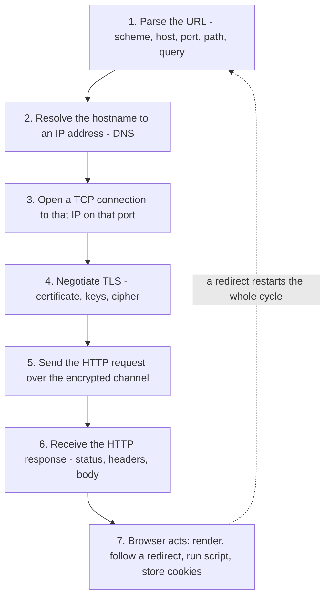
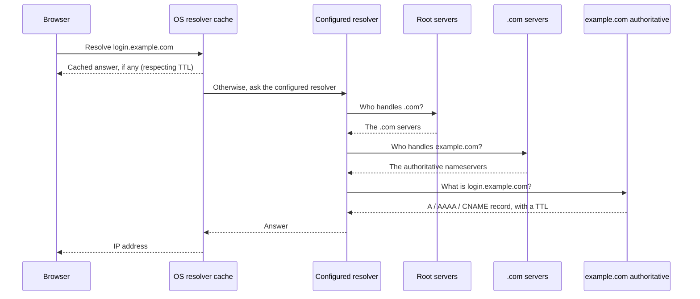
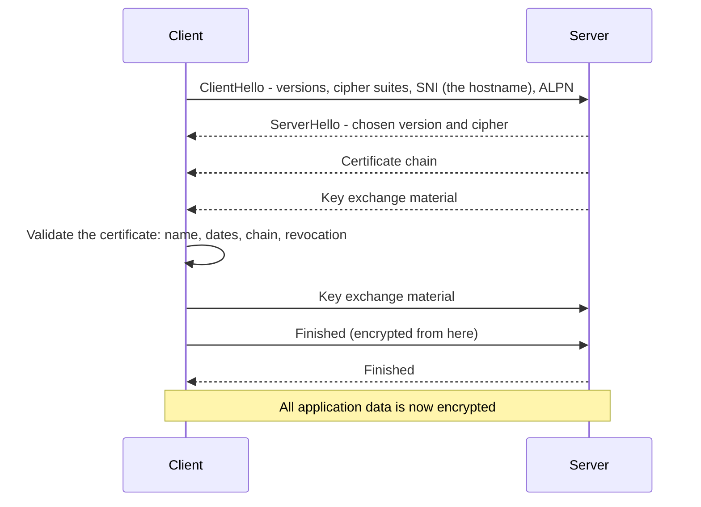
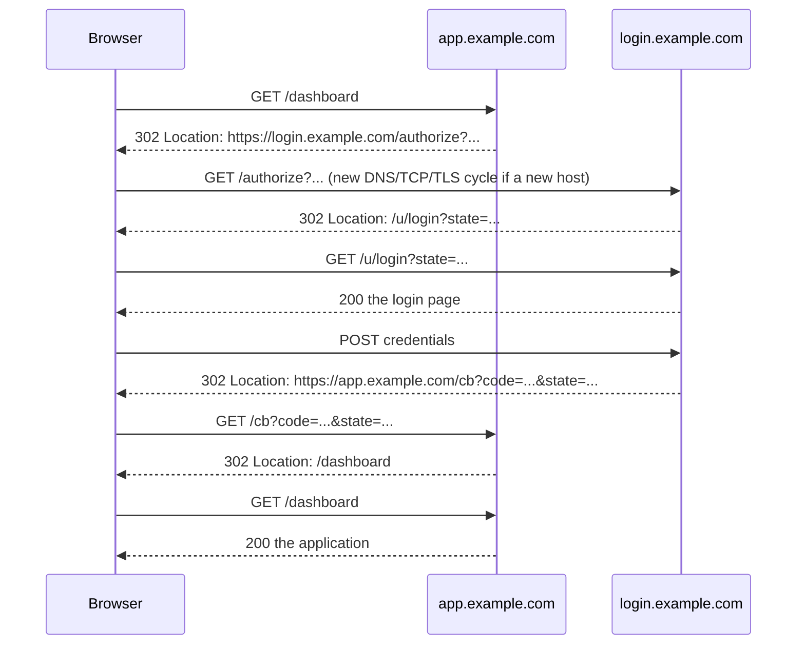
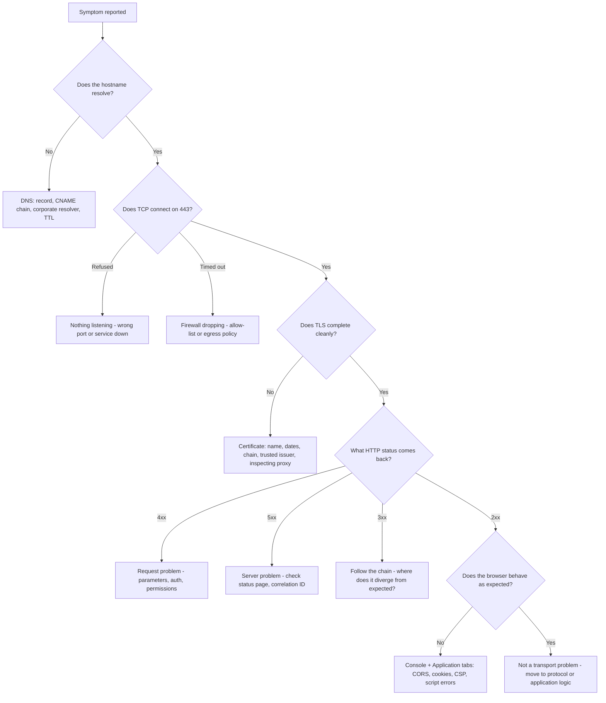

# Part 011 - How a Web Request Really Works

> Section goal: Trace one request end to end — DNS, TCP, TLS, HTTP, response, render — and know exactly what evidence exists at each hop and which tool produces it. This is the Part where your existing networking strength becomes an identity-support superpower, because every login failure happens somewhere on this path.

Covers index item **011**. Maps to JD signals: *knowledge of HTTP*, *knowledge of encryption*, *basic security concepts*, *knowledge of common architectures*, and *instinctive ability to subdivide problems into basic components*.

---

## 1. Start From Zero: What Happens When You Type a URL

You type `https://login.example.com/authorize?...` and press Enter. Before a single pixel appears, roughly seven things must succeed in order.



**The single most important consequence for you:** an identity flow is not one request. It is **a chain of five to fifteen requests**, each of which runs this entire cycle. A "login failure" is really "one link in a chain of seven-step cycles failed", and your job is to find *which link, at which step*.

> **Analogy.** Posting a letter internationally. Step 2 is looking up the address. Step 3 is establishing a route. Step 4 is sealing it in a tamper-evident diplomatic pouch. Step 5 is handing it over. Step 6 is the reply arriving. Step 7 is you reading it and possibly posting another letter in response.
>
> **Where it stops:** unlike post, every step here completes in milliseconds and leaves a trace you can read afterwards — if you capture it.

### 🔍 Plain-English deep-dive: layering, and why it makes you fast

The industry describes this stack in layers. You know the **OSI model** already; here is the practical version that matters for identity work.

| Layer | What it does | If it fails you see | Your tool |
|---|---|---|---|
| **Name resolution (DNS)** | Turns `login.example.com` into `203.0.113.10` | "Server not found", `ERR_NAME_NOT_RESOLVED` | `nslookup`, `dig`, `Resolve-DnsName` |
| **Transport (TCP)** | Reliable byte pipe to an IP and port | "Connection timed out", "Connection refused" | `Test-NetConnection`, Wireshark |
| **Security (TLS)** | Encrypts and authenticates the channel | Certificate warnings, handshake failure | `openssl s_client`, Wireshark, browser padlock |
| **Application (HTTP)** | Request and response semantics | 4xx/5xx status codes | DevTools, HAR, curl, Fiddler |
| **Browser behavior** | Cookies, CORS, storage, script | Console errors, silent no-ops | DevTools Console + Application tabs |

**Why layering makes you fast:** a failure at a lower layer makes every higher layer irrelevant. If DNS fails, arguing about redirect URIs is wasted effort. So the diagnostic order is always **bottom-up**: is the name resolving, is the connection opening, is TLS completing, is HTTP returning, is the browser behaving. Each answer eliminates everything below it.

**Analogy:** if the phone line is dead, there is no point analysing what you said. **Where it stops:** unlike a phone line, some higher-layer failures *look* like lower-layer ones — a proxy returning a TLS error can look like a certificate problem when it is really a policy block.

> 💡 **Tie-in to your background:** you already own this. TCP/IP, OSI, DNS, proxies, firewalls, ports, routing, Wireshark, Netsh, Network Monitor are on your CV, and you have used them on real enterprise escalations. Most candidates for a Customer Identity role come from a web-development background and are genuinely weak here. **This is a differentiator — say so explicitly in the interview.**

---

## 2. Step 1: Parsing the URL

Every character matters, and several of them are common ticket causes.

```
https://login.example.com:443/authorize?client_id=abc&redirect_uri=https%3A%2F%2Fapp.example.com%2Fcb#fragment
└─┬──┘  └────────┬───────┘└┬┘└───┬────┘└──────────────┬───────────────────────────────────┘└───┬───┘
scheme        host       port  path                 query                                  fragment
```

| Component | Meaning | Identity relevance |
|---|---|---|
| **Scheme** | `https` (or `http`) | `http` vs `https` makes redirect URIs non-matching; also blocks `Secure` cookies |
| **Host** | The name to resolve | A different subdomain changes cookie scope entirely |
| **Port** | Default 443 for https, 80 for http | An explicit `:443` may or may not match an allow-list entry — test it |
| **Path** | Which resource | `/callback` vs `/callback/` are different strings |
| **Query** | `?key=value&key2=value2` | Where OAuth parameters live; **sent to the server** |
| **Fragment** | `#...` | **Never sent to the server** — browser-only |

### 🔍 Plain-English deep-dive: the fragment never reaches the server

This is not a detail; it is the reason an entire OAuth flow was designed the way it was and later deprecated.

When a browser requests `https://app.example.com/cb#access_token=xyz`, it sends the server only `GET /cb`. The `#access_token=xyz` part stays in the browser. It is visible to JavaScript on that page, and it appears in the address bar and browser history, but the server never receives it.

Consequences you will meet constantly:

- The **implicit flow** delivered tokens in the fragment precisely so they would not travel to a server — which sounded clever, but put tokens in browser history, in the address bar, and in any script on the page. It is deprecated for this and other reasons (Part 063).
- If a developer says *"the token is in the URL but my server can't see it"*, that is not a bug — that is the specification.
- `response_mode=fragment` versus `query` versus `form_post` (Part 072) is entirely a decision about *who is allowed to see the response*.

**Analogy:** a note written on the outside of an envelope versus one written on your own hand as you post it. The postman sees the envelope; the note on your hand stays with you. **Where it stops:** unlike your hand, the address bar and browser history are surprisingly public — over a shoulder, in a screenshot, in a support ticket.

### Percent-encoding

Certain characters must be escaped inside a query value:

| Character | Encoded | Why it matters |
|---|---|---|
| `:` | `%3A` | Appears in every `redirect_uri` |
| `/` | `%2F` | Same |
| ` ` (space) | `%20` or `+` | **Scopes are space-separated** — `openid profile email` |
| `&` | `%26` | Otherwise it splits the parameter |
| `#` | `%23` | Otherwise it starts a fragment |

**A classic ticket:** a developer builds the authorize URL by string concatenation without encoding, the `redirect_uri` contains a raw `&`, the URL splits into extra parameters, and the authorization server reports an invalid request for reasons that look unrelated. The fix is to use a proper URL-building API rather than string concatenation. Part 013 goes deeper.

---

## 3. Step 2: DNS

**DNS** (Domain Name System) turns a name into an address.



| Record type | Meaning | Identity relevance |
|---|---|---|
| **A** | Name → IPv4 address | The basic mapping |
| **AAAA** | Name → IPv6 address | IPv6-only networks fail differently |
| **CNAME** | Name → another name | **How custom login domains are usually configured** (Part 097) |
| **TXT** | Arbitrary text | Domain-ownership verification for custom domains |
| **TTL** | How long an answer may be cached | Why a DNS change "hasn't taken effect yet" |

### Why DNS matters in identity support

| Symptom | DNS cause |
|---|---|
| Custom login domain not working | CNAME missing, wrong target, or still propagating (TTL) |
| Works for some users, not others | Split-horizon DNS — corporate resolver returns a different answer |
| Works on mobile data, not on office wifi | Corporate DNS override or a DNS-based block |
| Intermittent failures | One of several A records points somewhere stale |
| Works after a hosts-file edit | Confirms the problem is resolution, not the service |

> 💡 **Tie-in to your background:** "works on mobile data but not on corporate wifi" is a diagnostic you have run many times at Microsoft. It is one of the fastest ways to separate a network/DNS problem from an application problem, and it costs the customer thirty seconds. Keep it as a first-line question.

---

## 4. Step 3: TCP

**TCP** establishes a reliable connection to an IP address and port.

```mermaid
sequenceDiagram
    participant C as Client
    participant S as Server
    C->>S: SYN - I would like to connect
    S-->>C: SYN-ACK - acknowledged, and I would like to as well
    C->>S: ACK - acknowledged
    Note over C,S: Connection established; bytes can now flow
```

| Failure | Meaning | Likely cause |
|---|---|---|
| **Connection refused** | Something answered and said no | Nothing listening on that port; wrong port |
| **Connection timed out** | Nothing answered at all | Firewall dropping silently; wrong IP; host down |
| **Reset (RST)** | Connection forcibly closed | Middlebox intervention, or the server rejecting |
| **Slow to establish** | Handshake completes but slowly | Network latency, routing, or an overloaded path |

**The diagnostic that separates DNS from TCP:**

```
Test-NetConnection login.example.com -Port 443
```

If it resolves an address but the TCP test fails, DNS is fine and the connection is blocked. That single command splits the problem in half.

> **Note the difference between "refused" and "timed out".** Refused means something is there and actively declining — usually the wrong port or a service that is down. Timed out means packets are vanishing — usually a firewall configured to drop rather than reject. That distinction routinely identifies the responsible team inside a customer's organisation.

---

## 5. Step 4: TLS

**TLS** (Transport Layer Security — the successor to SSL) does three jobs: it proves the server is who it claims to be, it establishes keys, and it encrypts everything afterwards.



| Element | What it is | Why it matters |
|---|---|---|
| **SNI** | Server Name Indication — the hostname, sent **in the clear** | Lets one IP serve many certificates; also how network filters can block by hostname without decrypting |
| **Certificate** | Signed statement binding a name to a public key | The identity of the *server* |
| **Chain** | Leaf → intermediate → root | A missing intermediate is a classic failure |
| **Validity dates** | Not-before, not-after | Expiry causes overnight outages with no code change |
| **SAN** | Subject Alternative Name — the names the certificate covers | A name mismatch is a hard failure |
| **ALPN** | Which protocol will run on top (`h2`, `http/1.1`) | Occasionally relevant to proxy behavior |

### The four certificate failures you will meet

| Error | Cause | First check |
|---|---|---|
| Name mismatch | The hostname is not in the SAN list | `openssl s_client -connect host:443 -servername host` and read the SANs |
| Expired | Past the not-after date | Read the dates; check whether renewal automation failed |
| Untrusted issuer | The root is not in the client's trust store | Often a corporate TLS-inspecting proxy (Part 023) |
| Incomplete chain | The server did not send the intermediate | Works in browsers that cache intermediates, fails elsewhere — a very confusing symptom |

> **The "works in Chrome, fails in curl / on the server" pattern** is almost always an incomplete chain. Browsers often have the intermediate cached from a previous site; a server-side HTTP client does not. When a developer says "it works in my browser but my backend can't connect", check the chain first.

### 🔍 Plain-English deep-dive: TLS proves the *server*, not the *user*

A padlock in the address bar means: the traffic is encrypted, and the server presented a certificate for this hostname signed by an authority the browser trusts.

It does **not** mean the site is trustworthy, honest, or the one you intended to visit. A phishing site can obtain a valid certificate for its own lookalike domain in minutes, and it will show a padlock.

This matters because customers conflate the two constantly, and because it explains the division of labour in your whole domain:

- **TLS** answers "am I talking to the right *server*?"
- **The identity protocols** answer "who is the *user*, and what may they do?"

Two entirely different questions, two entirely different mechanisms, both using certificates and signatures — which is exactly why they get confused. **Analogy:** a sealed courier envelope proves the courier company is legitimate. It says nothing about whether the letter inside is honest. **Where it stops:** with mutual TLS (Part 038), the *client* also presents a certificate, and then TLS does start doing identity work.

---

## 6. Steps 5–6: The HTTP Exchange

```
GET /authorize?client_id=abc&redirect_uri=... HTTP/1.1
Host: login.example.com
User-Agent: Mozilla/5.0 ...
Accept: text/html,...
Cookie: session=...
```

```
HTTP/1.1 302 Found
Location: https://login.example.com/u/login?state=...
Set-Cookie: state=...; Path=/; HttpOnly; Secure; SameSite=None
Content-Length: 0
```

| Part | What it carries |
|---|---|
| **Request line** | Method, path with query, HTTP version |
| **Request headers** | `Host`, `Cookie`, `Authorization`, `Origin`, `Referer`, `Accept` |
| **Request body** | Present on POST/PUT — where token requests carry their parameters |
| **Status line** | The three-digit outcome |
| **Response headers** | `Location`, `Set-Cookie`, `Access-Control-Allow-Origin`, `WWW-Authenticate`, `Cache-Control` |
| **Response body** | HTML, JSON, or empty |

Part 012 covers HTTP in full. For now, the key structural insight is **the redirect**.

### Redirects are the backbone of identity



That is **nine** HTTP exchanges for one "login", crossing two hosts, with cookies being set and read along the way.

**Therefore:** capturing only the *failing* request is almost always insufficient. You need the whole chain, which is why "preserve log" in DevTools and a full HAR are non-negotiable (Part 021).

---

## 7. Step 7: What the Browser Does Next

The response is only half the story. The browser then acts on it.

| Response says | Browser does | Where it can go wrong |
|---|---|---|
| `302` + `Location` | Issues a new request to that URL | Redirect loop; cross-origin redirect stripping headers |
| `Set-Cookie` | Stores it — **if** the attributes permit | `SameSite`, `Secure`, `Domain` mismatches (Part 014) |
| `Content-Type: text/html` | Parses and renders; runs scripts | CSP blocking a script; a script erroring silently |
| `Access-Control-Allow-Origin` missing | **Blocks the response from JavaScript** | The classic CORS failure (Part 015) |
| `401` + `WWW-Authenticate` | May prompt, or leave it to the app | Confusing native prompts in enterprise setups |

### 🔍 Plain-English deep-dive: "the request succeeded but JavaScript can't see the response"

This is the single most misunderstood behavior in browser-based identity, and it produces some of the most frustrating tickets.

With CORS, the browser **does send** the request. The server **does process** it. The response **does come back**. Then, because the response lacks the right `Access-Control-Allow-Origin` header, the browser **refuses to hand it to the JavaScript that asked for it**.

So:

- The **server logs show a successful 200.**
- The **browser Network tab shows the request** — and often the response.
- The **JavaScript sees only a generic network error** with no detail.
- The developer says *"your API is broken"*; the API owner says *"our logs show it worked"*. Both are telling the truth.

Understanding that CORS is a **browser-enforced** restriction, not a server-side rejection, resolves this class of argument instantly. Note also that it is not a security control protecting the server — anything can call the server with curl. It protects *users* from one site reading another site's authenticated responses.

**Analogy:** a courier delivers the parcel to the building, but reception refuses to pass it to you because your name is not on the approved list. The parcel arrived; you cannot have it. **Where it stops:** unlike reception, the browser will not tell your JavaScript *why*, on purpose — the detail is only in the console.

---

## 8. Evidence and Tools, Layer by Layer

This is the practical payoff of the whole Part.

| Layer | Evidence available | Tool (Windows-friendly) | What to look for |
|---|---|---|---|
| DNS | Resolved address, record type, TTL | `Resolve-DnsName`, `nslookup`, `dig` | Correct target? CNAME chain? Different answer on a different network? |
| TCP | Connect success, latency, resets | `Test-NetConnection`, Wireshark | Refused vs timed out |
| TLS | Version, cipher, certificate chain, SANs, dates | `openssl s_client`, browser padlock, Wireshark | Name match, expiry, complete chain, unexpected issuer |
| HTTP | Method, URL, status, headers, body | DevTools, **HAR**, curl, Fiddler | Status, `Location`, `Set-Cookie`, `error_description` |
| Browser | Console errors, cookie jar, storage | DevTools Console + Application tabs | CORS messages, cookie present/absent, storage contents |
| Server side | Correlation IDs, event codes | Tenant logs (Part 107) | The other half of the story |

### The bottom-up triage sequence



**Use this order every time.** It is mechanical, it is fast, and each answer eliminates everything below it. It is also, precisely, the JD's *"instinctive ability to subdivide problems into basic components in order to efficiently pinpoint the root cause."*

---

## 9. Failure Modes

| Failure mode | What it looks like | Consequence | Correction |
|---|---|---|---|
| **Starting at HTTP** | Debating redirect URIs when DNS is broken | Hours wasted at the wrong layer | Always triage bottom-up |
| **Capturing one request** | Only the failing call in the HAR | The cause was three redirects earlier | Preserve log; capture the whole chain |
| **Trusting the padlock** | "It's HTTPS so it's fine" | Missed proxy interception, missed phishing | TLS authenticates the server only |
| **Ignoring "works on mobile data"** | Not asking the network question | Missing a corporate DNS or proxy cause | Ask it in the first response |
| **Misreading CORS** | Treating it as a server rejection | Two teams blaming each other | Browser-enforced; server logs will show 200 |
| **Ignoring the fragment rule** | Expecting the server to see `#...` | Chasing a non-bug | The fragment never leaves the browser |
| **Refused vs timed out confusion** | Treating them alike | Wrong team engaged | Refused = something declined; timed out = packets dropped |
| **Ignoring chain completeness** | "It works in my browser" | Server-side clients still fail | Test with `openssl s_client`, not only a browser |
| **Not recording exact timestamps** | Cannot correlate with tenant logs | The server-side half is unfindable | Timestamps with timezone, always |

---

## 10. Lab: Trace One Request All the Way Down

**Purpose.** Produce a complete, layer-by-layer trace of a real request against **your own** lab tenant, and build the tool-per-layer reference you will use for the rest of the guide.

**Prerequisites.** Part 007's lab tenant. `curl`, `openssl`, PowerShell. A browser with DevTools. **Only your own tenant** — no third-party hosts.

**Steps.**

1. Create `okta-prep/labs/011-request-trace/`.
2. **URL anatomy.** Take your tenant's discovery URL. Write out its scheme, host, port, path, query, and fragment. Then hand-write a full `/authorize` URL with `client_id`, `redirect_uri`, `response_type`, `scope`, `state`, and `audience`, correctly percent-encoded. Save as `url-anatomy.md`.
3. **DNS.** `Resolve-DnsName <your-tenant-domain>` — record the record type, target, and TTL. If it is a CNAME, follow the chain. Save the output.
4. **TCP.** `Test-NetConnection <your-tenant-domain> -Port 443` — record success and latency. Then deliberately test a closed port (e.g. `-Port 8443`) and record the *different* failure. **Two failure-catalog rows.**
5. **TLS.** `openssl s_client -connect <domain>:443 -servername <domain> </dev/null` — record the negotiated version, cipher, certificate subject, issuer, SANs, and validity dates. Save the output (this is public information; no redaction needed).
6. **HTTP.** `curl -v https://<domain>/.well-known/openid-configuration` — save the verbose output showing the connection, TLS, request headers, response status and headers.
7. **The chain.** In the browser, open DevTools → Network, tick **Preserve log**, and initiate a login to your lab application. Count the requests. Export a HAR. **Redact it per Part 006 before saving to `evidence/`.**
8. **Annotate the chain.** In `chain-annotation.md`, list every request in order with: URL, status, why it happened, and what it set or carried. You should see the nine-exchange pattern from §6.
9. **Break it, four ways.** Record the exact error for each:
   - a. A hostname that does not exist (DNS failure).
   - b. Correct host, wrong port (TCP failure).
   - c. `curl` against your tenant with `--resolve` pointing the name at a different IP you own, or simply request an unrelated HTTPS host using your tenant's name via `-H "Host:"` — observe a certificate name mismatch. *(Do not disable verification; the failure is the lesson.)*
   - d. A `/authorize` request with a `redirect_uri` not on the allow-list (HTTP-layer failure).
10. **Tool card.** Write `tools-by-layer.md` — §8's table with the exact command you personally ran at each layer.
11. **Failure catalog + manifest.** Add all rows; complete `MANIFEST.md` with honest limitations.

**Expected evidence.** Nine files: URL anatomy, DNS output, two TCP outputs, TLS output, curl verbose output, a redacted HAR, a chain annotation, and a tool card — plus four new failure-catalog rows.

**Validation rubric.**

| Check | Pass condition |
|---|---|
| URL hand-built | Correctly percent-encoded, every parameter present |
| DNS recorded | Record type, target, and TTL captured |
| Both TCP failures | Refused *and* timed-out captured as distinct outcomes |
| TLS details | Version, cipher, SANs, and both validity dates recorded |
| Chain counted | Number of requests recorded, and each annotated with its purpose |
| HAR redacted | No token, cookie value, code, or secret survives |
| Four failures | Exact error text for each, verbatim |
| Tool card | Every layer has a command you actually ran |
| No third-party targets | Every command targeted your own tenant or a host you own |

**Cleanup and privacy.** Only your own lab tenant. **Do not** run these commands against your employer's systems, a customer's systems, or any third party — that is the charter rule from Part 007. Redact the HAR before saving. Delete the raw HAR once the redacted version exists.

---

## 11. JD Mapping

| Supplied JD signal | How this Part supports it |
|---|---|
| Knowledge of HTTP | §§6–7 establish request/response anatomy, redirect chains, and browser behavior |
| Knowledge of encryption | §5 covers the TLS handshake, certificates, chains, SNI, and the four failure modes |
| Basic security concepts | §5's deep-dive on what TLS does and does not prove |
| Knowledge of common architectures | §6's nine-exchange chain shows why identity spans hosts and why evidence spans them too |
| Instinctive ability to subdivide problems | §8's bottom-up triage sequence *is* that ability, made mechanical |
| Strong analytical and problem-solving skills | §10's four deliberate failures build symptom-to-layer recognition |
| Self-starter on complex concepts | The lab is entirely self-directed against your own tenant |
| Resolve issues in a timely fashion | Layer elimination is the fastest known way to narrow an identity failure |

---

## 12. Candidate Honesty Note

- **Production transfer (strong):** DNS, TCP/IP, TLS/SSL, proxies, firewalls, ports, routing, Wireshark, Netsh, Network Monitor, HAR and Fiddler analysis are all on your CV and were used on real enterprise escalations. This Part is revision plus re-framing, not new learning.
- **Say this in the interview:** *"Most people coming into customer identity arrive from web development and are weak at the network layer. I'm the opposite — I've spent five years reading packet captures and HAR files on enterprise escalations. What I've had to learn is the protocol layer above it, which is what my lab work has focused on."* That is honest, differentiating, and it reframes your gap as a complement rather than a deficit.
- **New here:** the specific identity-shaped consequences — the fragment rule, redirect chains as the backbone of the flow, and CORS as a browser-enforced restriction rather than a server rejection.
- **Do not claim** network engineering ownership. You are a support engineer who reads network evidence expertly. That is precisely what the role needs.

---

## 13. Official Source Anchors

Accessed **26 August 2026**.

| Source family | Use it for |
|---|---|
| IETF RFC 9110 (HTTP Semantics) and RFC 9112 (HTTP/1.1) | Current, consolidated HTTP definitions used in §6 |
| IETF RFC 8446 (TLS 1.3) and RFC 5246 (TLS 1.2) | Handshake structure and the elements in §5 |
| IETF RFC 6125 | How server identity is verified against a certificate |
| IETF RFC 1034 / 1035 and DNS RFCs | Record types, resolution, and caching in §3 |
| IETF RFC 3986 (URI Generic Syntax) | URL components and percent-encoding in §2 |
| MDN Web Docs — HTTP, CORS, cookies, Fetch | Browser-side behavior in §7, with practical examples |
| Fetch and CORS living standards | The precise browser enforcement rules referenced in §7 |
| Microsoft Learn — `Resolve-DnsName`, `Test-NetConnection` | The Windows tooling used in §10 |
| OpenSSL documentation — `s_client` | Certificate and handshake inspection |
| Auth0 and Okta documentation — custom domains | Why CNAME configuration appears in identity tickets (§3) |

**Revalidate after 26 August 2026:** vendor custom-domain instructions only. The transport and URI standards are stable.

---

## ⭐ Likely Interview Questions for This Section

### Q1. "Walk me through what happens when a user clicks 'log in'."
> *Model answer:* "It's not one request — it's typically nine or more, and each one runs a full cycle. The app returns a 302 to the authorization server's `/authorize` endpoint. That's a different host, so the browser resolves it via DNS, opens a TCP connection, negotiates TLS, and sends the HTTP request. The authorization server redirects again to a login page, sets a state cookie, renders it. The user posts credentials. The server redirects back to the application's callback with an authorization code and the `state` value. The application verifies `state`, then makes a *back-channel* call — server to server, not through the browser — to exchange the code for tokens. Then it sets its own session cookie and redirects to the destination. The support consequence is that capturing only the failing request is almost never enough; you need the whole chain with preserve-log enabled, because the cause is usually several hops earlier."

### Q2. "A user reports 'the login page won't load'. How do you diagnose it?"
> *Model answer:* "Bottom-up, because a failure at a lower layer makes every higher layer irrelevant. Does the hostname resolve — and does it resolve to the same thing on their network as on mine, because split-horizon DNS and corporate resolvers are common. Does TCP connect on 443, and if not, is it *refused* or *timed out*? Refused means something answered and declined — wrong port or a service down. Timed out means packets are vanishing — a firewall configured to drop rather than reject, which also tells the customer which internal team to talk to. Then does TLS complete: name match, validity dates, complete chain, and is the issuer what I expect or is there an inspecting proxy? Only then do I look at HTTP status codes. And I'd ask early whether it works on mobile data versus their corporate network — that thirty-second test separates network from application faster than anything else."

### Q3. "Why does the fragment of a URL never reach the server?"
> *Model answer:* "Because it was designed as a client-side pointer — originally 'scroll to this anchor on the page' — so browsers strip it before sending the request. The server sees only the path and query. That's not a quirk; it's the reason the implicit flow existed. Tokens were returned in the fragment precisely so they wouldn't travel to any server. The problem is that they then live in the address bar, in browser history, and are readable by any script on the page, which is a large part of why implicit is deprecated. Practically, if a developer tells me 'the token is in the URL but my backend can't see it', that's the specification working, not a bug. And it's why `response_mode` — query, fragment, or form_post — is really a decision about who is permitted to see the response."

### Q4. "It works in the browser but the customer's server can't connect. What's your first thought?"
> *Model answer:* "An incomplete certificate chain. Browsers often have the intermediate certificate cached from some other site they've visited, so they can complete the chain even when the server doesn't send it. A server-side HTTP client has no such cache and fails. It's a genuinely confusing symptom because the customer's evidence — 'it works in my browser' — is real. I'd verify with `openssl s_client` rather than a browser, because that shows exactly which certificates the server actually sent. The other candidates are a corporate TLS-inspecting proxy the browser trusts but the server runtime doesn't, or an egress firewall rule that applies to servers but not to user workstations. Either way, the point is that 'works in my browser' is not evidence that TLS is correctly configured."

### Q5. "Explain CORS to someone who thinks their API is broken."
> *Model answer:* "The key thing is that CORS is enforced by the *browser*, not by the server, and that resolves the argument immediately. The browser sent the request. The server received it, processed it, and returned a 200 — which is why the API team's logs show success and they're not lying. But because the response didn't carry an `Access-Control-Allow-Origin` header matching the calling page's origin, the browser refused to hand the response to the JavaScript that asked for it. The developer sees a generic network error with no detail, deliberately, because leaking the detail would defeat the purpose. So both parties are telling the truth. And CORS isn't protecting the server — anything can call it with curl. It protects *users*, by stopping one site from reading another site's authenticated responses using the victim's cookies."

### Q6. "What does the padlock in the browser actually tell you?"
> *Model answer:* "Two things, and neither is what most people assume. It tells you the traffic is encrypted, and that the server presented a certificate for this hostname signed by an authority the browser trusts. It does not tell you the site is honest, or that it's the site you meant to visit — a phishing domain can obtain a valid certificate for its own lookalike name in minutes and will show the same padlock. That distinction is the whole division of labour in identity: TLS answers 'am I talking to the right *server*', and the identity protocols answer 'who is the *user* and what may they do'. They both use certificates and signatures, which is exactly why people conflate them. The exception is mutual TLS, where the client also presents a certificate — at that point TLS does start doing identity work."

### Q7. "How is your networking background relevant to a customer identity role?"
> *Model answer:* "Directly, and I think it's a differentiator rather than an adjacent skill. Every identity flow is a chain of HTTP requests over TLS, resolved by DNS, often crossing a corporate proxy or firewall. When a login fails, the failure is somewhere on that path, and the fastest way to find it is to eliminate layers bottom-up. I've spent five years doing exactly that at Microsoft with Wireshark, Netsh, Network Monitor, Fiddler and HAR analysis on enterprise escalations. Most people entering customer identity come from web development and are genuinely weak below HTTP — they'll debug redirect URIs for an hour when the real problem is that the corporate resolver returns a different address. What I've had to learn is the protocol layer above, which is where my lab work has gone."

### Q8. "A customer's login works at home but not in their office. Where do you start?"
> *Model answer:* "That's a network-environment difference, so I start by identifying which layer differs. First DNS — corporate resolvers often use split-horizon or internal overrides, so I'd have them resolve the hostname on both networks and compare the answers. Then egress: is 443 to that host actually permitted, and is the failure refused or timed out? Then TLS interception — many corporate networks run an inspecting proxy that re-signs traffic with an internal certificate authority, which is fine for domain-joined browsers that trust it but breaks certificate pinning, breaks non-browser clients, and can alter headers. Then proxy behavior — a proxy that strips or rewrites headers, or that can't handle the redirect chain. The mobile-data-versus-office-wifi test costs the user thirty seconds and immediately tells me whether I'm debugging their network or the application."

---

## 🧠 30-Second Memory Hooks

- **Seven steps:** parse URL → DNS → TCP → TLS → HTTP request → HTTP response → browser acts.
- **A login is nine-plus requests, not one.** Always capture the whole chain with preserve log.
- **Triage bottom-up.** A lower-layer failure makes everything above it irrelevant.
- **Refused = something declined** (wrong port/service down). **Timed out = packets dropped** (firewall).
- **The fragment never reaches the server.** That is why implicit existed, and part of why it died.
- **Scopes are space-separated** → `%20` when encoded. Never build URLs by string concatenation.
- **CNAME = how custom login domains work.** TTL = why "it hasn't propagated yet".
- **TLS proves the *server*, not the site's honesty and not the user.**
- **"Works in Chrome, fails on the server" = incomplete certificate chain.**
- **CORS is browser-enforced.** Server logs show 200; JavaScript sees nothing. Both parties are telling the truth.
- **"Mobile data vs office wifi"** is the cheapest network-versus-application test there is.

---

## ✅ Completion Checklist

- [ ] **Knowledge:** I can name the seven steps, the tool for each layer, and the difference between connection-refused and connection-timeout.
- [ ] **Lab artifact:** `011-request-trace/` contains all nine files, including a redacted HAR and an annotated request chain.
- [ ] **Spoken:** I can narrate a full login chain aloud in under 90 seconds, naming what happens at each hop.
- [ ] **Honesty check:** every command in the lab targeted only my own tenant, and my networking claim is framed as support experience, not network engineering.
- [ ] **Source check:** I have opened RFC 3986's URI syntax section and MDN's CORS page myself.

---

*Next suggested section:* **[Part 012 - HTTP Deep Dive: Methods, Status Codes, Headers, Redirects](Part-012-http-deep-dive-methods-status-codes-headers-redirects.md)** — with the full path traced, zoom in on the layer where almost all identity evidence actually lives.
