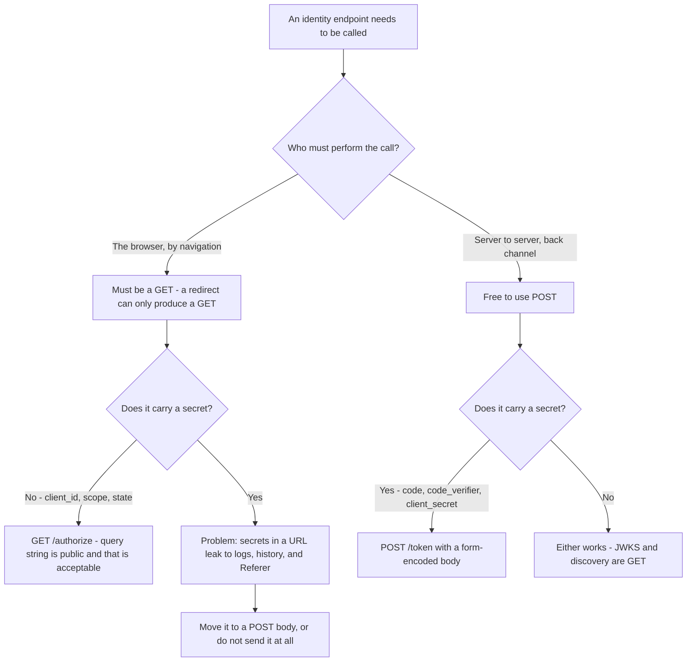
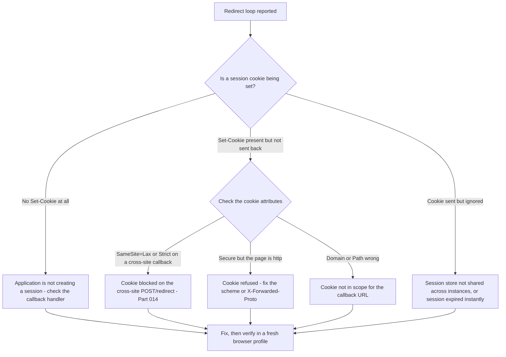
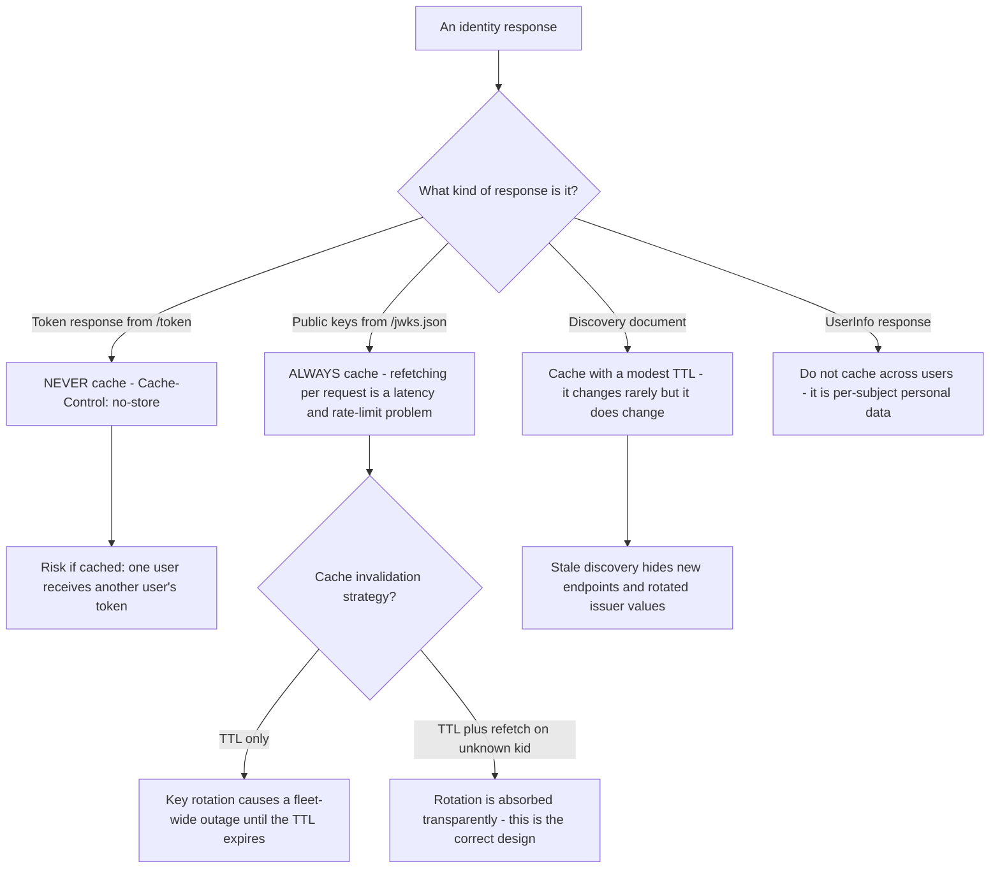
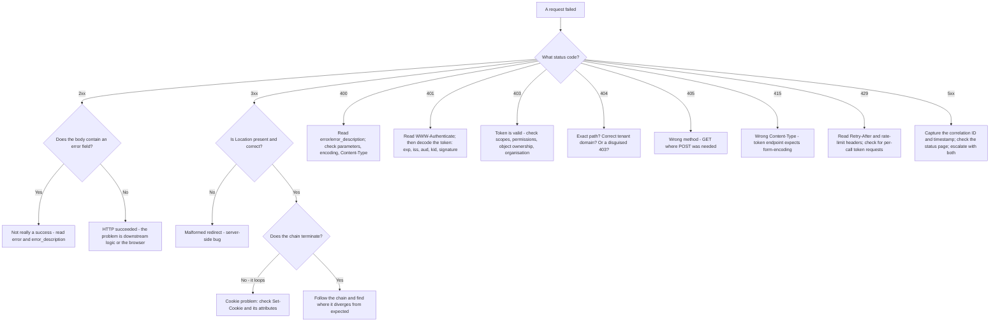

# Part 012 - HTTP Deep Dive: Methods, Status Codes, Headers, Redirects

> Section goal: Master the layer where almost all identity evidence lives. After this Part you should be able to read any HTTP exchange in a HAR and say what it was trying to do, whether it succeeded, and what the response is instructing the browser to do next — without guessing.

Covers index item **012**. Maps to JD signals: *knowledge of HTTP* (named explicitly), *basic security concepts*, *knowledge of common architectures*, *strong analytical and problem-solving skills*, and *promote best practices*.

---

## 1. Start From Zero: What HTTP Actually Is

**HTTP** (HyperText Transfer Protocol) is a request/response conversation. A client asks for something; a server answers. That is the whole model.

Two properties define it and cause most confusion:

| Property | Meaning | Consequence for identity |
|---|---|---|
| **Text-based and structured** | Requests and responses have a fixed shape you can read | Every piece of evidence is human-readable — this is why HAR is so powerful |
| **Stateless** | The server remembers nothing between requests | **Something must carry state.** That something is a cookie or a token — which is the entire reason identity is hard |

### 🔍 Plain-English deep-dive: "stateless" is why identity exists

Imagine a shop assistant with no memory at all. Every time you speak to them, they have no idea who you are or that you were mid-conversation.

To buy anything, you would have to re-prove your identity in *every single sentence*. That is HTTP.

The workarounds are exactly the two mechanisms you will support:

- **Cookies** — the shop gives you a numbered ticket; you show it every time; they look the number up in their own book. *(Stateful on the server.)*
- **Tokens** — the shop gives you a signed, sealed note stating who you are and what you may buy; you show it every time; they verify the seal without needing a book. *(Stateless on the server.)*

Everything in Parts 044–047 flows from this one trade-off. **Analogy limit:** unlike a paper ticket, a cookie can be silently sent by your browser to a site you did not intend to interact with — which is why `SameSite` exists (Part 014).

### Anatomy

```
POST /oauth/token HTTP/1.1                     <- request line: method, target, version
Host: login.example.com                        <- headers
Content-Type: application/x-www-form-urlencoded
Content-Length: 187
                                               <- blank line separates headers from body
grant_type=authorization_code&code=abc&...     <- body
```

```
HTTP/1.1 200 OK                                <- status line: version, code, reason
Content-Type: application/json                 <- headers
Cache-Control: no-store
Set-Cookie: did=xyz; Path=/; Secure; HttpOnly; SameSite=None

{"access_token":"...","token_type":"Bearer","expires_in":86400}   <- body
```

---

## 2. Methods

| Method | Means | Safe? | Idempotent? | Where you see it in identity |
|---|---|---|---|---|
| **GET** | Retrieve | Yes | Yes | `/authorize`, `/.well-known/...`, `/jwks.json`, `/userinfo` |
| **POST** | Submit / create | No | No | `/oauth/token`, `/oauth/revoke`, credential submission, `form_post` responses |
| **PUT** | Replace entirely | No | Yes | Management API updates |
| **PATCH** | Modify partially | No | No | Management API updates, SCIM |
| **DELETE** | Remove | No | Yes | Revoking a session, deleting a user |
| **OPTIONS** | Ask what is permitted | Yes | Yes | **CORS preflight** (Part 015) |
| **HEAD** | Headers only, no body | Yes | Yes | Health checks |

**Safe** = does not change server state. **Idempotent** = doing it twice has the same effect as doing it once.



### 🔍 Plain-English deep-dive: why `/authorize` is a GET and `/token` is a POST

This is not arbitrary, and understanding it explains several failure modes.

- **`/authorize` is a GET** because the *browser must be navigated there*. A redirect can only produce a GET. The user needs to see a page, possibly log in, possibly consent. Its parameters therefore travel in the **query string** — visible in the address bar, in browser history, in server access logs, and in the `Referer` header of anything the page loads.
- **`/token` is a POST** because it carries secrets: the authorization code, the PKCE verifier, and possibly the client secret. Those must be in a **request body**, which is not logged in access logs, not in browser history, and not in the address bar. It is also a **back-channel** call — server to server, or at least not a browser navigation — so no redirect is involved.

**Two practical consequences:**

1. **Never put a secret in a query string.** If a developer's token request uses GET with parameters in the URL, that is a finding: their client secret is now in every intermediate log.
2. **Because `/authorize` parameters are in the URL, everything there is public.** `client_id` is not a secret and never was. Explaining that saves a lot of pointless customer anxiety.

**Analogy:** the shop window versus the counter. `/authorize` is the window — anyone walking past can read it. `/token` is the counter, where you hand things over discreetly. **Where it stops:** a window can be curtained; a URL cannot.

---

## 3. Status Codes

Five families. Learn the shape, then the specific ones.

| Family | Meaning | Mental model |
|---|---|---|
| **1xx** | Informational | Rare; ignore for now |
| **2xx** | Success | It worked |
| **3xx** | Redirection | Go somewhere else — **the backbone of identity** |
| **4xx** | Client error | *You* did something wrong |
| **5xx** | Server error | *I* did something wrong |

### The codes that matter in identity

| Code | Name | What it means in an identity flow | First thing to check |
|---|---|---|---|
| **200** | OK | Success — **including a JSON body containing an error** | Read the body; a 200 can carry `{"error":"..."}` |
| **201** | Created | A resource was created | Management API |
| **204** | No Content | Success, nothing to return | Revocation, deletion |
| **302** | Found | Temporary redirect | Read `Location` — this is the whole flow |
| **303** | See Other | Redirect, forcing a GET | Post-login redirects |
| **307/308** | Temporary/Permanent, method preserved | Redirect that keeps POST as POST | Rare, but surprising when it happens |
| **304** | Not Modified | Use your cache | Can mask stale JWKS |
| **400** | Bad Request | Malformed or invalid parameters | `error` and `error_description` in the body |
| **401** | Unauthorized | **Not authenticated** — no valid credential | Is there a token? Is it valid? Read `WWW-Authenticate` |
| **403** | Forbidden | **Authenticated but not allowed** | Scopes, permissions, object ownership |
| **404** | Not Found | Wrong URL, or a deliberately obscured 403 | Check the exact path and tenant domain |
| **405** | Method Not Allowed | Right URL, wrong verb | GET where POST was required |
| **409** | Conflict | State conflict | Duplicate user, concurrent update |
| **415** | Unsupported Media Type | Wrong `Content-Type` | Token endpoint expects form-encoding, not JSON |
| **429** | Too Many Requests | Rate limited | Read `Retry-After` and rate-limit headers |
| **500** | Internal Server Error | Unhandled server fault | Capture the correlation ID; check the status page |
| **502/503/504** | Gateway errors | Something upstream is unhealthy | Often a proxy or the customer's own gateway |

### 🔍 Plain-English deep-dive: 401 versus 403, the distinction everyone gets wrong

This single distinction resolves an enormous number of tickets, and developers routinely conflate them.

| | 401 Unauthorized | 403 Forbidden |
|---|---|---|
| Really means | "I do not know who you are" | "I know who you are, and no" |
| Cause | Missing, malformed, expired, or invalid-signature token | Valid token, but insufficient scope/permission/ownership |
| Correct client response | Get a new token; re-authenticate | Do **not** retry — nothing will change |
| Should carry | `WWW-Authenticate` header explaining why | Optionally a reason |
| Support next step | Decode the token; check `exp`, `iss`, `aud`, `kid`, signature | Check scopes in the token, permissions, and object ownership |

**Why the confusion is expensive:** a client that receives 403 and responds by refreshing its token will loop forever, burning rate limit, because the token was never the problem. A client that receives 401 and gives up will log the user out unnecessarily.

**The naming is genuinely bad** — "Unauthorized" describes authentication, not authorization. Remember it as: **401 = unauthenticated, 403 = unauthorized.**

**Analogy:** 401 is the door refusing to open because your badge is unreadable. 403 is the door reading your badge perfectly and telling you this floor is not yours. **Where it stops:** some APIs deliberately return 404 instead of 403 to avoid revealing that a resource exists — so a 404 on a specific record can secretly be an authorization decision.

### The 200-with-an-error trap

Some endpoints return HTTP 200 with an error in the JSON body:

```json
HTTP/1.1 200 OK
{"error":"invalid_grant","error_description":"Invalid authorization code"}
```

A client that only checks `response.ok` will treat this as success and behave unpredictably. **Always read the body**, and when advising a developer, tell them to check for an `error` field regardless of status code.

---

## 4. Headers That Matter

### Request headers

| Header | Carries | Identity relevance |
|---|---|---|
| `Host` | Target hostname | Which tenant/domain — matters behind proxies |
| `Authorization` | `Bearer <token>` or `Basic <base64>` | **The credential.** Always redact |
| `Cookie` | Stored cookies for this origin | Session state. Always redact values, keep names |
| `Origin` | The origin making a cross-site request | **CORS input** — the server matches against this |
| `Referer` | The page that linked here | Can leak query parameters; note the historic misspelling |
| `Content-Type` | Body format | Token endpoint needs `application/x-www-form-urlencoded` |
| `Accept` | Wanted response format | Occasionally changes error format |
| `User-Agent` | Client software | Browser and version — relevant to cookie policy differences |
| `X-Forwarded-For` / `X-Forwarded-Proto` | Original client IP / scheme, added by proxies | **Wrong `X-Forwarded-Proto` builds `http` redirect URIs behind an HTTPS load balancer** — a classic bug |
| `DPoP` | Proof-of-possession JWT | Sender-constrained tokens (Part 068) |

### Response headers

| Header | Carries | Identity relevance |
|---|---|---|
| `Location` | Redirect target | The single most important header in an identity flow |
| `Set-Cookie` | Cookie plus attributes | `SameSite`, `Secure`, `HttpOnly`, `Domain`, `Path` (Part 014) |
| `WWW-Authenticate` | Why a 401 happened | Often contains `error="invalid_token", error_description="..."` — frequently overlooked |
| `Access-Control-Allow-Origin` | Which origin may read this | CORS (Part 015) |
| `Access-Control-Allow-Credentials` | May credentials be sent | Must be `true` for cookie-bearing cross-origin calls |
| `Cache-Control` | Caching rules | Token responses must be `no-store` |
| `Content-Security-Policy` | What the page may load/run | Can block an SDK or an embedded frame |
| `Strict-Transport-Security` | Force HTTPS | Prevents `http` downgrade |
| `Retry-After` | When to retry | Correct 429 handling |
| `X-Frame-Options` / `frame-ancestors` | Framing permission | Why silent-auth iframes are refused |
| Correlation/request ID headers | Server-side trace identifier | **The bridge to tenant logs** — always capture |

### 🔍 Plain-English deep-dive: `WWW-Authenticate` is the free answer nobody reads

When an API returns 401, the specification says it should include a `WWW-Authenticate` header. In OAuth bearer-token usage that header commonly looks like:

```
WWW-Authenticate: Bearer realm="api", error="invalid_token",
                  error_description="The access token expired"
```

That is the server telling you *exactly* why, in plain text. Yet developers routinely report "I just get a 401" because their HTTP client surfaces only the status code and they never inspected the headers.

**Make this your reflex:** on any 401, the first question is *"what does the `WWW-Authenticate` header say?"* It converts a guessing game into a stated cause, and it is a genuinely impressive first question to ask a customer.

**Analogy:** a rejected form returned with the reason written at the top, which the applicant never turns over to read. **Where it stops:** some servers omit it or give a generic value, in which case you fall back to decoding the token yourself (Part 043).

---

## 5. Redirects: The Backbone

| Code | Method after redirect | Use |
|---|---|---|
| **301** Moved Permanently | May change POST → GET | Permanent moves; **cached by browsers**, which makes mistakes sticky |
| **302** Found | Usually POST → GET | The workhorse of identity flows |
| **303** See Other | **Always** GET | After a POST, to prevent resubmission |
| **307** Temporary Redirect | **Preserves** the method and body | Surprising: a POST stays a POST |
| **308** Permanent Redirect | Preserves method, permanent | Rare |

### Things that go wrong with redirects

| Problem | Symptom | Cause |
|---|---|---|
| **Redirect loop** | Browser reports "too many redirects" | App redirects to login, login redirects back, session never persists → **check cookies** |
| **Lost headers** | `Authorization` disappears after a redirect | Clients deliberately drop `Authorization` on cross-origin redirects |
| **Lost body** | POST becomes GET, body vanishes | 301/302 semantics; use 307 if the body must survive |
| **Cached 301** | A fix does not take effect | The browser cached the permanent redirect; test in a fresh profile |
| **Open redirect** | Attacker-controlled `Location` | A real vulnerability — never redirect to an unvalidated user-supplied URL |
| **Scheme downgrade** | Redirected to `http` | Wrong `X-Forwarded-Proto` behind a load balancer |
| **Mixed relative/absolute** | Wrong host in `Location` | Application built the URL from `Host` without checking proxy headers |



**The redirect-loop rule:** a login loop is almost always a **cookie** problem, not an identity-protocol problem. Check `Set-Cookie` first, every time.

---

## 6. Caching

| Header | Effect |
|---|---|
| `Cache-Control: no-store` | Do not store this at all — **required for token responses** |
| `Cache-Control: no-cache` | Store, but revalidate before reuse |
| `Cache-Control: max-age=N` | Fresh for N seconds |
| `ETag` / `If-None-Match` | Conditional requests, producing 304 |
| `Vary` | Which request headers change the response |

**Two identity-specific caching hazards:**

1. **JWKS caching.** Public keys *should* be cached — refetching on every request is a rate-limit and latency problem. But the cache must be invalidated when an unknown `kid` appears, otherwise key rotation causes a mass outage (Part 042).
2. **Token responses must never be cached.** If a proxy caches a `/token` response, one user could receive another user's token. This is why `no-store` is specified, and why a customer's aggressive caching proxy is worth asking about.



---

## 7. HTTP Versions

| Version | Key change | Support relevance |
|---|---|---|
| **HTTP/1.1** | Text-based, one request at a time per connection | Easiest to read in captures |
| **HTTP/2** | Binary, multiplexed, header compression | Header names are lowercase; harder to read raw; a plain Wireshark capture shows no readable headers without keys |
| **HTTP/3** | Runs over QUIC (UDP) | Some corporate firewalls block UDP/443, causing silent fallback or failure |

**Practical consequence:** if a customer's network blocks UDP on 443, HTTP/3 fails and clients fall back — usually invisibly, occasionally not. And when reading a capture, HTTP/2 and HTTP/3 are far less legible than HTTP/1.1, which is one reason HAR (captured at the browser, after decryption) beats packet capture for identity work.

> 💡 **Tie-in to your background:** you have read packet captures professionally. The key adjustment is that for identity you usually want **HAR**, not Wireshark, because HAR is captured inside the browser after TLS decryption and after HTTP/2 decoding. Wireshark remains the right tool for handshake and connectivity questions (Part 038); HAR is the right tool for everything above TLS.

---

## 8. Failure Modes

| Failure mode | What it looks like | Consequence | Correction |
|---|---|---|---|
| **Only reading the status code** | "It returns 400" | The body had the exact reason | Always read `error` and `error_description` |
| **Ignoring `WWW-Authenticate`** | "I just get a 401" | The server already told you why | Ask for the response headers |
| **Treating 200 as success** | Client proceeds on an error body | Unpredictable downstream behavior | Check for an `error` field regardless of code |
| **Confusing 401 and 403** | Retrying a 403 with a new token | Infinite loop, rate limit consumed | 401 = unauthenticated; 403 = unauthorized |
| **Missing the redirect chain** | Capturing only the last request | Cause was three hops earlier | Preserve log; export a full HAR |
| **Wrong `Content-Type` on `/token`** | 415 or a confusing 400 | Wasted cycles | Token endpoint expects form-encoding |
| **Secrets in a query string** | Client secret in the URL | Leaked into every access log and `Referer` | Secrets go in the POST body |
| **Cached 301** | Fix appears not to work | Hours lost | Test in a fresh profile or incognito |
| **Ignoring `X-Forwarded-Proto`** | `http` redirect URIs behind an HTTPS balancer | Callback mismatch, insecure cookies rejected | Configure proxy trust correctly |
| **Not capturing correlation IDs** | Cannot find the server-side event | Half the evidence is unavailable | Capture request/correlation ID headers every time |

---

## 9. Troubleshooting Decision Tree: Reading Any HTTP Failure



**Worked example.** A developer reports: *"Our token exchange returns 400 and we don't know why."*

1. **Status 400** → read the body, not the code.
2. Body says `{"error":"invalid_grant","error_description":"Invalid authorization code"}`.
3. `invalid_grant` at the token endpoint has four common causes — this is where the failure catalog from Part 007 pays off:

| Cause | Distinguishing evidence |
|---|---|
| Code already used | The flow ran twice — check for a duplicate `/token` POST in the HAR |
| Code expired | Time between the callback and the token request exceeds the code lifetime |
| PKCE verifier mismatch | `code_verifier` differs from the one used to build `code_challenge` — often a page reload lost it |
| Redirect URI mismatch | The `redirect_uri` on `/token` differs from the one on `/authorize` — it must match exactly |

4. **The discriminating test:** compare the `redirect_uri` in the `/authorize` request and the `/token` request in the same HAR, and check the elapsed time between them. Two glances resolve it.

That is *"subdivide problems into basic components"* applied at the HTTP layer.

---

## 10. Lab: Read and Break HTTP

**Purpose.** Build fluency in reading HTTP evidence, and generate a personal status-code and error reference from real responses.

**Prerequisites.** Part 007's lab tenant, Part 011's trace lab. `curl`, `jq`, a browser.

**Steps.**

1. Create `okta-prep/labs/012-http/`.
2. **Discovery as a GET.** `curl -i https://<tenant>/.well-known/openid-configuration` — save the full response including headers. Identify `Content-Type`, caching headers, and any correlation-ID header.
3. **Deliberate 404.** Request a path that does not exist on your tenant. Save the response. Note whether the body is HTML or JSON.
4. **Deliberate 405.** Send a POST to an endpoint that only accepts GET (for example, the discovery document). Record the exact response.
5. **Deliberate 415.** POST to your tenant's token endpoint with `Content-Type: application/json` instead of form-encoding. Record the response — note whether you get 415 or a 400 with a specific error.
6. **Deliberate 400.** POST to the token endpoint with `grant_type=authorization_code` and an obviously invalid `code`. Record `error` and `error_description` exactly.
7. **Deliberate 401.** Call your tenant's `/userinfo` endpoint with `Authorization: Bearer not-a-real-token`. **Record the `WWW-Authenticate` header verbatim** — this is the point of the exercise.
8. **Redirect chain.** `curl -i` the `/authorize` endpoint with valid parameters and **without** following redirects (`--max-redirs 0` or omit `-L`). Read the `Location` header. Then run it with `-L -v` and count the hops.
9. **Redirect-URI mismatch.** Repeat step 8 with a `redirect_uri` that is not on your application's allow-list. Record the exact error and note **at which point in the chain** it appears — before any login page, which is diagnostically important.
10. **Status reference.** Write `status-reference.md`: every code you actually observed, with the exact response body, what caused it, and what you would check first.
11. **Header reference.** Write `header-reference.md`: every response header you actually saw across all the above, what it does, and whether it must be redacted.
12. **Failure catalog + manifest.** Add every observed failure. Complete `MANIFEST.md` honestly.

**Expected evidence.** Ten saved responses, a status reference built from real observations, a header reference, and at least six new failure-catalog rows.

**Validation rubric.**

| Check | Pass condition |
|---|---|
| Six deliberate failures | 404, 405, 415, 400, 401, redirect-URI mismatch, each captured |
| `WWW-Authenticate` captured | Recorded verbatim, and you can explain each field |
| Error bodies exact | Copied character-for-character, not paraphrased |
| Redirect chain counted | Hop count recorded, and each `Location` noted |
| Mismatch position noted | You recorded that it fails *before* the login page |
| References are yours | Built from responses you personally observed |
| Redaction applied | No real token, code, or secret in any saved file |
| Own tenant only | Every request targeted your own tenant |

**Cleanup and privacy.** Only your own lab tenant. Never send these probes at a third-party or employer endpoint — repeated deliberate failures against someone else's service is exactly the unauthorised activity the Part 007 charter forbids. Any token or code that appears in a saved response must be redacted before the file is committed.

---

## 11. JD Mapping

| Supplied JD signal | How this Part supports it |
|---|---|
| Knowledge of HTTP | The entire Part; §§2–7 cover methods, statuses, headers, redirects, caching, and versions |
| Basic security concepts | §2's "no secrets in query strings", §5's open-redirect warning, §6's token-caching hazard |
| Strong analytical and problem-solving skills | §9's decision tree converts any status code into a next action |
| Instinctive ability to subdivide problems | §9's `invalid_grant` worked example discriminates four causes with two glances |
| Knowledge of common architectures | §4's `X-Forwarded-Proto` and §7's HTTP/3 notes cover proxy and load-balancer realities |
| Promote best practices | Advising `no-store` on token responses, form-encoding on `/token`, and correct 403 handling |
| Exceed expectations on response quality | Asking "what does `WWW-Authenticate` say?" is a first-response question that impresses |

---

## 12. Candidate Honesty Note

- **Production transfer (strong):** HTTP/HTTPS is on your CV and you have analysed HAR, Fiddler, and Network Monitor traces on real escalations. Reading status codes, headers, and redirect chains is genuinely existing skill.
- **New here:** the identity-specific patterns — `WWW-Authenticate` on bearer-token 401s, the four causes of `invalid_grant`, form-encoding on `/token`, and `no-store` on token responses.
- **Lab evidence:** the status and header references built from responses you personally generated are showable. "I generated each of these failures against my own tenant and recorded the exact response" is much stronger than "I know what a 401 means."
- **Interview strength:** the 401-versus-403 distinction is asked constantly and answered poorly. Yours should be crisp and include the *client behavior* consequence — that retrying a 403 loops forever.
- **Do not claim** to have built HTTP APIs in production. You read and diagnose them expertly; that is the role.

---

## 13. Official Source Anchors

Accessed **26 August 2026**.

| Source family | Use it for |
|---|---|
| IETF RFC 9110 (HTTP Semantics) | Methods, status codes, header field definitions, redirect semantics |
| IETF RFC 9111 (HTTP Caching) | `Cache-Control`, `ETag`, conditional requests |
| IETF RFC 9112 / 9113 / 9114 | HTTP/1.1, HTTP/2, HTTP/3 specifics |
| IETF RFC 6750 (Bearer Token Usage) | `Authorization: Bearer` and the `WWW-Authenticate` error fields in §4 |
| IETF RFC 6749 §5.2 | The token endpoint error codes, including `invalid_grant` |
| IETF RFC 6265bis (Cookies) | `Set-Cookie` attributes, referenced fully in Part 014 |
| MDN Web Docs — HTTP reference | Practical, example-rich explanations of every header and status |
| Fetch living standard | How browsers actually handle redirects, credentials, and header stripping |
| Auth0 / Okta API documentation | Endpoint-specific expected `Content-Type`, error bodies, and correlation-ID headers |

**Revalidate after 26 August 2026:** vendor error bodies and correlation-header names. The HTTP standards are stable.

---

## ⭐ Likely Interview Questions for This Section

### Q1. "What's the difference between 401 and 403?"
> *Model answer:* "401 means unauthenticated — I don't know who you are. The credential is missing, malformed, expired, or its signature doesn't verify. 403 means unauthorized — I know exactly who you are, and the answer is no. Valid token, insufficient scope or permission, or the object doesn't belong to you. The naming is genuinely misleading because 'Unauthorized' describes authentication. The practical consequence matters more than the definition: a client that gets a 403 and responds by refreshing its token will loop forever and burn its rate limit, because the token was never the problem. And a well-behaved API returns `WWW-Authenticate` on a 401 explaining precisely why, which is the first thing I'd ask for. One caveat — some APIs deliberately return 404 rather than 403 so they don't reveal that a resource exists, so a 404 on a specific record can secretly be an authorization decision."

### Q2. "A developer says 'I just get a 401 with no information.' What do you ask?"
> *Model answer:* "What the `WWW-Authenticate` response header says, because for bearer tokens the spec says it should carry `error` and `error_description` — the server has usually already told them exactly why, and their HTTP client just isn't surfacing headers. That single question converts guesswork into a stated cause. If it's genuinely absent or generic, I'd fall back to decoding the token: is `exp` in the past, does `iss` match the expected issuer including the custom-domain question, does `aud` match this API, and does the `kid` in the header exist in the current JWKS. Those four checks cover the overwhelming majority of 401s, and they're all readable from the token itself without any server access."

### Q3. "Why is `/authorize` a GET and `/token` a POST?"
> *Model answer:* "Because they have different audiences and different secrecy requirements. `/authorize` has to be reached by *navigating the browser*, and a redirect can only produce a GET — the user needs to see a page and possibly authenticate. So its parameters live in the query string, which means they're visible in the address bar, in browser history, in server access logs, and potentially in the `Referer` header. That's acceptable because nothing there is secret; `client_id` was never a secret. `/token` carries the authorization code, the PKCE verifier, and possibly the client secret, so those must be in a request body which isn't logged in access logs or history. It's also a back-channel call rather than a browser navigation. The practical finding is that if I ever see a token request built as a GET with parameters in the URL, that customer's client secret is now in every intermediate log."

### Q4. "A customer has an infinite redirect loop on login. Where do you look?"
> *Model answer:* "Cookies, almost always — a login loop is a session problem wearing a redirect costume. The pattern is: app sees no session, redirects to the authorization server; authentication succeeds; the callback runs; but the session cookie either isn't set or isn't sent back, so the app sees no session and redirects again. So I'd check three things in the HAR. Is there a `Set-Cookie` at all on the callback response — if not, the app isn't creating a session and the bug is in their callback handler. If it is present, do the attributes permit it to come back — `SameSite=Lax` will block a cookie on a cross-site POST, `Secure` will be refused over `http`, and a wrong `Domain` or `Path` puts it out of scope. And if the cookie is being sent but ignored, it's usually a session store that isn't shared across load-balanced instances."

### Q5. "What are the common causes of `invalid_grant` at the token endpoint?"
> *Model answer:* "Four, and they're distinguishable from the HAR. The code was already used — authorization codes are single-use, so a duplicate `/token` POST in the capture, often from a React strict-mode double-render or a user refreshing the callback page. The code expired — codes are short-lived, so I'd check the elapsed time between the callback and the token request. A PKCE verifier mismatch — the `code_verifier` doesn't match the challenge, typically because a page reload lost the verifier from memory. Or a redirect URI mismatch — the `redirect_uri` on the token request must exactly match the one sent to `/authorize`, and people often omit it or normalise it differently. The discriminating test is fast: compare the `redirect_uri` in both requests in the same capture, and look at the timestamps. Two glances usually settle it."

### Q6. "What's the significance of `Cache-Control: no-store` on a token response?"
> *Model answer:* "It prevents a token from being written to any cache — browser, proxy, or CDN. It matters because if an intermediary cached a `/token` response, a second user hitting the same cache entry could receive the first user's token. That's a catastrophic cross-user credential leak, so the OAuth spec requires token responses to be marked `no-store`. The related caching question in identity goes the other way: JWKS *should* be cached, because refetching public keys on every request is a latency and rate-limit problem. But the cache has to be invalidated when a token arrives with an unknown `kid`, otherwise a key rotation causes a mass outage across every cached instance simultaneously. So: never cache tokens, always cache JWKS, and always have a `kid`-miss invalidation path."

### Q7. "Behind a load balancer, a customer's redirect URIs are being built as `http`. What's happening?"
> *Model answer:* "The load balancer is terminating TLS and forwarding to the application over plain HTTP, so the application sees an `http` request and builds `http` URLs. The original scheme is in the `X-Forwarded-Proto` header, but the framework has to be configured to trust and use it. Two things then break at once: the redirect URI doesn't match the allow-list because scheme is part of exact matching, and any cookie marked `Secure` is refused because the app thinks the connection is insecure — which produces a login loop on top of the mismatch. The fix is framework-specific — trusted proxy configuration — and the important part of the advice is that they must only trust those headers from their own load balancer, because if the header is accepted from arbitrary clients it becomes a spoofing vector."

### Q8. "When would you use HAR versus a packet capture?"
> *Model answer:* "HAR for anything above TLS, packet capture for TLS and below. HAR is recorded inside the browser after decryption and after HTTP/2 or HTTP/3 decoding, so you get readable headers, bodies, redirect chains, timings, and cookies — everything identity debugging needs. A packet capture of the same traffic shows encrypted bytes and, on HTTP/2, no readable headers at all without the keys. Where packet capture wins is below that line: TLS handshake failures, which certificates were actually sent, cipher negotiation, connection resets, retransmissions, and whether a middlebox is interfering. So my rule is: HAR by default for identity flows, Wireshark when the failure is at connection or handshake level. I've used both extensively on enterprise escalations, and the mistake I see most is people reaching for a packet capture to debug something that HAR would have shown in ten seconds."

---

## 🧠 30-Second Memory Hooks

- **HTTP is stateless** → something must carry state → **cookies or tokens**. That is why identity exists.
- **401 = unauthenticated** (get a new token). **403 = unauthorized** (do *not* retry — it will loop).
- **On any 401, read `WWW-Authenticate` first.** The server usually already told you why.
- **200 can carry an error body.** Never trust the status code alone.
- **`/authorize` = GET** (browser navigation, query string, public). **`/token` = POST** (secrets, body, back-channel).
- **Token endpoint wants `application/x-www-form-urlencoded`**, not JSON. Wrong type → 415 or a confusing 400.
- **Token responses: `no-store`. JWKS: cache, but invalidate on unknown `kid`.**
- **Login loop = cookie problem.** Check `Set-Cookie` and its attributes first.
- **`invalid_grant` = code reused · code expired · PKCE mismatch · redirect URI mismatch.**
- **Wrong `X-Forwarded-Proto` = `http` redirect URIs + rejected `Secure` cookies.** Two bugs, one cause.
- **307/308 preserve the method; 301/302/303 generally do not.**

---

## ✅ Completion Checklist

- [ ] **Knowledge:** I can explain 401 vs 403 including the client-behavior consequence, and list the four causes of `invalid_grant`.
- [ ] **Lab artifact:** `012-http/` contains ten saved responses, a personal status reference, a header reference, and six new failure-catalog rows.
- [ ] **Spoken:** I can read an unfamiliar HTTP exchange aloud and narrate what each header is doing.
- [ ] **Honesty check:** every probe targeted my own tenant, and all saved files are redacted.
- [ ] **Source check:** I have opened RFC 6750's `WWW-Authenticate` section and RFC 6749 §5.2's error list myself.

---

*Next suggested section:* **[Part 013 - URLs, Encoding, Query versus Fragment, and Redirect URI Matching](Part-013-urls-encoding-query-versus-fragment-and-redirect-uri-matching.md)** — the single most common identity ticket of all deserves its own Part: why redirect URIs must match exactly, and every way that goes wrong.
