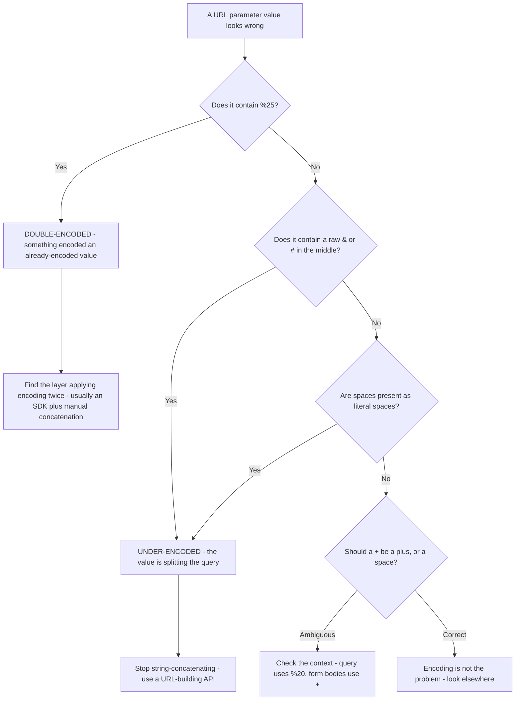
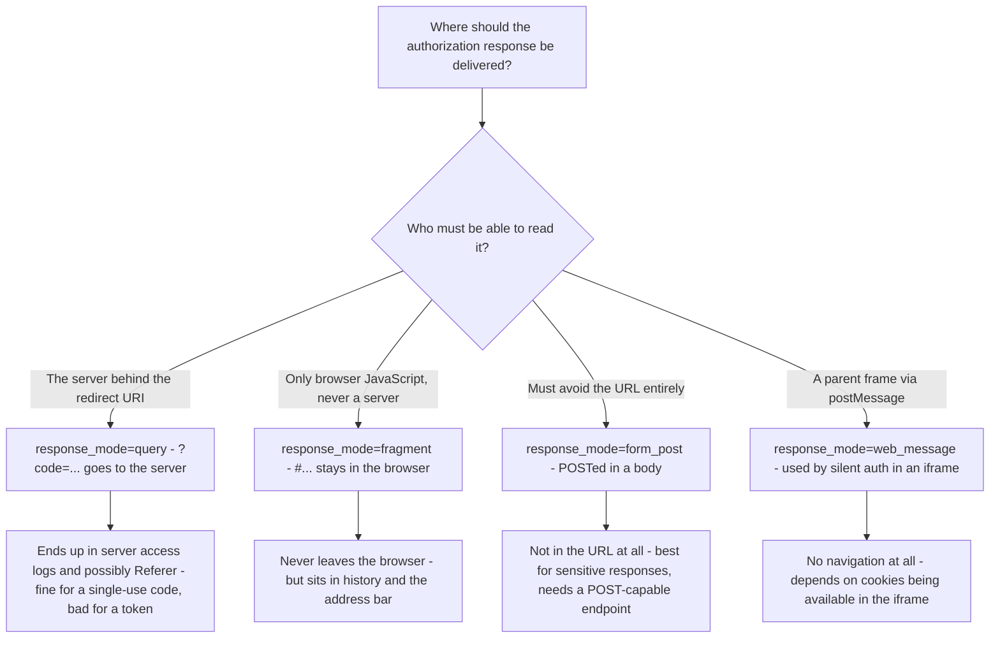
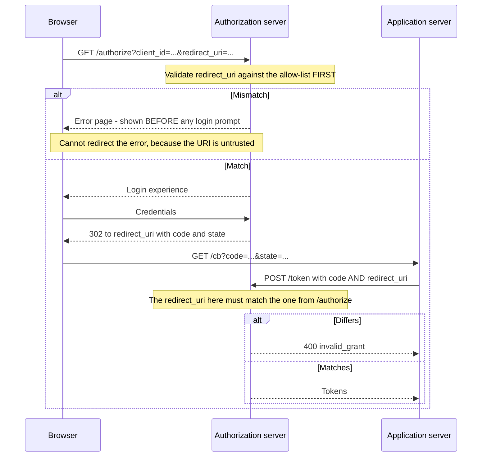
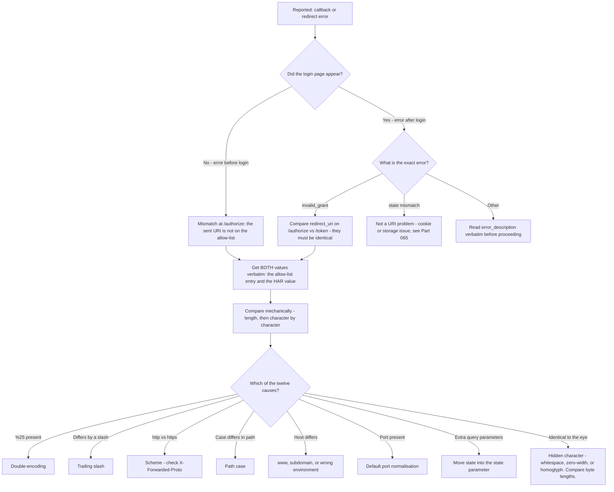

# Part 013 - URLs, Encoding, Query versus Fragment, and Redirect URI Matching

> Section goal: Master the single most common identity ticket in existence. Redirect URI mismatch accounts for an enormous share of "login is broken" reports, and almost every instance is one of about a dozen character-level differences. After this Part you should be able to spot the mismatch in under a minute, every time.

Covers index item **013**. Maps to JD signals: *knowledge of HTTP*, *basic security concepts*, *instinctive ability to subdivide problems into basic components*, *strong analytical and problem-solving skills*, and *promote best practices*.

---

## 1. Start From Zero: What a URL Actually Is

A **URL** (Uniform Resource Locator) is a structured address. Every part is defined by a specification, and in identity, every part is compared character by character.

```
  https://login.example.com:443/authorize?client_id=abc&scope=openid%20profile#frag
  └─┬─┘   └────────┬───────┘ └┬┘└───┬───┘ └──────────────┬──────────────────┘ └─┬─┘
 scheme         host        port   path                query                fragment
          └──────────────┬─────────────┘
                     authority
```

| Component | Example | Case-sensitive? | Sent to server? |
|---|---|---|---|
| **Scheme** | `https` | No (normalised to lowercase) | Yes (implicitly) |
| **Host** | `login.example.com` | No (DNS is case-insensitive) | Yes, in the `Host` header |
| **Port** | `443` | n/a | Yes (implicitly) |
| **Path** | `/authorize` | **Yes** | Yes |
| **Query** | `client_id=abc&...` | **Yes** | Yes |
| **Fragment** | `#frag` | **Yes** | **No — never** |

> **Analogy.** A URL is a postal address written in a rigid, machine-readable format. Country, city, street, house number, and then a note to yourself about which room you were heading to. The postal service uses everything up to the house number; the note about the room is only meaningful once you are inside.
>
> **Where it stops:** a human postman tolerates "Rd." versus "Road". A redirect-URI allow-list does not tolerate anything.

### 🔍 Plain-English deep-dive: why some parts are case-insensitive and some are not

This trips people up constantly, and the reason is historical rather than logical.

- **Scheme and host are case-insensitive** because they are resolved by systems that were designed to be forgiving. DNS treats `LOGIN.example.com` and `login.example.com` as identical, and browsers normalise both to lowercase before sending.
- **Path, query, and fragment are case-sensitive** because they are interpreted by *the server's application*, and on many systems `/Callback` and `/callback` are genuinely different resources.

So `HTTPS://LOGIN.EXAMPLE.COM/callback` and `https://login.example.com/callback` are the same URL, but `https://login.example.com/Callback` is a *different* one.

**Why it matters:** a developer who registers `https://app.example.com/Callback` and configures their SDK with `/callback` will get a mismatch, and it will look like nothing is wrong because the two strings look nearly identical in a ticket. **Analogy:** a filing system where the drawer label is case-blind but the folder name inside is not. **Where it stops:** some servers deliberately normalise paths to lowercase, which makes the behavior inconsistent between environments and produces the maddening "works in dev, fails in prod" pattern.

---

## 2. Percent-Encoding

Certain characters have structural meaning inside a URL. To use them as *data* rather than *structure*, they must be **percent-encoded**: replaced with `%` followed by two hex digits.

| Character | Structural meaning | Encoded | Where it bites in identity |
|---|---|---|---|
| `:` | Separates scheme and port | `%3A` | Every `redirect_uri` contains `https://` |
| `/` | Path separator | `%2F` | Same |
| `?` | Starts the query | `%3F` | A redirect URI that itself has a query |
| `#` | Starts the fragment | `%23` | Truncates everything after it if unencoded |
| `&` | Separates query parameters | `%26` | Splits your parameter into two |
| `=` | Separates key and value | `%3D` | Corrupts parsing |
| space | Delimiter in several contexts | `%20` or `+` | **Scopes are space-separated** |
| `+` | Means space in form encoding | `%2B` | A `+` in an email address becomes a space |

### The two encoding contexts (and why they differ)

This is a genuine source of bugs and worth being precise about.

| Context | Space encodes as | Where it applies |
|---|---|---|
| **URL query string** (RFC 3986) | `%20` | The `?...` part of a URL |
| **Form encoding** (`application/x-www-form-urlencoded`) | `+` | POST bodies to the token endpoint; also historically tolerated in query strings |

Most servers accept `+` for space in a query string too, but not all, and the reverse is not true. **When in doubt, use `%20`.**

### 🔍 Plain-English deep-dive: the `+` in an email address

A user registers as `user+test@example.com`. The application puts that into a URL parameter without encoding it. The receiving system decodes `+` as a space, and the value becomes `user test@example.com` — a different, invalid address.

Symptoms this produces:
- "Password reset link says the account doesn't exist."
- "Some users can't verify their email."
- "It only fails for users with a plus in their address."

That last symptom is the giveaway — it is a *cohort* pattern (Part 009 §5), and the cohort is defined by a character.

**The fix is never "tell users not to use plus addressing".** It is: encode properly at every boundary, using a URL-building API rather than string concatenation.

**Analogy:** a form that treats a hyphen in a surname as the end of the field. The surname is not the problem. **Where it stops:** unlike a paper form, the corruption here is silent and reversible-looking — the value still *looks* like an email address, so nobody notices until a user complains.

### The double-encoding trap

Encoding an already-encoded value produces a different, broken value:

| Stage | Value |
|---|---|
| Original | `https://app.example.com/cb` |
| Encoded once (correct) | `https%3A%2F%2Fapp.example.com%2Fcb` |
| Encoded twice (broken) | `https%253A%252F%252Fapp.example.com%252Fcb` |

The signature of double-encoding is **`%25`** appearing in the value, because `%25` is the encoding of `%` itself. **If you see `%25` in a redirect URI, you have found the bug.** This is a genuinely fast diagnostic — one glance at a HAR.



---

## 3. Query Versus Fragment

| | Query (`?`) | Fragment (`#`) |
|---|---|---|
| Sent to the server | **Yes** | **No** |
| Visible in the address bar | Yes | Yes |
| Stored in browser history | Yes | Yes |
| Sent in the `Referer` header | Sometimes (policy-dependent) | No |
| Appears in server access logs | Yes | No |
| Readable by JavaScript on the page | Yes | Yes |
| Survives a redirect | Only if the server copies it | **Often reattached by the browser** |

### Why this drives OAuth design



**The historical story in one paragraph:** the implicit flow used `response_mode=fragment` specifically so that access tokens would never reach a server. That solved one problem and created several — tokens in browser history, tokens in the address bar (over-the-shoulder and screenshot exposure), tokens readable by any script on the page, and no way to bind the response to the requesting client. Authorization Code with PKCE replaced it, delivering a short-lived, single-use *code* in the query instead. A code in a log is far less dangerous than a token in a log.

> 💡 **Tie-in to your background:** you have read HAR files where the interesting value was in a URL. The identity-specific instinct to add is: *"is this value in the query or the fragment, and does that match what the flow is supposed to do?"* A token in a query string is a finding. A code in a fragment is a configuration oddity worth asking about.

---

## 4. Redirect URI Matching: The Rules

This is the heart of the Part.

When an application starts a flow, it sends a `redirect_uri`. The authorization server compares it against the list registered for that `client_id`. **The comparison is exact string matching after normalisation of the scheme and host.**

### What "exact" means in practice

| Registered | Sent | Match? | Why |
|---|---|---|---|
| `https://app.example.com/cb` | `https://app.example.com/cb` | ✅ | Identical |
| `https://app.example.com/cb` | `https://APP.EXAMPLE.COM/cb` | ✅ | Host is case-insensitive |
| `https://app.example.com/cb` | `https://app.example.com/cb/` | ❌ | **Trailing slash** — different path |
| `https://app.example.com/cb` | `https://app.example.com/CB` | ❌ | **Path is case-sensitive** |
| `https://app.example.com/cb` | `http://app.example.com/cb` | ❌ | **Different scheme** |
| `https://app.example.com/cb` | `https://app.example.com:443/cb` | ⚠️ | Depends on whether the server normalises the default port — **test it** |
| `https://app.example.com/cb` | `https://www.app.example.com/cb` | ❌ | **Different host** |
| `https://app.example.com/cb` | `https://app.example.com/cb?x=1` | ⚠️ | Some servers permit extra query parameters; many do not — **test it** |
| `https://app.example.com/cb` | `https://app.example.com/cb#frag` | ⚠️ | Fragments are not permitted in a registered redirect URI |
| `https://app.example.com/*` | `https://app.example.com/anything` | ⚠️ | Wildcards, where supported at all, are heavily restricted |

### 🔍 Plain-English deep-dive: why the match must be exact

It feels needlessly strict. It is not — it is the single most important security control in the entire authorization code flow.

Consider what a `redirect_uri` *does*: it tells the authorization server where to deliver the authorization code. The code is exchangeable for tokens. So the redirect URI is effectively the answer to *"where should I send the keys?"*

If matching were loose — say, "any URL on this domain" — then an attacker who could get *any* content onto that domain could receive codes. Real examples of how that happens:

- An **open redirect** elsewhere on the domain (`/redirect?url=attacker.com`) turns a permitted URI into a hop to an attacker.
- A **user-content path** (`/users/attacker/profile`) on the same host.
- A **subdomain takeover** — an abandoned CNAME pointing at a service an attacker can claim.
- A **path traversal** or a permissive wildcard that resolves somewhere unintended.

Exact matching removes the entire class. The authorization server will only ever deliver a code to a location the *application owner* explicitly registered.

**So when a customer complains that matching is too strict, the honest answer is: this strictness is why an attacker cannot redirect your users' authorization codes to themselves.** Framing it as a feature, with the reason, converts a complaint into a security conversation — and that is exactly the "promote best practices" duty.

**Analogy:** a bank that will only post a new card to the address on file, character for character, rather than "somewhere on that street". Annoying when you have moved. Essential when someone else claims your street. **Where it stops:** unlike a bank, there is no human to phone and verify — the string is the only evidence.

### Localhost and native applications

| Case | Rule of thumb |
|---|---|
| **`http://localhost`** | Permitted despite being `http`, because loopback traffic never leaves the machine |
| **Loopback port** | Native apps often need any port (the OS assigns one); the specification allows the port to vary for loopback redirects |
| **`http://127.0.0.1`** | Not automatically the same string as `localhost` — register what you actually use |
| **Custom scheme** (`myapp://callback`) | Used by mobile apps; must be registered in the app manifest *and* on the client |
| **Claimed HTTPS URL** (App Links / Universal Links) | More secure than a custom scheme because the OS verifies domain ownership |

---

## 5. The Twelve Ways It Goes Wrong

This is the reference table. Print it.

| # | Cause | Signature in the evidence | Fix |
|---|---|---|---|
| 1 | **Trailing slash** | Registered and sent differ by one `/` | Align both; register both if the framework varies |
| 2 | **Scheme mismatch** | `http` sent, `https` registered | Fix `X-Forwarded-Proto` trust behind a load balancer (Part 012) |
| 3 | **Case difference in path** | `/Callback` vs `/callback` | Align; prefer all-lowercase paths as a convention |
| 4 | **Wrong environment's URI** | Production host, staging allow-list | Separate applications per environment (Part 009) |
| 5 | **`www` present or absent** | `app.example.com` vs `www.app.example.com` | Register both, or canonicalise before the flow starts |
| 6 | **Explicit default port** | `:443` or `:80` present | Test the server's normalisation; align if not normalised |
| 7 | **Double-encoding** | `%25` visible in the value | Stop concatenating; use a URL API |
| 8 | **Under-encoding** | Raw `&` or `#` inside the value | Same fix |
| 9 | **Extra query parameters appended** | `?utm_source=...` on the callback | Move state into the `state` parameter, not the URL |
| 10 | **Different URI at `/authorize` and `/token`** | The two requests disagree | They must match exactly; `invalid_grant` results |
| 11 | **Not registered at all** | New environment, new subdomain, new preview URL | Register it; automate registration for preview deployments |
| 12 | **Registered on a different application** | Right URI, wrong `client_id` | Confirm which application the `client_id` belongs to |

### Where the error appears is diagnostic



**Read that sequence carefully — it contains the most useful diagnostic in this Part:**

- A redirect URI mismatch at `/authorize` produces an error **on the authorization server's own page, before the user ever sees a login prompt.** The server *cannot* redirect the error back, because the whole point is that it does not trust that destination.
- A redirect URI mismatch at `/token` produces `invalid_grant` **after** a successful login.

So the customer's description tells you which one it is:

| Customer says | It is |
|---|---|
| "I get an error before the login page appears" | Mismatch at `/authorize` — the allow-list |
| "I log in fine, then it fails at the end" | Mismatch between `/authorize` and `/token`, or another `invalid_grant` cause |

That distinction, drawn from a single sentence in the ticket, eliminates half the possibility space before you look at anything.

---

## 6. Failure Modes

| Failure mode | What it looks like | Consequence | Correction |
|---|---|---|---|
| **Eyeballing the strings** | Comparing two URIs by reading them | Trailing slashes and case are invisible to the eye | Diff them programmatically, or compare character counts |
| **Trusting the customer's transcription** | They retype the URI into the ticket | Whitespace, smart quotes, and case get "fixed" | Ask for a screenshot of the allow-list *and* the raw HAR value |
| **Ignoring where the error appeared** | Not asking whether the login page rendered | Miss the free bisection | Always ask: before or after the login prompt? |
| **String concatenation** | Building the URL by hand in code | Encoding bugs, guaranteed eventually | Use the platform's URL/URI builder |
| **Registering a wildcard to "fix it"** | Broad pattern added to the allow-list | Real security exposure | Register the specific URIs; explain why |
| **Forgetting the `/token` copy** | Only aligning `/authorize` | `invalid_grant` after a working login | Both requests must carry the identical value |
| **Preview deployments** | Every PR gets a new random hostname | Constant mismatches | Automate registration, or route previews through one stable host |
| **Missing the plus-address cohort** | "Only some users fail" | Chasing a phantom | Check whether affected identifiers contain `+`, spaces, or non-ASCII |
| **Assuming port normalisation** | `:443` works on one server, not another | Environment-specific mystery | Test rather than assume |

---

## 7. Troubleshooting Decision Tree



### Worked example

A customer reports: *"Users get 'callback URL mismatch'. It works in staging. Nothing changed. Our production URL is `https://app.contoso.com/auth/callback` and that's exactly what's registered."*

1. **Did the login page appear?** No → mismatch at `/authorize`, so it is the allow-list.
2. **Get both values verbatim.** Ask for a screenshot of the registered list *and* the `redirect_uri` parameter copied from a HAR. Never accept a retyped value.
3. **Compare mechanically.** The HAR shows `https%3A%2F%2Fapp.contoso.com%2Fauth%2Fcallback%2F` — decoded, that is `https://app.contoso.com/auth/callback/`. **Trailing slash.**
4. **Why now?** Their framework was upgraded and now normalises route paths with a trailing slash. That is the "nothing changed" that actually changed — a dependency, exactly as Part 009 predicted.
5. **Fix:** register both forms, and pin or configure the framework's trailing-slash behavior so it cannot drift again.
6. **Prevent:** add the redirect URI to their deployment checklist, and add an end-to-end login smoke test after deploy (Part 009 §6).

Note the shape of that answer: root cause, evidence, concept, fix, and prevention — the eight-element structure from Part 004.

---

## 8. Lab: Break Redirect URI Matching Twelve Ways

**Purpose.** Generate every mismatch variant yourself so you recognise each one instantly from evidence, and build the reference table you will actually use.

**Prerequisites.** Part 007's lab tenant with one registered application. `curl`, a browser, and a text editor. **Your own tenant only.**

**Steps.**

1. Create `okta-prep/labs/013-redirect-uri/`.
2. **Baseline.** Register exactly one redirect URI on your lab application: `http://localhost:3000/callback`. Build a valid `/authorize` URL by hand with correct encoding. Confirm the login page renders. Save the working URL as `baseline.md`.
3. **Run the twelve variants.** For each, modify only the `redirect_uri` and record the **exact** error text, **where** it appeared (before or after login), and the HTTP status:
   - a. trailing slash added
   - b. `https` instead of `http`
   - c. `/Callback` instead of `/callback`
   - d. `127.0.0.1` instead of `localhost`
   - e. explicit port `:3000` removed
   - f. a different port
   - g. double-encoded value (`%253A`)
   - h. under-encoded value (raw `:` and `/`)
   - i. an extra query parameter appended (`?utm=x`)
   - j. a fragment appended (`#x`)
   - k. a URI never registered at all
   - l. a valid URI but with a different `client_id`
4. **Token-endpoint mismatch.** Complete one successful login to obtain a code, then POST to `/token` with a `redirect_uri` that differs from the one used at `/authorize`. Record the exact error. **This should be `invalid_grant`, not a callback mismatch** — confirm it and note the difference.
5. **Encoding detector.** Write a five-line Python or Node script that takes two URI strings and reports: byte lengths, first differing index, and whether either contains `%25`. Save it as `uri-diff.py`. **This is a tool you will genuinely use.**
6. **Plus-address test.** Register a synthetic user with `+` in the local part of a lab email you control. Put that address through a URL parameter both encoded and unencoded, and record what arrives at the other end.
7. **Reference table.** Write `redirect-uri-matrix.md`: all twelve variants with observed error, position in the flow, and fix. This is §5's table, but filled in with *your own observations*.
8. **Failure catalog + manifest.** Add twelve rows. Complete `MANIFEST.md` honestly.

**Expected evidence.** Twelve recorded variants with verbatim errors, one token-endpoint mismatch, a working URI diff tool, a plus-address observation, and a completed matrix.

**Validation rubric.**

| Check | Pass condition |
|---|---|
| All twelve run | Every variant attempted, none skipped |
| Errors verbatim | Copied character-for-character, not paraphrased |
| Position recorded | Before or after the login prompt, for every variant |
| `/token` mismatch distinguished | `invalid_grant` observed and contrasted with the `/authorize` error |
| Diff tool works | Correctly reports first differing index on two near-identical URIs |
| `%25` detection | Tool flags a double-encoded input |
| Plus-address observed | You recorded what actually arrived, both encoded and raw |
| Matrix complete | Twelve rows from your own observations, not copied from §5 |

**Cleanup and privacy.** Only your own lab tenant and `localhost`. Do not point any variant at a third-party host — a redirect URI pointing somewhere you do not own is exactly the attack this control prevents, and running it would breach the Part 007 charter. Use only synthetic email addresses at a domain or mailbox you control. Remove the extra registered URIs when the lab is complete.

---

## 9. JD Mapping

| Supplied JD signal | How this Part supports it |
|---|---|
| Knowledge of HTTP | §§1–3 cover URI structure, encoding contexts, and the query/fragment distinction precisely |
| Basic security concepts | §4's deep-dive explains exact matching as the control that prevents code interception |
| Instinctive ability to subdivide problems | §5's "where the error appeared" bisection eliminates half the space from one sentence |
| Strong analytical and problem-solving skills | §7's mechanical comparison replaces eyeballing with a repeatable method |
| Promote best practices | Advising URL-building APIs over concatenation, and specific URIs over wildcards |
| Exceed expectations on response quality | §7's worked example delivers cause, evidence, concept, fix, and prevention |
| Resolve issues in a timely fashion | This is the highest-frequency ticket type; speed here has outsized effect on your metrics |

---

## 10. Candidate Honesty Note

- **Production transfer:** you already read URLs out of HAR files and compare configured values against observed values. The mechanical-comparison instinct is genuinely yours.
- **New here:** the specific matching rules and the twelve failure variants. These are learnable in one lab session, and having *run* all twelve is a strong, concrete thing to say.
- **The best sentence you own after this Part:** *"Redirect URI mismatch is the most common identity ticket, and I've reproduced all twelve variants in a lab — so I can usually name the cause from where in the flow the error appeared plus a character-level diff."* That is specific, verifiable, and immediately useful.
- **Do not** claim to have set redirect-URI policy or built an authorization server. You diagnose configuration against a specification; that is the role.
- **Security framing matters:** when explaining strictness to a customer, always give the reason. Presenting a security control as an inconvenience trains customers to want it weakened.

---

## 11. Official Source Anchors

Accessed **26 August 2026**.

| Source | What it defines |
|---|---|
| IETF RFC 3986 (URI Generic Syntax) | URI components, percent-encoding, normalisation, case sensitivity rules |
| IETF RFC 6749 §3.1.2 (Redirection Endpoint) | Redirect URI registration and the requirement to compare |
| IETF RFC 6749 §4.1.3 | Why `redirect_uri` must be repeated on the token request |
| IETF OAuth 2.0 Security Best Current Practice | Current guidance requiring exact string matching and discouraging wildcards |
| IETF RFC 8252 (OAuth for Native Apps) | Loopback redirects, variable ports, and custom scheme guidance |
| WHATWG URL Standard | How browsers actually parse and normalise URLs, which occasionally differs from RFC 3986 |
| MDN — `URL` and `URLSearchParams` | The URL-building APIs to recommend instead of concatenation |
| Auth0 and Okta documentation — allowed callback URLs | Vendor-specific rules on wildcards, ports, and query parameters — **verify these rather than assuming** |

**Revalidate after 26 August 2026:** vendor matching rules, particularly around wildcard support and query-parameter tolerance, which differ between products and change.

---

## ⭐ Likely Interview Questions for This Section

### Q1. "A customer gets 'callback URL mismatch'. Walk me through your diagnosis."
> *Model answer:* "First question: did the login page appear? That single answer bisects the problem. If the error came *before* any login prompt, it's a mismatch at `/authorize` — the URI they sent isn't on the allow-list, and the server deliberately can't redirect that error back because it doesn't trust the destination. If they logged in successfully and it failed at the end, it's usually `invalid_grant` because the `redirect_uri` on the token request differs from the one on `/authorize`. Then I get both values verbatim — a screenshot of the registered list and the raw parameter from a HAR, never a retyped version, because people silently normalise whitespace and case when they retype. Then I compare mechanically rather than by eye: byte length first, then first differing index. Trailing slash, path case, scheme, and `www` are all invisible when you read them but obvious when you diff them."

### Q2. "Why does redirect URI matching have to be exact? Customers find it frustrating."
> *Model answer:* "Because the redirect URI is the answer to 'where do I send the keys?' — it's where the authorization code gets delivered, and that code is exchangeable for tokens. If matching were loose, say any path on the domain, then anyone who can get content onto that domain can receive codes. That's not theoretical: an open redirect elsewhere on the site, a user-content path, or a subdomain takeover from an abandoned CNAME all turn a 'trusted' domain into an attacker-controlled destination. Exact matching eliminates the whole class, because codes only ever go where the application owner explicitly registered. So when a customer complains it's too strict, I give them that reason — this strictness is precisely why an attacker can't redirect their users' codes to themselves. Framing a control as a feature with a reason usually ends the complaint."

### Q3. "What does `%25` in a URL parameter tell you?"
> *Model answer:* "Double-encoding, immediately. `%25` is the percent-encoding of `%` itself, so its presence means something encoded a value that was already encoded. A correctly encoded redirect URI looks like `https%3A%2F%2Fapp...`; a double-encoded one looks like `https%253A%252F%252Fapp...`. It's one of the fastest diagnostics there is — a single glance at a HAR. The cause is almost always an SDK that encodes properly, plus manual string concatenation on top that encodes again. The fix isn't to encode less carefully, it's to stop hand-building URLs and use the platform's URL API — `URL` and `URLSearchParams` in JavaScript — which handles encoding once and correctly at each boundary."

### Q4. "Why doesn't the fragment reach the server, and why does that matter for OAuth?"
> *Model answer:* "Browsers strip it before sending, because it was designed as a client-side pointer — originally 'scroll to this anchor'. The server only ever sees the path and query. That's precisely why the implicit flow used `response_mode=fragment`: tokens were returned there so they'd never travel to any server or appear in server access logs. But it created worse problems — the token then lives in browser history and the address bar, and any script on the page can read it, and there's no binding between the response and the client that requested it. Authorization Code with PKCE replaced it by returning a short-lived single-use *code* in the query instead. A code sitting in an access log is far less dangerous than a token, because it expires in seconds, can only be used once, and can't be redeemed without the PKCE verifier."

### Q5. "Only users with a plus in their email address are failing. What's happening?"
> *Model answer:* "Almost certainly an encoding bug at a URL boundary. In form encoding, `+` means space — so if a value like `user+test@example.com` goes into a URL parameter without being percent-encoded as `%2B`, the receiving side decodes it back as `user test@example.com`, which is a different and invalid address. The signature is exactly what they described: it fails for a cohort defined by a character, which is why it looks random until you spot the pattern. The fix is never 'tell users not to use plus addressing' — it's to encode properly at every boundary using a URL-building API rather than string concatenation. And I'd check every hop, because the corruption can happen at any one of them and the value still *looks* like a valid email afterwards, which is why nobody notices until a user complains."

### Q6. "A customer wants a wildcard redirect URI so their preview deployments work. What do you say?"
> *Model answer:* "I'd understand the real problem first, because the wildcard is their proposed solution rather than their requirement. The requirement is 'every pull request creates a preview environment with a new random hostname, and we can't register them manually.' A wildcard would solve that and open a real hole — anything that can serve content on a matching host can receive authorization codes, and preview environments are frequently the least protected thing a team runs. So I'd offer supported alternatives: route all previews through one stable host that encodes the target in the `state` parameter and redirects internally after the flow completes; or automate registration through the Management API as part of the preview pipeline, which is a few lines in their CI and also cleans up on teardown. If they still want a wildcard, I'd tell them exactly what the exposure is in writing so it's an informed decision, and I'd check what the platform actually permits rather than assuming."

### Q7. "How do you compare two URIs that look identical but don't match?"
> *Model answer:* "Mechanically, never by eye — the human eye is genuinely bad at this. Byte length first, because if the lengths differ there's a character you can't see. Then first differing index, which points straight at it. I keep a five-line script for exactly this. The usual culprits in order: trailing slash, path case, scheme, `www` present or absent, an explicit default port, and extra query parameters. If lengths are identical and no index differs, then I'd look for a genuinely invisible character — trailing whitespace from a copy-paste, a zero-width space, a non-breaking space, or a homoglyph like a Cyrillic character that renders identically to a Latin one. That last one is rare but it does happen, usually when someone copied a URL out of a formatted document."

### Q8. "What's the difference between a redirect URI mismatch at `/authorize` and at `/token`?"
> *Model answer:* "Different checks at different moments, with different symptoms, and the difference is the fastest bisection in the whole ticket type. At `/authorize`, the server validates the URI against the registered allow-list *before* doing anything else — so the user sees an error page on the authorization server, before any login prompt. Crucially the server can't redirect that error back to them, because the entire point is that it doesn't trust that destination. At `/token`, the spec requires the client to repeat the same `redirect_uri` it used at `/authorize`, and the server checks they match — this binds the code to the original request and prevents a code being redeemed with a different callback. A mismatch there produces `invalid_grant`, *after* a completely successful login. So if the customer says 'error before I could log in' it's the allow-list; if they say 'I logged in fine and then it broke' it's the token request or another `invalid_grant` cause."

---

## 🧠 30-Second Memory Hooks

- **Scheme and host: case-insensitive. Path, query, fragment: case-SENSITIVE.**
- **Redirect URI matching is exact string matching.** Trailing slash, case, scheme, `www`, port all break it.
- **The redirect URI answers "where do I send the keys?"** That is why strictness is a feature.
- **`%25` in a value = double-encoded.** One glance, one diagnosis.
- **Raw `&` or `#` inside a value = under-encoded.** Stop concatenating; use a URL API.
- **Query uses `%20` for space. Form bodies use `+`.** A `+` in an email needs `%2B`.
- **Error BEFORE the login page = `/authorize` allow-list. Error AFTER login = `/token` `invalid_grant`.**
- **The server cannot redirect a mismatch error** — that is why you see it on their page.
- **`redirect_uri` must be identical at `/authorize` and `/token`.**
- **Never eyeball two URIs.** Byte length, then first differing index.
- **Wildcards are a hole, not a fix.** Offer a stable host plus `state`, or automated registration.

---

## ✅ Completion Checklist

- [ ] **Knowledge:** I can name eight ways a redirect URI mismatches and explain why exact matching is a security control.
- [ ] **Lab artifact:** `013-redirect-uri/` contains twelve recorded variants, a token-endpoint mismatch, a working URI diff tool, and a completed matrix.
- [ ] **Spoken:** I can deliver the "did the login page appear?" bisection and explain what each answer means, in under 45 seconds.
- [ ] **Honesty check:** every variant ran against my own tenant and `localhost`; no third-party host was used as a redirect target.
- [ ] **Source check:** I have read RFC 6749 §3.1.2 and the Security BCP's redirect-URI guidance myself.

---

*Next suggested section:* **[Part 014 - Cookies From Zero: Attributes, SameSite, Scoping, Partitioning](Part-014-cookies-from-zero-attributes-samesite-scoping-partitioning.md)** — the other half of the browser's identity machinery, and the cause behind every login loop you will ever see.
