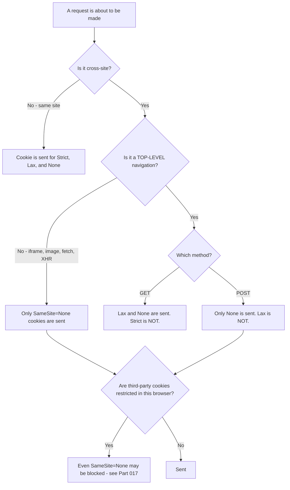
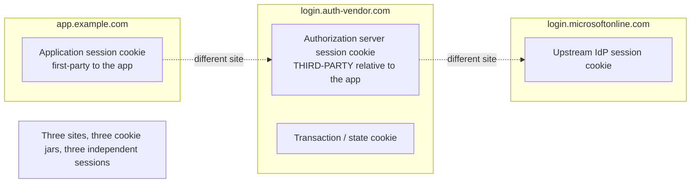
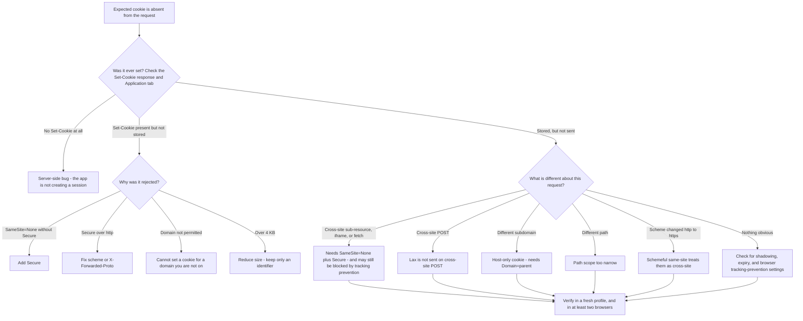

# Part 014 - Cookies From Zero: Attributes, SameSite, Scoping, Partitioning

> Section goal: Understand cookies well enough to diagnose any login loop, any "logged out on refresh", and any "works in Chrome but not Safari" report. Cookies are where the browser, the protocol, and privacy policy collide — and that collision is the single largest source of confusing identity tickets.

Covers index item **014**. Maps to JD signals: *knowledge of HTTP*, *basic security concepts*, *understanding of authentication and authorization concepts*, *strong analytical and problem-solving skills*, and *promote best practices*.

---

## 1. Start From Zero: What a Cookie Is and Why It Exists

HTTP is stateless (Part 012). The server forgets you between requests. A **cookie** is the workaround: a small piece of data the server asks the browser to store and send back on future requests.

```mermaid
sequenceDiagram
    participant B as Browser
    participant S as Server
    B->>S: POST /login (username, password)
    S->>S: Verify credentials, create a session record
    S-->>B: 200 OK, Set-Cookie: sid=abc123; HttpOnly; Secure; SameSite=Lax
    Note over B: Browser stores the cookie against its scope
    B->>S: GET /dashboard, Cookie: sid=abc123
    S->>S: Look up session abc123 - "this is you"
    S-->>B: 200 the dashboard
    B->>S: GET /orders, Cookie: sid=abc123
    S-->>B: 200 the orders
```

> **Analogy.** A cloakroom ticket. You hand over your coat, they give you a numbered ticket, and every time you come back you show the ticket. The ticket itself means nothing — the value is in the cloakroom's own record of what number 47 corresponds to.
>
> **Where it stops:** a cloakroom ticket only works at that cloakroom, and only when you deliberately present it. A browser sends cookies **automatically**, sometimes to sites you did not intend to interact with. That automatic behavior is both why cookies work and why every cookie security attribute exists.

### 🔍 Plain-English deep-dive: the automatic-sending problem

The browser attaches cookies to requests *without asking you*. If you are logged into your bank and you visit a malicious page, and that page causes your browser to make a request to your bank, **your bank cookies go along with it.** The bank sees an authenticated request and cannot tell you did not intend it.

That is **CSRF** (Cross-Site Request Forgery), and it is the reason for:

- **`SameSite`** — the browser's own restriction on when cookies travel cross-site.
- **`state`** in OAuth (Part 065) — the application's own binding of a callback to a request it initiated.
- **Anti-CSRF tokens** in forms — a value an attacker's page cannot read or guess.

**All three exist for the same reason: cookies are sent automatically, so "the request carried a valid cookie" does not mean "the user meant to make this request."**

**Analogy:** a signature stamp that your assistant applies to every letter leaving your office, including ones someone else slipped into the outbox. **Where it stops:** you would eventually notice the letters. Browsers do this thousands of times a day, invisibly.

---

## 2. `Set-Cookie` Anatomy

```
Set-Cookie: sid=abc123; Domain=example.com; Path=/; Max-Age=3600; Secure; HttpOnly; SameSite=Lax
            └───┬────┘  └────────┬───────┘  └──┬─┘  └─────┬────┘  └──┬─┘  └───┬──┘  └─────┬─────┘
            name=value      scope: host      scope: path  lifetime   TLS   no JS      cross-site rule
```

| Attribute | What it controls | Default if omitted | Identity relevance |
|---|---|---|---|
| **`Domain`** | Which hosts receive it | **Host-only** — exactly the setting host | Omitting it is *more* restrictive, which surprises people |
| **`Path`** | Which paths receive it | The directory of the setting URL | Rarely the cause, but occasionally |
| **`Expires` / `Max-Age`** | How long it survives | **Session cookie** — gone when the browser closes | "Logged out when I closed the tab" |
| **`Secure`** | Only sent over HTTPS | Not set | Required for `SameSite=None`; broken by wrong `X-Forwarded-Proto` |
| **`HttpOnly`** | JavaScript cannot read it | Not set | Mitigates token theft via XSS |
| **`SameSite`** | Whether it travels on cross-site requests | **`Lax`** in modern browsers | **The number-one cause of identity cookie failures** |
| **`Partitioned`** | Separate jar per top-level site (CHIPS) | Not set | The supported path for some third-party cookie use |
| **Prefixes** (`__Secure-`, `__Host-`) | Enforce attribute rules by naming convention | n/a | Hardening; `__Host-` forbids `Domain` |

### The `Domain` attribute rule that catches everyone

| `Set-Cookie` from | `Domain` attribute | Sent to |
|---|---|---|
| `app.example.com` | *(omitted)* | **Only** `app.example.com` |
| `app.example.com` | `Domain=app.example.com` | `app.example.com` **and its subdomains** |
| `app.example.com` | `Domain=example.com` | `example.com` and **all** its subdomains |
| `app.example.com` | `Domain=other.com` | **Rejected** — you cannot set cookies for a domain you are not on |
| `app.example.com` | `Domain=com` | **Rejected** — public suffix, blocked deliberately |

**The counterintuitive part:** *omitting* `Domain` is stricter than *specifying* it. Specifying `Domain=app.example.com` actually *widens* scope to include subdomains. Developers routinely assume the opposite.

**Where this causes tickets:** a customer runs `app.example.com` and `api.example.com`. They set a session cookie without `Domain`, then wonder why the API does not see it. The fix is `Domain=example.com` — with the honest caveat that this now shares the cookie with *every* subdomain, including any they do not fully control.

---

## 3. Same-Origin, Same-Site, and Cross-Site

These three are different, and confusing them makes cookie behavior look random.

| Concept | Definition | Used by |
|---|---|---|
| **Same-origin** | Scheme **+ host + port** all identical | Same-origin policy, CORS (Part 015) |
| **Same-site** | Same **registrable domain** (eTLD+1), and usually same scheme | `SameSite` cookies |
| **Cross-site** | Different registrable domain | Everything `SameSite` restricts |

### Worked comparisons

| A | B | Same origin? | Same site? |
|---|---|---|---|
| `https://app.example.com` | `https://app.example.com` | ✅ | ✅ |
| `https://app.example.com` | `https://api.example.com` | ❌ (different host) | ✅ (same eTLD+1) |
| `https://app.example.com` | `https://app.example.com:8443` | ❌ (different port) | ✅ |
| `http://app.example.com` | `https://app.example.com` | ❌ (different scheme) | ⚠️ Treated as cross-site by modern browsers ("schemeful same-site") |
| `https://app.example.com` | `https://login.auth-vendor.com` | ❌ | ❌ **cross-site** |
| `https://a.github.io` | `https://b.github.io` | ❌ | ❌ — `github.io` is a *public suffix*, so each subdomain is its own site |

### 🔍 Plain-English deep-dive: the Public Suffix List, and why `github.io` behaves oddly

**eTLD+1** means "effective top-level domain, plus one label." For `app.example.com`, the eTLD is `com` and the registrable domain is `example.com`.

But some domains act as pseudo-TLDs — `github.io`, `co.uk`, `azurewebsites.net`, `vercel.app` — because they hand out subdomains to unrelated parties. If `github.io` counted as the registrable domain, then `evil.github.io` could set cookies readable by `yourproject.github.io`. That would be catastrophic.

So browsers consult the **Public Suffix List**, a maintained list of these pseudo-TLDs. Anything on it is treated as a suffix, meaning `yourproject.github.io` and `evil.github.io` are *different sites* with no cookie sharing.

**Why this matters for you:** a developer prototyping on a platform-provided domain (`*.vercel.app`, `*.azurewebsites.net`, `*.github.io`) will find cookie behavior differs from their production custom domain — and in confusing directions. "It works on our custom domain but not on the preview URL" is frequently this. **Analogy:** a shared office building where the *building* address is not enough to identify the tenant — post must be addressed to a specific suite, because the neighbours are strangers. **Where it stops:** the list is maintained by hand, so a newly popular hosting domain may not be on it yet, which produces genuinely inconsistent behavior across browser versions.

---

## 4. `SameSite`: The Big One

| Value | Cookie sent on… | Effect |
|---|---|---|
| **`Strict`** | Same-site requests only | Even clicking a link from another site arrives without the cookie — so the user appears logged out on arrival |
| **`Lax`** | Same-site requests, **plus** top-level GET navigations from other sites | The modern default. Safe and usually usable |
| **`None`** | All requests, including cross-site sub-resources and POSTs | **Requires `Secure`.** Subject to third-party cookie restrictions (Part 017) |

### What `Lax` actually permits



**Read that carefully — the two rows that cause the most tickets are:**

1. **Cross-site POST does not carry a `Lax` cookie.** This is exactly what `response_mode=form_post` does (Part 072). A `Lax` state cookie will be missing when the POST callback arrives.
2. **Iframes and `fetch` never carry `Lax` cookies cross-site.** This is exactly what silent authentication does (Part 076).

### 🔍 Plain-English deep-dive: why `Lax` is the default, and the "two-minute window"

Browsers moved to `Lax` by default because `None` (the old implicit behavior) meant every cookie travelled everywhere, which is what made CSRF easy and cross-site tracking trivial.

`Lax` is a compromise: cookies still travel when the *user themselves* clicks a link to your site (a top-level GET), because otherwise following a link from an email would log everyone out. But they do not travel on background sub-resource requests or cross-site form posts, which is where the abuse lives.

Some browsers additionally implemented a **short compatibility window** — a newly set cookie without an explicit `SameSite` may be treated permissively on a cross-site POST for a couple of minutes, to avoid breaking older SSO flows during rollout. **Never rely on this.** It is a transitional mitigation, it varies by browser and version, and it produces the worst possible symptom: *works when you test it quickly, fails for real users later*. If you see a flow that works in a fast manual test and fails in production, this is a candidate.

**The practical rule:** **always set `SameSite` explicitly.** Never rely on the default, because the default has changed and differs between browsers. Being explicit costs nothing and removes an entire class of version-dependent mystery.

**Analogy:** a door that is unlocked for the first two minutes after you install it, "so the movers can finish". Convenient during the move, and a disaster if you forget. **Where it stops:** unlike a door, you cannot inspect this — it is invisible browser behavior you can only infer from the pattern.

---

## 5. The Cookies in an Identity Flow

A single login involves **at least three distinct cookies**, owned by different parties, and confusing them is a classic source of miscommunication.

| Cookie | Set by | Purpose | Typical attributes |
|---|---|---|---|
| **Application session** | The customer's app | "This browser is logged into this app" | `HttpOnly; Secure; SameSite=Lax` |
| **Authorization server session** | The identity tenant | "This browser is authenticated at the IdP" — enables SSO across apps | `HttpOnly; Secure; SameSite=None` (needs to work cross-site) |
| **Transaction / state cookie** | The identity tenant | Ties the login attempt together across redirects | Short-lived, often `SameSite=None` |
| **Upstream IdP session** | Entra ID, Google, etc. | "This browser is authenticated at the upstream provider" | Owned entirely by them |



### The custom-domain consequence

This is one of the most valuable practical insights in the whole guide.

| Setup | Authorization server cookie is | Consequence |
|---|---|---|
| App on `app.example.com`, tenant on `tenant.auth-vendor.com` | **Third-party** | Subject to tracking prevention — silent auth and iframe checks are unreliable |
| App on `app.example.com`, tenant on `login.example.com` (custom domain) | **First-party** (same eTLD+1) | Cookies behave normally; silent renewal is far more reliable |

**Therefore:** "are you on a custom domain or the default tenant domain?" is one of the highest-value questions you can ask on any session-persistence ticket (Part 097). It frequently resolves the whole thing.

> 💡 **Tie-in to your background:** you have debugged Microsoft 365 authentication issues where the browser's cookie and session behavior mattered — sign-in loops, session persistence, and cross-service authentication. The three-session model is the same shape you already know from Entra ID plus a service. What is new is being explicit about *which site owns which jar*.

---

## 6. `Partitioned` Cookies (CHIPS)

As browsers restrict third-party cookies, a middle path exists: **CHIPS** — Cookies Having Independent Partitioned State.

```
Set-Cookie: sid=abc; Secure; SameSite=None; Partitioned; Path=/
```

| Without `Partitioned` | With `Partitioned` |
|---|---|
| One cookie jar for `vendor.com`, shared across every site that embeds it | A **separate** jar per top-level site |
| Enables cross-site tracking | Cannot track across sites |
| Increasingly blocked | Permitted, because the privacy problem is removed |

**What it means practically:** an embedded widget from `vendor.com` on `siteA.com` gets a cookie jar that is completely separate from the same widget's jar on `siteB.com`. Each embedding works; correlation across them does not.

**What it does not fix:** single sign-on. The entire *point* of an authorization server session cookie is that it is shared across the sites that federate to it — that is what makes SSO work. Partitioning it deliberately destroys that. So CHIPS helps embedded widgets and per-site state; it does not restore third-party SSO. The supported answers for that are custom domains, refresh token rotation, and the BFF pattern (Parts 017, 061, 097).

---

## 7. Limits, Shadowing, and Other Sharp Edges

| Constraint | Typical limit | Symptom when exceeded |
|---|---|---|
| Size per cookie | ~4 KB | Cookie silently dropped — no error |
| Cookies per domain | ~180 in modern browsers | Oldest evicted silently |
| Total header size | Server-dependent (often 8–16 KB) | `400 Bad Request` or `431 Request Header Fields Too Large` |

### Cookie shadowing

Two cookies can share a name but differ in `Domain` or `Path`. The browser sends **both**, and the `Cookie` header does not indicate which is which:

```
Cookie: sid=old-value; sid=new-value
```

The server usually reads the first one it parses — which may be the stale one. Symptoms: "logging out doesn't work", "it uses my old session", "clearing cookies fixes it once".

**Diagnosis:** DevTools → Application → Cookies shows `Domain` and `Path` per entry, so duplicates are visible there even though the request header hides them. **Fix:** set cookies consistently on one scope, and when clearing, clear on every scope that could hold the name.

### Prefixes

| Prefix | Browser enforces |
|---|---|
| `__Secure-` | Must have `Secure`, must be set from a secure origin |
| `__Host-` | Must have `Secure`, must have `Path=/`, must **not** have `Domain` — so it is host-locked and cannot be shadowed by a subdomain |

`__Host-` is the strongest defence against subdomain-set cookie shadowing, and recommending it is a genuine best-practice contribution.

---

## 8. Failure Modes

| Failure mode | Symptom | Cause | Fix |
|---|---|---|---|
| **`SameSite=Lax` on a `form_post` callback** | State cookie missing after login | `Lax` is not sent on cross-site POST | `SameSite=None; Secure`, or switch response mode |
| **`SameSite=None` without `Secure`** | Cookie rejected entirely, silently | Browsers require the pair | Add `Secure` |
| **`Secure` behind a TLS-terminating proxy** | Cookie never set; login loop | App thinks the connection is `http` | Configure `X-Forwarded-Proto` trust (Part 012) |
| **Missing `Domain` when sharing across subdomains** | API cannot see the session | Host-only default | `Domain=example.com`, with the subdomain caveat explained |
| **Third-party cookie blocked** | Silent auth fails; works in one browser only | Tracking prevention | Custom domain, refresh rotation, or BFF (Part 017) |
| **Cookie over 4 KB** | Session vanishes with no error | Silently dropped | Move data server-side; keep only an identifier in the cookie |
| **Cookie shadowing** | Stale session persists; clearing "fixes it" | Duplicate name on different scopes | Consistent scope; `__Host-` prefix |
| **Session cookie with no `Expires`** | "Logged out when I closed the browser" | Session cookie by default | Set `Max-Age` if persistence is intended |
| **Session not shared across app instances** | Random logouts under load | In-memory session store behind a load balancer | Shared session store |
| **Relying on the default `SameSite`** | Works in one browser, fails in another | Defaults differ and have changed | Always set it explicitly |

---

## 9. Troubleshooting Decision Tree: "The Cookie Isn't Being Sent"



### Worked example

*"Users are logged out every time they refresh. It works fine in Chrome with default settings but fails in Safari and in Chrome incognito."*

1. **The browser pattern is the clue.** Safari and incognito are stricter about third-party cookies. This is a **third-party cookie** symptom, not an application bug.
2. **Which cookie is third-party here?** The authorization server's session cookie — because the app is on `app.customer.com` and the tenant is on `tenant.auth-vendor.com`. Different registrable domains, therefore cross-site.
3. **Why does refresh matter?** The SPA holds its token in memory. On reload, memory is cleared, so it attempts silent authentication in a hidden iframe. That iframe request is cross-site, so it needs the authorization server's session cookie, which the browser is blocking.
4. **The question that confirms it:** *"Are you using the default tenant domain, or a custom domain on your own parent domain?"*
5. **The fixes, in order of preference:** a custom domain so the cookie becomes first-party; refresh token rotation so no iframe is needed; or a BFF so the session is first-party by design.
6. **What not to do:** tell users to enable third-party cookies. That is not a fix, it does not scale, and it will stop working entirely.

This is the highest-frequency SPA ticket after redirect URI mismatch, and it is fully covered by Parts 014, 017, and 076.

---

## 10. Lab: Observe Every Cookie Attribute

**Purpose.** See each attribute's effect with your own eyes, so the rules become observations rather than memorised trivia.

**Prerequisites.** Part 007's lab, Node.js, two browsers (one Chromium-based, one Safari or Firefox). **Localhost and your own tenant only.**

**Steps.**

1. Create `okta-prep/labs/014-cookies/`.
2. **A cookie playground.** Write a tiny Express server on `http://localhost:3000` with one route that sets a cookie whose attributes come from query parameters, and one route that echoes the `Cookie` header it received. Roughly:
   - `GET /set?name=t1&samesite=Lax&secure=0&httponly=1&domain=&path=/`
   - `GET /echo` → returns the received `Cookie` header
3. **Attribute matrix.** For each combination below, set the cookie, then hit `/echo` and record whether it came back:
   - `SameSite` ∈ {`Strict`, `Lax`, `None`} × `Secure` ∈ {on, off}
   - Record which combinations the browser **rejects outright** (check the DevTools Application tab and the Issues panel).
4. **Cross-site test.** Serve a second page from `http://127.0.0.1:3000` — note that `127.0.0.1` and `localhost` are treated as different hosts. Make (a) a top-level link click, (b) a cross-site `fetch`, and (c) a cross-site form POST to the first origin. Record which cookies arrive in each case. **This is the `Lax` table from §4, proven by experiment.**
5. **Iframe test.** Embed `localhost:3000/echo` in an iframe on the `127.0.0.1` page. Record which cookies arrive. Then repeat in the stricter browser and compare.
6. **Size limit.** Set a cookie with a 3 KB value, then one with a 5 KB value. Record what happens to each — the second should vanish silently.
7. **Shadowing.** Set `sid` with `Path=/` and again with `Path=/app`, with different values. Request `/app/echo` and record the raw `Cookie` header. Observe both present, with no way to distinguish them.
8. **`__Host-` prefix.** Try to set `__Host-sid` with a `Domain` attribute, and again without. Record which is accepted.
9. **Real flow.** Log in to your lab tenant application, open DevTools → Application → Cookies, and record **every** cookie set, its owning site, and its attributes. Map each to the three-cookie model in §5.
10. **Reference + catalog.** Write `cookie-matrix.md` from your own observations, and add every rejection and silent drop to the failure catalog. Complete `MANIFEST.md`.

**Expected evidence.** A working playground server, a completed attribute matrix from real observation, cross-site and iframe results in two browsers, a size-limit observation, a shadowing capture, and a real-flow cookie inventory.

**Validation rubric.**

| Check | Pass condition |
|---|---|
| Matrix from observation | Every `SameSite` × `Secure` combination tested, not reasoned about |
| Rejections identified | You noted which combinations the browser refuses outright |
| Lax table proven | Link click, `fetch`, and form POST each tested cross-site |
| Two browsers | Results compared between a Chromium browser and Safari or Firefox |
| Size limit seen | 5 KB cookie observed to vanish with no error |
| Shadowing captured | Raw `Cookie` header showing two identically named values |
| `__Host-` behavior | Both attempts recorded, with the outcome |
| Real flow mapped | Every cookie from a real login mapped to the three-cookie model |

**Cleanup and privacy.** Localhost and your own lab tenant only. **Redact cookie values** before saving any capture — a session cookie is a live credential (Part 006). Keep cookie *names and attributes*, which are the diagnostic content, and drop the values. Stop the playground server when finished.

---

## 11. JD Mapping

| Supplied JD signal | How this Part supports it |
|---|---|
| Knowledge of HTTP | `Set-Cookie` and `Cookie` are core HTTP mechanics, covered exhaustively |
| Basic security concepts | §1's CSRF explanation, `HttpOnly`, `Secure`, prefixes, and the partitioning rationale |
| Understanding of authentication and authorization concepts | §5's three-session model is fundamental to how SSO actually works |
| Strong analytical and problem-solving skills | §9's tree turns "cookie missing" into a mechanical elimination |
| Promote best practices | Always set `SameSite` explicitly; use `__Host-`; never advise enabling third-party cookies |
| Instinctive ability to subdivide problems | The "works in Chrome, fails in Safari" pattern is a browser-cohort discriminator |
| Resolve issues in a timely fashion | The custom-domain question resolves a large class of SPA tickets in one exchange |

---

## 12. Candidate Honesty Note

- **Production transfer:** you have debugged browser-based authentication behavior in a previous role, including sign-in loops and session persistence, using DevTools and HAR. The instinct to check what the browser stored versus what it sent is genuinely yours.
- **New here:** the precise `SameSite` semantics, schemeful same-site, the Public Suffix List, CHIPS, and the three-session model stated explicitly. All are learnable in one lab session, and having *observed* them rather than read them is what makes the answers convincing.
- **The strongest thing you can say:** *"I built a cookie playground and tested every `SameSite` and `Secure` combination against two browsers, including cross-site fetch, iframe, and form POST — so I know from observation which combinations the browser silently rejects."* Very few candidates will have done that.
- **Never advise** a customer to tell their users to enable third-party cookies. It is not a fix, it does not scale, it will stop working, and it signals that you do not know the supported alternatives.
- **Do not claim** browser-engine expertise. You know the observable rules and how to test them — which is what the role needs.

---

## 13. Official Source Anchors

Accessed **26 August 2026**.

| Source | What it defines |
|---|---|
| IETF RFC 6265 and RFC 6265bis | `Set-Cookie` syntax, `Domain`/`Path` matching, `SameSite`, prefixes |
| MDN — `Set-Cookie`, `Cookie`, `SameSite`, `Partitioned` | Practical behavior and current browser support tables |
| Public Suffix List (publicsuffix.org) | Which domains are treated as suffixes, explaining §3's `github.io` case |
| CHIPS specification and browser documentation | `Partitioned` cookie semantics in §6 |
| Chrome, Safari, and Firefox developer documentation on tracking prevention | Current third-party cookie behavior, which differs per browser and changes |
| Auth0 and Okta documentation — custom domains and browser restrictions | Vendor guidance on the first-party versus third-party consequence in §5 |
| OWASP session management cheat sheet | Secure cookie configuration recommendations |

**Revalidate after 26 August 2026:** browser third-party cookie behavior and CHIPS support are actively changing. Always verify current behavior rather than quoting from memory.

---

## ⭐ Likely Interview Questions for This Section

### Q1. "Explain `SameSite` and its three values."
> *Model answer:* "`SameSite` controls whether a cookie travels on cross-site requests, and it exists because browsers send cookies automatically — so a valid cookie on a request doesn't mean the user intended that request, which is the basis of CSRF. `Strict` means same-site only, so even a user clicking a link from another site arrives apparently logged out. `Lax` is the modern default: same-site requests plus top-level GET navigations from elsewhere, so following a link from an email still works, but background sub-resource requests and cross-site POSTs don't carry it. `None` sends it everywhere and requires `Secure`, and it's what SSO cookies need — but it's exactly what third-party cookie restrictions target. The two rules that cause most tickets are that `Lax` is not sent on a cross-site POST, which breaks `form_post` callbacks, and that `Lax` is never sent in an iframe, which breaks silent authentication."

### Q2. "A customer's login loops forever. Where do you look?"
> *Model answer:* "Cookies, almost always — a login loop is a session problem in a redirect costume. The app sees no session and redirects to the authorization server, authentication succeeds, the callback runs, but the session cookie either isn't set or isn't sent back, so the app redirects again. Three checks in the HAR and the Application tab. Is there a `Set-Cookie` at all on the callback response? If not, the bug is in their callback handler — they're not creating a session. If it's there but not stored, why was it rejected: `SameSite=None` without `Secure`, or `Secure` over `http` because a TLS-terminating proxy isn't passing `X-Forwarded-Proto`, or over 4 KB and silently dropped. If it's stored but not sent, then something about the request differs — cross-site POST with a `Lax` cookie, a different subdomain when the cookie is host-only, or a scheme change triggering schemeful same-site."

### Q3. "Why is omitting `Domain` more restrictive than setting it?"
> *Model answer:* "It's genuinely counterintuitive and it catches almost everyone. If you omit `Domain`, the cookie is host-only — it goes back only to the exact host that set it. If you set `Domain=app.example.com`, you've actually *widened* it to include all subdomains of `app.example.com`. And `Domain=example.com` widens it to every subdomain of `example.com`. So specifying the attribute always broadens scope; it never narrows it. Where this bites is a customer with `app.example.com` and `api.example.com` wondering why the API can't see the session — the answer is `Domain=example.com`, with the honest caveat that the cookie now goes to *every* subdomain, including any they don't fully control. If they have untrusted subdomains, that's a real exposure and the `__Host-` prefix plus a different architecture would be safer."

### Q4. "Users are logged out on refresh — but only in Safari and incognito. What's happening?"
> *Model answer:* "The browser pattern is the diagnosis. Safari and incognito are stricter about third-party cookies, so that's a third-party cookie symptom rather than an application bug. In a SPA the token is typically held in memory, so a page reload clears it and the app attempts silent authentication in a hidden iframe. That iframe request is cross-site, so it needs the authorization server's session cookie — and if the app is on `app.customer.com` while the tenant is on the vendor's default domain, that cookie is third-party and being blocked. My confirming question is 'are you on a custom domain, or the default tenant domain?' The fixes in order of preference are: a custom domain so the cookie becomes first-party; refresh token rotation so no iframe is needed at all; or a BFF so the session is first-party by design. What I'd never do is tell them to have users enable third-party cookies — that isn't a fix and it will stop working."

### Q5. "What's the difference between same-origin and same-site?"
> *Model answer:* "Same-origin is stricter: scheme, host and port must all be identical, and it's what the same-origin policy and CORS use. Same-site is looser: it's about the registrable domain, the eTLD+1, so `app.example.com` and `api.example.com` are different origins but the same site — which is why a cookie can be shared between them but a `fetch` between them still needs CORS. Two subtleties matter. Modern browsers use 'schemeful' same-site, so `http` and `https` versions of the same host are treated as cross-site. And the registrable domain is determined by the Public Suffix List, which is why `a.github.io` and `b.github.io` are *different* sites — otherwise anyone with a GitHub Pages site could set cookies for everyone else's. That last point explains a lot of 'it behaves differently on our preview URL' confusion."

### Q6. "What are `Partitioned` cookies and do they solve third-party cookie deprecation?"
> *Model answer:* "CHIPS — Cookies Having Independent Partitioned State. Adding `Partitioned` gives the cookie a separate jar per top-level site, so an embedded widget from `vendor.com` gets one jar on `siteA.com` and a completely different one on `siteB.com`. Each embedding still works, but correlation across sites doesn't, which removes the tracking problem and is why browsers permit it. But it does *not* solve SSO, and it's important not to sell it as if it does. The entire point of an authorization server's session cookie is that it's shared across the sites that federate to it — that's what single sign-on *is*. Partitioning it deliberately destroys that. So CHIPS is right for embedded widgets and per-site state; for SSO the supported answers are custom domains, refresh token rotation, and the BFF pattern."

### Q7. "What are `HttpOnly` and `Secure` for, and what don't they protect against?"
> *Model answer:* "`Secure` means the cookie is only ever sent over HTTPS, which stops it being read off the wire or leaked by an accidental `http` request. `HttpOnly` means JavaScript can't read it via `document.cookie`, which mitigates token theft through XSS. But the honest limitation matters: `HttpOnly` stops an attacker *exfiltrating* the cookie, not *using* it. Injected script running on the page can still make authenticated requests, because the browser attaches the cookie automatically — so XSS is still a full compromise of that session, just without the attacker being able to take the cookie away for later. That's why `HttpOnly` is a mitigation rather than a solution, and why the real defence is preventing XSS plus short sessions and revocation. It's also the honest argument for a BFF: if there's no token in the browser at all, there's nothing for XSS to steal."

### Q8. "A customer says clearing cookies fixes their problem but it comes back. What's your hypothesis?"
> *Model answer:* "Cookie shadowing — two cookies with the same name on different `Domain` or `Path` scopes. The browser sends both, and the raw `Cookie` header just shows `sid=old; sid=new` with no indication which is which, so the server usually parses the first one and gets the stale value. Clearing everything removes both, so it works once, and then the situation rebuilds. The tell is exactly what they described: a temporary fix that recurs. To confirm, I'd ask them to open DevTools → Application → Cookies rather than looking at the request header, because that view shows `Domain` and `Path` per entry so the duplicates are visible. The usual cause is one part of the system setting host-only and another setting `Domain=example.com`, often after a subdomain migration. The fix is consistent scoping, and the `__Host-` prefix prevents it structurally because it forbids `Domain` entirely."

---

## 🧠 30-Second Memory Hooks

- **Cookies are sent automatically** → that is why CSRF exists → that is why `SameSite`, `state`, and CSRF tokens all exist.
- **Omitting `Domain` is STRICTER.** Setting it always widens scope to subdomains.
- **Same-origin = scheme + host + port. Same-site = eTLD+1.** Different things.
- **`Lax` is NOT sent on cross-site POST** → breaks `form_post` callbacks.
- **`Lax` is NEVER sent in an iframe** → breaks silent authentication.
- **`SameSite=None` requires `Secure`** — without it the cookie is rejected silently.
- **Always set `SameSite` explicitly.** Defaults differ and have changed.
- **Three sessions in every flow:** app · authorization server · upstream IdP. Three sites, three jars.
- **"Custom domain or default tenant domain?"** turns the AS cookie from third-party to first-party. Highest-value question on session tickets.
- **>4 KB = silently dropped.** No error, session just vanishes.
- **Shadowing:** same name, different scope, both sent, stale one wins. `__Host-` prevents it.
- **CHIPS fixes embedded widgets, not SSO.**
- **Never tell users to enable third-party cookies.**

---

## ✅ Completion Checklist

- [ ] **Knowledge:** I can state what `Lax` permits and forbids, why `Domain` widens scope, and name the three sessions in a login.
- [ ] **Lab artifact:** `014-cookies/` contains a working playground, an observed attribute matrix, cross-site and iframe results in two browsers, and a real-flow cookie inventory.
- [ ] **Spoken:** I can deliver the "logged out on refresh in Safari" diagnosis, including the custom-domain question, in under 60 seconds.
- [ ] **Honesty check:** every cookie value is redacted in saved captures; only names and attributes are kept.
- [ ] **Source check:** I have read RFC 6265bis's `SameSite` section and checked current third-party cookie behavior in at least two browsers' own documentation.

---

*Next suggested section:* **[Part 015 - Same-Origin Policy, CORS, and Preflight](Part-015-same-origin-policy-cors-and-preflight.md)** — the other browser restriction that generates identity tickets, and the one where the server logs and the developer's experience disagree most sharply.
