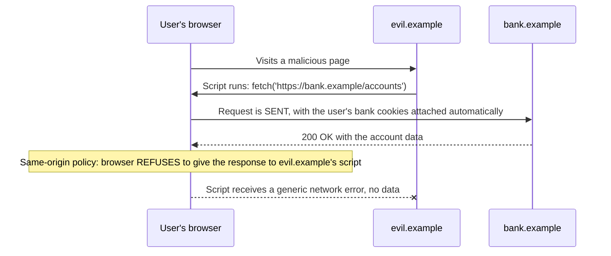
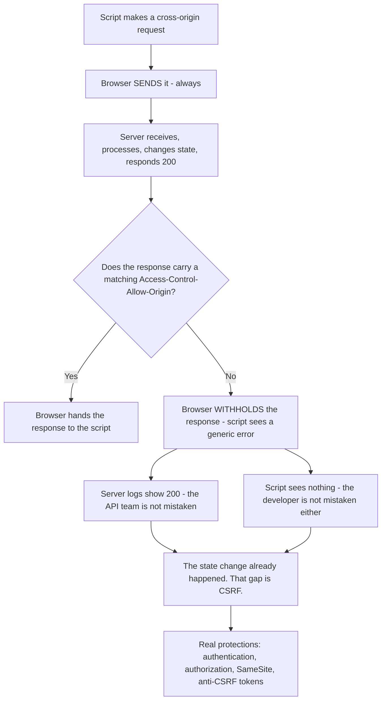
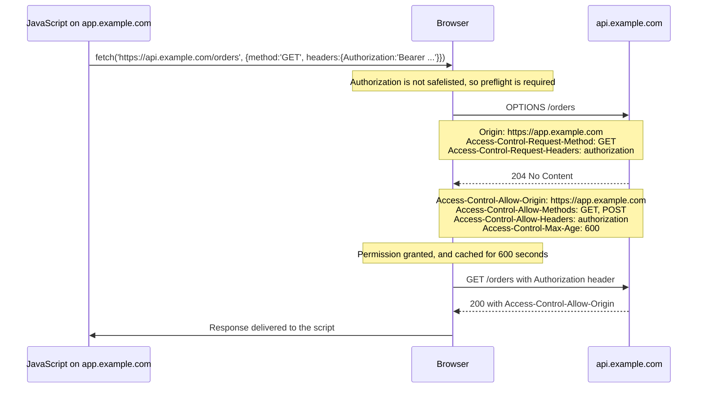
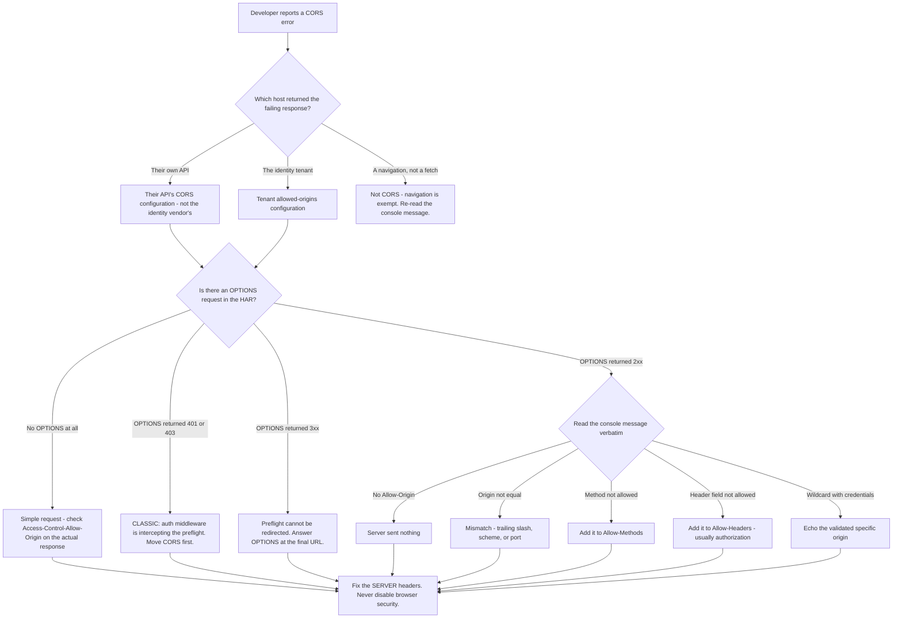

# Part 015 - Same-Origin Policy, CORS, and Preflight

> Section goal: Understand exactly what the browser blocks, why it blocks it, and how CORS selectively unblocks it. CORS errors are among the most common developer-support tickets and among the most misdiagnosed, because the server logs and the developer's experience genuinely disagree. After this Part you should be able to read any CORS error and name the missing header.

Covers index item **015**. Maps to JD signals: *knowledge of HTTP*, *basic security concepts*, *understanding of authentication and authorization concepts*, *strong analytical and problem-solving skills*, and *promote best practices*.

---

## 1. Start From Zero: The Same-Origin Policy

The **same-origin policy** (SOP) is the browser's foundational security rule: **code from one origin may not read data from another origin.**

An **origin** is the triple **scheme + host + port**. All three must match.

| A | B | Same origin? | Why |
|---|---|---|---|
| `https://app.example.com` | `https://app.example.com/anything` | ✅ | Path is irrelevant |
| `https://app.example.com` | `http://app.example.com` | ❌ | Different scheme |
| `https://app.example.com` | `https://api.example.com` | ❌ | Different host |
| `https://app.example.com` | `https://app.example.com:8443` | ❌ | Different port |

### Why it exists



**Read that carefully — it is the key to everything in this Part.**

- The request **is sent**. The browser attaches cookies automatically (Part 014).
- The server **processes it and responds**.
- The browser then **refuses to hand the response to the calling script**.

Without SOP, any page you visited could silently read your email, your bank, and your internal company tools, using your own logged-in sessions.

> **Analogy.** A building where couriers deliver freely, but reception refuses to hand you a parcel unless your name is on the recipient list. The parcel physically arrived; you are not permitted to have it.
>
> **Where it stops:** in a building you would be told why. The browser deliberately gives the script no detail at all, because the error message itself could leak information.

### 🔍 Plain-English deep-dive: what SOP blocks, and what it emphatically does not

This is where almost all confusion begins.

| SOP **blocks** | SOP **does not block** |
|---|---|
| Reading a cross-origin response body from script | **Sending** the request |
| Reading cross-origin response headers from script | Cookies being attached to it |
| Reading another origin's DOM in an iframe | The server processing it and changing state |
| Reading another origin's `localStorage` | Loading cross-origin images, scripts, styles, fonts |
| | Submitting a cross-origin HTML form |

**Two consequences that matter enormously:**

1. **SOP is not a server-side protection.** The request arrived and the server acted on it. If that request was `POST /transfer`, the money moved — the attacker just cannot read the confirmation. That gap is precisely **CSRF**, and it is why `SameSite` and anti-CSRF tokens exist (Part 014). Never let a developer believe "CORS protects my API."
2. **SOP protects *users*, not *servers*.** It stops a hostile page from reading the victim's authenticated data. It does nothing to stop curl, Postman, a mobile app, or a server-side script — none of which have a browser enforcing anything.

**Analogy:** a one-way mirror. It stops someone outside seeing in; it does nothing to stop them knocking, or throwing a brick. **Where it stops:** a brick is visible. A CSRF request looks exactly like a legitimate one to the server.

---

## 2. CORS: Selective Permission

**CORS** (Cross-Origin Resource Sharing) is how a server says *"it is fine for this origin to read my responses."* It is a set of response headers the browser checks before releasing a response to script.

The critical mental model:

> **CORS is a relaxation of SOP, granted by the server, enforced by the browser.**

Three consequences follow, and stating them clearly resolves most CORS arguments:

| Consequence | Meaning |
|---|---|
| Only browsers enforce it | curl, Postman, and server-side code ignore CORS entirely |
| Only the server can grant it | The client cannot "turn CORS on" from its side |
| It is about **reading**, not sending | The request usually still happens either way |



---

## 3. Simple Requests versus Preflighted Requests

The browser classifies every cross-origin request into one of two paths.

### Simple requests

A request is "simple" — sent directly, with no preflight — only if **all** of these hold:

| Condition | Allowed values |
|---|---|
| Method | `GET`, `HEAD`, or `POST` |
| Headers | Only CORS-safelisted headers (`Accept`, `Accept-Language`, `Content-Language`, `Content-Type`, and a few others) |
| `Content-Type` | Only `application/x-www-form-urlencoded`, `multipart/form-data`, or `text/plain` |
| No `ReadableStream` body, no upload progress listener | — |

**The rule that catches everyone:** `Content-Type: application/json` is **not** on the safelist. So virtually every modern API call is preflighted. Likewise, `Authorization: Bearer …` is not a safelisted header — so any authenticated API call is preflighted too.

### Preflighted requests

For anything else, the browser first sends an **`OPTIONS`** request asking permission.



### 🔍 Plain-English deep-dive: why preflight exists at all

If the browser is going to block the *response* anyway, why bother asking first?

Because of the requests that **change state**. A `DELETE /users/42` or a `PUT` with a JSON body would already have taken effect by the time the browser blocked the response. Blocking the answer is no comfort if the user is deleted.

So the browser asks permission **before** sending anything that could be dangerous — anything outside the narrow "simple" set, which was defined as "things an HTML form could already do anyway, so no new capability is being granted."

**That is the actual logic:** simple requests are ones a plain HTML form could always make, so CORS does not need to gatekeep them — the web was already like that. Anything *more* capable than an HTML form requires explicit permission first.

**Analogy:** a delivery driver who can drop a letter through the door unasked, but must ring the bell and get consent before removing furniture. **Where it stops:** the analogy suggests the server is passive. In reality the server actively answers the `OPTIONS` request, and if it does not, nothing proceeds.

---

## 4. The Headers, in Full

### Request headers the browser adds

| Header | On | Meaning |
|---|---|---|
| `Origin` | Every cross-origin request | The calling origin. **The server matches against this.** Cannot be spoofed by page script |
| `Access-Control-Request-Method` | Preflight only | The method the real request will use |
| `Access-Control-Request-Headers` | Preflight only | The non-safelisted headers the real request will send |

### Response headers the server returns

| Header | Purpose | Common mistake |
|---|---|---|
| `Access-Control-Allow-Origin` | Which origin may read this | Returning `*` when credentials are involved — **forbidden** |
| `Access-Control-Allow-Methods` | Permitted methods (preflight) | Forgetting `OPTIONS` itself, or the actual method |
| `Access-Control-Allow-Headers` | Permitted request headers (preflight) | Omitting `authorization` or `content-type` |
| `Access-Control-Allow-Credentials` | May cookies/TLS certs be sent | Must be literally `true`; must not be combined with `*` |
| `Access-Control-Expose-Headers` | Which **response** headers script may read | Why a correlation ID is "missing" in JavaScript but visible in DevTools |
| `Access-Control-Max-Age` | How long to cache the preflight | Absent → a preflight on every single call |
| `Vary: Origin` | Caching correctness | Missing → a CDN caches one origin's CORS response and serves it to another |

### 🔍 Plain-English deep-dive: why `*` and credentials are mutually exclusive

`Access-Control-Allow-Origin: *` means "any origin may read this."

`Access-Control-Allow-Credentials: true` means "and the browser may attach the user's cookies."

Together, they would say: *"any website in the world may make authenticated requests as the logged-in user and read the results."* That is precisely the attack SOP was invented to prevent. So the specification forbids the combination — and the browser rejects it even though the server sent it, producing an error that looks bizarre if you do not know the rule.

The correct pattern is to **echo the specific origin**:

```
Access-Control-Allow-Origin: https://app.example.com
Access-Control-Allow-Credentials: true
Vary: Origin
```

And critically: the server must **validate** the incoming `Origin` against an allow-list before echoing it. Blindly reflecting whatever `Origin` arrives is functionally identical to `*` **with** credentials — which is a genuine, serious vulnerability. When you see reflected-origin code in a customer's stack, that is a finding worth raising.

**Analogy:** a guest list that says "anyone" while also handing out master keys. **Where it stops:** a human doorman would notice the contradiction. A misconfigured server will happily emit both and let the browser catch it.

### `Access-Control-Expose-Headers` — the quiet one

By default, script can read only a handful of response headers. Everything else — including custom correlation and request-ID headers — is invisible to JavaScript even though it is plainly visible in DevTools.

This produces a very specific ticket: *"your API doesn't return the request ID."* It does. The browser is hiding it. The fix is `Access-Control-Expose-Headers: x-request-id`. Knowing this makes you look like you have seen it before, because you will have.

---

## 5. Reading a CORS Error

Browser CORS messages are unusually good — they name the missing piece. The problem is that developers report "CORS error" without reading them.

| Message fragment | Means | Fix |
|---|---|---|
| "No 'Access-Control-Allow-Origin' header is present" | Server sent nothing | Add the header, echoing the validated origin |
| "The 'Access-Control-Allow-Origin' header has a value ... that is not equal to the supplied origin" | Mismatch, often a trailing slash or wrong scheme | Origin has **no trailing slash** and **no path** |
| "Response to preflight request doesn't pass access control check" | The `OPTIONS` response itself was wrong | Check the `OPTIONS` handler exists and returns 2xx |
| "Method ... is not allowed by Access-Control-Allow-Methods" | Method not listed | Add it |
| "Request header field ... is not allowed by Access-Control-Allow-Headers" | Header not listed | Add it (commonly `authorization`, `content-type`) |
| "The value of the 'Access-Control-Allow-Credentials' header ... must be 'true'" | Wrong casing or missing | Literally `true` |
| "Cannot use wildcard ... when the credentials flag is true" | `*` plus credentials | Echo the specific validated origin |
| "Redirect is not allowed for a preflight request" | The `OPTIONS` returned a 3xx | Handle `OPTIONS` at the final URL; do not redirect it |
| "It does not have HTTP ok status" | `OPTIONS` returned 4xx/5xx | Auth middleware is rejecting the preflight — see below |

### The preflight-authentication trap

This one is worth its own paragraph because it is so common and so confusing.

A preflight `OPTIONS` request carries **no** `Authorization` header and **no** cookies. That is by design — it is asking permission, not doing work.

If the customer's authentication middleware runs before their CORS handling, it sees an unauthenticated `OPTIONS` request and returns **401**. The browser sees a non-2xx preflight, blocks everything, and reports a CORS error. The developer then spends a day adding CORS headers that never get reached.

**The rule:** `OPTIONS` must be answered **before** authentication middleware, and must return a 2xx with the CORS headers. In most frameworks that means registering CORS middleware first in the chain.

**Diagnostic giveaway:** the `OPTIONS` request in the HAR returns 401 or 403. Once you know to look, it takes five seconds.

---

## 6. CORS in Identity Flows Specifically

| Where CORS appears | Why | Common failure |
|---|---|---|
| SPA → `/oauth/token` | The SPA exchanges the code directly | The app's origin is not on the tenant's allowed-origins list |
| SPA → `/userinfo` | Fetching profile claims | Same |
| SPA → `/jwks.json` | Usually not needed by the SPA; the API fetches it server-side | A developer fetching JWKS in the browser hits CORS unnecessarily |
| SPA → the customer's own API | Every authenticated call | **Their** API must send CORS headers — not the identity vendor's |
| Silent auth iframe | `web_message` response mode | Not CORS — `postMessage` plus third-party cookies (Part 076) |
| Redirects to `/authorize` | Top-level navigation | **CORS does not apply** to navigation at all |

### 🔍 Plain-English deep-dive: navigation is not a `fetch`

Developers frequently ask *"why do I get a CORS error on the login redirect?"* You almost never do — and if the error appears there, it is a different problem wearing a CORS mask.

- **Navigating** the browser to `https://login.vendor.com/authorize?...` — by `window.location`, a link, or a `302` — is a **top-level navigation**. SOP and CORS are not involved. The browser is simply going to a new page.
- **Fetching** `https://login.vendor.com/oauth/token` from script **is** a cross-origin request, and CORS absolutely applies.

So the shape of the ticket tells you which is which:

| Symptom | Reality |
|---|---|
| "CORS error when redirecting to login" | Usually not CORS — likely an SDK doing a background `fetch`, or a misread console message |
| "CORS error on the token exchange" | Genuine CORS — the tenant's allowed-origins list |
| "CORS error calling our own API with the token" | Genuine CORS — **their** API's configuration, not the identity vendor's |

That third row matters a lot: developers frequently open a ticket with the identity vendor about a CORS error that is entirely in their own API. Establishing *which host* returned the failing response, from the HAR, settles it in one exchange.

---

## 7. Failure Modes

| Failure mode | What it looks like | Consequence | Correction |
|---|---|---|---|
| **"CORS protects my API"** | Developer relies on it for security | False sense of safety; CSRF still possible | SOP is a user protection; the request still arrives |
| **Not reading the console message** | "I get a CORS error" | The message named the missing header | Ask for the **verbatim** console text |
| **Origin with a trailing slash** | `https://app.example.com/` on the allow-list | Never matches | Origin is scheme+host+port, **no path, no slash** |
| **`*` with credentials** | Both headers present | Browser rejects; confusing error | Echo the validated specific origin |
| **Reflecting any origin** | Server echoes whatever arrives | **Serious vulnerability** | Validate against an allow-list first |
| **Preflight hits auth middleware** | `OPTIONS` returns 401 | Day lost adding headers that are never reached | CORS middleware before authentication |
| **Preflight redirected** | `OPTIONS` returns 3xx | Hard failure, unhelpful message | Answer `OPTIONS` at the final URL |
| **Missing `Vary: Origin`** | Works for one origin, breaks for another | CDN serves the wrong CORS header | Add `Vary: Origin` |
| **No `Access-Control-Max-Age`** | Preflight on every call | Doubled latency, doubled rate-limit usage | Set a sensible cache duration |
| **Header invisible to script** | "Your API doesn't return the request ID" | It does; the browser hides it | `Access-Control-Expose-Headers` |
| **Debugging with curl** | "It works in curl" | curl ignores CORS entirely | Reproduce in a browser, from the real origin |
| **Disabling web security to "fix" it** | Browser launched with security flags off | Masks the bug; unsafe habit; will fail in production | Fix the server headers — never advise disabling browser security |

---

## 8. Troubleshooting Decision Tree



### Worked example

*"Our React app can't call our API. We get a CORS error. It works fine in Postman."*

1. **"Works in Postman" is expected, not informative.** Postman is not a browser and ignores CORS entirely. Say so kindly — it saves them from thinking the API is fine.
2. **Which host failed?** From the HAR: `api.customer.com`. So this is **their** API, not the identity vendor's. That reframes the entire ticket.
3. **Is there an `OPTIONS`?** Yes — because they send `Authorization: Bearer`, which is not safelisted.
4. **What did `OPTIONS` return?** `401`.
5. **Diagnosis:** their authentication middleware is running before CORS handling and rejecting the unauthenticated preflight. The browser never gets to see any CORS headers.
6. **Fix:** register CORS middleware before authentication so `OPTIONS` is answered with 2xx and the CORS headers. Add `authorization` to `Access-Control-Allow-Headers`, set `Access-Control-Max-Age` so the preflight is cached, and add `Vary: Origin` if a CDN is in front.
7. **Prevention:** an integration test that issues a cross-origin `OPTIONS` and asserts a 2xx.

Two questions — *which host* and *what did `OPTIONS` return* — got from "CORS error" to a precise root cause in someone else's middleware ordering.

---

## 9. Lab: Cause and Fix Every CORS Failure

**Purpose.** Generate each CORS failure yourself so you recognise the console text instantly, and build a personal message-to-cause table.

**Prerequisites.** Part 007's lab, Node.js/Express, two local origins. Reuse the playground from Part 014 if convenient. **Localhost and your own tenant only.**

**Steps.**

1. Create `okta-prep/labs/015-cors/`.
2. **Two origins.** Serve a page from `http://localhost:3000` and an API from `http://localhost:4000`. Different ports means different origins, which is all you need.
3. **Baseline simple request.** From the page, `fetch('http://localhost:4000/simple')` with no custom headers and no JSON content type. Observe: **no** `OPTIONS` in the Network tab. Record whether it succeeds with and without `Access-Control-Allow-Origin`.
4. **Force a preflight.** Add `Content-Type: application/json`. Observe the `OPTIONS` appear. Record the exact `Access-Control-Request-*` headers the browser sent.
5. **Break it eight ways.** For each, record the **verbatim console message** and the HAR evidence:
   - a. API sends no CORS headers at all
   - b. `Access-Control-Allow-Origin` with a trailing slash
   - c. `Access-Control-Allow-Origin` with the wrong port
   - d. Method missing from `Access-Control-Allow-Methods`
   - e. `authorization` missing from `Access-Control-Allow-Headers`
   - f. `Access-Control-Allow-Origin: *` together with `credentials: 'include'`
   - g. `OPTIONS` handler returns 401 (put auth middleware first — **the classic**)
   - h. `OPTIONS` handler returns a 302 redirect
6. **Credentials.** Set a cookie on `localhost:4000`, then call it from `localhost:3000` with `credentials: 'include'`. Make it work with an echoed specific origin plus `Access-Control-Allow-Credentials: true`. Then break it by switching to `*`. Record both.
7. **Expose a header.** Return `x-request-id` from the API. Try to read it in script — it will be `null`. Add `Access-Control-Expose-Headers: x-request-id` and read it successfully. **This is the "your API doesn't return the request ID" ticket, reproduced.**
8. **Preflight caching.** Add `Access-Control-Max-Age: 600`. Make three calls and count the `OPTIONS` requests. Then remove it and count again.
9. **Curl contrast.** Run the same failing request with `curl` and observe that it succeeds. Write one line explaining why, for use with customers.
10. **Reference + catalog.** Write `cors-messages.md` mapping each verbatim console message to its cause and fix. Add all rows to the failure catalog. Complete `MANIFEST.md`.

**Expected evidence.** Eight verbatim console messages with matching HAR evidence, a working credentialed cross-origin call, an exposed-header before/after, a preflight-cache count, and a personal message-to-cause table.

**Validation rubric.**

| Check | Pass condition |
|---|---|
| Simple vs preflight observed | You saw `OPTIONS` appear only after making the request non-simple |
| Eight failures captured | Console text copied character-for-character, not paraphrased |
| The 401-preflight case | Reproduced deliberately, and you can explain the middleware ordering |
| Credentials both ways | Working with a specific origin, failing with `*` |
| Expose-headers proven | Header unreadable before, readable after |
| Cache counted | `OPTIONS` count recorded with and without `Max-Age` |
| curl contrast written | One clear sentence you could send to a customer |
| Nothing disabled | You never launched a browser with security flags off |

**Cleanup and privacy.** Localhost only. **Do not** launch a browser with web security disabled, even in a lab — the point is to build the instinct that the fix is always server-side headers. Do not send cross-origin probes at any third-party API. Stop both servers when finished.

---

## 10. JD Mapping

| Supplied JD signal | How this Part supports it |
|---|---|
| Knowledge of HTTP | CORS is entirely an HTTP header negotiation, covered header by header |
| Basic security concepts | §1's SOP rationale, §4's wildcard-plus-credentials rule, and the reflected-origin vulnerability |
| Understanding of authentication and authorization concepts | §5's preflight-authentication trap sits exactly at the intersection |
| Strong analytical and problem-solving skills | §8's two-question funnel: which host, and what did `OPTIONS` return |
| Promote best practices | Validate origins against an allow-list; set `Max-Age`; add `Vary: Origin`; never disable browser security |
| Instinctive ability to subdivide problems | Establishing *whose* server returned the failing response reframes the ticket immediately |
| Exceed expectations on response quality | Naming the exact missing header from a console message is a visibly expert answer |

---

## 11. Candidate Honesty Note

- **Production transfer:** you have read browser console errors and HAR files on real escalations, and you already know that "it works in one tool but not another" is a discriminator rather than a mystery.
- **New here:** the precise simple-versus-preflight rules, the credentials constraint, and the middleware-ordering trap. All are observable in a single lab session.
- **The strongest thing to say:** *"I reproduced eight distinct CORS failures locally and kept the verbatim console messages, because the browser almost always names the missing header — the problem is that developers report 'CORS error' without reading it."* That is specific and immediately useful.
- **A genuinely valuable habit to describe:** establishing *which host* returned the failing response before anything else, because a large share of CORS tickets opened against an identity vendor are actually about the customer's own API.
- **Never advise** disabling browser web security, using a browser extension that injects CORS headers, or proxying through a public CORS-anywhere service. All three mask the bug, none work in production, and recommending them signals inexperience.

---

## 12. Official Source Anchors

Accessed **26 August 2026**.

| Source | What it defines |
|---|---|
| WHATWG Fetch Standard — CORS protocol | The authoritative rules: safelisted headers, preflight conditions, credentials, and the wildcard restriction |
| WHATWG HTML Standard — origin | The definition of an origin used in §1 |
| MDN — CORS, and the CORS errors reference | Plain-language explanations plus a page per console error message |
| MDN — `Access-Control-Expose-Headers` | The behavior behind §4's "quiet one" |
| IETF RFC 9110 | `OPTIONS` method semantics |
| OWASP — CORS misconfiguration guidance | Why reflecting arbitrary origins is a vulnerability |
| Auth0 and Okta documentation — allowed web origins / CORS settings | Vendor-side configuration; **note this is separate from allowed callback URLs** |
| Express `cors` middleware documentation (and equivalents) | Middleware ordering, which is the root cause in §5's trap |

**Revalidate after 26 August 2026:** vendor origin-configuration naming. The Fetch Standard's CORS rules are stable.

---

## ⭐ Likely Interview Questions for This Section

### Q1. "Explain CORS to a developer who thinks their API is broken."
> *Model answer:* "The key is that CORS is enforced by the browser, not the server, and that resolves the disagreement immediately. The browser sent the request. The server received it, processed it, and returned a 200 — so the API team's logs showing success are accurate, they're not mistaken. But because the response didn't carry an `Access-Control-Allow-Origin` header matching the calling page's origin, the browser refused to hand the response to the JavaScript that asked for it. The script sees a generic network error with no detail, deliberately, because the detail could leak information. So both parties are telling the truth about different things. And I'd add the important corollary: CORS isn't protecting the server — anything can call it with curl. It protects *users*, by stopping one site reading another site's authenticated responses using the victim's own cookies."

### Q2. "What's the difference between a simple and a preflighted request?"
> *Model answer:* "A simple request is one an ordinary HTML form could already have made before CORS existed — `GET`, `HEAD`, or `POST`, with only safelisted headers, and a `Content-Type` limited to form-encoded, multipart, or plain text. Because the web already worked that way, the browser sends those directly and only gatekeeps the response. Anything more capable gets a preflight: the browser first sends an `OPTIONS` request asking whether the real request is permitted. The reason preflight exists is state change — a `DELETE` or a JSON `PUT` would already have taken effect by the time the browser blocked the response, and blocking the answer is no comfort if the record is gone. In practice almost every modern API call is preflighted, because `Content-Type: application/json` isn't safelisted and neither is `Authorization`."

### Q3. "A preflight is returning 401. What's happening?"
> *Model answer:* "Middleware ordering, and it's the single most common CORS root cause I'd expect to see. A preflight `OPTIONS` deliberately carries no `Authorization` header and no cookies — it's asking permission, not doing work. So if the customer's authentication middleware runs before their CORS handling, it sees an unauthenticated request and returns 401. The browser sees a non-2xx preflight, blocks everything, and reports a CORS error. The developer then spends a day adding CORS headers to a handler that's never reached. The fix is to register CORS middleware before authentication so `OPTIONS` returns 2xx with the headers. And the diagnostic is fast once you know to look — the `OPTIONS` request in the HAR shows 401 right there."

### Q4. "Why can't you use `Access-Control-Allow-Origin: *` with credentials?"
> *Model answer:* "Because together they'd say 'any website in the world may make authenticated requests as the logged-in user and read the results' — which is exactly the attack the same-origin policy exists to prevent. So the spec forbids the combination and the browser rejects it even when the server sends both. The correct pattern is to echo the specific origin alongside `Access-Control-Allow-Credentials: true`, plus `Vary: Origin` so a CDN doesn't cache one origin's response and serve it to another. But there's an important trap: the server must *validate* the incoming `Origin` against an allow-list before echoing it. Blindly reflecting whatever arrives is functionally identical to wildcard-with-credentials, and it's a genuine vulnerability. If I see reflected-origin code in a customer's stack, I'd raise it even if it isn't what they asked about."

### Q5. "A customer says your API doesn't return the request ID header. Does it?"
> *Model answer:* "Almost certainly it does, and the browser is hiding it. By default, script can only read a small set of response headers — everything else is invisible to JavaScript even though it's plainly visible in DevTools, which is why the customer can see it and their code can't. The fix is `Access-Control-Expose-Headers` listing the header name. I'd confirm by asking them to check the Network tab: if the header is in the response there but `response.headers.get()` returns null, that's conclusive. It's a satisfying one to resolve because it looks like a missing feature and it's actually a one-line header addition — and it matters, because that request ID is the bridge between their client-side evidence and the server-side log event."

### Q6. "A developer says 'it works in Postman but not in the browser.' What do you tell them?"
> *Model answer:* "That it's expected rather than informative, and I'd say it kindly because they usually offer it as evidence the API is fine. Postman isn't a browser — it has no same-origin policy and ignores CORS entirely. The same is true of curl and any server-side HTTP client. So 'works in Postman' tells us the API is functioning; it tells us nothing about CORS. What it *does* usefully confirm is that the problem is a browser-enforced restriction rather than a server fault, which narrows things. Then I'd ask the two questions that matter: which host returned the failing response — because a lot of CORS tickets opened against an identity vendor are actually about the customer's own API — and what status did the `OPTIONS` preflight return."

### Q7. "Does CORS protect an API from attackers?"
> *Model answer:* "No, and believing it does is a dangerous misconception I'd correct directly. CORS is a browser-enforced relaxation of the same-origin policy — it controls whether *script on a page* may read a cross-origin response. It doesn't stop the request being sent, it doesn't stop the server processing it, and it doesn't apply at all to curl, Postman, mobile apps, or server-side code. So an attacker simply doesn't use a browser. The genuine protections are authentication and authorization on every request, and for browser-borne attacks specifically, `SameSite` cookies and anti-CSRF tokens — because the gap CORS leaves open is exactly CSRF: the request arrives with the victim's cookies and takes effect, and the attacker merely can't read the confirmation. If a customer tells me CORS is their API's security model, that's a finding, not a passing remark."

### Q8. "How would you stop CORS problems recurring for a customer?"
> *Model answer:* "Four things, in order of value. First, an integration test that issues a cross-origin `OPTIONS` from a realistic origin and asserts a 2xx with the expected headers — that catches middleware reordering, which is how this regresses. Second, correct configuration rather than convenience: validate `Origin` against an allow-list instead of reflecting it, set `Access-Control-Max-Age` so preflights are cached rather than doubling every call's latency and rate-limit usage, and add `Vary: Origin` if there's a CDN in front. Third, keep the allowed-origins list in configuration alongside redirect URIs so both get updated together when a new environment appears — they fail for the same reasons. And fourth, documentation for their team explaining that the fix is always server-side headers, because otherwise someone eventually reaches for a browser flag or a public proxy, which masks the bug and won't work in production."

---

## 🧠 30-Second Memory Hooks

- **SOP: code from one origin may not READ another origin's data.** Origin = scheme + host + port.
- **The request is still sent. Cookies are still attached. The server still acts.** Only *reading* is blocked.
- **Therefore CORS is not API security.** The gap it leaves is CSRF.
- **CORS = server-granted, browser-enforced.** curl and Postman ignore it entirely.
- **Simple = what an HTML form could already do.** `application/json` and `Authorization` are **not** simple.
- **Preflight exists because of state change** — blocking the answer is no comfort if the record is deleted.
- **`*` + credentials is forbidden.** Echo the **validated** specific origin, plus `Vary: Origin`.
- **Reflecting any origin = wildcard with credentials = a vulnerability.**
- **`OPTIONS` returning 401 = auth middleware before CORS middleware.** The classic.
- **Preflight cannot be redirected.**
- **Headers are invisible to script unless `Access-Control-Expose-Headers` lists them.**
- **Navigation is exempt** — a login redirect is not a CORS operation.
- **Never disable browser web security.** The fix is always server-side headers.

---

## ✅ Completion Checklist

- [ ] **Knowledge:** I can state what SOP blocks and does not block, list the preflight triggers, and explain why `*` and credentials are incompatible.
- [ ] **Lab artifact:** `015-cors/` contains eight verbatim console messages, the 401-preflight reproduction, a credentialed cross-origin call, and an expose-headers before/after.
- [ ] **Spoken:** I can explain to a developer why their server logs show 200 while their script sees an error, in under 45 seconds.
- [ ] **Honesty check:** I never disabled browser security in the lab, and every probe stayed on localhost.
- [ ] **Source check:** I have read MDN's CORS errors reference and the Fetch Standard's safelisted-header list myself.

---

*Next suggested section:* **[Part 016 - The Browser Security Model: Storage, Iframes, CSP, Isolation](Part-016-the-browser-security-model-storage-iframes-csp-isolation.md)** — cookies and CORS are two pillars of the browser's security model; next comes the rest of it, including where a SPA should actually keep a token.
