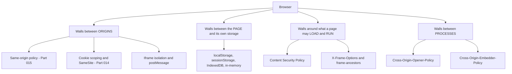
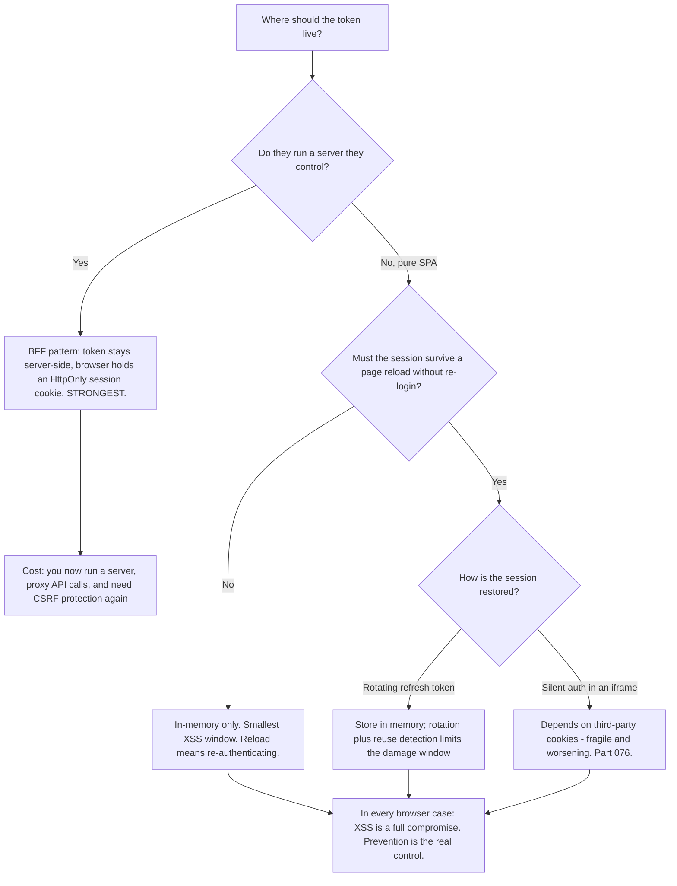
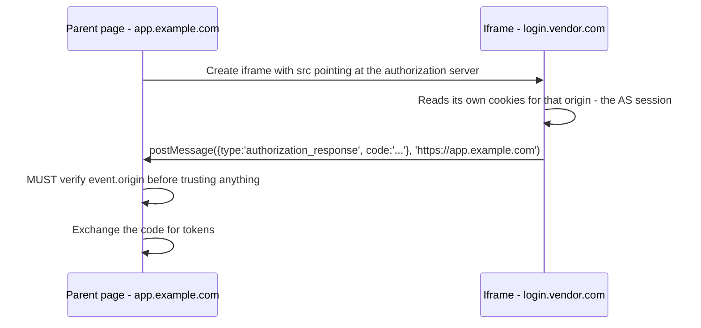
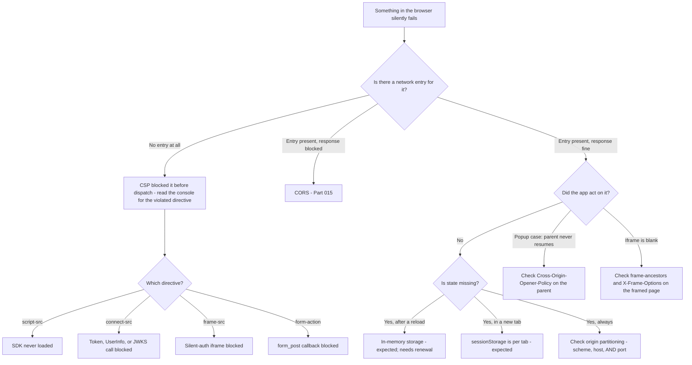

# Part 016 - The Browser Security Model: Storage, Iframes, CSP, Isolation

> Section goal: Complete the browser picture. Cookies and CORS were two pillars; this Part covers the rest — where a SPA can store a token and what each choice costs, how iframes and `postMessage` work, what Content Security Policy blocks, and the isolation features that decide whether an embedded login can function at all.

Covers index item **016**. Maps to JD signals: *basic security concepts*, *knowledge of HTTP*, *understanding of authentication and authorization concepts*, *promote best practices*, and *knowledge of common architectures*.

---

## 1. Start From Zero: The Browser Is a Hostile Multi-Tenant Environment

A browser runs code from dozens of unrelated, mutually distrusting parties simultaneously — your bank, a news site, an advertising network, a chat widget — often in the same window.

The browser's whole security model is therefore about **isolation**: keeping those parties from reading each other's data. Every mechanism in this Part is one wall in that structure.



> **Analogy.** A serviced office building where every tenant is a stranger, some are actively hostile, and reception has no way to vet anyone. The building's safety comes entirely from doors, walls, and rules about what may be carried between floors.
>
> **Where it stops:** in a building, tenants sign leases and can be evicted. On the web, any page can load any other party's code at any time, with no vetting at all. That is why the walls have to be structural rather than contractual.

### 🔍 Plain-English deep-dive: why this Part decides your token-storage answer

The most frequently asked security question in browser-based identity is: *"where should I store the access token?"*

There is no answer that is simply "safe". There is only a set of trade-offs, and you cannot reason about them without knowing what each storage mechanism exposes. Specifically:

- **Anything JavaScript can read, injected JavaScript can also read.** So every storage option except "not in the browser at all" is compromised by cross-site scripting.
- **Anything the browser sends automatically** is exposed to CSRF instead.
- **Anything that survives a reload** is exposed for longer.

So the real question is not "which is safe" but **"which threat am I choosing to accept, and what compensating control am I adding?"** Answering it that way — rather than naming a winner — is what a senior support engineer sounds like.

---

## 2. Where a Token Can Live

| Location | Survives reload? | Survives tab close? | Readable by JS? | Sent automatically? | Main risk |
|---|---|---|---|---|---|
| **In-memory JavaScript variable** | ❌ | ❌ | Yes (same page only) | ❌ | Lost on reload → silent-renewal dependency |
| **`sessionStorage`** | ✅ | ❌ (per tab) | Yes | ❌ | XSS |
| **`localStorage`** | ✅ | ✅ | Yes | ❌ | XSS, and persists a long time |
| **`IndexedDB`** | ✅ | ✅ | Yes | ❌ | XSS; more capacity, same exposure |
| **Non-`HttpOnly` cookie** | ✅ | Depends | Yes | ✅ | XSS **and** CSRF — worst of both |
| **`HttpOnly` cookie** | ✅ | Depends | **No** | ✅ | CSRF (mitigated by `SameSite`) |
| **Service worker memory** | ✅ (while alive) | Varies | Only by the worker | ❌ | Complexity; worker lifecycle |
| **Not in the browser at all (BFF)** | n/a | n/a | **No** | Session cookie only | Requires a server |

### The honest comparison



### 🔍 Plain-English deep-dive: "`localStorage` is insecure" is only half a sentence

You will hear this stated as a rule. It is true but incomplete, and repeating it without the rest makes you sound like you are reciting rather than reasoning.

The full position:

- `localStorage` is readable by any JavaScript on the origin. If an attacker achieves XSS, they read the token. **True.**
- **But** if an attacker achieves XSS, they can also simply *use* the session regardless of where the token lives. With an `HttpOnly` cookie they cannot steal it — but they can make authenticated requests from the page, silently, for as long as the page is open. They can also rewrite the DOM, capture credentials, and initiate their own authorization flows.
- So `HttpOnly` reduces **exfiltration** (taking the credential away for later use elsewhere) but does not prevent **abuse** (using it here and now).

**Therefore the correct framing is:** XSS is a full compromise of that session no matter what. Storage choice changes the *blast radius and duration*, not whether you were compromised. The primary control is preventing XSS — output encoding, a strict CSP, dependency hygiene — and storage choice is a secondary mitigation.

**Analogy:** a burglar in your house. A safe stops them taking the jewellery away. It does nothing to stop them using your phone, your computer, and your kettle while they are inside. **Where it stops:** the burglar leaves eventually. Injected script persists for the life of the page, and can re-inject itself on every load if the underlying flaw remains.

---

## 3. Storage Mechanisms in Detail

| Mechanism | Scope | Capacity | API style | Cleared when |
|---|---|---|---|---|
| **`localStorage`** | Per origin | ~5–10 MB | Synchronous, string-only | User clears data, or code removes it |
| **`sessionStorage`** | Per origin **per tab** | ~5–10 MB | Synchronous, string-only | Tab closes |
| **`IndexedDB`** | Per origin | Large, quota-based | Asynchronous, structured | User clears data, or eviction under pressure |
| **Cookies** | Per origin/domain scope | ~4 KB each | Header-based | Expiry, or clearing |
| **Cache Storage** | Per origin | Quota-based | Asynchronous | Eviction or explicit deletion |

**Points that produce tickets:**

- **`sessionStorage` is per tab.** Open the app in a second tab and it is empty. "Why am I logged out in a new tab?" is often this.
- **Synchronous storage blocks the main thread.** Large reads/writes to `localStorage` cause jank; not usually an identity issue, but worth knowing.
- **Storage is partitioned by origin, including scheme and port.** `http://localhost:3000` and `http://localhost:4000` have entirely separate storage. Developers testing across ports hit this constantly.
- **Private browsing and storage pressure evict aggressively.** "It works normally but not in incognito" can be storage eviction as well as cookie policy.

---

## 4. Iframes and `postMessage`

An **iframe** embeds one document inside another. If the two are different origins, SOP applies fully: neither can read the other's DOM, storage, or cookies.

To communicate deliberately, they use **`postMessage`**.



### The two `postMessage` rules that matter

| Rule | Why | Failure if ignored |
|---|---|---|
| **Always specify a `targetOrigin`** when sending — never `'*'` | Otherwise any page that manages to frame you receives the message | Token or code leaked to an attacker's page |
| **Always verify `event.origin`** when receiving | Any framed or framing page can send you messages | You act on attacker-supplied data |

This is exactly how `response_mode=web_message` works for silent authentication (Part 076), and it is why that mechanism can be secure — provided both rules are followed. When reviewing a customer's silent-auth code, these two lines are the first thing to look for.

### Framing controls

A site can refuse to be embedded:

| Mechanism | Header | Effect |
|---|---|---|
| **Legacy** | `X-Frame-Options: DENY` / `SAMEORIGIN` | Blocks framing entirely, or allows same-origin only |
| **Modern** | `Content-Security-Policy: frame-ancestors 'self' https://app.example.com` | Fine-grained allow-list; supersedes `X-Frame-Options` |

**Why login pages usually refuse framing:** **clickjacking.** An attacker frames the real login page invisibly over their own decoy UI, and the user's clicks land on the real page without them realising. Refusing to be framed removes the attack.

**The support consequence:** a developer who wants to embed the login page in an iframe "for a seamless experience" will be blocked, and this is deliberate. The supported answers are a redirect to the hosted login page, or a popup — never framing the credential entry surface.

---

## 5. Content Security Policy

**CSP** is a response header that tells the browser what the page is permitted to load and execute. It is the strongest available defence against XSS.

```
Content-Security-Policy:
  default-src 'self';
  script-src 'self' https://cdn.vendor.com;
  connect-src 'self' https://login.vendor.com https://api.example.com;
  frame-src https://login.vendor.com;
  frame-ancestors 'none';
```

| Directive | Controls | Identity relevance |
|---|---|---|
| `default-src` | Fallback for everything | Too strict here breaks things silently |
| `script-src` | Which scripts may run | **Blocks a CDN-hosted identity SDK if not listed** |
| `connect-src` | Which origins `fetch`/XHR/WebSocket may reach | **Blocks the token endpoint, UserInfo, and JWKS if not listed** |
| `frame-src` | What may be embedded | **Blocks the silent-auth iframe if not listed** |
| `frame-ancestors` | Who may embed *this* page | Replaces `X-Frame-Options` |
| `form-action` | Where forms may submit | Can block a `form_post` response mode |
| `img-src` | Images | Blocks branding assets on custom login pages |

### 🔍 Plain-English deep-dive: how CSP failures present, and why they look like something else

CSP violations produce a **console message and nothing else**. The request never happens. There is no network entry, no status code, no error body.

That produces a distinctive and confusing symptom set:

| What the developer sees | What is actually happening |
|---|---|
| "The SDK just doesn't do anything" | `script-src` blocked the SDK from loading |
| "The token call never appears in the Network tab" | `connect-src` blocked it before it was sent |
| "The iframe is blank" | `frame-src` blocked it |
| "It works locally, fails in production" | CSP is only applied in production |

**The tell:** *nothing in the Network tab.* A CORS failure shows a request that was made and refused. A CSP failure shows **no request at all**, plus a console line naming the violated directive.

That single distinction — "is there a network entry?" — separates CSP from CORS instantly, and it is a genuinely fast, expert-looking diagnostic.

**Analogy:** CORS is a parcel that arrives and reception won't release. CSP is a parcel the post office refused to accept for dispatch. **Where it stops:** the post office would tell the sender. CSP tells only the console, which nobody is reading.

### Report-only mode

`Content-Security-Policy-Report-Only` evaluates the policy and reports violations **without blocking**. It is the correct way to introduce or tighten a CSP, and recommending it is a real best-practice contribution: *"deploy it report-only for a week, collect the violations, then enforce."*

---

## 6. Cross-Origin Isolation

Two newer headers control whether a page can be isolated from cross-origin interference.

| Header | Controls | Why it exists |
|---|---|---|
| `Cross-Origin-Opener-Policy` (COOP) | Whether a window opened by/from you shares a browsing context | Prevents a popup and its opener from scripting each other |
| `Cross-Origin-Embedder-Policy` (COEP) | Whether cross-origin resources must opt in to being embedded | Required for high-resolution timers and shared memory |
| `Cross-Origin-Resource-Policy` (CORP) | Who may embed this resource at all | Blunt protection against cross-origin reads |

**Where this bites identity:** popup-based login. If a page sets `Cross-Origin-Opener-Policy: same-origin`, the popup it opens **cannot** call back into the opener via `window.opener`. Popup-based authentication SDKs rely on exactly that channel.

**Symptom:** the popup completes authentication, closes, and the parent page never notices — it just sits there waiting forever.

**Diagnosis:** check for `Cross-Origin-Opener-Policy` on the parent page. `same-origin-allow-popups` is usually the value that preserves the callback while keeping most of the benefit. This is an obscure failure with a very specific cause, and recognising it is disproportionately impressive.

---

## 7. Failure Modes

| Failure mode | Symptom | Cause | Fix |
|---|---|---|---|
| **Token in `localStorage` with no CSP** | Compromised by any XSS | Two weak choices compounding | Add a strict CSP; consider BFF; never rely on storage choice alone |
| **`sessionStorage` surprise** | "Logged out in a new tab" | Per-tab scope | Expected behavior — explain it, or change mechanism |
| **`postMessage` with `'*'`** | Code or token leaked | No target origin specified | Always specify `targetOrigin` |
| **No `event.origin` check** | Acting on hostile input | Missing validation | Verify origin on every received message |
| **Login page framed** | Blank iframe | `frame-ancestors` / `X-Frame-Options` refusing | Deliberate anti-clickjacking; use redirect or popup |
| **CSP blocks `connect-src`** | Token call absent from Network tab | Endpoint not allow-listed | Add the identity origins to `connect-src` |
| **CSP blocks the SDK** | "Nothing happens" | `script-src` missing the CDN | Add it, or self-host the SDK |
| **CSP only in production** | "Works locally" | Policy applied by a production-only proxy | Apply CSP in all environments |
| **COOP blocks popup callback** | Popup completes; parent hangs forever | `Cross-Origin-Opener-Policy: same-origin` | `same-origin-allow-popups`, or switch to redirect |
| **Storage partitioned by port** | Testing across ports loses state | Origin includes the port | Expected; test on a consistent origin |
| **Incognito eviction** | "Works normally, fails in private mode" | Storage and cookie restrictions | Distinguish from third-party cookie blocking (Part 017) |

---

## 8. Troubleshooting Decision Tree: "It Just Doesn't Work in the Browser"



### Worked example

*"We're using the popup login. The user logs in, the popup closes, and our app just spins forever. It worked last month."*

1. **Is there a network entry?** The authentication requests all succeeded — so not CSP, not CORS.
2. **Did the app act on it?** No. The parent never received the result.
3. **Popup case → check COOP.** Ask for the response headers of the **parent** page.
4. **Finding:** they added `Cross-Origin-Opener-Policy: same-origin` as part of a security hardening exercise last month. That severs `window.opener`, so the popup cannot call back.
5. **"It worked last month" is now explained** — and it is exactly Part 009's "nothing changed" pattern: a security header was added by a different team.
6. **Fix:** `same-origin-allow-popups` preserves the callback while retaining most of the isolation benefit; or switch to a redirect-based flow, which has no opener dependency at all.
7. **Prevention:** add a login smoke test to their deploy pipeline so a header change surfaces immediately.

That diagnosis rests on one obscure header, reached by three mechanical questions. It is the kind of answer that ends an interview well.

---

## 9. Lab: Observe Every Wall

**Purpose.** See each isolation mechanism actually block something, so the symptoms become recognisable rather than theoretical.

**Prerequisites.** Part 007's lab, Node/Express, two local origins. **Localhost only.**

**Steps.**

1. Create `okta-prep/labs/016-browser-model/`.
2. **Storage comparison.** On one page, write the same value to an in-memory variable, `sessionStorage`, `localStorage`, and a non-`HttpOnly` cookie. Then: reload the page, open a second tab, and open a second port (`localhost:4000`). Record which values survive each event. **Build the §2 table from your own observations.**
3. **`HttpOnly` proof.** Set one cookie with `HttpOnly` and one without. In the console, run `document.cookie` and record which appears. Screenshot it — this is a two-second demonstration you can describe to a developer.
4. **XSS reality check (safe, local, self-inflicted).** On your own local page only, add a button that runs `alert(localStorage.getItem('token'))` — simulating what injected script could do. Then repeat with the `HttpOnly` cookie and observe that it is unreadable. Then note in writing that the script could still *use* the cookie by making a request. **This is the §2 deep-dive, proven.** Use a fake token value; do not use any real one.
5. **`postMessage`.** Build a parent page on `:3000` embedding a child on `:4000`. Send a message with `targetOrigin: '*'` and again with the specific origin. On the receiving side, log `event.origin`. Record what an unvalidated handler would accept.
6. **Framing refusal.** Add `X-Frame-Options: DENY` to the child, reload the parent, and record the exact console message. Then swap to `Content-Security-Policy: frame-ancestors 'self'` and record that message too.
7. **CSP blocking.** Add a CSP to your page with `connect-src 'self'`, then attempt a `fetch` to `localhost:4000`. **Confirm there is no Network entry** and record the console violation verbatim. Repeat with `script-src` blocking an external script.
8. **Report-only.** Switch to `Content-Security-Policy-Report-Only` with the same policy and confirm the request now succeeds while still logging a violation. Record both.
9. **COOP.** Add `Cross-Origin-Opener-Policy: same-origin` to a parent page that opens a popup, and have the popup try `window.opener.postMessage(...)`. Record the failure. Then try `same-origin-allow-popups` and record the success.
10. **Reference + catalog.** Write `browser-walls.md`: each mechanism, what it blocks, its exact symptom, and how to distinguish it from the others. Add all rows to the failure catalog. Complete `MANIFEST.md`.

**Expected evidence.** A storage-survival matrix from observation, an `HttpOnly` screenshot, a documented XSS reality check with a fake token, `postMessage` origin logs, two framing-refusal messages, verbatim CSP violations with confirmed absence of network entries, a report-only contrast, and a COOP before/after.

**Validation rubric.**

| Check | Pass condition |
|---|---|
| Storage matrix observed | Reload, new tab, and new port all tested |
| `HttpOnly` proven | Screenshot showing one cookie visible and one not |
| XSS check documented | Fake token only, plus the written note that `HttpOnly` prevents theft but not abuse |
| `postMessage` origins logged | Both `'*'` and specific target origin tested |
| Framing messages captured | Both `X-Frame-Options` and `frame-ancestors` variants |
| CSP: no network entry | You explicitly confirmed the Network tab was empty |
| Report-only contrast | Same policy, request succeeds, violation still logged |
| COOP before/after | Failure and fix both reproduced |

**Cleanup and privacy.** Localhost only, with fake token values throughout. The step-4 exercise is a **self-inflicted demonstration on your own page** — do not attempt anything resembling script injection against any site you do not own, including your own lab tenant's hosted pages. Stop both servers when finished.

---

## 10. JD Mapping

| Supplied JD signal | How this Part supports it |
|---|---|
| Basic security concepts | The entire Part is applied browser security: isolation, XSS, clickjacking, CSP |
| Knowledge of HTTP | CSP, `X-Frame-Options`, COOP/COEP/CORP are all response headers |
| Understanding of authentication and authorization concepts | §2's token-storage trade-offs are a core CIAM design conversation |
| Promote best practices | Strict CSP, report-only rollout, `targetOrigin` on `postMessage`, origin validation on receipt |
| Knowledge of common architectures | §2's decision tree connects storage choice to the architectures in Part 010 |
| Strong analytical and problem-solving skills | §8's "is there a network entry?" separates CSP from CORS in one glance |
| Instinctive ability to subdivide problems | Each wall has a distinct, recognisable symptom signature |

---

## 11. Candidate Honesty Note

- **Production transfer:** you have diagnosed browser-side failures using DevTools console and network panes on real escalations. The instinct to check whether a request was even attempted is genuinely yours.
- **New here:** CSP directives, `postMessage` security rules, framing controls, and COOP. All observable in one lab session.
- **The strongest position to hold in an interview:** refuse to give a one-word answer to "where should I store the token?" Say instead: *"there's no safe answer, only trade-offs — and if they run a server, the honest recommendation is that the token shouldn't be in the browser at all."* Naming the trade-off is the senior answer; naming a winner is the junior one.
- **The most useful correction you can offer a developer:** `HttpOnly` prevents *exfiltration*, not *abuse*. XSS is a full session compromise regardless of storage. Say it plainly; it changes how they prioritise.
- **Do not claim** browser-internals or application-security specialist expertise. You know the observable rules, the symptoms, and how to test them — which is exactly the role.

---

## 12. Official Source Anchors

Accessed **26 August 2026**.

| Source | What it defines |
|---|---|
| W3C Content Security Policy Level 3 | All CSP directives, report-only mode, and `frame-ancestors` |
| WHATWG HTML Standard | Origins, browsing contexts, `postMessage`, `window.opener`, storage partitioning |
| MDN — Web Storage, `postMessage`, CSP, `X-Frame-Options`, COOP/COEP | Practical behavior, browser support, and worked examples |
| IETF OAuth 2.0 for Browser-Based Applications (draft series) | Current guidance on token storage in SPAs and the BFF pattern |
| OWASP — XSS Prevention and Clickjacking Defence cheat sheets | Why CSP and framing controls exist, and how to apply them |
| Auth0 and Okta SDK documentation — token storage options | Vendor-specific storage defaults and what each SDK actually does |
| Browser vendor documentation on storage partitioning and privacy | Current, changing behavior in private modes and under tracking prevention |

**Revalidate after 26 August 2026:** the browser-based-apps draft is actively evolving, and storage-partitioning behavior changes between browser releases.

---

## ⭐ Likely Interview Questions for This Section

### Q1. "Where should a SPA store its access token?"
> *Model answer:* "There's no safe answer, only trade-offs, and I'd resist naming a winner. If they run a server they control, the honest recommendation is that the token shouldn't be in the browser at all — a BFF holds it server-side and the browser gets only an `HttpOnly` session cookie, which removes the XSS exfiltration surface entirely. For a pure SPA, in-memory is the smallest window, at the cost of needing renewal on every reload. `localStorage` persists but is readable by any script on the origin. A non-`HttpOnly` cookie is the worst option because you get XSS *and* CSRF exposure. The framing I'd give a developer is that XSS is a full compromise of the session whatever they choose — storage affects blast radius and duration, not whether they were compromised. So the primary control is preventing XSS with a strict CSP and output encoding, and storage choice is secondary."

### Q2. "Isn't `HttpOnly` enough to protect a token?"
> *Model answer:* "It's a meaningful mitigation but it's often oversold, and the distinction matters for how a customer prioritises. `HttpOnly` stops JavaScript reading the cookie, so an attacker with XSS can't *exfiltrate* it — they can't take the credential away and use it from their own machine later. But they can still *abuse* it in place: injected script can make authenticated requests from the page for as long as it's open, because the browser attaches the cookie automatically. It can also rewrite the DOM, capture credentials as they're typed, and start its own authorization flows. So `HttpOnly` narrows the attack from 'permanent credential theft' to 'session abuse while the page is open', which is a real improvement — but it doesn't make XSS survivable. If a customer tells me `HttpOnly` means they don't need to worry about XSS, I'd correct that directly."

### Q3. "A developer says the token request never appears in the Network tab. What's your hypothesis?"
> *Model answer:* "Content Security Policy, specifically `connect-src`. That's the distinguishing signature: a CORS failure shows a request that was made and whose response was withheld, whereas a CSP violation shows *no network entry at all* because the browser refused to dispatch it. The only evidence is a console line naming the violated directive, and developers routinely don't look there. So my first question is 'is there anything in the console, and is there genuinely no entry in the Network tab?' If confirmed, they need the identity origins added to `connect-src` — the token endpoint, UserInfo, and JWKS if they fetch it client-side. A related version is `script-src` blocking a CDN-hosted SDK, which presents as 'the SDK does nothing at all'. And a classic aggravating factor is that CSP is often only applied by a production proxy, which is why it works locally."

### Q4. "Why won't a login page load in an iframe?"
> *Model answer:* "Deliberate anti-clickjacking. Login pages set `frame-ancestors` in CSP, or the older `X-Frame-Options`, to refuse embedding. The attack they're preventing is real: an attacker frames the genuine login page invisibly over their own decoy interface, and the user's clicks land on the real page without them knowing what they're interacting with. Since the framed page is genuine, everything about it — the domain, the certificate, the padlock — is legitimate, so there's no visual cue. Refusing to be framed removes the attack entirely. When a developer wants to embed login 'for a seamless experience', the supported answers are a redirect to the hosted login page or a popup — never framing the credential entry surface. And that's the same reasoning as the case against embedded webviews in mobile apps."

### Q5. "A popup-based login completes but the parent page never resumes. What would you check?"
> *Model answer:* "`Cross-Origin-Opener-Policy` on the parent page. If it's set to `same-origin`, the popup and its opener are put in separate browsing context groups, which severs `window.opener` — and popup-based auth SDKs rely on exactly that channel to hand the result back. So the popup authenticates fine, closes, and the parent sits waiting forever with no error. It's a distinctive symptom because everything in the Network tab looks successful. The usual value that fixes it is `same-origin-allow-popups`, which preserves the opener relationship while keeping most of the isolation benefit; alternatively they move to a redirect flow, which has no opener dependency. And this often arrives as a 'nothing changed' ticket, because a different team added the header during a security hardening exercise."

### Q6. "What are the security rules for `postMessage`?"
> *Model answer:* "Two, and both are commonly missed. When sending, always specify an explicit `targetOrigin` rather than `'*'` — otherwise any page that manages to frame you receives the message, which in an identity context could be an authorization code or a token. When receiving, always validate `event.origin` against an expected value before trusting the payload, because any framed or framing page can send messages to you. Those two lines are the first thing I'd look for when reviewing silent authentication code, because `response_mode=web_message` is built entirely on `postMessage`. It can be perfectly secure — provided both rules are followed. If either is missing, that's a finding I'd raise even if it isn't the reported issue."

### Q7. "How would you help a customer introduce a CSP without breaking their login?"
> *Model answer:* "Report-only first, always. `Content-Security-Policy-Report-Only` evaluates the policy and reports violations without blocking anything, so they can deploy it, collect real violations across real user journeys for a week or two, and then enforce with confidence. That's important for identity specifically because CSP failures are silent — no network entry, no error page, just a console line — so a policy that breaks the token call in one edge case won't be noticed until users complain. I'd also give them the specific directives that matter: `connect-src` for the token, UserInfo, and JWKS endpoints; `script-src` if the SDK is CDN-hosted; `frame-src` if they use silent auth in an iframe; and `form-action` if they use `form_post` response mode. And I'd tell them to apply CSP in staging too, because 'works locally, fails in production' is usually a production-only policy."

### Q8. "Why does `sessionStorage` behave differently from `localStorage`?"
> *Model answer:* "`sessionStorage` is scoped per origin *per tab*, and it's cleared when that tab closes. `localStorage` is per origin and persists until explicitly cleared. The support consequence is the ticket 'why am I logged out when I open the app in a second tab?' — which is expected behavior, not a bug, and explaining that clearly saves an investigation. The related trap is that all web storage is partitioned by full origin, meaning scheme, host, *and* port. So `http://localhost:3000` and `http://localhost:4000` have completely separate storage, which surprises developers testing a SPA and an API on different ports. And in private browsing modes, storage is both isolated and evicted more aggressively, so 'works normally, fails in incognito' can be storage eviction rather than the third-party cookie issue people usually assume."

---

## 🧠 30-Second Memory Hooks

- **The browser is hostile multi-tenancy.** Every mechanism here is a wall.
- **Token storage has no safe answer, only trade-offs.** Best answer if they have a server: **not in the browser at all** (BFF).
- **`HttpOnly` prevents exfiltration, not abuse.** XSS is a full session compromise regardless.
- **`sessionStorage` is per TAB. Storage is partitioned by scheme + host + PORT.**
- **`postMessage`: always set `targetOrigin`; always validate `event.origin`.**
- **Login pages refuse framing on purpose** — clickjacking. Redirect or popup, never frame credentials.
- **CSP failure = NO network entry.** CORS failure = entry present, response withheld. One glance separates them.
- **`connect-src` blocks the token call. `script-src` blocks the SDK. `frame-src` blocks silent auth.**
- **Roll out CSP with `Report-Only` first.**
- **Popup completes but parent hangs = `Cross-Origin-Opener-Policy: same-origin`.** Use `same-origin-allow-popups`.
- **"Works locally, fails in production" + silent failure = a production-only CSP.**

---

## ✅ Completion Checklist

- [ ] **Knowledge:** I can compare five token-storage options by their trade-offs, and distinguish a CSP failure from a CORS failure in one glance.
- [ ] **Lab artifact:** `016-browser-model/` contains an observed storage matrix, an `HttpOnly` screenshot, `postMessage` origin logs, two framing messages, verbatim CSP violations, a report-only contrast, and a COOP before/after.
- [ ] **Spoken:** I can answer "where should I store the token?" with trade-offs rather than a single word, in under 60 seconds.
- [ ] **Honesty check:** the XSS demonstration used a fake token on my own local page only, and nothing was attempted against any site I do not own.
- [ ] **Source check:** I have read MDN's CSP directive reference and the browser-based-apps draft's token-storage section myself.

---

*Next suggested section:* **[Part 017 - Third-Party Cookie Deprecation and Its Impact on SSO](Part-017-third-party-cookie-deprecation-and-its-impact-on-sso.md)** — the browser change that is actively reshaping how single sign-on works, and the reason a growing share of your future tickets will exist at all.
