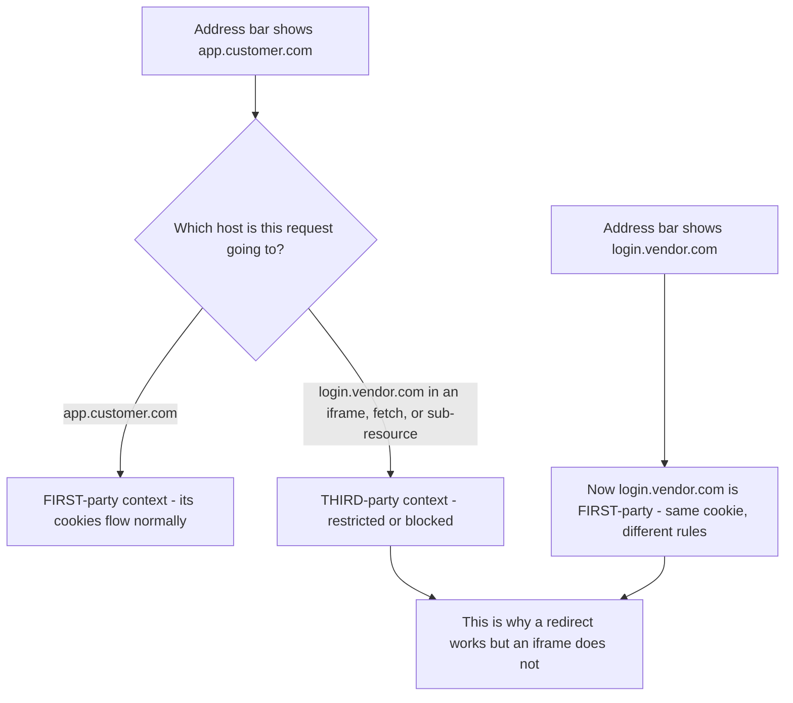
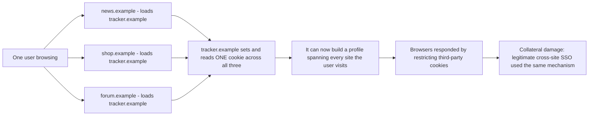
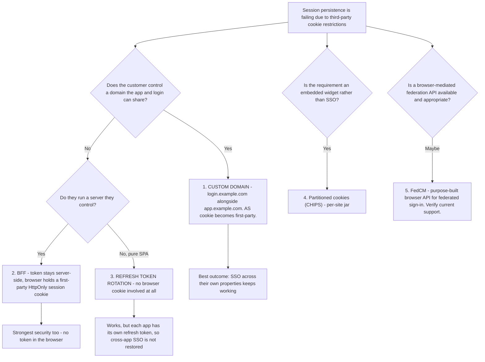
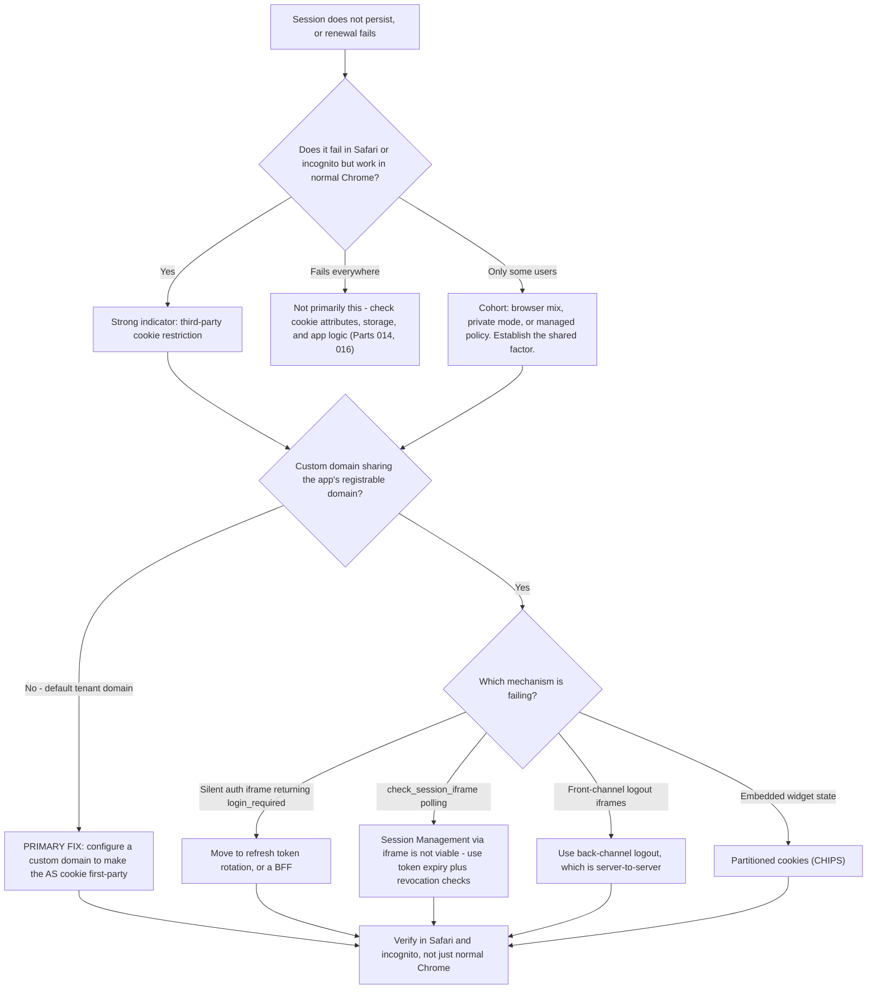

# Part 017 - Third-Party Cookie Deprecation and Its Impact on SSO

> Section goal: Understand the browser change that is actively reshaping single sign-on. A growing share of "logged out unexpectedly", "works in one browser only", and "silent renewal fails" tickets exist entirely because of this shift. Know what breaks, what still works, and which alternatives you can honestly recommend.

Covers index item **017**. Maps to JD signals: *knowledge of HTTP*, *basic security concepts*, *understanding of authentication and authorization concepts*, *promote best practices*, *continuous growth*, and *proactivity — identify opportunities and take preemptive action against potential problems*.

---

## 1. Start From Zero: What "Third-Party" Means

A cookie is **first-party** or **third-party** depending on the *context in which it is used*, not on who set it.

| Situation | The cookie for `login.vendor.com` is |
|---|---|
| You are browsing `login.vendor.com` directly | **First-party** |
| You are on `app.customer.com`, and it loads something from `login.vendor.com` | **Third-party** |

**The same cookie changes classification depending on which site is in the address bar.** That is the single most important sentence in this Part, and it is the source of most confusion.

### 🔍 Plain-English deep-dive: why a redirect works but an iframe does not

This distinction resolves an enormous amount of confusion, and it is worth being able to state cleanly.

- When the browser **redirects** to `login.vendor.com`, that host becomes the **top-level** site. The address bar shows it. Its cookies are **first-party** and flow normally. Single sign-on works.
- When a page on `app.customer.com` loads `login.vendor.com` **inside a hidden iframe**, the address bar still shows `app.customer.com`. The vendor's cookies are now **third-party**, and modern browsers restrict or block them entirely.

So the **same session cookie** that works perfectly during a redirect-based login is unavailable during a silent renewal in an iframe.

**This is why the symptom is so specific:** login works, then the session mysteriously fails to persist. The customer says "login works but users get logged out" and it sounds contradictory. It is not — those are two different cookie contexts.

**Analogy:** showing your membership card at the club's own door versus asking a friend to show it on your behalf at a different building. Same card, and one of those is going to be refused. **Where it stops:** the club would tell your friend why. The browser blocks silently, and the application just sees a failed renewal.

---

## 2. Why Browsers Are Restricting Them

Third-party cookies were the technical foundation of cross-site tracking.

**The crucial point for you:** SSO was never the target. It is **collateral damage**. Single sign-on and cross-site tracking rely on exactly the same browser capability — a cookie readable from a third-party context — and browsers cannot reliably distinguish "an identity provider maintaining a session" from "an ad network building a profile."

That is why the industry response has not been "get an exemption", but "stop depending on third-party cookies at all." Understanding *that* framing is what lets you give a customer a real answer instead of a complaint.

---

## 3. Where Each Browser Stands

> ⚠️ **Currency warning.** This is the fastest-changing area in this entire guide. Chrome's plans in particular have been announced, delayed, and revised more than once. **Verify current behavior in each vendor's own documentation before advising a customer, and never quote a date from memory.**

| Browser | General posture | Practical consequence |
|---|---|---|
| **Safari** | Has blocked third-party cookies by default for years, with additional storage restrictions | The strictest environment. **If it works in Safari, it will work anywhere** |
| **Firefox** | Total Cookie Protection partitions third-party cookies per top-level site by default | Cookies are not deleted but are isolated, so cross-site sharing does not work |
| **Chrome** | Plans have changed repeatedly; user-facing controls and enterprise policies exist, and behavior differs in Incognito | **Test rather than assume.** Incognito behaves more strictly than a normal window |
| **Edge** | Chromium-based, with its own tracking prevention levels | Behavior depends on the configured level |
| **Enterprise-managed browsers** | Administrators may set policies either way | A customer's fleet may behave differently from your test machine |

### The practical testing rule

**Test in Safari, or in a Chromium browser's private/incognito mode with third-party cookies blocked.** That gives you the strict behavior. If a flow survives there, it will survive the industry's direction of travel.

Conversely, if a customer says "it works for us", ask **which browser, which mode, and whether their fleet has a managed policy** — because "works on my machine" here is genuinely uninformative.

> 💡 **Tie-in to your background:** you have handled Microsoft 365 authentication issues where browser behavior and enterprise browser policy mattered. The instinct to ask "which browser, which version, which managed policy?" is already yours. Here it is not a refinement — it is the *primary* discriminator.

---

## 4. What Actually Breaks

| Mechanism | How it worked | Status now |
|---|---|---|
| **Silent authentication in a hidden iframe** | Iframe to `/authorize?prompt=none`; the AS session cookie proves the user is still signed in | **Broken** wherever third-party cookies are blocked |
| **OIDC Session Management (`check_session_iframe`)** | Polls an iframe to detect logout at the IdP | **Broken** for the same reason |
| **Front-channel logout** | Hidden iframes to each relying party's logout URL | **Unreliable** — the iframes may not carry the RP's cookies |
| **Cross-site SSO between unrelated domains** | Shared IdP cookie in a third-party context | **Broken** unless the flow is a top-level redirect |
| **Embedded widgets needing their own session** | Third-party cookie inside the embed | Broken unless partitioned (CHIPS, Part 014) |

### What still works

| Mechanism | Why it survives |
|---|---|
| **Top-level redirect to the authorization server** | The AS becomes first-party during the redirect |
| **First-party cookies on your own domain** | Never affected |
| **Custom domain sharing the app's parent domain** | The AS cookie becomes first-party |
| **Refresh tokens (with rotation)** | No browser cookie involved at all |
| **BFF with a first-party session cookie** | Session is first-party by construction |
| **Server-to-server calls** | No browser, no cookie policy |
| **`Partitioned` cookies for embeds** | Per-site jar, so tracking is impossible and the browser permits it |

### 🔍 Plain-English deep-dive: why silent authentication is the canary

Silent authentication is the mechanism that breaks first and most visibly, so it is worth understanding precisely.

A SPA holds its access token in memory (Part 016). On page reload, memory is cleared. Rather than forcing a full login, the SDK opens a hidden iframe to `/authorize?prompt=none`. If the authorization server still has a valid session cookie for that browser, it immediately returns a new authorization response with no user interaction — the user never notices.

Every step of that depends on the AS session cookie being readable **from a third-party context**. Remove that, and the authorization server sees an unauthenticated request and returns `login_required`.

**The symptom the customer reports:** *"users are logged out every time they refresh the page — but only in Safari"*, or *"only in incognito"*, or *"only for some users."*

**Why "only some users" happens:** browser mix, private-window usage, and enterprise policy differences. That is a *cohort* pattern (Part 009), and the cohort is defined by browser configuration.

**Analogy:** a hotel that verifies you are still a guest by quietly phoning your bank. It worked until banks stopped taking calls from third parties. The hotel is not broken; the verification channel closed. **Where it stops:** the hotel could ask you directly. A silent renewal cannot, by definition — the moment it asks the user anything, it is no longer silent.

---

## 5. The Alternatives, Ranked

This is the practical payoff: what you actually recommend.

| Option | What it fixes | What it costs | When to recommend |
|---|---|---|---|
| **Custom domain** | AS cookie becomes first-party; silent auth and cross-app SSO work again | DNS and certificate setup; must share the registrable domain | **First choice** whenever the customer owns a suitable domain |
| **BFF** | No browser token; first-party session | They must run and operate a server; API calls are proxied; CSRF protection returns | Strong second choice, and best security overall |
| **Refresh token rotation** | Renewal without any cookie | Refresh token lives in the browser; each app is independent, so cross-app SSO is not restored | Good for a standalone SPA |
| **CHIPS / `Partitioned`** | Embedded widgets keep per-site state | Deliberately prevents cross-site sharing — so **not** an SSO fix | Embeds only |
| **Storage Access API** | Lets an embedded frame request access, usually with a user gesture | Requires interaction; support and semantics vary | Niche; verify support |
| **FedCM** | Purpose-built browser API for federated sign-in without third-party cookies | Newer; support and IdP participation vary | Watch closely; verify current status before recommending |

### 🔍 Plain-English deep-dive: FedCM, in plain terms

**FedCM** (Federated Credential Management) is a browser API that asks the *browser itself* to mediate federated sign-in, instead of relying on cookies in a hidden iframe.

The idea: rather than an identity provider quietly checking its own third-party cookie, the browser provides a native, visible account-chooser UI. The user picks an account; the browser passes a token to the site. No third-party cookie required, and the user can see what is happening.

Why it exists: it separates the *legitimate* use (federated sign-in, which the user is aware of and consents to) from the *illegitimate* one (silent cross-site correlation). Browsers can permit the first while blocking the second, which cookies alone made impossible.

**How to talk about it honestly:** it is the direction the platform is heading, browser and IdP support is still evolving, and its behavior differs across implementations. So: *"FedCM is the purpose-built answer and worth tracking, but I'd verify current browser support and vendor support before designing around it. For today, a custom domain or a BFF is the reliable recommendation."*

That answer is current, useful, and does not overclaim — which is exactly the register this Part needs. **Analogy:** the browser becoming an official notary for sign-in, rather than parties passing notes behind its back. **Where it stops:** a notary is universally recognised; FedCM's coverage is not yet universal.

---

## 6. The Support Playbook

When a session-persistence ticket arrives, this is the sequence.

| Step | Question | What it tells you |
|---|---|---|
| 1 | "Which browser, which version, and normal or private mode?" | Identifies whether this is the strict-browser cohort |
| 2 | "Does it fail in Safari or incognito but work in a normal Chrome window?" | Near-confirmation of third-party cookie blocking |
| 3 | "Are you on a custom domain, or the default tenant domain?" | The single highest-value question — determines first- vs third-party |
| 4 | "How does your app restore the session — silent auth, or refresh tokens?" | Identifies the failing mechanism |
| 5 | "Is there a hidden iframe to `/authorize` in the HAR, and what did it return?" | `login_required` on the iframe is the smoking gun |
| 6 | "Do your users have a managed browser policy?" | Enterprise fleets can differ from your test |

**The smoking gun to look for in a HAR:** a request to `/authorize` with `prompt=none`, from an iframe, returning `error=login_required` — while the user is demonstrably still signed in at the identity provider. That combination is essentially diagnostic.

---

## 7. Failure Modes

| Failure mode | What it looks like | Consequence | Correction |
|---|---|---|---|
| **Advising users to enable third-party cookies** | "Ask them to change browser settings" | Not a fix; does not scale; will stop working entirely | Recommend a custom domain, BFF, or refresh rotation |
| **Blaming the customer's code** | Treating it as an application bug | Days lost; relationship damaged | Recognise the browser-cohort signature early |
| **Quoting a deprecation date** | "Chrome is removing them in <month>" | Plans have changed repeatedly; you will be wrong | Describe direction of travel; verify current state |
| **Testing only in a normal Chrome window** | "I can't reproduce it" | Missing the strict behavior entirely | Test in Safari or incognito |
| **Recommending CHIPS for SSO** | Suggesting `Partitioned` as the fix | It deliberately prevents cross-site sharing, so it cannot restore SSO | CHIPS is for embeds |
| **Assuming the custom domain is enough alone** | Custom domain on an unrelated registrable domain | Still cross-site | It must share the eTLD+1 with the app |
| **Overselling FedCM** | Recommending it as the current solution | Support varies; may not be viable for them yet | Present as direction of travel; verify first |
| **Missing the enterprise policy angle** | Only some corporate users affected | Managed browser policy differences | Ask explicitly about managed policy |
| **Treating it as one bug** | One fix attempted for all symptoms | Silent auth, session checks, and front-channel logout each break differently | Identify which mechanism is failing |

---

## 8. Troubleshooting Decision Tree

### Worked example

*"Since we launched, about 30% of our users have to log in again every time they open a new tab. The rest are fine. Nothing in our code differs between them."*

1. **"Only some users" is a cohort signal.** Establish the shared factor.
2. **Ask:** which browsers do the affected users have? Answer: predominantly Safari, plus some Chrome users who browse in private windows.
3. **Cohort identified:** strict third-party cookie environments.
4. **Ask:** custom domain, or default tenant domain? Answer: default tenant domain.
5. **Confirm in the HAR:** a hidden iframe to `/authorize?prompt=none` returning `error=login_required`, while the user is still authenticated at the IdP. **Diagnostic.**
6. **Explain honestly:** this is not their bug. Their app relies on the authorization server's session cookie being readable from a third-party context, and those browsers block it. It will affect a growing share of users over time.
7. **Recommend, in order:** a custom domain on their own registrable domain — the cleanest fix and it preserves SSO across their properties. If that is not possible, refresh token rotation. If they run a server, a BFF is strongest.
8. **What not to say:** "ask users to enable third-party cookies."
9. **Proactive addition:** *"Since this will affect an increasing proportion of your users, it's worth prioritising rather than treating as an edge case."* That is the JD's "proactivity — take preemptive action against potential problems", demonstrated in a sentence.

---

## 9. Lab: Reproduce and Fix the Silent-Auth Failure

**Purpose.** See the failure yourself in a strict browser, and prove that the alternatives work — so your recommendations come from observation.

**Prerequisites.** Part 007's lab tenant, Part 016's local origins, and **two browsers**: one Chromium-based and one Safari or Firefox. **Your own tenant and localhost only.**

**Steps.**

1. Create `okta-prep/labs/017-third-party-cookies/`.
2. **Baseline.** Build (or reuse) a minimal SPA on `http://localhost:3000` that logs in against your lab tenant with Authorization Code + PKCE and holds the token in memory only.
3. **Observe the working case.** In a normal Chromium window with default settings, log in, then reload. Capture the HAR. Find the hidden iframe request to `/authorize` with `prompt=none` and record the response.
4. **Break it.** Repeat in (a) the same browser with third-party cookies blocked in settings, (b) an incognito window, and (c) Safari or Firefox. Record for each: whether the user stayed signed in, and the exact `error` returned by the `prompt=none` request.
5. **Cookie evidence.** In each case, open DevTools → Application → Cookies and record whether the authorization server's session cookie is present and whether it was sent on the iframe request. **Redact the values; keep names and attributes.**
6. **Browser matrix.** Write `browser-matrix.md`: browser × mode × outcome × exact error. This is the artifact you would send a customer.
7. **Fix A — refresh token rotation.** Enable rotating refresh tokens for your lab application and change the SPA to use them for renewal instead of silent auth. Re-run all four browser scenarios. Record which now succeed.
8. **Fix B — first-party session.** Add a minimal BFF: a small Express server on the same origin that performs the code exchange and sets a first-party `HttpOnly` session cookie. Re-run all four scenarios and record the results.
9. **Custom domain (documented, not necessarily executed).** If your free tier permits a custom domain, configure one and re-test. If it does not, write up precisely *why* it would fix the problem — the AS cookie becomes same-site with the app — and label it **learned architecture** rather than lab evidence.
10. **Customer explanation.** Write `customer-explanation.md`: a 200-word explanation you could actually send, covering what is happening, why it is not their bug, the ranked options, and why "enable third-party cookies" is not among them.
11. **Failure catalog + manifest.** Add rows for each browser/mode failure. Complete `MANIFEST.md` with honest limitations.

**Expected evidence.** A four-scenario browser matrix with exact errors, redacted cookie observations, two working fixes re-tested across all scenarios, a documented custom-domain rationale, and a sendable customer explanation.

**Validation rubric.**

| Check | Pass condition |
|---|---|
| Failure reproduced | `login_required` observed on the `prompt=none` iframe in at least two strict environments |
| Cookie evidence | Presence/absence recorded per scenario, values redacted |
| Matrix complete | Browser × mode × outcome × exact error, all four scenarios |
| Fix A verified | Refresh rotation re-tested in every scenario, results recorded |
| Fix B verified | BFF re-tested in every scenario, results recorded |
| Custom domain honest | Either executed, or clearly labelled learned architecture with the reason |
| Customer text | Under 250 words, no jargon, ranked options, and no "enable third-party cookies" |
| Currency noted | Manifest records the date and browser versions tested |

**Cleanup and privacy.** Your own tenant and localhost only. Redact all cookie and token values before saving evidence. Record browser **versions** in the manifest — this behavior changes between releases, so undated evidence is misleading. Revert your browser's cookie settings afterwards.

---

## 10. JD Mapping

| Supplied JD signal | How this Part supports it |
|---|---|
| Knowledge of HTTP | Cookie context, iframes, and the `prompt=none` request are all HTTP-layer mechanics |
| Basic security concepts | §2 explains the privacy rationale and why SSO is collateral damage |
| Understanding of authentication and authorization concepts | §4 shows exactly which authentication mechanisms depend on the cookie context |
| Promote best practices | §5's ranked alternatives, and refusing to recommend the unsafe non-fix |
| **Proactivity — preemptive action against potential problems** | §8's closing recommendation to prioritise before the affected cohort grows |
| Continuous growth | §3's currency warning builds the habit of re-verifying a moving target |
| Resolve issues in a timely fashion | §6's playbook reaches a diagnosis in three questions |
| Business and technical analysis skills | §5's trade-off table converts a technical constraint into an architectural decision |

---

## 11. Candidate Honesty Note

- **Production transfer:** you have handled authentication issues where browser version and enterprise browser policy determined the outcome. The "which browser, which mode, which managed policy" instinct is genuinely yours and is exactly right here.
- **New here:** the specific first-party/third-party context rule, which mechanisms depend on it, and the ranked alternatives.
- **The strongest thing you can say:** *"I reproduced the silent-auth failure across four browser environments and then verified two fixes against all four, so I can tell a customer what will and won't survive rather than guessing."* Very few candidates will have done that.
- **Be explicitly humble about currency.** Say: *"this area changes fast and browser plans have shifted more than once, so I'd verify current behavior before advising a customer rather than quoting a date."* That is accurate and it demonstrates judgement.
- **Never recommend** that users enable third-party cookies. It is not a fix, it does not scale, it will stop working, and suggesting it signals that you do not know the supported alternatives.
- **Do not present FedCM as the current answer.** Present it as direction of travel, and check support first.

---

## 12. Official Source Anchors

Accessed **26 August 2026**. **This Part's currency risk is the highest in the guide — re-verify before any interview or customer conversation.**

| Source | Use it for |
|---|---|
| WebKit blog and Safari documentation on Intelligent Tracking Prevention | Safari's current third-party cookie and storage behavior |
| Mozilla documentation on Total Cookie Protection and Enhanced Tracking Protection | Firefox's partitioning model |
| Chrome developer documentation and the Privacy Sandbox site | Chrome's current position, which has changed more than once |
| Microsoft Edge tracking-prevention documentation | Edge's levels and enterprise policy options |
| MDN — third-party cookies, `Partitioned`, Storage Access API | Cross-browser behavior summaries |
| CHIPS specification | Partitioned cookie semantics |
| W3C FedCM specification and browser documentation | §5's FedCM description; **verify current support** |
| OpenID Connect Session Management, Front-Channel Logout, Back-Channel Logout specifications | Which logout mechanisms depend on third-party cookies (Part 075) |
| Auth0 and Okta documentation on custom domains and browser restrictions | Vendor-specific guidance and the first-party consequence |

**Revalidate before every customer conversation:** browser behavior, deprecation timelines, FedCM support, and vendor guidance.

---

## ⭐ Likely Interview Questions for This Section

### Q1. "Why is third-party cookie deprecation a problem for single sign-on?"
> *Model answer:* "Because SSO and cross-site tracking used the same browser capability, and the browser can't reliably tell them apart. An identity provider maintaining a session cookie readable from a third-party context, and an ad network correlating a user across sites, are technically the same operation. So SSO is collateral damage rather than the target. The critical detail is that first-party versus third-party is about *context*, not about who set the cookie — when the browser redirects to the authorization server, that host is top-level and its cookies are first-party, so login works fine. When a page loads the same host in a hidden iframe for silent renewal, the address bar still shows the app, so those cookies are third-party and get blocked. That's why the symptom sounds contradictory: login works, but the session won't persist."

### Q2. "A customer says users are logged out every refresh, but only in Safari. What's happening?"
> *Model answer:* "That browser pattern is close to diagnostic. The SPA holds its token in memory, so a reload clears it, and the SDK attempts silent authentication in a hidden iframe to `/authorize?prompt=none`. That depends on the authorization server's session cookie being readable from a third-party context, and Safari has blocked that by default for years. So the server sees an unauthenticated request and returns `login_required`. My confirming questions are: does it also fail in Chrome incognito, and are they on a custom domain or the default tenant domain? Then in the HAR I'd look for the `prompt=none` iframe request returning `login_required` while the user is demonstrably still signed in at the IdP — that combination is essentially conclusive. And I'd be clear it isn't their bug, because otherwise they'll spend days looking in their own code."

### Q3. "What would you recommend to fix it?"
> *Model answer:* "In order. First, a custom domain — put the login experience on `login.customer.com` alongside `app.customer.com` so they share a registrable domain and the authorization server's cookie becomes first-party. That's the cleanest fix and it preserves SSO across their own properties. Second, if they run a server, a BFF: the token stays server-side and the browser holds a first-party `HttpOnly` session cookie, which is also the strongest security posture. Third, for a pure SPA with no server, refresh token rotation — no browser cookie is involved at all, though each app then has its own refresh token so cross-app SSO isn't restored. What I would never recommend is telling users to enable third-party cookies. That isn't a fix, it doesn't scale, and it will stop working entirely."

### Q4. "What's FedCM and should customers use it?"
> *Model answer:* "Federated Credential Management — a browser API that has the browser itself mediate federated sign-in, instead of the identity provider quietly checking a third-party cookie in a hidden iframe. The browser shows a native account chooser, the user picks, and a token is passed to the site. The point is that it separates the legitimate case, where the user is aware of and consents to federated sign-in, from the illegitimate one, which is silent cross-site correlation — a distinction cookies alone made impossible. Should customers use it? It's the direction the platform is heading and worth tracking closely, but browser and IdP support is still evolving and behavior differs between implementations. So I'd say verify current support before designing around it, and for today recommend a custom domain or a BFF as the reliable option. I'd rather be honest that it's emerging than have a customer build on it prematurely."

### Q5. "How do you test whether a flow will survive this change?"
> *Model answer:* "Test in the strictest environment available and treat that as the future baseline. Safari has blocked third-party cookies by default for years, so if a flow works there it will very likely survive wherever the industry goes. A Chromium browser's incognito window with third-party cookies blocked is a good second. What I'd avoid is testing only in a normal Chrome window, because that's the most permissive case and 'I can't reproduce it' there is uninformative. I'd also ask the customer which browsers their users actually have and whether their fleet is managed, because enterprise browser policy can go either way and a corporate deployment may behave quite differently from my test machine. And I'd record browser versions in any evidence, because this behavior changes between releases and undated test results are misleading."

### Q6. "Do partitioned cookies solve this?"
> *Model answer:* "They solve a different problem, and it's important not to sell them as an SSO fix. CHIPS gives a third-party cookie a separate jar per top-level site, so an embedded widget from `vendor.com` gets one jar on `siteA.com` and a completely different one on `siteB.com`. Each embedding works, but correlation across sites doesn't — which removes the tracking problem, which is why browsers permit it. But the entire *point* of an authorization server's session cookie is that it's shared across the sites federating to it. That sharing is what single sign-on *is*. Partitioning it deliberately destroys it. So CHIPS is right for embedded widgets and per-site state, and wrong for SSO. For SSO the answers are custom domains, refresh token rotation, and BFF."

### Q7. "How current is your knowledge here?"
> *Model answer:* "I'd flag this as the fastest-moving area I've studied, and I'd rather say that than sound falsely confident. Chrome's plans in particular have been announced, delayed, and revised more than once, so I don't quote dates from memory — I check the vendor's own documentation before advising anyone. What I'm confident about is the durable part: the mechanism, which flows depend on a third-party cookie context, how to reproduce the failure, and which alternatives are architecturally sound regardless of how the timeline moves. Custom domains and BFF don't depend on a browser decision going one way or the other, so recommending them is safe whatever happens next. And I've verified my own understanding by reproducing the failure across four browser environments and testing two fixes against all of them."

### Q8. "A customer says this is your product's bug. How do you handle that?"
> *Model answer:* "I'd agree that it's not their bug either, which usually defuses it, and then be precise about what's actually happening. This is a browser platform change affecting every identity provider equally — it isn't specific to any vendor, and no vendor can opt out, because browsers can't distinguish an IdP session from a tracker. Then I'd move straight to what they can do, because that's what they actually need: here are three supported options, here's the trade-off of each, and here's the one I'd pick for your architecture and why. And I'd add the proactive point — the affected user cohort will grow over time, so this is worth prioritising rather than treating as an edge case affecting a minority of users today. If they still want it escalated as a product issue, I'd capture it as product feedback about defaults and documentation, because 'the default configuration stops working in strict browsers' is legitimate feedback even if the cause is external."

---

## 🧠 30-Second Memory Hooks

- **First-party vs third-party is about CONTEXT, not who set the cookie.** Same cookie, different address bar, different rules.
- **Redirect = the AS is top-level = first-party = works.** **Iframe = the AS is third-party = blocked.**
- **SSO is collateral damage, not the target.** Browsers cannot tell an IdP from a tracker.
- **Silent auth is the canary.** `prompt=none` in an iframe returning `login_required` while the user is signed in = diagnostic.
- **Test in Safari or incognito.** "Works in normal Chrome" is uninformative.
- **"Only some users" = a browser cohort**, not randomness.
- **Fix order:** custom domain → BFF → refresh token rotation.
- **The custom domain must share the app's registrable domain** to be first-party.
- **CHIPS fixes embeds, not SSO.** Partitioning deliberately prevents the sharing SSO needs.
- **FedCM is direction of travel** — verify support, do not oversell.
- **Never say "enable third-party cookies."**
- **Never quote a deprecation date from memory.** Plans have changed repeatedly.

---

## ✅ Completion Checklist

- [ ] **Knowledge:** I can explain why a redirect works while an iframe fails, name three mechanisms that break, and rank the alternatives with their trade-offs.
- [ ] **Lab artifact:** `017-third-party-cookies/` contains a four-scenario browser matrix with exact errors, two verified fixes, and a sendable customer explanation.
- [ ] **Spoken:** I can deliver the "logged out in Safari" diagnosis and the ranked recommendation in under 90 seconds.
- [ ] **Honesty check:** my manifest records browser versions and the test date, and my custom-domain claim is labelled correctly as lab or learned architecture.
- [ ] **Source check:** I have read each browser vendor's own current documentation, not a summary, within the last month.

---

*Next suggested section:* **[Part 018 - REST APIs, JSON, and Contract Thinking](Part-018-rest-apis-json-and-contract-thinking.md)** — the browser layer is complete; next comes the API layer, where tokens are actually spent and where a large share of developer tickets are really about contract misunderstandings.
