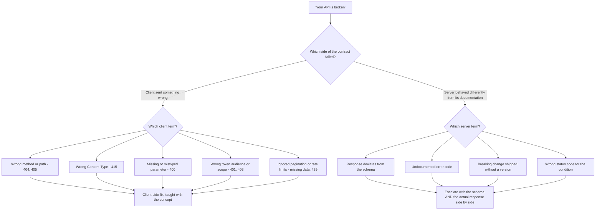
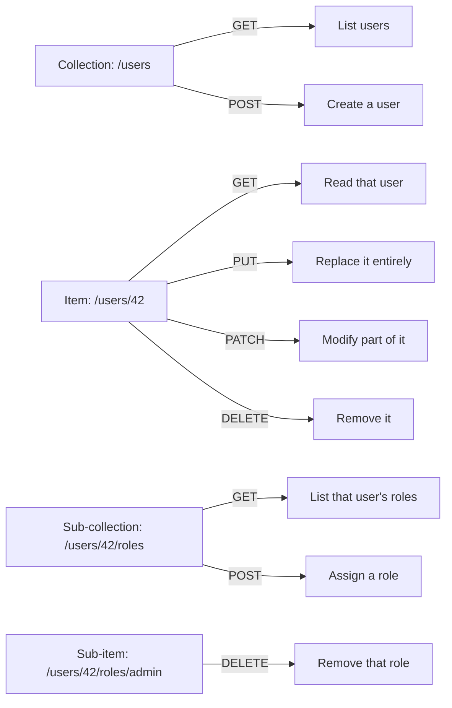
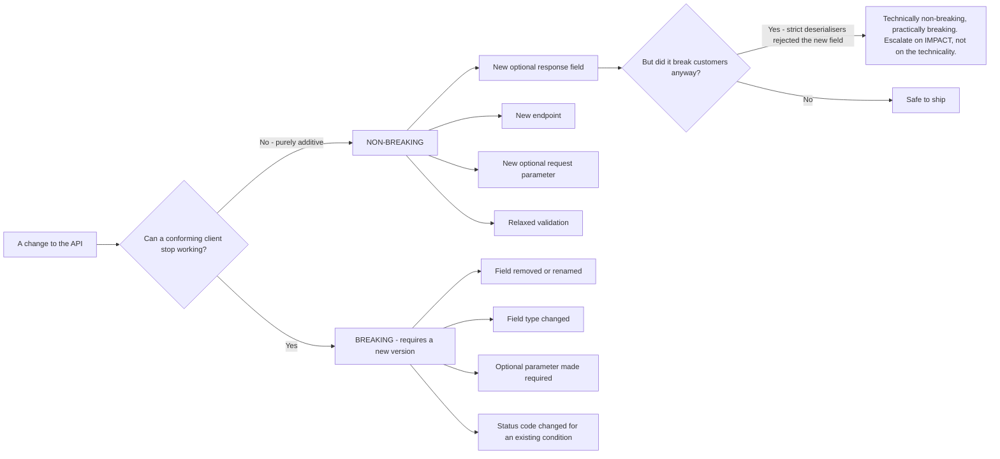
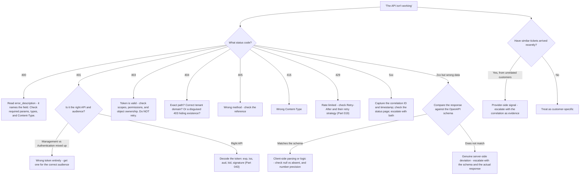

# Part 018 - REST APIs, JSON, and Contract Thinking

> Section goal: Learn to read an API the way a support engineer must — as a *contract* between two parties. Most "the API is broken" tickets are really contract misunderstandings, and the skill that resolves them fastest is being able to say precisely which side violated which term.

Covers index item **018**. Maps to JD signals: *knowledge of software development fundamentals and common architectures*, *knowledge of HTTP*, *business and technical analysis skills*, *promote best practices*, and *strong analytical and problem-solving skills*.

---

## 1. Start From Zero: What an API Is

An **API** (Application Programming Interface) is a way for one program to ask another program to do something, over a defined interface.

A **web API** does this over HTTP. **REST** is a style of designing web APIs around *resources* — nouns you act on — rather than *actions*.

| Style | Looks like | Character |
|---|---|---|
| **RPC-style** | `POST /createUser`, `POST /deleteUser` | Verbs in the URL; the method carries little meaning |
| **REST-style** | `POST /users`, `DELETE /users/42` | Nouns in the URL; the HTTP method carries the meaning |
| **GraphQL** | `POST /graphql` with a query body | One endpoint; the client specifies exactly what it wants |

> **Analogy.** A restaurant. RPC is shouting instructions at the kitchen: "cook a steak", "cancel the steak". REST is a menu of dishes where the *way you ask* — order, change, cancel — is standard for every dish. GraphQL is telling the kitchen precisely which components you want on the plate.
>
> **Where it stops:** a kitchen improvises. An API does exactly and only what the contract says, and treats anything unexpected as an error.

### 🔍 Plain-English deep-dive: an API is a contract, and that framing solves tickets

This is the central idea of the Part, so state it precisely.

An API contract has terms on both sides:

| The **client** promises | The **server** promises |
|---|---|
| To send the documented URL and method | To behave as documented for valid input |
| To send required parameters, correctly typed | To return the documented shape |
| To send the documented `Content-Type` | To use documented status codes |
| To authenticate as documented | To return documented error codes |
| To respect rate limits and retry correctly | To version changes rather than break silently |
| To tolerate unknown fields being added | To not remove or retype fields without a version change |

**Almost every "your API is broken" ticket is one party breaking one of those terms.** So the diagnostic question is not "what went wrong" but **"which term was violated, and by whom?"**



That reframing does three useful things: it is fast, it is neutral (nobody is being blamed — a term was violated), and it produces an answer the developer can act on. **Analogy:** a contract dispute where the fastest route to resolution is finding the clause, not arguing about intent. **Where it stops:** contracts are negotiated between equals; here the server's documentation is the contract, and the client does not get to redefine it.

---

## 2. Resources, Methods, and URL Design



| Pattern | Meaning | Identity example |
|---|---|---|
| `/users` | The collection | List or create users |
| `/users/{id}` | One item | Read, replace, patch, or delete a user |
| `/users/{id}/roles` | A sub-collection | Roles held by that user |
| `/connections` | Another collection | Configured identity sources |
| `/clients/{id}` | One application | Application configuration |
| `/logs?q=...` | A filtered collection | Tenant log search |

### PUT versus PATCH — the distinction that causes data loss

| | PUT | PATCH |
|---|---|---|
| Semantics | **Replace the whole resource** | **Modify the specified parts** |
| Omitted fields | Typically **removed or reset** | Left unchanged |
| Idempotent | Yes | Not necessarily |
| Risk | **Sending a partial object wipes the rest** | Lower |

**The classic ticket:** a developer reads a user, changes one field, and `PUT`s back only that field. Everything else on the profile is erased. They report it as "the API deleted our user data." It did exactly what `PUT` means.

**How to explain it without blame:** *"`PUT` replaces the resource; `PATCH` modifies it. Your request sent only `email`, so the server replaced the whole object with one containing just `email` — that's the documented behavior of `PUT`. For a partial update, use `PATCH`, or read-modify-write the complete object."* Then, because you are a good support engineer: *"and do you have backups or an export from before this change?"*

---

## 3. JSON, Precisely

**JSON** (JavaScript Object Notation) is the standard payload format.

```json
{
  "user_id": "auth0|abc123",
  "email": "user@example.com",
  "email_verified": true,
  "logins_count": 47,
  "last_login": "2026-08-26T09:14:22.531Z",
  "app_metadata": { "plan": "pro", "seats": 5 },
  "identities": [
    { "provider": "auth0", "connection": "Username-Password-Authentication", "isSocial": false }
  ],
  "nickname": null
}
```

| Type | Example | Trap |
|---|---|---|
| String | `"abc"` | Must be double-quoted; single quotes are invalid JSON |
| Number | `47`, `1.5` | **No integer/float distinction** — large IDs lose precision (see below) |
| Boolean | `true` | Lowercase only; `"true"` is a *string*, which is a different thing |
| Null | `null` | **Different from absent.** See below |
| Array | `[1,2,3]` | Order is significant |
| Object | `{"a":1}` | Key order is **not** significant |

### 🔍 Plain-English deep-dive: three JSON traps that produce real tickets

**1. `null` versus absent.** These are genuinely different and APIs treat them differently:

| Payload | Usual meaning in a PATCH |
|---|---|
| `{"nickname": "sam"}` | Set it to "sam" |
| `{"nickname": null}` | **Clear it** |
| `{}` (field absent) | **Leave it alone** |

A client that serialises absent fields as `null` will silently clear data on every update. The symptom — "fields keep getting wiped" — looks like a server bug and is a serialisation setting.

**2. Number precision.** JSON has one number type, and JavaScript parses all numbers as 64-bit floats. Integers above roughly 9 quadrillion lose precision silently. Identifiers beyond that range get *rounded*, so `1234567890123456789` becomes something subtly different and lookups fail for a small subset of records. **This is why well-designed APIs return identifiers as strings.** If a customer reports "some IDs don't work", check whether they are numeric and large.

**3. Booleans as strings.** `"true"` is a non-empty string, and in JavaScript every non-empty string is truthy — including `"false"`. So a client that receives `"false"` and writes `if (value)` gets the opposite of the intended behavior. The symptom is an inverted feature flag or an unverified email being treated as verified.

**Analogy:** a form where leaving a box blank, writing "none", and not printing the box at all are three different instructions to the clerk. **Where it stops:** a clerk would ask. Software silently picks one interpretation and proceeds.

---

## 4. Schemas, Documentation, and Versioning

### OpenAPI

**OpenAPI** (formerly Swagger) is a machine-readable description of an API: endpoints, parameters, request and response shapes, and error codes. It is the written form of the contract.

**Why it matters to you:** when a developer says "the API returns the wrong thing", the OpenAPI document is the objective referee. Comparing the actual response against the schema converts an argument into a factual finding — and that finding is either a client bug or a genuine defect worth escalating.

### Versioning strategies

| Strategy | Example | Trade-off |
|---|---|---|
| **URL path** | `/api/v2/users` | Explicit and obvious; two code paths to maintain |
| **Header** | `Accept: application/vnd.api+json; version=2` | Clean URLs; easy to forget and get a default |
| **Query parameter** | `/api/users?version=2` | Simple; easy to omit accidentally |
| **Date-based** | `Api-Version: 2026-08-01` | Fine-grained; the client pins a date |



### Breaking versus non-breaking changes

| Non-breaking (safe to ship) | Breaking (requires a version) |
|---|---|
| Adding a new optional field to a response | Removing a field |
| Adding a new endpoint | Renaming a field |
| Adding a new optional request parameter | Changing a field's type |
| Adding a new enum value *(usually)* | Making an optional parameter required |
| Relaxing a validation rule | Tightening a validation rule |
| | Changing a status code for an existing condition |

### 🔍 Plain-English deep-dive: the tolerant reader principle

The single most valuable piece of API advice you can give a customer:

> **Ignore fields you do not recognise. Do not fail because something new appeared.**

This is sometimes called the **tolerant reader** or **robustness** principle. A client that validates responses strictly — rejecting any unknown field — will break the moment the server adds anything, even though adding an optional field is explicitly non-breaking.

The failure signature is distinctive: **"it broke and we changed nothing"**, across many customers at once, immediately after a provider release. The provider did nothing wrong; the client's strict deserialisation did.

**Concretely, advise customers to:**
- Configure their JSON deserialiser to ignore unknown properties.
- Not assume an enum is closed — handle unexpected values gracefully.
- Not assume field ordering.
- Not assume a field's absence means anything unless documented.

**Analogy:** a form-reader that rejects the whole form because a new optional box was added at the bottom. **Where it stops:** strictness *is* correct on the request side — a server should validate input rigorously. The asymmetry is deliberate: be strict in what you send, tolerant in what you accept.

---

## 5. Reading an API Reference Like a Support Engineer

When you open documentation for an endpoint, extract these in order:

| # | Question | Why it matters first |
|---|---|---|
| 1 | Method and exact path | Wrong method → 405; wrong path → 404 |
| 2 | Required `Content-Type` | Wrong type → 415 or a confusing 400 |
| 3 | Authentication: which token, which audience, which scopes | The largest single source of 401/403 |
| 4 | Required versus optional parameters | Missing required → 400 |
| 5 | Response shape on success | What the client should parse |
| 6 | **Documented error codes** | The map from symptom to cause |
| 7 | Rate limits | Whether 429 is expected under their load |
| 8 | Pagination style | Whether they are silently getting only page one |
| 9 | Idempotency support | Whether retries are safe |
| 10 | Version and deprecation status | Whether they are on a path that will stop working |

**Point 3 deserves emphasis in identity APIs specifically.** Management APIs and Authentication APIs are usually different APIs with different tokens, different audiences, and different scopes (Part 106). A developer using the wrong token gets a 401 that looks like an authentication problem and is really an audience problem.

---

## 6. Common Contract Violations

### By the client

| Violation | Symptom | Fix |
|---|---|---|
| Wrong `Content-Type` | 415, or 400 with a parse error | Send what the endpoint documents |
| Missing required parameter | 400 with a field-specific message | Read `error_description` |
| Wrong token audience | 401 despite a valid token | Request a token for the right API |
| Insufficient scope | 403 | Grant the scope; do not retry (Part 012) |
| `PUT` with a partial object | Data loss | Use `PATCH`, or read-modify-write |
| Strict deserialisation | Breaks when a field is added | Tolerant reader |
| Ignoring pagination | "Only 50 records exist" | Follow the pagination contract |
| Retrying non-idempotent calls | Duplicate resources | Use idempotency keys |
| Hammering without backoff | 429 storms | Exponential backoff with jitter (Part 019) |
| Assuming numeric IDs are safe | Some records unreachable | Treat IDs as opaque strings |

### By the server

| Violation | Symptom | Your action |
|---|---|---|
| Response does not match the schema | Client parse failure | Compare against OpenAPI; escalate with both |
| Undocumented error code | Client cannot handle it | Document it, or escalate as a docs defect |
| Breaking change without a version | Many customers break simultaneously | **Escalate immediately** — the pattern is the evidence |
| Inconsistent behavior between endpoints | Confusing developer experience | Product feedback |
| Wrong status code | Client retries when it should not | Escalate — this causes real downstream harm |

### 🔍 Plain-English deep-dive: the "many customers at once" signal

A single customer reporting a break is usually a client-side problem.

**Several unrelated customers reporting the same break within the same window is a provider-side signal**, and it is one of the most valuable patterns a support engineer can recognise. It usually means one of:

- A release changed behavior that someone believed was non-breaking.
- A field was removed, renamed, or retyped.
- A status code changed for an existing condition.
- An infrastructure or configuration change altered timing or limits.

**Why this matters for the JD:** it asks you to *"detect recurring support patterns"* and *"influence product improvements."* Noticing that three tickets in two hours share a signature — and escalating with that correlation as the evidence — is a materially different contribution from resolving three tickets individually.

**The practical habit:** before starting a deep investigation, glance at whether anything similar has arrived recently. Thirty seconds, occasionally enormous payoff. **Analogy:** three unrelated households reporting no water in the same hour. Nobody needs to inspect three sets of pipes. **Where it stops:** correlation is a hypothesis, not proof — you still need the evidence packet.

---

## 7. Failure Modes

| Failure mode | What it looks like | Consequence | Correction |
|---|---|---|---|
| **Not reading the error body** | "It returns 400" | The body named the field | Always read `error`/`error_description` |
| **Treating `null` as absent** | Fields silently cleared | Data loss | Configure serialisation; understand the API's semantics |
| **`PUT` for partial updates** | Profile wiped | Data loss | `PATCH` or read-modify-write |
| **Strict deserialisation** | Breaks on any additive change | Recurring outages | Tolerant reader |
| **Wrong API entirely** | 401 on a valid token | Wasted cycles | Management vs Authentication API, and the audience |
| **Ignoring pagination** | "Data is missing" | Wrong business decisions downstream | Follow pagination to completion |
| **Numeric ID precision loss** | A subset of records unreachable | Baffling partial failure | Treat IDs as opaque strings |
| **No correlation check** | Investigating a provider-wide issue solo | Slow, and the pattern is missed | Check for similar recent tickets first |
| **Trusting an example over the reference** | Copying a blog snippet | Outdated parameters | Official reference is the contract |
| **Assuming enums are closed** | Crash on a new value | Breaks on a non-breaking change | Handle unknown values gracefully |

---

## 8. Troubleshooting Decision Tree: "The API Isn't Working"



### Worked example

*"Your API deleted all our user metadata. We only updated the email address."*

1. **Serious claim — establish the facts before reassuring or defending.**
2. **Which method?** Ask for the exact request. Answer: `PUT /api/v2/users/{id}` with body `{"email": "new@example.com"}`.
3. **The contract:** `PUT` replaces the resource. The request sent an object containing only `email`, so the server replaced the user object with one containing only `email`. **The API did exactly what `PUT` means.**
4. **Explain without blame:** *"`PUT` replaces; `PATCH` modifies. Your request contained only `email`, so the stored object was replaced with just that field — that's the documented behavior. For partial updates, use `PATCH`, or read the full object, modify it, and `PUT` the complete result."*
5. **Then be a good support engineer:** *"More urgently — do you have a recent user export, or is this within a window where the data can be recovered? Let's deal with recovery first and the code change second."*
6. **Prevention:** point at the reference section, suggest they audit for other `PUT` calls with partial bodies, and recommend an integration test that asserts unrelated fields survive an update.
7. **Product feedback if warranted:** if the documentation does not make the destructive nature of `PUT` prominent, that is legitimate feedback — and if several customers have hit it, that is a documentation defect worth raising.

Note the ordering: facts, then contract, then blameless explanation, then **recovery before correctness**, then prevention. Leading with "you used the wrong method" would be accurate and would damage the relationship at exactly the wrong moment.

---

## 9. Lab: Read, Use, and Break an API Contract

**Purpose.** Build contract-reading fluency against a real API, and generate the contract violations yourself.

**Prerequisites.** Part 007's lab tenant, `curl`, `jq`, a text editor. **Your own tenant only.**

**Steps.**

1. Create `okta-prep/labs/018-rest-api/`.
2. **Contract extraction.** Pick one Management API endpoint for your tenant (user retrieval is ideal). From the official reference, fill in the ten-point table from §5. Save as `contract-extract.md`. Note anything the documentation does not answer.
3. **Obtain the right token.** Get a management token via client credentials for the correct audience. **Note explicitly** how this differs from a user access token — this is Part 106 previewed, and it is worth writing down now.
4. **Happy path.** Create a synthetic user, read it back, and save the response. Annotate every field with its type and whether the documentation lists it.
5. **Break it, ten ways.** Record the exact status and body for each:
   - a. Wrong method (GET where POST is required)
   - b. Wrong `Content-Type` (JSON where form is required, or vice versa)
   - c. Missing a required parameter
   - d. Wrong type for a parameter (string where a boolean is expected)
   - e. No `Authorization` header
   - f. A user access token instead of a management token (**wrong audience**)
   - g. A management token missing the required scope
   - h. A non-existent resource ID
   - i. A malformed ID
   - j. Invalid JSON (a trailing comma)
6. **The `PUT` trap — on a throwaway synthetic user.** Create a user with several metadata fields. `PATCH` one field and confirm the others survive. Then, on a **second** throwaway user, `PUT` a partial object and observe what happens to the rest. **Record it.** This is the §8 worked example, reproduced safely.
7. **`null` versus absent.** On another throwaway user, `PATCH` with a field set to `null`, then `PATCH` with the field absent. Record the different outcomes.
8. **Number precision.** In a Node REPL, evaluate `JSON.parse('{"id":1234567890123456789}')` and compare the result to the input. Record the loss. Write one line on why identifiers should be strings.
9. **Tolerant reader demo.** Write a small parser that reads your saved user response strictly (failing on unknown fields), then add a field to the saved JSON and observe the failure. Then make it tolerant and observe it survive. **This is the "we changed nothing" outage, reproduced.**
10. **Error reference.** Write `api-errors.md`: each of the ten failures with status, verbatim body, cause, and fix.
11. **Failure catalog + manifest.** Add all rows. Complete `MANIFEST.md` with honest limitations.

**Expected evidence.** A ten-point contract extract, an annotated happy-path response, ten verbatim error responses, a reproduced `PUT` data-loss case on a throwaway user, a `null`-versus-absent comparison, a number-precision observation, and a strict-versus-tolerant parser demonstration.

**Validation rubric.**

| Check | Pass condition |
|---|---|
| Contract extract complete | All ten points, with gaps in the documentation noted |
| Audience difference noted | You wrote down how the management token differs from a user token |
| Ten errors captured | Verbatim bodies, not paraphrases |
| Wrong-audience 401 seen | Reproduced deliberately and distinguished from an expired-token 401 |
| `PUT` trap reproduced | On a throwaway synthetic user, with before/after recorded |
| `null` vs absent | Both outcomes recorded and different |
| Precision loss shown | Input and parsed output both recorded |
| Tolerant reader proven | Strict parser fails, tolerant parser survives, both captured |

**Cleanup and privacy.** Synthetic users only, in your own lab tenant — never a real person's data, and never anything from your employer. The `PUT` destructive test must be run on a **throwaway user created for the purpose**. Redact the management token everywhere; it is a high-value credential (Part 006). Delete the synthetic users when the lab is complete.

---

## 10. JD Mapping

| Supplied JD signal | How this Part supports it |
|---|---|
| Knowledge of software development fundamentals | §§2–4 cover REST design, JSON semantics, schemas, and versioning |
| Knowledge of HTTP | Methods, status codes, and content negotiation applied to real API contracts |
| Business and technical analysis skills | §1's contract framing turns "it's broken" into "which term, by whom" |
| Promote best practices | Tolerant reader, `PATCH` over partial `PUT`, string identifiers, idempotency |
| Strong analytical and problem-solving skills | §8's tree routes every status code to a specific next action |
| **Detect recurring support patterns** | §6's "many customers at once" signal and the thirty-second correlation habit |
| **Influence product improvements** | Documentation and schema deviations captured as legitimate defects |
| Customer-obsessed attitude | §8's ordering: recovery before correctness when data is at risk |

---

## 11. Candidate Honesty Note

- **Production transfer:** your CV lists API and web service fundamentals, and you have worked with REST APIs, Postman, and JSON in a support context. Reading documentation and comparing it against observed behavior is genuinely existing skill.
- **New here:** the contract framing stated explicitly, the JSON traps, tolerant-reader reasoning, and identity-specific API separation (Management versus Authentication).
- **The strongest thing you can say:** *"I reproduced the `PUT` partial-update data loss on a throwaway user in my own tenant, so when a customer reports 'your API deleted our data' I know exactly what to ask and how to explain it without blaming them — and I know to deal with recovery before correctness."* That combines technical accuracy with support judgement, which is what the role is.
- **The pattern-recognition point is worth raising unprompted:** several unrelated customers reporting the same break in a short window is a provider-side signal, and escalating with that correlation is a different level of contribution from closing three tickets.
- **Do not claim** to have designed or built production APIs. You read, diagnose, and reason about contracts — which is the role.

---

## 12. Official Source Anchors

Accessed **26 August 2026**.

| Source | What it defines |
|---|---|
| IETF RFC 9110 | HTTP method semantics, including the `PUT` replacement rule in §2 |
| IETF RFC 8259 (JSON) | JSON data types, and the number-precision interoperability warning in §3 |
| IETF RFC 7396 (JSON Merge Patch) | `null`-means-delete semantics used by many PATCH implementations |
| IETF RFC 6902 (JSON Patch) | The explicit-operations alternative to merge patch |
| OpenAPI Specification | The machine-readable contract format in §4 |
| IETF RFC 9457 (Problem Details for HTTP APIs) | A standard error-body shape worth recognising |
| Auth0 Management API and Authentication API references | The two-API separation, audiences, scopes, and error bodies used in §9 |
| Okta API documentation and rate-limit references | Equivalent structure on the Okta side |
| Postel's robustness principle, and modern critiques of it | The tolerant-reader discussion in §4, including its limits |

**Revalidate after 26 August 2026:** vendor endpoint paths, scopes, and error bodies. The HTTP and JSON standards are stable.

---

## ⭐ Likely Interview Questions for This Section

### Q1. "A customer says your API deleted their user data. How do you respond?"
> *Model answer:* "Facts first, and recovery before correctness. I'd ask for the exact request — method, path, headers, and body. Very often the answer is `PUT` with a partial object: they read the user, changed the email, and sent back only `{\"email\": ...}`. `PUT` means replace the resource, so the server replaced the whole object with one containing just that field. The API did exactly what `PUT` means. But I wouldn't lead with that, because they're in a data-loss situation and being told they used the wrong method isn't what they need first. So: 'let's deal with recovery — do you have a recent export, or is this within a recoverable window?' Then the explanation, blamelessly: `PUT` replaces, `PATCH` modifies, here's the reference. Then prevention — audit their other `PUT` calls, and add an integration test asserting unrelated fields survive an update. And if the documentation doesn't make the destructive nature prominent, that's legitimate product feedback."

### Q2. "What's the difference between `PUT` and `PATCH`?"
> *Model answer:* "`PUT` replaces the entire resource with what you send; `PATCH` modifies only the parts you specify. So with `PUT`, any field you omit is typically removed or reset — which is why sending a partial object is destructive. `PUT` is idempotent, `PATCH` generally isn't. The practical rule I'd give a developer is: use `PATCH` for partial updates, and if you must use `PUT`, do a full read-modify-write so you're sending the complete object. There's a related subtlety with `PATCH` — in JSON Merge Patch semantics, sending a field as `null` means *delete that field*, whereas omitting it means *leave it alone*. So a client whose serialiser writes absent fields as `null` will silently clear data on every update, and that presents as 'fields keep getting wiped' which looks like a server bug and is a serialisation setting."

### Q3. "Several unrelated customers report the same failure within an hour. What do you do?"
> *Model answer:* "Treat it as a provider-side signal immediately, because that pattern is much stronger evidence than any single ticket. One customer reporting a break is usually client-side; several unrelated customers in a short window usually means a release changed behavior someone believed was non-breaking — a field removed or retyped, a status code changed for an existing condition, or an infrastructure change altering timing or limits. So I'd correlate first: gather the common signature across the tickets, check the release timeline and the status page, and escalate with the correlation itself as the evidence rather than escalating three tickets separately. That's a materially different contribution — it can turn three individual investigations into one rollback. It's also why I check for similar recent tickets before starting a deep investigation; it's thirty seconds and occasionally saves a day."

### Q4. "What's the tolerant reader principle and why does it matter?"
> *Model answer:* "Be strict in what you send, tolerant in what you accept — specifically, ignore response fields you don't recognise rather than failing on them. It matters because adding an optional field to a response is explicitly a non-breaking change, so providers do it routinely. But a client with strict deserialisation, rejecting unknown properties, will break the moment anything is added. The failure signature is distinctive: 'it broke and we changed nothing', reported by many customers simultaneously right after a provider release. The provider did nothing wrong and neither did the customer's own code — the deserialiser configuration did. So I'd advise: configure the JSON deserialiser to ignore unknown properties, don't assume enums are closed, don't assume field ordering, and handle unexpected values gracefully. The asymmetry is deliberate, though — strictness *is* correct on the request side, where a server should validate rigorously."

### Q5. "A customer says some record IDs work and others don't. What's your hypothesis?"
> *Model answer:* "If the IDs are large numbers, JSON number precision. JSON has a single number type, and JavaScript parses all numbers as 64-bit floats, so integers above roughly nine quadrillion lose precision silently — the value gets rounded to a nearby representable number and the lookup fails. It only affects IDs above that threshold, which is exactly the 'some work, some don't' pattern with no obvious logic to it. I'd confirm by having them log the raw response text alongside the parsed value and compare. The fix on their side is to parse those fields as strings, and the broader lesson is that identifiers should be treated as opaque strings by both sides — which is why well-designed APIs return them as strings in the first place. If it isn't a numeric-precision issue, I'd look at encoding: an ID containing a character that needs escaping in a URL path is the other common cause of a partial cohort failing."

### Q6. "How do you approach an API reference you've never read before?"
> *Model answer:* "Ten points, in a fixed order, because that order matches how things fail. Method and exact path. Required `Content-Type`. Authentication — which token, which audience, which scopes, and that's the big one for identity APIs because Management and Authentication are usually separate APIs with different tokens. Required versus optional parameters. Success response shape. Documented error codes, which are effectively the symptom-to-cause map. Rate limits. Pagination style. Idempotency support. And version and deprecation status. I write those into a template rather than reading the page linearly, because it forces me to notice what the documentation *doesn't* answer — and those gaps are frequently where the ticket is, and they're legitimate documentation feedback."

### Q7. "How do you tell whether a bug is in the client or the server?"
> *Model answer:* "The schema is the referee. If the API has an OpenAPI document, I compare the actual response against it — that converts an argument into a factual finding. If the response matches the schema, the problem is client-side parsing or logic, and I'd look at `null` versus absent handling, number precision, strict deserialisation, and pagination. If the response deviates from the schema, that's a genuine server-side defect and I escalate with both artifacts side by side, which makes it very hard to bounce at triage. Where there's no schema, I fall back to the documented behavior plus a minimal reproduction, and I'd also note the missing schema as feedback. And I'd always check the correlation question in parallel — is this one customer or several — because that shifts the prior substantially before I've analysed anything."

### Q8. "What makes an API change breaking?"
> *Model answer:* "Anything that can cause a conforming client to stop working. Removing a field, renaming one, changing its type, making an optional parameter required, tightening validation, or changing the status code returned for an existing condition. Non-breaking is additive: a new optional response field, a new endpoint, a new optional request parameter, relaxed validation. The interesting grey area is adding an enum value — it's technically non-breaking, but it breaks clients that assumed the enum was closed and did exhaustive matching, which is why the tolerant reader advice matters. From a support perspective, the key skill is recognising when a supposedly non-breaking change has broken people in practice, because that arrives as multiple simultaneous 'we changed nothing' reports. Whether it's *technically* breaking is less important than whether it *broke customers* — and that distinction is worth making explicitly when escalating, so it isn't dismissed on a technicality."

---

## 🧠 30-Second Memory Hooks

- **An API is a contract.** The question is never "what broke" but **"which term was violated, by whom?"**
- **`PUT` replaces. `PATCH` modifies.** A partial `PUT` is a data-loss event.
- **`null` ≠ absent.** In merge-patch semantics: `null` deletes, absent leaves alone.
- **JSON has one number type.** Large integer IDs lose precision silently → **IDs should be strings.**
- **`"false"` is a truthy string.** Booleans as strings invert logic.
- **Tolerant reader:** strict in what you send, tolerant in what you accept. Ignore unknown fields.
- **"We changed nothing" + many customers at once = a provider-side signal.** Correlate before investigating.
- **Ten-point contract extract:** method · content-type · auth+audience+scopes · params · response · errors · limits · pagination · idempotency · version.
- **Management API ≠ Authentication API.** Different token, different audience. A wrong-audience 401 looks like an auth failure.
- **When data is lost: recovery first, correctness second.**

---

## ✅ Completion Checklist

- [ ] **Knowledge:** I can state the `PUT`/`PATCH` distinction, the `null`-versus-absent rule, and why large numeric IDs fail.
- [ ] **Lab artifact:** `018-rest-api/` contains a ten-point contract extract, ten verbatim errors, a reproduced `PUT` data-loss case, and a strict-versus-tolerant parser demo.
- [ ] **Spoken:** I can deliver the "your API deleted our data" response — recovery first, then contract, blamelessly — in under 90 seconds.
- [ ] **Honesty check:** all lab users were synthetic and throwaway; the management token is redacted everywhere.
- [ ] **Source check:** I have read RFC 9110's `PUT` definition and RFC 8259's number-interoperability note myself.

---

*Next suggested section:* **[Part 019 - API Authentication, Rate Limits, Pagination, Retries, Idempotency](Part-019-api-authentication-rate-limits-pagination-retries-idempotency.md)** — the operational half of API work, where most production incidents in integrations actually originate.
