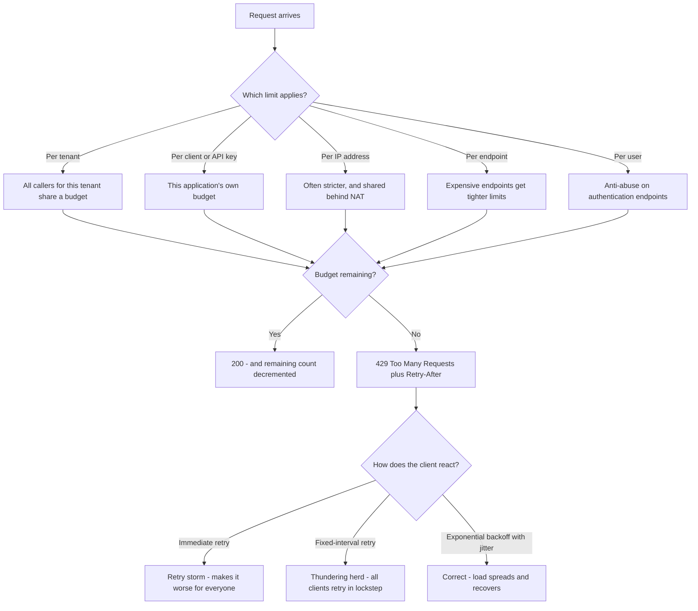
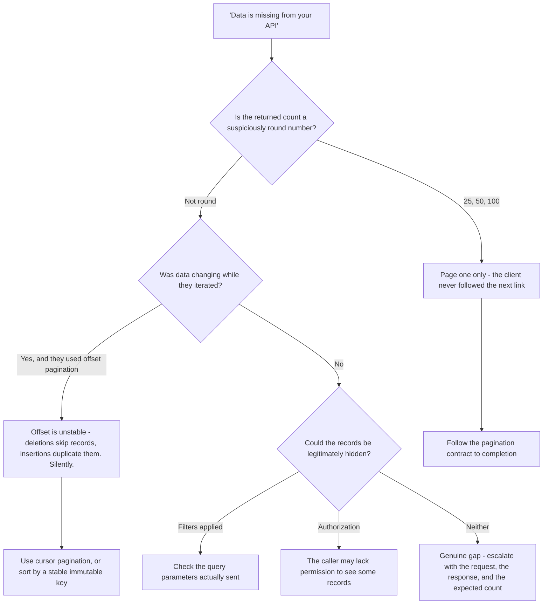
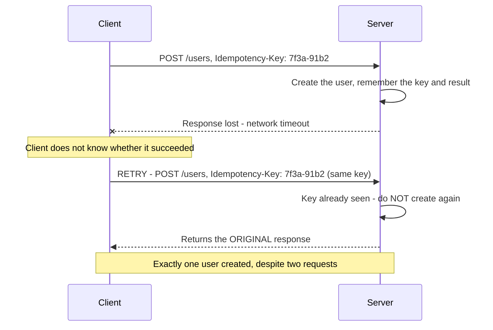
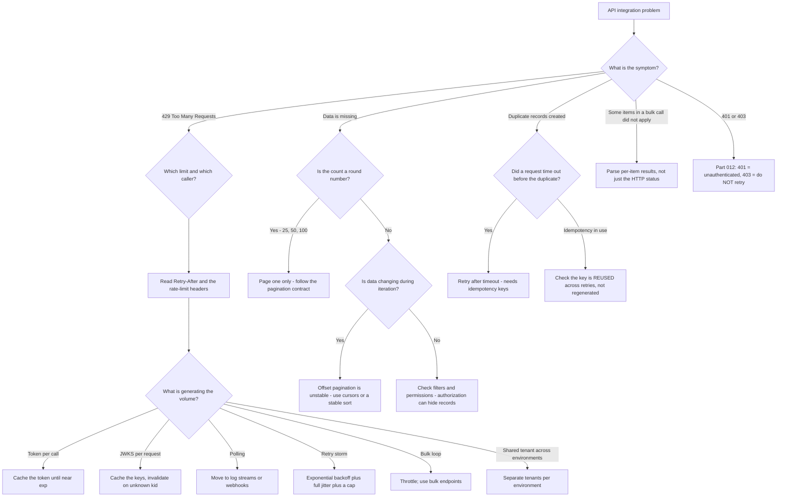

# Part 019 - API Authentication, Rate Limits, Pagination, Retries, Idempotency

> Section goal: Master the operational half of API work — the mechanics that decide whether an integration survives production. Most integration incidents are not logic bugs; they are rate-limit storms, broken retries, duplicated writes, and silently truncated data. This Part teaches you to spot all four from evidence.

Covers index item **019**. Maps to JD signals: *knowledge of HTTP*, *knowledge of software development fundamentals and common architectures*, *strong analytical and problem-solving skills*, *promote best practices*, and *proactivity — take preemptive action against potential problems*.

---

## 1. Start From Zero: How an API Knows Who Is Calling

| Method | How it works | Strength | Where you meet it |
|---|---|---|---|
| **API key** | A long secret string in a header or query parameter | Weak — a single shared secret, rarely rotated, often leaked | Legacy and simple services |
| **HTTP Basic** | `Authorization: Basic base64(user:pass)` | Weak — **encoding is not encryption** | Some token endpoints for client authentication |
| **Bearer token** | `Authorization: Bearer <token>` | Good — scoped, expiring, revocable | The dominant pattern; OAuth access tokens |
| **Private key JWT** | The client signs an assertion with its own private key | Strong — the secret never travels | Confidential clients avoiding shared secrets |
| **Mutual TLS** | The client presents a certificate during the TLS handshake | Strong — bound to the connection | High-assurance and regulated environments |
| **HMAC request signing** | The client signs the request body and headers | Strong — protects integrity, not just identity | Webhooks, some cloud APIs |
| **DPoP** | A proof JWT binds the token to a client key | Strong — a stolen token is unusable | Emerging (Part 068) |

### 🔍 Plain-English deep-dive: why "bearer" is the important word

A **bearer** token is like cash: **whoever holds it may spend it.** The API does not check that you are the party it was issued to — only that the token is valid.

Everything about bearer-token handling follows from this one property:

| Because it is a bearer token… | The consequence |
|---|---|
| Anyone who obtains it can use it | It must only ever travel over TLS |
| There is no proof of possession | Lifetimes must be short |
| Theft is undetectable | You need audit logs and revocation |
| It works from anywhere | Sender-constraining (DPoP, mTLS) exists to fix exactly this |
| It sits in headers and logs | Redaction discipline matters (Part 006) |

**The practical support consequence:** when a customer asks *"can we make our access tokens last 30 days so we stop dealing with renewals?"*, the answer is not just "no". It is: *"an access token is bearer cash — a 30-day one is a 30-day window of undetectable, unrevocable access if it ever leaks. What you want is refresh tokens with rotation, which gives you long-lived sessions and short-lived credentials."* That reframing answers the real requirement (Part 004's X-Y question) while refusing the dangerous mechanism.

**Analogy:** a hotel key card versus a signed letter of authority. The card works for anyone holding it; the letter names you and can be checked against ID. Bearer tokens are cards. **Where it stops:** a lost card can be cancelled at reception instantly. A stateless bearer token often cannot be cancelled at all before it expires (Part 045).

### Where the credential goes

| Placement | Verdict |
|---|---|
| `Authorization` header | ✅ Correct. Not logged by default, not in history |
| Custom header | ⚠️ Acceptable if documented, but non-standard |
| Request body | ⚠️ Acceptable for client credentials at the token endpoint |
| **Query string** | ❌ **Never.** Ends up in access logs, browser history, and `Referer` headers |

If you see a token in a URL during a HAR review, that is a finding worth raising regardless of what the ticket was about.

---

## 2. Rate Limits

A **rate limit** caps how many requests a caller may make in a time window. It exists to protect a shared multi-tenant service from any one caller degrading it for everyone.

### The headers to read

| Header | Meaning |
|---|---|
| `Retry-After` | Seconds to wait, or an HTTP date. **Authoritative — obey it** |
| `X-RateLimit-Limit` | The budget for the window |
| `X-RateLimit-Remaining` | How much is left |
| `X-RateLimit-Reset` | When the budget refills (often a Unix timestamp) |
| `RateLimit-*` | The newer standardised forms of the same information |

**Header names vary between vendors.** Read the actual response rather than assuming.

### 🔍 Plain-English deep-dive: the thundering herd, and why jitter matters

Suppose two hundred clients all hit a rate limit at the same moment, and every one of them is written to "wait 5 seconds and retry."

Five seconds later, **all two hundred retry simultaneously**. The service is hit with the same spike, rejects them all again, and the cycle repeats — potentially forever. This is the **thundering herd**, and well-intentioned retry logic causes it.

**Exponential backoff** fixes the spacing: wait 1s, then 2s, then 4s, then 8s, with a cap. Load spreads out over time.

**Jitter** fixes the synchronisation: instead of waiting exactly 4 seconds, wait a random duration between 0 and 4 seconds. Now the two hundred clients are scattered across the window instead of arriving together.

**You need both.** Backoff alone still has all clients arriving at the same moments; jitter alone does not reduce total pressure.

The rule you give customers:

> **Exponential backoff, with full jitter, with a maximum delay, with a maximum attempt count — and always obey `Retry-After` when it is present.**

**Analogy:** everyone in a stadium leaving through one exit. Backoff is leaving in waves; jitter is people choosing slightly different moments within their wave. Do both, and nobody is crushed. **Where it stops:** a stadium empties once. An API is continuously refilled with new callers, so a badly behaved client can sustain the crush indefinitely.

### Why identity APIs get rate-limited unexpectedly

| Cause | Why it happens | Fix |
|---|---|---|
| **Token requested per API call** | Client does not cache the token | Cache until shortly before `exp` (Part 045) |
| **JWKS fetched per request** | No key cache | Cache with `kid`-miss invalidation (Part 042) |
| **Polling instead of events** | Client checks for changes on a loop | Log streams or webhooks (Part 020) |
| **Bulk operations in a tight loop** | Migration or sync scripts | Throttle deliberately; use bulk endpoints where available |
| **Retry storm** | Bad retry logic | Backoff plus jitter |
| **Shared IP** | Corporate NAT concentrates many users | Discuss per-IP limits with the customer |
| **A second environment sharing a tenant** | Staging load counted against production | Separate tenants per environment (Part 009) |

> **The single most common M2M ticket in identity support** is a customer requesting a fresh access token on every single API call. Their code works perfectly at low volume and collapses at scale. Ask *"do you cache the token, and for how long?"* early.

---

## 3. Pagination

An endpoint returning a collection almost never returns all of it. It returns a **page**.

| Style | How it works | Strengths | Weaknesses |
|---|---|---|---|
| **Offset / limit** | `?page=2&per_page=50` or `?offset=100&limit=50` | Simple; can jump to any page | **Unstable** if data changes mid-iteration; slow at depth |
| **Cursor / keyset** | `?after=<opaque_cursor>` | Stable and efficient at scale | Cannot jump to an arbitrary page |
| **Link header** | `Link: <...>; rel="next"` | Self-describing; client follows blindly | Requires header parsing |
| **Checkpoint** | A token representing "everything since X" | Good for continuous sync | Not general-purpose listing |

### 🔍 Plain-English deep-dive: why offset pagination loses and duplicates records

You request page 1 (records 1–50). While you are processing it, someone **deletes record 12**.

You then request page 2 — offset 50, limit 50. But everything has shifted up by one, so the record that *was* at position 51 is now at position 50, and you already have position 50's original occupant... no, you do not. **You skipped it.**

Insertions cause the mirror-image problem: a record you already processed shifts down and appears again on the next page.

So under concurrent modification, offset pagination **silently loses and duplicates records**. Nothing errors. The client believes it has everything.

**Symptoms this produces:**
- "Our sync is missing some users."
- "We imported the same user twice."
- "The counts don't match between systems."

**Why cursor pagination fixes it:** the cursor encodes *where you actually were* — typically a sort key plus an identifier — rather than a positional count. Insertions and deletions elsewhere do not shift it.

**The advice to customers:** for anything correctness-sensitive — migrations, reconciliation, audit exports — use cursor pagination if the API offers it, and if only offset is available, sort by a stable immutable key and accept that a snapshot may be needed.

**Analogy:** "page 40 of the book" versus "the page after the one about elephants". Insert a chapter and the number is wrong; the elephants are still where you left them. **Where it stops:** cursors are opaque and expire, so they are not a substitute for a durable checkpoint.

### The number-one pagination bug

**A client that reads page one and stops.** The API returned exactly what was asked for; the developer's code never followed `next`. The report is "data is missing" or "we only see 50 users."

**Diagnostic question:** *"how many records do you get back, and is that number suspiciously round?"* 25, 50, and 100 are page sizes, not coincidences. Spotting a round number in a "missing data" ticket is a fast, satisfying diagnosis.

---

## 4. Retries and Idempotency

### What is safe to retry?

| Status | Retry? | Why |
|---|---|---|
| **Network timeout, no response** | ⚠️ **Only if idempotent** — the request may have succeeded | The dangerous case |
| **429** | ✅ Yes, after `Retry-After` | Explicitly asked to |
| **500** | ⚠️ Cautiously — the write may have partially applied | Unknown state |
| **502 / 503 / 504** | ✅ Usually — the request likely never reached the application | Gateway-level |
| **400, 422** | ❌ Never — the request is malformed | Nothing will change |
| **401** | ⚠️ Once, after refreshing the token | Then stop |
| **403** | ❌ **Never** — permission will not appear | Retrying loops forever (Part 012) |
| **404** | ❌ Usually not | Unless a known eventual-consistency delay is documented |
| **409** | ⚠️ Sometimes, after resolving the conflict | Requires logic, not blind retry |

### Idempotency

An operation is **idempotent** if performing it twice has the same effect as once.

| Naturally idempotent | Not idempotent |
|---|---|
| `GET`, `HEAD` | `POST /users` — creates a second user |
| `PUT` (full replace) | `POST /payments` — charges twice |
| `DELETE` (already gone) | Appending to a collection |

For non-idempotent operations, APIs offer an **idempotency key**: a client-generated unique identifier sent with the request. The server remembers it and returns the original result rather than acting twice.

**The key must be generated once per logical operation and reused across retries.** A client that generates a new key on each retry has gained nothing — that is the most common implementation error, and it is worth asking about directly.

### 🔍 Plain-English deep-dive: the timeout is the hard case

A `400` is easy: the request was rejected, nothing happened, do not retry.

A **timeout is genuinely ambiguous.** The client sent the request and received nothing. Three things could have happened:

1. The request never arrived. Retrying is safe.
2. It arrived, was processed, and the *response* was lost. Retrying duplicates the effect.
3. It arrived and is still being processed. Retrying may cause a race.

**The client cannot distinguish these.** That ambiguity is exactly why idempotency keys exist — they make retrying safe *without needing to know which case occurred*.

Without an idempotency key, the only safe options are: do not retry and risk losing the operation, or retry and risk duplicating it. Neither is good, which is why "we have duplicate users and we don't know how" is a recurring ticket, and why the diagnosis is usually a retry after a timeout.

**Analogy:** posting a letter and hearing nothing. Did it arrive? Sending a second one might mean two invitations. Numbering them so the recipient can spot the duplicate is the idempotency key. **Where it stops:** a human recipient would notice two identical invitations. A server processing a thousand requests a second will not.

---

## 5. Bulk, Batch, and Long-Running Operations

| Pattern | How it works | Support implication |
|---|---|---|
| **Bulk endpoint** | One request carries many items | Partial failure — some succeed, some do not. **Read the per-item results** |
| **Batch job** | Submit a job, poll for status | Poll with backoff; do not tight-loop |
| **Async with callback** | Submit, receive a webhook on completion | Requires a reachable, verified endpoint (Part 020) |
| **Export** | Request a file, download when ready | Common for large user exports and migrations |

**The recurring bulk trap:** a `200 OK` on a bulk request does **not** mean every item succeeded. It usually means the *batch* was accepted. The per-item results are in the body, and a client that checks only the status code will silently miss failures.

**Diagnostic question:** *"does your code inspect the per-item results in the response body, or only the HTTP status?"*

---

## 6. Failure Modes

| Failure mode | Symptom | Consequence | Correction |
|---|---|---|---|
| **Token per call** | 429s under load | Rate-limit exhaustion | Cache until shortly before `exp` |
| **JWKS per request** | Latency spikes and 429s | Same | Cache with `kid`-miss invalidation |
| **No backoff** | Retry storm | Self-inflicted outage | Exponential backoff |
| **No jitter** | Thundering herd | Synchronised spikes forever | Full jitter |
| **Ignoring `Retry-After`** | Repeated 429s | Extended limiting | Obey it; it is authoritative |
| **Retrying 403** | Infinite loop, budget burned | Never recovers | 403 is permanent for that token |
| **Retrying non-idempotent without a key** | Duplicate users, double charges | Data integrity damage | Idempotency keys |
| **New key per retry** | Duplicates despite "using idempotency" | The mechanism is defeated | One key per logical operation |
| **Reading only page one** | "Data is missing" | Wrong downstream decisions | Follow pagination to completion |
| **Offset pagination during writes** | Silently lost and duplicated records | Corrupted sync | Cursor pagination, or a stable sort |
| **Bulk status-code-only check** | Silent per-item failures | Partial data | Parse per-item results |
| **Token in a query string** | Credential in logs and history | Leak | `Authorization` header |
| **Sharing a tenant across environments** | Staging load limits production | Production incident from a test | Separate tenants |

---

## 7. Troubleshooting Decision Tree

### Worked example

*"We're getting 429s in production. It works fine in staging. We haven't increased traffic."*

1. **Read the headers first.** Ask for a full 429 response including `Retry-After` and any rate-limit headers. That names the limit and the remaining budget.
2. **Establish which limit.** Per tenant, per client, per IP, or per endpoint? The header set usually tells you.
3. **Find the volume source.** Ask: *"do you cache the access token, or request one per API call?"* This is the highest-yield question and it resolves this ticket frequently.
4. **Answer:** they request a token per call. At staging volume that is 50 token requests an hour; in production it is 50,000.
5. **Explain the mechanism:** every API call is actually two — one to the token endpoint, one to the API — and the token endpoint has its own tighter limit. Their *API* volume did not increase disproportionately; their *token* volume did.
6. **Fix:** cache the token in memory, reuse until shortly before `exp` with a safety margin, and refresh once rather than per call. In a multi-instance deployment, either accept one token per instance or use a shared cache.
7. **Also fix the retry behavior**, because they will hit limits again eventually: exponential backoff with full jitter, a maximum delay, a maximum attempt count, and obey `Retry-After`.
8. **Proactive addition:** *"It's worth adding a metric on token-endpoint call volume, so this surfaces as a graph before it surfaces as an incident."* That is the JD's *proactivity* signal in one sentence.

---

## 8. Lab: Build a Well-Behaved API Client

**Purpose.** Implement the correct patterns yourself, and reproduce each failure mode, so your advice comes from having built it.

**Prerequisites.** Part 007's lab tenant, Part 018's lab, Node.js. **Your own tenant only, at trivial volume.**

**Steps.**

1. Create `okta-prep/labs/019-api-operations/`.
2. **Naive client.** Write a script that requests a management token and makes ten API calls — **requesting a fresh token before each call**. Log the total number of HTTP requests. Record it. This is the anti-pattern, made visible.
3. **Cached client.** Rewrite it to fetch a token once, cache it with its expiry, and reuse it with a 60-second safety margin before `exp`. Log the request count again. **Record the ratio** — that number is a persuasive thing to show a customer.
4. **Rate-limit headers.** Capture a normal response and record every rate-limit header present, with its value. Note the exact header names your tenant uses; they differ between vendors.
5. **Backoff with jitter.** Implement a retry helper: exponential backoff (1s, 2s, 4s, 8s), **full jitter** (random between 0 and the computed delay), a maximum delay, a maximum of five attempts, and `Retry-After` taking precedence when present. Unit-test the delay calculation rather than by hammering the API.
6. **Simulate the herd — locally.** Write a small local server that always returns 429 with `Retry-After: 2`. Point twenty simulated clients at it, first with fixed-interval retry, then with jittered backoff. Plot or tabulate the arrival times. **Do this against your own local server, never against a real API.**
7. **Pagination — page one only.** Create enough synthetic users to exceed one page. Write a script that fetches once and counts. Record the round number.
8. **Pagination — complete.** Extend it to follow the pagination contract to the end. Record the true count and the difference.
9. **Offset instability.** Iterate with offset pagination while deleting a record between pages, and record whether anything was skipped. Then repeat with cursor pagination if your tenant offers it. **Use only synthetic throwaway users.**
10. **Idempotency.** If the API supports idempotency keys, create a resource, replay the identical request with the same key, and confirm only one resource exists. Then replay with a *new* key and confirm a duplicate appears. **This is the "new key per retry" bug, reproduced.**
11. **Reference + catalog.** Write `api-operations-playbook.md`: the caching rule, the retry policy, the pagination rule, and the idempotency rule, each with the evidence you gathered. Add all rows to the failure catalog. Complete `MANIFEST.md`.

**Expected evidence.** A naive-versus-cached request-count comparison, recorded rate-limit header names and values, a tested backoff-with-jitter implementation, a local herd simulation with arrival times, a page-one-versus-complete count comparison, an offset-instability observation, and an idempotency demonstration.

**Validation rubric.**

| Check | Pass condition |
|---|---|
| Request ratio measured | Naive and cached counts both recorded, ratio calculated |
| Headers recorded | Exact header names from your tenant, not assumed names |
| Backoff tested | Delay calculation unit-tested, not verified by hammering |
| Jitter demonstrated | Arrival times visibly scattered versus synchronised |
| Herd is local | Simulation ran against your own local 429 server only |
| Pagination difference | Round number recorded, plus the true total |
| Offset instability | Skip or duplicate observed, or documented as not reproducible with a reason |
| Idempotency both ways | Same key → one resource; new key → duplicate |
| Volume trivial | No high-volume traffic sent to any real API |

**Cleanup and privacy.** **The load-simulation step runs against your own local server only** — sending high request volume at a real API, even your own free tenant, risks breaching the free-tier terms and is exactly the behavior the Part 007 charter forbids. Use synthetic throwaway users for all destructive pagination tests. Redact the management token everywhere. Delete synthetic users when finished.

---

## 9. JD Mapping

| Supplied JD signal | How this Part supports it |
|---|---|
| Knowledge of HTTP | Status semantics, `Retry-After`, `Authorization`, `Link`, and rate-limit headers |
| Knowledge of software development fundamentals | Caching, retry policy, idempotency, and pagination are core client-design concerns |
| Knowledge of common architectures | §2's multi-instance token caching and §5's async patterns |
| Strong analytical and problem-solving skills | §7's tree routes each symptom to a specific mechanism |
| Promote best practices | Backoff with jitter, token caching, cursor pagination, idempotency keys |
| **Proactivity — preemptive action** | §7's closing recommendation to instrument token-call volume before it becomes an incident |
| Basic security concepts | §1's bearer-token reasoning and the refusal to extend token lifetime as a fix |
| Business and technical analysis skills | Reframing "make tokens last longer" into the real requirement |

---

## 10. Candidate Honesty Note

- **Production transfer:** you have handled throttling, retry behavior, and service-protection limits in a Microsoft 365 context, where per-tenant and per-user throttling is a real and frequent support topic. The concept is genuinely familiar; the vocabulary here is close to identical.
- **New here:** idempotency keys, cursor-versus-offset stability, and jittered backoff stated explicitly.
- **The strongest thing you can say:** *"I measured it — a naive client requesting a token per call made roughly twice the HTTP requests of a cached one, and I've got the numbers. That's usually the whole answer to a 429 ticket, and showing a customer the ratio is more persuasive than explaining it."*
- **A second strong point:** *"'Data is missing' plus a suspiciously round number — 25, 50, 100 — is page-one-only, and it takes one question to confirm."* Small, specific, and immediately demonstrates pattern recognition.
- **Do not claim** to have built production-scale API clients. You diagnose them and advise on correct patterns — which is the role.
- **Never** run high-volume load against a real API to "test rate limits", including your own free tenant. Say so if asked; it demonstrates judgement.

---

## 11. Official Source Anchors

Accessed **26 August 2026**.

| Source | What it defines |
|---|---|
| IETF RFC 9110 | `Retry-After`, method idempotency and safety, status semantics |
| IETF RFC 6750 | Bearer token usage, and why the query-string placement is discouraged |
| IETF RFC 8288 (Web Linking) | The `Link` header used for pagination |
| IETF RateLimit header fields draft | The standardised `RateLimit-*` headers in §2 |
| IETF Idempotency-Key header field draft | The idempotency-key mechanism in §4 |
| AWS Architecture Blog — exponential backoff and jitter | The canonical treatment of full jitter, and why it beats backoff alone |
| Auth0 and Okta rate-limit documentation | Actual limits, header names, and per-endpoint policies for your tenant |
| Auth0 Management API and Okta API pagination documentation | The pagination style each API uses |
| Microsoft Learn — Microsoft 365 and Graph throttling guidance | Familiar ground from your existing experience, useful for framing |

**Revalidate after 26 August 2026:** vendor rate limits, header names, and pagination styles — all vendor-specific and subject to change.

---

## ⭐ Likely Interview Questions for This Section

### Q1. "A customer is getting 429s. How do you diagnose it?"
> *Model answer:* "Headers first, then volume source. I'd ask for a complete 429 response including `Retry-After` and the rate-limit headers, because those name which limit was hit and what the budget was — and header names differ between vendors so I'd read rather than assume. Then I'd establish which limit applies: per tenant, per client, per IP, or per endpoint. Then the highest-yield question: 'do you cache the access token, or request a fresh one on every API call?' That single question resolves this ticket more often than anything else, because a client requesting a token per call is making two requests for every one they think they're making, and the token endpoint typically has a tighter limit. I'd also check for JWKS fetched per request, polling instead of events, and whether staging shares a tenant with production so test load counts against the production budget."

### Q2. "What's the correct retry strategy?"
> *Model answer:* "Exponential backoff with full jitter, a maximum delay, a maximum attempt count, and `Retry-After` taking precedence whenever it's present. Backoff spaces retries out — 1, 2, 4, 8 seconds — so total pressure falls. Jitter randomises within each window so clients don't retry in lockstep; without it, two hundred clients that all failed at the same moment retry at the same moment and you get a thundering herd that never resolves. You need both: backoff alone still has everyone arriving simultaneously, and jitter alone doesn't reduce pressure. Equally important is knowing what *not* to retry. A 400 or 422 will never succeed — the request is malformed. A 403 will never succeed and retrying it loops forever while burning the budget. A 401 gets one retry after refreshing the token, then stop. And a timeout is only safe to retry if the operation is idempotent."

### Q3. "A customer has duplicate users and doesn't know why."
> *Model answer:* "Almost certainly a retry after a timeout on a non-idempotent create. The client sent `POST /users`, the request timed out with no response, and the client retried — but the original had actually succeeded and only the response was lost. From the client's side a timeout is genuinely ambiguous: the request may never have arrived, may have been processed with the response lost, or may still be in flight. It can't distinguish them, which is exactly why idempotency keys exist — a client-generated identifier the server remembers, so a replay returns the original result instead of acting twice. So my questions are: were there timeouts around the time the duplicates appeared, and do they use idempotency keys? And if they say yes, I'd check whether they *reuse* the key across retries or generate a new one each time — regenerating defeats the mechanism entirely and is the most common implementation error."

### Q4. "A customer says data is missing from your API. What's your first question?"
> *Model answer:* "How many records did they get back — and is it a suspiciously round number? 25, 50, and 100 are page sizes, not coincidences. The most common cause of 'data is missing' is a client that fetched page one and stopped, because the API returned exactly what was asked for and the code never followed the `next` link. If the count isn't round, my next question is whether the data is changing while they iterate, because offset pagination is unstable under concurrent writes — a deletion shifts everything up and you silently skip a record, an insertion shifts things down and you get a duplicate. Nothing errors; the client just believes it has everything. For anything correctness-sensitive like a migration or reconciliation, I'd recommend cursor pagination if available, because a cursor encodes where you actually were rather than a positional count. And I'd check filters and permissions too, since authorization can legitimately hide records."

### Q5. "A customer wants 30-day access tokens so they stop dealing with renewals. What do you say?"
> *Model answer:* "I'd answer the requirement rather than the request, because that's an X-Y question — they've told me their proposed solution, not their problem. The real requirement is 'our integration shouldn't break every hour', and the right answer is refresh tokens with rotation, which gives long-lived sessions and short-lived credentials. Then I'd explain why the request itself is dangerous: an access token is a bearer credential, so whoever holds it can spend it, with no proof they're the intended party. A 30-day token is a 30-day window of undetectable access if it ever leaks — into a log, a crash dump, a repository, a support ticket. And stateless tokens usually can't be revoked mid-life, so there's often no remediation available. Short lifetimes are the compensating control that makes bearer tokens acceptable at all. If they have a genuine constraint that rules out refresh tokens, we'd discuss it properly — but I wouldn't just make the change."

### Q6. "How should a client cache an access token?"
> *Model answer:* "Fetch once, hold it in memory with its expiry, and reuse it until shortly before `exp` — with a safety margin of thirty to sixty seconds so a token doesn't expire mid-flight due to clock skew or network latency. Refresh once when the margin is reached, not per call, and guard the refresh so concurrent callers don't all trigger it simultaneously — a single-flight lock, otherwise a burst of requests at expiry causes a stampede on the token endpoint. In a multi-instance deployment you either accept one token per instance, which is usually fine, or use a shared cache like Redis if the volume justifies it. What they should never do is persist it to disk unencrypted or log it. The measurable impact is worth showing them: I built both versions in a lab, and the naive one made roughly double the HTTP requests for the same work."

### Q7. "A bulk operation returned 200 but some items didn't apply. Is that a bug?"
> *Model answer:* "Usually not — it's the documented behavior and the client is checking the wrong thing. A 200 on a bulk endpoint typically means the *batch* was accepted, not that every item succeeded. The per-item results are in the response body, with individual status and error information for each. A client that checks only the HTTP status code will silently miss failures, which is worse than an error because it looks like success. So my question is: does their code parse the per-item results, or only the status code? If the API genuinely doesn't report per-item outcomes, that's a real defect worth escalating, because partial failure with no way to detect it is unsafe by design. I'd also check whether the endpoint is documented as all-or-nothing or best-effort, because those are very different contracts and customers frequently assume the first."

### Q8. "How would you help a customer avoid rate limits proactively?"
> *Model answer:* "Instrumentation first, because you want this to surface as a graph rather than an incident. Concretely: a metric on token-endpoint call volume separate from API call volume, since a mismatch between them is the token-caching bug showing up early; and an alert on the `X-RateLimit-Remaining` header dropping below a threshold, so they know before they hit zero. Then the design fixes: cache tokens and JWKS, replace polling with log streams or webhooks, throttle bulk and migration scripts deliberately rather than running them flat out, and use separate tenants per environment so staging load can't consume production budget. And correct retry behavior, because they will hit a limit eventually and the difference between good and bad retry logic is the difference between a brief slowdown and a self-inflicted outage. That last point matters — a badly written retry turns a transient limit into a sustained one."

---

## 🧠 30-Second Memory Hooks

- **Bearer = cash.** Whoever holds it spends it. Everything else follows: TLS only, short lifetime, audit, revoke.
- **Never a token in a query string.** Access logs, history, `Referer`.
- **The #1 M2M ticket: a token requested per API call.** Ask "do you cache the token?" early.
- **Backoff spaces retries. Jitter desynchronises them. You need BOTH.**
- **`Retry-After` is authoritative.** Obey it.
- **Never retry 400/422/403.** 403 loops forever and burns budget.
- **A timeout is ambiguous** — that ambiguity is *why* idempotency keys exist.
- **One idempotency key per logical operation, reused across retries.** A new key per retry defeats it.
- **"Data is missing" + a round number (25/50/100) = page one only.**
- **Offset pagination silently skips and duplicates** under concurrent writes. Cursors encode *where*, not *how far*.
- **200 on a bulk call ≠ every item succeeded.** Parse per-item results.
- **Never load-test a real API** — including your own free tenant.

---

## ✅ Completion Checklist

- [ ] **Knowledge:** I can state the correct retry policy, explain why jitter is needed, and name what must never be retried.
- [ ] **Lab artifact:** `019-api-operations/` contains a naive-versus-cached request-count ratio, a tested backoff implementation, a local herd simulation, a pagination count comparison, and an idempotency demonstration.
- [ ] **Spoken:** I can deliver the 429 diagnosis, leading with the token-caching question, in under 60 seconds.
- [ ] **Honesty check:** all load simulation ran against my own local server; no high-volume traffic was sent to any real API.
- [ ] **Source check:** I have read my tenant's actual rate-limit documentation and recorded its real header names.

---

*Next suggested section:* **[Part 020 - Webhooks, Events, and Log Streaming](Part-020-webhooks-events-and-log-streaming.md)** — the push half of integration, where delivery guarantees, signatures, and replay defence produce a distinct and often misunderstood set of tickets.
