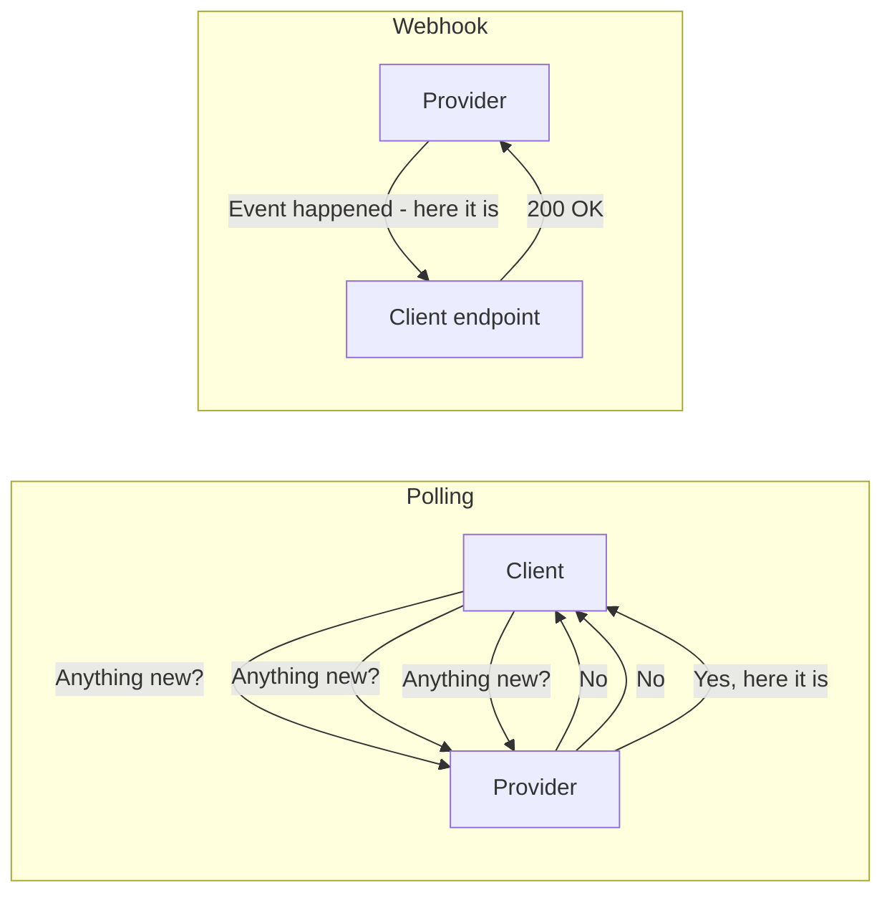
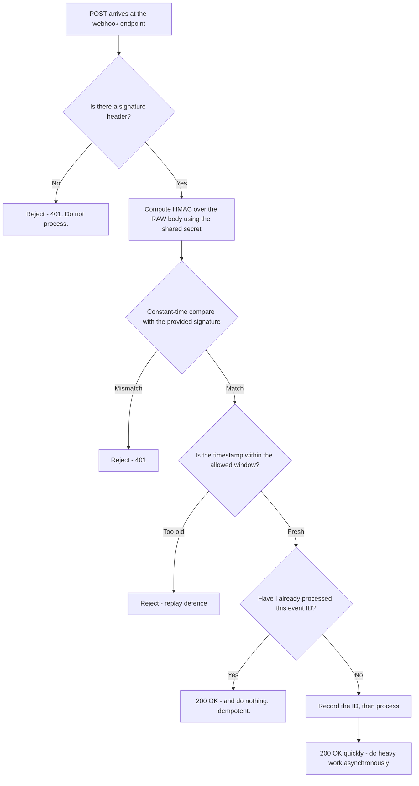
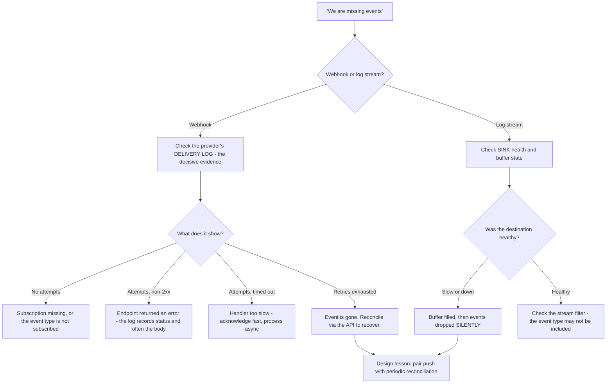
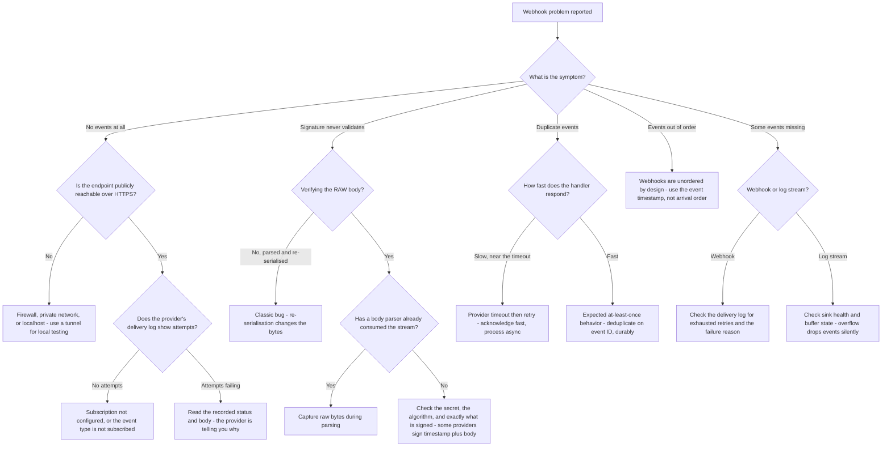

# Part 020 - Webhooks, Events, and Log Streaming

> Section goal: Understand push-based integration — where the provider calls *you*. Delivery guarantees, signature verification, replay defence, ordering, and retry behavior produce a distinct family of tickets that developers consistently misunderstand, and the symptoms look nothing like the causes.

Covers index item **020**. Maps to JD signals: *knowledge of HTTP*, *basic security concepts*, *knowledge of common architectures*, *strong analytical and problem-solving skills*, and *promote best practices*.

---

## 1. Start From Zero: Pull Versus Push

| | Pull (polling) | Push (webhook / stream) |
|---|---|---|
| Who initiates | The client asks repeatedly | The provider calls the client |
| Latency | As long as the polling interval | Near real-time |
| Cost when idle | Wasteful — mostly empty responses | Zero |
| Rate limits | Consumed constantly | Not consumed by polling |
| Reliability | The client controls it | Depends on the client being reachable |
| Complexity | Low | Higher — signatures, retries, duplicates, ordering |
| Failure mode | Falls behind | **Silently misses events** |

> **Analogy.** Polling is phoning the delivery depot every ten minutes to ask if your parcel arrived. Push is the depot phoning you when it does. Push is obviously better — until you are out, and now the question becomes how many times they will try again, and whether you can tell a genuine call from a scam.
>
> **Where it stops:** a depot will keep your parcel indefinitely. A webhook provider gives up after a bounded number of retries, and then the event is gone.

### 🔍 Plain-English deep-dive: why push introduces problems pull never had

With polling, the client is in control. If it crashes, it simply polls later and catches up. Nothing is lost, because the *data* is still sitting on the server.

With push, the **provider is in control of delivery**, and that creates four genuinely new problems:

| Problem | Why it exists | Consequence if unhandled |
|---|---|---|
| **Authenticity** | Anyone on the internet can POST to your public endpoint | Attacker-forged events processed as real |
| **Duplicates** | Retries after ambiguous failures | Double-processing — duplicate emails, duplicate records |
| **Ordering** | Independent deliveries can overtake each other | Later state overwritten by earlier state |
| **Loss** | Retries eventually stop | An event is gone with no way to know |

**Every one of those maps directly to a ticket type**, and none of them exists in a polling design. That trade-off is the honest framing to give a customer choosing between the two.

**Analogy:** collecting your own post versus having it delivered. Delivery is more convenient, and now you have to worry about forged letters, the same letter arriving twice, letters arriving out of order, and letters that were never delivered at all. **Where it stops:** you would notice a missing letter eventually. A missing webhook is silent by construction.

---

## 2. Delivery Guarantees

| Guarantee | Meaning | Reality |
|---|---|---|
| **At-most-once** | Never duplicated, may be lost | Rare — usually unacceptable |
| **At-least-once** | Never lost, **may be duplicated** | **What almost every webhook system provides** |
| **Exactly-once** | Delivered precisely once | Not achievable in a distributed system with an unreliable network |

### 🔍 Plain-English deep-dive: why exactly-once delivery is impossible

The provider sends an event. The connection drops before a response arrives.

The provider now faces the same ambiguity the *client* faced in Part 019: did the receiver get it and the acknowledgement was lost, or did it never arrive at all?

- If the provider **retries**, and the receiver already processed it → **duplicate**.
- If the provider **does not retry**, and the receiver never got it → **loss**.

There is no third option, because the provider cannot see inside the receiver. Every real system therefore chooses **at-least-once** — duplication is recoverable, loss usually is not.

**The consequence, which is the practical rule you give every customer:**

> **Exactly-once *delivery* is impossible. Exactly-once *processing* is achievable — by making your handler idempotent.**

The receiver records event identifiers it has processed and ignores repeats. Responsibility moves from the network to the application, where it can actually be solved.

**Analogy:** you cannot guarantee a letter is posted exactly once, but you can number the letters and ignore any number you have already actioned. **Where it stops:** the receiver must keep that record durably and long enough to cover the provider's full retry window — an in-memory set that resets on deploy will let duplicates through.

---

## 3. Webhook Security

A webhook endpoint is a **public URL that accepts POSTs from the internet**. Anyone can call it. Securing it is entirely the receiver's responsibility.

| Control | What it prevents | Implementation note |
|---|---|---|
| **Signature verification** | Forged events | HMAC over the **raw** body; **constant-time** comparison |
| **Timestamp check** | Replay of a genuine, captured event | Reject anything outside a small window (commonly five minutes) |
| **Event ID deduplication** | Double-processing | Durable store, retained beyond the provider's retry window |
| **HTTPS only** | Interception and tampering | Never accept plain HTTP |
| **Fast acknowledgement** | Provider timeouts causing retries | Acknowledge, then process asynchronously |
| **IP allow-listing** *(supplementary)* | Some noise | **Never a substitute for signatures** — provider IPs change |

### The three signature-verification bugs

These are worth memorising because they recur constantly and each is subtly wrong rather than obviously broken.

| Bug | Why it breaks | Symptom |
|---|---|---|
| **Verifying the parsed body, not the raw body** | JSON re-serialisation changes whitespace and key order, so the bytes differ | "Signature never matches" — intermittently or always |
| **Using `==` instead of constant-time comparison** | Leaks timing information about how many bytes matched | No functional symptom — a genuine security weakness |
| **Verifying after a body-parsing middleware has consumed the stream** | The raw bytes are gone by the time you need them | "Signature never matches", framework-specific |

**The first one is the classic.** In Express, `express.json()` consumes and parses the body; by the time the handler runs, the original bytes no longer exist. The fix is to capture the raw body during parsing (a `verify` callback) or to register the raw-body parser on the webhook route only.

**This is a genuinely satisfying ticket to resolve**, because the developer's code *looks* correct and the fix is one line in the wrong place.

---

## 4. Ordering and Timing

**Webhooks are not ordered.** Two events sent a millisecond apart may arrive in either order, because they travel independently and one may be retried.

| Problem | Example | Mitigation |
|---|---|---|
| **Out-of-order arrival** | `user.updated` arrives before `user.created` | Use the event timestamp, not arrival order |
| **Stale overwrite** | An older update overwrites a newer one | Compare versions/timestamps and discard older state |
| **Race with the API** | The webhook arrives before the change is readable via the API | Retry the read, or trust the payload |
| **Thundering acknowledgement** | Slow handler → provider timeout → retries → more load | Acknowledge fast, process asynchronously |

### 🔍 Plain-English deep-dive: acknowledge fast, process later

Most webhook providers impose a short response timeout — often a few seconds. If your handler does real work inline (database writes, calling other services, sending email) it may exceed that.

The provider then treats the delivery as failed and **retries**. Your handler, which actually succeeded, runs again. Now you have duplicates *and* increased load, and the load makes the timeouts worse. It is a self-reinforcing failure.

**The correct pattern:**

1. Verify the signature.
2. Check the timestamp.
3. Deduplicate on the event ID.
4. **Write the event to a queue or table.**
5. **Return 200 immediately.**
6. Process asynchronously from the queue.

The endpoint's only job is to accept and acknowledge safely. All the real work happens after.

**Symptom when this is wrong:** "we get every webhook three times", combined with slow handler latency in their own metrics. The duplicates are not a provider bug — they are the provider correctly retrying a delivery the receiver failed to acknowledge in time.

**Analogy:** a receptionist who signs for a parcel and puts it in the sorting room, rather than trying to action its contents while the courier waits at the door. **Where it stops:** a courier will wait a moment if asked. A webhook timeout is fixed and unnegotiable.

---

## 5. Log Streaming Versus Webhooks

Identity platforms typically offer both, and they are for different purposes.

| | Webhooks / event hooks | Log streaming |
|---|---|---|
| Purpose | React to specific events | Ship **all** events to an analytics or security system |
| Volume | Selective, low | High — everything |
| Destination | Your application endpoint | SIEM, log sink, cloud storage, HTTP endpoint |
| Latency | Near real-time | Near real-time to slightly batched |
| Guarantees | At-least-once with retries | At-least-once, often with buffering |
| Failure handling | Retries, then gives up | Buffer, then drop when the buffer fills |
| Typical consumer | Application logic | Security team, dashboards, compliance |

**The support consequence of the difference:** when a customer says "we're missing events", establish **which mechanism** first. A missing webhook is a delivery failure to their endpoint. A missing log-stream event is usually a buffer overflow caused by their sink being slow or down — a completely different investigation with a completely different fix.

> 💡 **Tie-in to your background:** you have worked with audit and diagnostic data flowing into monitoring systems in an enterprise Microsoft context. The log-stream model — ship everything to a SIEM, buffer on failure, alert when the sink is unhealthy — is the same architecture you already recognise. What is new is the identity event vocabulary (Part 107).

---

## 6. Failure Modes

| Failure mode | Symptom | Cause | Fix |
|---|---|---|---|
| **No signature verification** | Works fine — until it does not | Endpoint trusts anything posted to it | **Always verify.** This is a security finding, not a preference |
| **Verifying the parsed body** | "Signature never matches" | Re-serialisation changed the bytes | Verify the **raw** body |
| **Body already consumed** | Same symptom, framework-specific | Parser middleware ran first | Capture raw bytes during parsing |
| **Non-constant-time compare** | No symptom | Timing side channel | Use the platform's constant-time compare |
| **No timestamp check** | Captured events replayable indefinitely | Missing replay defence | Reject outside a small window |
| **No deduplication** | Duplicate emails, duplicate records | At-least-once misunderstood as exactly-once | Deduplicate on event ID, durably |
| **In-memory dedup only** | Duplicates after every deploy | Store resets on restart | Durable store |
| **Slow handler** | "Every webhook arrives three times" | Provider timeout → retry | Acknowledge fast, process asynchronously |
| **Assuming ordering** | State overwritten by older data | Independent deliveries | Compare timestamps or versions |
| **Endpoint not publicly reachable** | Zero events received | Firewall, private network, or local dev | Public HTTPS endpoint; use a tunnel for local testing |
| **Returning non-2xx on success** | Endless retries | Handler returns 202 the provider does not accept, or 3xx | Return exactly what the provider treats as success |
| **IP allow-list only** | Breaks when provider IPs change | Fragile control | Signatures are the real control |
| **Log-stream buffer overflow** | Gaps in the SIEM | Sink slow or down | Monitor sink health; alert on delivery failure |

---

## 7. Troubleshooting Decision Tree

### Worked example

*"Your webhooks are broken. Signature verification fails on every single event. We've triple-checked the secret."*

1. **"Every single event" rules out a transient issue.** A wrong secret is possible but they have checked it, so consider what else always differs.
2. **Ask for the code**, specifically the handler and the middleware registration order.
3. **Look for:** `app.use(express.json())` registered globally, before the webhook route.
4. **Explain the mechanism:** the JSON middleware consumes the request stream and hands the handler a parsed object. When they re-serialise that object to compute the HMAC, the byte sequence differs from what the provider signed — key order may change, whitespace is normalised, Unicode escaping may differ. **The signature is computed over different bytes, so it can never match.**
5. **Fix:** capture the raw body during parsing (Express supports a `verify` callback on the JSON parser that receives the raw buffer), or register a raw-body parser on the webhook route specifically, before the global JSON parser.
6. **Verify:** log the raw body length and the first few bytes alongside the computed and received signatures, on a test event, then remove that logging.
7. **While you are there — check three more things:** is the comparison constant-time, is there a timestamp window check, and is deduplication durable across restarts? None of those were the reported problem, and all three are worth raising. That is *"promote best practices"* in practice.

That answer resolves the ticket and prevents three future ones — which is exactly the eight-element structure from Part 004 doing its job.

---

## 8. Lab: Build a Correct Webhook Receiver

**Purpose.** Implement every control yourself, then break each one deliberately, so you recognise each failure from its symptom.

**Prerequisites.** Part 007's lab, Node.js/Express. **Localhost and your own tenant only.**

**Steps.**

1. Create `okta-prep/labs/020-webhooks/`.
2. **A minimal receiver.** Build an Express endpoint on `http://localhost:5000/hook` that logs the raw body length, all headers, and returns 200.
3. **A sender.** Write a small script that POSTs a JSON event with an `id`, a `type`, a `timestamp`, and an HMAC signature header computed over `timestamp + "." + rawBody` using a shared secret. **This is your synthetic provider** — it means you can test everything without any real traffic.
4. **Correct verification.** Implement the full chain: capture the raw body, compute the HMAC, compare in constant time, check the timestamp window, deduplicate on event ID using a file or SQLite store, then return 200.
5. **Break it, seven ways.** For each, record the exact symptom your receiver produces:
   - a. Verify the **parsed and re-serialised** body instead of the raw body
   - b. Register `express.json()` globally before the route
   - c. Use `===` string comparison instead of constant-time
   - d. Remove the timestamp window check, then replay a captured event an hour later
   - e. Remove deduplication, then send the same event ID twice
   - f. Store processed IDs in memory only, then restart the process and replay
   - g. Add a five-second delay before responding, and have the sender retry on timeout
6. **Ordering demonstration.** Send `user.updated` before `user.created` with timestamps in the opposite order. Show that arrival-order processing produces wrong state, and that timestamp-ordered processing does not.
7. **Async pattern.** Refactor to: verify → deduplicate → write to a queue (a simple table or file is fine) → return 200 → process from the queue. Re-run test (g) and confirm the duplicates stop.
8. **Real events (optional, low volume).** If your lab tenant supports an event hook or log stream to an HTTP endpoint, point it at a tunnel to your local receiver and capture **two or three** real events. Record the actual header names and payload shape. **Keep volume trivial.**
9. **Reference + catalog.** Write `webhook-checklist.md`: the seven controls, the three signature bugs, and the symptom of each failure. Add all rows to the failure catalog. Complete `MANIFEST.md`.

**Expected evidence.** A working receiver implementing all controls, seven recorded failure symptoms, an ordering demonstration, a before/after on the async refactor, and — if attempted — two or three real event captures with actual header names.

**Validation rubric.**

| Check | Pass condition |
|---|---|
| All controls implemented | Signature, timestamp, dedup, HTTPS-only intent, fast ack, async processing |
| Raw-body bug reproduced | You saw the signature fail purely from re-serialisation |
| Middleware bug reproduced | Global parser registered first, symptom recorded |
| Constant-time noted | You used the platform's constant-time compare, and can explain why |
| Replay rejected | A captured event replayed after the window is refused |
| Dedup durable | Restart test performed; in-memory version shown to fail |
| Timeout retries reproduced | Slow handler produced duplicate deliveries, and the async fix stopped them |
| Ordering shown | Wrong state from arrival order, correct state from timestamp order |
| Volume trivial | No more than a handful of real events; everything else synthetic |

**Cleanup and privacy.** Use your own synthetic sender for all destructive and repeated testing — do not generate volume against a real tenant's event system. If you use a tunnelling service to receive real events, remember it exposes a local port to the internet: use it briefly, keep the payloads synthetic, redact anything real before saving, and shut it down immediately afterwards. Delete the shared secret from your notes; store it only in the git-ignored `secrets/` folder.

---

## 9. JD Mapping

| Supplied JD signal | How this Part supports it |
|---|---|
| Knowledge of HTTP | Webhooks are HTTP POSTs; status semantics decide retry behavior |
| Basic security concepts | HMAC signatures, constant-time comparison, replay defence, and why IP allow-listing is insufficient |
| Knowledge of common architectures | §4's async queue pattern and §5's stream-versus-webhook distinction |
| Strong analytical and problem-solving skills | §7's tree routes each symptom to a specific mechanism |
| Promote best practices | The seven-control checklist, and raising the three unreported issues in §7 |
| Instinctive ability to subdivide problems | "Which mechanism — webhook or log stream?" splits the investigation immediately |
| Business and technical analysis skills | §1's honest push-versus-pull trade-off table for a customer choosing between them |

---

## 10. Candidate Honesty Note

- **Production transfer:** you have worked with audit and diagnostic data flowing to monitoring systems in enterprise Microsoft environments, and with the "events are missing from our SIEM" class of problem. The log-stream architecture is genuinely familiar.
- **New here:** HMAC signature verification mechanics, replay windows, and the raw-body trap. All are implementable in one lab session.
- **The strongest thing you can say:** *"The signature bug that catches nearly everyone is verifying the parsed body instead of the raw bytes — JSON re-serialisation changes key order and whitespace, so the HMAC is computed over different bytes and can never match. I reproduced it deliberately, and in Express the cause is usually a global JSON parser registered before the webhook route."* That is precise, verifiable, and immediately useful.
- **A second strong point:** *"'We get every webhook three times' is usually not a provider bug — it's the provider correctly retrying because the receiver's handler is too slow to acknowledge within the timeout."* Reframing a complaint as a receiver-side design issue, with the fix, is exactly the developer-support register.
- **Do not claim** to have operated production webhook infrastructure at scale. You have built a correct receiver and broken it deliberately — say exactly that.

---

## 11. Official Source Anchors

Accessed **26 August 2026**.

| Source | What it defines |
|---|---|
| IETF RFC 2104 (HMAC) | The signature construction used in §3 |
| IETF RFC 9110 | POST semantics, status codes, and what a receiver's response means to a sender |
| IETF HTTP Message Signatures (RFC 9421) | A standardised alternative to bespoke HMAC header schemes |
| OWASP — webhook and API security guidance | Signature verification, replay defence, and constant-time comparison |
| Auth0 documentation — log streams and event delivery | Real destination types, delivery guarantees, and buffering behavior |
| Okta documentation — event hooks and system log streaming | The equivalent mechanisms, header names, and retry policy |
| Node.js `crypto.timingSafeEqual` documentation | The constant-time comparison used in the lab |
| Express body-parser documentation — the `verify` callback | How to capture the raw body, which is the fix in §7 |

**Revalidate after 26 August 2026:** vendor signature header names, signed-payload construction, retry counts, and buffer behavior — all vendor-specific and subject to change.

---

## ⭐ Likely Interview Questions for This Section

### Q1. "A customer says webhook signature verification always fails. Where do you start?"
> *Model answer:* "The raw body, because that's the bug in the large majority of cases. The signature is an HMAC over the exact bytes the provider sent. If the receiver's framework has already parsed the JSON, and the handler re-serialises that object to compute the HMAC, the bytes differ — key order can change, whitespace is normalised, Unicode escaping may differ — so the signature can never match, and it fails on every event rather than intermittently, which is the tell. In Express the usual cause is `express.json()` registered globally before the webhook route, consuming the stream. The fix is to capture the raw buffer during parsing via the parser's `verify` callback, or register a raw-body parser on that route specifically. Then I'd check three other things while I'm there: constant-time comparison, a timestamp window, and whether their deduplication survives a restart."

### Q2. "Why can't webhooks be delivered exactly once?"
> *Model answer:* "Because when a delivery times out, the provider cannot see inside the receiver. It doesn't know whether the event was processed and the acknowledgement was lost, or whether it never arrived. If it retries and the receiver already processed it, that's a duplicate. If it doesn't retry and the receiver never got it, that's a loss. There's no third option, so every real system chooses at-least-once, because duplication is recoverable and loss usually isn't. The practical rule I'd give a customer is: exactly-once *delivery* is impossible, but exactly-once *processing* is entirely achievable — record the event IDs you've processed and ignore repeats. That moves responsibility from the network, where it can't be solved, to the application, where it can. And the store has to be durable and retained beyond the provider's full retry window, because an in-memory set that resets on deploy will let duplicates through."

### Q3. "A customer says they receive every webhook three times. Is that a bug?"
> *Model answer:* "Usually not a provider bug — it's the provider correctly retrying because the receiver didn't acknowledge in time. Most providers impose a short response timeout, often a few seconds. If the handler does real work inline — database writes, calling other services, sending email — it can exceed that. The provider marks the delivery failed and retries, so a handler that actually succeeded runs again. And it's self-reinforcing, because the retries add load which makes the timeouts worse. So my question is: how long does their handler take to respond? The fix is the standard pattern — verify the signature, check the timestamp, deduplicate on event ID, write to a queue, return 200 immediately, and process asynchronously. The endpoint's only job is to accept and acknowledge safely. And they should deduplicate anyway, because at-least-once means duplicates can occur even with a fast handler."

### Q4. "How would you secure a webhook endpoint?"
> *Model answer:* "It's a public URL that anyone on the internet can POST to, so everything is the receiver's responsibility. Six controls. Verify an HMAC signature over the raw body using the shared secret — that's the primary control and it's non-negotiable. Compare in constant time, so you're not leaking timing information about how many bytes matched. Check a timestamp and reject anything outside a small window, typically five minutes, which stops a genuine captured event being replayed later. Deduplicate on event ID with a durable store. HTTPS only. And acknowledge quickly, processing asynchronously, so timeouts don't cause retries. IP allow-listing is sometimes offered as an option — I'd treat it as supplementary noise reduction, never as the control, because provider IP ranges change and it gives false confidence."

### Q5. "Should a customer use webhooks or polling?"
> *Model answer:* "Depends on what they're optimising for, and I'd give them the honest trade-off rather than a recommendation. Webhooks give near-real-time delivery and consume no rate limit when idle, which matters a lot at scale. But push introduces four problems polling doesn't have: authenticity, because anyone can post to a public endpoint; duplicates, from at-least-once retries; ordering, because independent deliveries can overtake each other; and silent loss, because retries eventually stop. Polling is simpler and the client stays in control — if it crashes it catches up, because the data is still on the server. So for a low-volume, non-time-critical integration where they don't want to run a public endpoint, polling with a sensible interval is a perfectly respectable choice. For anything real-time or high-volume, webhooks — provided they implement the four controls properly. And often the right answer is both: webhooks for latency, plus periodic reconciliation to catch anything lost."

### Q6. "Events are arriving out of order and corrupting the customer's data. What do you say?"
> *Model answer:* "That webhooks are unordered by design and this isn't a defect. Events are delivered independently, and any one of them can be retried, so two events sent a millisecond apart may arrive in either order. If their handler applies changes in arrival order, an older update can overwrite a newer one and the data ends up wrong. The fix is to order on the event's own timestamp or version field rather than on arrival, and to discard any event that's older than the state they already hold. That's a form of optimistic concurrency and it's the standard answer. I'd also check whether they're racing the API — sometimes a webhook arrives before the change is readable through the API, so a handler that fetches the current state gets stale data. Trusting the payload, or retrying the read, handles that."

### Q7. "What's the difference between a webhook and a log stream?"
> *Model answer:* "Purpose and volume, and getting the distinction right changes the whole investigation. Webhooks are selective — you subscribe to specific event types and react to them in application logic, low volume, delivered to your endpoint. Log streaming ships *everything* to an analytics or security destination — a SIEM, cloud storage, an HTTP sink — for dashboards, threat detection, and compliance. High volume, and consumed by a security team rather than application code. The failure modes differ too: a missing webhook is a delivery failure to a specific endpoint, and the provider's delivery log will show the attempts and why they failed. A missing log-stream event is usually buffer overflow because their sink was slow or down, and events are dropped silently once the buffer fills. So when someone says 'we're missing events', my first question is which mechanism — because those are two completely different investigations."

### Q8. "A customer's webhook endpoint receives nothing at all. How do you diagnose it?"
> *Model answer:* "Reachability first, then subscription, then delivery log. Is the endpoint publicly reachable over HTTPS from the internet — because a surprising number of these are a firewall, a private network, or someone testing against localhost without a tunnel. I'd have them curl their own endpoint from outside their network. Then: is the subscription actually configured, and does it include the event types they expect? Subscribing to the wrong event type produces exactly this symptom. Then the provider's delivery log, which is the decisive evidence — if it shows no attempts, the problem is subscription or configuration. If it shows attempts failing, it records the status code and often the response body, which tells you directly whether the endpoint returned a 404, a 401, a 500, or timed out. That log is the single most useful artifact and developers frequently don't know it exists, so pointing them at it is often the whole answer."

---

## 🧠 30-Second Memory Hooks

- **Push introduces four problems pull never had:** authenticity · duplicates · ordering · silent loss.
- **At-least-once is what you actually get.** Exactly-once *delivery* is impossible; exactly-once *processing* is achievable.
- **Sign the RAW body.** Parsing and re-serialising changes the bytes → signature can never match. **The classic bug.**
- **In Express, the cause is usually a global JSON parser registered before the webhook route.**
- **Constant-time compare.** No functional symptom, real security weakness.
- **Timestamp window** stops replay of genuine captured events.
- **Deduplicate durably** — an in-memory set fails after every deploy.
- **"Every webhook three times" = slow handler → provider timeout → retry.** Acknowledge fast, process async.
- **Webhooks are unordered.** Use the event timestamp, never arrival order.
- **IP allow-listing is not a security control.** Signatures are.
- **"Missing events" → which mechanism?** Webhook = delivery failure. Log stream = buffer overflow.
- **The provider's delivery log is the decisive evidence**, and customers often do not know it exists.

---

## ✅ Completion Checklist

- [ ] **Knowledge:** I can list the seven receiver controls, name the three signature bugs, and explain why exactly-once delivery is impossible.
- [ ] **Lab artifact:** `020-webhooks/` contains a correct receiver, seven reproduced failures, an ordering demonstration, and a before/after on the async refactor.
- [ ] **Spoken:** I can deliver the raw-body signature diagnosis, including the Express cause, in under 60 seconds.
- [ ] **Honesty check:** all repeated and destructive testing used my own synthetic sender; real event volume was trivial and payloads were redacted.
- [ ] **Source check:** I have read my tenant's actual event-delivery documentation and recorded its real signature header name and signed-payload construction.

---

*Next suggested section:* **[Part 021 - Browser DevTools and HAR Capture for Auth Flows](Part-021-browser-devtools-and-har-capture-for-auth-flows.md)** — the single most important evidence-gathering skill in this job, and the one where your existing HAR experience converts directly into identity-specific technique.
