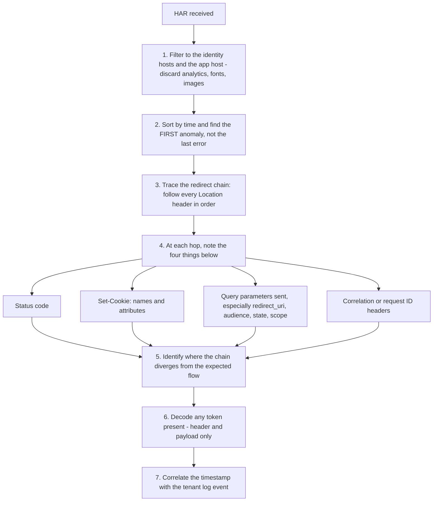
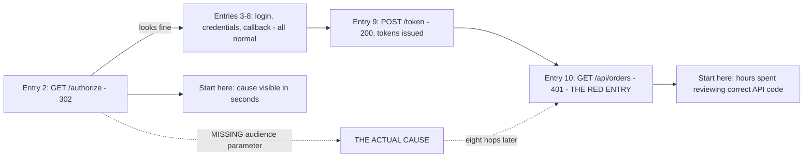
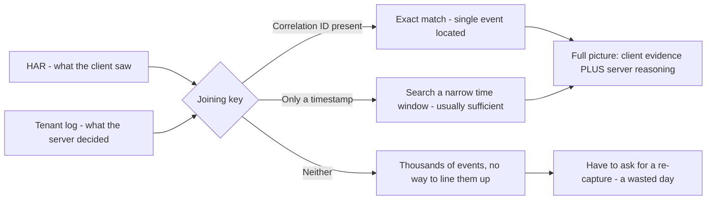
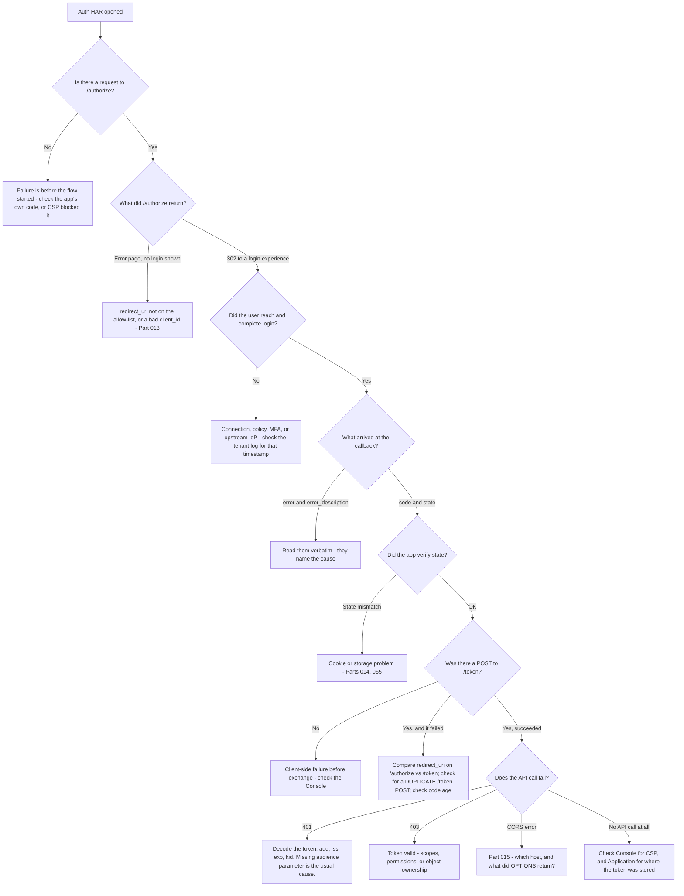

# Part 021 - Browser DevTools and HAR Capture for Auth Flows

> Section goal: Convert your existing HAR and DevTools experience into identity-specific technique. This is the single most important evidence skill in the job — nearly every browser-based identity ticket is solved or stalled by the quality of one capture. Learn what to ask for, how to read it fast, and how to redact it safely.

Covers index item **021**. Maps to JD signals: *knowledge of HTTP*, *instinctive ability to subdivide problems into basic components*, *strong analytical and problem-solving skills*, *basic security concepts*, and *exceed customer expectations on response quality*.

---

## 1. Start From Zero: What a HAR Is

A **HAR** (HTTP Archive) is a JSON file recording every HTTP request and response the browser made during a session, including headers, bodies, timings, cookies, and the initiating cause of each request.

It is captured **inside the browser**, which is what makes it superior to a packet capture for this work:

| | HAR | Packet capture (Wireshark) |
|---|---|---|
| TLS | Already decrypted | Encrypted unless you have the keys |
| HTTP/2 and HTTP/3 | Already decoded, readable | Binary, hard to read |
| Cookies | Shown per request, with attributes | Buried in headers, if visible at all |
| Timings | Per-phase breakdown provided | Must be inferred |
| Initiator | Records which script or redirect caused it | Not available |
| Below HTTP | **Not visible** | **Full visibility** |

**The rule from Part 011 restated:** HAR for anything above TLS; packet capture for TLS and below.

> **Analogy.** A packet capture is a recording of a sealed diplomatic pouch travelling between embassies. A HAR is the transcript taken inside the room, after the pouch was opened.
>
> **Where it stops:** the transcript cannot tell you the pouch was delayed in transit, or that the courier never arrived. That is when you go back to the wire.

### 🔍 Plain-English deep-dive: why an identity capture must be a *chain*, not a request

From Part 011: one login is nine or more HTTP exchanges across two or three hosts.

The consequence is that **capturing only the failing request is almost always useless**. The visible error is usually a *symptom* whose cause was set several hops earlier:

| Visible failure | Where the cause usually is |
|---|---|
| Callback shows `invalid_request` | The parameters sent to `/authorize`, three hops back |
| Token exchange returns `invalid_grant` | The `redirect_uri` on `/authorize`, or a duplicate `/token` earlier in the capture |
| API returns 401 | The `audience` on `/authorize`, five hops back |
| Login loop | A `Set-Cookie` that was rejected at the very first hop |
| Silent auth fails | A cookie absent from an iframe request, not the iframe response itself |

**Therefore the single most important instruction you give a customer is: enable "Preserve log" *before* starting, and capture from the very first click.** Without it, every redirect clears the panel and you receive only the last fragment of a story.

**Analogy:** arriving at the last page of a crime novel and trying to name the culprit. **Where it stops:** in a novel the last page usually *does* name them. In a redirect chain, the last page names only the symptom.

---

## 2. The Capture Instruction You Send Customers

This is a reusable asset. Write it once; send it hundreds of times.

> **To capture a HAR of the failing flow:**
>
> 1. Open a **new** browser window, ideally a fresh profile or private window, so unrelated cookies and extensions do not interfere.
> 2. Navigate to your application, but **do not sign in yet**.
> 3. Open DevTools (F12) and select the **Network** tab.
> 4. Tick **Preserve log** (Chrome/Edge) or **Persist Logs** (Firefox). **This is essential** — without it the record is cleared on every redirect.
> 5. Tick **Disable cache**.
> 6. Note the **exact time** you are about to start, including your timezone.
> 7. Now perform the failing action from the very beginning — click sign in and continue until the failure occurs.
> 8. When it fails, **do not navigate away.** Right-click in the Network panel and choose **Save all as HAR with content**.
> 9. Before sending, please **redact** the values of any `Authorization` and `Cookie` headers, and any `client_secret`. I need the header *names* and the cookie *attributes*, not the values — I do not need token signatures.
> 10. Also send: the exact error text you saw, the browser and version, and whether it also fails in a private window.

**Why each step matters** — worth knowing so you can explain it if asked:

| Step | Purpose |
|---|---|
| Fresh profile | Removes extensions and stale cookies as variables |
| Not signed in yet | Captures the full chain from the beginning |
| Preserve log | **The single most important step** |
| Disable cache | Avoids `304`s hiding the real responses |
| Exact time + timezone | Lets you correlate with tenant logs (Part 107) |
| Do not navigate away | Some panels lose state on navigation |
| "with content" | Includes response bodies, where `error_description` lives |
| Redaction request | Reduces credential exposure and teaches good practice (Part 006) |
| Private-window question | Instantly tests the third-party-cookie hypothesis (Part 017) |

---

## 3. Reading a HAR Fast

You will receive captures with 200–2000 entries. You need a repeatable reduction method.

### The seven-point checklist for any auth HAR

| # | Look for | Why |
|---|---|---|
| 1 | The **first** `/authorize` request | Everything downstream depends on its parameters |
| 2 | `redirect_uri` — decoded and compared to the allow-list | Part 013's number-one cause |
| 3 | `audience` / `resource` parameter | Absent → the token is for the IdP, not their API (Part 064) |
| 4 | `Set-Cookie` on every hop, with attributes | Part 014's login-loop cause |
| 5 | The callback: `code` present, or `error` + `error_description` | The decisive fork |
| 6 | The `/token` POST: `Content-Type`, `redirect_uri`, presence of `code_verifier` | Part 012's `invalid_grant` causes |
| 7 | Any request with `prompt=none` from an iframe | Part 017's silent-auth signature |

**Run those seven in order and most identity tickets resolve inside five minutes.**

### 🔍 Plain-English deep-dive: read the first anomaly, not the last error

Beginners open the HAR, scroll to the red entry, and start there. That is usually the *symptom*.

The professional habit is the opposite: **start at the top and find the first thing that is not what you expected.** Often it is not even an error — it is a `200` with a subtly wrong parameter, or a `Set-Cookie` that never appears again on any subsequent request.

Concretely, the *first anomaly* is frequently:

- The `/authorize` request missing an `audience` parameter (a 302, entirely "successful").
- A `Set-Cookie` with `SameSite=Lax` that will be needed on a later cross-site POST.
- A redirect to `http` instead of `https` because of a proxy header.
- A duplicate `/token` POST, milliseconds apart, from a double-rendered component.

All of those look fine in isolation. All of them cause a failure several hops later.

**Analogy:** a train arriving late at its final stop. The delay began at a junction six stations earlier, where nothing appeared wrong yet. **Where it stops:** a train timetable is linear; a redirect chain branches into iframes and background fetches, so you have to read the *initiator* column too.

---

## 4. The DevTools Panels That Matter

| Panel | What it answers | Identity use |
|---|---|---|
| **Network** | What was requested and returned | The primary evidence surface |
| **Network → Initiator** | *Why* a request happened | Distinguishes a redirect from a script-initiated fetch |
| **Network → Timing** | Where time went | Slow-login investigations |
| **Console** | Script errors and browser policy messages | CORS and CSP messages (Parts 015, 016) |
| **Application → Cookies** | What is *stored*, with `Domain` and `Path` per entry | Reveals cookie shadowing, which the request header hides |
| **Application → Storage** | `localStorage`, `sessionStorage`, IndexedDB | Where the SDK put the token |
| **Application → Frames** | The frame tree | Confirms a hidden silent-auth iframe exists |
| **Security** | Certificate and connection details | Certificate and mixed-content issues |
| **Issues** | Browser-flagged problems | **Often names a rejected cookie explicitly** |

### The Issues panel is underused

When a browser rejects a cookie — `SameSite=None` without `Secure`, or a cookie that exceeds the size limit — it frequently reports it in the **Issues** panel with a plain-language explanation. The Network panel shows the `Set-Cookie` header as if all is well; the cookie simply never appears in Application.

Asking a customer *"is there anything in the Issues panel?"* is a cheap question with a high hit rate, and it is not a question most people think to ask.

---

## 5. What a HAR Cannot Tell You

Knowing the limits keeps you from over-reading evidence.

| Not visible in a HAR | Why | Where to look instead |
|---|---|---|
| Anything blocked by CSP | The request was never dispatched | Console (Part 016) |
| Server-side reasoning | Only the response is recorded | Tenant logs, correlation ID (Part 107) |
| What the upstream IdP did internally | Different party, different logs | The customer's own IdP logs |
| TLS handshake detail | Recorded after decryption | Packet capture, `openssl s_client` |
| Requests before capture started | Not recorded | Re-capture with preserve log on |
| Requests from another tab or process | Per-context capture | Capture in the right context |
| Native app traffic | Not a browser | Proxy tooling on a device you own |
| `HttpOnly` cookie values | Deliberately hidden from tooling in some views | Application panel shows presence and attributes |

**The most consequential entry is the first one.** If a customer swears the request "isn't being made", and there is no Network entry and a console message, that is CSP — not a network or server problem. Knowing this distinction is a fast, expert-looking diagnosis (Part 016 §5).

### 🔍 Plain-English deep-dive: a HAR is half the story, and the timestamp is the other half

A HAR records what the **client** saw. It does not record what the **server thought**.

When an authorization server returns `access_denied` or a generic error, the response body is deliberately terse — detailed errors would leak information to an attacker probing the endpoint. The full reason lives in the tenant log: which policy blocked it, which connection was selected, which rule denied, what the upstream identity provider actually returned.

So the two halves must be joined, and there are only two things that can join them:

| Joining key | How to get it | Reliability |
|---|---|---|
| **Correlation / request ID** | A response header, sometimes echoed in the error body | Exact — use it whenever present |
| **Timestamp with timezone** | Ask the customer for the exact time of the attempt | Good, provided the timezone is stated |

**This is why "what time did this happen, and in which timezone?" belongs in your first response**, not your third. Without it, you have a client-side capture and a tenant log containing thousands of events, and no way to line them up.

**Analogy:** two security cameras pointing at the same doorway from different angles, with no synchronised clock. Each recording is useful; together they are conclusive — but only if you can align them. **Where it stops:** cameras can be re-synchronised afterwards. A support ticket usually cannot, because the customer has moved on.

---

## 6. Redaction, Practically

From Part 006: **a HAR is not a log file. It is a bag of live keys.** Handle every one you receive with a fixed routine.

### The 60-second scan

Search the file for each of these strings:

| Search term | What it finds |
|---|---|
| `Bearer ` | Access tokens in `Authorization` headers |
| `"Cookie"` / `"Set-Cookie"` | Session credentials |
| `client_secret` | Application credentials |
| `refresh_token` | Long-lived credentials |
| `"code"` | Authorization codes |
| `id_token` / `access_token` | Tokens in response bodies |
| `BEGIN PRIVATE KEY` | Catastrophic if present |
| `password` | Should never be there |

### What to keep

Redaction is worthless if it removes the diagnostic value. Keep:

| Keep | Why |
|---|---|
| Status codes | Primary signal |
| Header **names** | Presence/absence is frequently the bug |
| Cookie **names and attributes** | `SameSite`, `Secure`, `Domain`, `Path` |
| Full redirect chain, with sensitive parameters redacted | Shows where it diverged |
| `error` and `error_description` | Directly diagnostic |
| Token **header and payload** claims (signature removed) | The ground truth of what was issued |
| Timestamps with timezone | Correlation with tenant logs |
| Correlation/request IDs | The bridge to the server side |

**If you find a live secret**, follow the Part 006 §6 routine: do not copy or forward it, tell the customer plainly and unembarrassingly, advise rotation with steps, and follow the internal process.

---

## 7. Failure Modes

| Failure mode | Symptom | Consequence | Correction |
|---|---|---|---|
| **No preserve log** | Capture starts mid-chain | The cause is missing entirely | Make it step 4 of your standard instruction |
| **Capturing only the failing request** | One entry sent | Cause was hops earlier | Request the full chain |
| **Saved without content** | No response bodies | `error_description` missing | "Save all as HAR **with content**" |
| **Starting from the last error** | Chasing the symptom | Slow, often wrong | Find the **first** anomaly |
| **Ignoring the Initiator column** | Cannot tell redirect from fetch | Misattributed cause | Read it on every ambiguous entry |
| **Ignoring the Issues panel** | Missing a rejected cookie | Login-loop cause invisible | Ask about it explicitly |
| **Assuming absence means blocked** | "It's not in the HAR so it failed" | Could be CSP — never dispatched | Check the Console |
| **Not requesting timestamps** | Cannot correlate server-side | Half the evidence unusable | Ask for exact time and timezone |
| **Over-redaction** | Cookie names and attributes stripped | Diagnostic value destroyed | Redact values, keep names and attributes |
| **Under-redaction** | Live tokens received | Credential exposure | Run the 60-second scan on receipt |
| **Extensions interfering** | Unexplainable behavior | Days lost | Fresh profile or private window |
| **Capturing the wrong context** | Iframe traffic missing | Silent-auth evidence absent | Confirm frame context, check Application → Frames |

---

## 8. Troubleshooting Decision Tree: Reading an Auth HAR

### Worked example

A customer sends a HAR with 340 entries and says *"login just fails."*

1. **Filter** to their app host and the identity host. 340 entries becomes 14.
2. **Sort by time**, start at the top.
3. **Entry 1:** `GET /dashboard` → `302` to `/authorize`. Normal.
4. **Entry 2:** `GET /authorize?...` → `302` to a login page. **Check the parameters.** `redirect_uri` present and correct; `scope=openid profile email`; **no `audience` parameter.** *Noted — first anomaly, but not yet a failure.*
5. **Entries 3–8:** login page, credential POST, `302` back to the callback with `code` and `state`. All normal.
6. **Entry 9:** `POST /oauth/token` → `200`. Tokens issued. Still fine.
7. **Entry 10:** `GET https://api.customer.com/orders` with `Authorization: Bearer …` → **`401`**.
8. **Decode the access token** (header and payload only): `aud` is the tenant's own UserInfo endpoint, **not** their API identifier.
9. **Root cause found — and it was entry 2, not entry 10.** Because no `audience` was requested, the authorization server issued a token scoped to its own endpoints. Their API is correctly rejecting a token that was never intended for it.
10. **Answer using the Part 004 structure:** restate, root cause, evidence (the decoded `aud`), the concept (audience names the intended recipient), corrected code (pass `audience` at login), the source, the next trap (also validate `iss`), and how to verify.

**Note the shape:** the error was at entry 10; the cause was at entry 2. Reading top-down found it. Reading from the red entry would have led to a long investigation of their API's validation code, which was correct all along.

---

## 9. Lab: Capture, Read, and Redact

**Purpose.** Build the capture-and-read reflex on flows you control, and produce the reusable customer instruction and redaction tooling.

**Prerequisites.** Part 007's lab tenant, Parts 013–017's local apps, a browser with DevTools. **Your own tenant and localhost only.**

**Steps.**

1. Create `okta-prep/labs/021-har/`.
2. **A clean capture.** With preserve log and disable cache enabled, capture a complete successful login to your lab application from the first click. Save as HAR **with content**.
3. **Count and annotate.** Write `chain-annotation.md`: every request in order, with URL, status, why it happened (redirect / script / iframe), and what it set or carried. Confirm the nine-plus-exchange pattern from Part 011.
4. **The seven-point checklist.** Run §3's checklist against your clean capture and record each finding. This is the routine you will use on every customer HAR.
5. **Capture four failures.** Using the deliberate breaks from earlier Parts, capture a HAR for each and record where in the chain the first anomaly appears versus where the visible error appears:
   - a. Redirect URI mismatch (Part 013)
   - b. Missing `audience` → API 401 (this Part's worked example)
   - c. Login loop from a rejected cookie (Part 014)
   - d. Silent auth failing in a strict browser (Part 017)
6. **First anomaly versus last error.** For each of the four, write one line: *"visible error at entry N; first anomaly at entry M."* **The gap between M and N is the point of this Part.**
7. **Redaction tool.** Write `har-redact.py` (or `.js`): load a HAR, replace the values of `Authorization` and `Cookie` headers, `client_secret`, `code`, and any `*_token` fields with `REDACTED`, **keep all header names, cookie attributes, statuses, and other parameters**, and write out a redacted copy. Run it on all five captures.
8. **Scan tool.** Write `har-scan.py`: report every occurrence of the eight search terms in §6, with entry index and header name, so you can verify a redaction was complete. Run it on both the raw and redacted versions and confirm zero findings in the redacted output.
9. **Customer instruction.** Write `har-request-template.md` — §2's ten-step instruction in your own words, under 250 words, ready to paste into a first response.
10. **Issues panel.** Deliberately set a cookie with `SameSite=None` and no `Secure`, reload, and record exactly what the Issues panel says. Screenshot it.
11. **Failure catalog + manifest.** Add rows. Complete `MANIFEST.md` with honest limitations.

**Expected evidence.** Five HARs (one clean, four failures), all redacted; a chain annotation; four first-anomaly-versus-last-error notes; a working redaction tool; a working scan tool with a clean result on redacted files; a customer instruction template; and an Issues-panel screenshot.

**Validation rubric.**

| Check | Pass condition |
|---|---|
| Preserve log used | Every capture starts from the first click |
| Saved with content | Response bodies present, `error_description` readable |
| Chain annotated | Every entry has URL, status, cause, and effect |
| Checklist applied | All seven points recorded for the clean capture |
| Four failures captured | Each with the entry-number gap explicitly noted |
| Redaction tool works | Scan tool reports zero findings on redacted output |
| Diagnostic value preserved | Cookie attributes, header names, and statuses all survive redaction |
| Template ready | Under 250 words, pasteable, includes the private-window question |
| Own systems only | Every capture is of my own tenant and local apps |

**Cleanup and privacy.** Only your own tenant and local applications — never capture a HAR of your employer's systems, a customer's systems, or any third-party service, and never include one in a portfolio artifact. Delete the raw unredacted HARs once the redacted versions and the scan results exist; keep only redacted copies.

---

## 10. JD Mapping

| Supplied JD signal | How this Part supports it |
|---|---|
| Knowledge of HTTP | A HAR is HTTP evidence; reading one fluently *is* HTTP knowledge applied |
| Instinctive ability to subdivide problems | §3's seven-point checklist and §8's tree reduce a 340-entry capture to one entry |
| Strong analytical and problem-solving skills | §3's "first anomaly, not last error" is the core analytical habit |
| Basic security concepts | §6's redaction routine and the exposed-secret handling |
| **Exceed expectations on response quality** | §2's capture instruction gets complete evidence on the first request instead of the third |
| Resolve issues in a timely fashion | Each avoided round trip saves a day across timezones |
| Promote best practices | Teaching customers to redact before sending |

---

## 11. Candidate Honesty Note

- **Production transfer (strong):** HAR log analysis, browser developer tools, and Fiddler are explicitly on your CV and were used on real enterprise escalations. This Part is technique refinement, not new learning — say so confidently.
- **What is genuinely new:** the identity-specific reading order, the seven-point checklist, and the "first anomaly, not last error" discipline applied to redirect chains.
- **The strongest thing you can say:** *"I have a fixed seven-point checklist I run on any auth HAR, and I read top-down for the first anomaly rather than starting at the red entry — because in a redirect chain the visible error is usually the symptom and the cause is several hops earlier. In my worked example the failure was at entry 10 and the cause was at entry 2."* That is concrete, differentiating, and demonstrably practised.
- **A second strong point:** you built a redaction tool and a verification scanner. *"I redact on receipt with a script and then verify the redaction with a second script"* is a very good answer to "how do you handle sensitive customer data?"
- **Do not claim** to have written browser tooling or to be a browser-internals expert. You are an expert *reader* of browser evidence — which is exactly the role.

---

## 12. Official Source Anchors

Accessed **26 August 2026**.

| Source | What it defines |
|---|---|
| HAR specification (W3C Web Performance draft / original HAR 1.2 spec) | The file format, its fields, and what "with content" includes |
| Chrome DevTools documentation — Network panel, preserve log, saving HAR | Exact UI steps for the capture instruction in §2 |
| Firefox and Safari developer-tools documentation | Equivalent steps, which differ enough to matter when instructing a customer |
| Chrome DevTools — Issues panel documentation | The under-used panel in §4 |
| MDN — cookies, CORS, CSP | The behaviors the panels are reporting |
| Auth0 and Okta support documentation — how to gather a HAR | Vendor-published capture instructions; align yours with theirs |
| Part 006 of this guide | The redaction and exposed-secret rules applied here |

**Revalidate after 26 August 2026:** DevTools UI labels and menu paths change between browser releases, and your customer-facing instruction must match what they actually see.

---

## ⭐ Likely Interview Questions for This Section

### Q1. "Walk me through how you'd ask a customer for a HAR."
> *Model answer:* "I'd send a ten-step instruction and explain the two steps that matter most. Fresh browser window or private window, so extensions and stale cookies aren't variables. Don't sign in yet — start capturing before the first click. Open DevTools, Network tab, and tick **Preserve log**, which is the single most important step because without it every redirect clears the panel and I receive only the last fragment. Disable cache too, so 304s don't hide the real responses. Note the exact time and timezone so I can correlate with server-side logs. Perform the failure from the beginning, don't navigate away, then Save all as HAR **with content** — because without content I don't get response bodies, and `error_description` lives there. And I'd ask them to redact `Authorization` and `Cookie` values before sending, explaining that I need header names and cookie attributes, not the values. Finally: does it also fail in a private window? That one question tests the third-party-cookie hypothesis for free."

### Q2. "You've got a HAR with 340 entries. How do you read it?"
> *Model answer:* "Filter, then read top-down for the first anomaly. First I filter to the application host and the identity host and discard analytics, fonts, and images — 340 entries usually becomes ten to fifteen. Then I sort by time and start at the top, not at the red entry, because in a redirect chain the visible error is almost always the symptom and the cause is several hops earlier. Then I run a fixed seven-point checklist: the first `/authorize` request and its parameters, the decoded `redirect_uri`, whether an `audience` parameter is present, every `Set-Cookie` with its attributes, whether the callback carried a code or an error, the `/token` POST's content type and `redirect_uri`, and any `prompt=none` request from an iframe. That routine resolves most identity tickets in about five minutes, and the discipline of reading top-down is what makes it fast."

### Q3. "Give me a concrete example of the cause being far from the error."
> *Model answer:* "A customer's API returns 401 after a completely successful login. The red entry is the API call — entry ten, say. But the cause is entry two: the `/authorize` request had no `audience` parameter, so the authorization server issued an access token scoped to its own endpoints rather than the customer's API. Decoding the token confirms it — `aud` is the tenant's UserInfo endpoint, not their API identifier. Their API is correctly rejecting a token that was never meant for it, so their validation code was right all along. If I'd started at the red entry, I'd have spent hours reviewing their perfectly correct API middleware. Reading top-down, the missing parameter at entry two is visible immediately — and it's a `302`, a completely successful response, which is why 'first anomaly' rather than 'first error' is the right instruction."

### Q4. "When is a HAR not the right tool?"
> *Model answer:* "When the failure is below HTTP, or outside the browser. A HAR is captured inside the browser after TLS decryption, so it shows nothing about handshake failures, certificate chains, cipher negotiation, connection resets, or retransmissions — for those I'd want a packet capture or `openssl s_client`. It also can't show anything blocked by Content Security Policy, because the request was never dispatched: the tell is that there's *no* network entry at all plus a console message, which is a genuinely useful distinction from CORS where the entry is present. It doesn't show server-side reasoning, so I'd need the correlation ID and the tenant log for the other half of the story. And it doesn't cover native mobile app traffic. So my rule is: HAR for anything above TLS, packet capture for TLS and below, tenant logs for the server's view."

### Q5. "How do you handle a HAR that contains live credentials?"
> *Model answer:* "I assume every HAR does, because a login capture is not a log file — it's a bag of live keys. It'll typically contain `Authorization` bearer headers, `Set-Cookie` session credentials, the authorization code in the callback URL, the full token response including refresh tokens, and sometimes a client secret. So on receipt I run a fixed 60-second scan for `Bearer `, `Cookie`, `client_secret`, `refresh_token`, `id_token`, `access_token`, `BEGIN PRIVATE KEY`, and `password`. I've scripted both the scan and the redaction, and I verify the redaction by re-running the scanner on the output. If I find something high-value like a client secret or a signing key, I tell the customer immediately and unembarrassingly, advise rotation with the exact steps, and follow the internal process for exposed credentials. And I keep the file in the ticket as the system of record rather than on my own machine."

### Q6. "What do you keep when you redact?"
> *Model answer:* "Everything diagnostic, which is more than people expect — over-redaction destroys the evidence just as effectively as not sending it. I keep status codes, header *names* because presence or absence is frequently the bug itself, cookie *names and attributes* because `SameSite`, `Secure`, `Domain` and `Path` are often the actual cause, the full redirect chain with sensitive parameters masked, `error` and `error_description` verbatim, the token *header and payload* claims with the signature removed, timestamps with timezone, correlation IDs, and SDK versions. What I remove is values: bearer tokens, cookie values, client secrets, authorization codes, private keys, and personal data. The rule I give customers is 'redact the values, keep the names and attributes' — and I say explicitly that I don't need token signatures, which usually reassures them enough that they send a usable capture rather than a stripped one."

### Q7. "A customer says a request 'isn't being made'. How do you verify?"
> *Model answer:* "Two possibilities with very different causes, and one glance separates them. If there's a network entry but the response is withheld from script, that's CORS — the request was sent, the server processed it, the browser refused to hand back the response. If there's genuinely *no* network entry at all, that's Content Security Policy — the browser refused to dispatch it, and the only evidence is a console line naming the violated directive, typically `connect-src` for a token call or `script-src` for an SDK that never loaded. So my question is: is there anything in the Console, and is the Network tab genuinely empty for that request? I'd also ask about the Issues panel, which is under-used — when a browser rejects a cookie, for `SameSite=None` without `Secure` or an oversized value, it often explains it there in plain language even though the `Set-Cookie` header looks perfectly fine in Network."

### Q8. "How does your existing HAR experience transfer to identity work?"
> *Model answer:* "The mechanics transfer completely — I've analysed HAR, Fiddler and network captures on enterprise escalations for several years, so reading headers, statuses, timings and redirect chains is existing skill rather than something I'm learning. What I've had to add is identity-specific *reading order*. Three things in particular. First, capture the whole chain, because one login is nine or more exchanges across two or three hosts and the failing request is rarely where the cause is. Second, a fixed seven-point checklist so I'm not reading opportunistically — `redirect_uri`, `audience`, cookie attributes, the callback fork, the token POST, and any `prompt=none` iframe. Third, the habit of correlating the client-side capture with the server-side log event using the timestamp and correlation ID, because a HAR is only ever half the story."

---

## 🧠 30-Second Memory Hooks

- **HAR = above TLS. Packet capture = TLS and below.**
- **"Preserve log" is step one.** Without it you receive the last fragment of the story.
- **"Save all as HAR *with content*"** — otherwise no response bodies, no `error_description`.
- **Read top-down for the FIRST ANOMALY, not the last error.** The cause is usually several hops back.
- **The first anomaly is often a successful 302** with a missing parameter.
- **Seven-point checklist:** first `/authorize` · `redirect_uri` · `audience` · every `Set-Cookie` · callback fork · `/token` POST · any `prompt=none` iframe.
- **No network entry at all = CSP.** Entry present, response withheld = CORS.
- **Ask about the Issues panel** — it explains rejected cookies in plain language.
- **Ask "does it fail in a private window?"** — free third-party-cookie test.
- **Always ask for exact time + timezone** — it is the bridge to the tenant log.
- **Redact values; keep names, attributes, statuses, and claims.** Over-redaction destroys the evidence.
- **A HAR is a bag of live keys.** Scan on receipt, every time.

---

## ✅ Completion Checklist

- [ ] **Knowledge:** I can recite the seven-point checklist and explain why I read for the first anomaly rather than the last error.
- [ ] **Lab artifact:** `021-har/` contains five redacted captures, a chain annotation, four first-anomaly-versus-last-error notes, a working redaction tool, a verification scanner, and a customer instruction template.
- [ ] **Spoken:** I can deliver the HAR capture instruction from memory, including why preserve log and "with content" matter.
- [ ] **Honesty check:** every capture is of my own tenant or local apps; no employer or third-party capture exists anywhere in my portfolio.
- [ ] **Source check:** I have read the vendor's own published HAR-gathering instructions and aligned my template with them.

---

*Next suggested section:* **[Part 022 - curl, Postman, and Reproducible Request Evidence](Part-022-curl-postman-and-reproducible-request-evidence.md)** — HAR shows what happened; next you learn to *reproduce* it yourself, which is what turns an observation into a provable finding.
