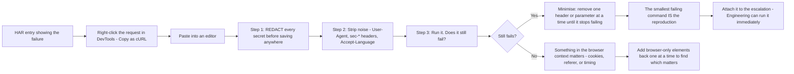
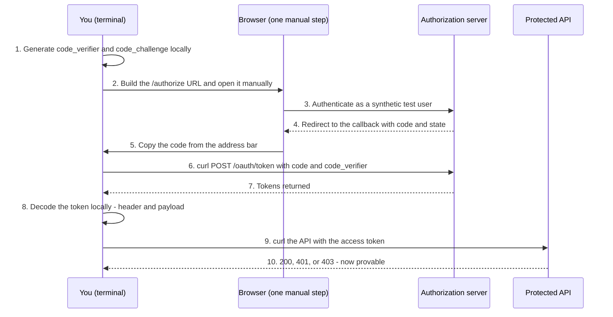
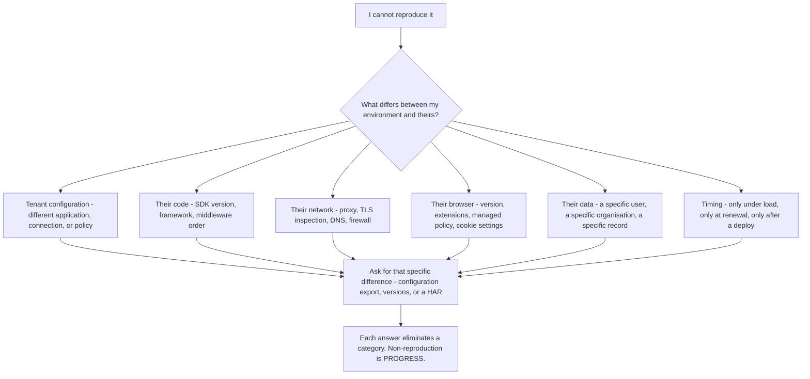
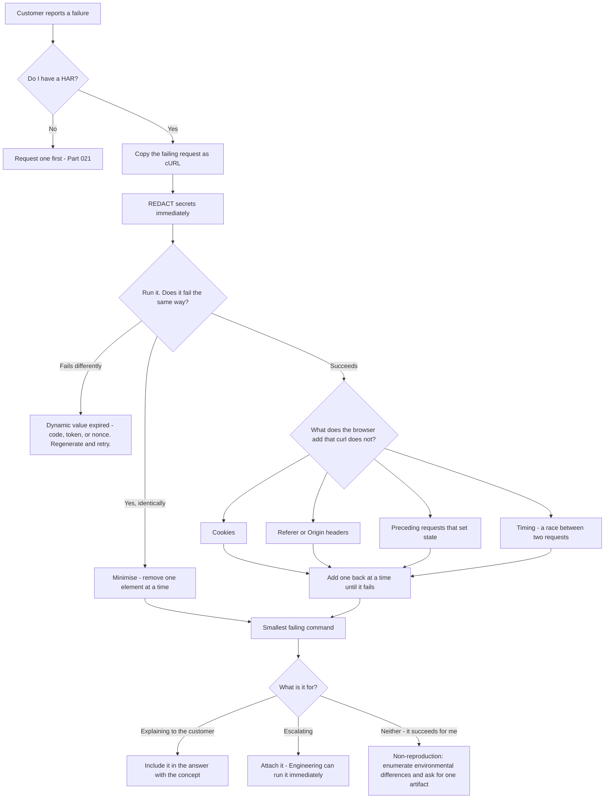

# Part 022 - curl, Postman, and Reproducible Request Evidence

> Section goal: Move from *observing* a failure to *reproducing* it. A HAR tells you what happened; a reproducible request proves why. This is the skill that converts a customer's report into a finding Engineering cannot bounce, and it is the difference between "the customer says it fails" and "here is a command that fails every time."

Covers index item **022**. Maps to JD signals: *knowledge of HTTP*, *strong analytical and problem-solving skills*, *instinctive ability to subdivide problems into basic components*, *collaborate with other departments*, and *contribute to and maintain a repository of product-area knowledge*.

---

## 1. Start From Zero: Why Reproduction Matters More Than Observation

| Observation | Reproduction |
|---|---|
| "The customer's login fails" | "This exact command fails, every time" |
| Depends on the customer to re-test | You control the variables |
| Cannot isolate one factor | Change one thing and see the effect |
| Engineering asks for a repro | Engineering can run it immediately |
| Ends when the customer goes offline | Continues at 2 a.m. if needed |

> **Analogy.** A witness statement versus a re-enactment. The statement tells you what someone believes happened. The re-enactment lets you change one variable at a time and watch what changes.
>
> **Where it stops:** a re-enactment cannot recreate the crowd, the weather, or the mood. Your reproduction cannot recreate the customer's network, their proxy, or their browser policy — so a failure to reproduce is *information*, not a dead end (see §6).

### 🔍 Plain-English deep-dive: the one-variable rule

The entire value of reproduction comes from **changing exactly one thing at a time**.

If you change three parameters and the failure disappears, you have learned nothing — you cannot say which one mattered, and you cannot explain the fix.

The disciplined method:

1. **Reproduce the failure exactly** as the customer experiences it.
2. **Change one variable.** Re-run.
3. **Record the result** before touching anything else.
4. **Revert** that change before making the next one.

This is why command-line reproduction beats clicking through a UI: a command is a **literal, complete record of every variable**. You can diff two commands and see precisely what differed. You cannot diff two sessions of clicking.

**Analogy:** adjusting one dial on a machine and noting the reading, versus turning four dials and shrugging. **Where it stops:** some variables are genuinely coupled — changing the redirect URI may require re-registering it — so occasionally two things must move together. When they do, *say so in the record*.

---

## 2. curl: The Minimum You Need

`curl` is a command-line HTTP client. It is on every Windows, macOS, and Linux machine you will meet.

### Flags that matter

| Flag | Does | Why you need it |
|---|---|---|
| `-i` | Include response headers in output | Status and headers are half the evidence |
| `-v` | Verbose: connection, TLS, request and response headers | The default for diagnosis |
| `-s` | Silent (suppress the progress meter) | Combine with `-S` to keep errors visible |
| `-X POST` | Set the method | Often implied by `-d`; be explicit anyway |
| `-H "Name: value"` | Add a header | `Authorization`, `Content-Type` |
| `-d "a=b&c=d"` | Form-encoded body | **The token endpoint** |
| `--data-urlencode "k=v"` | Body value, encoded for you | Avoids the Part 013 encoding bugs |
| `--json '{"a":1}"` | JSON body plus the right headers | Modern shorthand |
| `-L` | Follow redirects | Off by default — **often you want it off** |
| `--max-redirs 0` | Refuse to follow | To inspect a single `Location` |
| `-c file` / `-b file` | Write / read a cookie jar | Multi-step flows |
| `-o file` | Write the body to a file | Large responses |
| `-w "%{http_code} %{time_total}\n"` | Print selected metrics | Quick timing comparisons |
| `--resolve host:port:ip` | Override DNS for this request | Test a specific origin behind a load balancer |
| `--cacert file` | Trust a specific CA | Testing with your own lab CA (Part 037) |

### A safety note on two flags

`-k` / `--insecure` disables certificate verification, and `--proxy-insecure` does the same for a proxy connection.

**Do not use them, and do not tell a customer to use them.** A certificate failure is *the diagnosis*, not an obstacle. Bypassing it discards the only evidence you have and, worse, teaches a habit that will eventually be applied in production. If a certificate does not validate, the correct move is `openssl s_client` to find out *why* (Part 039).

If you ever see `-k` in a customer's script or CI pipeline, that is a finding worth raising.

### The three commands you will run constantly

```bash
# 1. What does the discovery document say?
curl -s https://TENANT/.well-known/openid-configuration | jq .

# 2. What exactly does /authorize return, without following the redirect?
curl -i --max-redirs 0 "https://TENANT/authorize?client_id=...&redirect_uri=...&response_type=code&scope=openid&state=xyz"

# 3. Exchange a code for tokens (form-encoded, not JSON)
curl -i -X POST https://TENANT/oauth/token \
  -H "Content-Type: application/x-www-form-urlencoded" \
  --data-urlencode "grant_type=authorization_code" \
  --data-urlencode "code=THE_CODE" \
  --data-urlencode "redirect_uri=https://app.example.com/cb" \
  --data-urlencode "client_id=..." \
  --data-urlencode "code_verifier=..."
```

**Note `--data-urlencode` rather than `-d`.** It encodes each value correctly, which removes the entire encoding-bug class from Part 013 in one step.

---

## 3. Converting a HAR Entry into a curl Command

This is the bridge between Part 021 and this Part, and it is a genuinely high-value habit.



**Chrome, Edge, and Firefox all offer "Copy as cURL"** from the Network panel's right-click menu. It produces a command containing every header the browser sent.

Three cautions:

1. **It contains live credentials.** `Authorization`, `Cookie`, and any secret are all in there verbatim. Redact before saving, sharing, or pasting anywhere (Part 006).
2. **It contains a lot of noise.** `sec-ch-ua`, `Accept-Language`, `User-Agent`, and similar are rarely relevant. Strip them — a shorter command is a better reproduction.
3. **Some things do not survive the copy.** An authorization code is single-use and already spent; a session cookie may have rotated. Expect to regenerate the dynamic parts.

### 🔍 Plain-English deep-dive: minimisation is the actual skill

A copied curl command with 22 headers that fails is a *start*. A three-header command that fails is a **finding**.

The minimisation loop:

1. Remove one header or parameter.
2. Re-run.
3. Still fails? Keep it removed. Stops failing? Put it back — **that element is load-bearing**.
4. Repeat until nothing more can be removed.

What remains is the **minimal reproducible example** (Part 032), and it has three properties that make it powerful:

- **It is proof.** Nobody can argue with a command that fails on their own machine.
- **It is a diagnosis.** The element you could not remove is very often the cause.
- **It is unbounceable.** An escalation containing a runnable command does not come back with "cannot reproduce."

**Analogy:** removing ingredients from a recipe until the dish stops working. Whatever you could not remove is what the dish actually depends on. **Where it stops:** some elements interact — removing two together may work where removing either alone does not. When that happens, note it explicitly; it is itself a finding.

---

## 4. Postman and Collections

Postman (or any equivalent API client) adds structure that curl does not.

| Capability | Value in support work |
|---|---|
| **Collections** | A saved, ordered set of requests — a runnable runbook |
| **Environments** | Swap tenant, client ID, and audience without editing requests |
| **Variables** | Chain a token from one request into the next |
| **Scripts** | Extract a token from a response and set it as a variable automatically |
| **Sharing** | Send a customer a collection instead of a paragraph of instructions |
| **History** | Every request you ran, retained |

### When to use which

| Situation | Tool |
|---|---|
| One quick check | curl |
| Attaching a reproduction to an escalation | **curl** — universally runnable, no install |
| A multi-step flow you will repeat | Postman collection |
| Giving a customer something to run | Either — but curl needs no account |
| Teaching a customer the flow | Postman, because the structure is visible |
| Automating in CI | curl or a script |

**Default to curl for anything you attach to a ticket or an escalation.** A curl command runs anywhere, needs no account, and can be read as documentation. A collection file requires the recipient to have the tool and to trust the file.

### 🔍 Plain-English deep-dive: why a reproduction is the artifact that ends an argument

Support conversations stall in a predictable way. The customer says the platform is broken. The platform team says the logs show correct behavior. Both are describing something real, and neither can move the other.

A reproduction breaks the deadlock because it is **not an assertion — it is an experiment anyone can re-run.**

| Form of evidence | What the other party can say |
|---|---|
| "The customer reports it fails" | "We cannot reproduce it" |
| "Here is their HAR" | "Their environment must differ" |
| "Here is my analysis" | "We read it differently" |
| **"Here are two commands differing by one character; the first succeeds and the second fails"** | **Nothing** |

That last row is why minimisation matters so much. A large command with 22 headers invites "it must be one of your headers." A three-line command removes every place to hide.

It also changes *who does the work*. Without a reproduction, every hypothesis costs a round trip to the customer — a day across timezones, and their goodwill. With one, you test ten hypotheses in ten minutes without involving anyone.

**Analogy:** arguing about whether a bridge sways, versus filming it swaying with a measuring rod in frame. **Where it stops:** a reproduction proves the *mechanism*, not the *frequency*. "This fails when the redirect URI has a trailing slash" does not tell you how many of their users are affected — that still needs their data.

---

### Environment hygiene

| Practice | Why |
|---|---|
| Never store secrets in a shared collection | They travel with the file when exported |
| Use environment variables for tenant, client ID, and secrets | Keeps the collection portable and shareable |
| Mark secret variables appropriately | Reduces accidental display and export |
| Export **without** the environment when sharing | The most common accidental leak |
| Keep a separate environment per lab tenant | Prevents running a destructive request against the wrong tenant |

> **The realistic accident:** exporting a collection *with* its environment and attaching it to a ticket, sending a client secret to the customer and into your ticketing system's storage and backups. Check every export before attaching.

---

## 5. Reproducing an Auth Flow on the Command Line

You cannot fully reproduce an interactive login in curl, because a human must authenticate. But you can reproduce **every non-interactive part**, and that covers a large share of tickets.



**Steps 1 and 6–10 are fully scriptable.** Only steps 2–5 need a human, and even those can use a `localhost` redirect with a tiny listener that captures the code automatically.

### What this unlocks

| Ticket type | What you can now prove |
|---|---|
| "Token is rejected by our API" | Decode the token, show `aud`, prove the cause |
| "PKCE fails" | Send a deliberately wrong verifier and show the identical error |
| "Redirect URI mismatch" | Run both variants and show the exact difference |
| "M2M returns 401" | Reproduce client credentials entirely without a browser |
| "Rate limited" | Reproduce the call pattern at trivial volume and read the headers |
| "Discovery says X but docs say Y" | Fetch the document and compare, definitively |

---

## 6. When You *Cannot* Reproduce

A failure to reproduce is not a failure. It is a **discriminating result**, and it narrows the problem sharply.



**How to communicate it well:** never say "it works for me" and stop. That reads as dismissal and it puts the burden back on the customer.

Say instead:

> *"I've reproduced your exact request against a test tenant and it succeeds, so the flow itself is behaving correctly — which is useful, because it means the difference is in your environment rather than the protocol. The most likely candidates are configuration, SDK version, or something in your network path. Could you send me [specific artifact] so I can compare against my working case?"*

That reframes non-reproduction as **evidence you gathered**, keeps ownership with you, and asks for one specific thing.

> 💡 **Tie-in to your background:** this is the same discipline as a enterprise escalation where the issue reproduces in one tenant and not another. The instinct to enumerate environmental differences systematically, rather than declare it unreproducible, is genuinely yours — and it is a senior habit.

---

## 7. Failure Modes

| Failure mode | What it looks like | Consequence | Correction |
|---|---|---|---|
| **Using `-k`** | Certificate errors bypassed | Discards the diagnosis; teaches a dangerous habit | Diagnose with `openssl s_client` |
| **Changing several variables** | Failure disappears, cause unknown | Cannot explain or prevent it | One variable, revert between changes |
| **Not minimising** | 22-header command attached to an escalation | Harder to run, cause obscured | Minimise until nothing more can be removed |
| **Sharing an unredacted curl** | Live credentials in a ticket | Credential exposure | Redact before saving or sending |
| **Exporting a collection with its environment** | Client secret sent to the customer | Serious leak | Export without the environment; check every attachment |
| **`-d` with unencoded values** | Mysterious parameter corruption | Encoding bugs (Part 013) | `--data-urlencode` |
| **JSON body to the token endpoint** | 415 or a confusing 400 | Wasted cycles | Form-encoded |
| **Following redirects when inspecting** | The `Location` you needed is lost | Miss the decisive hop | `--max-redirs 0` for inspection |
| **Reusing a spent authorization code** | `invalid_grant`, misread as the reported bug | Chasing a phantom | Codes are single-use; regenerate |
| **"It works for me"** | Stated and left there | Reads as dismissal | Reframe as a discriminating result and ask for one artifact |
| **Reproducing against production** | Running tests on the customer's live tenant | Real user impact | Your own tenant, or theirs only with explicit permission |

---

## 8. Troubleshooting Decision Tree: Building a Reproduction



### Worked example

*"Our token exchange returns `invalid_grant`. We've checked everything."*

1. **Get the HAR** (Part 021). Find the `POST /oauth/token`.
2. **Copy as cURL. Redact.** Note the `code` is already spent and will need regenerating.
3. **Strip noise** down to method, URL, `Content-Type`, and the body parameters.
4. **Generate a fresh code** by running the authorize step manually with a synthetic test user in your own tenant, using the same parameters they used.
5. **Run the token request.** It succeeds. So the flow is fine with *their parameters* — which means something differs.
6. **Compare the two `redirect_uri` values** — the one on `/authorize` and the one on `/token` — in their original HAR. The `/authorize` one has no trailing slash; the `/token` one does.
7. **Prove it.** Run your working command again with a trailing slash added to `redirect_uri` on the token request only. **It now returns `invalid_grant`**, identically to theirs.
8. **The reproduction is the proof.** You did not deduce the cause; you demonstrated it, and you can hand them the two commands that differ by one character.
9. **Answer with the Part 004 structure:** root cause, the two commands as evidence, the concept (the `redirect_uri` on the token request must exactly match the one on the authorize request, because it binds the code to the original request), the fix, the source (RFC 6749 §4.1.3), the next trap (the same value must also be on the allow-list), and how to verify.

That is a materially stronger answer than "check your redirect URI", and it took about ten minutes.

---

## 9. Lab: Build Your Reproduction Toolkit

**Purpose.** Produce the scripts and collection you will use on real tickets, and practise minimisation until it is automatic.

**Prerequisites.** Part 007's lab tenant, Part 021's HARs, `curl`, `jq`, Node or Python. **Your own tenant only.**

**Steps.**

1. Create `okta-prep/labs/022-reproduction/`.
2. **Discovery script.** `discover.sh` (or `.ps1`): fetch the discovery document and pretty-print the endpoints you care about — authorization, token, JWKS, UserInfo, revocation, and the issuer. This is your first command on any new tenant.
3. **PKCE generator.** `pkce.py`: generate a cryptographically random `code_verifier` and its `S256` `code_challenge`, and print both. Verify against the RFC's worked example if one is available.
4. **Authorize URL builder.** `authz-url.py`: take client ID, redirect URI, scope, audience, and state from arguments or environment, and emit a correctly percent-encoded `/authorize` URL. **Use a URL-building library, not string concatenation** (Part 013).
5. **Loopback catcher.** A ten-line local HTTP listener on `http://localhost:8080/callback` that prints the `code` and `state` it receives. This removes the manual copy-from-address-bar step.
6. **Token exchange script.** `token.sh`: POST to the token endpoint with `--data-urlencode` for every value. Print status, headers, and body.
7. **Token decoder.** `decode.py`: split a JWT on dots, Base64url-decode the header and payload, pretty-print them, and **print nothing from the signature**. Local only (Part 006).
8. **End-to-end run.** Chain 3 → 4 → 5 → 6 → 7 and complete a full flow with a synthetic user. Save the transcript with secrets redacted.
9. **Minimisation practice.** Take one of the failing HARs from Part 021. Copy as cURL, redact, then minimise it. Record the header/parameter count at each step and which element turned out to be load-bearing. **Do this for two different failures.**
10. **Reproduce three failures deliberately** and save the exact command for each:
    - a. Wrong `code_verifier` → record the exact error
    - b. `redirect_uri` differing between authorize and token → record the exact error
    - c. Re-using a spent `code` → record the exact error
    **Note that all three return `invalid_grant`** — and write down what distinguishes them in the surrounding evidence. This is Part 012's worked example, proven.
11. **Postman collection.** Build the same flow as a collection with an environment. Then **export it without the environment** and verify by opening the exported file and confirming no secret is present.
12. **Reference + catalog.** Write `reproduction-playbook.md`: the one-variable rule, the minimisation loop, the non-reproduction script, and the three `invalid_grant` discriminators. Add rows to the failure catalog. Complete `MANIFEST.md`.

**Expected evidence.** Six working scripts, one end-to-end redacted transcript, two minimisation records with counts, three deliberately reproduced failures with exact commands and errors, a Postman collection with a verified secret-free export, and a playbook.

**Validation rubric.**

| Check | Pass condition |
|---|---|
| Scripts run | All six execute successfully against your tenant |
| URL builder correct | Uses a URL library; output verified against the encoding rules |
| Decoder is local and safe | Never prints the signature; no network calls |
| Minimisation recorded | Element count at each step, and the load-bearing element identified |
| Three `invalid_grant` causes | All reproduced, with the distinguishing evidence written down |
| Export verified clean | You opened the exported collection and confirmed no secret |
| Never used `-k` | No certificate verification was bypassed anywhere |
| Own tenant only | Every request targeted your own tenant with synthetic users |

**Cleanup and privacy.** Your own tenant and synthetic users only — never reproduce against a customer's or employer's live system without explicit written permission, and never against production. Redact every transcript before saving. Store the client secret only in the git-ignored `secrets/` folder and reference it by environment variable. Rotate it when the lab is complete.

---

## 10. JD Mapping

| Supplied JD signal | How this Part supports it |
|---|---|
| Knowledge of HTTP | Every reproduction is hand-built HTTP with explicit headers and bodies |
| Strong analytical and problem-solving skills | §1's one-variable rule and §3's minimisation loop |
| Instinctive ability to subdivide problems | Minimisation is literally reducing a problem to its basic components |
| **Collaborate with other departments** | A runnable command is the artifact that makes an escalation unbounceable |
| **Contribute to a knowledge repository** | Scripts and collections are reusable team assets |
| Exceed expectations on response quality | Two commands differing by one character beat any paragraph of explanation |
| Basic security concepts | Refusing `-k`, redacting before sharing, and safe collection export |
| Business and technical analysis skills | §6's structured enumeration of environmental differences |

---

## 11. Candidate Honesty Note

- **Production transfer:** your CV lists REST APIs and Postman, and you have reproduced customer issues in a support context for several years. The instinct to reproduce before concluding is genuinely yours.
- **New here:** the identity-specific flow scripting — PKCE generation, loopback code capture, local token decoding — and the discipline of minimisation as a named technique.
- **The strongest thing you can say:** *"I don't deduce the cause, I demonstrate it. In one case I reproduced `invalid_grant` by adding a single trailing slash to the redirect URI on the token request, so I could hand the customer two commands differing by one character. That's much harder to argue with than an explanation, and Engineering can run it immediately if it turns out to be a defect."*
- **A second strong point:** how you handle non-reproduction. *"I never say 'it works for me' and stop — that reads as dismissal. I say I reproduced their exact request successfully, which is itself useful because it eliminates the protocol, and then I enumerate the environmental differences and ask for one specific artifact."*
- **State this unprompted if certificate handling comes up:** you do not use `-k`, and you would flag it if you found it in a customer's script. A certificate failure is the diagnosis, not an obstacle.
- **Do not claim** to have built production tooling. You build small diagnostic scripts — which is exactly what the role needs.

---

## 12. Official Source Anchors

Accessed **26 August 2026**.

| Source | What it defines |
|---|---|
| curl documentation and man page | Every flag in §2, including the security warnings on `--insecure` |
| IETF RFC 6749 §4.1.3 | Why `redirect_uri` must be repeated on the token request — the §8 worked example |
| IETF RFC 7636 (PKCE) | `code_verifier` and `code_challenge` construction, with worked examples for the lab |
| IETF RFC 8252 §7.3 | Loopback redirect handling for native apps, which the lab's catcher imitates |
| Postman documentation — collections, environments, variables, and export | The hygiene rules in §4 |
| Chrome, Edge, and Firefox DevTools documentation — "Copy as cURL" | The §3 bridge, and the differences between browsers |
| jq manual | JSON filtering used throughout the lab |
| Auth0 and Okta API references | Exact endpoint paths, expected `Content-Type`, and error bodies |

**Revalidate after 26 August 2026:** vendor endpoint paths and error bodies. curl flags and the RFCs are stable.

---

## ⭐ Likely Interview Questions for This Section

### Q1. "Why reproduce a problem rather than just diagnose it from evidence?"
> *Model answer:* "Because reproduction turns a hypothesis into proof, and it lets me control the variables. From a HAR I can form a strong theory, but I can't test it — I'd have to ask the customer to try something, which costs a day across timezones and puts the burden on them. With a reproduction I change one thing at a time and watch what changes, so I can say 'this exact command fails, and this one, which differs by a single character, succeeds.' That's much harder to argue with than an explanation. And if it turns out to be a genuine product defect, a runnable command is what makes an escalation unbounceable — 'cannot reproduce' is the main reason escalations get returned at triage, and a working repro removes that entirely."

### Q2. "Walk me through turning a HAR entry into a reproduction."
> *Model answer:* "Copy as cURL from the Network panel, then three steps. First, redact — the copied command contains the `Authorization` header, cookies, and any secret verbatim, so that happens before it's saved anywhere. Second, strip noise: `User-Agent`, `sec-ch-ua`, `Accept-Language` are almost never relevant, and a shorter command is a better reproduction. Third, run it, expecting to regenerate anything dynamic — an authorization code is single-use and already spent, so it'll fail differently and that's not the bug. Then minimisation: remove one header or parameter, re-run, and if it still fails keep it removed; if it stops failing, put it back because that element is load-bearing. What's left is the minimal reproducible example, and very often the element I couldn't remove *is* the cause."

### Q3. "What if you can't reproduce it?"
> *Model answer:* "That's a discriminating result, not a dead end — it tells me the protocol and the platform behave correctly with those parameters, so the difference is environmental. Then I enumerate categories systematically: tenant configuration, their code and SDK versions, their network path including proxies and TLS inspection, their browser version and managed policy, their specific data — a particular user or organisation — and timing, meaning only under load or only after a deploy. Each answer eliminates a category. What I'd never do is say 'it works for me' and stop, because that reads as dismissal and hands the problem back. I'd say I reproduced their exact request successfully, explain why that's useful, and ask for one specific artifact to compare against my working case. Ownership stays with me."

### Q4. "Why do you use `--data-urlencode` instead of `-d`?"
> *Model answer:* "Because it encodes each value correctly, and encoding bugs are one of the most common and most invisible causes of identity failures. A `redirect_uri` contains colons and slashes, scopes are space-separated, and an email address can contain a plus that means 'space' in form encoding. With plain `-d` I have to encode by hand and get it right every time; with `--data-urlencode` the tool does it, so an entire class of bug just disappears. It's the command-line equivalent of the advice I'd give a developer — use a URL-building API rather than string concatenation. And it matters for reproductions specifically, because if my repro has an encoding bug the customer doesn't have, I've introduced a variable and I'm now debugging my own command."

### Q5. "A customer's script uses `curl -k`. What do you say?"
> *Model answer:* "I'd flag it, even if it isn't what they contacted me about. `-k` disables certificate verification, so the connection is encrypted but unauthenticated — they have no assurance they're talking to the right server, and a man-in-the-middle becomes undetectable. It's usually added to get past a certificate error during development and then it ships. The important reframe is that a certificate failure is *the diagnosis*, not an obstacle: it's telling them something specific — a name mismatch, an expired certificate, a missing intermediate, an untrusted root, or a TLS-inspecting proxy. I'd diagnose it properly with `openssl s_client`, which shows exactly which certificates the server sent, and fix the actual cause. And I never use `-k` myself, because habits formed in diagnosis are the habits you offer to customers."

### Q6. "How do you avoid leaking secrets when sharing a reproduction?"
> *Model answer:* "Three rules. Redact before saving, not before sending — because once it's on disk it's in backups and search indexes. Use environment variables in scripts so the secret is never in the file, and keep the actual value in a git-ignored location. And for Postman specifically, export the collection *without* the environment, then open the exported file and confirm no secret is in it, because exporting with the environment attached is the classic accidental leak — it sends a client secret to the customer and into the ticketing system's storage and backups. I'd also default to curl rather than a collection for anything attached to a ticket: it runs anywhere without an account, it reads as documentation, and there's no bundled environment to leak."

### Q7. "Three different causes all produce `invalid_grant`. How do you tell them apart?"
> *Model answer:* "By reproducing each one and recording what else differs, because the top-level error is identical and the surrounding evidence isn't. A spent authorization code — look for a duplicate `/token` POST earlier in the same HAR, often milliseconds apart from a double-rendered component. An expired code — check the elapsed time between the callback and the token request against the code's lifetime. A PKCE verifier mismatch — usually a page reload lost the verifier from memory, so look for a navigation between the authorize and token steps. And a redirect URI mismatch between authorize and token — compare the two values character by character. I've reproduced all four deliberately in my own tenant, so I know they're indistinguishable from the error alone and I go straight to the discriminating evidence rather than guessing."

### Q8. "curl or Postman?"
> *Model answer:* "Depends on the audience. curl for anything I attach to a ticket or an escalation, because it runs anywhere with no account, no install, and no trust question about opening a file — and it reads as documentation, so the recipient can see every variable explicitly. Postman for multi-step flows I'll repeat, because collections, environments, and chaining a token from one request into the next remove a lot of friction, and for teaching a customer, because the structure is visible rather than buried in flags. In practice I build in Postman when I'm exploring and convert to curl when I'm communicating. And I keep a separate environment per lab tenant, so a destructive request can't accidentally run against the wrong one — that's a mistake you only need to make once."

---

## 🧠 30-Second Memory Hooks

- **Observation gives you a theory. Reproduction gives you proof.**
- **One variable at a time. Revert between changes.** Otherwise you learn nothing.
- **"Copy as cURL" → redact → strip noise → run → minimise.**
- **The element you cannot remove is usually the cause.**
- **`--data-urlencode`, not `-d`.** Kills the whole encoding-bug class.
- **Never `-k`.** A certificate failure *is* the diagnosis. Use `openssl s_client`.
- **`--max-redirs 0`** when you need to read a single `Location`.
- **The token endpoint wants form encoding, not JSON.**
- **Authorization codes are single-use** — expect to regenerate them in a repro.
- **Never say "it works for me" and stop.** Non-reproduction is a *result*: enumerate the six difference categories and ask for one artifact.
- **Export Postman collections WITHOUT the environment.** Then open the file and check.
- **curl for escalations. Postman for teaching.**

---

## ✅ Completion Checklist

- [ ] **Knowledge:** I can state the one-variable rule, the minimisation loop, and the six categories to enumerate when I cannot reproduce.
- [ ] **Lab artifact:** `022-reproduction/` contains six working scripts, an end-to-end transcript, two minimisation records, three reproduced `invalid_grant` causes, and a verified secret-free collection export.
- [ ] **Spoken:** I can explain the non-reproduction response — reframed as evidence, with ownership retained — in under 45 seconds.
- [ ] **Honesty check:** every reproduction ran against my own tenant with synthetic users; `-k` was never used; all transcripts are redacted.
- [ ] **Source check:** I have read RFC 7636's PKCE construction and RFC 6749 §4.1.3 myself.

---

*Next suggested section:* **[Part 023 - Networking Realities: Proxies, Firewalls, TLS Inspection, VPN](Part-023-networking-realities-proxies-firewalls-tls-inspection-vpn.md)** — the last Part of Group B, covering the corporate network layer that turns clean flows into confusing ones, and where your existing networking experience is at its most valuable.
