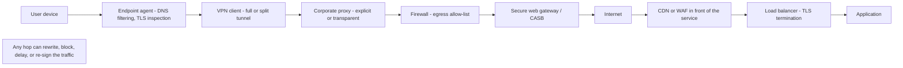
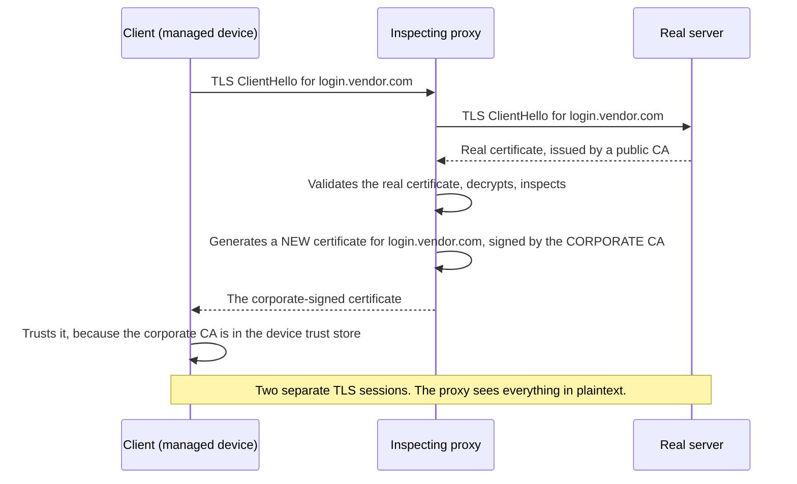
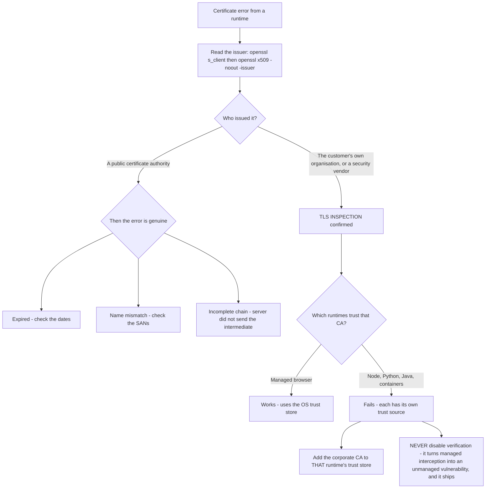
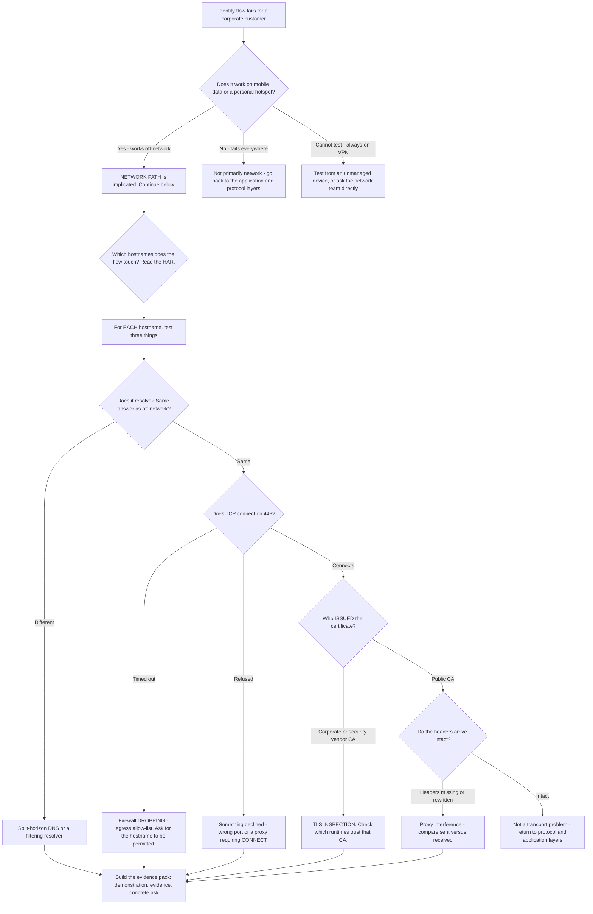

# Part 023 - Networking Realities: Proxies, Firewalls, TLS Inspection, VPN

> Section goal: Handle the corporate network layer that turns clean identity flows into confusing ones. Enterprise customers rarely have a direct path to the internet, and the equipment in between changes what your evidence looks like. This is the Part where your five years of network troubleshooting is at its most directly valuable.

Covers index item **023**. Maps to JD signals: *knowledge of HTTP*, *knowledge of encryption*, *basic security concepts*, *instinctive ability to subdivide problems into basic components*, and *serve as internal and external point of contact*.

---

## 1. Start From Zero: There Is Rarely a Direct Path

A developer's mental model is: browser → internet → server.

An enterprise reality is:



**Every hop is a place a flow can break in a way that looks like an application bug.** Your job is frequently to prove *which* hop, and then hand the customer evidence for the team that owns it.

> **Analogy.** Posting a letter from inside a secure facility. It passes through a mail room that opens and inspects everything, a security desk that checks the destination against an approved list, and a courier that repackages it. The letter arrives — but re-sealed in a different envelope, possibly delayed, possibly refused, and the recipient sees the facility's postmark rather than yours.
>
> **Where it stops:** a re-sealed envelope is visible. TLS inspection is invisible to the user, and often invisible to the developer too.

### 🔍 Plain-English deep-dive: why this is *your* problem even though it is *their* network

A developer whose login fails will open a ticket with the identity vendor, because that is where the error appeared. They will not open a ticket with their own network team, because they have no evidence pointing there.

**Producing that evidence is a core part of this role.** From Part 003: when the fault lies with the customer's own infrastructure, your deliverable is an **evidence pack** they can take to their network team — not a fix, and not a dismissal.

The pack needs three things:

1. **A demonstration that the flow works** without the network in the path (mobile data, or your own reproduction).
2. **Specific evidence of interference** — a certificate issuer that is not the real one, a rewritten header, a blocked hostname.
3. **A concrete, actionable ask** — "please allow-list these hostnames on 443, and exclude them from TLS inspection."

That is exactly the *"serve as internal and external point of contact"* duty. Getting it right converts a stalled ticket into a resolved one within a day.

---

## 2. Proxies

A **proxy** sits between a client and a server and forwards traffic on the client's behalf.

| Type | How the client knows | Behavior |
|---|---|---|
| **Explicit** | Configured, or discovered via PAC/WPAD | Client sends `CONNECT` for HTTPS |
| **Transparent** | Client does not know | Traffic is intercepted in the network path |
| **Reverse** | Sits in front of the *server* | CDN, WAF, load balancer |
| **SOCKS** | Configured | Lower-level, protocol-agnostic |

### What proxies do to identity traffic

| Behavior | Symptom | Evidence |
|---|---|---|
| **Blocks a hostname** | Login page will not load | Proxy error page instead of the expected response |
| **Strips headers** | Correlation IDs missing; occasionally `Authorization` on redirects | Compare headers sent versus received |
| **Rewrites `User-Agent`** | Device or browser detection misfires | Compare with a direct connection |
| **Buffers responses** | Slow or timing-sensitive flows break | Timing differences in the HAR |
| **Caches aggressively** | Stale discovery document or JWKS | `Cache-Control` and `Age` headers |
| **Rewrites URLs** | Redirect URI mismatch | Compare the sent URL against the received one |
| **Injects headers** | `X-Forwarded-*`, `Via`, proxy-specific | Look for them in the request the server received |
| **Fails on `CONNECT`** | Some hosts work, others do not | Per-hostname allow-list |

### 🔍 Plain-English deep-dive: PAC files and the "some users only" pattern

A **PAC file** (Proxy Auto-Configuration) is a small JavaScript file that tells a browser, per destination, whether to use a proxy and which one. Enterprises use them to send internal traffic direct and external traffic through inspection.

Three things make PAC files a recurring cause of baffling tickets:

1. **They are per-destination.** `app.customer.com` may go direct while `tenant.vendor.com` goes through a proxy — so one half of a login flow is inspected and the other is not.
2. **They differ by location and device.** Office, home, and VPN can each get a different PAC file, so the same user has different behavior depending on where they are.
3. **They change without notice.** A network team edits the PAC, and identity flows break for a subset of users with no application change. This is Part 009's "nothing changed" in a new costume.

**The diagnostic question:** *"Does it work on mobile data or a personal hotspot?"* That single test removes the entire corporate path — proxy, PAC, VPN, and inspection — in about thirty seconds.

**Analogy:** a delivery routing sheet that sends some parcels through a depot and others direct, differs by which van you are on, and gets rewritten overnight without telling the drivers. **Where it stops:** a driver could read the sheet. A user usually cannot see their PAC file, and may not know one exists.

> 💡 **Tie-in to your background:** proxies, firewalls, ports, and routing are on your CV, and you have run the mobile-data test on real escalations. Most people entering customer identity have never configured a proxy in their life. **Say this out loud in the interview** — it is a genuine differentiator, and the mobile-data question is a concrete, memorable example.

---

## 3. TLS Inspection

This is the most consequential and least visible item in the whole Part.

**TLS inspection** (also called TLS interception, SSL inspection, or break-and-inspect) is a deliberate, sanctioned man-in-the-middle. The corporate proxy terminates the TLS connection, decrypts and inspects the traffic, then re-encrypts it using a **certificate it generates itself**, signed by a private certificate authority that the organisation has installed on every managed device.



### What it breaks

| Breaks | Why |
|---|---|
| **Certificate pinning** | The app expects a specific certificate or key and sees a different one |
| **Non-browser clients** | A backend service or CLI does not trust the corporate CA that browsers do |
| **Mutual TLS** | The client certificate cannot survive the interception |
| **Some SDKs** | Language runtimes with their own bundled trust store ignore the OS store |
| **Containers and CI** | A fresh container has no corporate CA installed |
| **Mobile apps** | Platform trust rules restrict user-installed CAs |

### The diagnostic that proves it in ten seconds

```bash
openssl s_client -connect login.vendor.com:443 -servername login.vendor.com </dev/null 2>/dev/null | openssl x509 -noout -issuer -subject -dates
```

**Read the `issuer`.** If it names the customer's own organisation — or a security vendor's product — rather than a public certificate authority, the connection is being inspected. That is conclusive, it takes ten seconds, and it produces evidence the customer's network team will accept immediately.

### The "works in the browser, fails on the server" pattern

This is the signature symptom, and it is worth being able to explain crisply:

| Client | Result | Why |
|---|---|---|
| Managed browser | ✅ Works | The corporate CA is in the OS trust store, which the browser uses |
| Node.js backend | ❌ Certificate error | Node ships its own CA bundle and ignores the OS store by default |
| Python `requests` | ❌ Certificate error | Uses `certifi`'s bundle |
| Java application | ⚠️ Depends | Uses its own `cacerts` keystore |
| Docker container | ❌ Certificate error | No corporate CA installed in the image |
| curl on the same machine | ⚠️ Depends | Platform-dependent trust source |

**The correct fix is to add the corporate CA to that runtime's trust store** — an operating-system-level or runtime-level configuration the customer's IT team can do properly.



**The wrong fix, which developers reach for constantly, is to disable certificate verification.** Never advise it. Explain that it converts a *managed* interception into an *unmanaged* vulnerability: the runtime will then accept literally any certificate, including a genuine attacker's, and the setting will ship to production.

---

## 4. Firewalls and Egress Control

| Control | What it does | Symptom |
|---|---|---|
| **Egress allow-list** | Only listed destinations permitted | Some hostnames work, others time out |
| **Port restriction** | Only 80/443 permitted | Non-standard ports fail |
| **Protocol restriction** | UDP/443 blocked | HTTP/3 fails; silent fallback or failure (Part 012) |
| **Geo-blocking** | Regions blocked | Works in one country, not another |
| **Deep packet inspection** | Content-based blocking | Specific requests fail, others succeed |
| **Rate limiting at the edge** | Caps outbound volume | Intermittent failures under load |

### Refused versus timed out — restated because it matters here

From Part 011:

- **Connection refused** = something answered and declined. Wrong port, service down, or a firewall configured to *reject*.
- **Connection timed out** = nothing answered at all. A firewall configured to *drop*, a wrong IP, or a host that is down.

**Most corporate firewalls drop rather than reject**, because dropping gives an attacker no information. So a timeout is the more common enterprise symptom — and it points at the network team rather than at the service.

### The hostname list problem

Identity flows touch more hostnames than customers expect:

| Hostname category | Example purpose |
|---|---|
| The tenant's own domain | `/authorize`, `/token`, JWKS |
| The custom domain, if configured | Same, on the customer's domain |
| Static asset and CDN hosts | Login page assets, scripts, fonts |
| Upstream identity providers | Entra ID, Google, and their asset hosts |
| MFA and factor providers | Push, SMS, or hardware-token services |
| Status and telemetry hosts | Health and diagnostics |

**A customer who allow-lists only the main tenant domain will get a login page that half-renders, or an MFA step that fails.** Asking for the vendor's published hostname list — and comparing it against what the customer actually allowed — is a routine, high-yield check.

---

## 5. VPN and Split Tunnelling

| Mode | Behavior | Identity consequence |
|---|---|---|
| **Full tunnel** | All traffic goes through the corporate network | Everything is subject to proxy, inspection, and egress rules |
| **Split tunnel** | Corporate destinations tunnelled; the rest direct | **Different halves of one flow take different paths** |
| **Always-on** | Cannot be disabled by the user | The mobile-data test is unavailable on that device |
| **DNS split** | Corporate DNS for some domains | Split-horizon resolution differences (Part 011) |

### 🔍 Plain-English deep-dive: why split tunnelling produces the strangest symptoms

Split tunnelling decides, per destination, whether traffic goes through the corporate network or straight to the internet.

Now consider a login flow that touches three hostnames: the application, the identity tenant, and an upstream identity provider. Under a split-tunnel policy those three can each take a **different path** — one direct, one through the proxy with inspection, one blocked entirely.

The result is a flow that **fails at one specific hop, consistently**, while everything either side of it works perfectly. That is genuinely confusing if you assume a single network path, and it produces reports like *"the login page loads and I can type my password, but then it just hangs."*

**The diagnostic sequence:**

1. Which hostnames does the flow touch? (Read the HAR.)
2. For each, does it resolve, connect, and present a real certificate?
3. Do the answers differ between hostnames? **If yes, that is a routing policy difference, not an application bug.**

**Analogy:** a delivery round where some addresses are served by the local depot and others by a regional hub, and one hub is on strike. Most parcels arrive; a specific subset never does. **Where it stops:** a depot outage is announced. A split-tunnel policy is invisible to everyone except the network team.

---

## 6. Failure Modes

| Failure mode | Symptom | Consequence | Correction |
|---|---|---|---|
| **Not asking about the network** | Investigating application code for days | Wrong layer entirely | Ask the mobile-data question early |
| **Advising certificate bypass** | "Just disable verification" | Ships a vulnerability to production | Add the corporate CA to the runtime's trust store |
| **Assuming one network path** | Confused by partial failures | Miss split tunnelling | Test each hostname independently |
| **Only checking the main domain** | Login page half-renders | Incomplete allow-list | Compare against the vendor's published hostname list |
| **Ignoring "works in browser, fails on server"** | Treating it as a code bug | Miss TLS inspection entirely | Check the certificate issuer per runtime |
| **Missing HTTP/3 blocking** | Intermittent, unexplained failures | Silent fallback confusion | Ask whether UDP/443 is permitted |
| **Not asking about PAC changes** | "Nothing changed" | Miss a network-side change | Ask what changed on the *network* in 72 hours |
| **Blaming the customer's network without proof** | Dismissive, and sometimes wrong | Relationship damage | Produce evidence, then hand it over |
| **Not producing an evidence pack** | "It's your network" and close | Customer cannot act; ticket recurs | Demonstration, evidence, and a concrete ask |
| **Ignoring geo differences** | Works in one office, not another | Miss geo-blocking or regional routing | Test from multiple locations |

---

## 7. Troubleshooting Decision Tree



### Worked example

*"Our staff can log in from home but not from the office. The login page loads, they enter their password, and then it hangs. Same laptops, same browser."*

1. **The location difference is the whole clue.** Same device, same browser, different network → network path.
2. **Confirm:** does it work on mobile data while in the office? Yes. **Network confirmed.**
3. **Which hostnames?** From a HAR captured at home: the application, the tenant domain, and — at the point where it hangs — an upstream identity provider, because this connection federates to their own Entra ID.
4. **Test each from the office.** Application resolves and connects. Tenant resolves and connects. **Upstream provider: connection times out.**
5. **Diagnosis:** the office egress allow-list permits the application and the tenant but not the upstream provider's hostnames. It "hangs" because the browser is waiting on a TCP connection that is being silently dropped.
6. **Why it worked from home:** no allow-list at all.
7. **Evidence pack for their network team:**
   - The flow succeeds off-network — demonstrated on mobile data.
   - `Test-NetConnection` output showing three hostnames, two succeeding and one timing out, from an office machine.
   - The specific hostnames required, from the vendor's published list.
   - The ask: *"please permit outbound 443 to these hostnames from the office network."*
8. **What not to say:** "it's your network, contact your IT team." True, useless, and it leaves the customer with no way forward.

Notice that steps 4–5 are pure Part 011 layered triage, applied per hostname rather than once. That is the only adaptation needed.

---

## 8. Lab: Prove Network Interference

**Purpose.** Build the evidence-gathering commands and produce a reusable evidence-pack template, using only systems you own.

**Prerequisites.** Part 007's lab tenant, PowerShell, `openssl`, `curl`. **Your own tenant and your own machine only.**

**Steps.**

1. Create `okta-prep/labs/023-network/`.
2. **Hostname inventory.** From a Part 021 HAR of a full login, list every distinct hostname the flow touched. Save as `hostnames.md`. Note which are the tenant, which are assets, and which are upstream.
3. **Per-hostname test script.** Write `net-check.ps1`: for each hostname, run `Resolve-DnsName`, `Test-NetConnection -Port 443`, and an `openssl s_client` certificate-issuer check, and print a single table row per host. **This is the script you will actually run on tickets.**
4. **Baseline.** Run it on your normal network. Save the output.
5. **Certificate issuer check.** For each hostname, record the issuer, subject, SANs, and validity dates. Confirm the issuers are public CAs. Save as `cert-issuers.md`.
6. **Simulate a block — locally.** Add a hosts-file entry pointing one of the tenant's *asset* hostnames to `127.0.0.1` where nothing is listening. Re-run the flow and record the exact symptom and where in the HAR it appears. **Remove the entry immediately afterwards.**
7. **Simulate a refusal versus a drop.** Test a port where nothing listens on `localhost` (refused) and a routable address that drops (use a reserved documentation address such as `192.0.2.1`). Record the two different failures and their timings. **This is Part 011's distinction, measured.**
8. **Local inspecting proxy (optional, advanced).** If you use a local debugging proxy on your own machine, enable HTTPS decryption, then re-run the issuer check and record that the issuer is now the proxy's own CA. **Disable it and remove its CA from your trust store when finished.** This demonstrates §3 first-hand.
9. **Runtime trust comparison.** With the local proxy active, make the same HTTPS request from: the browser, curl, Node.js, and Python. Record which succeed and which fail. **This is the "works in browser, fails on server" pattern, reproduced on your own machine.**
10. **Evidence pack template.** Write `network-evidence-pack.md`: sections for the off-network demonstration, per-hostname results table, certificate issuer findings, the specific hostnames and ports required, and a single concrete ask. Under one page.
11. **Failure catalog + manifest.** Add rows for each simulated failure. Complete `MANIFEST.md`, noting honestly which steps were simulated locally rather than observed in a real corporate environment.

**Expected evidence.** A hostname inventory, a working per-hostname check script, a baseline run, a certificate-issuer table, two simulated block symptoms, a refused-versus-dropped timing comparison, a runtime trust comparison, and a one-page evidence-pack template.

**Validation rubric.**

| Check | Pass condition |
|---|---|
| Inventory complete | Every hostname from a real capture, categorised |
| Script works | One table row per host, three checks each |
| Issuers recorded | Issuer, subject, SANs, and dates for every hostname |
| Block simulated | Exact symptom recorded, and the hosts-file entry removed afterwards |
| Refused vs dropped | Both reproduced, with the timing difference noted |
| Runtime comparison | At least three runtimes tested, results differ as expected |
| Proxy cleaned up | If used: decryption disabled and its CA removed from the trust store |
| Pack is actionable | One page, ending in a single concrete ask |
| Honest labelling | Manifest states clearly which findings were simulated locally |

**Cleanup and privacy.** Everything runs against your own tenant and your own machine. **Do not** probe, scan, or test any third-party or employer network, and do not attempt to characterise a corporate proxy you do not administer. Remove every hosts-file entry you add. If you enable a local inspecting proxy, **remove its CA from your trust store afterwards** — leaving it installed is a standing risk to your own machine.

---

## 9. JD Mapping

| Supplied JD signal | How this Part supports it |
|---|---|
| Knowledge of HTTP | Proxy behavior, header rewriting, `CONNECT`, and caching effects |
| Knowledge of encryption | §3's TLS inspection mechanism and per-runtime trust stores |
| Basic security concepts | Why interception is sanctioned MITM, and why bypassing verification is unacceptable |
| Instinctive ability to subdivide problems | §7's per-hostname layered triage |
| **Serve as internal and external point of contact** | §1's evidence-pack duty, and §7's worked example ending in a concrete ask |
| Strong analytical and problem-solving skills | The mobile-data test as a single high-value discriminator |
| Customer-obsessed attitude | Refusing to close with "it's your network" |
| Collaborate with other departments | The pack is written *for the customer's network team* |

---

## 10. Candidate Honesty Note

- **Production transfer (strongest in the guide):** TCP/IP, OSI, DNS, proxies, firewalls, ports, routing, Wireshark, Netsh, and Network Monitor are all on your CV and were used on real enterprise escalations. This Part is almost entirely re-framing existing expertise for a new domain.
- **Say this explicitly in the interview:** *"Most people coming into customer identity have never configured a proxy or read a packet capture. I've spent five years doing exactly that on enterprise escalations. When a corporate customer's login fails and their developer is convinced it's the identity platform, I can usually prove which hop is responsible and hand them evidence their network team will accept."* That is true, specific, and genuinely differentiating.
- **The single most memorable thing you own:** the mobile-data test. *"Does it work on a personal hotspot?"* removes proxy, PAC, VPN, and inspection in thirty seconds. It is concrete, it is free, and it is the kind of practical detail that signals real experience.
- **Be honest about the lab's limits:** you simulated interception locally rather than characterising a real corporate proxy. Say so; it is still valid evidence that you understand the mechanism.
- **Never advise disabling certificate verification.** State this unprompted if TLS inspection comes up — it converts a managed interception into an unmanaged vulnerability, and the setting always ships.
- **Do not claim** network engineering ownership. You read network evidence expertly and produce actionable packs — which is exactly what this role needs.

---

## 11. Official Source Anchors

Accessed **26 August 2026**.

| Source | What it defines |
|---|---|
| IETF RFC 9110 §9.3.6 and RFC 9110's proxy semantics | `CONNECT`, forwarding, and intermediary behavior |
| IETF RFC 7239 (Forwarded HTTP Extension) | `Forwarded` and the de-facto `X-Forwarded-*` headers |
| IETF RFC 8446 (TLS 1.3) | Handshake structure, SNI, and what an interception necessarily changes |
| IETF RFC 6125 | Server identity verification against a certificate |
| Microsoft Learn — `Resolve-DnsName`, `Test-NetConnection`, proxy configuration, WPAD/PAC | The Windows tooling used in the lab |
| OpenSSL `s_client` documentation | The issuer check in §3 |
| Node.js TLS documentation and `NODE_EXTRA_CA_CERTS` | Why Node ignores the OS store, and the supported fix |
| Python `certifi` and `requests` TLS documentation | The equivalent for Python |
| Auth0 and Okta documentation — required hostnames and IP allow-listing | The published lists to compare against in §4 |
| Browser documentation on HTTP/3 and QUIC | Why UDP/443 blocking matters (§4) |

**Revalidate after 26 August 2026:** vendor hostname and IP lists, which change as infrastructure evolves — always fetch the current list rather than reusing an old one.

---

## ⭐ Likely Interview Questions for This Section

### Q1. "A corporate customer's login works from home but not from the office. Where do you start?"
> *Model answer:* "The location difference is the diagnosis waiting to happen — same device, same browser, different network means the network path. First I'd confirm with the cheapest possible test: does it work on mobile data or a personal hotspot while they're in the office? That removes proxy, PAC, VPN, and TLS inspection in about thirty seconds. Then I'd get a HAR and list every hostname the flow touches, because it's usually more than people expect — the app, the tenant, asset hosts, and often an upstream identity provider. Then I test each hostname independently for three things: does it resolve, and to the same address as off-network; does TCP connect on 443; and who issued the certificate. Where those answers differ between hostnames, that's a routing or allow-list policy difference, not an application bug."

### Q2. "How do you detect TLS inspection?"
> *Model answer:* "Read the certificate issuer. One `openssl s_client` command against the hostname, then pipe to `openssl x509 -noout -issuer`. If the issuer names the customer's own organisation or a security vendor's product rather than a public certificate authority, the connection is being intercepted — the proxy terminated TLS, decrypted, and re-signed with a private CA that's installed on managed devices. It takes ten seconds and it's conclusive, which matters because it produces evidence the customer's network team will accept immediately rather than a theory. The signature symptom that usually prompts me to check is 'it works in the browser but fails from our backend' — the browser uses the OS trust store which has the corporate CA, while Node ships its own CA bundle, Python uses certifi, and a Docker container has neither."

### Q3. "A developer wants to disable certificate verification to get past a TLS error. What do you say?"
> *Model answer:* "No, and then I'd solve their actual problem, because that request is always a symptom. Disabling verification means the connection is encrypted but unauthenticated — they'd accept literally any certificate, including a real attacker's, and it's undetectable. And the thing about a development workaround is that it ships. So I'd diagnose properly: check the issuer, and if it's a corporate CA then this is sanctioned TLS inspection and the correct fix is adding that CA to the runtime's trust store — `NODE_EXTRA_CA_CERTS` for Node, the certifi bundle or a `REQUESTS_CA_BUNDLE` for Python, the keystore for Java, or the base image for containers. That's something their IT team can do properly and consistently. The framing I'd use is that disabling verification converts a *managed* interception into an *unmanaged* vulnerability."

### Q4. "What's the difference between a connection being refused and timing out?"
> *Model answer:* "Refused means something answered and actively declined — the packet reached a host and got a reset, so it's usually the wrong port, a service that's down, or a firewall configured to reject. Timed out means nothing answered at all — packets are vanishing, so it's usually a firewall configured to drop, a wrong IP, or an unreachable host. The distinction matters practically because most corporate firewalls drop rather than reject, since dropping gives an attacker no information. So a timeout in an enterprise environment is the common symptom and it points at an egress allow-list, which tells the customer *which internal team* to talk to. That's useful — 'your firewall is dropping traffic to these three hostnames' is actionable, whereas 'it doesn't connect' isn't."

### Q5. "Why do split tunnels cause such confusing symptoms?"
> *Model answer:* "Because they make the network path *per-destination*, and a login flow touches several hostnames. Under a split-tunnel policy, the application might go direct, the identity tenant through the corporate proxy with inspection, and an upstream identity provider might be blocked entirely. So the flow fails at one specific hop, consistently, while everything either side works perfectly — which is genuinely baffling if you assume a single network path. It presents as 'the login page loads and I can type my password, but then it just hangs', because the browser is waiting on a TCP connection that's being silently dropped. The fix in the diagnosis is simply to stop treating the network as one thing: test each hostname independently for resolution, connectivity, and certificate issuer, and compare the answers."

### Q6. "How do you hand a network problem back to the customer without it feeling like a dismissal?"
> *Model answer:* "By producing evidence rather than a verdict, because 'it's your network, contact IT' is true, useless, and leaves them with nothing to act on. Their developer opened the ticket with us because that's where the error appeared — they have no evidence pointing at their own network team, and no standing to raise it. So my deliverable is a one-page evidence pack with three things: a demonstration that the flow works off-network, which I've usually done on mobile data or in my own reproduction; specific evidence of interference, like a per-hostname table showing two hosts connecting and one timing out, or a certificate issued by their own CA; and one concrete ask, like 'please permit outbound 443 to these hostnames and exclude them from TLS inspection.' That converts a stalled ticket into something resolvable within a day, and I keep ownership until they confirm."

### Q7. "Why does allow-listing only the main tenant domain not work?"
> *Model answer:* "Because an identity flow touches more hostnames than people expect. There's the tenant's own domain for authorize, token, and JWKS. There's the custom domain if one's configured. There are static asset and CDN hosts serving the login page's scripts, styles, and fonts. There are upstream identity providers and *their* asset hosts if the customer federates to Entra ID or a social provider. And there are MFA or factor providers for push and SMS. So a customer who allow-lists just the main domain gets a login page that half-renders, or an MFA step that fails, and it looks like a broken product. The routine check is to fetch the vendor's published hostname list and compare it against what they've actually permitted — and to fetch it fresh rather than reusing an old copy, because infrastructure changes."

### Q8. "How does your networking background help in an identity role?"
> *Model answer:* "Directly, and I think it's a differentiator rather than an adjacent skill. Every identity flow is HTTP over TLS, resolved by DNS, and for enterprise customers it crosses a proxy, a firewall, and often TLS inspection. When one of those interferes, the developer sees an error in the browser and opens a ticket with the identity vendor, because that's where the symptom appeared. Being able to prove which hop is responsible — and produce evidence their network team will accept — resolves a class of ticket that otherwise stalls for weeks. I've spent five years doing exactly that at Microsoft with Wireshark, Netsh, Network Monitor, and HAR analysis on enterprise escalations. Most people entering customer identity come from web development and have never configured a proxy. The concrete example I'd give is the mobile-data test — 'does it work on a personal hotspot?' removes the entire corporate path in thirty seconds, and almost nobody thinks to ask it first."

---

## 🧠 30-Second Memory Hooks

- **Enterprise customers rarely have a direct path.** Every hop can rewrite, block, delay, or re-sign.
- **The mobile-data test:** *"Does it work on a personal hotspot?"* Removes proxy, PAC, VPN, and inspection in 30 seconds.
- **TLS inspection = sanctioned MITM.** Detect it by reading the certificate **issuer**.
- **"Works in the browser, fails on the server" = TLS inspection** — browsers use the OS store; Node, Python, Java, and containers do not.
- **Never disable certificate verification.** It turns a *managed* interception into an *unmanaged* vulnerability, and it ships.
- **Refused = declined. Timed out = dropped.** Corporate firewalls drop, so timeouts are the enterprise symptom.
- **PAC files are per-destination, per-location, and change without notice.** Classic "nothing changed".
- **Split tunnel = per-destination path** → one hop fails, everything around it works.
- **Allow-list the whole hostname list**, not just the tenant domain. Fetch it fresh.
- **UDP/443 blocked = HTTP/3 fails**, often with a silent, confusing fallback.
- **Never close with "it's your network."** Deliver: demonstration · evidence · one concrete ask.

---

## ✅ Completion Checklist

- [ ] **Knowledge:** I can detect TLS inspection in one command, explain the browser-versus-server trust difference, and distinguish refused from dropped.
- [ ] **Lab artifact:** `023-network/` contains a hostname inventory, a working per-hostname check script, a certificate-issuer table, simulated block symptoms, a runtime trust comparison, and a one-page evidence-pack template.
- [ ] **Spoken:** I can deliver the office-versus-home diagnosis, ending in a concrete ask for the network team, in under 90 seconds.
- [ ] **Honesty check:** nothing was probed outside my own systems; every hosts-file entry and any local proxy CA was removed afterwards; the manifest states which findings were simulated.
- [ ] **Source check:** I have fetched the vendor's current published hostname list myself, rather than relying on an older copy.

---

*Next suggested section:* **[Part 024 - JavaScript From Zero: Syntax, Types, Scope, Objects](Part-024-javascript-from-zero-syntax-types-scope-objects.md)** — Group B is complete. Group C now builds the JavaScript capability the job description explicitly asks for, pitched for a Python-first engineer.
