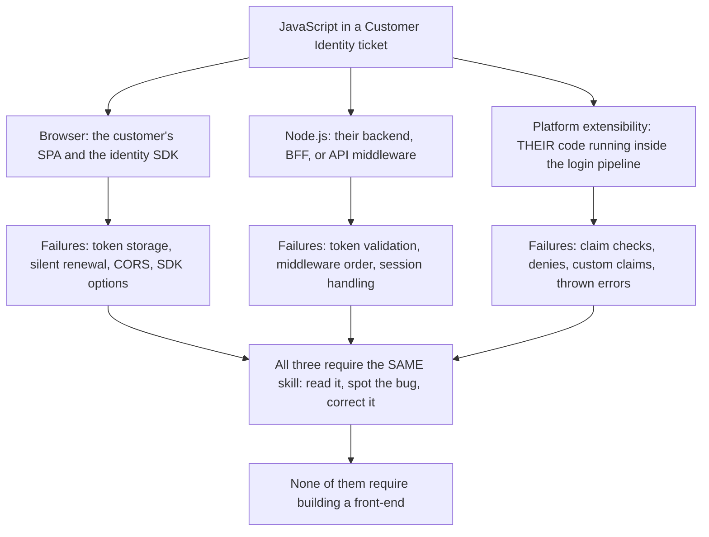
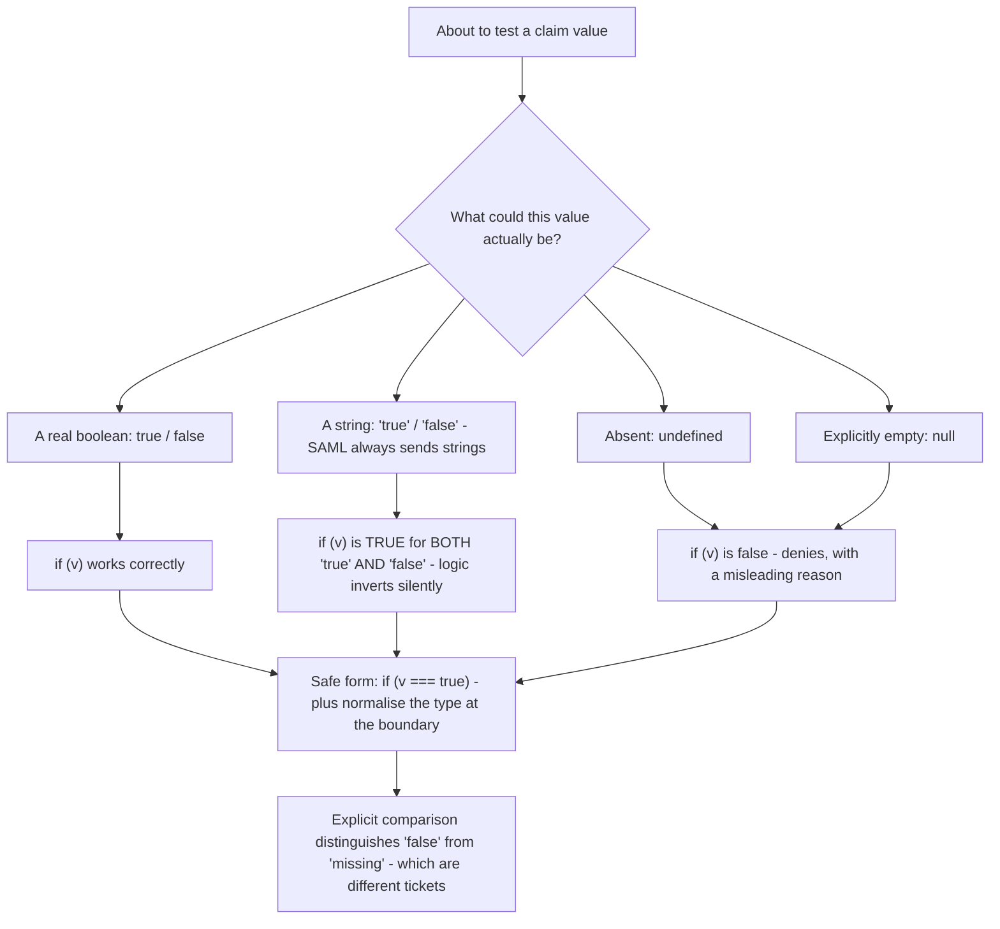
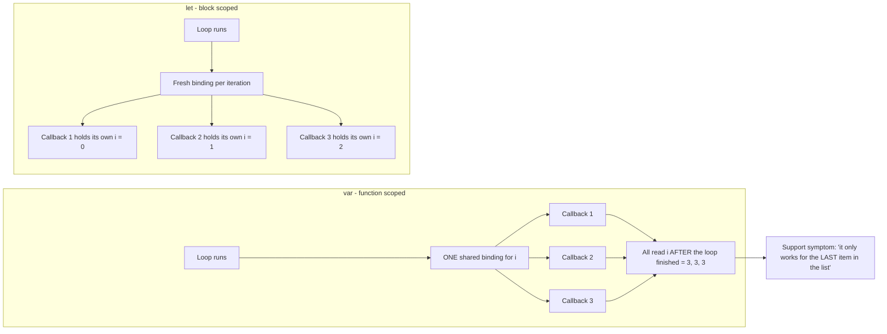
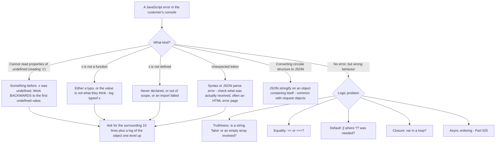

# Part 024 - JavaScript From Zero: Syntax, Types, Scope, Objects

> Section goal: Build genuine JavaScript reading ability, pitched for a Python-first engineer. The job description says "ideally JavaScript" — this Part and the nine that follow turn that from a line on your CV into something you can demonstrate. You do not need to be a front-end developer. You need to read a customer's auth code, spot the bug, and write a corrected snippet that runs.

Covers index item **024**. Maps to JD signals: *proficient in at least one programming language; ideally JavaScript*, *knowledge of software development fundamentals*, *self-starter — able to come up to speed on complex concepts with minimal assistance*, and *continuous growth*.

---

## 1. Start From Zero: Where JavaScript Runs and Why It Matters Here

**JavaScript** is the only programming language every browser can execute. That single fact is why it dominates the developer-support surface for Customer Identity.

| Runtime | What it is | Where you meet it |
|---|---|---|
| **Browser** | Executes the page's scripts | SPAs, login pages, identity SDKs |
| **Node.js** | JavaScript outside the browser | Backends, BFFs, build tooling (Part 028) |
| **Extensibility runtime** | The identity platform runs *your customer's* JavaScript | Actions and Flows (Part 103) |

That third row is worth pausing on. On a Customer Identity platform, customers write JavaScript that executes **inside the authentication pipeline**. When their login breaks, the cause is sometimes their own code running on the platform — so reading JavaScript is not optional for this role.



> **Analogy.** JavaScript is the English of the web — not because it is the best language, but because it is the one everybody already has. Learning it is less about elegance and more about being able to read what people actually wrote.
>
> **Where it stops:** unlike a natural language, JavaScript has precise, sometimes surprising rules, and misreading one of them silently produces the wrong answer rather than an obvious mistake.

### 🔍 Plain-English deep-dive: what "learning JavaScript" means for *this* job

You are not being hired to build applications. Set the target correctly:

| You **do** need to | You do **not** need to |
|---|---|
| Read a 40-line auth integration and follow it | Build a production front-end |
| Spot a wrong claim check or missing parameter | Know framework internals |
| Understand `async`/`await` and promise ordering (Part 025) | Optimise render performance |
| Write a corrected 10-line snippet that actually runs | Write test suites or CI pipelines |
| Build a small SPA and API to prove you can (Part 028–029) | Ship a product |
| Recognise dangerous patterns — secrets in client code, `eval` | Perform security audits |

**That is a far smaller target than "learn JavaScript", and it is achievable in the ten Parts of this group.** Being able to state the target precisely in an interview is itself a good answer, because it shows you understand the role rather than reciting a skill.

**Analogy:** a court interpreter needs fluent comprehension and accurate short responses — not the ability to write a novel in the language. **Where it stops:** interpreters do not have to spot bugs. You do, which means comprehension has to be genuinely reliable, not approximate.

---

## 2. Python to JavaScript: The Translation Table

Your strongest language is Python. Use it as the anchor rather than starting from nothing.

| Concept | Python | JavaScript |
|---|---|---|
| Variable | `x = 1` | `let x = 1;` or `const x = 1;` |
| Constant | `X = 1` (convention only) | `const x = 1;` (enforced rebinding) |
| String | `"a"` or `'a'` | `"a"`, `'a'`, or `` `a ${x}` `` (template literal) |
| Format string | `f"hi {name}"` | `` `hi ${name}` `` |
| List / array | `[1, 2, 3]` | `[1, 2, 3]` |
| Dict / object | `{"a": 1}` | `{ a: 1 }` — keys need no quotes if valid identifiers |
| None / null | `None` | `null` **and** `undefined` — *two* different things |
| Boolean | `True` / `False` | `true` / `false` — lowercase |
| Function | `def f(a): return a` | `function f(a) { return a; }` or `const f = (a) => a;` |
| Comment | `# ...` | `// ...` or `/* ... */` |
| Block delimiter | Indentation | Braces `{ }` |
| Statement end | Newline | Semicolon (usually optional, but write them) |
| String length | `len(s)` | `s.length` |
| Array length | `len(a)` | `a.length` |
| Loop over list | `for x in a:` | `for (const x of a) { }` |
| Loop over dict keys | `for k in d:` | `for (const k in obj) { }` or `Object.keys(obj)` |
| List comprehension | `[f(x) for x in a]` | `a.map(f)` |
| Filter | `[x for x in a if p(x)]` | `a.filter(p)` |
| Membership | `x in a` | `a.includes(x)` |
| Exception | `try/except/finally` | `try/catch/finally` |
| Raise | `raise ValueError("x")` | `throw new Error("x");` |
| Import | `import json` | `import json from "..."` or `require("...")` |
| Async function | `async def f():` | `async function f() { }` |
| Await | `await g()` | `await g();` |
| Sleep | `time.sleep(1)` | `await new Promise(r => setTimeout(r, 1000));` |
| JSON parse | `json.loads(s)` | `JSON.parse(s)` |
| JSON serialise | `json.dumps(o)` | `JSON.stringify(o)` |
| Base64 decode | `base64.b64decode(s)` | `Buffer.from(s, "base64")` (Node) / `atob(s)` (browser) |

> 💡 **Tie-in to your background:** you already think in terms of types, control flow, functions, and dictionaries. Everything above is a syntax substitution, not a new concept. The genuinely *new* material is §§3–6 — `undefined` versus `null`, truthiness, `this`, and closures. Budget your time there.

---

## 3. Types, and the Three That Cause Bugs

JavaScript has seven primitive types plus objects.

| Type | Example | Note |
|---|---|---|
| `string` | `"abc"` | Immutable |
| `number` | `42`, `1.5` | **One numeric type — 64-bit float** (Part 018's precision trap) |
| `boolean` | `true` | |
| `undefined` | `undefined` | "This has no value assigned" |
| `null` | `null` | "This is deliberately empty" |
| `bigint` | `123n` | For integers beyond safe float range |
| `symbol` | `Symbol("x")` | Rare in support work |
| `object` | `{}`, `[]`, `function(){}` | Arrays and functions are objects |

### 🔍 Plain-English deep-dive: `undefined` versus `null` versus missing

Python has one `None`. JavaScript has **two** absent-ish values, and the distinction matters in identity code.

| Value | Means | How you get it |
|---|---|---|
| `undefined` | Never assigned | A declared variable with no value; a missing object property; a missing function argument |
| `null` | Deliberately empty | Someone explicitly assigned it, or JSON contained `null` |
| *(property absent)* | The key does not exist | `"key" in obj` is `false` |

```js
const token = { sub: "abc123", email: null };

token.sub          // "abc123"
token.email        // null       - present, explicitly empty
token.name         // undefined  - not present at all
"name" in token    // false
token.email === null       // true
token.name === undefined   // true
token.email == null        // true  - loose equality treats them alike
```

**Why this produces real bugs.** From Part 018, an API distinguishes "set to null" from "field absent". A claim-checking function written as:

```js
if (!claims.email_verified) { denyAccess(); }
```

...treats `false`, `undefined`, `null`, `0`, and `""` identically. If the claim is simply *absent* — because the connection does not provide it — this denies access with a message about unverified email, which is a confusing and wrong diagnosis.

**The correct form is explicit:**

```js
if (claims.email_verified !== true) { denyAccess("Email verification claim missing or false"); }
```

**Analogy:** a form where "no" and "left blank" and "question not printed on this version" are three different states. Treating them as one loses information you needed. **Where it stops:** a paper form is visibly blank. In JavaScript the difference is invisible until you check explicitly.

---

## 4. Truthiness and Equality

This is where a Python developer's intuition is *almost* right, which is more dangerous than being wrong.

### Falsy values — the complete list

```
false    0    -0    0n    ""    null    undefined    NaN
```

**Everything else is truthy** — including:

| Value | Truthy? | Surprises people |
|---|---|---|
| `"false"` | ✅ **true** | **A non-empty string is always truthy** |
| `"0"` | ✅ true | Same |
| `[]` | ✅ true | Python's empty list is falsy — **JavaScript's is not** |
| `{}` | ✅ true | Python's empty dict is falsy — **JavaScript's is not** |
| `" "` | ✅ true | Whitespace is non-empty |

### 🔍 Plain-English deep-dive: `"false"` is truthy, and why it inverts identity logic

Part 018 flagged booleans-as-strings as a JSON trap. Here is the mechanism.

An upstream identity provider returns a claim as a *string* rather than a boolean — perhaps `"email_verified": "false"`. The receiving code does:

```js
if (claims.email_verified) { allowAccess(); }
```

`"false"` is a non-empty string, therefore truthy, therefore access is **allowed** for an unverified email. The logic is exactly inverted, silently, with no error.

This is not hypothetical — SAML attribute values are always strings (Part 083), and mapping them into claims without type conversion is a routine source of this bug.

**Two habits that prevent it:**

1. **Compare explicitly:** `if (claims.email_verified === true)`.
2. **Normalise at the boundary:** convert incoming values to the expected type once, where they enter the system, rather than trusting them everywhere.

**Analogy:** a switch labelled "OFF" that is nonetheless in the on position, because someone glued the label on rather than wiring it. **Where it stops:** you can see a physical switch. Here the only clue is a user who should have been blocked and was not.

### `==` versus `===`

| Operator | Behavior |
|---|---|
| `===` | **Strict** — no type conversion. `1 === "1"` is `false` |
| `==` | **Loose** — converts types first. `1 == "1"` is `true` |

**Rule: always use `===`.** The single common exception is `x == null`, which is a deliberate idiom meaning "null or undefined".

| Expression | Result | Comment |
|---|---|---|
| `0 == ""` | `true` | Both convert to `0` |
| `0 == "0"` | `true` | |
| `"" == "0"` | `false` | **Not transitive** — which is why `==` is untrustworthy |
| `null == undefined` | `true` | The useful idiom |
| `null === undefined` | `false` | |
| `NaN === NaN` | `false` | Use `Number.isNaN(x)` |



---

## 5. Scope, `const`, and Closures

### The three declarations

| Keyword | Scope | Re-assignable? | Hoisting behavior | Use it? |
|---|---|---|---|---|
| `var` | Function | Yes | Hoisted, initialised `undefined` | ❌ Legacy — avoid |
| `let` | **Block** | Yes | Hoisted but unusable before declaration | ✅ When reassignment is needed |
| `const` | **Block** | **No** | Same as `let` | ✅ **Default choice** |

### What `const` actually guarantees

`const` prevents **rebinding the name**, not mutating the value.

```js
const config = { audience: "https://api.example.com" };
config.audience = "changed";   // ALLOWED - the object was mutated
config = {};                   // TypeError - rebinding is not allowed

const list = [1, 2];
list.push(3);                  // ALLOWED
```

**Why this matters in support:** a developer who believes `const` makes a config object immutable may not suspect that middleware elsewhere mutated it. When a value differs from what was configured, `const` is *not* evidence that nothing changed it.

### Closures

A **closure** is a function that remembers the variables from where it was defined, even after that scope has finished.

```js
function makeTokenCache() {
  let token = null;                     // private to this closure
  let expiresAt = 0;

  return {
    get() {
      if (token && Date.now() < expiresAt - 60_000) return token;
      return null;
    },
    set(newToken, expiresInSeconds) {
      token = newToken;
      expiresAt = Date.now() + expiresInSeconds * 1000;
    }
  };
}

const cache = makeTokenCache();
```

`token` is unreachable from outside — a genuinely private variable. This is exactly the token-caching pattern from Part 019, and recognising it in a customer's code tells you immediately whether they cache correctly.



### 🔍 Plain-English deep-dive: the classic closure-in-a-loop bug

```js
// Broken - with var
for (var i = 0; i < 3; i++) {
  setTimeout(() => console.log(i), 100);
}
// prints: 3, 3, 3

// Correct - with let
for (let i = 0; i < 3; i++) {
  setTimeout(() => console.log(i), 100);
}
// prints: 0, 1, 2
```

`var` is **function-scoped**, so all three callbacks close over the *same* `i`, which is `3` by the time they run. `let` is **block-scoped**, creating a fresh binding each iteration.

**Where this appears in identity code:** a loop that starts several token requests or several silent-renewal attempts, each capturing loop state. With `var`, every callback sees the final value — so all of them use the last connection name, the last user ID, or the last audience. The symptom is "it only works for the last item in the list", which is a genuinely confusing report until you know the pattern.

**Analogy:** three people told "write down the number on the board later." With `var`, there is one board and they all read it after the final change. With `let`, each is handed their own copy at the time. **Where it stops:** people would notice the board changing. Callbacks execute silently and produce plausible-looking wrong results.

---

## 6. Objects, Destructuring, and Safe Access

### Objects

```js
const user = {
  sub: "auth0|abc",
  email: "a@example.com",
  app_metadata: { plan: "pro" }
};

user.sub                      // dot access
user["sub"]                   // bracket access - needed for dynamic keys
user.app_metadata.plan        // nested
user.missing                  // undefined - no error
user.missing.plan             // TypeError: Cannot read properties of undefined
```

**That last line is the most common runtime error in JavaScript**, and it is worth being able to read instantly: *"Cannot read properties of undefined (reading 'plan')"* means `user.missing` was `undefined`, and the code then tried to read `.plan` from it.

### Optional chaining and nullish coalescing

```js
user.app_metadata?.plan          // undefined if app_metadata is missing - no throw
user.app_metadata?.plan ?? "free" // default only if null or undefined
user.app_metadata?.plan || "free" // default if FALSY - so "" and 0 also become "free"
```

| Operator | Triggers on |
|---|---|
| `?.` | `null` or `undefined` — stops evaluation safely |
| `??` | `null` or `undefined` only |
| `\|\|` | **Any falsy value** — `0`, `""`, `false` included |

**`??` versus `||` is a real bug source.** `const retries = config.retries || 3;` silently turns a deliberate `0` into `3`. Use `??` when zero or empty string are legitimate values.

### Destructuring

```js
const { sub, email, name = "unknown" } = user;
const [first, second] = ["a", "b"];

function handler({ event, api }) { /* ... */ }   // very common in identity extensibility code
```

You will see destructured parameters constantly in Actions and SDK callbacks (Part 103). Being able to read them is essential.

### Spread and rest

```js
const copy = { ...user };                                   // shallow copy
const merged = { ...defaults, ...overrides };               // later wins
const withAudience = { ...params, audience: "https://api" };
const arr = [...a, ...b];
```

**Shallow copy is a trap:** `{ ...user }` copies `app_metadata` **by reference**, so mutating `copy.app_metadata.plan` also changes the original.

---

## 7. Failure Modes

| Failure mode | What it looks like | Consequence | Correction |
|---|---|---|---|
| **Truthiness check on a claim** | `if (claims.email_verified)` | `"false"` is truthy → inverted logic | `=== true` |
| **`\|\|` for defaults** | `config.retries \|\| 3` | A deliberate `0` becomes `3` | `??` |
| **`==` instead of `===`** | `if (id == 0)` | Surprising conversions, non-transitive | Always `===` |
| **`undefined` treated as `null`** | Absent claim handled as explicit empty | Wrong diagnosis surfaced to the user | Distinguish explicitly |
| **`var` in a loop with callbacks** | All callbacks see the final value | "Only works for the last item" | `let` |
| **Assuming `const` means immutable** | "Nothing can have changed it" | Missed mutation | `const` blocks rebinding only |
| **Shallow copy assumed deep** | Mutating a copy changes the original | Cross-contaminated state | Copy nested structures deliberately |
| **Reading a property of `undefined`** | `Cannot read properties of undefined` | Runtime crash | `?.` and check the *first* undefined thing |
| **Number precision on IDs** | Large numeric IDs silently rounded | A subset of records unreachable | Treat IDs as strings (Part 018) |
| **Trusting `typeof null`** | `typeof null === "object"` | Wrong branch taken | Check `x === null` explicitly |

---

## 8. Troubleshooting Decision Tree: Reading a JavaScript Error



### Worked example

A customer's Action denies login for some users with "Email not verified", but those users *are* verified.

1. **Ask for the code.** They send:
   ```js
   exports.onExecutePostLogin = async (event, api) => {
     if (!event.user.email_verified) {
       api.access.deny("Email not verified");
     }
   };
   ```
2. **Ask which users fail.** Answer: only users who signed in through their SAML enterprise connection.
3. **The mechanism:** SAML attribute values are strings (Part 083). Their attribute mapping put `"true"`/`"false"` into the claim. But `!"false"` is `false`, so `"false"` users are *allowed*, and users where the attribute is **absent** get `undefined`, so `!undefined` is `true` and they are **denied**.
4. **Confirm:** ask them to log `typeof event.user.email_verified` and its raw value for a failing user. Expect `"undefined"` or `"string"`.
5. **Fix — two parts:**
   ```js
   const verified = event.user.email_verified === true
     || event.user.email_verified === "true";

   if (!verified) {
     api.access.deny("Email verification could not be confirmed");
   }
   ```
   Better still, normalise in the attribute mapping so the claim is a real boolean at the boundary.
6. **The next trap they will hit:** the *absent* case still denies. Is that intended? For a SAML connection where the IdP has already verified the user, denying on an absent claim may be wrong — that is a policy decision they should make deliberately rather than by accident.

That answer is a Part 004 eight-element response, and the diagnosis came entirely from truthiness rules.

---

## 9. Lab: Read and Break JavaScript Deliberately

**Purpose.** Build reading reliability by observing every trap yourself, and produce the Python-to-JavaScript sheet you will revise from.

**Prerequisites.** Node.js from Part 007. A text editor. Nothing sensitive.

**Steps.**

1. Create `okta-prep/labs/024-javascript/`.
2. **Translation sheet.** Write `python-to-js.md` — reproduce §2's table **from memory first**, then correct it. Mark every row you got wrong.
3. **Truthiness table.** Write a script that loops over `[false, 0, "", "0", "false", null, undefined, NaN, [], {}, " "]` and prints each value, its `typeof`, and whether it is truthy. **Run it. Save the output.** Compare against what you predicted before running.
4. **Equality matrix.** Write a script printing a grid of `==` and `===` results for `[0, "", "0", null, undefined, false, NaN]`. Save it. Identify the non-transitive triple from §4.
5. **`null` vs `undefined` vs absent.** Build an object with one property set to `null` and one absent. Print the results of `obj.x`, `"x" in obj`, `obj.x === null`, `obj.x === undefined`, `obj.x == null`, and `JSON.stringify(obj)`. **Note that `JSON.stringify` omits `undefined` properties entirely** — record that.
6. **Closure loop.** Write both the `var` and `let` versions from §5. Run them. Record the outputs and write one line explaining the difference.
7. **`const` mutation.** Demonstrate that `const` allows property mutation but blocks rebinding. Record both outcomes including the exact `TypeError` text.
8. **Shallow copy.** Spread-copy a nested object, mutate the nested part of the copy, and show the original changed. Record it.
9. **`??` vs `||`.** Write a config-defaulting example where a deliberate `0` and an empty string are silently replaced by `||` and correctly preserved by `??`. Record both.
10. **Error catalogue.** Deliberately trigger and record the **exact** message for: reading a property of undefined, calling a non-function, using an undeclared variable, `JSON.parse` on HTML, and `JSON.stringify` on a circular object.
11. **Read real code.** Find an official quickstart for a JavaScript SPA in the vendor documentation. Read it line by line and write `quickstart-annotation.md` explaining what every line does in your own words. Flag anything you could not explain — those are your gaps.
12. **Failure catalog + manifest.** Add the five error messages as rows. Complete `MANIFEST.md`.

**Expected evidence.** A corrected translation sheet with your errors marked, a truthiness output, an equality matrix, a null/undefined comparison, closure and `const` demonstrations, a shallow-copy proof, a `??`/`||` contrast, five exact error messages, and a line-by-line quickstart annotation.

**Validation rubric.**

| Check | Pass condition |
|---|---|
| Sheet from memory first | Wrong rows marked before correcting |
| Truthiness predicted then run | Your predictions recorded alongside actual output |
| Non-transitive triple found | `0 == ""`, `0 == "0"`, `"" != "0"` identified |
| `JSON.stringify` behavior noted | You recorded that `undefined` properties disappear |
| Closure difference explained | In your own words, mentioning function vs block scope |
| `const` outcomes | Both mutation success and rebinding `TypeError` captured |
| Five error messages | Verbatim, not paraphrased |
| Quickstart annotated | Every line explained, gaps explicitly flagged |

**Cleanup and privacy.** Everything is local and synthetic. Use fake token values and `example.com` addresses throughout. If the quickstart requires a client ID, use your own lab tenant's and keep it out of any committed file — reference it from the git-ignored `secrets/` folder (Part 007).

---

## 10. JD Mapping

| Supplied JD signal | How this Part supports it |
|---|---|
| **Proficient in at least one programming language; ideally JavaScript** | The entire Part; §9 produces demonstrable evidence rather than a claim |
| Knowledge of software development fundamentals | Types, scope, equality, and object semantics are the fundamentals |
| Self-starter on complex concepts | §2's Python anchor is a deliberate self-teaching strategy, stated explicitly |
| Continuous growth | §9 step 11's gap-flagging turns reading into a measurable learning loop |
| Strong analytical and problem-solving skills | §8's tree reads any error backwards to its first cause |
| Instinctive ability to subdivide problems | "Work backwards to the first undefined value" is exactly that |
| Business and technical analysis skills | §8's worked example interrogates *which* users fail before touching the code |

---

## 11. Candidate Honesty Note

- **Say Python first, and say it confidently.** *"Python is my strongest language."* That is true, it satisfies "proficient in at least one programming language", and leading with a truth is stronger than hedging about JavaScript.
- **Then show, do not claim.** *"JavaScript I'd been using at a working level rather than a deep one, so rather than leave it as a CV line I built a SPA and an Express API with a real login flow and deliberate failure cases."* Parts 028–029 produce that artifact.
- **The strongest specific thing you own after this Part:** *"The bug that catches people in identity code is truthiness — SAML attributes are always strings, so a claim mapped as `\"false\"` is truthy and the logic inverts silently. I reproduced it in a lab."* That is precise, non-obvious, and demonstrably practised.
- **What not to claim:** front-end development experience, framework expertise, or having shipped JavaScript to production. You read it, diagnose it, and write corrected snippets — which is exactly the role.
- **If asked to write code live:** narrate your reasoning, use `const` by default, use `===`, and check for `undefined` explicitly. Correctness and clarity score far higher than cleverness in a support interview.

---

## 12. Official Source Anchors

Accessed **26 August 2026**.

| Source | What it defines |
|---|---|
| MDN Web Docs — JavaScript reference and guide | The primary, authoritative practical reference for everything in this Part |
| ECMAScript specification (ECMA-262) | Formal semantics for truthiness, equality, and scoping |
| MDN — Equality comparisons and sameness | The `==` versus `===` conversion table used in §4 |
| MDN — `null` and `undefined` | The distinction in §3 |
| MDN — closures, `let`/`const`/`var`, optional chaining, nullish coalescing | §§5–6 |
| Node.js documentation — globals, `Buffer` | Runtime differences noted in §2 |
| Auth0 and Okta JavaScript SDK documentation and quickstarts | The real code read in §9 step 11 |
| Auth0 Actions documentation — the `event` and `api` objects | The destructured-parameter style in §6 and the §8 worked example |

**Revalidate after 26 August 2026:** SDK quickstart code and Actions object shapes. The language semantics are stable.

---

## ⭐ Likely Interview Questions for This Section

### Q1. "How comfortable are you with JavaScript?"
> *Model answer:* "Python is my strongest language and I'd say that first. JavaScript I'd been using at a working level rather than a deep one, so rather than leave it as a line on my CV I built something — a single-page app and an Express API with a real login flow, token validation on the API side, and deliberate failure cases. I'd frame the target honestly: I'm not being hired to build front-ends, I'm being hired to read a customer's forty-line auth integration, spot the bug, and hand back a corrected snippet that actually runs. That's a much smaller and more achievable target, and it's the one I've worked toward. Where I've spent most of the effort is the parts that differ from Python — truthiness, `undefined` versus `null`, `this`, and asynchronous ordering — because those are where a Python instinct is *almost* right, which is more dangerous than being wrong."

### Q2. "A customer's code denies login for verified users. The check is `if (!event.user.email_verified)`. What's wrong?"
> *Model answer:* "Truthiness, and it depends on what the claim actually contains. If it's a real boolean, that check is fine. But if it's a *string* — which happens constantly with SAML, because SAML attribute values are always strings — then `\"false\"` is a non-empty string and therefore truthy, so `!\"false\"` is false and unverified users get **allowed**. Meanwhile if the claim is *absent*, it's `undefined`, `!undefined` is true, and verified users get **denied**. So the logic is inverted for one group and wrong for another, silently, with no error. I'd ask them to log `typeof event.user.email_verified` and the raw value for a failing user to confirm. The fix is to compare explicitly against `true`, handle the string case if the connection genuinely produces strings, and ideally normalise the type in the attribute mapping so the claim is a real boolean at the boundary."

### Q3. "What's the difference between `null` and `undefined`?"
> *Model answer:* "`undefined` means never assigned — a declared variable with no value, a missing object property, or a missing function argument. `null` means deliberately empty — someone explicitly set it, or it came from JSON containing `null`. And there's a third state that's distinct from both: the property simply not existing, which you test with the `in` operator. That matters because APIs distinguish them — in JSON Merge Patch semantics, sending a field as `null` deletes it while omitting it leaves it alone, so a client whose serialiser writes absent fields as `null` will silently clear data. There's also a practical gotcha: `JSON.stringify` drops properties whose value is `undefined` entirely, so an object can lose fields on serialisation. The one place loose equality is useful is `x == null`, which is a deliberate idiom meaning 'null or undefined' — otherwise I'd always use `===`."

### Q4. "Why should you use `===` rather than `==`?"
> *Model answer:* "Because `==` converts types before comparing, and the conversions are surprising and not even transitive. `0 == \"\"` is true, `0 == \"0\"` is true, but `\"\" == \"0\"` is false — so it breaks the intuition that equality is transitive, which means you can't reason about it reliably. `===` compares type and value with no conversion, so it does what you'd expect. In identity code specifically it matters because claim values arrive from external systems with types you don't control — a string `\"0\"`, a numeric `0`, an empty string — and loose equality will match things you didn't intend. The one accepted exception is `x == null` as an idiom for 'null or undefined', because that's genuinely useful and widely understood. Everything else, `===`."

### Q5. "Explain closures, and where they matter in this role."
> *Model answer:* "A closure is a function that remembers the variables from the scope where it was defined, even after that scope has finished. The practical example in this job is a token cache — a function that returns get and set methods over a private `token` variable that nothing outside can reach. That's exactly the caching pattern that prevents the rate-limit problems from Part 019, so recognising it in a customer's code tells me immediately whether they cache correctly. The classic bug is a closure in a loop with `var`: because `var` is function-scoped, every callback closes over the same variable and they all see the final value. With `let`, which is block-scoped, each iteration gets a fresh binding. The symptom is 'it only works for the last item in the list', which is genuinely confusing until you know the pattern."

### Q6. "What does `const` actually guarantee?"
> *Model answer:* "That the name can't be rebound — not that the value can't change. So `const config = {...}` prevents `config = somethingElse`, but `config.audience = 'changed'` is perfectly legal, and so is pushing to a `const` array. That matters in support because a developer may say 'it's `const`, nothing can have changed it', and that's not evidence — some middleware elsewhere may well have mutated the object. The related trap is shallow copying: `{ ...user }` copies nested objects by reference, so mutating `copy.app_metadata.plan` also changes the original. When a customer swears a config value was never modified, `const` and a spread copy are both places where their confidence is misplaced."

### Q7. "What's the difference between `||` and `??` for defaults?"
> *Model answer:* "`||` falls back on any falsy value; `??` falls back only on `null` or `undefined`. So `const retries = config.retries || 3` silently turns a deliberate `0` into `3`, and `const prefix = config.prefix || 'x'` turns a deliberate empty string into `'x'`. That's a real bug when zero or empty string are legitimate configured values — and in identity code they often are, like a retry count of zero or an empty scope string. `??` preserves them. It pairs with optional chaining: `user.app_metadata?.plan ?? 'free'` safely reads a possibly-missing nested property and defaults only when it's genuinely absent. Those two operators together remove a lot of defensive code and a lot of subtle bugs."

### Q8. "You see `Cannot read properties of undefined (reading 'plan')`. What do you do?"
> *Model answer:* "Work backwards to the *first* undefined value, because the error names the property being read, not the thing that was undefined. So `user.app_metadata.plan` throwing on `plan` means `user.app_metadata` was undefined — the fault is one level up. My first question is what the object actually contained, so I'd ask them to log the parent object, or the whole response, at that point. Frequently the real cause is further back still: an API returned a different shape than expected, a claim wasn't included because the connection doesn't provide it, or a response was an error object rather than the expected payload. The quick defensive fix is optional chaining, `user.app_metadata?.plan`, but I'd be careful to say that stops the crash without fixing the reason the data is missing — and silently defaulting can hide a real problem, which in an identity context might mean a permission check quietly passing."

---

## 🧠 30-Second Memory Hooks

- **Target for this job:** read a customer's auth code, spot the bug, write a corrected snippet. **Not** build front-ends.
- **Two absent values:** `undefined` = never assigned · `null` = deliberately empty · *absent* = key not there. All three differ.
- **Falsy list:** `false 0 -0 0n "" null undefined NaN`. **Everything else is truthy.**
- **`"false"` is TRUTHY.** SAML attributes are strings → inverted identity logic. **The signature bug of this Part.**
- **`[]` and `{}` are truthy in JS** — the opposite of Python.
- **Always `===`.** `==` is not even transitive: `0=="" `, `0=="0"`, but `""!="0"`.
- **`x == null`** is the one accepted loose-equality idiom: null or undefined.
- **`const` blocks rebinding, not mutation.** Not evidence that nothing changed it.
- **`var` in a loop = all callbacks see the final value** → "only works for the last item".
- **`||` falls back on any falsy; `??` only on null/undefined.** A deliberate `0` is the casualty.
- **Spread `{...obj}` is SHALLOW.** Nested objects are shared.
- **`JSON.stringify` silently drops `undefined` properties.**
- **`Cannot read properties of undefined (reading 'x')`** → the thing before `.x` was undefined. **Work backwards.**

---

## ✅ Completion Checklist

- [ ] **Knowledge:** I can list the falsy values, explain `undefined` vs `null` vs absent, and state what `const` guarantees.
- [ ] **Lab artifact:** `024-javascript/` contains the translation sheet with my errors marked, truthiness and equality outputs, closure and `const` demonstrations, five verbatim error messages, and a line-by-line quickstart annotation.
- [ ] **Spoken:** I can deliver the `"false"`-is-truthy diagnosis, including why SAML makes it common, in under 60 seconds.
- [ ] **Honesty check:** I have written my "Python first, and here's the JavaScript I built" sentence.
- [ ] **Source check:** I have read MDN's equality-comparisons page and the nullish-coalescing page myself.

---

*Next suggested section:* **[Part 025 - Asynchronous JavaScript: Event Loop, Promises, async/await](Part-025-asynchronous-javascript-event-loop-promises-async-await.md)** — every identity SDK call is asynchronous, and async ordering bugs produce the most confusing "it works sometimes" reports in the whole job.
