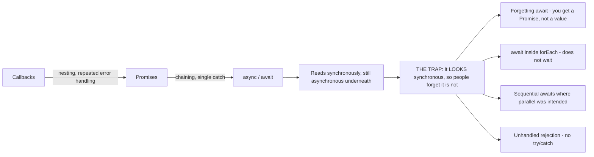
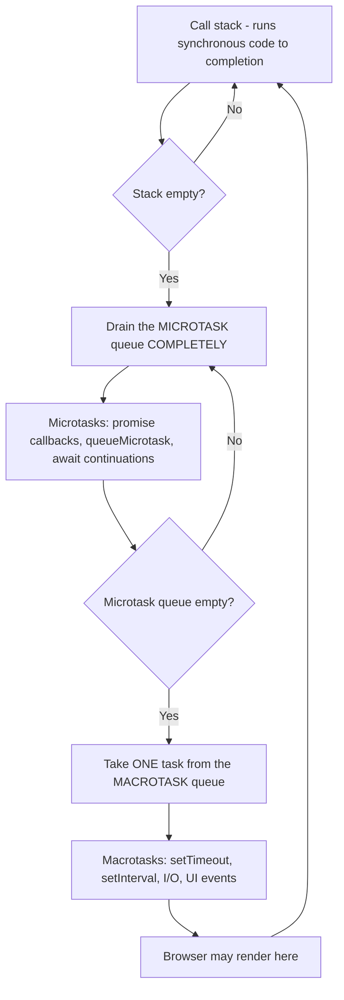
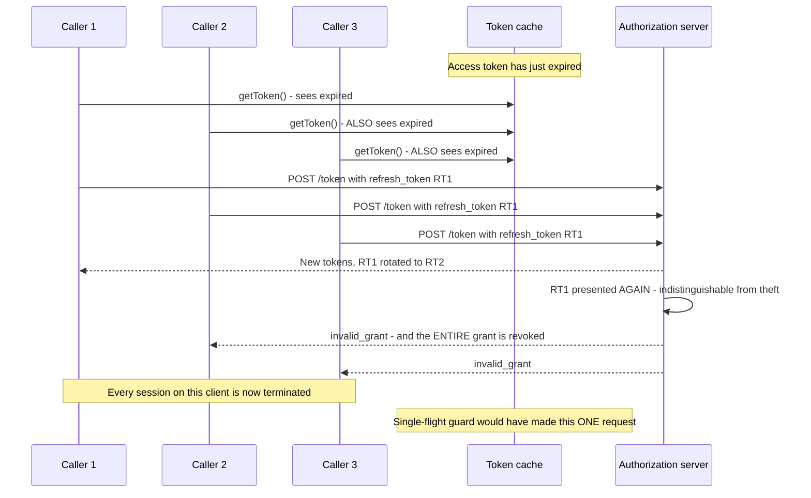
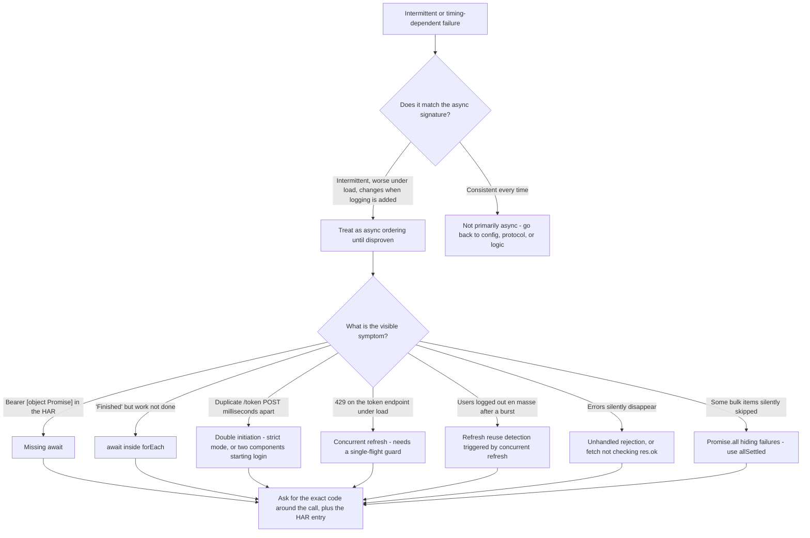

# Part 025 - Asynchronous JavaScript: Event Loop, Promises, async/await

> Section goal: Master asynchronous control flow, because every identity SDK call is asynchronous and async ordering bugs produce the most confusing tickets in the job — the ones where "it works sometimes", "it works locally but not in production", and "only under load" are all the same root cause.

Covers index item **025**. Maps to JD signals: *proficient in at least one programming language; ideally JavaScript*, *knowledge of software development fundamentals*, *strong analytical and problem-solving skills*, *instinctive ability to subdivide problems into basic components*, and *knowledge of common architectures*.

---

## 1. Start From Zero: Why Asynchrony Exists

JavaScript in a browser has **one thread**. If it stops to wait for a network request, the entire page freezes — no clicks, no scrolling, no rendering.

So instead of waiting, JavaScript **starts the work and moves on**, and arranges for something to happen later when the result arrives.

| Synchronous (Python's default) | Asynchronous (JavaScript's default) |
|---|---|
| `r = requests.get(url)` — blocks until done | `fetch(url)` — returns immediately with a *promise* |
| The next line has the result | The next line runs **before** the result exists |
| Simple to reason about | Requires explicit ordering |
| A slow call blocks everything | A slow call blocks nothing |

> **Analogy.** Ordering coffee. Synchronous is standing at the counter until it is made, blocking the queue. Asynchronous is being handed a buzzer and stepping aside — you carry on, and the buzzer goes off when it is ready.
>
> **Where it stops:** with one buzzer the analogy holds. With twenty buzzers going off in an order you did not choose, and some of them triggering further orders, the analogy stops being reassuring — and that is exactly where async bugs live.

### 🔍 Plain-English deep-dive: why this Part matters more than any other in Group C

Almost every identity operation is asynchronous:

| Operation | Why it is async |
|---|---|
| `loginWithRedirect()` | Network + navigation |
| `getAccessTokenSilently()` | Network, possibly an iframe, possibly a refresh |
| `getUser()` | May trigger a token fetch |
| `fetch()` to an API | Network |
| JWKS retrieval | Network |
| Every Action in the pipeline | Runs `async`, may call out |

That means **ordering is never guaranteed by the order you wrote the lines**. And async bugs share a diagnostic signature that makes them uniquely painful:

- They are **intermittent** — a race resolves differently depending on timing.
- They are **environment-sensitive** — faster or slower networks change the outcome.
- They **worsen under load** — contention changes ordering.
- They **often disappear when you add logging**, because logging changes the timing.

That last property is why developers report them as "impossible" bugs. Recognising the *signature* — intermittent, timing-sensitive, worse in production — and immediately suspecting async ordering is a genuinely high-value diagnostic instinct.

**Analogy:** a fault in a car that only happens above 70 mph, in the rain, when the car is full. **Where it stops:** you can put a car on a rig. You usually cannot reproduce a customer's production timing.

---

## 2. The Three Generations of Async

### Generation 1: Callbacks

```js
getToken(function (err, token) {
  if (err) return handle(err);
  callApi(token, function (err, data) {
    if (err) return handle(err);
    render(data);
  });
});
```

Works, but nests deeply ("callback hell") and error handling must be repeated at every level.

### Generation 2: Promises

A **promise** is an object representing a value that will exist later. It is always in one of three states:

| State | Meaning |
|---|---|
| **pending** | Not settled yet |
| **fulfilled** | Succeeded, with a value |
| **rejected** | Failed, with a reason |

Once settled, a promise **never changes state again**.

```js
getToken()
  .then(token => callApi(token))
  .then(data => render(data))
  .catch(err => handle(err))       // one handler for the whole chain
  .finally(() => stopSpinner());
```

### Generation 3: `async` / `await`

Syntactic sugar over promises that *reads* synchronously:

```js
async function load() {
  try {
    const token = await getToken();
    const data = await callApi(token);
    render(data);
  } catch (err) {
    handle(err);
  } finally {
    stopSpinner();
  }
}
```

**Two rules that matter:**

1. **An `async` function always returns a promise**, even if it returns a plain value.
2. **`await` only works inside an `async` function** (or at the top level of a module).



---

## 3. The Event Loop

This is the mental model that explains *ordering*, and it is the thing to be able to draw on a whiteboard.



### The rules, stated plainly

1. **Synchronous code runs to completion first.** Nothing async interrupts it.
2. **Then the entire microtask queue drains** — and microtasks added during draining are also run, before moving on.
3. **Then one macrotask runs**, then microtasks drain again, and so on.

**Promise callbacks are microtasks. `setTimeout` is a macrotask. Microtasks always win.**

### 🔍 Plain-English deep-dive: the ordering exercise everyone should be able to do

```js
console.log("1");

setTimeout(() => console.log("2"), 0);

Promise.resolve().then(() => console.log("3"));

(async () => {
  console.log("4");
  await null;
  console.log("5");
})();

console.log("6");
```

**Output: `1, 4, 6, 3, 5, 2`**

Walk it through:

| Step | Why |
|---|---|
| `1` | Synchronous |
| `2` scheduled | `setTimeout` → **macrotask** queue |
| `3` scheduled | `.then` → **microtask** queue |
| `4` | The async function body runs **synchronously up to the first `await`** |
| `5` scheduled | Everything after `await` becomes a **microtask** |
| `6` | Synchronous |
| — | **Stack empty. Drain microtasks:** `3`, then `5` |
| `2` | **Then** one macrotask |

**The two counter-intuitive facts:**

- **An `async` function starts running immediately and synchronously**, right up to its first `await`. It does not "go away and run later".
- **`setTimeout(fn, 0)` does not run "immediately"** — it runs after *every* pending microtask, which can be an unbounded amount of work.

**Why this matters in identity code:** a developer who uses `setTimeout(..., 0)` to "wait for the token to be ready" is relying on ordering that is not guaranteed and will change under load. The correct answer is always to `await` the actual promise.

**Analogy:** a kitchen that finishes every plate already on the pass before starting the next order, no matter how long the pass queue is. **Where it stops:** a kitchen has a human who can spot the queue growing. A microtask loop that keeps adding microtasks will starve macrotasks entirely and freeze the page.

---

## 4. The Six Async Bugs You Will Actually See

### Bug 1 — Forgetting `await`

```js
// BROKEN
const token = getAccessTokenSilently();   // token is a Promise, not a string
fetch(url, { headers: { Authorization: `Bearer ${token}` } });
```

The header becomes `Bearer [object Promise]`. The API returns 401 with a malformed-token error.

**Signature:** a 401 where the token in the HAR is literally `[object Promise]`. Once seen, never forgotten.

### Bug 2 — `await` inside `forEach`

```js
// BROKEN - forEach ignores the returned promise
users.forEach(async (u) => { await updateUser(u); });
console.log("done");     // prints IMMEDIATELY, before any update finishes

// CORRECT - sequential
for (const u of users) { await updateUser(u); }

// CORRECT - parallel
await Promise.all(users.map(u => updateUser(u)));
```

**Signature:** "the script says it finished but the data isn't updated", or a bulk operation that appears instant.

### Bug 3 — Sequential where parallel was intended

```js
// SLOW - 3 round trips in series
const a = await fetchA();
const b = await fetchB();
const c = await fetchC();

// FAST - concurrent
const [a, b, c] = await Promise.all([fetchA(), fetchB(), fetchC()]);
```

**Signature:** a page that takes three seconds when each call takes one. Not a correctness bug, but a real user-experience complaint.

### Bug 4 — Unhandled rejection

```js
// BROKEN - nothing catches this
async function init() { const t = await getToken(); }
init();     // if getToken rejects, the error vanishes into an unhandled rejection
```

**Signature:** "nothing happens and there's no error." In Node, unhandled rejections can terminate the process.

### Bug 5 — The concurrent-refresh stampede

```js
// BROKEN - ten simultaneous callers each trigger their own refresh
async function getToken() {
  if (isExpired(cached)) cached = await requestNewToken();
  return cached;
}
```

Ten callers arriving while expired all see `isExpired` as true, all call `requestNewToken`, and the token endpoint receives ten requests. With refresh-token rotation (Part 061), nine of those may be treated as **reuse** and revoke the whole grant.

```js
// CORRECT - single-flight
let inFlight = null;
async function getToken() {
  if (!isExpired(cached)) return cached;
  if (!inFlight) {
    inFlight = requestNewToken().finally(() => { inFlight = null; });
  }
  cached = await inFlight;
  return cached;
}
```

**Signature:** rate limiting or unexpected session termination that only happens under concurrency — exactly the "worse in production" pattern.



### Bug 6 — Race between two flows

```js
// Two components both call login on mount; two authorize requests race
```

**Signature:** `state` mismatch, or `invalid_grant` from a duplicate `/token` POST milliseconds apart in the HAR (Part 012). React's development strict mode deliberately double-invokes effects, which surfaces this — and developers often blame the SDK.

### 🔍 Plain-English deep-dive: why the single-flight pattern is the one to memorise

Of the six, Bug 5 is the one most worth being able to explain, because it connects three separate Parts and it is genuinely damaging.

The chain of consequences:

1. Multiple callers need a token at the same moment.
2. Each independently notices the cache is stale.
3. Each starts its own refresh.
4. The token endpoint sees a burst → **429** (Part 019).
5. If refresh-token rotation is enabled, the second and subsequent uses of the same refresh token look like **reuse**, which is a theft signal → **the entire grant is revoked** (Part 061).
6. Every user session on that client is terminated.

So a missing four-line guard escalates into a mass logout. And it only manifests under concurrency, which is why it passes every local test.

**Single flight** means: at most one refresh in progress; everyone else awaits the same promise. Four lines, and it removes the entire chain.

**Analogy:** ten people at a house discovering the door is locked, and all ten independently phoning a locksmith. Nine locksmiths arrive, the security system flags repeated access attempts, and the locks are changed. **Where it stops:** people would notice each other. Concurrent async callers cannot see each other unless you build the mechanism that lets them.

---

## 5. Error Handling Rules

| Situation | Correct handling |
|---|---|
| `await` inside `try` | `catch` receives the rejection normally |
| Promise chain | `.catch()` at the end catches the whole chain |
| `Promise.all` | **Rejects on the first failure** — the others still run but their results are lost |
| `Promise.allSettled` | Never rejects; returns status per promise. **Use for bulk operations** |
| `Promise.race` | Settles with the first to settle, success or failure. Useful for timeouts |
| `Promise.any` | Settles with the first *success* |
| Fire-and-forget | **Always attach a `.catch()`** or you get an unhandled rejection |

```js
// Bulk operation done correctly - you learn which items failed
const results = await Promise.allSettled(users.map(u => updateUser(u)));
const failed = results.filter(r => r.status === "rejected");
```

**Connect this to Part 018:** a bulk API call returning 200 does not mean every item succeeded. The client-side equivalent is `Promise.all` hiding which items failed. `allSettled` is the client-side fix for exactly the same mistake.

### A `fetch` trap worth knowing

```js
const res = await fetch(url);
// fetch does NOT reject on 4xx or 5xx - it only rejects on NETWORK failure
if (!res.ok) { throw new Error(`HTTP ${res.status}`); }
const data = await res.json();
```

A developer who wraps `fetch` in `try/catch` and expects a 401 to be caught will find their `catch` never runs. `res.ok` must be checked explicitly. This is a frequent cause of "our error handling doesn't fire."

---

## 6. Failure Modes

| Failure mode | Symptom | Consequence | Correction |
|---|---|---|---|
| **Missing `await`** | `Bearer [object Promise]` in the HAR | 401 with a malformed token | Add `await` |
| **`await` in `forEach`** | "Finished" before work completed | Silent partial execution | `for...of` or `Promise.all` |
| **Sequential awaits** | Slow page load | Poor experience, timeouts | `Promise.all` |
| **Unhandled rejection** | "Nothing happens, no error" | Errors vanish; Node may exit | `try/catch` or `.catch()` |
| **Concurrent refresh** | 429s, or mass logout under load | **Grant revoked by reuse detection** | Single-flight guard |
| **Double-invoked effect** | Duplicate `/token`, `invalid_grant` | Login fails intermittently | Guard initiation; understand strict mode |
| **`Promise.all` for bulk** | "Some updates didn't apply" | Failures hidden by the first rejection | `Promise.allSettled` |
| **`fetch` not checking `ok`** | Error handling never fires on 401 | Bad data flows onward | Check `res.ok` |
| **`setTimeout` to sequence** | Works locally, fails under load | Timing-dependent correctness | `await` the real promise |
| **Logging changes behavior** | "It works when I add a console.log" | Confirms a race — do not treat as a fix | Find the actual ordering dependency |
| **Blocking the event loop** | UI freezes | Microtask starvation or heavy sync work | Break work up; move heavy work off-thread |

---

## 7. Troubleshooting Decision Tree: Diagnosing an Async Bug



### Worked example

*"Every few days, all our users get logged out at once. We can't reproduce it. Nothing in our code changed."*

1. **"All at once" plus "can't reproduce" plus "every few days"** — that is not a code bug that fires randomly; it is a *condition* being met occasionally.
2. **Ask what the tenant log shows** at that moment. Answer: a burst of refresh-token exchanges, then a grant revocation event.
3. **Recognise the pattern:** refresh-token rotation with reuse detection (Part 061). Reuse detection revoked the grant because the same refresh token was presented more than once.
4. **Ask how they refresh.** They send the code:
   ```js
   async function getToken() {
     if (isExpired(cached)) cached = await requestNewToken();
     return cached;
   }
   ```
5. **The mechanism:** when the token expires, every concurrent caller sees `isExpired` as true simultaneously. Ten components refresh at once, each presenting the same refresh token. The first rotates it; the rest present the now-consumed one. **That looks exactly like token theft**, so the platform correctly revokes the grant.
6. **Why "every few days":** it needs expiry to coincide with concurrent activity. Low traffic, rarely. Peak traffic, sometimes.
7. **Why it never reproduces locally:** one user, one tab, no concurrency.
8. **Fix:** the single-flight guard from §4 — four lines.
9. **The concept to teach:** reuse detection is working correctly. It cannot distinguish "our own code refreshed twice" from "an attacker replayed a stolen token", and it must assume the worse case. The fix belongs in the client, not in the platform's protection.
10. **Prevention:** a concurrency test that calls `getToken()` from ten callers simultaneously against an expired cache and asserts exactly one network request.

That answer converts an "impossible, intermittent" ticket into a four-line fix and a teachable concept — and it spans Parts 019, 025, and 061.

---

## 8. Lab: See the Event Loop and Break It

**Purpose.** Make async ordering observable, and reproduce each of the six bugs so you recognise them from their symptoms.

**Prerequisites.** Node.js from Part 007. Part 024's lab. Nothing sensitive.

**Steps.**

1. Create `okta-prep/labs/025-async/`.
2. **Ordering exercise.** Write the §3 snippet. **Predict the output in a comment before running.** Run it. Record whether you were right. Then add a second `await` and a nested `.then()` and predict again.
3. **Async starts synchronously.** Write a script proving that an `async` function body executes up to its first `await` before the caller's next line. Record it.
4. **Microtask starvation.** Write a loop that schedules a microtask which schedules another microtask, 10,000 times, alongside a `setTimeout(..., 0)`. Observe the timeout being delayed. **Record the measured delay.**
5. **Bug 1 — missing `await`.** Write a fake `getToken()` that resolves to a string. Build a header both with and without `await`, and print both. **Record the literal `Bearer [object Promise]` string** — this is the HAR signature.
6. **Bug 2 — `forEach`.** Reproduce the `forEach` version and the `for...of` version with an artificial delay. Record which prints "done" first.
7. **Bug 3 — sequential vs parallel.** Time three 500 ms fake calls in series and via `Promise.all`. Record both durations.
8. **Bug 4 — unhandled rejection.** Trigger one and record Node's exact warning text and exit behavior.
9. **Bug 5 — the stampede, then the fix.** Write a fake `requestNewToken()` that increments a counter and takes 300 ms. Call `getToken()` from ten callers simultaneously against an expired cache. **Record the counter: it should be 10.** Then add the single-flight guard and re-run. **Record the counter: it should be 1.** This is the most valuable artifact in the lab.
10. **`Promise.all` vs `allSettled`.** Run five operations where two reject. Record what each returns and what information is lost with `all`.
11. **`fetch` and `res.ok`.** Against your own local server from Part 015, return a 401 and show that `try/catch` around `fetch` does **not** catch it. Then add the `res.ok` check.
12. **Reference + catalog.** Write `async-bugs.md`: six bugs, each with its symptom, the code that causes it, the fix, and which Part it connects to. Add rows to the failure catalog. Complete `MANIFEST.md`.

**Expected evidence.** A predicted-versus-actual ordering record, a starvation measurement, six reproduced bugs with exact outputs, the ten-to-one stampede counter proof, an `all`/`allSettled` contrast, a `res.ok` demonstration, and a six-bug reference.

**Validation rubric.**

| Check | Pass condition |
|---|---|
| Prediction first | Your predicted output written before running, and marked right or wrong |
| Ordering understood | You can explain each position in `1, 4, 6, 3, 5, 2` |
| Starvation measured | An actual delay figure recorded |
| `[object Promise]` captured | The literal string recorded as the HAR signature |
| Stampede proven | Counter of 10 before the guard, 1 after |
| `allSettled` contrast | You recorded exactly what information `all` discards |
| `res.ok` shown | `try/catch` demonstrated not to catch a 401 |
| All local | No real tenant traffic; fakes and local servers only |

**Cleanup and privacy.** Everything is local, with fake token strings and synthetic delays. Do **not** run the stampede test against a real tenant — deliberately triggering refresh-token reuse detection against a live tenant could revoke real grants and would breach the Part 007 charter. Simulate it with a counter.

---

## 9. JD Mapping

| Supplied JD signal | How this Part supports it |
|---|---|
| **Proficient in a programming language; ideally JavaScript** | Async is the hardest and most job-relevant part of JavaScript |
| Knowledge of software development fundamentals | Concurrency, races, and error propagation are core fundamentals |
| Strong analytical and problem-solving skills | §7's signature-based recognition of intermittent failures |
| **Instinctive ability to subdivide problems** | §7's worked example decomposes "impossible bug" into a four-line cause |
| Knowledge of common architectures | §4's single-flight pattern is an architectural fix, not a code tweak |
| Promote best practices | `allSettled` for bulk, `res.ok` checks, single-flight refresh |
| Business and technical analysis skills | Explaining that reuse detection is working correctly and the fix belongs client-side |

---

## 10. Candidate Honesty Note

- **This is the highest-leverage Part in Group C.** If your JavaScript study time is limited, spend it here — async ordering explains a disproportionate share of hard identity tickets.
- **The strongest thing you can say:** *"The one I'd look for first on an intermittent logout is a concurrent-refresh stampede. Multiple callers each trigger their own refresh, rotation treats the repeats as reuse, and the grant gets revoked — so a missing four-line single-flight guard becomes a mass logout. I reproduced it with a counter: ten callers, ten network requests before the guard, one after."*
- **A second strong point:** *"Async bugs have a signature — intermittent, worse under load, and they often disappear when you add logging. When I hear all three, I suspect ordering before I suspect configuration."*
- **Be honest about depth:** you can read and reason about async code and diagnose these patterns. You have not built high-concurrency production systems. Both statements are true and the first is what the role needs.
- **If asked to reason live**, walk the event loop out loud — synchronous first, then microtasks fully, then one macrotask. Showing the model is worth more than reciting the answer.

---

## 11. Official Source Anchors

Accessed **26 August 2026**.

| Source | What it defines |
|---|---|
| MDN — Promises, `async`/`await`, the event loop | The authoritative practical explanations for §§2–3 |
| ECMAScript specification — job queues and promise semantics | Formal microtask ordering |
| HTML Standard — event loop processing model | Where rendering fits relative to tasks and microtasks |
| MDN — `Promise.all`, `allSettled`, `race`, `any` | §5's combinator table |
| MDN — `fetch` and the `Response` interface | Why `fetch` does not reject on 4xx/5xx |
| Node.js documentation — unhandled rejections and `process` events | §4's Bug 4 behavior |
| Auth0 and Okta JavaScript SDK documentation — silent token acquisition | Real async APIs and their documented concurrency behavior |
| React documentation — strict mode and double-invoked effects | §4's Bug 6, and why it surfaces in development |

**Revalidate after 26 August 2026:** SDK method names and framework behavior. Event-loop semantics are stable.

---

## ⭐ Likely Interview Questions for This Section

### Q1. "Explain the event loop."
> *Model answer:* "JavaScript has one thread, so it can't block. The event loop is how it stays responsive. Synchronous code runs to completion first — nothing interrupts it. Then the entire microtask queue drains, and microtasks added during draining also run before moving on. Then exactly one macrotask runs, then microtasks drain again, and so on. Promise callbacks and `await` continuations are microtasks; `setTimeout`, I/O, and UI events are macrotasks. Two consequences catch people out. An `async` function starts running immediately and synchronously up to its first `await` — it doesn't go away and run later. And `setTimeout(fn, 0)` doesn't run immediately; it runs after every pending microtask, which can be an unbounded amount of work. That's why using `setTimeout` to 'wait for the token to be ready' works locally and fails under load."

### Q2. "A customer's API returns 401 and the token looks like `Bearer [object Promise]`. What happened?"
> *Model answer:* "A missing `await`. They called something like `getAccessTokenSilently()` without awaiting it, so the variable holds a Promise object rather than the token string, and template-literal interpolation stringifies it to `[object Promise]`. It's a satisfying one because the evidence is unmistakable — once you've seen that literal string in a HAR you never mistake it again. The fix is one keyword. The thing I'd add for their benefit is *why* it's easy to miss: `async`/`await` makes asynchronous code read synchronously, so it stops looking like something you have to wait for. And I'd suggest a lint rule for floating promises, because this class of bug is entirely preventable by tooling rather than by vigilance."

### Q3. "Every few days all of a customer's users get logged out at once and they can't reproduce it. Where do you look?"
> *Model answer:* "Concurrent refresh triggering reuse detection. The pattern is: their token cache has no single-flight guard, so when the access token expires, every concurrent caller independently sees the cache as stale and each starts its own refresh. They all present the same refresh token. The first one rotates it; the rest present a token that's already been consumed — which is indistinguishable from an attacker replaying a stolen token, so the platform correctly revokes the whole grant and everyone is logged out. It's 'every few days' because it needs expiry to coincide with concurrent activity, and it never reproduces locally because one developer in one tab has no concurrency. I'd confirm from the tenant log — a burst of refresh exchanges followed by a revocation event. The fix is a four-line single-flight guard: at most one refresh in progress, everyone else awaits the same promise."

### Q4. "Why doesn't `await` work inside `forEach`?"
> *Model answer:* "Because `forEach` ignores the value its callback returns, and an `async` callback returns a promise. So `forEach` fires off all the callbacks, discards every promise, and returns immediately — meaning the line after it runs before any of the work has finished. The symptom is a script that reports 'done' while the data is still unchanged, or a bulk operation that appears instant. There are two correct forms depending on intent: a `for...of` loop with `await` inside if you genuinely need them sequential, or `await Promise.all(items.map(...))` if they can run concurrently. And for bulk work I'd usually reach for `Promise.allSettled` instead, because `Promise.all` rejects on the first failure and you lose the results of everything else — which is the same mistake as checking only the HTTP status on a bulk API call and missing the per-item failures."

### Q5. "A `try/catch` around `fetch` isn't catching a 401. Why?"
> *Model answer:* "Because `fetch` doesn't reject on HTTP error statuses — it only rejects on a genuine network failure, like DNS failing or the connection dropping. A 401, 404, or 500 is a *successful* fetch as far as the promise is concerned; it resolved and gave you a response. So the `catch` block never runs and the code carries on with an error response it thinks is data. The fix is to check `res.ok` explicitly and throw if it's false. It's a very common cause of 'our error handling doesn't fire', and it's worth flagging because the downstream effect is usually worse than the original error — the code proceeds with an unexpected shape and fails somewhere unrelated, which sends the developer looking in the wrong place entirely."

### Q6. "What's the signature of an async bug?"
> *Model answer:* "Three things together. It's intermittent rather than deterministic. It gets worse under load or in production, because contention changes the ordering. And it often disappears when you add logging, because logging changes the timing — which is why developers report these as impossible bugs. When I hear all three, I suspect ordering before I suspect configuration. The specific things I'd then look for are: a duplicate `/token` POST milliseconds apart in the HAR, which is double initiation; a burst on the token endpoint, which is a concurrent-refresh stampede; or work that reports complete before it is. And I'd caution the customer explicitly that 'it works when I add a console.log' is a *confirmation* of a race, not a fix — I've seen that shipped as a workaround."

### Q7. "When would you use `Promise.all` versus `allSettled`?"
> *Model answer:* "`Promise.all` when I need every operation to succeed and there's no useful partial result — for example, gathering three pieces of data that are all required to render a page. It rejects on the first failure, which is what you want there. `allSettled` for bulk operations where I need to know *which* items failed — a user import, a batch update, anything where partial success is meaningful. `all` discards the results of everything else once one rejects, so you lose exactly the information you need to retry or report. It's the same mistake as checking only the HTTP status on a bulk API call and missing the per-item results — you get a binary answer where you needed a per-item one. `race` and `any` are narrower: `race` for implementing a timeout, `any` when you want the first success and don't care about the failures."

### Q8. "Walk me through the output of a mixed sync, `setTimeout`, and promise snippet."
> *Model answer:* "I'd narrate the model rather than just give the answer. Synchronous lines run first, in order. `setTimeout` schedules a macrotask. A `.then` schedules a microtask. An `async` function body runs *synchronously* up to its first `await`, and everything after the `await` becomes a microtask. So for the standard example — a log, a `setTimeout`, a resolved promise's `.then`, an async IIFE that logs then awaits then logs, and a final log — the output is `1, 4, 6, 3, 5, 2`. The synchronous ones first: 1, then 4 because the async body starts immediately, then 6. Stack empties, microtasks drain in order queued: 3, then 5. Then one macrotask: 2. The two surprises for most people are that 4 comes before 6, and that the `setTimeout` with zero delay comes dead last."

---

## 🧠 30-Second Memory Hooks

- **Sync to completion → drain ALL microtasks → ONE macrotask → repeat.**
- **Promises and `await` continuations = microtasks. `setTimeout` = macrotask. Microtasks always win.**
- **An `async` function runs SYNCHRONOUSLY up to its first `await`.**
- **`setTimeout(fn, 0)` runs after every pending microtask** — never use it to sequence.
- **`Bearer [object Promise]` in a HAR = missing `await`.** Unmistakable.
- **`await` inside `forEach` does nothing.** Use `for...of` or `Promise.all`.
- **Concurrent refresh + rotation = reuse detection = MASS LOGOUT.** Fix with a **single-flight guard**.
- **`Promise.all` rejects on first failure and loses the rest. `allSettled` for bulk.**
- **`fetch` does NOT reject on 4xx/5xx.** Check `res.ok`.
- **Async signature: intermittent · worse under load · disappears when you add logging.**
- **"It works when I add a console.log" confirms a race. It is not a fix.**

---

## ✅ Completion Checklist

- [ ] **Knowledge:** I can explain the event loop, predict a mixed sync/micro/macro ordering, and describe the single-flight pattern.
- [ ] **Lab artifact:** `025-async/` contains a predicted-versus-actual ordering record, the ten-to-one stampede counter proof, six reproduced bugs, and a six-bug reference.
- [ ] **Spoken:** I can deliver the mass-logout diagnosis — stampede, reuse detection, single-flight fix — in under 90 seconds.
- [ ] **Honesty check:** the stampede was simulated locally with a counter; no real tenant grant was ever put at risk.
- [ ] **Source check:** I have read MDN's event-loop page and the `fetch` page's note on error handling myself.

---

*Next suggested section:* **[Part 026 - DOM, Events, fetch, and Browser Errors](Part-026-dom-events-fetch-and-browser-errors.md)** — with async understood, the last browser-side layer: how a page actually reacts, and how to map a console message to a network cause.
